# Part 059 — 30/60/90-Day Cloud Onboarding Plan

> Goal: setelah menyelesaikan part ini, Anda punya rencana onboarding cloud yang konkret untuk menjadi efektif di tim enterprise backend: bisa membaca environment, network, identity, deployment flow, observability, cost, security, incident history, dan production readiness tanpa menebak-nebak detail internal.

Part ini bukan roadmap belajar AWS/Azure secara umum. Ini adalah **onboarding plan untuk senior Java/JAX-RS engineer** yang masuk ke sistem enterprise production dengan Kubernetes, PostgreSQL, Kafka/RabbitMQ, Redis, Camunda, NGINX, GitOps/IaC, private networking, hybrid/on-prem connectivity, dan cloud/on-prem deployment.

Fokusnya adalah menghasilkan kemampuan kerja nyata:

- tahu di mana aplikasi berjalan,
- tahu bagaimana request masuk,
- tahu bagaimana service keluar ke dependency,
- tahu identity runtime yang dipakai pod/service,
- tahu cara membaca log/metric/trace,
- tahu cara deployment dipromosikan,
- tahu apa yang berbahaya untuk diubah,
- tahu siapa yang harus ditanya untuk hal yang tidak boleh diasumsikan.

Prinsip utama:

> Jangan mulai dari menghafal service cloud. Mulai dari membaca sistem production yang benar-benar Anda operasikan.

---

## 1. Mental Model Onboarding

Onboarding cloud yang efektif harus menjawab lima pertanyaan besar.

```text
1. Where does the workload run?
2. How does traffic reach it?
3. What identities does it use?
4. What dependencies does it call?
5. How do we observe, deploy, recover, and govern it?
```

Untuk sistem Java/JAX-RS enterprise, jawabannya biasanya tersebar di banyak tempat:

- AWS account atau Azure subscription,
- VPC/VNet diagram,
- EKS/AKS cluster,
- Kubernetes manifests,
- Helm values,
- Terraform modules,
- GitOps repo,
- CI/CD pipeline,
- secret/config manager,
- service catalog,
- database/broker/cache dashboards,
- logs/metrics/traces,
- incident notes,
- security review notes,
- internal runbook.

Kesalahan onboarding yang umum:

- hanya belajar AWS/Azure console tanpa mengerti aplikasi,
- hanya membaca kode Java tanpa mengerti network path,
- hanya melihat Kubernetes namespace tanpa mengerti account/subscription boundary,
- hanya melihat logs tanpa tahu request path,
- hanya melihat deployment pipeline tanpa tahu rollback dan blast radius,
- hanya bertanya “service apa yang dipakai?” bukan “dependency mana yang paling kritis dan bagaimana failure-nya terlihat?”.

---

## 2. Output yang Harus Dihasilkan Selama Onboarding

Selama 90 hari, targetnya bukan sekadar “paham cloud”. Targetnya adalah membuat artefak pemahaman yang bisa dipakai ulang.

Minimal artefak pribadi yang sebaiknya Anda bangun:

| Artefak | Isi | Kenapa penting |
|---|---|---|
| Environment map | dev/test/staging/prod, account/subscription, cluster, namespace | Menghindari salah environment. |
| Traffic flow map | DNS → edge/WAF/gateway/LB → ingress → service → pod | Membantu debugging 502/503/504 dan latency. |
| Dependency map | PostgreSQL, Kafka/RabbitMQ, Redis, object storage, secrets/config, external APIs | Menentukan blast radius. |
| Identity map | IAM role, managed identity, service principal, service account, RBAC | Membantu debugging AccessDenied. |
| Network map | VPC/VNet, subnet, route table, NAT, firewall, private endpoint, DNS | Membantu debugging connectivity. |
| Deployment flow | CI/CD, image registry, Helm/GitOps, approvals, rollback | Membantu release safely. |
| Observability map | log query, dashboards, alerts, traces, correlation IDs | Membantu incident triage. |
| Runbook notes | common failures, escalation, safe commands | Membantu production support. |
| PR review checklist | networking, identity, config, secret, cost, resilience | Membantu kontribusi senior. |

Semua artefak ini harus diberi label jelas:

```text
Verified
Partially verified
Assumption
Unknown
Internal verification required
```

Jangan campur asumsi dengan fakta.

---

## 3. First 30 Days — Orientation and System Reading

Fokus 30 hari pertama adalah **membaca sistem**, bukan mengubah sistem besar.

Target utama:

- memahami boundary cloud,
- memahami environment,
- memahami cluster,
- memahami request path,
- memahami identity runtime,
- memahami observability dasar,
- memahami deployment flow dasar,
- memahami siapa owner tiap area.

### 3.1 Account, Subscription, and Environment Map

Cari tahu:

- AWS account mana yang dipakai,
- Azure subscription mana yang dipakai,
- environment mana yang dipisah account/subscription,
- apakah ada shared services account/subscription,
- apakah ada network hub account/subscription,
- apakah ada centralized logging/security account,
- apakah prod terisolasi secara policy dan access,
- apakah sandbox boleh mengakses resource shared.

Pertanyaan yang harus dijawab:

```text
Apakah dev/test/prod benar-benar isolated, atau hanya berbeda namespace?
Apakah prod punya account/subscription sendiri?
Apakah identity, logs, registry, dan network dikelola terpusat?
Apakah ada customer/tenant isolation requirement?
```

Internal verification checklist:

- AWS Organization / Azure Management Group hierarchy.
- Account/subscription list.
- Environment naming convention.
- Resource group naming convention.
- Tagging standard.
- Access boundary.
- Billing/cost allocation boundary.
- Platform/security ownership.

### 3.2 Cluster and Namespace Orientation

Untuk EKS/AKS, cari tahu:

- cluster name,
- Kubernetes version,
- public/private endpoint,
- node group/node pool,
- namespace per aplikasi,
- ingress controller,
- service mesh jika ada,
- CNI mode,
- storage class,
- autoscaler,
- add-ons,
- logging/monitoring agent.

Pertanyaan yang harus dijawab:

```text
Aplikasi Java/JAX-RS berjalan di namespace apa?
Ingress-nya lewat apa?
Service account yang dipakai apa?
Node pool mana yang menjalankan workload?
Apakah cluster private?
Apakah pod IP berasal dari VPC/VNet?
```

Internal verification checklist:

- EKS/AKS cluster list.
- Namespace list.
- Deployment/statefulset/cronjob list.
- Service/Ingress/Gateway resource.
- ServiceAccount annotation.
- Node group/node pool labels.
- NetworkPolicy.
- StorageClass.
- Autoscaler.
- Observability agent.

### 3.3 Traffic Flow Reading

Ambil satu API penting. Gambar request path-nya.

Contoh:

```text
Client
  → public/private DNS
  → CDN/front door if used
  → WAF
  → API Gateway/APIM
  → ALB/Application Gateway/NLB/Azure Load Balancer
  → NGINX ingress
  → Kubernetes Service
  → EndpointSlice
  → Pod
  → Java/JAX-RS resource method
  → database/broker/cache/cloud SDK dependency
```

Yang harus diverifikasi:

- DNS record,
- TLS termination point,
- gateway route,
- load balancer listener,
- health check,
- ingress path,
- service selector,
- pod readiness/liveness,
- timeout per layer,
- correlation header.

Failure mode yang harus dipahami sejak awal:

| Symptom | Kemungkinan layer |
|---|---|
| DNS NXDOMAIN | Public/private DNS, private zone binding, resolver forwarding |
| 401/403 | Gateway auth, app auth, IAM/RBAC, token audience |
| 404 | Gateway route, ingress path, app route |
| 502 | Gateway/LB cannot reach backend, TLS mismatch, connection reset |
| 503 | No healthy target, pod not ready, service selector mismatch |
| 504 | Timeout chain, slow downstream, connection pool saturation |

### 3.4 Identity and Access Orientation

Untuk setiap workload penting, cari:

- Kubernetes ServiceAccount,
- AWS IAM role for service account atau Azure Workload Identity,
- IAM/RBAC permission,
- secret access,
- object storage access,
- database credential model,
- registry pull identity,
- CI/CD deployment identity.

Pertanyaan utama:

```text
Apakah workload memakai static secret, IRSA, managed identity, workload identity, atau service principal?
Apakah permission scoped ke resource spesifik?
Apakah role assignment ada di scope subscription/resource group/resource?
Apakah IAM policy menggunakan wildcard yang berbahaya?
```

Internal verification checklist:

- IAM role / managed identity / service principal.
- Trust policy / federated credential.
- Kubernetes ServiceAccount.
- RBAC role binding.
- Secret manager access.
- CloudTrail / Azure Activity Log evidence.
- Break-glass process.

### 3.5 Observability Orientation

30 hari pertama Anda harus tahu “di mana mencari fakta produksi”.

Cari:

- application logs,
- platform logs,
- Kubernetes events,
- ingress logs,
- gateway logs,
- load balancer metrics,
- database metrics,
- broker metrics,
- Redis metrics,
- trace dashboard,
- alert dashboard,
- incident channel.

Minimal query yang harus Anda simpan:

```text
Find logs by correlation ID
Find logs by pod name
Find 5xx by route
Find latency p95/p99 by route
Find downstream error by dependency
Find AccessDenied/AuthorizationFailed
Find DNS/connect timeout
Find pod restarts/OOMKilled
Find image pull failure
Find secret/config retrieval error
```

Internal verification checklist:

- CloudWatch log group / Azure Log Analytics workspace.
- Dashboard URL.
- Alert rule list.
- Trace tool.
- Correlation ID standard.
- Retention policy.
- Log cost owner.
- PII logging guideline.

---

## 4. Days 31–60 — Integration, Private Connectivity, and Runtime Behavior

Fokus 31–60 hari adalah memahami bagaimana aplikasi benar-benar berinteraksi dengan dependency cloud dan enterprise systems.

Target utama:

- private connectivity,
- cloud SDK behavior,
- secret/config runtime behavior,
- object storage flow,
- CI/CD and GitOps flow,
- database/broker/cache dependencies,
- failure scenarios.

### 4.1 Private Connectivity Deep Reading

Untuk setiap dependency, klasifikasikan aksesnya:

```text
Public internet
NAT egress
Private endpoint / VPC endpoint
PrivateLink
VNet/VPC peering
Transit Gateway / Virtual WAN
VPN / Direct Connect / ExpressRoute
On-prem internal network
```

Tabel yang harus dibuat:

| Dependency | Access path | DNS name | Private IP? | Auth | Owner | Failure evidence |
|---|---|---|---|---|---|---|
| PostgreSQL | Private subnet/private endpoint | internal hostname | yes/no | DB credential/IAM/etc | DBA/platform | DB metric/log |
| Kafka/RabbitMQ | Private broker endpoint | internal hostname | yes/no | SASL/TLS/etc | Platform | broker metric/log |
| Redis | Private endpoint/subnet | internal hostname | yes/no | AUTH/ACL | Platform | cache metric/log |
| S3/Blob | VPC endpoint/private endpoint/NAT | service endpoint | yes/no | IAM/RBAC/SAS | Platform/app | SDK error/log |
| Secrets/config | Private/public endpoint | provider endpoint | yes/no | workload identity | Platform/security | SDK error/audit |

Pertanyaan utama:

```text
Apakah pod keluar lewat NAT padahal seharusnya private endpoint?
Apakah DNS resolve ke private IP?
Apakah firewall/NSG/security group mengizinkan path itu?
Apakah route table mengarah ke jalur yang benar?
Apakah on-prem dapat resolve private DNS yang sama?
```

### 4.2 Cloud SDK Behavior Reading

Untuk Java/JAX-RS service, cari semua integrasi SDK:

- AWS SDK clients,
- Azure SDK clients,
- object storage client,
- secret/config client,
- messaging client,
- cloud identity client,
- custom HTTP client ke cloud service.

Untuk tiap client, verifikasi:

- credential provider chain,
- region/endpoint configuration,
- timeout,
- retry,
- backoff/jitter,
- pagination,
- async/threading model,
- connection pool,
- error mapping,
- logging/metrics.

Anti-pattern yang harus dicari:

```text
No explicit timeout
Default retry ignored
Retry inside retry
Unbounded async concurrency
List operation without pagination handling
SDK client created per request
Credential hardcoded in env var/static secret
Endpoint override undocumented
No dependency-specific metric
AccessDenied mapped to generic 500
Throttling treated as permanent failure
```

### 4.3 Secret and Config Runtime Behavior

Cari tahu:

- config berasal dari mana,
- secret berasal dari mana,
- apakah config/secret di-load saat startup atau runtime,
- apakah ada cache,
- apakah reload otomatis,
- apa yang terjadi jika secret manager/config service down,
- apakah secret rotation pernah diuji.

Pertanyaan utama:

```text
Jika Key Vault/Secrets Manager tidak reachable saat startup, service gagal start atau fallback?
Jika secret di-rotate, apakah pod perlu restart?
Jika config salah, bagaimana rollback?
Apakah secret pernah muncul di logs, env dump, exception, atau dashboard?
```

### 4.4 Deployment Flow and Promotion

Baca pipeline dari commit sampai production.

```text
Commit
  → build
  → unit/integration test
  → container image build
  → image scan
  → push to ECR/ACR
  → artifact promotion
  → Terraform/Helm/GitOps change
  → approval
  → sync/deploy
  → smoke test
  → monitoring
  → rollback if needed
```

Yang harus diverifikasi:

- siapa bisa deploy ke prod,
- identity apa yang digunakan pipeline,
- apakah OIDC federation digunakan,
- apakah ada static cloud key,
- apakah image dipromosikan by digest,
- apakah Helm values berbeda per environment,
- apakah Terraform plan direview,
- apakah GitOps auto-sync/manual-sync,
- apakah rollback tested.

### 4.5 Dependency Failure Study

Pilih satu incident lama atau simulasi non-prod. Pelajari bagaimana failure terlihat.

Contoh skenario:

- database connection pool exhausted,
- Kafka broker unreachable,
- RabbitMQ queue backlog,
- Redis failover,
- object storage timeout,
- secret retrieval failure,
- private endpoint DNS salah,
- API gateway throttling,
- load balancer target unhealthy,
- image pull failure,
- pod cannot assume role/managed identity.

Untuk tiap failure, catat:

```text
Symptom
First dashboard to check
First log query
Likely owner
Safe mitigation
Unsafe mitigation
Rollback option
Evidence needed for RCA
```

---

## 5. Days 61–90 — Contribution, Review, and Operational Leverage

Fokus 61–90 hari adalah mulai memberi kontribusi yang berdampak:

- reliability improvement,
- observability improvement,
- cost visibility,
- security hardening,
- PR/ADR review,
- runbook improvement,
- incident learning.

### 5.1 Reliability Contribution

Cari satu dependency yang sering menjadi sumber risiko. Buat improvement kecil tetapi nyata.

Contoh:

- tambah timeout eksplisit di SDK client,
- tambah circuit breaker untuk dependency lambat,
- tambah metric per dependency,
- ubah retry policy agar tidak retry storm,
- tambah readiness check yang lebih akurat,
- dokumentasikan private endpoint troubleshooting,
- tambah alert untuk queue lag atau DB saturation,
- tambah dashboard p95/p99 latency per route.

Kriteria contribution yang baik:

```text
Small blast radius
Observable
Rollbackable
Backed by incident evidence or measured gap
Aligned with platform/security standard
Reviewed by owner
```

### 5.2 Observability Contribution

Target observability bukan “lebih banyak log”. Targetnya adalah **faster diagnosis**.

Perbaikan yang bernilai:

- standard correlation ID,
- trace propagation HTTP + messaging,
- dependency error classification,
- dashboard untuk golden signals,
- alert dengan runbook link,
- log retention adjustment,
- PII log cleanup,
- log sampling atau cardinality control,
- Kubernetes event visibility.

Checklist:

- Apakah alert actionable?
- Apakah dashboard punya owner?
- Apakah metric punya label/cardinality yang aman?
- Apakah log bisa dicari by correlation ID?
- Apakah trace menyeberang HTTP dan broker?
- Apakah runbook link tersedia di alert?

### 5.3 Cost and Capacity Contribution

Cari cost driver yang terkait backend/Kubernetes:

- overprovisioned pods,
- idle node pool,
- NAT gateway traffic,
- cross-AZ traffic,
- log ingestion besar,
- high-cardinality metrics,
- over-retention logs,
- oversized database,
- unused load balancer,
- object storage lifecycle tidak aktif,
- Redis tier terlalu besar.

Kontribusi yang aman:

- tagging fix,
- dashboard cost by environment/service,
- retention tuning proposal,
- object lifecycle proposal,
- right-sizing recommendation berbasis metric,
- alert untuk subnet IP capacity atau quota.

Jangan langsung resize production tanpa evidence.

### 5.4 Security Contribution

Cari hardening kecil yang jelas:

- remove wildcard IAM permission,
- scope role assignment lebih spesifik,
- enforce private endpoint,
- remove public IP exposure,
- enable registry scan,
- add secret rotation evidence,
- improve Key Vault/Secrets Manager auditability,
- add object storage public access check,
- add WAF false positive review process,
- document emergency access.

Kriteria hardening yang baik:

```text
Does not break production unexpectedly
Has owner approval
Has rollback
Has audit evidence
Has non-prod validation
```

### 5.5 PR and ADR Review Participation

Mulai aktif review perubahan yang menyentuh:

- network route,
- DNS,
- ingress/gateway,
- private endpoint,
- IAM/RBAC,
- workload identity,
- secret/config,
- object storage,
- SDK integration,
- observability,
- cost,
- resilience,
- DR.

Pertanyaan senior yang harus muncul:

```text
What is the runtime identity?
What is the network path?
Is DNS public or private?
Where is TLS terminated?
What is the timeout chain?
What happens on dependency failure?
How is this observed?
How is this rolled back?
What is the cost driver?
What evidence proves this is safe for prod?
What internal team must approve this?
```

---

## 6. Questions to Ask Platform Team

Tanya dengan konteks, bukan generic.

Pertanyaan bagus:

- Bagaimana account/subscription/environment dipisahkan?
- Apakah ada landing zone standard yang wajib diikuti?
- Bagaimana VPC/VNet dirancang untuk workload ini?
- Mana subnet untuk ingress, worker node, private endpoint, database, dan shared services?
- Apakah cluster EKS/AKS private atau public endpoint?
- CNI mode apa yang digunakan dan apa constraint IP/subnet-nya?
- Bagaimana pod mengakses AWS/Azure services secara private?
- Apakah NAT egress dipakai? Jika iya, untuk dependency apa?
- Apakah private DNS dikelola platform atau app team?
- Bagaimana standard ingress/load balancer/API gateway?
- Bagaimana standard registry, image scanning, and promotion?
- Bagaimana platform melakukan upgrades: cluster, node, add-on, ingress, CSI driver?

Pertanyaan yang harus dihindari:

- “Kita pakai AWS service apa saja?” tanpa konteks workload.
- “Boleh saya akses prod?” tanpa alasan.
- “Kenapa tidak semua dibuat multi-region?” tanpa memahami cost/complexity.

---

## 7. Questions to Ask SRE / Operations Team

Pertanyaan utama:

- Apa incident paling sering dalam 6–12 bulan terakhir?
- Dependency mana yang paling sering menyebabkan customer impact?
- Dashboard pertama yang dibuka saat incident apa?
- Alert mana yang actionable dan mana yang noisy?
- Bagaimana severity ditentukan?
- Bagaimana rollback dilakukan?
- Apakah ada game day atau DR test?
- Apa runbook paling penting yang harus saya baca?
- Apa safe command yang boleh dijalankan saat incident?
- Apa yang tidak boleh dilakukan saat incident?
- Bagaimana RCA ditulis dan action item dilacak?

Catatan:

> SRE biasanya tahu failure mode nyata yang tidak terlihat di architecture diagram.

---

## 8. Questions to Ask Security Team

Pertanyaan utama:

- Apa baseline IAM/RBAC yang wajib dipatuhi?
- Apakah static cloud credential dilarang?
- Bagaimana workload identity harus dikonfigurasi?
- Apa standard secret rotation?
- Apa data classification untuk object storage dan logs?
- Apakah PII boleh masuk log?
- Apakah WAF policy dikelola security atau platform?
- Apa public exposure yang dilarang?
- Bagaimana audit evidence dikumpulkan?
- Bagaimana approval untuk security-sensitive changes?
- Apa emergency/break-glass process?

Catatan:

> Jangan menganggap security review sebagai blocker. Untuk enterprise regulated systems, security review adalah bagian dari correctness.

---

## 9. Questions to Ask Backend Team

Pertanyaan utama:

- Service mana yang paling critical?
- API mana yang paling sering dipakai customer?
- Dependency mana yang paling fragile?
- Apa timeout/retry standard di Java services?
- Bagaimana correlation ID dipropagasikan?
- Bagaimana service berinteraksi dengan PostgreSQL, Kafka/RabbitMQ, Redis, Camunda, object storage, config, secrets?
- Apakah SDK client dibuat singleton atau per request?
- Apakah ada known issue dengan connection pooling?
- Bagaimana feature flag/config digunakan?
- Bagaimana deployment rollback dilakukan dari sisi aplikasi?
- Apa test non-prod yang paling mendekati production?

Catatan:

> Backend team biasanya tahu domain failure. Platform team tahu infrastructure failure. Senior engineer harus menghubungkan keduanya.

---

## 10. Documents to Find

Cari dokumen berikut:

- cloud landing zone overview,
- account/subscription map,
- network architecture diagram,
- EKS/AKS architecture diagram,
- private endpoint/private connectivity diagram,
- DNS architecture,
- ingress/API gateway standard,
- workload identity standard,
- secret/config management standard,
- CI/CD pipeline design,
- GitOps repo structure,
- Terraform module documentation,
- observability guide,
- incident response runbook,
- DR runbook,
- security baseline,
- cost allocation/tagging standard,
- service dependency map,
- production readiness checklist.

Jika dokumen tidak ada, itu sendiri adalah finding.

Tandai:

```text
Document exists and current
Document exists but stale
Document missing
Document owner unknown
Document conflicts with implementation
```

---

## 11. Dashboards to Inspect

Minimal dashboard yang harus diketahui:

- application golden signals,
- ingress/API gateway metrics,
- load balancer target health,
- Kubernetes pod/node metrics,
- database CPU/connections/replication/storage,
- Kafka/RabbitMQ broker/lag/queue depth,
- Redis memory/eviction/failover,
- object storage request/error/latency,
- secret/config retrieval error,
- cloud SDK dependency metrics,
- NAT/egress traffic,
- log ingestion cost,
- alert history,
- deployment frequency/failure rate,
- incident timeline.

Untuk tiap dashboard, catat:

```text
Owner
Data source
Refresh delay
Retention
Known blind spots
Link to runbook
```

---

## 12. Incidents to Study

Pilih 3–5 incident lama. Untuk setiap incident, baca bukan hanya RCA final, tetapi timeline.

Yang dicari:

- first symptom,
- first wrong hypothesis,
- actual root cause,
- detection delay,
- mitigation delay,
- missing observability,
- config/network/identity change yang terlibat,
- rollback path,
- communication quality,
- action item status.

Template catatan:

```text
Incident:
Date:
Customer impact:
Primary symptom:
Root cause:
Cloud layer involved:
Application layer involved:
Detection signal:
Missing signal:
Mitigation:
Rollback:
Permanent fix:
Checklist improvement:
```

---

## 13. Anti-Patterns During Onboarding

Hindari:

- langsung mengubah Terraform tanpa memahami owner,
- menganggap Kubernetes namespace sama dengan security boundary penuh,
- menganggap private DNS otomatis benar,
- menganggap managed service berarti tidak perlu runbook,
- menganggap SDK default selalu production-safe,
- menganggap retry menyelesaikan semua transient error,
- menganggap dashboard hijau berarti user impact tidak ada,
- menganggap dev/test sama dengan prod,
- menganggap cloud console lebih benar daripada IaC repo,
- menganggap internal diagram selalu current,
- menganggap semua public endpoint salah tanpa memahami architecture,
- menganggap semua private endpoint benar tanpa memverifikasi DNS/routing/security.

---

## 14. 30/60/90-Day Deliverables

### Day 30 deliverables

- Environment map.
- Account/subscription boundary notes.
- Cluster/namespace map.
- One end-to-end traffic flow diagram.
- Basic identity map for one service.
- Observability quick links.
- First runbook notes.

### Day 60 deliverables

- Dependency map.
- Private connectivity table.
- SDK behavior review for one service.
- Secret/config runtime behavior notes.
- Deployment flow map.
- One incident/failure analysis.

### Day 90 deliverables

- PR review checklist customized for team.
- One reliability/observability/security/cost improvement proposal.
- Updated runbook or troubleshooting note.
- Production readiness gap list.
- Personal cloud mastery backlog.

---

## 15. Mermaid — Onboarding Knowledge Graph

```mermaid
flowchart TD
  A[Cloud Onboarding] --> B[Environment Boundary]
  A --> C[Traffic Flow]
  A --> D[Runtime Identity]
  A --> E[Dependency Map]
  A --> F[Deployment Flow]
  A --> G[Observability]
  A --> H[Incident Learning]

  B --> B1[AWS Account]
  B --> B2[Azure Subscription]
  B --> B3[Dev/Test/Prod]

  C --> C1[DNS]
  C --> C2[WAF/Gateway/LB]
  C --> C3[Ingress/Service/Pod]

  D --> D1[IAM Role / IRSA]
  D --> D2[Managed Identity / Workload Identity]
  D --> D3[Kubernetes ServiceAccount]

  E --> E1[PostgreSQL]
  E --> E2[Kafka/RabbitMQ]
  E --> E3[Redis]
  E --> E4[S3/Blob]
  E --> E5[Secrets/Config]

  F --> F1[CI/CD]
  F --> F2[Registry]
  F --> F3[Terraform]
  F --> F4[Helm/GitOps]

  G --> G1[Logs]
  G --> G2[Metrics]
  G --> G3[Traces]
  G --> G4[Alerts]
```



---

## 16. Production Readiness Questions After 90 Days

Setelah 90 hari, Anda seharusnya bisa menjawab:

- Request customer masuk lewat path apa?
- Service berjalan di cluster/namespace/node pool mana?
- Runtime identity-nya apa?
- Permission cloud-nya apa saja?
- Dependency critical-nya apa?
- Dependency mana yang private, public, atau via NAT?
- DNS private/public-nya bagaimana?
- Timeout chain-nya bagaimana?
- Retry policy-nya bagaimana?
- Jika PostgreSQL/Kafka/RabbitMQ/Redis/object storage/secrets down, apa gejalanya?
- Dashboard pertama yang dibuka apa?
- Log query by correlation ID bagaimana?
- Deployment rollback bagaimana?
- DR runbook ada di mana?
- Cost driver utama apa?
- Security control utama apa?
- Apa yang harus diverifikasi sebelum approve PR cloud-related?

Jika belum bisa menjawab, tandai sebagai backlog onboarding.

---

## 17. Internal Verification Checklist

Gunakan checklist ini sebagai checklist final untuk part ini.

### Cloud boundary

- AWS account map.
- Azure subscription map.
- Management group/organization hierarchy.
- Environment separation.
- Shared services boundary.
- Network hub boundary.
- Logging/security boundary.

### Network

- VPC/VNet diagram.
- Subnet map.
- Route table/UDR.
- NAT Gateway/Azure NAT Gateway.
- Firewall/proxy.
- Private endpoint/VPC endpoint.
- Private DNS.
- Hybrid route.

### Kubernetes

- EKS/AKS cluster list.
- Namespace map.
- Node group/node pool.
- CNI mode.
- Ingress controller.
- ServiceAccount.
- NetworkPolicy.
- Autoscaling.
- StorageClass.

### Identity and security

- IAM role.
- Managed identity/service principal.
- Federated credential.
- RBAC role assignment.
- Secret manager.
- Key management.
- WAF/security baseline.
- Audit logs.

### Application and dependency

- Java/JAX-RS service map.
- PostgreSQL dependency.
- Kafka/RabbitMQ dependency.
- Redis dependency.
- Camunda dependency.
- NGINX/ingress dependency.
- Object storage dependency.
- Cloud SDK usage.

### Operations

- CI/CD pipeline.
- Registry.
- Terraform/IaC repo.
- GitOps repo.
- Dashboards.
- Alerts.
- Incident notes.
- Runbooks.
- DR evidence.
- Cost dashboard.

---

## 18. Practical Completion Criteria

Anda dianggap menyelesaikan onboarding cloud 90 hari jika:

- bisa menggambar traffic flow production untuk minimal satu service,
- bisa menjelaskan runtime identity service tersebut,
- bisa menjelaskan private connectivity dependency utama,
- bisa mencari log/metric/trace saat incident,
- bisa membaca deployment pipeline sampai rollback,
- bisa membaca PR Terraform/Helm/GitOps dengan risiko cloud-nya,
- bisa mengajukan pertanyaan architecture review yang tepat,
- bisa membedakan fakta internal dari asumsi,
- bisa menemukan owner yang benar saat issue lintas backend/platform/SRE/security.

Final rule:

> Senior onboarding bukan tentang mengetahui semua jawaban. Senior onboarding adalah tahu peta sistem, tahu bukti yang harus dicari, tahu failure mode, dan tahu kapan tidak boleh menebak.

---

## 19. Reference Alignment

Materi ini selaras dengan prinsip dari:

- AWS Well-Architected Framework.
- AWS Well-Architected Operational Excellence Pillar.
- Azure Well-Architected Framework.
- Microsoft Cloud Adoption Framework for Azure.
- Azure landing zone guidance.
- AWS and Azure official documentation for identity, networking, Kubernetes, monitoring, governance, and reliability.

