# Part 060 — AWS and Azure Mastery Map for Senior Backend Engineer

> Goal: setelah menyelesaikan final part ini, Anda punya peta penguasaan AWS/Azure yang bisa dipakai untuk diskusi architecture, PR review, incident triage, production readiness, security review, cost review, DR review, dan onboarding lanjutan di sistem enterprise Java/JAX-RS.

Ini adalah final part dari seri **Cheatsheet AWS and Azure for Enterprise Java/JAX-RS Systems**.

Part ini bukan rangkuman hafalan. Ini adalah **mastery map**: bagaimana menyusun seluruh konsep AWS/Azure menjadi cara berpikir kerja seorang senior backend engineer.

Core principle:

> Cloud mastery untuk backend engineer bukan berarti tahu semua service. Cloud mastery berarti mampu membaca boundary, traffic, identity, state, failure, observability, security, cost, dan recovery sebagai satu sistem.

---

## 1. Complete Cloud Mental Model

Setiap workload production harus bisa dibaca melalui sepuluh lensa.

```text
1. Ownership boundary
2. Runtime boundary
3. Network boundary
4. Identity boundary
5. Data/state boundary
6. Deployment boundary
7. Observability boundary
8. Security/compliance boundary
9. Cost/capacity boundary
10. Failure/recovery boundary
```

Jika salah satu lensa tidak jelas, production readiness belum lengkap.

### 1.1 Ownership Boundary

Pertanyaan:

- Workload ini milik tim siapa?
- Platform resource milik siapa?
- Security policy milik siapa?
- Database/broker/cache milik siapa?
- DNS/gateway/load balancer milik siapa?
- Incident escalation ke siapa?

Failure mode:

- tidak ada owner,
- semua mengira tim lain yang bertanggung jawab,
- approval lambat saat incident,
- runbook stale,
- perubahan platform memecahkan aplikasi.

### 1.2 Runtime Boundary

Pertanyaan:

- Service berjalan di EKS/AKS/VM/serverless/on-prem?
- Namespace apa?
- Node group/node pool apa?
- Resource request/limit apa?
- Apakah pod stateful atau stateless?
- Apakah ada dependency local disk?

Failure mode:

- pod OOMKilled,
- node pressure,
- bad rollout,
- incompatible node pool,
- CSI mount failure,
- autoscaler tidak cukup cepat.

### 1.3 Network Boundary

Pertanyaan:

- Request masuk dari internet, corporate network, partner network, atau internal service?
- DNS publik atau privat?
- Load balancer apa?
- Ingress apa?
- Private endpoint apa?
- NAT/proxy/firewall mana yang dilewati?
- Apakah routing cloud-to-on-prem jelas?

Failure mode:

- DNS salah resolve,
- route table salah,
- security group/NSG deny,
- NAT exhausted/cost spike,
- private endpoint tidak terhubung ke DNS,
- hybrid route asymmetry.

### 1.4 Identity Boundary

Pertanyaan:

- Runtime identity service apa?
- CI/CD identity apa?
- Human break-glass identity apa?
- Permission scoped ke resource mana?
- Trust policy/federated credential benar?
- Audit log tersedia?

Failure mode:

- AccessDenied,
- wrong token audience,
- expired token,
- static credential leakage,
- wildcard permission,
- role assignment terlalu luas.

### 1.5 State Boundary

Pertanyaan:

- State utama ada di PostgreSQL, Kafka/RabbitMQ, Redis, object storage, Camunda, atau external system?
- Apakah state replicated?
- Backup ada?
- Restore diuji?
- Consistency model dipahami?
- Data retention dan PII policy jelas?

Failure mode:

- data loss,
- stale read,
- duplicate event,
- partial write,
- restore tidak bisa dipakai,
- object exposure,
- PII leak.

---

## 2. AWS/Azure Comparison Checklist

Gunakan checklist ini saat berpindah konteks antara AWS dan Azure.

| Dimension | AWS | Azure | Review concern |
|---|---|---|---|
| Top boundary | AWS Organization/account | Entra tenant/management group/subscription | Jangan samakan identity tenant dengan resource subscription. |
| Environment isolation | Account common | Subscription/resource group common | Verifikasi landing zone internal. |
| Resource grouping | Account/region/tags/service-level | Resource group + tags | Azure RG punya lifecycle/RBAC significance. |
| Identity | IAM role, policy, trust policy, STS | Entra ID, RBAC, managed identity, service principal | Runtime identity dan permission scope berbeda. |
| Kubernetes identity | IRSA / EKS Pod Identity | AKS Workload Identity / managed identity | Periksa OIDC/federated credential. |
| Network | VPC, subnet, route table, SG, NACL | VNet, subnet, UDR, NSG, ASG | SG dan NSG tidak identik. |
| Private service access | VPC Endpoint, PrivateLink | Private Endpoint, Private Link | DNS behavior berbeda; selalu verifikasi IP. |
| DNS | Route 53, private hosted zone, resolver | Azure DNS, Private DNS Zone, DNS Private Resolver | Split-horizon/hybrid DNS harus diuji. |
| Load balancing | ALB, NLB, Gateway LB | Azure Load Balancer, Application Gateway, Front Door | Layer 4/7 dan WAF placement berbeda. |
| API management | API Gateway | Azure API Management | Gateway bukan ingress; policy ownership penting. |
| Registry | ECR | ACR | Auth, scanning, private access, replication berbeda. |
| Object storage | S3 | Blob Storage | Presigned URL vs SAS; policy model berbeda. |
| Observability | CloudWatch, X-Ray/ADOT | Azure Monitor, Log Analytics, Application Insights | Query model, retention, cost berbeda. |
| Governance | CloudTrail, Config, SCP | Activity Log, Azure Policy, locks | Evidence path berbeda. |

Rule:

> Mapping service membantu orientasi, tetapi production review harus selalu kembali ke boundary, identity, network path, failure mode, and evidence.

---

## 3. Networking Checklist

Sebelum approve perubahan networking, jawab:

- CIDR tidak overlap?
- Subnet cukup IP?
- Route table/UDR benar?
- NAT/firewall/proxy path jelas?
- Public/private subnet boundary jelas?
- Security Group/NSG minimal dan scoped?
- NACL/UDR tidak memblokir response path?
- Private endpoint/VPC endpoint DNS benar?
- Hybrid route jelas?
- Flow logs/Network Watcher tersedia?
- Egress cost dipahami?

Production failure signals:

```text
Connection timeout
Connection refused
TLS handshake timeout
DNS resolves to public IP unexpectedly
Pod can resolve but cannot connect
Works from node but not pod
Works from cloud but not on-prem
Works in dev but not prod
```

Debugging order:

```text
DNS → route → firewall/SG/NSG → endpoint health → TLS → app protocol → auth
```

---

## 4. DNS Checklist

DNS adalah control plane tersembunyi untuk runtime traffic.

Checklist:

- Record publik atau privat?
- Private hosted zone / Private DNS Zone linked ke VPC/VNet yang benar?
- Hybrid DNS forwarding benar?
- CoreDNS bisa resolve dependency?
- Private endpoint record resolve ke private IP?
- TTL sesuai failover expectation?
- CNAME/alias chain dipahami?
- Split-horizon behavior diuji?
- DNS cache di app/runtime dipahami?
- DNS failover diuji?

PR review question:

> Apakah perubahan DNS ini mengubah route traffic, TLS hostname, private/public exposure, atau failover behavior?

Failure mode:

- NXDOMAIN,
- stale record,
- wrong private zone link,
- public resolution for private endpoint,
- DNS forwarding loop,
- TTL terlalu tinggi untuk failover,
- Java DNS cache membuat perubahan tidak langsung terlihat.

---

## 5. Private Endpoint Checklist

Checklist:

- Apakah service harus private?
- Apakah VPC endpoint/Private Endpoint dibuat di subnet yang benar?
- Apakah private DNS terhubung?
- Apakah security group/NSG mengizinkan source workload?
- Apakah route table/UDR mengarah ke jalur benar?
- Apakah on-prem perlu mengakses endpoint ini?
- Apakah traffic benar-benar tidak keluar lewat NAT/internet?
- Apakah audit/flow log menunjukkan private path?
- Apakah endpoint punya owner dan lifecycle?

Debugging proof:

```text
nslookup/dig from pod
curl/tcp probe from pod
route table inspection
SG/NSG inspection
flow logs
service diagnostic logs
SDK endpoint logs
```

Rule:

> Private endpoint tanpa private DNS yang benar sering berubah menjadi false sense of security.

---

## 6. Identity Checklist

Checklist:

- Principal runtime jelas?
- Human access terpisah dari workload access?
- CI/CD access terpisah dari runtime access?
- Trust relationship jelas?
- Permission scoped ke resource minimal?
- Temporary credential digunakan?
- Static credential dihindari?
- Audit log tersedia?
- Role assignment/policy punya owner?
- Break-glass process jelas?

AWS-specific:

- IAM role.
- Trust policy.
- Permission policy.
- Permission boundary.
- STS AssumeRole.
- IRSA/OIDC.
- CloudTrail.

Azure-specific:

- Managed identity.
- Service principal.
- App registration.
- Federated credential.
- Azure RBAC scope.
- Activity Log.
- Entra ID sign-in/audit logs jika relevan.

Failure mode:

```text
AccessDenied
AuthorizationFailed
NoCredentialProvider
CredentialUnavailableException
ExpiredToken
Invalid audience
Wrong role assignment scope
```

---

## 7. Workload Identity Checklist

Untuk setiap pod yang memanggil cloud service:

- Kubernetes ServiceAccount benar?
- ServiceAccount annotation/label benar?
- EKS OIDC provider atau Azure federated credential benar?
- Token projection aktif?
- IAM role/managed identity permission cukup dan minimal?
- SDK credential chain menemukan credential yang benar?
- Tidak ada static credential fallback?
- Audit log menunjukkan principal yang diharapkan?
- Rotation behavior dipahami?

Debugging sequence:

```text
Pod env vars
ServiceAccount manifest
Projected token path
OIDC issuer/federated credential
Role trust/assignment
SDK credential chain logs
Cloud audit log
Actual API error
```

Production review question:

> Jika pod ini dipindah namespace, node pool, atau cluster, apakah identity-nya masih benar atau diam-diam berubah?

---

## 8. SDK Integration Checklist

Untuk AWS SDK/Azure SDK di Java:

- Client singleton/reused?
- Credential provider chain eksplisit dipahami?
- Region/endpoint config benar?
- Endpoint override terdokumentasi?
- Timeout eksplisit?
- Retry policy eksplisit?
- Backoff/jitter ada?
- Circuit breaker/bulkhead ada untuk critical dependency?
- Pagination benar?
- Async concurrency bounded?
- Error classification jelas?
- Metrics/logging ada?
- Throttling ditangani benar?
- Idempotency token digunakan untuk mutating operation jika tersedia?

Anti-pattern:

```text
Create SDK client per request
No timeout
Infinite retry
Retry all 4xx
Ignore pagination
Log full secret/object content
Catch Exception and return generic 500
No dependency metric
```

Senior review question:

> Apa yang terjadi ke thread pool, latency, and downstream saat cloud service mulai throttling atau lambat?

---

## 9. Object Storage Checklist

Untuk S3/Blob usage:

- Bucket/container private by default?
- Public access explicitly blocked/controlled?
- Object key naming aman?
- Metadata tidak mengandung PII sensitif tanpa alasan?
- Encryption aktif?
- CMK requirement dipenuhi?
- Versioning/lifecycle policy sesuai?
- Presigned URL/SAS TTL pendek dan scoped?
- Multipart upload cleanup?
- Large upload tidak membebani heap?
- Event notification idempotent?
- Access logged/audited?

Failure mode:

- upload partial,
- expired presigned/SAS,
- wrong content type,
- memory pressure,
- access denied,
- private endpoint DNS issue,
- object overwritten accidentally,
- lifecycle menghapus lebih cepat dari expected.

---

## 10. Secret and Config Checklist

Config:

- Source jelas: env, ConfigMap, Parameter Store, AppConfig, Azure App Configuration.
- Environment/label benar.
- Runtime reload policy jelas.
- Cache TTL jelas.
- Safe default ada.
- Rollback jelas.
- Config drift terdeteksi.

Secret:

- Source jelas: Secrets Manager, SSM SecureString, Key Vault, Kubernetes Secret, CSI driver, External Secrets.
- Static secret dihindari.
- Rotation policy jelas.
- Reload/restart behavior jelas.
- Audit log tersedia.
- Secret tidak masuk log.
- Access scoped minimal.

Review question:

> Jika config/secret backend down saat startup atau runtime, apakah service gagal aman, retry terkendali, atau masuk state setengah hidup?

---

## 11. EKS Checklist

Foundation:

- Kubernetes version supported?
- Control plane endpoint public/private sesuai policy?
- Managed node group/Fargate/self-managed node jelas?
- Add-ons versioned?
- VPC CNI/CoreDNS/kube-proxy sehat?
- IRSA/EKS Pod Identity strategy jelas?
- ECR integration benar?

Networking:

- Pod IP capacity cukup?
- Subnet planning benar?
- ALB/NLB integration benar?
- Target type IP/instance dipilih dengan alasan?
- Security group for node/pod dipahami?
- Route 53/private DNS benar?
- NetworkPolicy support jelas?

Operations:

- Node upgrade runbook.
- Add-on upgrade runbook.
- PDB and drain safety.
- Cluster Autoscaler/Karpenter config.
- Spot node risk.
- EBS/EFS CSI.
- Container Insights/Prometheus.
- Incident runbook.

---

## 12. AKS Checklist

Foundation:

- Kubernetes version supported?
- Node pool separation jelas?
- System/user node pool benar?
- VMSS behavior dipahami?
- Azure CNI/kubenet/Cilium mode jelas?
- ACR integration benar?
- Managed identity/workload identity jelas?
- Private cluster endpoint sesuai policy?

Networking:

- Subnet IP capacity cukup?
- NSG/UDR benar?
- Azure Load Balancer/Application Gateway/AGIC jelas?
- Private endpoint DNS benar?
- NetworkPolicy support jelas?
- Azure DNS integration benar?

Operations:

- Node pool scaling.
- Upgrade channel/manual upgrade.
- Planned maintenance.
- PDB and drain safety.
- Azure Disk/Files CSI.
- Key Vault CSI.
- Azure Monitor/Log Analytics.
- Operational runbook.

---

## 13. Observability Checklist

Golden signals:

- latency,
- traffic,
- errors,
- saturation.

Cloud/Kubernetes signals:

- pod restart,
- node pressure,
- ingress 5xx,
- load balancer target health,
- DNS errors,
- network drops,
- SDK throttling,
- DB connections,
- broker lag/queue depth,
- Redis eviction,
- secret/config errors.

Checklist:

- Logs searchable by correlation ID?
- Traces propagate HTTP + messaging?
- Metrics label cardinality safe?
- Alerts actionable?
- Dashboards have owner?
- Runbook linked?
- Retention appropriate?
- Cost monitored?
- PII protected?

Rule:

> Observability yang baik bukan banyak data; observability yang baik memperpendek waktu dari symptom ke root cause.

---

## 14. Security Checklist

Baseline:

- least privilege,
- no static cloud keys,
- private access where required,
- encryption in transit,
- encryption at rest,
- secret rotation,
- audit logs,
- public exposure review,
- WAF/DDoS controls,
- vulnerability scanning,
- policy-as-code,
- compliance evidence.

PR review:

```text
Does this expose a new public endpoint?
Does this widen IAM/RBAC?
Does this add a secret?
Does this change encryption/key policy?
Does this affect audit evidence?
Does this route data through a different region/network?
Does this log PII?
Does this bypass platform/security baseline?
```

---

## 15. Cost Checklist

Cost drivers:

- compute overprovisioning,
- idle nodes,
- NAT gateway traffic,
- cross-AZ traffic,
- cross-region traffic,
- load balancer count,
- log ingestion,
- high-cardinality metrics,
- managed database size,
- broker throughput/retention,
- Redis tier,
- object storage lifecycle,
- snapshots/backups.

Review question:

> Apa cost driver baru dari perubahan ini, dan bagaimana kita akan melihatnya setelah deploy?

FinOps minimum:

- tags benar,
- cost by environment/service,
- budget/alert,
- retention policy,
- capacity metric,
- idle resource review.

---

## 16. Disaster Recovery Checklist

DR bukan checklist dokumen. DR harus dapat dieksekusi.

Checklist:

- RPO/RTO jelas?
- Backup aktif?
- Restore diuji?
- PITR tersedia untuk database?
- Object storage replication/lifecycle jelas?
- Broker/event recovery jelas?
- Redis role dipahami: cache or source of truth?
- DNS cutover process jelas?
- Dependency startup order jelas?
- Failback process jelas?
- DR evidence tersimpan?

Danger signs:

- “backup ada” tapi restore tidak pernah diuji,
- RTO tidak realistis terhadap data size,
- DNS TTL terlalu tinggi,
- identity/secret tidak tersedia di DR region,
- IaC tidak bisa recreate environment,
- runbook bergantung pada orang tertentu.

---

## 17. Production Readiness Checklist

Sebelum workload dianggap production-ready:

### Architecture

- Scope dan owner jelas.
- Environment boundary jelas.
- Dependency map jelas.
- Traffic flow jelas.
- Data/state model jelas.

### Network

- DNS verified.
- Private/public exposure reviewed.
- Route/security rules reviewed.
- Egress path reviewed.
- Hybrid path reviewed if relevant.

### Identity/security

- Runtime identity verified.
- CI/CD identity verified.
- Least privilege reviewed.
- Secrets managed securely.
- Encryption/key policy reviewed.
- Audit logs enabled.

### Runtime

- Resource requests/limits set.
- Autoscaling configured.
- Readiness/liveness meaningful.
- Rollout strategy safe.
- PDB set if required.

### Reliability

- Timeout/retry/circuit breaker reviewed.
- Dependency failure behavior known.
- Graceful degradation considered.
- Backup/restore/DR reviewed.
- Quotas monitored.

### Observability

- Logs, metrics, traces present.
- Alerts actionable.
- Dashboards available.
- Runbook linked.
- Correlation ID works.

### Deployment

- CI/CD path clear.
- Image scanning/promotion clear.
- IaC reviewed.
- GitOps sync clear.
- Rollback tested.

### Cost/compliance

- Tags set.
- Cost driver understood.
- PII/logging reviewed.
- Retention policy reviewed.
- Compliance evidence available.

---

## 18. PR Review Master Checklist

Use this compact list for PRs touching cloud/platform/application integration.

```text
[ ] What cloud resources change?
[ ] What environment is affected?
[ ] What runtime identity is used?
[ ] What permission is added/removed?
[ ] What network path changes?
[ ] What DNS changes?
[ ] Is traffic public or private?
[ ] Does this affect ingress/gateway/load balancer?
[ ] Does this affect secrets/config?
[ ] Does this affect object storage or data retention?
[ ] Does this affect DB/broker/cache connectivity?
[ ] Are timeouts/retries explicit?
[ ] Is observability sufficient?
[ ] What is the failure mode?
[ ] What is the rollback path?
[ ] What is the cost impact?
[ ] What is the security/privacy impact?
[ ] What internal owner must approve?
[ ] What evidence proves this is safe?
```

---

## 19. How to Keep Learning AWS/Azure in Production

Gunakan loop belajar ini:

```text
Read architecture
Trace runtime behavior
Observe failure signals
Review changes
Study incidents
Improve runbooks
Validate assumptions
Repeat
```

Belajar cloud dari production harus berbasis bukti:

- console view,
- IaC source,
- GitOps source,
- runtime manifest,
- logs,
- metrics,
- traces,
- audit events,
- incident timeline,
- cost report,
- security findings.

Jika dua sumber konflik, jangan pilih yang paling nyaman. Cari source of truth.

---

## 20. How to Become Effective in Cloud Architecture Discussions

Senior backend engineer efektif bukan yang paling banyak menyebut nama service, tetapi yang mengajukan pertanyaan yang mengurangi risiko.

Pertanyaan yang kuat:

- Boundary apa yang berubah?
- Traffic path apa yang berubah?
- Identity apa yang berubah?
- State apa yang berubah?
- Failure mode baru apa yang muncul?
- Bagaimana kita tahu ini sehat?
- Bagaimana rollback?
- Siapa owner saat incident?
- Apa cost driver?
- Apa compliance evidence?
- Apa yang harus diverifikasi internal?

Kalimat yang baik dalam diskusi:

```text
Saya belum akan menganggap ini private sampai kita lihat DNS resolution dan route path dari pod.
```

```text
Permission ini terlihat terlalu luas; apakah bisa scoped ke resource atau prefix tertentu?
```

```text
Retry ini berisiko memperbesar incident jika dependency throttling. Kita perlu timeout, backoff, jitter, dan metric.
```

```text
Diagram menunjukkan path A, tetapi IaC/GitOps menunjukkan path B. Kita perlu tentukan source of truth.
```

```text
Sebelum approve, saya perlu melihat rollback plan dan observability signal untuk perubahan ini.
```

---

## 21. How to Prevent Cloud/Platform Changes from Becoming Production Incidents

Pattern pencegahan:

1. Treat cloud config as production code.
2. Review boundary change explicitly.
3. Require evidence, not assumption.
4. Test in representative environment.
5. Roll out incrementally.
6. Monitor immediately after change.
7. Keep rollback path simple.
8. Document ownership.
9. Capture incident learning into checklist.

High-risk changes:

- DNS record change,
- private endpoint/private DNS change,
- route table/UDR change,
- security group/NSG change,
- IAM/RBAC widening or trust policy change,
- secret/key rotation,
- ingress/gateway/load balancer change,
- CNI/node pool/subnet change,
- database/broker/cache upgrade,
- registry auth change,
- Terraform module refactor,
- GitOps sync policy change.

For each high-risk change, require:

```text
blast radius
owner
test evidence
rollback
observability
approval
communication
post-deploy validation
```

---

## 22. Final Mermaid — Cloud Mastery System Map

```mermaid
flowchart TD
  A[Senior Backend Cloud Mastery] --> B[Cloud Boundary]
  A --> C[Network & DNS]
  A --> D[Identity & Access]
  A --> E[Kubernetes Runtime]
  A --> F[Data & Dependencies]
  A --> G[Deployment & IaC]
  A --> H[Observability]
  A --> I[Security & Compliance]
  A --> J[Cost & Capacity]
  A --> K[Resilience & DR]
  A --> L[Incident Response]

  B --> B1[AWS Account]
  B --> B2[Azure Subscription]
  B --> B3[Landing Zone]

  C --> C1[VPC/VNet]
  C --> C2[Private Endpoint]
  C --> C3[Hybrid Connectivity]

  D --> D1[IAM/RBAC]
  D --> D2[IRSA/Workload Identity]
  D --> D3[Audit Evidence]

  E --> E1[EKS]
  E --> E2[AKS]
  E --> E3[Ingress/Service/Pod]

  F --> F1[PostgreSQL]
  F --> F2[Kafka/RabbitMQ]
  F --> F3[Redis]
  F --> F4[S3/Blob]
  F --> F5[Secrets/Config]

  G --> G1[CI/CD]
  G --> G2[Terraform]
  G --> G3[Helm/GitOps]

  H --> H1[Logs]
  H --> H2[Metrics]
  H --> H3[Traces]
  H --> H4[Alerts]

  I --> I1[Least Privilege]
  I --> I2[Encryption]
  I --> I3[Privacy]

  J --> J1[Compute]
  J --> J2[Data Transfer]
  J --> J3[Observability Cost]

  K --> K1[Multi-AZ]
  K --> K2[Backup/Restore]
  K --> K3[Failover]

  L --> L1[Triage]
  L --> L2[Rollback]
  L --> L3[RCA]
```



---

## 23. Final Internal Verification Checklist

Sebelum menyatakan diri “production-effective” di AWS/Azure environment internal, pastikan Anda sudah memverifikasi:

### Platform boundary

- Account/subscription map.
- Landing zone diagram.
- Environment separation.
- Ownership map.
- Internal escalation path.

### Runtime

- EKS/AKS cluster map.
- Namespace/service map.
- Node group/node pool map.
- Ingress/service/pod flow.
- Autoscaling and PDB.

### Network

- VPC/VNet diagram.
- Route table/UDR.
- SG/NSG/firewall.
- NAT/egress.
- Private endpoint/VPC endpoint.
- DNS and hybrid DNS.

### Identity

- IAM/RBAC model.
- Workload identity.
- CI/CD identity.
- Human access.
- Audit evidence.

### Data/dependency

- PostgreSQL.
- Kafka/RabbitMQ.
- Redis.
- Camunda.
- Object storage.
- Secrets/config.
- External APIs.

### Operations

- CI/CD pipeline.
- Registry.
- IaC repo.
- GitOps repo.
- Runbooks.
- Alerts.
- Dashboards.
- Incident notes.
- DR evidence.
- Cost dashboard.

### Review readiness

- PR checklist.
- ADR checklist.
- Security checklist.
- Cost checklist.
- DR checklist.
- Production readiness checklist.

---

## 24. Final Learning Outcome

Setelah menyelesaikan seluruh seri, Anda seharusnya mampu:

- membaca AWS/Azure sebagai platform boundary, bukan sekadar kumpulan service,
- memahami account/subscription, region/AZ, VPC/VNet, IAM/RBAC, DNS, load balancing, private connectivity, and managed Kubernetes,
- men-debug request path dari client sampai Java/JAX-RS endpoint,
- memahami bagaimana pod mendapatkan credential cloud secara aman,
- mereview AWS SDK/Azure SDK integration di Java services,
- mendesain object storage, secret/config, observability, and deployment flow secara production-aware,
- mengevaluasi PostgreSQL/Kafka/RabbitMQ/Redis/Camunda dependencies di cloud/hybrid environment,
- memahami cost, capacity, resilience, DR, and security trade-off,
- mereview PR/ADR cloud-related dengan pertanyaan yang tajam,
- membedakan fakta internal dari asumsi,
- menjadi efektif dalam diskusi backend/platform/SRE/security.

Final statement:

> Cloud architecture yang baik bukan yang paling kompleks. Cloud architecture yang baik adalah yang boundary-nya jelas, traffic-nya dapat dijelaskan, identity-nya minimal, state-nya terlindungi, failure-nya terdeteksi, recovery-nya diuji, cost-nya terlihat, dan ownership-nya tidak ambigu.

---

## 25. Reference Alignment

Materi final ini selaras dengan prinsip dari:

- AWS Well-Architected Framework.
- AWS Well-Architected Operational Excellence, Security, Reliability, Performance Efficiency, Cost Optimization, and Sustainability pillars.
- Azure Well-Architected Framework.
- Microsoft Cloud Adoption Framework for Azure.
- AWS and Azure official documentation for networking, identity, Kubernetes, observability, governance, reliability, security, cost, and disaster recovery.

