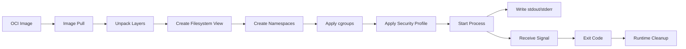

# Part 001 — Container Foundation

> Fokus part ini: membangun mental model container yang benar sebelum menyentuh Dockerfile, Kubernetes manifest, Helm chart, EKS, AKS, GitOps, atau debugging production.

Container bukan “server kecil”. Container adalah **process biasa di Linux** yang dijalankan dengan kombinasi isolasi filesystem, process, network, identity, resource, dan security boundary. Untuk backend engineer, ini penting karena Java/JAX-RS service di container tetap tunduk pada realitas OS: memory limit, CPU quota, signal, file descriptor, DNS, filesystem permission, dan network path.

---

## 1. Konsep Inti

### 1.1 Apa itu container?

Secara praktis, container adalah:

```text
container = process + isolated filesystem + isolated namespace + resource control + security constraints
```

Aplikasi Java yang berjalan di container tetap merupakan process JVM. Bedanya, process tersebut melihat dunia yang sudah “dipersempit” oleh kernel Linux:

- melihat filesystem root dari image container, bukan host root filesystem secara langsung;
- melihat network interface miliknya sendiri;
- melihat process tree sesuai PID namespace;
- dibatasi CPU/memory melalui cgroups;
- dibatasi capability dan system call melalui security profile;
- menerima signal dari container runtime saat stop/terminate.

Container memberi packaging dan isolation, tetapi bukan isolation sekuat virtual machine. Kernel tetap dibagi dengan host.

---

## 2. Kenapa Container Ada?

Sebelum container, deployment backend enterprise sering bermasalah karena:

- runtime environment berbeda antara laptop, CI, staging, dan production;
- dependency OS tidak konsisten;
- versi JDK, CA certificate, timezone, native library, dan package OS tidak terkendali;
- proses deployment terlalu bergantung pada konfigurasi host;
- scaling service membutuhkan provisioning VM yang lebih berat;
- rollback sulit karena artifact deployment tidak immutable.

Container memecahkan sebagian masalah itu dengan menjadikan aplikasi dan runtime dependency sebagai **deployment artifact yang portable dan immutable**.

Namun container tidak menghilangkan kompleksitas. Ia hanya memindahkan kompleksitas ke layer baru:

- image build;
- image registry;
- runtime security;
- network abstraction;
- resource sizing;
- orchestration;
- observability;
- supply-chain security.

---

## 3. Container vs Virtual Machine

| Aspek | Container | Virtual Machine |
|---|---|---|
| Unit utama | Process | Guest operating system |
| Kernel | Berbagi kernel host | Punya kernel guest sendiri |
| Startup | Cepat | Relatif lebih lambat |
| Image size | Biasanya lebih kecil | Biasanya lebih besar |
| Isolation | Namespace/cgroup/security profile | Hypervisor boundary |
| Cocok untuk | Microservice, batch job, worker, scalable service | Strong isolation, legacy app, OS-level separation |
| Risiko | Kernel shared, misconfig security berbahaya | Lebih berat tapi isolation lebih kuat |

Cara pikir yang tepat:

```text
VM mengisolasi mesin.
Container mengisolasi proses.
```

Untuk Java service, ini berarti JVM tidak “punya mesin sendiri”. JVM hanya berjalan sebagai process yang dibatasi oleh kernel host dan runtime container.

---

## 4. Mental Model Container Runtime

Lifecycle sederhana container:



Hal penting: container runtime tidak “menjalankan aplikasi” secara abstrak. Runtime akhirnya menjalankan satu process utama, misalnya:

```text
java -jar quote-order-service.jar
```

Jika process utama mati, container dianggap selesai atau gagal, tergantung orchestrator.

---

## 5. Process Isolation

Container memisahkan process melalui **PID namespace**. Di dalam container, aplikasi bisa melihat dirinya sebagai PID 1, walaupun di host process tersebut punya PID lain.

Contoh implikasi:

- signal handling menjadi penting;
- process PID 1 punya perilaku khusus terhadap signal dan zombie process;
- wrapper script yang buruk bisa menahan SIGTERM sehingga Java tidak shutdown graceful;
- background process yang tidak dikelola bisa menjadi zombie.

Anti-pattern:

```dockerfile
ENTRYPOINT sh -c "java -jar app.jar"
```

Lebih aman:

```dockerfile
ENTRYPOINT ["java", "-jar", "app.jar"]
```

Atau jika perlu shell wrapper, gunakan `exec`:

```sh
#!/bin/sh
exec java -jar app.jar
```

Kenapa? Karena `exec` mengganti shell dengan process Java sehingga signal dari runtime diterima langsung oleh JVM.

---

## 6. Filesystem Isolation

Container image menyediakan filesystem view sendiri. Layer image digabung menjadi root filesystem container.

Namun filesystem container memiliki karakteristik penting:

- bersifat ephemeral;
- perubahan runtime tidak boleh dianggap durable;
- writable layer container hilang saat container diganti;
- permission bergantung pada user runtime;
- read-only root filesystem bisa dipakai untuk hardening;
- persistent data harus memakai volume atau external service.

Untuk Java/JAX-RS service:

- jangan simpan business data di filesystem container;
- log sebaiknya ke stdout/stderr;
- temporary file harus jelas lokasinya, misalnya `/tmp`;
- upload file besar perlu strategi storage eksternal;
- certificate/CA bundle harus tersedia bila outbound TLS membutuhkan trust khusus;
- non-root user harus punya permission ke direktori yang dibutuhkan.

Failure umum:

```text
java.nio.file.AccessDeniedException
No space left on device
Read-only file system
File not found because mounted path berbeda dari image path
```

---

## 7. Network Namespace

Container biasanya punya network namespace sendiri:

- interface sendiri;
- IP sendiri;
- routing table sendiri;
- DNS resolver config sendiri;
- port binding sendiri.

Di Docker lokal, container bisa berada pada bridge network. Di Kubernetes, pod punya IP sendiri di pod network.

Kesalahan mental model umum:

```text
localhost di dalam container bukan localhost host.
localhost di dalam pod adalah network namespace pod.
localhost antar pod berbeda.
```

Implikasi untuk Java service:

- jangan hardcode `localhost` untuk PostgreSQL/Kafka/RabbitMQ/Redis kecuali dependency berada dalam network namespace yang sama;
- gunakan DNS service name;
- timeout dan retry harus sadar network overlay/cloud path;
- inbound port harus cocok antara aplikasi, container, service, ingress, dan load balancer;
- outbound egress bisa dibatasi NetworkPolicy/firewall/security group.

---

## 8. User Namespace dan Runtime User

Container sering dijalankan sebagai root secara default. Ini bukan berarti root di host secara langsung selalu sama, tetapi tetap berbahaya bila dikombinasikan dengan misconfiguration seperti privileged container, mounted Docker socket, HostPath, atau excessive capabilities.

Prinsip production:

```text
Run container as non-root unless there is a strong, reviewed reason not to.
```

Untuk Java service:

```dockerfile
RUN addgroup --system app && adduser --system --ingroup app app
USER app
```

Hal yang perlu dipastikan:

- direktori kerja bisa dibaca user runtime;
- temp directory bisa ditulis;
- truststore/custom certificate bisa dibaca;
- mounted secret/config punya permission sesuai;
- aplikasi tidak butuh privileged port seperti 80 jika non-root; gunakan 8080/8081 lalu routing dari service/ingress.

---

## 9. cgroups: Resource Isolation

cgroups membatasi resource process:

- CPU;
- memory;
- process count;
- block I/O;
- device access;
- pids;
- ephemeral storage pada lingkungan tertentu.

Untuk Java, ini sangat penting karena JVM harus membaca batas container, bukan hanya memory host.

Contoh masalah:

```text
Host punya 64 GiB memory.
Container limit hanya 512 MiB.
JVM salah sizing heap/direct/metaspace/thread stack.
Container OOMKilled.
```

Hal yang perlu dipikirkan:

- heap bukan satu-satunya memory JVM;
- metaspace, direct memory, code cache, thread stack, native memory, GC structure juga memakai memory;
- CPU limit bisa menyebabkan throttling dan latency spike;
- terlalu banyak thread memperbesar memory stack dan context switching;
- request/limit Kubernetes memengaruhi scheduling dan runtime behavior.

---

## 10. seccomp, Capabilities, dan Security Boundary

Linux capabilities memecah privilege root menjadi kemampuan yang lebih kecil, misalnya bind privileged port, mengubah network config, atau memakai raw socket.

seccomp membatasi system call yang boleh dipakai process.

Container hardening biasanya melibatkan:

```yaml
securityContext:
  runAsNonRoot: true
  allowPrivilegeEscalation: false
  readOnlyRootFilesystem: true
  capabilities:
    drop:
      - ALL
  seccompProfile:
    type: RuntimeDefault
```

Untuk Java REST service biasa, hampir tidak ada alasan membutuhkan privileged container, host network, host PID, atau kemampuan Linux tambahan.

Red flag saat review:

- `privileged: true`;
- `hostNetwork: true` tanpa justifikasi kuat;
- `hostPID: true`;
- `hostPath` mount sensitif;
- Docker socket mounted ke container;
- container berjalan sebagai root;
- secret sebagai env var lalu ikut ter-dump di diagnostic endpoint/log.

---

## 11. OCI Image dan OCI Runtime

OCI memberi standar agar image dan runtime container tidak terkunci hanya ke Docker.

Secara sederhana:

- **OCI Image**: format standar artifact container image;
- **OCI Runtime**: spesifikasi menjalankan container dari filesystem bundle;
- **OCI Distribution**: cara distribusi image melalui registry.

Contoh runtime/komponen:

- Docker Engine;
- containerd;
- runc;
- CRI-O;
- Kubernetes Container Runtime Interface.

Mental model:

```text
Docker membangun dan menjalankan container untuk workflow developer.
Kubernetes mengorkestrasi container melalui runtime seperti containerd/CRI-O.
OCI membuat artifact dan runtime behavior lebih standar.
```

---

## 12. Docker vs containerd vs Kubernetes

| Komponen | Fungsi |
|---|---|
| Docker CLI | Interface developer untuk build/run/push/pull |
| Docker Engine/daemon | Mengelola image, container, network, volume di host Docker |
| containerd | Runtime tingkat bawah untuk lifecycle container/image |
| runc | OCI runtime yang benar-benar menjalankan container process |
| Kubernetes | Orchestrator desired state untuk menjalankan workload di cluster |
| kubelet | Agent node Kubernetes yang meminta runtime menjalankan pod/container |

Kesalahan umum:

```text
“Production Kubernetes menjalankan Docker command.”
```

Lebih tepat:

```text
Kubernetes membuat PodSpec.
Kubelet menerjemahkannya ke runtime request.
Container runtime menarik image dan menjalankan container process.
```

Docker tetap penting untuk development, build, dan mental model image/container, tetapi production Kubernetes biasanya tidak berarti ada `docker run` manual di node.

---

## 13. Container as Deployment Artifact

Dalam enterprise system, container image adalah artifact deployment.

Artifact yang baik harus:

- immutable;
- versioned;
- traceable ke commit/build;
- scan-able;
- reproducible;
- promotable antar environment;
- tidak mengandung secret;
- punya base image yang jelas;
- punya SBOM bila diwajibkan;
- bisa ditarik oleh runtime production;
- punya digest yang bisa dipin.

Bad practice:

```text
Build image ulang secara berbeda untuk dev, test, staging, prod.
```

Better practice:

```text
Build once, scan once, sign/promote artifact, deploy same digest with environment-specific config.
```

---

## 14. Dampak ke Java/JAX-RS Backend

Container memengaruhi Java service di banyak titik:

### Startup

- classpath harus lengkap;
- dependency native library harus tersedia;
- JVM option harus sesuai limit container;
- timezone dan locale harus eksplisit bila relevan;
- certificate truststore harus benar;
- startup probe perlu mengakomodasi warmup.

### Runtime

- CPU quota memengaruhi throughput dan latency;
- memory limit memengaruhi heap/direct/metaspace/thread stack;
- DNS resolver memengaruhi koneksi ke dependency;
- service discovery menggantikan host static;
- log harus stdout/stderr;
- temporary file harus aman;
- process harus menerima SIGTERM.

### Shutdown

- Kubernetes/Docker mengirim SIGTERM;
- aplikasi harus stop menerima traffic;
- in-flight request harus diselesaikan atau ditimeout secara terkontrol;
- Kafka/RabbitMQ consumer harus commit/ack/nack dengan benar;
- connection pool harus ditutup;
- shutdown harus selesai sebelum SIGKILL.

---

## 15. Dampak ke PostgreSQL, Kafka, RabbitMQ, Redis, Camunda, dan NGINX

### PostgreSQL client dari Java container

Concern:

- DNS endpoint database;
- connection pool sizing;
- TLS trust;
- network policy;
- secret rotation;
- shutdown transaction;
- retry storm saat database unavailable.

### Kafka consumer/producer

Concern:

- broker DNS dan advertised listener;
- consumer group rebalancing saat pod restart;
- graceful shutdown consumer;
- lag-based autoscaling;
- idempotent processing;
- message ordering.

### RabbitMQ consumer/producer

Concern:

- connection/channel lifecycle;
- ack/nack saat shutdown;
- prefetch sizing;
- retry/DLQ;
- connection recovery;
- queue-based scaling.

### Redis client

Concern:

- DNS dan topology Redis;
- connection timeout;
- command latency;
- cache stampede saat pod rollout;
- TLS/auth secret;
- client-side retry.

### Camunda/workflow worker

Concern:

- worker polling lifecycle;
- idempotent external task handling;
- graceful shutdown worker;
- retry semantics;
- transaction boundary;
- job lock expiry.

### NGINX/Ingress

Concern:

- forwarded headers;
- timeout chain;
- body size;
- connection draining;
- TLS termination;
- upstream readiness;
- 502/503 saat pod not ready atau terminating.

---

## 16. Dampak di EKS, AKS, On-Prem, dan Hybrid

### EKS

Container berjalan di node/pod yang terhubung ke AWS networking, IAM, ECR, Load Balancer Controller, CloudWatch, VPC endpoint, dan security group.

Hal yang harus dipahami:

- image pull dari ECR;
- pod IP/VPC CNI behavior;
- IRSA untuk akses AWS service;
- ALB/NLB routing;
- CloudWatch logs/metrics;
- VPC endpoint/private DNS.

### AKS

Container berjalan di node pool yang terhubung ke Azure CNI/kubenet, ACR, Managed Identity/Workload Identity, Azure Load Balancer/Application Gateway, Azure Monitor, dan Private Endpoint.

Hal yang harus dipahami:

- image pull dari ACR;
- Workload Identity;
- Azure DNS/private DNS zone;
- Application Gateway/AGIC bila digunakan;
- Azure Monitor/Log Analytics.

### On-prem

Platform team bertanggung jawab lebih besar:

- control plane lifecycle;
- node patching;
- internal registry;
- load balancer integration;
- DNS/certificate;
- storage/CSI;
- monitoring;
- backup/restore.

### Hybrid

Masalah sering bukan di Java code, tetapi di jalur:

```text
pod -> DNS -> route -> firewall/proxy -> private endpoint/on-prem API -> TLS trust -> application
```

---

## 17. Failure Modes Penting

| Failure mode | Gejala | Penyebab umum | Deteksi awal |
|---|---|---|---|
| Container exit cepat | CrashLoopBackOff | command salah, config missing, app startup gagal | logs, exit code |
| OOMKilled | pod restart, exit 137 | JVM memory melebihi cgroup limit | pod status, metrics |
| CPU throttling | latency spike | CPU limit terlalu rendah | CPU throttling metric |
| Signal tidak diterima JVM | rollout lambat, SIGKILL | shell wrapper tanpa exec | events, termination logs |
| Permission denied | startup gagal | non-root user tidak punya akses | logs, filesystem check |
| DNS failure | dependency unreachable | resolver/CoreDNS/private DNS issue | nslookup/dig dari pod |
| Image architecture mismatch | exec format error | image arm64/amd64 salah | node arch, image manifest |
| Secret bocor | credential exposure | env dump/log/config endpoint | log scan, code review |
| Writable filesystem assumption | data hilang | menyimpan state di container layer | restart test |
| Root/privileged risk | security finding | Dockerfile/PodSpec terlalu permisif | manifest review |

---

## 18. Debugging Container secara Aman

Urutan aman:

```text
1. Observe first.
2. Read logs/events/status.
3. Inspect image/container metadata.
4. Validate config/secret presence.
5. Check resource limits.
6. Check network/DNS from inside same runtime context.
7. Reproduce locally if safe.
8. Change only through controlled deployment path.
```

Command contoh untuk lokal Docker:

```bash
docker ps -a
docker logs <container>
docker inspect <container>
docker exec -it <container> sh
docker image inspect <image>
docker history <image>
```

Command contoh untuk Kubernetes:

```bash
kubectl get pod -n <namespace>
kubectl describe pod <pod> -n <namespace>
kubectl logs <pod> -n <namespace>
kubectl logs <pod> -c <container> -n <namespace>
kubectl get events -n <namespace> --sort-by=.lastTimestamp
kubectl exec -it <pod> -n <namespace> -- sh
```

Production caution:

- jangan menjalankan destructive command dari pod production;
- jangan dump env var jika bisa berisi secret;
- jangan install package sembarangan di running container;
- jangan mengubah state manual yang tidak tercatat GitOps;
- jangan restart pod tanpa memahami blast radius.

---

## 19. Correctness Concern

Container bisa merusak correctness bila engineer mengabaikan lifecycle.

Contoh:

- consumer mati saat sedang memproses message tetapi offset sudah commit;
- HTTP request diputus saat rolling update;
- cache local hilang saat pod restart dan menyebabkan load spike ke database;
- file temporary hilang setelah reschedule;
- clock/timezone berbeda sehingga expiry calculation salah;
- retry storm saat dependency outage;
- secret rotation tidak terbaca sampai restart;
- duplicate job execution karena restart policy/backoff tidak dipahami.

Prinsip:

```text
Container lifecycle is part of application correctness.
```

---

## 20. Networking Concern

Containerized service harus diasumsikan berjalan di network dinamis:

- IP pod/container tidak stabil;
- endpoint dependency bisa berubah;
- DNS menjadi critical dependency;
- service routing bisa melewati proxy/load balancer;
- source IP bisa berubah/hilang;
- TLS bisa terminate di beberapa titik;
- timeout chain harus konsisten.

Untuk Java/JAX-RS API, selalu pahami:

```text
client timeout >= ingress timeout >= service/app timeout >= downstream timeout strategy
```

Jika timeout chain tidak dirancang, failure kecil bisa menjadi thread exhaustion, connection pool exhaustion, dan cascading failure.

---

## 21. Performance Concern

Container memengaruhi performance melalui:

- CPU quota dan throttling;
- memory limit dan GC pressure;
- network overlay/CNI;
- DNS lookup latency;
- image startup time;
- cold start/warmup;
- file I/O pada container layer;
- log volume;
- sidecar overhead;
- node contention.

Untuk Java service:

- ukur p95/p99 latency, bukan hanya average;
- pantau GC pause;
- pantau CPU throttling;
- pantau heap vs non-heap memory;
- pantau thread count;
- pantau connection pool saturation;
- pantau container restart count.

---

## 22. Security and Privacy Concern

Security concern utama:

- image berisi CVE;
- image berisi secret;
- container root;
- excessive capabilities;
- mounted Docker socket;
- HostPath sensitif;
- secret sebagai env var dan bocor ke log/dump;
- PII masuk log stdout;
- image dari registry tidak trusted;
- tag mutable dipakai production;
- dependency supply-chain tidak dikontrol.

Privacy concern:

- structured logs bisa mengandung customer data;
- debug endpoint bisa membocorkan config;
- exception stacktrace bisa memuat payload;
- tracing attribute bisa mengandung PII;
- env var secret bisa terbaca di diagnostic output.

---

## 23. Cost Concern

Container membantu density, tetapi bisa juga boros bila salah konfigurasi:

- request CPU/memory terlalu besar;
- limit memory terlalu kecil sehingga restart loop;
- image terlalu besar memperlambat pull dan meningkatkan storage/transfer;
- log terlalu verbose;
- autoscaling tidak stabil;
- dependency lokal di Compose tidak mencerminkan managed service cost;
- NAT gateway/private endpoint/log analytics cost tidak terlihat oleh backend team.

Senior engineer tidak hanya bertanya “apakah jalan”, tetapi juga:

```text
Apakah workload ini memakai resource secara proporsional terhadap value dan SLO?
```

---

## 24. Observability Concern

Containerized service harus observable dari beberapa layer:

```text
Application -> Container -> Pod -> Node -> Network -> Cloud dependency -> Customer impact
```

Minimal signal:

- application logs structured;
- correlation ID;
- request latency;
- error rate;
- JVM memory/GC/thread metrics;
- container CPU/memory metrics;
- restart count;
- readiness/liveness failure;
- dependency latency;
- queue lag;
- Kubernetes events;
- deployment/rollout marker.

Tanpa observability lintas layer, debugging Kubernetes berubah menjadi tebakan.

---

## 25. PR Review Checklist

Gunakan checklist ini saat melihat perubahan awal terkait container:

- Apakah image dibangun dari base image yang jelas dan approved?
- Apakah container berjalan sebagai non-root?
- Apakah entrypoint meneruskan signal dengan benar?
- Apakah aplikasi menulis log ke stdout/stderr?
- Apakah tidak ada secret di image?
- Apakah filesystem assumption aman untuk restart/reschedule?
- Apakah JVM option sadar container limit?
- Apakah port yang dipakai konsisten dengan service/ingress?
- Apakah graceful shutdown diuji?
- Apakah image tag/digest traceable ke commit?
- Apakah vulnerability scan tersedia?
- Apakah runtime dependency seperti CA certificate/timezone/native lib jelas?
- Apakah temporary file dan permission non-root valid?
- Apakah observability minimal tersedia?

---

## 26. Internal Verification Checklist

Untuk konteks CSG/team, jangan mengasumsikan detail internal. Verifikasi hal berikut:

- Runtime container yang dipakai di cluster: containerd, CRI-O, atau lainnya.
- Apakah Docker masih dipakai hanya untuk build/local development.
- Base image standard untuk Java service.
- JDK/JRE/vendor yang approved.
- Registry yang dipakai: ECR, ACR, private registry, atau kombinasi.
- Image tag strategy dan digest pinning policy.
- Vulnerability scanning dan CVE SLA.
- SBOM/signing/provenance requirement.
- Standar non-root container.
- Standar securityContext Kubernetes.
- Apakah read-only root filesystem diwajibkan.
- Cara secret diberikan ke container.
- Cara config diberikan ke container.
- Logging standard: stdout/stderr, format JSON, correlation ID.
- Runtime JVM option default.
- Graceful shutdown standard.
- Apakah ada platform checklist untuk Dockerfile dan manifest.
- Apakah ada known incident terkait container lifecycle, OOMKilled, ImagePullBackOff, atau signal handling.

---

## 27. Senior Engineer Takeaway

Container adalah abstraction yang terlihat sederhana tetapi punya dampak besar terhadap correctness, security, performance, operability, dan cost.

Kalimat yang harus melekat:

```text
A container is not a machine.
A container is a constrained process with packaged filesystem and controlled runtime environment.
```

Jika mental model ini kuat, Dockerfile, Kubernetes Pod, Deployment, Service, Ingress, HPA, RBAC, NetworkPolicy, EKS, AKS, dan GitOps akan lebih mudah dipahami sebagai layer di atas lifecycle process tersebut.
