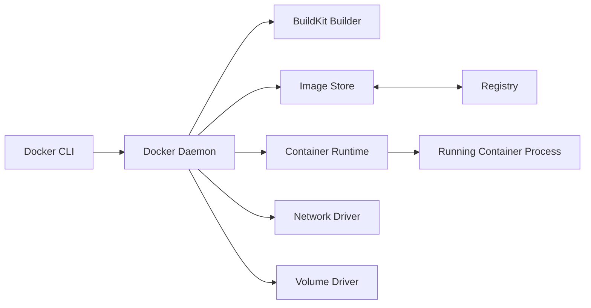
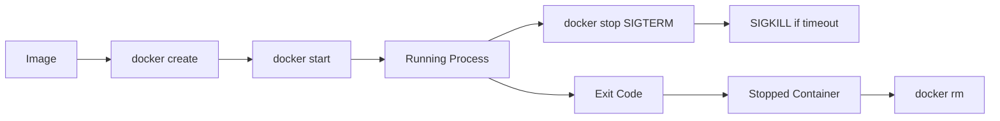
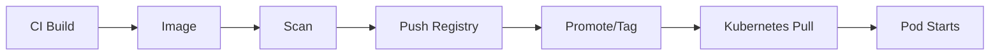

# Part 002 — Docker Foundation

> Fokus part ini: memahami Docker sebagai toolchain untuk build, run, inspect, tag, push, pull, dan debug container image — bukan sekadar hafalan command.

Docker penting untuk backend engineer karena sebagian besar workflow container dimulai dari Dockerfile dan image. Walaupun production Kubernetes modern sering memakai containerd/CRI-O di node, Docker tetap menjadi mental model dan tooling utama untuk local development, CI image build, dan debugging artifact.

---

## 1. Konsep Inti

Docker menyediakan workflow untuk:

```text
source code -> Dockerfile -> image -> registry -> container runtime -> running process
```

Komponen utama:

- **Dockerfile**: resep build image;
- **Image**: artifact immutable berisi filesystem dan metadata runtime;
- **Container**: instance runtime dari image;
- **Layer**: unit perubahan filesystem image;
- **Build context**: file yang dikirim ke builder;
- **Build cache**: cache layer untuk mempercepat build;
- **Tag**: nama referensi image yang mutable;
- **Digest**: content-addressed identifier yang immutable;
- **Registry**: tempat menyimpan image;
- **Volume**: storage yang dipisahkan dari lifecycle container;
- **Network**: konektivitas antar container/host;
- **Compose**: definisi multi-container lokal;
- **BuildKit**: builder modern untuk performa, cache, secret mount, dan reproducibility yang lebih baik.

---

## 2. Kenapa Docker Ada?

Docker menyederhanakan tiga hal:

1. **Packaging**  
   Aplikasi dan runtime dependency dibungkus menjadi image.

2. **Runtime consistency**  
   Image yang sama bisa dijalankan di laptop, CI, staging, dan production runtime yang kompatibel.

3. **Distribution**  
   Image bisa disimpan, discan, dipromosikan, dan ditarik dari registry.

Untuk Java/JAX-RS service, Docker mengubah deployment dari:

```text
copy jar ke server + setup JDK + setup env + setup service manager
```

menjadi:

```text
build image + push registry + deploy image digest/tag ke orchestrator
```

---

## 3. Docker Architecture



### Docker CLI

Command-line interface yang dipakai engineer:

```bash
docker build
docker run
docker ps
docker logs
docker exec
docker inspect
docker tag
docker push
docker pull
```

### Docker daemon

Service privileged di host yang mengelola image, container, network, dan volume.

Risiko penting:

```text
Akses ke Docker daemon hampir setara dengan akses root ke host.
```

Karena itu, jangan sembarang expose Docker socket.

### BuildKit

Builder modern yang mendukung:

- parallel build;
- advanced cache;
- secret mount saat build;
- SSH mount;
- multi-platform build;
- output metadata;
- build yang lebih efisien.

---

## 4. Docker Image

Image adalah artifact immutable yang berisi:

- filesystem layers;
- default command/entrypoint;
- environment variable default;
- working directory;
- exposed port metadata;
- user metadata;
- labels;
- architecture/platform metadata.

Image bukan container berjalan. Image adalah template.

```text
image = packaged filesystem + runtime metadata
container = running instance of image
```

Contoh inspect:

```bash
docker image inspect my-service:1.0.0
```

Hal yang dicek senior engineer:

- base image;
- architecture;
- entrypoint/CMD;
- user;
- env var default;
- exposed port;
- labels;
- layer history;
- image size;
- digest.

---

## 5. Docker Container

Container adalah instance runtime dari image.

Lifecycle sederhana:



Command penting:

```bash
docker run --rm my-service:local
docker ps
docker ps -a
docker stop <container>
docker rm <container>
docker logs <container>
docker inspect <container>
```

Yang harus dipahami: container sehat jika process utama sehat. Jika process utama exit, container berhenti.

---

## 6. Dockerfile

Dockerfile adalah instruksi build image.

Contoh sederhana Java service:

```dockerfile
FROM eclipse-temurin:17-jre
WORKDIR /app
COPY target/quote-order-service.jar app.jar
USER 10001
EXPOSE 8080
ENTRYPOINT ["java", "-jar", "app.jar"]
```

Ini belum production-grade penuh, tetapi menunjukkan konsep:

- base runtime;
- working directory;
- artifact copy;
- non-root user;
- port metadata;
- process utama.

Instruksi umum:

| Instruksi | Fungsi |
|---|---|
| `FROM` | Base image |
| `WORKDIR` | Direktori kerja |
| `COPY` | Copy file dari build context |
| `RUN` | Eksekusi command saat build |
| `ENV` | Default environment variable |
| `ARG` | Build-time variable |
| `USER` | Runtime user |
| `EXPOSE` | Dokumentasi port container |
| `ENTRYPOINT` | Process utama default |
| `CMD` | Default argument/command |
| `LABEL` | Metadata image |

---

## 7. Build Context

Build context adalah direktori/file yang dikirim ke Docker builder.

Command:

```bash
docker build -t quote-order-service:local .
```

Titik `.` berarti seluruh direktori saat ini menjadi build context, kecuali dikecualikan oleh `.dockerignore`.

Masalah umum:

- build lambat karena context terlalu besar;
- secret ikut terkirim ke builder;
- file test/cache/log masuk image;
- `.git` ikut terkirim;
- artifact salah karena path relatif membingungkan.

Gunakan `.dockerignore`:

```gitignore
.git
.mvn/wrapper/maven-wrapper.jar
node_modules
target/*.log
*.pem
*.key
.env
```

Catatan: jangan asal ignore Maven wrapper jika pipeline membutuhkannya. Sesuaikan dengan build strategy internal.

---

## 8. Image Layer

Setiap instruksi Dockerfile tertentu menghasilkan layer.

Contoh buruk:

```dockerfile
COPY . .
RUN mvn package
```

Masalah:

- setiap perubahan source code bisa menginvalidasi cache dependency;
- build lambat;
- image bisa mengandung file tidak perlu.

Pattern lebih baik untuk Maven:

```dockerfile
FROM maven:3.9-eclipse-temurin-17 AS build
WORKDIR /build
COPY pom.xml .
RUN mvn dependency:go-offline
COPY src ./src
RUN mvn package -DskipTests

FROM eclipse-temurin:17-jre
WORKDIR /app
COPY --from=build /build/target/app.jar app.jar
ENTRYPOINT ["java", "-jar", "app.jar"]
```

Ide utamanya:

```text
Copy dependency metadata lebih dulu.
Download dependency.
Copy source belakangan.
Bangun artifact.
Copy hanya artifact final ke runtime image.
```

---

## 9. Build Cache

Docker cache bekerja berdasarkan instruksi dan content yang relevan.

Jika layer awal berubah, layer setelahnya biasanya harus rebuild.

Prinsip cache-efficient Dockerfile:

- instruksi yang jarang berubah diletakkan lebih awal;
- dependency metadata dipisah dari source code;
- build context dijaga kecil;
- avoid `COPY . .` terlalu awal;
- pin versi dependency/base image;
- gunakan BuildKit cache mount jika sesuai.

Contoh BuildKit cache Maven:

```dockerfile
# syntax=docker/dockerfile:1.6
FROM maven:3.9-eclipse-temurin-17 AS build
WORKDIR /build
COPY pom.xml .
RUN --mount=type=cache,target=/root/.m2 mvn dependency:go-offline
COPY src ./src
RUN --mount=type=cache,target=/root/.m2 mvn package -DskipTests
```

Perlu diverifikasi apakah CI/CD internal mengaktifkan BuildKit dan mendukung cache mount.

---

## 10. Tag vs Digest

Tag adalah nama referensi yang bisa berubah.

```text
quote-order-service:1.2.3
quote-order-service:latest
quote-order-service:main
```

Digest adalah hash content image yang immutable.

```text
quote-order-service@sha256:abc123...
```

Masalah tag mutable:

```text
Hari ini :1.2.3 menunjuk image A.
Besok seseorang overwrite :1.2.3 menjadi image B.
Production rollback/debug menjadi ambigu.
```

Praktik lebih aman:

- build image dengan tag traceable, misalnya commit SHA/build number;
- promote image yang sama antar environment;
- pin digest untuk deployment kritikal bila platform mendukung;
- hindari `latest` untuk production;
- simpan mapping commit → image digest → deployment.

---

## 11. Registry

Registry menyimpan dan mendistribusikan image.

Contoh registry:

- Docker Hub;
- Amazon ECR;
- Azure Container Registry;
- private enterprise registry;
- internal artifact registry.

Flow umum:



Concern registry:

- authentication;
- authorization;
- retention policy;
- vulnerability scanning;
- immutable tag setting;
- replication;
- outage handling;
- pull rate limits;
- audit trail.

Failure umum:

```text
ImagePullBackOff
ErrImagePull
manifest unknown
unauthorized
x509 certificate signed by unknown authority
no matching manifest for linux/amd64
```

---

## 12. Docker Volume

Container writable layer bersifat ephemeral. Volume digunakan untuk data yang perlu bertahan lebih lama dari container.

Docker local example:

```bash
docker volume create pgdata
docker run -v pgdata:/var/lib/postgresql/data postgres:16
```

Untuk Java stateless service, volume biasanya tidak dipakai untuk business data.

Volume lebih umum untuk local development dependency:

- PostgreSQL data directory;
- RabbitMQ data;
- Redis append-only file jika dipakai;
- Kafka log directory;
- local object storage emulator;
- temporary debugging artifact.

Production Kubernetes memakai konsep berbeda: PV, PVC, StorageClass, CSI driver. Jangan menyamakan Docker volume lokal dengan durability production.

---

## 13. Docker Network

Docker menyediakan network untuk container lokal.

Contoh:

```bash
docker network create appnet

docker run --name postgres --network appnet postgres:16

docker run --name app --network appnet \
  -e DB_HOST=postgres \
  quote-order-service:local
```

Di network yang sama, container bisa resolve nama container/service.

Mental model:

```text
localhost di container app bukan container postgres.
Gunakan nama service/container pada network yang sama.
```

Port mapping:

```bash
docker run -p 8080:8080 quote-order-service:local
```

Artinya:

```text
host port 8080 -> container port 8080
```

Port mapping dibutuhkan agar host/laptop bisa mengakses service di container. Antar container dalam network yang sama tidak perlu lewat host port.

---

## 14. Docker Compose

Compose mendefinisikan multi-container stack untuk local development.

Contoh minimal:

```yaml
services:
  app:
    build: .
    ports:
      - "8080:8080"
    environment:
      DB_HOST: postgres
      REDIS_HOST: redis
    depends_on:
      - postgres
      - redis

  postgres:
    image: postgres:16
    environment:
      POSTGRES_DB: quote_order
      POSTGRES_USER: app
      POSTGRES_PASSWORD: app
    volumes:
      - pgdata:/var/lib/postgresql/data

  redis:
    image: redis:7

volumes:
  pgdata:
```

Compose cocok untuk:

- local PostgreSQL;
- local Kafka;
- local RabbitMQ;
- local Redis;
- local NGINX;
- local Camunda;
- integration testing ringan;
- onboarding developer.

Compose bukan Kubernetes. Jangan menganggap semua behavior Compose sama dengan production cluster.

Perbedaan penting:

| Area | Compose | Kubernetes |
|---|---|---|
| Orchestration | Lokal/sederhana | Cluster desired state |
| Scheduling | Host lokal | Scheduler multi-node |
| Service discovery | Compose network DNS | Kubernetes DNS/Service |
| Secret | Biasanya sederhana | Secret/external secret/RBAC |
| Rollout | Manual/recreate | Rolling/canary/GitOps |
| Resource management | Terbatas | Request/limit/QoS/HPA |
| Network policy | Tidak umum | CNI/NetworkPolicy |

---

## 15. Docker Daemon Risk

Docker daemon memiliki privilege tinggi. Siapa pun yang bisa mengakses Docker socket biasanya bisa melakukan hal berbahaya, misalnya mount filesystem host.

Contoh red flag:

```yaml
volumes:
  - /var/run/docker.sock:/var/run/docker.sock
```

Risiko:

- container dapat membuat container privileged baru;
- host filesystem bisa dimount;
- secret host/CI bisa dicuri;
- isolation container menjadi ilusi.

Dalam CI/CD, hindari Docker socket mounting tanpa kontrol kuat. Alternatif tergantung platform:

- rootless builder;
- remote builder terkontrol;
- BuildKit sandboxed;
- Kaniko/Buildah/Podman sesuai kebijakan;
- managed build service;
- pipeline runner yang diisolasi.

Internal policy harus diverifikasi, jangan diasumsikan.

---

## 16. Docker Development Workflow

Workflow umum untuk Java/JAX-RS service:

```text
1. Build app artifact dengan Maven/Gradle.
2. Build Docker image.
3. Run container lokal.
4. Inject local config via env/Compose.
5. Connect ke local dependency containers.
6. Run smoke test.
7. Push image dari CI.
8. Deploy via Kubernetes/GitOps.
```

Command contoh:

```bash
mvn clean package

docker build -t quote-order-service:local .

docker run --rm \
  -p 8080:8080 \
  -e DB_HOST=host.docker.internal \
  quote-order-service:local
```

Untuk Compose:

```bash
docker compose up --build

docker compose logs -f app

docker compose down
```

Untuk membersihkan volume lokal, hati-hati:

```bash
docker compose down -v
```

`-v` menghapus volume. Jangan jalankan tanpa sadar jika data lokal penting.

---

## 17. Docker dan Java/JAX-RS Service

Hal yang perlu diselaraskan:

### Port

Jika aplikasi listen di 8080:

```dockerfile
EXPOSE 8080
```

Lalu Docker run:

```bash
docker run -p 8080:8080 app
```

Di Kubernetes nanti:

```yaml
containerPort: 8080
service.targetPort: 8080
```

### Environment Variable

Docker umum memakai env var untuk konfigurasi runtime:

```bash
docker run -e LOG_LEVEL=INFO -e DB_HOST=postgres app
```

Namun secret harus hati-hati. Env var mudah muncul di inspect, debug dump, atau log tidak sengaja.

### Logging

Aplikasi harus log ke stdout/stderr:

```text
application -> stdout/stderr -> container runtime -> log collector
```

Jangan mengandalkan file log lokal di container untuk production.

### Shutdown

Test lokal:

```bash
docker stop <container>
```

Lihat apakah Java menerima SIGTERM dan shutdown dengan rapi.

---

## 18. Dampak ke PostgreSQL, Kafka, RabbitMQ, Redis, Camunda, dan NGINX Lokal

### PostgreSQL

Compose membantu menjalankan PostgreSQL lokal, tetapi production concern tetap berbeda:

- backup;
- HA;
- replication;
- connection pooling;
- TLS;
- credential rotation;
- migration strategy.

### Kafka

Kafka di Docker lokal sering tricky karena advertised listener.

Hal yang perlu hati-hati:

```text
Broker address yang valid untuk container lain belum tentu valid untuk host.
Broker address yang valid untuk host belum tentu valid untuk container lain.
```

### RabbitMQ

Perhatikan volume data, management port, default user/password, dan network name.

### Redis

Redis lokal mudah dijalankan, tetapi production Redis punya concern HA, persistence, eviction policy, TLS, auth, dan clustering.

### Camunda

Camunda lokal bisa membantu integration test, tetapi workflow correctness, job lock, retry, dan external worker behavior harus diuji sesuai production model.

### NGINX

NGINX lokal bisa mensimulasikan reverse proxy:

- path routing;
- header forwarding;
- timeout;
- body size;
- TLS termination lokal.

Namun ingress controller production punya behavior tambahan.

---

## 19. Docker di EKS, AKS, On-Prem, dan Hybrid

Docker image adalah artifact lintas environment. Tetapi runtime environment berbeda:

### EKS

- Image bisa disimpan di ECR.
- Node Kubernetes menarik image melalui container runtime.
- IAM/IRSA memengaruhi akses AWS service, bukan Docker langsung.
- Registry auth dan network ke ECR harus tersedia.

### AKS

- Image bisa disimpan di ACR.
- AKS dapat diintegrasikan dengan ACR untuk image pull.
- Workload Identity/Managed Identity memengaruhi akses Azure service.

### On-prem

- Bisa memakai private registry.
- Certificate registry internal harus trusted.
- Air-gapped deployment mungkin perlu image mirroring.
- Pull failure bisa terjadi karena DNS/proxy/certificate/firewall.

### Hybrid

- Image promotion dan registry replication harus jelas.
- Cluster cloud/on-prem mungkin memiliki akses registry berbeda.
- Tag/digest governance menjadi penting agar environment tidak drift.

---

## 20. Failure Modes Docker

| Failure mode | Gejala | Penyebab umum | Cara deteksi |
|---|---|---|---|
| Build context terlalu besar | build lambat | `.dockerignore` buruk | build output, context size |
| Cache tidak efektif | build selalu lama | urutan COPY/RUN salah | docker build logs |
| Secret masuk image | security incident | COPY `.env`, key, cert private | docker history, scan |
| Image terlalu besar | pull lambat | full OS image, build tools ikut runtime | docker images/history |
| Container langsung exit | service tidak jalan | command salah, app crash | docker logs, exit code |
| Port tidak bisa diakses | curl gagal | app listen port berbeda, port mapping salah | docker ps, logs |
| Permission denied | startup gagal | non-root user tidak punya akses | logs, exec ls -l |
| DNS antar container gagal | dependency unreachable | network beda, host salah | docker network inspect |
| Image pull unauthorized | pull gagal | login/permission salah | docker pull output |
| Wrong architecture | exec format error | image arm64 vs amd64 | image inspect |
| Docker daemon denied | command gagal | user tidak punya permission | socket/group policy |
| Volume data hilang | local DB reset | compose down -v | volume list/history |

---

## 21. Debugging Docker: Urutan Praktis

### 21.1 Container tidak start

```bash
docker ps -a
docker logs <container>
docker inspect <container> --format '{{.State.ExitCode}}'
docker inspect <container> --format '{{.State.Error}}'
```

Periksa:

- command/entrypoint;
- missing env var;
- missing file;
- permission;
- wrong Java version;
- port conflict;
- dependency unavailable.

### 21.2 Image terlalu besar

```bash
docker images
docker history <image>
```

Periksa:

- build tools ikut runtime image;
- dependency cache tertinggal;
- log/test/temp file ikut ke image;
- base image terlalu besar;
- multi-stage build belum digunakan.

### 21.3 Network failure

```bash
docker network ls
docker network inspect <network>
docker exec -it <container> sh
```

Dari dalam container:

```sh
getent hosts postgres
nc -vz postgres 5432
curl -v http://app:8080/health
```

Jika image tidak punya tools debugging, jangan langsung install di production image. Gunakan debug container atau local reproduction.

### 21.4 Signal/shutdown failure

```bash
docker stop --time 30 <container>
docker logs <container>
```

Periksa apakah aplikasi log shutdown sequence:

- stop accepting requests;
- close HTTP server;
- stop consumers;
- flush telemetry;
- close DB/Redis/RabbitMQ/Kafka connections.

---

## 22. Correctness Concern

Docker workflow bisa menyebabkan correctness issue jika artifact tidak immutable.

Contoh:

- tag `latest` dipakai di staging dan production;
- image rebuild untuk tiap environment dengan hasil berbeda;
- migration script ikut image tetapi tidak versioned jelas;
- config default di image berbeda dari runtime config;
- timezone berbeda antara local container dan production;
- Docker Compose dependency startup dianggap sama dengan readiness;
- test lokal lulus karena dependency container terlalu permissive.

Prinsip:

```text
Local Docker success is not production correctness.
It is only one layer of evidence.
```

---

## 23. Networking Concern

Hal yang sering menjebak:

- `localhost` ambiguity;
- port host vs port container;
- service name hanya berlaku di network tertentu;
- Kafka advertised listener;
- proxy environment variable;
- corporate VPN memengaruhi DNS lokal;
- container DNS berbeda dari host DNS;
- IPv4/IPv6 behavior;
- TLS truststore di container berbeda dari laptop.

Untuk enterprise system, biasakan menggambar jalur:

```text
Java process -> container network namespace -> Docker bridge/host network -> dependency endpoint
```

Di Kubernetes nanti jalurnya lebih panjang.

---

## 24. Performance Concern

Docker build performance:

- build context kecil;
- cache dependency efektif;
- multi-stage build;
- BuildKit cache mount;
- hindari download dependency berulang;
- gunakan registry mirror bila diizinkan.

Runtime performance:

- image kecil mempercepat pull;
- startup Java bisa lambat karena classpath besar;
- CPU/memory limit perlu realistis;
- logging berlebihan memperlambat runtime;
- volume mount tertentu bisa lambat di OS desktop;
- Compose lokal tidak mewakili latency cloud.

---

## 25. Security and Privacy Concern

Checklist security Docker:

- jangan copy secret ke image;
- jangan pakai `latest` untuk production;
- jangan menjalankan container sebagai root tanpa alasan;
- jangan expose Docker socket;
- jangan memakai base image tidak trusted;
- scan image dan dependency;
- pin dependency dan base image;
- hapus package manager/build tool dari runtime image bila tidak perlu;
- gunakan `.dockerignore`;
- jangan log env var secret;
- jangan membuat debug endpoint yang dump config sensitif.

Privacy concern:

- sample data lokal tidak boleh berisi PII production;
- logs dari container lokal/CI bisa tersimpan di artifact pipeline;
- env var secret di CI bisa bocor melalui build output;
- image layer tidak mudah “menghapus” secret jika pernah tercopy di layer sebelumnya.

Poin penting:

```text
Jika secret pernah masuk ke layer image, menghapusnya di layer berikutnya tidak cukup.
Secret masih bisa ada di layer history.
```

---

## 26. Cost Concern

Docker memengaruhi cost secara tidak langsung:

- image besar memperbesar storage dan transfer;
- build lambat menghabiskan CI minutes;
- cache buruk meningkatkan waktu pipeline;
- registry retention buruk menumpuk artifact;
- vulnerability backlog meningkatkan engineering cost;
- local environment berat memperlambat developer productivity;
- image pull lambat memperlambat autoscaling/rollout.

Senior engineer harus peduli pada build time dan artifact hygiene, bukan hanya runtime code.

---

## 27. Observability Concern

Docker local harus mendekati observability production:

- logs ke stdout/stderr;
- structured JSON log bila production memakai JSON;
- correlation ID di request;
- health endpoint tersedia;
- metrics endpoint bisa dicoba lokal;
- container exit code terlihat;
- startup/shutdown log jelas;
- dependency connection log tidak membocorkan secret.

Command observasi:

```bash
docker logs -f <container>
docker stats <container>
docker inspect <container>
docker events
```

Untuk Compose:

```bash
docker compose ps
docker compose logs -f
docker compose events
```

---

## 28. Docker Foundation Review Checklist

Gunakan checklist ini saat mereview Docker setup service:

### Dockerfile

- Apakah base image jelas dan approved?
- Apakah memakai multi-stage build jika build tool tidak perlu di runtime?
- Apakah urutan layer cache-efficient?
- Apakah `.dockerignore` ada dan benar?
- Apakah artifact final saja yang masuk runtime image?
- Apakah container non-root?
- Apakah entrypoint exec-form?
- Apakah port sesuai aplikasi?
- Apakah tidak ada secret di image?
- Apakah label metadata cukup?

### Image

- Apakah tag traceable ke commit/build?
- Apakah digest tercatat?
- Apakah image discan?
- Apakah ukuran image masuk akal?
- Apakah base image punya update policy?
- Apakah architecture sesuai node target?

### Runtime local

- Apakah `docker run` berhasil dengan env minimal?
- Apakah `docker stop` menghasilkan graceful shutdown?
- Apakah log ke stdout/stderr?
- Apakah dependency endpoint configurable?
- Apakah permission non-root valid?

### Compose

- Apakah dependency service name benar?
- Apakah volume persistence disengaja?
- Apakah seed data aman?
- Apakah credential lokal bukan credential production?
- Apakah port mapping tidak bentrok?
- Apakah README local development jelas?

### Registry/CI

- Apakah CI build memakai Dockerfile yang sama?
- Apakah build cache dipakai aman?
- Apakah scan stage ada?
- Apakah push ke registry controlled?
- Apakah retention policy ada?
- Apakah image promotion tidak rebuild ulang sembarangan?

---

## 29. Internal Verification Checklist

Untuk konteks CSG/team, verifikasi:

- Apakah service memakai Dockerfile per repository atau shared base/build template.
- Apakah Maven build dilakukan di Docker multi-stage atau di CI sebelum Docker build.
- Base image Java standard yang diizinkan.
- Apakah distroless/slim/Alpine dipakai dan alasannya.
- Apakah BuildKit diaktifkan di CI.
- Apakah ada `.dockerignore` standard.
- Image naming convention.
- Tagging convention: semver, commit SHA, build number, branch tag.
- Apakah digest dipakai dalam deployment manifest/GitOps.
- Registry yang digunakan: ECR, ACR, private registry, atau lainnya.
- Registry authentication untuk CI dan cluster.
- Image scanning tool dan CVE threshold.
- SBOM/signing/provenance requirement.
- Retention policy image lama.
- Apakah Docker Compose dipakai untuk local development.
- Dependency lokal yang disediakan: PostgreSQL, Kafka, RabbitMQ, Redis, Camunda, NGINX.
- Local secret handling policy.
- Apakah ada devcontainer standard.
- Apakah ada known issue terkait Docker build, image pull, wrong architecture, atau registry outage.
- Apakah ada policy melarang Docker socket mount.
- Apakah pipeline memakai rootless builder atau privileged runner.

---

## 30. Senior Engineer Takeaway

Docker bukan tujuan akhir. Docker adalah toolchain untuk menghasilkan artifact container yang bisa dioperasikan oleh platform.

Mental model yang harus melekat:

```text
Dockerfile defines the artifact.
Image is the immutable deployment package.
Container is the runtime process instance.
Registry is the distribution and governance point.
Kubernetes later decides where, when, and how many instances run.
```

Jika Dockerfile buruk, Kubernetes tidak akan menyelamatkan production. Ia hanya akan menjalankan artifact buruk itu dengan lebih cepat, lebih banyak, dan lebih sulit di-debug.
