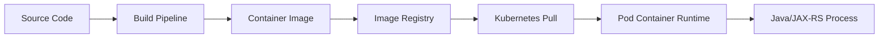
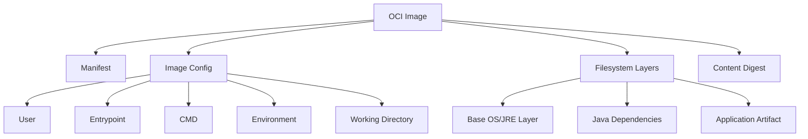
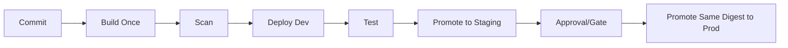
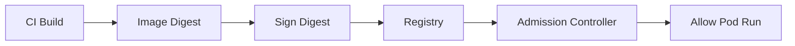

# Container Image Engineering

> Fokus part ini: memahami container image sebagai **artifact produksi**, bukan sekadar output dari `docker build`.
>
> Untuk sistem enterprise Java/JAX-RS, image adalah boundary antara source code, build pipeline, runtime platform, security governance, dan production operations.

---

## 1. Core Mental Model

Container image adalah **immutable filesystem snapshot plus runtime metadata**.

Ia berisi:

- filesystem layer
- executable atau application artifact
- runtime dependencies
- metadata seperti entrypoint, command, env, exposed port, user, working directory
- reference ke base image
- digest sebagai identity immutable

Image bukan container.

Image adalah artifact.
Container adalah process runtime yang dibuat dari image.



Dalam production system, image harus bisa menjawab pertanyaan berikut:

1. Kode commit mana yang menghasilkan image ini?
2. Dependency apa saja yang masuk?
3. Base image apa yang digunakan?
4. Vulnerability apa yang diketahui?
5. License apa yang dibawa?
6. Apakah image ini immutable?
7. Apakah image ini dipromosikan secara terkontrol?
8. Apakah image ini sama antara staging dan production?
9. Apakah image ini bisa di-debug saat incident?
10. Apakah image ini aman dijalankan sebagai non-root?

---

## 2. Why Image Engineering Exists

Image engineering ada karena production deployment membutuhkan artifact yang:

- reproducible
- secure
- small enough
- traceable
- immutable
- promotable
- scannable
- rollbackable
- operationally understandable

Tanpa image engineering, deployment sering berubah menjadi:

- “works on my machine” versi container
- image tag overwrite
- dependency drift
- CVE tidak terdeteksi
- image terlalu besar
- startup lambat
- base image tidak pernah dipatch
- credential ikut masuk layer
- production memakai artifact yang tidak sama dengan yang diuji

Untuk enterprise Java/JAX-RS service, image engineering adalah bagian dari **release correctness**.

---

## 3. OCI Image Structure

OCI image secara konseptual terdiri dari:

- manifest
- config
- layers
- digest
- annotations



Hal penting:

- layer bersifat content-addressed
- digest berubah jika content berubah
- tag hanya pointer mutable
- digest adalah identity immutable
- registry menyimpan manifest dan layer blobs

---

## 4. Image Layering

Dockerfile menghasilkan image layer.

Contoh sederhana:

```dockerfile
FROM eclipse-temurin:17-jre
WORKDIR /app
COPY target/app.jar app.jar
ENTRYPOINT ["java", "-jar", "/app/app.jar"]
```

Layer konseptual:

```text
Layer 1: base image filesystem
Layer 2: /app directory metadata
Layer 3: app.jar
Layer 4: runtime metadata entrypoint
```

Layering yang buruk:

```dockerfile
COPY . .
RUN mvn package
```

Masalah:

- seluruh source code masuk build context
- cache mudah invalid
- artifact build dan source bisa ikut image runtime
- image lebih besar
- potensi credential ikut masuk

Layering yang lebih baik untuk Java:

```dockerfile
FROM maven:3.9-eclipse-temurin-17 AS build
WORKDIR /src
COPY pom.xml .
RUN mvn -B dependency:go-offline
COPY src ./src
RUN mvn -B package -DskipTests

FROM eclipse-temurin:17-jre
WORKDIR /app
COPY --from=build /src/target/app.jar ./app.jar
USER 10001:10001
ENTRYPOINT ["java", "-jar", "/app/app.jar"]
```

Namun untuk production, ini masih perlu ditinjau:

- apakah base image dipin?
- apakah Maven dependency reproducible?
- apakah test benar-benar boleh di-skip?
- apakah image runtime non-root?
- apakah jar layering optimal?
- apakah ada SBOM?
- apakah ada vulnerability scan?

---

## 5. Java Dependency Layering

Java service biasanya memiliki dependency yang lebih jarang berubah dibanding application code.

Pola layer yang lebih efisien:

```text
Base runtime layer
Third-party dependencies layer
Snapshot/internal dependencies layer
Application classes/resources layer
Entrypoint/runtime metadata
```

Keuntungan:

- build lebih cepat
- image push lebih kecil saat perubahan kecil
- image pull lebih efisien
- cache lebih stabil
- rollout lebih cepat pada cluster besar

Jika menggunakan Spring Boot, ada konsep layered jar.
Untuk JAX-RS/Jakarta RESTful service non-Spring, pattern bisa bergantung pada packaging:

- fat jar
- thin jar + lib directory
- WAR di application server
- Quarkus/MicroProfile packaging
- custom runtime launcher

Untuk enterprise service, yang penting bukan framework-nya, tetapi separation antara:

- runtime base
- dependency
- application code
- config runtime

---

## 6. Image Size

Image kecil bukan tujuan absolut.

Image harus **cukup kecil, cukup aman, cukup operable**.

Ukuran image dipengaruhi oleh:

- base image
- package manager cache
- build tools yang ikut runtime
- source code yang ikut runtime
- test artifact
- log/temp files
- duplicate dependency
- fat jar size

Anti-pattern:

```dockerfile
FROM maven:3.9-eclipse-temurin-17
WORKDIR /app
COPY . .
RUN mvn package
ENTRYPOINT ["java", "-jar", "target/app.jar"]
```

Masalah:

- Maven ikut runtime image
- source ikut runtime image
- local build artifact bisa ikut
- lebih banyak CVE surface
- lebih besar untuk pull/push

Lebih baik:

```dockerfile
FROM maven:3.9-eclipse-temurin-17 AS build
# build only

FROM eclipse-temurin:17-jre
# runtime only
```

Trade-off base image:

| Base image | Kelebihan | Risiko |
|---|---|---|
| Debian/Ubuntu slim | kompatibilitas baik, mudah debug | lebih besar dari distroless |
| Alpine | kecil | musl libc caveat, native dependency caveat |
| Distroless | surface kecil | sulit debug, tidak ada shell |
| JDK image | lengkap | terlalu besar untuk runtime |
| JRE image | lebih kecil | tidak cocok untuk runtime yang butuh tools JDK |

Untuk production enterprise, pilihan base image harus mengikuti standar platform/security, bukan selera developer.

---

## 7. Build Reproducibility

Build reproducible berarti artifact yang sama bisa dibangun ulang dari source, dependency, dan environment yang sama.

Faktor yang merusak reproducibility:

- dependency version floating
- base image tag mutable
- build timestamp masuk artifact tanpa kontrol
- package manager mengambil latest
- plugin Maven tidak dipin
- build bergantung environment lokal
- private repository berbeda antar environment
- image tag overwrite

Contoh risiko:

```dockerfile
FROM eclipse-temurin:17-jre
```

Tag ini bisa berubah di masa depan.

Lebih kuat:

```dockerfile
FROM eclipse-temurin:17-jre@sha256:<digest>
```

Namun digest pinning membawa trade-off:

- lebih reproducible
- tetapi base image tidak otomatis mendapat patch
- perlu proses update terjadwal

Rule production:

> Pin untuk reproducibility, automate update untuk security.

---

## 8. Dependency Pinning

Untuk Maven:

- dependency version harus eksplisit
- plugin version harus eksplisit
- parent BOM harus dikontrol
- snapshot dependency harus dibatasi
- private artifact repository harus auditable

Hal yang perlu diperhatikan:

```xml
<dependency>
  <groupId>com.example</groupId>
  <artifactId>some-lib</artifactId>
  <version>LATEST</version>
</dependency>
```

Hindari `LATEST`, `RELEASE`, atau version floating.

Dependency pinning bukan sekadar build stability.
Ia juga penting untuk:

- CVE traceability
- SBOM correctness
- license review
- rollback confidence
- incident forensic

---

## 9. Build Cache

Build cache mempercepat pipeline, tetapi bisa menjadi sumber bug jika tidak dipahami.

Cache invalidation umum:

```dockerfile
COPY . .
RUN mvn package
```

Setiap perubahan file membatalkan cache Maven dependency.

Lebih baik:

```dockerfile
COPY pom.xml .
RUN mvn dependency:go-offline
COPY src ./src
RUN mvn package
```

BuildKit juga mendukung cache mount:

```dockerfile
# syntax=docker/dockerfile:1.6
FROM maven:3.9-eclipse-temurin-17 AS build
WORKDIR /src
COPY pom.xml .
RUN --mount=type=cache,target=/root/.m2 mvn -B dependency:go-offline
COPY src ./src
RUN --mount=type=cache,target=/root/.m2 mvn -B package
```

Hal yang harus dijaga:

- cache tidak boleh mengandung secret
- cache tidak boleh membuat build non-deterministic
- CI cache harus bisa dibersihkan saat dependency corruption
- cache policy harus jelas

---

## 10. Build Context Hygiene

Build context adalah semua file yang dikirim ke Docker daemon/build engine.

Tanpa `.dockerignore`, file tidak perlu bisa ikut terbaca oleh build.

Contoh `.dockerignore`:

```text
.git
.idea
.vscode
target
*.log
.env
.env.*
node_modules
.DS_Store
```

Risiko build context buruk:

- build lambat
- secret terkirim ke daemon
- credential masuk layer tanpa sengaja
- image tidak reproducible
- local artifact masuk image

Untuk Java service, minimal review:

- `.git` tidak masuk
- `.env` tidak masuk
- `target/` lokal tidak ikut jika build dari source
- test reports tidak ikut runtime image
- local cert/key tidak ikut

---

## 11. Tag Strategy

Tag adalah pointer.

Tag bisa mutable.

Contoh tag:

```text
my-service:latest
my-service:dev
my-service:1.0.0
my-service:1.0.0-20260711
my-service:git-a1b2c3d
```

Masalah `latest`:

- tidak jelas commit mana
- sulit rollback
- tidak auditable
- bisa berubah tanpa manifest berubah
- debugging production sulit

Tag yang lebih baik:

```text
my-service:<semver>
my-service:<git-sha>
my-service:<build-number>
my-service:<release-version>-<git-sha>
```

Namun deployment production sebaiknya mengandalkan digest:

```yaml
image: registry.example.com/my-service@sha256:...
```

Praktik umum:

- tag untuk manusia dan pipeline
- digest untuk immutability
- annotation untuk traceability

---

## 12. Digest and Immutability

Digest adalah hash content image.

Jika content berubah, digest berubah.

```text
registry.example.com/team/service@sha256:abc123...
```

Keuntungan digest:

- immutable reference
- reproducible deployment
- rollback aman
- supply-chain integrity lebih kuat
- mencegah tag overwrite diam-diam

Trade-off:

- manifest kurang readable
- promotion flow perlu tooling
- patch base image butuh rebuild

Production rule:

> Jangan percaya tag untuk membuktikan artifact identity. Gunakan digest, provenance, dan metadata build.

---

## 13. Image Promotion

Image promotion berarti image yang sudah dibangun dan diuji dipromosikan antar environment.

Pattern buruk:

```text
Build dev image
Build staging image
Build production image separately
```

Risiko:

- artifact berbeda antar environment
- “tested artifact” bukan yang dipakai production
- dependency drift
- debugging sulit

Pattern lebih baik:



Environment-specific behavior sebaiknya berasal dari:

- ConfigMap
- Secret
- Helm values
- Kustomize overlay
- external config service

Bukan rebuild image.

---

## 14. Vulnerability Scanning

Image scanning mencari vulnerability di:

- OS packages
- language dependencies
- runtime libraries
- known vulnerable artifacts

Tipe severity:

- Critical
- High
- Medium
- Low
- Informational

Namun vulnerability scanning tidak otomatis berarti image tidak boleh deploy.

Perlu triage:

- apakah package vulnerable benar-benar reachable?
- apakah vulnerability exploitable di runtime?
- apakah ada fixed version?
- apakah package hanya ada di build stage atau runtime stage?
- apakah compensating control tersedia?
- apakah SLA remediation internal berlaku?

Anti-pattern:

- ignore semua CVE karena “scanner noisy”
- block semua CVE tanpa triage sehingga delivery lumpuh
- tidak membedakan build image dan runtime image
- tidak patch base image secara berkala

---

## 15. SBOM

SBOM adalah Software Bill of Materials.

Ia menjawab:

- package apa saja yang ada?
- dependency versi berapa?
- asal dependency dari mana?
- license apa?
- komponen mana yang terdampak CVE?

SBOM berguna untuk:

- incident response
- CVE impact analysis
- audit
- compliance
- license review
- supply-chain governance

Untuk Java/JAX-RS service, SBOM harus mencakup:

- Maven dependencies
- base image packages
- runtime libraries
- application artifact metadata

Format umum:

- CycloneDX
- SPDX

Review question:

> Saat ada CVE di library tertentu, bisakah kita menjawab dalam menit: service mana yang terdampak, image digest mana, dan environment mana?

---

## 16. SCA and License Scanning

SCA atau Software Composition Analysis menganalisis third-party dependency.

Untuk Java enterprise:

- Maven dependency tree bisa kompleks
- transitive dependency sering membawa CVE
- license conflict bisa muncul dari dependency tidak langsung

Hal yang perlu dicek:

- direct dependency
- transitive dependency
- duplicate version
- vulnerable version
- forbidden license
- internal artifact
- shaded jar

Command useful lokal:

```bash
mvn dependency:tree
mvn dependency:analyze
```

Namun production governance biasanya dilakukan di CI melalui scanner resmi.

---

## 17. Artifact Signing

Image signing membuktikan bahwa image dibuat oleh pipeline/trust boundary yang sah.

Tujuan:

- mencegah image palsu
- mencegah artifact tampering
- memperkuat admission policy
- mendukung audit trail

Konsep:



Policy bisa berupa:

- hanya image dari registry tertentu
- hanya signed image
- hanya image yang lolos scan
- hanya digest tertentu
- tidak boleh `latest`

---

## 18. Provenance

Provenance menjawab asal-usul artifact.

Pertanyaan penting:

- source repository mana?
- commit SHA apa?
- branch/tag apa?
- pipeline run mana?
- builder mana?
- dependency lock mana?
- siapa/apa yang memicu build?
- hasil test apa?

Metadata provenance bisa dimasukkan sebagai image labels:

```dockerfile
LABEL org.opencontainers.image.source="https://example.com/repo"
LABEL org.opencontainers.image.revision="<git-sha>"
LABEL org.opencontainers.image.version="<version>"
LABEL org.opencontainers.image.created="<timestamp>"
```

Tetapi jangan memasukkan secret, token, atau sensitive internal info ke label.

---

## 19. SLSA-Style Awareness

SLSA bukan sekadar checklist tool.

Mental model-nya:

- source harus terkontrol
- build harus terisolasi
- artifact harus immutable
- provenance harus tersedia
- dependency harus diketahui
- promotion harus bisa diaudit

Untuk senior backend engineer, pertanyaan praktisnya:

1. Apakah image bisa dibangun ulang?
2. Apakah artifact bisa ditelusuri ke commit?
3. Apakah pipeline builder trusted?
4. Apakah secret aman saat build?
5. Apakah dependency diketahui?
6. Apakah registry immutable?
7. Apakah deployment memakai digest?
8. Apakah production bisa membuktikan apa yang sedang berjalan?

---

## 20. Registry Governance

Registry bukan hanya tempat menyimpan image.

Registry adalah control plane artifact.

Hal yang perlu diatur:

- authentication
- authorization
- namespace/repository naming
- immutable tags
- retention policy
- vulnerability scanning
- replication
- audit log
- deletion policy
- promotion policy
- disaster recovery
- registry outage handling

Registry failure berdampak ke Kubernetes:

- `ImagePullBackOff`
- `ErrImagePull`
- pod restart gagal pull
- new deployment stuck
- autoscaling gagal karena node perlu pull image
- rollback gagal jika image sudah dihapus

---

## 21. Image Pull Behavior in Kubernetes

Kubernetes menarik image melalui container runtime di node.

Faktor yang memengaruhi pull:

- image reference
- imagePullPolicy
- imagePullSecrets
- registry auth
- node cache
- network route
- DNS
- registry availability
- image size
- rate limit

`imagePullPolicy` umum:

```yaml
imagePullPolicy: IfNotPresent
```

atau:

```yaml
imagePullPolicy: Always
```

Trade-off:

| Policy | Kelebihan | Risiko |
|---|---|---|
| IfNotPresent | cepat, pakai cache node | tag mutable bisa stale |
| Always | selalu cek registry | lebih tergantung registry/network |
| Never | berguna untuk dev tertentu | tidak cocok production umum |

Production sebaiknya memakai immutable digest sehingga cache behavior lebih aman.

---

## 22. Common Image Engineering Failure Modes

### 22.1 Image terlalu besar

Gejala:

- deployment lambat
- node pull lama
- autoscaling lambat
- registry bandwidth tinggi

Penyebab:

- build tool ikut runtime
- source code ikut image
- package cache tidak dibersihkan
- base image terlalu besar
- duplicate dependency

Debug:

```bash
docker image ls
podman image tree <image>
docker history <image>
```

---

### 22.2 Image tidak reproducible

Gejala:

- build ulang menghasilkan behavior berbeda
- staging dan production berbeda
- rollback tidak mengembalikan behavior lama

Penyebab:

- floating dependency
- mutable base tag
- package latest
- build timestamp tidak terkontrol
- external artifact berubah

Debug:

- cek Dockerfile
- cek Maven dependency tree
- cek image digest
- cek build logs
- cek provenance metadata

---

### 22.3 CVE terlalu banyak

Gejala:

- scanner report penuh critical/high
- security gate block
- image tidak bisa dipromosikan

Penyebab:

- base image lama
- build tools ikut runtime
- dependency usang
- OS packages tidak perlu

Mitigasi:

- update base image
- multi-stage build
- remove unused packages
- upgrade dependency
- triage exploitability

---

### 22.4 Secret bocor ke image layer

Gejala:

- token ditemukan di scanner
- credential muncul di image history
- credential terekspos di registry

Penyebab:

```dockerfile
ARG TOKEN
RUN curl -H "Authorization: Bearer $TOKEN" ...
```

atau `.env` ikut `COPY . .`.

Mitigasi:

- gunakan BuildKit secret mount
- jangan copy `.env`
- gunakan `.dockerignore`
- rotate secret yang bocor
- scan image layer/history

---

### 22.5 ImagePullBackOff

Gejala di Kubernetes:

```text
ImagePullBackOff
ErrImagePull
pull access denied
manifest unknown
unauthorized
x509 certificate signed by unknown authority
```

Kemungkinan penyebab:

- image tag salah
- registry auth gagal
- imagePullSecret salah
- digest tidak ada
- registry down
- DNS/network issue
- certificate trust issue
- rate limit

Debug:

```bash
kubectl describe pod <pod>
kubectl get secret <pull-secret>
kubectl get events --sort-by=.lastTimestamp
```

---

## 23. Java/JAX-RS Specific Concerns

### 23.1 Fat Jar vs Thin Jar

Fat jar mudah deploy, tetapi:

- image layer kurang optimal
- dependency dan app code berubah bersama
- CVE scanning bisa kurang granular tergantung tool

Thin jar + lib directory:

- dependency bisa layer terpisah
- image cache lebih efektif
- startup launcher sedikit lebih kompleks

WAR di application server:

- perlu image runtime server
- patching server menjadi concern
- lifecycle lebih kompleks

---

### 23.2 JVM Options as Runtime Config

JVM options tidak sebaiknya hardcoded sepenuhnya di image.

Lebih fleksibel:

```dockerfile
ENTRYPOINT ["sh", "-c", "java $JAVA_OPTS -jar /app/app.jar"]
```

Namun pattern shell entrypoint punya trade-off signal handling.

Lebih aman menggunakan exec form dengan launcher script yang benar-benar `exec`:

```sh
#!/usr/bin/env sh
set -e
exec java ${JAVA_OPTS} -jar /app/app.jar
```

Jika script tidak memakai `exec`, SIGTERM bisa tidak sampai ke JVM dengan benar.

---

### 23.3 Runtime User

Production Java service sebaiknya tidak berjalan sebagai root.

Dockerfile:

```dockerfile
RUN addgroup --system app && adduser --system --ingroup app app
USER app
```

Atau numeric UID:

```dockerfile
USER 10001:10001
```

Pastikan directory yang perlu ditulis dimiliki user runtime:

- `/tmp`
- log temp jika ada
- working directory
- mounted volume path

---

## 24. Impact to PostgreSQL, Kafka, RabbitMQ, Redis, Camunda, NGINX

Image engineering untuk Java service memengaruhi dependency eksternal secara tidak langsung.

### PostgreSQL

- JDBC driver version harus diketahui
- TLS certificate truststore harus benar
- migration tool jika ada harus jelas apakah masuk image service atau job terpisah
- connection pool config bukan baked ke image

### Kafka

- Kafka client library version harus compatible
- truststore/keystore handling jangan baked tanpa kontrol
- consumer shutdown logic tidak terkait image, tetapi entrypoint/signal handling berpengaruh

### RabbitMQ

- AMQP client dependency harus discan
- TLS config harus runtime config
- credential tidak boleh masuk image layer

### Redis

- Redis client version dan TLS support harus diketahui
- config endpoint harus runtime config

### Camunda

- Worker dependency dan client version harus traceable
- BPMN/process artifact jika dibundel ke image harus versioned jelas

### NGINX

- Jika NGINX dipakai sebagai sidecar atau edge component, image NGINX juga perlu governance: base image, config, CVE, module, TLS, dan reload strategy.

---

## 25. EKS, AKS, On-Prem, and Hybrid Impact

### EKS

Perhatikan:

- ECR repository policy
- IRSA untuk pull/push pipeline jika relevan
- private ECR endpoint jika cluster private
- node access ke ECR
- image scanning ECR jika digunakan
- cross-region replication bila perlu

### AKS

Perhatikan:

- ACR integration
- Managed Identity untuk pull image
- private ACR endpoint
- Azure Defender/scan jika digunakan
- registry firewall/private network

### On-Prem

Perhatikan:

- internal registry availability
- certificate trust
- air-gapped image import
- registry replication
- image retention
- pull latency

### Hybrid

Perhatikan:

- registry reachable dari semua cluster
- DNS split-horizon
- firewall/proxy
- private connectivity
- consistent image promotion antar environment

---

## 26. Observability of Image and Artifact

Production debugging sering butuh mapping:

```text
Pod -> Image -> Digest -> Build -> Commit -> PR -> Release -> SBOM -> Scan Result
```

Tambahkan metadata ke deployment:

```yaml
metadata:
  annotations:
    app.example.com/git-sha: "abc123"
    app.example.com/build-id: "build-456"
    app.example.com/image-digest: "sha256:..."
```

Tambahkan labels OCI pada image:

```dockerfile
LABEL org.opencontainers.image.revision="$GIT_SHA"
LABEL org.opencontainers.image.version="$APP_VERSION"
```

Jangan mengandalkan nama tag saja.

---

## 27. Security and Privacy Concerns

Checklist security image:

- tidak berjalan sebagai root
- tidak ada secret di layer
- base image resmi/approved
- dependency discan
- OS packages minimal
- image signed jika policy mengharuskan
- SBOM tersedia
- registry ACL benar
- tidak memakai `latest`
- digest immutable
- shell/tools debug tidak berlebihan di runtime image
- private CA/truststore dikelola dengan aman

Privacy concern:

- jangan masukkan data sample production ke image
- jangan masukkan dump database
- jangan masukkan customer file untuk test
- jangan masukkan log produksi
- jangan masukkan PII ke image layer atau test fixture

---

## 28. Performance Concerns

Image engineering memengaruhi performance melalui:

- image pull time
- startup time
- cache locality
- classpath size
- JVM warmup
- native library compatibility
- base image libc behavior
- filesystem layout

Untuk autoscaling, image besar berarti:

```text
Traffic spike -> HPA scale out -> new pods scheduled -> image pull lama -> capacity lambat tersedia
```

Ini bisa menyebabkan outage walaupun HPA benar.

---

## 29. Cost Concerns

Image yang buruk bisa menambah cost:

- registry storage
- registry egress
- CI build time
- node disk usage
- autoscaling latency
- repeated pull karena cache miss
- vulnerability remediation overhead
- incident response time

Cost-aware image engineering bukan premature optimization.
Ia mengurangi friction deployment di cluster besar.

---

## 30. Correctness Concerns

Image correctness berarti:

- artifact yang diuji sama dengan yang dirilis
- dependency sesuai ekspektasi
- config tidak baked secara salah
- entrypoint menjalankan process utama dengan benar
- signal handling benar
- user permission benar
- working directory benar
- port sesuai manifest
- runtime file path tersedia
- timezone/locale sesuai kebutuhan

---

## 31. Debugging Commands

Local image inspection:

```bash
docker image inspect <image>
docker history <image>
docker run --rm -it <image> sh
```

Jika image distroless tidak punya shell:

```bash
docker run --rm <image>
```

atau gunakan debug image terpisah di Kubernetes dengan ephemeral container.

Check digest:

```bash
docker build -t my-service:test .
docker image inspect my-service:test --format='{{.Id}}'
```

Check large layers:

```bash
docker history --no-trunc my-service:test
```

Check effective user:

```bash
docker run --rm my-service:test id
```

Jika tidak ada `id`, jalankan test di CI atau gunakan image debug yang sesuai.

---

## 32. PR Review Checklist

Gunakan checklist ini saat review Dockerfile/image pipeline:

### Dockerfile

- [ ] Multi-stage build digunakan jika perlu.
- [ ] Runtime image tidak membawa Maven/build tools.
- [ ] Base image approved.
- [ ] Base image version/digest strategy jelas.
- [ ] `.dockerignore` tersedia.
- [ ] Tidak ada `COPY . .` tanpa kontrol.
- [ ] Runtime user non-root.
- [ ] Entrypoint memakai signal-safe pattern.
- [ ] Working directory jelas.
- [ ] Port sesuai aplikasi dan Kubernetes manifest.

### Image identity

- [ ] Image tag mengandung commit/build/release version.
- [ ] Digest tersedia.
- [ ] Deployment tidak mengandalkan mutable `latest`.
- [ ] Image metadata mencatat revision/build.

### Security

- [ ] Vulnerability scan berjalan.
- [ ] SBOM tersedia.
- [ ] Secret tidak masuk image layer.
- [ ] Registry access least privilege.
- [ ] Image signing/provenance sesuai policy.

### Java runtime

- [ ] JVM options tidak hardcoded secara berbahaya.
- [ ] Heap/container memory alignment masuk akal.
- [ ] Truststore/cert handling aman.
- [ ] Shutdown signal sampai ke JVM.

### Promotion

- [ ] Build once, promote same artifact.
- [ ] Environment config tidak baked ke image.
- [ ] Rollback image tersedia.
- [ ] Retention policy tidak menghapus image yang masih dibutuhkan.

---

## 33. Internal Verification Checklist

Untuk konteks CSG/team, jangan mengasumsikan detail internal. Verifikasi hal berikut:

### Build and image

- [ ] Dockerfile standar tim untuk Java/JAX-RS service.
- [ ] Base image yang diizinkan.
- [ ] Apakah memakai JDK, JRE, distroless, slim, atau custom base image.
- [ ] Apakah memakai Maven multi-stage build.
- [ ] Apakah build dilakukan di CI atau developer machine.
- [ ] Apakah BuildKit digunakan.
- [ ] Apakah `.dockerignore` tersedia di repo service.

### Registry and promotion

- [ ] Registry yang dipakai: ECR, ACR, private registry, atau lainnya.
- [ ] Naming convention repository image.
- [ ] Tag strategy.
- [ ] Digest usage.
- [ ] Image immutability policy.
- [ ] Promotion flow dev → test → staging → prod.
- [ ] Retention policy.

### Security and compliance

- [ ] Image vulnerability scanner resmi.
- [ ] SBOM generator resmi.
- [ ] SCA/license scanning policy.
- [ ] CVE SLA internal.
- [ ] Exception/waiver process.
- [ ] Image signing requirement.
- [ ] Admission policy image.
- [ ] Secret scanning di CI.

### Runtime and operations

- [ ] Runtime user requirement.
- [ ] Root filesystem policy.
- [ ] Debug image policy.
- [ ] Incident process untuk ImagePullBackOff.
- [ ] Runbook registry outage.
- [ ] Mapping pod → image digest → commit → build.

---

## 34. Summary

Container image adalah artifact produksi yang menghubungkan source code, build system, registry, Kubernetes, runtime security, dan incident response.

Senior engineer tidak cukup hanya bisa menulis Dockerfile.

Yang harus dikuasai:

- image layering
- reproducible build
- tag vs digest
- build cache
- build context hygiene
- SBOM
- vulnerability scanning
- artifact signing
- provenance
- image promotion
- registry governance
- Java runtime correctness
- Kubernetes pull behavior
- production failure modes

Prinsip utama:

> Build once. Scan. Sign. Promote the same digest. Run as non-root. Keep secrets out. Make production traceable.
