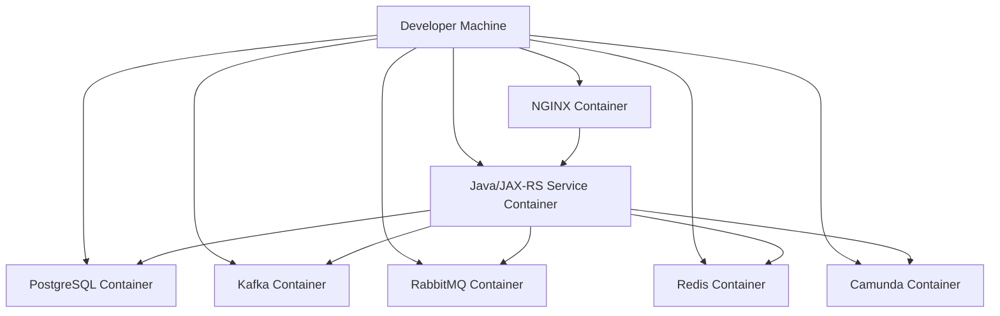

# Docker Compose and Local Development

> Fokus part ini: memakai Docker Compose sebagai **local development orchestration tool** tanpa salah mengira bahwa Compose sama dengan Kubernetes production.
>
> Compose bagus untuk local feedback loop, dependency simulation, debugging, dan onboarding. Tetapi Compose bukan representasi penuh dari scheduling, networking, security, autoscaling, dan failure behavior Kubernetes.

---

## 1. Core Mental Model

Docker Compose menjalankan beberapa container sebagai satu local application stack.

Contoh stack enterprise Java/JAX-RS:



Compose memberi:

- multi-container local environment
- service DNS antar container
- shared network
- volume persistence
- port mapping ke host
- env var injection
- simple dependency startup ordering
- local test harness

Compose tidak memberi secara penuh:

- Kubernetes scheduler
- pod lifecycle
- readiness-based service routing
- NetworkPolicy
- RBAC
- ServiceAccount identity
- cloud IAM integration
- HPA/autoscaling
- PodDisruptionBudget
- ingress controller lifecycle
- production load balancer behavior

---

## 2. Why Compose Exists

Compose menyelesaikan masalah local development:

- developer tidak perlu install PostgreSQL/Kafka/RabbitMQ/Redis secara manual
- dependency version lebih konsisten
- onboarding lebih cepat
- test integration lebih mudah
- local environment bisa reset/recreate
- service dapat diuji dalam network container
- local NGINX/API gateway simulation bisa dibuat

Namun Compose juga bisa menipu.

Local Compose sering lebih sederhana dari production:

- single node
- no resource pressure
- no pod rescheduling
- no rolling update
- no cloud networking
- no managed identity
- no real secret manager
- no production TLS chain
- no real observability pipeline

Rule:

> Compose digunakan untuk local feedback loop, bukan untuk membuktikan production readiness.

---

## 3. Compose File Anatomy

Contoh sederhana:

```yaml
services:
  app:
    build:
      context: .
      dockerfile: Dockerfile
    ports:
      - "8080:8080"
    environment:
      DATABASE_URL: jdbc:postgresql://postgres:5432/appdb
      KAFKA_BOOTSTRAP_SERVERS: kafka:9092
    depends_on:
      - postgres
      - kafka

  postgres:
    image: postgres:16
    environment:
      POSTGRES_DB: appdb
      POSTGRES_USER: app
      POSTGRES_PASSWORD: app
    ports:
      - "5432:5432"
    volumes:
      - postgres-data:/var/lib/postgresql/data

  kafka:
    image: apache/kafka:latest
    ports:
      - "9092:9092"

volumes:
  postgres-data:
```

Komponen utama:

- `services`: daftar container
- `image`: image yang dipakai
- `build`: cara membangun image lokal
- `ports`: host-to-container port mapping
- `environment`: env var container
- `volumes`: persistent data atau bind mount
- `networks`: network antar service
- `depends_on`: startup dependency sederhana
- `healthcheck`: status health container

---

## 4. Compose vs Kubernetes

| Concern | Docker Compose | Kubernetes |
|---|---|---|
| Unit runtime | Container | Pod |
| Service discovery | Service name DNS | Service DNS, EndpointSlice |
| Deployment | `docker compose up` | Deployment/StatefulSet/Job |
| Scheduling | Local Docker daemon | Scheduler across nodes |
| Scaling | Manual replicas | HPA/VPA/Cluster Autoscaler |
| Config | env/file | ConfigMap/Secret/External config |
| Secret | local/env/file | Secret/External Secret/Cloud secret manager |
| Network policy | limited | NetworkPolicy/CNI dependent |
| Identity | host/local credential | ServiceAccount, IRSA, Workload Identity |
| Rollout | recreate manually | rolling update/canary/blue-green |
| Observability | logs locally | logs, metrics, traces, events, dashboards |

Compose adalah local orchestrator.
Kubernetes adalah production control plane.

---

## 5. Local Development Goals

Compose environment yang baik harus mendukung:

1. menjalankan dependency lokal
2. menjalankan aplikasi dengan config mirip production
3. menyediakan data awal
4. mendukung reset cepat
5. mendukung debug Java
6. menyediakan log yang mudah dibaca
7. memisahkan secret lokal dari secret production
8. tidak menyembunyikan failure dependency
9. tidak mengklaim parity palsu
10. mudah dipakai developer baru

---

## 6. Recommended Local Stack Pattern

Struktur repo bisa seperti:

```text
service-repo/
  Dockerfile
  docker-compose.yml
  docker-compose.override.yml
  .env.example
  .dockerignore
  local/
    postgres/
      init.sql
    kafka/
      topics.sh
    rabbitmq/
      definitions.json
    nginx/
      nginx.conf
    camunda/
      README.md
  src/
  pom.xml
```

Prinsip:

- `docker-compose.yml` untuk default stack
- `.env.example` untuk template local env
- `.env` tidak commit
- local seed script eksplisit
- override file untuk developer-specific setting
- data volume bisa dihapus dengan instruksi jelas

---

## 7. Java/JAX-RS Service in Compose

Ada dua pola utama.

### 7.1 Run app as container

```yaml
services:
  app:
    build: .
    ports:
      - "8080:8080"
      - "5005:5005"
    environment:
      JAVA_OPTS: >-
        -Xms256m
        -Xmx512m
        -agentlib:jdwp=transport=dt_socket,server=y,suspend=n,address=*:5005
      DATABASE_URL: jdbc:postgresql://postgres:5432/appdb
    depends_on:
      postgres:
        condition: service_healthy
```

Kelebihan:

- mirip container runtime
- entrypoint diuji
- env var diuji
- network antar container diuji

Kekurangan:

- build loop bisa lebih lambat
- hot reload lebih kompleks
- IDE integration perlu setup

### 7.2 Run dependencies in Compose, app on host

```text
Java app runs from IDE
PostgreSQL/Kafka/RabbitMQ/Redis run in Compose
```

Kelebihan:

- debug mudah
- hot reload mudah
- development cepat

Kekurangan:

- app tidak berjalan dalam container
- environment lebih berbeda dari production
- host networking beda dari container networking

Senior approach:

> Sediakan dua mode: fast IDE mode dan container-runtime mode.

---

## 8. Local PostgreSQL

Contoh:

```yaml
services:
  postgres:
    image: postgres:16
    ports:
      - "5432:5432"
    environment:
      POSTGRES_DB: appdb
      POSTGRES_USER: app
      POSTGRES_PASSWORD: app
    volumes:
      - postgres-data:/var/lib/postgresql/data
      - ./local/postgres/init.sql:/docker-entrypoint-initdb.d/init.sql:ro
    healthcheck:
      test: ["CMD-SHELL", "pg_isready -U app -d appdb"]
      interval: 5s
      timeout: 3s
      retries: 20

volumes:
  postgres-data:
```

Hal penting:

- init script hanya berjalan saat volume baru dibuat
- schema migration sebaiknya diuji terpisah
- local password bukan production secret
- timezone dan collation bisa berbeda dari production
- extension PostgreSQL perlu diverifikasi

Failure mode:

- app start sebelum DB ready
- volume lama berisi schema usang
- migration gagal karena state lokal kotor
- port 5432 bentrok dengan PostgreSQL host

Debug:

```bash
docker compose logs postgres
docker compose exec postgres psql -U app -d appdb
docker compose down -v
```

Gunakan `down -v` hati-hati karena menghapus data volume.

---

## 9. Local Kafka

Kafka lokal sering lebih rumit karena advertised listener.

Masalah umum:

```text
App cannot connect to Kafka
Broker returns localhost but app runs inside container
Consumer connects from host but advertised listener points to container DNS
```

Mental model:

- listener adalah endpoint broker menerima koneksi
- advertised listener adalah endpoint yang diberitahukan ke client
- client inside container dan client on host butuh endpoint berbeda

Pattern:

```yaml
services:
  kafka:
    image: apache/kafka:latest
    ports:
      - "9092:9092"
    environment:
      KAFKA_NODE_ID: 1
      KAFKA_PROCESS_ROLES: broker,controller
      KAFKA_LISTENERS: PLAINTEXT://:9092,CONTROLLER://:9093
      KAFKA_ADVERTISED_LISTENERS: PLAINTEXT://kafka:9092
      KAFKA_CONTROLLER_LISTENER_NAMES: CONTROLLER
      KAFKA_CONTROLLER_QUORUM_VOTERS: 1@kafka:9093
```

Jika app berjalan di host, advertised listener mungkin perlu `localhost:9092`.

Dalam repo enterprise, biasanya perlu dokumentasi jelas:

- mode app-in-container
- mode app-on-host
- bootstrap server untuk masing-masing mode
- topic creation
- consumer group reset

Debug:

```bash
docker compose logs kafka
docker compose exec kafka bash
```

Jika image tidak memiliki tool, gunakan helper container dengan Kafka CLI.

Failure mode Kafka local:

- advertised listener salah
- topic belum dibuat
- consumer group offset stale
- schema registry tidak tersedia jika production menggunakannya
- message retention berbeda dari production

---

## 10. Local RabbitMQ

Contoh:

```yaml
services:
  rabbitmq:
    image: rabbitmq:3-management
    ports:
      - "5672:5672"
      - "15672:15672"
    environment:
      RABBITMQ_DEFAULT_USER: app
      RABBITMQ_DEFAULT_PASS: app
    volumes:
      - rabbitmq-data:/var/lib/rabbitmq
      - ./local/rabbitmq/definitions.json:/etc/rabbitmq/definitions.json:ro
```

Hal penting:

- management UI di port 15672
- AMQP di port 5672
- queue/exchange/binding bisa diseed via definitions
- local durability tidak sama dengan cluster production

Failure mode:

- queue belum dibuat
- exchange binding salah
- credential salah
- app connect ke `localhost` dari dalam container
- message unacked menumpuk

Debug:

```bash
docker compose logs rabbitmq
docker compose exec rabbitmq rabbitmqctl list_queues
docker compose exec rabbitmq rabbitmqctl list_exchanges
```

---

## 11. Local Redis

Contoh:

```yaml
services:
  redis:
    image: redis:7
    ports:
      - "6379:6379"
    command: ["redis-server", "--appendonly", "yes"]
    volumes:
      - redis-data:/data
```

Hal penting:

- local Redis single-node tidak sama dengan cluster/sentinel production
- eviction policy default perlu diperhatikan
- persistence lokal bisa membuat test tidak clean
- Redis password/TLS mungkin berbeda dari production

Failure mode:

- stale cache membuat hasil test membingungkan
- key namespace bentrok
- TTL tidak sesuai ekspektasi
- app connect ke host salah

Debug:

```bash
docker compose exec redis redis-cli
```

Useful commands:

```text
KEYS *
TTL some:key
GET some:key
INFO memory
FLUSHDB
```

Gunakan `FLUSHDB` hati-hati, walaupun lokal.

---

## 12. Local NGINX

NGINX lokal berguna untuk mensimulasikan reverse proxy, path routing, header forwarding, TLS termination sederhana, dan timeout.

Contoh:

```yaml
services:
  nginx:
    image: nginx:1.27
    ports:
      - "8088:80"
    volumes:
      - ./local/nginx/nginx.conf:/etc/nginx/nginx.conf:ro
    depends_on:
      - app
```

Contoh config:

```nginx
events {}

http {
  server {
    listen 80;

    location /api/ {
      proxy_pass http://app:8080/;
      proxy_set_header Host $host;
      proxy_set_header X-Forwarded-For $proxy_add_x_forwarded_for;
      proxy_set_header X-Forwarded-Proto $scheme;
      proxy_connect_timeout 5s;
      proxy_read_timeout 30s;
    }
  }
}
```

Hal yang bisa diuji lokal:

- path rewrite
- forwarded headers
- timeout
- large request body
- CORS jika relevan
- upstream unavailable

Hal yang tidak sepenuhnya sama dengan production:

- cloud load balancer behavior
- ingress controller annotation
- TLS certificate chain production
- source IP preservation
- WAF/CDN behavior

---

## 13. Local Camunda

Camunda lokal tergantung versi dan deployment model.

Kemungkinan model:

- Camunda Platform 7 engine embedded
- Camunda 7 external engine container
- Camunda 8/Zeebe-based stack
- worker-only service yang connect ke external workflow engine

Jangan mengasumsikan CSG memakai salah satu tanpa verifikasi.

Compose bisa membantu untuk:

- menjalankan workflow engine lokal jika service bergantung padanya
- menjalankan worker integration test
- seed BPMN/process definition
- menguji retry/failure worker

Checklist:

- process engine apa yang digunakan?
- service ini engine, worker, atau client?
- BPMN artifact dibundel di image atau dideploy terpisah?
- database Camunda lokal perlu PostgreSQL terpisah?
- retry semantics lokal sama atau tidak dengan production?

---

## 14. Compose Networking

Secara default, Compose membuat network dan service bisa saling resolve dengan nama service.

Contoh:

```yaml
services:
  app:
    environment:
      DATABASE_HOST: postgres
      REDIS_HOST: redis
```

Dari `app` container:

```text
postgres:5432
redis:6379
rabbitmq:5672
kafka:9092
```

Dari host machine:

```text
localhost:5432
localhost:6379
localhost:5672
localhost:9092
```

Kesalahan umum:

- app di container memakai `localhost` untuk DB
- app di host memakai `postgres` tanpa DNS host mapping
- Kafka advertised listener salah
- port mapping bentrok

Rule:

> `localhost` selalu berarti network namespace saat ini, bukan “mesin developer secara ajaib”.

---

## 15. Volumes and Persistence

Compose volume digunakan untuk mempertahankan data container.

Named volume:

```yaml
volumes:
  postgres-data:
```

Bind mount:

```yaml
volumes:
  - ./local/postgres/init.sql:/docker-entrypoint-initdb.d/init.sql:ro
```

Trade-off:

| Volume type | Kelebihan | Risiko |
|---|---|---|
| Named volume | dikelola Docker, cocok untuk DB local | state tersembunyi, bisa stale |
| Bind mount | mudah edit dari host | permission issue, OS-specific behavior |
| tmpfs | clean dan cepat | data hilang saat stop |

Failure mode:

- schema lama tertahan di volume
- permission denied
- path berbeda Windows/macOS/Linux
- file watcher tidak bekerja baik di bind mount
- init script tidak rerun

Commands:

```bash
docker volume ls
docker compose down -v
docker compose up --force-recreate
```

---

## 16. Seed Data and Test Data

Seed data lokal harus:

- kecil
- non-sensitive
- deterministic
- versioned
- mudah reset
- tidak berasal dari production dump tanpa sanitization

Anti-pattern:

- memasukkan customer data ke repo
- memasukkan dump production ke image
- seed data terlalu besar
- local test bergantung pada urutan manual
- migration dan seed bercampur tanpa kontrol

Pattern:

```text
1. Start dependency containers
2. Run migrations
3. Run seed scripts
4. Start app
5. Run smoke test
```

Untuk PostgreSQL:

- gunakan Flyway/Liquibase jika service sudah pakai
- pisahkan schema migration dan seed local
- dokumentasikan reset

Untuk Kafka/RabbitMQ:

- seed topic/queue/exchange/binding
- dokumentasikan consumer group reset
- buat sample message kecil

---

## 17. Local Secret Handling

Local secret bukan production secret.

Gunakan `.env.example`:

```text
POSTGRES_USER=app
POSTGRES_PASSWORD=app
JWT_SECRET=local-dev-only
```

`.env` harus masuk `.gitignore`.

Compose:

```yaml
env_file:
  - .env
```

Aturan:

- jangan commit `.env` berisi secret nyata
- jangan copy `.env` ke image
- jangan memakai production credential untuk local dev
- jangan masukkan token cloud personal ke compose file
- gunakan mock/local credential jika memungkinkan

Jika service butuh AWS/Azure credential lokal, gunakan pendekatan yang disepakati internal:

- profile local developer
- temporary credentials
- local emulator jika tersedia
- secret manager dev environment

Jangan mengarang strategi CSG. Verifikasi dengan platform/security.

---

## 18. Healthcheck in Compose

Compose healthcheck bisa membantu startup dependency.

PostgreSQL example:

```yaml
healthcheck:
  test: ["CMD-SHELL", "pg_isready -U app -d appdb"]
  interval: 5s
  timeout: 3s
  retries: 20
```

App depends on healthy DB:

```yaml
depends_on:
  postgres:
    condition: service_healthy
```

Namun hati-hati:

- Compose healthcheck bukan Kubernetes readiness probe
- `depends_on` tidak menjamin dependency selalu healthy setelah startup
- app tetap harus punya retry/backoff
- app startup harus resilient terhadap dependency belum siap

Production lesson:

> Local startup ordering tidak boleh menggantikan application-level resilience.

---

## 19. Debugging Java Container Locally

Enable remote debug:

```yaml
environment:
  JAVA_OPTS: >-
    -agentlib:jdwp=transport=dt_socket,server=y,suspend=n,address=*:5005
ports:
  - "5005:5005"
```

Jika ingin app menunggu debugger:

```text
suspend=y
```

Debug concerns:

- jangan aktifkan debug port di production image config
- jangan expose debug port di shared environment
- pastikan compose override local-only
- debug port dapat menjadi remote code execution risk

Local debug workflow:

```bash
docker compose up --build app
```

Lalu attach IDE ke `localhost:5005`.

---

## 20. Hot Reload and Fast Feedback

Hot reload bergantung framework/runtime.

Untuk Java/JAX-RS enterprise, opsi umum:

- app run di IDE, dependencies in Compose
- bind mount source dan run Maven in container
- dev mode dari framework tertentu
- rebuild image on change

Trade-off:

| Mode | Feedback | Production parity |
|---|---:|---:|
| App in IDE | cepat | rendah-sedang |
| App in container with bind mount | sedang | sedang |
| Rebuild image every change | lambat | lebih tinggi |
| Dev mode framework | cepat | framework-specific |

Rekomendasi:

- gunakan IDE mode untuk coding cepat
- gunakan container mode sebelum PR/smoke test
- CI tetap menjadi source of truth

---

## 21. Local Environment Parity

Parity bukan berarti local harus identik dengan production.

Parity berarti local cukup mirip untuk menangkap bug yang relevan.

Hal yang sebaiknya mirip:

- Java version
- dependency version
- application port
- env var names
- database version mayor
- Kafka/RabbitMQ/Redis protocol behavior
- health endpoint
- logging format dasar
- Dockerfile runtime path
- startup command

Hal yang biasanya tidak sama:

- cloud IAM
- production secret manager
- multi-AZ topology
- real ingress controller
- autoscaling
- node pressure
- network policies
- production TLS chain
- managed service behavior

Dokumentasikan gap ini agar tidak ada false confidence.

---

## 22. Compose for Integration Tests

Compose bisa dipakai untuk integration tests lokal atau CI.

Pattern:


Pertimbangan:

- test harus deterministic
- cleanup harus jelas
- port conflict harus dihindari
- logs dependency harus disimpan saat gagal
- CI tidak boleh bergantung pada state lama

Untuk CI, Testcontainers bisa menjadi alternatif yang lebih programmatic.

Compose unggul untuk stack-level local dev.
Testcontainers unggul untuk test yang dekat dengan kode.

---

## 23. Compose Profiles

Profiles membantu menjalankan subset service.

```yaml
services:
  camunda:
    image: camunda/camunda-bpm-platform:latest
    profiles:
      - workflow

  nginx:
    image: nginx:1.27
    profiles:
      - edge
```

Run:

```bash
docker compose --profile workflow up
```

Gunakan profile untuk:

- dependency optional
- heavy services
- edge simulation
- observability stack local
- workflow engine local

Jangan membuat profile terlalu banyak sampai membingungkan onboarding.

---

## 24. Compose Override

`docker-compose.override.yml` otomatis dibaca oleh Docker Compose.

Gunakan untuk local developer-specific config:

```yaml
services:
  app:
    environment:
      LOG_LEVEL: DEBUG
    volumes:
      - ./target:/app/target
```

Rule:

- file default harus aman dan umum
- override boleh untuk lokal
- jangan commit override berisi secret personal
- dokumentasikan override yang umum dipakai

---

## 25. Common Failure Modes

### 25.1 App cannot connect to PostgreSQL

Gejala:

```text
Connection refused
UnknownHostException: postgres
password authentication failed
```

Penyebab:

- app memakai host salah
- app di container memakai `localhost`
- DB belum healthy
- password berbeda
- volume lama dengan user/password lama

Debug:

```bash
docker compose ps
docker compose logs postgres
docker compose exec app sh
```

Dari app container:

```bash
nc -vz postgres 5432
```

Jika tidak ada `nc`, gunakan debug container di network yang sama.

---

### 25.2 Kafka connection fails

Gejala:

```text
TimeoutException
Broker may not be available
Connection to node -1 failed
```

Penyebab:

- advertised listener salah
- bootstrap server untuk host/container tertukar
- Kafka belum ready
- topic belum ada

Debug:

- cek logs Kafka
- cek advertised listener
- cek app berjalan di host atau container
- test dengan Kafka CLI dari network yang sama

---

### 25.3 RabbitMQ queue not found

Gejala:

```text
NOT_FOUND - no queue
ACCESS_REFUSED
connection refused
```

Penyebab:

- definitions tidak loaded
- vhost salah
- credential salah
- queue declare policy berbeda

Debug:

```bash
docker compose logs rabbitmq
docker compose exec rabbitmq rabbitmqctl list_queues
```

---

### 25.4 Redis stale data

Gejala:

- test gagal tidak konsisten
- response cache lama
- TTL aneh

Penyebab:

- volume persistent
- key namespace tidak dibersihkan
- local test reuse DB

Debug:

```bash
docker compose exec redis redis-cli DBSIZE
docker compose exec redis redis-cli KEYS '*'
```

---

### 25.5 Port conflict

Gejala:

```text
bind: address already in use
```

Penyebab:

- service host sudah berjalan
- compose stack lain memakai port
- IDE/dev server memakai port

Debug:

```bash
lsof -i :8080
lsof -i :5432
```

Mitigasi:

- ubah host port
- gunakan profile
- hentikan service host

---

### 25.6 Permission denied on volume

Gejala:

```text
permission denied
cannot write file
```

Penyebab:

- container user non-root
- bind mount owner mismatch
- path host protected
- Linux/macOS permission behavior berbeda

Mitigasi:

- gunakan named volume
- set UID/GID konsisten
- pastikan writable path benar
- jangan jalankan semua sebagai root hanya untuk menghindari problem

---

### 25.7 App starts before dependency ready

Gejala:

- startup gagal
- CrashLoop local
- connection refused saat boot

Penyebab:

- `depends_on` hanya start order
- dependency belum healthy
- app tidak punya retry

Mitigasi:

- healthcheck dependency
- app retry/backoff
- startup timeout masuk akal
- jangan hardcode sleep sebagai solusi utama

---

## 26. Local Observability

Minimal local observability:

```bash
docker compose ps
docker compose logs -f app
docker compose logs -f postgres
docker compose top
docker stats
```

Compose logs harus cukup untuk melihat:

- startup config penting tanpa secret
- connection target
- migration status
- health endpoint status
- consumer start/stop
- request correlation ID jika diuji

Jangan log:

- password
- token
- API key
- PII
- full request body sensitif

Optional local observability:

- Prometheus local
- Grafana local
- OpenTelemetry collector local
- Jaeger/Tempo local
- Loki local

Namun jangan jadikan local stack terlalu berat untuk onboarding.

---

## 27. Security Concerns

Compose local sering longgar, tetapi tetap perlu disiplin:

- jangan memakai production credentials
- jangan expose service ke `0.0.0.0` tanpa sadar
- jangan commit `.env`
- jangan commit cert/key private
- jangan mount Docker socket kecuali benar-benar perlu
- jangan menjalankan privileged container tanpa alasan
- jangan menggunakan image tidak trusted untuk dependency penting
- jangan pakai `latest` untuk dependency lokal yang butuh stabilitas

Docker socket risk:

```yaml
volumes:
  - /var/run/docker.sock:/var/run/docker.sock
```

Container dengan akses Docker socket secara praktis bisa mengontrol host Docker daemon.

---

## 28. Networking Concerns

Local Compose networking berbeda dari Kubernetes.

Perbedaan penting:

- tidak ada Service ClusterIP
- tidak ada EndpointSlice
- tidak ada kube-proxy
- tidak ada CNI policy production
- tidak ada ingress controller kecuali disimulasikan
- host networking Docker Desktop berbeda dari Linux native

Jangan menutup mata terhadap gap ini.

Gunakan Compose untuk memahami:

- service-to-service DNS
- container network namespace
- port mapping
- proxy header
- timeout
- startup dependency

Gunakan Kubernetes environment untuk memvalidasi:

- Service routing
- ingress behavior
- DNS search domain
- NetworkPolicy
- cloud load balancer
- private endpoint

---

## 29. Performance Concerns

Compose local performance dipengaruhi:

- Docker Desktop resource limit
- CPU/memory host
- volume mount performance
- Kafka/PostgreSQL memory usage
- Java heap
- file watcher
- image rebuild frequency

Masalah umum:

- Docker Desktop memory terlalu kecil
- PostgreSQL/Kafka berebut memory dengan JVM
- bind mount lambat di macOS/Windows
- log terlalu verbose
- image rebuild penuh setiap perubahan

Practical tips:

- set resource Docker Desktop cukup
- gunakan profile untuk service berat
- gunakan named volume untuk DB
- pisahkan fast IDE mode dari full container mode
- batasi log debug

---

## 30. Cost Awareness

Walaupun lokal tidak langsung menambah cloud cost, Compose bisa memengaruhi cost secara tidak langsung:

- developer time hilang karena onboarding sulit
- CI lambat karena stack terlalu berat
- flaky integration tests
- image build tidak efisien
- local environment tidak menangkap bug production sehingga incident mahal

Efficient local stack harus:

- cepat start
- mudah reset
- cukup realistis
- tidak terlalu berat
- tidak membutuhkan credential production

---

## 31. Correctness Concerns

Local correctness berarti:

- app connect ke dependency yang benar
- schema sesuai migration
- topic/queue tersedia
- cache bisa reset
- env var sama namanya dengan runtime production
- startup behavior terlihat
- shutdown behavior bisa diuji
- seed data deterministic
- failure dependency bisa disimulasikan

Contoh simulasi failure:

```bash
docker compose stop postgres
docker compose stop kafka
docker compose pause redis
docker compose restart rabbitmq
```

Gunakan untuk melihat:

- retry behavior
- timeout
- circuit breaker
- error log
- readiness behavior
- graceful shutdown

---

## 32. Production Parity Checklist

Compose local sebaiknya menjawab:

- [ ] Apakah Java version sama dengan production image?
- [ ] Apakah Dockerfile runtime yang sama diuji?
- [ ] Apakah env var name sama dengan Kubernetes config?
- [ ] Apakah port sama?
- [ ] Apakah health endpoint sama?
- [ ] Apakah dependency major version sama?
- [ ] Apakah schema migration diuji?
- [ ] Apakah Kafka/RabbitMQ topology diseed?
- [ ] Apakah Redis key namespace diuji?
- [ ] Apakah NGINX/proxy header diuji jika relevan?
- [ ] Apakah secret lokal jelas bukan production?
- [ ] Apakah gap dengan Kubernetes didokumentasikan?

---

## 33. Example Full Compose Skeleton

```yaml
services:
  app:
    build:
      context: .
      dockerfile: Dockerfile
    ports:
      - "8080:8080"
      - "5005:5005"
    environment:
      JAVA_OPTS: >-
        -Xms256m
        -Xmx512m
        -agentlib:jdwp=transport=dt_socket,server=y,suspend=n,address=*:5005
      DATABASE_URL: jdbc:postgresql://postgres:5432/appdb
      DATABASE_USER: app
      DATABASE_PASSWORD: app
      KAFKA_BOOTSTRAP_SERVERS: kafka:9092
      RABBITMQ_HOST: rabbitmq
      REDIS_HOST: redis
    depends_on:
      postgres:
        condition: service_healthy
      rabbitmq:
        condition: service_started
      redis:
        condition: service_started

  postgres:
    image: postgres:16
    environment:
      POSTGRES_DB: appdb
      POSTGRES_USER: app
      POSTGRES_PASSWORD: app
    ports:
      - "5432:5432"
    volumes:
      - postgres-data:/var/lib/postgresql/data
      - ./local/postgres/init.sql:/docker-entrypoint-initdb.d/init.sql:ro
    healthcheck:
      test: ["CMD-SHELL", "pg_isready -U app -d appdb"]
      interval: 5s
      timeout: 3s
      retries: 20

  rabbitmq:
    image: rabbitmq:3-management
    ports:
      - "5672:5672"
      - "15672:15672"
    environment:
      RABBITMQ_DEFAULT_USER: app
      RABBITMQ_DEFAULT_PASS: app

  redis:
    image: redis:7
    ports:
      - "6379:6379"

  nginx:
    image: nginx:1.27
    profiles:
      - edge
    ports:
      - "8088:80"
    volumes:
      - ./local/nginx/nginx.conf:/etc/nginx/nginx.conf:ro
    depends_on:
      - app

volumes:
  postgres-data:
```

Catatan:

- Kafka intentionally omitted dari skeleton sederhana karena config listener sangat bergantung mode host/container.
- Untuk Kafka, dokumentasikan mode secara eksplisit di repo.
- Jangan copy skeleton mentah ke production.

---

## 34. PR Review Checklist

Saat review Compose/local dev changes:

### Compose structure

- [ ] Service names jelas.
- [ ] Port mapping tidak bentrok umum.
- [ ] Env var konsisten dengan aplikasi.
- [ ] `.env.example` tersedia.
- [ ] `.env` tidak commit.
- [ ] Volume usage jelas.
- [ ] Reset instruction tersedia.

### Dependency correctness

- [ ] PostgreSQL version masuk akal.
- [ ] Kafka advertised listener benar untuk mode yang didukung.
- [ ] RabbitMQ queue/exchange/binding seed jelas.
- [ ] Redis persistence/flush behavior jelas.
- [ ] NGINX config merepresentasikan use case yang diuji.
- [ ] Camunda model diverifikasi sesuai service.

### Security

- [ ] Tidak ada production secret.
- [ ] Tidak ada private key/cert sensitif.
- [ ] Tidak mount Docker socket tanpa alasan.
- [ ] Tidak privileged container tanpa alasan.
- [ ] Debug port hanya local.

### Developer experience

- [ ] `docker compose up` cukup untuk onboarding dasar.
- [ ] README menjelaskan mode app-in-container dan app-on-host.
- [ ] Troubleshooting umum tersedia.
- [ ] Reset command jelas.
- [ ] Logs mudah dibaca.

### Production awareness

- [ ] Gap Compose vs Kubernetes dijelaskan.
- [ ] Compose tidak dipakai sebagai bukti production readiness.
- [ ] Config name selaras dengan Kubernetes manifest.
- [ ] Dockerfile runtime tetap diuji.

---

## 35. Internal Verification Checklist

Untuk konteks CSG/team, verifikasi:

### Local development standard

- [ ] Apakah tiap service punya Docker Compose resmi?
- [ ] Apakah ada devcontainer standard?
- [ ] Apakah app biasanya dijalankan di IDE atau container?
- [ ] Apakah ada local onboarding guide?
- [ ] Apakah ada standard `.env.example`?

### Dependencies

- [ ] PostgreSQL versi local vs environment shared.
- [ ] Kafka local setup dan advertised listener pattern.
- [ ] RabbitMQ local topology.
- [ ] Redis mode production: standalone, sentinel, cluster, managed.
- [ ] Camunda deployment model yang benar.
- [ ] NGINX/API gateway local simulation jika relevan.

### Secrets and config

- [ ] Cara mendapatkan local dev secret.
- [ ] Secret manager dev environment jika ada.
- [ ] Apakah production credential dilarang untuk local.
- [ ] Config precedence antara env var, file, secret, config service.

### Build and runtime

- [ ] Apakah Dockerfile production sama digunakan lokal.
- [ ] Apakah image local dibangun dengan Maven multi-stage.
- [ ] Apakah Java debug port standard.
- [ ] Apakah graceful shutdown bisa diuji lokal.

### Testing and CI

- [ ] Apakah Compose dipakai di CI.
- [ ] Apakah Testcontainers dipakai.
- [ ] Apakah integration test butuh dependency lokal.
- [ ] Apakah seed data deterministic.
- [ ] Apakah logs dependency dikumpulkan saat test gagal.

### Platform parity

- [ ] Gap local vs Kubernetes terdokumentasi.
- [ ] Gap local vs EKS/AKS/on-prem diketahui.
- [ ] Local DNS/network behavior tidak disalahartikan sebagai production behavior.

---

## 36. Summary

Docker Compose adalah alat penting untuk local development enterprise backend, tetapi harus digunakan dengan mental model yang benar.

Compose membantu:

- menjalankan dependency lokal
- mempercepat onboarding
- menguji integration flow
- debugging Java service
- mensimulasikan proxy/edge sederhana
- memvalidasi config dasar

Compose tidak menggantikan:

- Kubernetes workload lifecycle
- ingress/load balancer production
- cloud identity
- NetworkPolicy
- autoscaling
- production observability
- runbook dan readiness review

Prinsip utama:

> Gunakan Compose untuk feedback loop lokal. Gunakan Kubernetes environment untuk membuktikan deployment behavior. Jangan campur local convenience dengan production guarantee.
