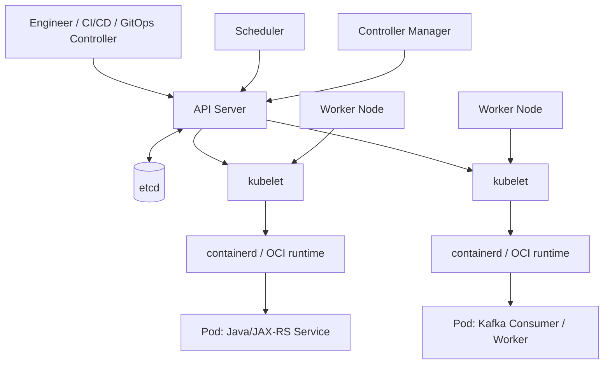
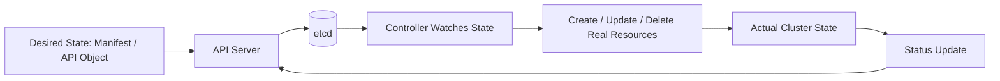
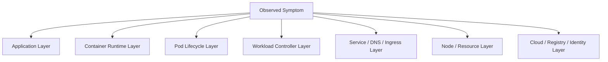

# Kubernetes Foundation

## 1. Core Mental Model

Kubernetes bukan sekadar alat untuk menjalankan container.

Kubernetes adalah **distributed control system** yang menjaga agar actual state di cluster mendekati desired state yang kamu deklarasikan melalui API object.

Untuk backend engineer, mental model paling penting adalah:

> Kamu tidak “menjalankan aplikasi” secara langsung. Kamu mendeklarasikan kondisi yang diinginkan, lalu Kubernetes terus-menerus mencoba merekonsiliasi realitas agar sesuai dengan deklarasi itu.

Contoh sederhana:

```yaml
replicas: 3
image: quote-service:1.42.0
```

Deklarasi ini bukan command satu kali. Ini adalah kontrak state.

Jika satu pod mati, Kubernetes membuat pod baru.
Jika node hilang, Kubernetes mencoba menjadwalkan ulang workload.
Jika image tidak bisa di-pull, Kubernetes menandai state gagal dan terus retry sesuai mekanismenya.
Jika readiness gagal, pod tetap hidup tetapi tidak boleh menerima traffic Service.

Mental model ini penting karena banyak bug production muncul dari kesalahpahaman berikut:

> Engineer mengira Kubernetes menjalankan script deployment, padahal Kubernetes menjalankan reconciliation loop.

---

## 2. Why Kubernetes Exists

Kubernetes ada karena sistem microservices production membutuhkan platform yang mampu menangani hal-hal berikut secara konsisten:

1. Menjalankan banyak container di banyak node.
2. Menjaga jumlah replica tetap sesuai desired state.
3. Menjadwalkan workload berdasarkan resource, constraint, dan availability.
4. Melakukan service discovery antar workload.
5. Menghubungkan traffic external ke service internal.
6. Mengelola configuration dan secret.
7. Melakukan rollout dan rollback.
8. Mengisolasi workload melalui namespace, RBAC, security context, dan network policy.
9. Mengabstraksi storage dan cloud integration.
10. Menyediakan observability primitive seperti logs, events, metrics, dan object status.

Untuk Java/JAX-RS backend, Kubernetes menjadi runtime environment yang menentukan:

- di node mana service berjalan,
- berapa CPU/memory yang tersedia,
- kapan service dianggap ready,
- kapan service dihentikan,
- bagaimana traffic mencapai endpoint JAX-RS,
- bagaimana config dan secret masuk ke process,
- bagaimana service direstart saat gagal,
- bagaimana deployment dipromosikan dan di-rollback.

---

## 3. Kubernetes Is Not Docker Compose at Scale

Docker Compose biasanya digunakan untuk local orchestration.

Ia cocok untuk:

- menjalankan PostgreSQL lokal,
- menjalankan Kafka/RabbitMQ/Redis lokal,
- menjalankan beberapa service untuk development,
- setup cepat di laptop.

Kubernetes berbeda secara fundamental.

| Aspect | Docker Compose | Kubernetes |
|---|---|---|
| Primary purpose | Local multi-container development | Production-grade orchestration platform |
| State model | Mostly imperative/local | Declarative desired state |
| Scheduler | Usually same host | Cluster scheduler across nodes |
| Service discovery | Compose network DNS | Cluster DNS + Service + EndpointSlice |
| Rollout | Manual/recreate-like | Deployment controller, rolling update, rollback |
| Health routing | Limited | Readiness/liveness/startup probes |
| Scaling | Manual | HPA/VPA/cluster autoscaling integrations |
| Security | Local container isolation | RBAC, ServiceAccount, NetworkPolicy, Pod Security, admission |
| Storage | Local volumes | PV/PVC/StorageClass/CSI |
| Cloud integration | Minimal | Load balancer, IAM, private endpoint, CSI, cloud controllers |

The senior-engineer trap:

> “It works in Docker Compose” does not mean “it is production-ready for Kubernetes.”

Compose can hide production concerns such as:

- pod rescheduling,
- slow image pull,
- DNS retry behavior,
- readiness before traffic,
- rolling update overlap,
- connection draining,
- node pressure,
- resource eviction,
- RBAC restrictions,
- NetworkPolicy egress blocking,
- cloud identity resolution,
- load balancer timeout chain.

---

## 4. Kubernetes Architecture at a Glance

Kubernetes cluster consists of:

1. **Control plane**
2. **Worker nodes**
3. **API objects**
4. **Controllers**
5. **Runtime infrastructure**
6. **Networking and storage integrations**



The API server is the front door.
Everything else reacts to object state stored through the API server.

---

## 5. Control Plane Components

### 5.1 API Server

The API server is the central interface to Kubernetes.

All changes go through it:

- `kubectl apply`
- Helm install/upgrade
- Argo CD sync
- Flux reconciliation
- controller updates
- scheduler binding
- kubelet status updates

Important properties:

- validates requests,
- applies admission policies,
- handles authentication/authorization,
- persists state to etcd,
- exposes watch streams to controllers.

For a backend engineer, API server failure or access issue may appear as:

- CI/CD cannot deploy,
- Argo CD cannot sync,
- kubectl commands timeout,
- controller cannot update status,
- HPA cannot fetch/update target state,
- GitOps drift cannot be corrected.

### 5.2 etcd

`etcd` stores Kubernetes cluster state.

It stores object state, not container filesystem data.

Examples stored in etcd:

- Deployment object,
- Pod object,
- Service object,
- ConfigMap object,
- Secret object,
- RBAC object,
- EndpointSlice object,
- controller status.

Do not confuse etcd with application database.

For Java/JAX-RS systems:

- PostgreSQL data is not stored in etcd.
- Kafka messages are not stored in etcd.
- Redis cache is not stored in etcd.
- RabbitMQ queues are not stored in etcd.
- Camunda process data is not stored in etcd unless your architecture does something very unusual.

### 5.3 Scheduler

The scheduler decides where unscheduled pods should run.

It considers:

- CPU request,
- memory request,
- node capacity,
- taints and tolerations,
- node selector,
- affinity/anti-affinity,
- topology spread constraints,
- volume constraints,
- priority and preemption,
- policy/plugin behavior.

A pod stuck in `Pending` often indicates scheduling failure.

Common reasons:

- insufficient CPU,
- insufficient memory,
- PVC not bound,
- required node label missing,
- taint not tolerated,
- anti-affinity too strict,
- topology spread impossible,
- no node in required zone,
- node pool full.

### 5.4 Controller Manager

Controllers reconcile desired state.

Important examples:

- Deployment controller
- ReplicaSet controller
- StatefulSet controller
- DaemonSet controller
- Job controller
- Node controller
- EndpointSlice controller
- ServiceAccount token controller

Example:

A Deployment says `replicas: 3`.
The Deployment controller ensures a ReplicaSet exists.
The ReplicaSet controller ensures three pods exist.
If one pod disappears, the controller creates another.

### 5.5 kubelet

The kubelet runs on each worker node.

It is responsible for:

- watching assigned pods,
- asking container runtime to start/stop containers,
- mounting volumes,
- running probes,
- reporting pod/node status,
- applying resource constraints,
- handling pod termination.

For Java services, kubelet behavior directly affects:

- when your container starts,
- when probes run,
- when SIGTERM is sent,
- when SIGKILL happens,
- when restart occurs,
- when pod status changes.

### 5.6 kube-proxy

`kube-proxy` implements Service routing behavior on nodes.

Depending on cluster implementation, routing may involve:

- iptables,
- IPVS,
- eBPF-based dataplane,
- cloud/CNI-specific implementation.

As a backend engineer, you do not need to memorize every packet path immediately, but you must understand:

- Service IP is virtual.
- Service routes to EndpointSlices.
- EndpointSlices point to pod IPs.
- Readiness affects whether a pod becomes an endpoint.

### 5.7 Container Runtime

Modern Kubernetes usually uses `containerd` as the container runtime.

The runtime is responsible for pulling images and starting containers via OCI runtime components.

Important distinction:

- Docker is not required to run containers in Kubernetes.
- Kubernetes talks to runtime through CRI.
- The image still follows OCI image concepts.

---

## 6. Desired State and Reconciliation Loop

The central Kubernetes pattern:



Example Deployment lifecycle:

1. Engineer commits Deployment manifest.
2. GitOps controller applies manifest to API server.
3. API server validates and stores Deployment object.
4. Deployment controller creates ReplicaSet.
5. ReplicaSet controller creates Pod objects.
6. Scheduler assigns pods to nodes.
7. kubelet on each node starts containers.
8. kubelet reports pod status.
9. Endpoints are updated when pods are ready.
10. Service starts routing traffic to ready pods.

This is why Kubernetes debugging is state-oriented:

- What object exists?
- What does spec say?
- What does status say?
- Which controller owns it?
- Which event explains transition failure?
- Which lower-level object was or was not created?

---

## 7. Kubernetes Objects and Resources

A Kubernetes object represents desired and observed state.

Common objects:

- Pod
- Deployment
- ReplicaSet
- StatefulSet
- DaemonSet
- Job
- CronJob
- Service
- Ingress
- ConfigMap
- Secret
- ServiceAccount
- Role
- RoleBinding
- PersistentVolumeClaim
- StorageClass
- NetworkPolicy
- HorizontalPodAutoscaler
- PodDisruptionBudget

A resource is an API endpoint category.

Example:

```bash
kubectl get deployments
kubectl get pods
kubectl get services
```

Each resource type has:

- `apiVersion`
- `kind`
- `metadata`
- `spec`
- `status`

Part 008 will go deeper into this object model.

---

## 8. Manifest and Declarative Configuration

A manifest is a YAML or JSON representation of Kubernetes object desired state.

Example:

```yaml
apiVersion: apps/v1
kind: Deployment
metadata:
  name: quote-service
  labels:
    app: quote-service
spec:
  replicas: 3
  selector:
    matchLabels:
      app: quote-service
  template:
    metadata:
      labels:
        app: quote-service
    spec:
      containers:
        - name: quote-service
          image: registry.example.com/quote-service:1.42.0
          ports:
            - containerPort: 8080
```

This says:

- desired workload type is Deployment,
- desired name is `quote-service`,
- desired replica count is 3,
- desired pod template uses image `quote-service:1.42.0`,
- desired container port is 8080.

It does not guarantee success.

The real world may reject or fail this desired state due to:

- image pull error,
- invalid resource request,
- scheduling failure,
- crash at startup,
- missing config,
- missing secret,
- failed readiness,
- RBAC denial,
- NetworkPolicy block,
- node pressure.

---

## 9. Kubernetes and Enterprise Java/JAX-RS Systems

For Java/JAX-RS systems, Kubernetes becomes part of the application runtime contract.

### 9.1 Startup Behavior

Java services often have non-trivial startup:

- classpath loading,
- dependency injection initialization,
- JAX-RS resource registration,
- database pool creation,
- Kafka/RabbitMQ client initialization,
- Redis connection setup,
- schema validation,
- warmup cache,
- JIT warmup.

Kubernetes must be configured so startup does not trigger false liveness failure.

Usually this requires:

- startup probe for slow startup,
- readiness probe for traffic readiness,
- liveness probe only for unrecoverable deadlock-like state.

### 9.2 Runtime Resource Behavior

Kubernetes resource settings affect JVM behavior:

- CPU limit can cause throttling.
- Memory limit can cause OOMKilled.
- Request affects scheduling and capacity planning.
- Limit affects runtime failure envelope.
- QoS class affects eviction behavior.

### 9.3 Traffic Routing

JAX-RS endpoint traffic usually flows through:

```text
client
  -> DNS
  -> cloud load balancer / ingress endpoint
  -> ingress controller / API gateway / NGINX
  -> Kubernetes Service
  -> EndpointSlice
  -> Pod IP
  -> container port
  -> Java HTTP server
  -> JAX-RS resource method
```

A 503 may not mean Java code is broken.
It may mean:

- no ready endpoint,
- ingress backend mismatch,
- service selector mismatch,
- pod readiness failed,
- NetworkPolicy blocked,
- application port mismatch,
- timeout chain mismatch.

### 9.4 Shutdown Behavior

Kubernetes sends SIGTERM during pod termination.

Java services must:

- stop accepting new traffic,
- let in-flight requests finish,
- close HTTP server gracefully,
- close DB pool,
- stop Kafka/RabbitMQ consumers safely,
- commit/rollback transactions safely,
- flush logs/traces/metrics,
- exit before SIGKILL.

---

## 10. Impact on PostgreSQL, Kafka, RabbitMQ, Redis, Camunda, and NGINX

### PostgreSQL

Kubernetes affects PostgreSQL clients through:

- DNS resolution,
- connection pool sizing,
- pod restart behavior,
- secret/config rotation,
- NetworkPolicy egress,
- private endpoint routing,
- TLS CA configuration.

Failure examples:

- all replicas start and create too many DB connections,
- readiness endpoint checks DB too aggressively,
- pod restart storm overloads DB,
- secret rotation breaks password unexpectedly,
- DNS to private endpoint resolves wrong address.

### Kafka

For Kafka consumers/producers:

- graceful shutdown matters for rebalancing,
- autoscaling must consider consumer group lag,
- readiness should not blindly depend on Kafka availability,
- NetworkPolicy egress must allow broker traffic,
- DNS and advertised listeners must be correct.

Failure examples:

- consumer killed before committing offset,
- rebalance storm during rolling deployment,
- HPA scales too aggressively,
- Kafka bootstrap DNS fails,
- broker advertised listener not reachable from pod network.

### RabbitMQ

For RabbitMQ consumers:

- message ack semantics matter during shutdown,
- prefetch affects processing and memory,
- connection recovery can hide network flaps,
- queue depth can drive autoscaling.

Failure examples:

- pod receives SIGKILL before ack/nack,
- readiness marks pod ready before consumer channel exists,
- autoscaling creates too many consumers,
- NetworkPolicy blocks AMQP port.

### Redis

Redis clients are sensitive to:

- DNS/service discovery,
- connection timeout,
- retry behavior,
- TLS if enabled,
- NetworkPolicy egress,
- eviction/capacity behavior on Redis side.

Failure examples:

- app startup blocks on Redis,
- liveness restarts app during Redis outage,
- retry storm overloads Redis,
- cache miss storm after rollout.

### Camunda-like Workloads

Camunda or workflow workers require attention to:

- job locking,
- retry semantics,
- idempotency,
- shutdown safety,
- DB connection pool,
- worker concurrency,
- backoff behavior,
- observability of stuck jobs.

Failure examples:

- worker pod killed while job locked,
- retry creates duplicate side effects,
- DB pool exhaustion,
- rollout stops all workers simultaneously.

### NGINX / Ingress

NGINX or ingress affects:

- timeout chain,
- header forwarding,
- request body size,
- TLS termination,
- connection draining,
- route matching,
- upstream health behavior.

Failure examples:

- ingress timeout shorter than Java request timeout,
- missing `X-Forwarded-*` handling,
- path rewrite breaks JAX-RS route,
- 502 due to wrong target port,
- 504 due to long-running endpoint.

---

## 11. Managed Kubernetes: EKS and AKS Awareness

Kubernetes core concepts remain similar across platforms, but cloud integrations differ.

### 11.1 EKS Awareness

In EKS, important AWS-specific integrations may include:

- VPC CNI,
- pod IPs from VPC subnet,
- ECR image registry,
- IAM Roles for Service Accounts,
- AWS Load Balancer Controller,
- ALB/NLB,
- Route 53,
- ACM certificates,
- CloudWatch logs/metrics,
- EBS/EFS CSI drivers,
- Cluster Autoscaler or Karpenter,
- VPC endpoints and PrivateLink.

Do not assume which of these are used internally.
Verify with the team.

### 11.2 AKS Awareness

In AKS, important Azure-specific integrations may include:

- Azure CNI or kubenet,
- ACR image registry,
- Managed Identity,
- Azure Workload Identity,
- Azure Load Balancer,
- Application Gateway / AGIC,
- Azure DNS,
- Azure Monitor / Log Analytics,
- Azure Disk/File CSI,
- Key Vault CSI driver,
- Private Endpoint and Private DNS Zone,
- Cluster Autoscaler.

Again, verify the actual internal setup.

### 11.3 On-Prem / Hybrid Awareness

In on-prem or hybrid Kubernetes, managed cloud assumptions may not hold.

You may need to verify:

- load balancer implementation,
- ingress controller,
- DNS ownership,
- certificate management,
- internal registry,
- storage provider,
- CSI driver,
- firewall/proxy path,
- patching model,
- upgrade process,
- monitoring stack,
- air-gapped constraints.

---

## 12. Kubernetes Failure Model

Kubernetes failure should be analyzed by layer.



Example: API returns 503.

Possible root causes:

- app not ready,
- readiness probe failing,
- Service has no endpoints,
- label selector mismatch,
- pod crashed,
- deployment rollout stuck,
- ingress backend misconfigured,
- NetworkPolicy blocked,
- node issue,
- cloud load balancer health check failed.

Do not jump directly to Java code.

---

## 13. Common Foundation-Level Failure Modes

### 13.1 Pod Pending

Possible causes:

- insufficient CPU/memory,
- PVC unbound,
- node selector mismatch,
- taint not tolerated,
- affinity too strict,
- no available node in zone.

Detect with:

```bash
kubectl describe pod <pod-name> -n <namespace>
```

Look at Events.

### 13.2 ImagePullBackOff

Possible causes:

- wrong image tag,
- missing image,
- registry authentication failure,
- network path to registry blocked,
- image pull secret missing,
- ECR/ACR permission issue,
- registry outage.

Detect with:

```bash
kubectl describe pod <pod-name> -n <namespace>
```

### 13.3 CrashLoopBackOff

Possible causes:

- application startup exception,
- missing env var,
- missing secret/config,
- wrong command/entrypoint,
- port binding failure,
- DB connection failure if startup is strict,
- JVM memory issue,
- permission issue due to non-root container.

Detect with:

```bash
kubectl logs <pod-name> -n <namespace> --previous
```

### 13.4 Service Has No Endpoint

Possible causes:

- selector mismatch,
- pod labels wrong,
- readiness failing,
- pods not created,
- namespace mismatch.

Detect with:

```bash
kubectl get svc <service-name> -n <namespace>
kubectl get endpointslice -n <namespace>
kubectl get pods -n <namespace> --show-labels
```

### 13.5 Rollout Stuck

Possible causes:

- new pods not ready,
- insufficient capacity,
- probe failure,
- image pull failure,
- maxUnavailable/maxSurge too restrictive,
- PDB interaction,
- startup too slow.

Detect with:

```bash
kubectl rollout status deployment/<deployment-name> -n <namespace>
kubectl describe deployment <deployment-name> -n <namespace>
```

---

## 14. Debugging Workflow for Kubernetes Foundation

Use this general flow:

```text
1. Identify namespace and workload name.
2. Check high-level workload state.
3. Check pods created by workload.
4. Check pod status and events.
5. Check logs, including previous logs if restarted.
6. Check Service and EndpointSlice.
7. Check ingress/gateway if external traffic is involved.
8. Check resource pressure and scheduling.
9. Check config/secret/RBAC/network policy if symptoms point there.
10. Check cloud integration only after Kubernetes object state is understood.
```

Useful command pattern:

```bash
kubectl get deploy -n <namespace>
kubectl get rs -n <namespace>
kubectl get pod -n <namespace> -o wide
kubectl describe pod <pod-name> -n <namespace>
kubectl logs <pod-name> -n <namespace>
kubectl logs <pod-name> -n <namespace> --previous
kubectl get svc -n <namespace>
kubectl get endpointslice -n <namespace>
kubectl get events -n <namespace> --sort-by=.lastTimestamp
```

Do not run destructive commands in production unless the runbook or incident commander explicitly allows it.

---

## 15. Correctness Concerns

Kubernetes correctness concerns include:

- desired state does not match actual application expectation,
- readiness does not represent real traffic readiness,
- liveness restarts healthy-but-dependent-on-slow-service pods,
- Deployment selector mismatch,
- ConfigMap/Secret missing or stale,
- resource limit inconsistent with JVM settings,
- rolling update breaks compatibility between service versions,
- shutdown does not preserve in-flight work,
- HPA scales stateless and stateful workloads incorrectly,
- Job retry creates duplicate side effects.

For enterprise quote/order systems, correctness matters more than just availability.

A pod being “Running” does not mean the business operation is safe.

---

## 16. Networking Concerns

Key networking questions:

- How does external traffic enter the cluster?
- Which DNS name points to which load balancer?
- Which ingress rule maps to which service?
- Which Service maps to which pod label selector?
- Which container port is actually serving HTTP?
- Are `X-Forwarded-*` headers preserved and trusted correctly?
- Where is TLS terminated?
- What are the timeout values across client, load balancer, ingress, service, and Java server?
- Are east-west calls allowed by NetworkPolicy?
- Is egress to PostgreSQL/Kafka/RabbitMQ/Redis/cloud services allowed?

---

## 17. Performance Concerns

Kubernetes can affect Java service performance through:

- CPU throttling,
- memory pressure,
- pod placement,
- cross-zone latency,
- DNS latency,
- connection pool explosion during scaling,
- cold start during rollout,
- node pressure eviction,
- noisy neighbor workloads,
- log volume overhead,
- sidecar/proxy overhead,
- ingress timeout and buffering behavior.

Performance debugging must consider platform metrics and application metrics together.

---

## 18. Security and Privacy Concerns

Kubernetes foundation security concerns:

- excessive RBAC permissions,
- default ServiceAccount token mounted unnecessarily,
- secret exposed as env var and leaked in diagnostics,
- privileged container,
- root user in container,
- writable root filesystem,
- broad NetworkPolicy egress,
- public ingress exposure,
- missing TLS policy,
- image from untrusted registry,
- vulnerable base image,
- logs containing PII or sensitive quote/order data.

Do not treat Kubernetes as a security boundary by default.
It provides primitives. The platform and workload configuration determine actual security posture.

---

## 19. Cost Concerns

Kubernetes cost drivers include:

- inflated CPU/memory requests,
- too many replicas,
- inefficient autoscaling,
- large nodes with poor bin packing,
- unnecessary LoadBalancer services,
- high NAT gateway egress,
- excessive logs/metrics/traces,
- over-retained PVCs,
- multi-AZ data transfer,
- idle dev/test clusters,
- unnecessary sidecars.

Backend engineers influence cost directly through manifest choices.

---

## 20. Observability Concerns

At minimum, production Kubernetes service should expose enough signal to answer:

- Is the pod running?
- Is it ready?
- Why did it restart?
- Did it receive SIGTERM?
- How many requests are served?
- What are latency percentiles?
- What are error rates?
- Are DB/Kafka/RabbitMQ/Redis calls failing?
- Is CPU throttling happening?
- Is memory close to limit?
- Are probes failing?
- Is rollout progressing?
- Is Service routing to endpoints?
- Are ingress errors increasing?

Kubernetes events are not a replacement for application logs and metrics.
They are complementary.

---

## 21. Internal Verification Checklist

Use this checklist for CSG/team verification. Do not assume these details.

### Cluster and Platform

- Which Kubernetes distribution is used: EKS, AKS, on-prem, hybrid, or multiple?
- Who owns cluster provisioning?
- Who owns namespaces?
- Who owns ingress?
- Who owns DNS?
- Who owns certificates?
- Who owns observability stack?
- Who owns cluster upgrades?

### Deployment Source of Truth

- Are manifests stored directly as YAML?
- Is Helm used?
- Is Kustomize used?
- Is Argo CD used?
- Is Flux used?
- Is Terraform used for infra?
- Which repository is source of truth?
- Is manual `kubectl apply` allowed?

### Runtime

- What container runtime is used by nodes?
- Is Docker still involved anywhere in production nodes?
- Which image registry is used?
- Are image tags immutable?
- Are digests pinned?

### Java/JAX-RS Workload

- What HTTP server/runtime is used?
- What port serves application traffic?
- Is there a separate management port?
- How are readiness/liveness/startup probes implemented?
- How is graceful shutdown configured?
- What resource requests/limits are standard?
- How are JVM options injected?

### Networking

- What ingress controller is used?
- Is there an API gateway before ingress?
- Is NGINX used at edge or inside cluster?
- How does DNS route to load balancer?
- Where is TLS terminated?
- Are NetworkPolicies enforced?
- How does service egress reach PostgreSQL/Kafka/RabbitMQ/Redis/cloud services?

### Security

- What Pod Security standard is enforced?
- Are containers required to run as non-root?
- Are read-only root filesystems required?
- Are ServiceAccount tokens mounted by default?
- How are secrets sourced?
- Is external secret integration used?
- How is RBAC reviewed?

### Operations

- Where are logs?
- Where are metrics?
- Where are traces?
- What dashboards exist?
- What alerts exist?
- What runbooks exist?
- What is the incident escalation path?
- How is rollback performed?

---

## 22. PR Review Checklist

When reviewing Kubernetes-related changes, ask:

### Manifest Correctness

- Does the resource kind match the workload type?
- Are labels and selectors consistent?
- Are namespaces correct?
- Are probes present and sane?
- Are resource requests/limits present?
- Are config and secret references valid?

### Java Runtime Safety

- Is JVM memory aligned with container memory limit?
- Is startup probe configured for slow startup?
- Does shutdown handle SIGTERM?
- Are thread pools and connection pools appropriate for replica count?

### Traffic Safety

- Does Service target the correct port?
- Does ingress route to the correct Service?
- Are path rewrites safe for JAX-RS routes?
- Are timeouts compatible across the chain?
- Does readiness remove pods before traffic reaches them?

### Security

- Is the container non-root?
- Are unnecessary capabilities dropped?
- Is root filesystem read-only where possible?
- Is RBAC least privilege?
- Are secrets not hardcoded?
- Is external access intentional?

### Operations

- Is rollout strategy safe?
- Is rollback possible?
- Are logs/metrics/traces available?
- Are alerts updated?
- Is runbook updated?
- Are failure modes considered?

---

## 23. Key Takeaways

Kubernetes should be understood as:

1. A desired-state API platform.
2. A reconciliation system.
3. A scheduler and runtime coordinator.
4. A networking abstraction.
5. A storage abstraction.
6. A security and identity surface.
7. An operations platform.
8. A source of both resilience and new failure modes.

For a senior Java/JAX-RS backend engineer, the goal is not to become a full-time cluster administrator immediately.

The goal is to become effective at:

- reading Kubernetes state,
- understanding workload lifecycle,
- reviewing deployment changes,
- reasoning about traffic flow,
- debugging production failures,
- collaborating with platform/SRE/security teams,
- preventing application changes from becoming platform incidents.

