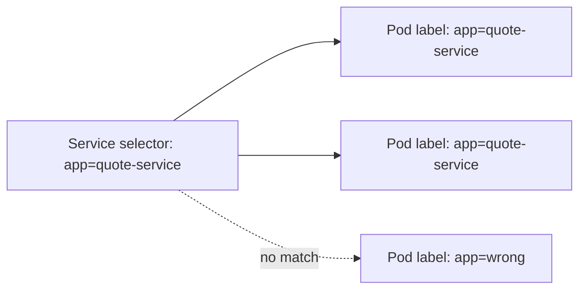
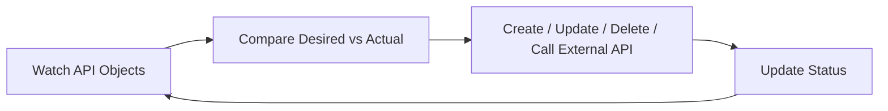
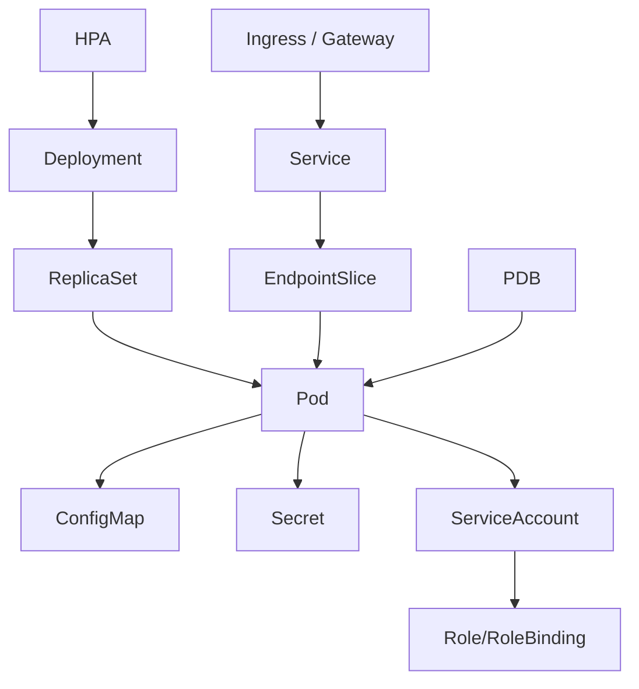

# Kubernetes Object Model

## 1. Core Mental Model

Kubernetes object adalah representasi state yang disimpan di Kubernetes API.

Object biasanya memiliki dua sisi besar:

1. **Desired state** — apa yang kamu minta.
2. **Observed state** — apa yang Kubernetes lihat sedang terjadi.

Secara konseptual:

```text
metadata + spec  -> desired identity and desired behavior
status           -> observed condition and actual progress
```

Untuk senior backend engineer, kemampuan membaca object model jauh lebih penting daripada menghafal command `kubectl`.

Saat ada incident, kamu harus bisa menjawab:

- Object apa yang dibuat?
- Siapa pemilik object itu?
- Desired state-nya apa?
- Actual status-nya apa?
- Controller mana yang merekonsiliasi object itu?
- Label/selector mana yang menghubungkan object ini dengan object lain?
- Apakah object ini stuck karena finalizer, quota, admission, atau dependency lain?

---

## 2. Anatomy of a Kubernetes Object

Hampir semua object Kubernetes mengikuti pola ini:

```yaml
apiVersion: apps/v1
kind: Deployment
metadata:
  name: quote-service
  namespace: quote-order
  labels:
    app: quote-service
    component: api
spec:
  replicas: 3
  selector:
    matchLabels:
      app: quote-service
  template:
    metadata:
      labels:
        app: quote-service
    spec:
      containers:
        - name: quote-service
          image: registry.example.com/quote-service:1.42.0
status:
  replicas: 3
  readyReplicas: 3
```

The major fields:

| Field | Meaning |
|---|---|
| `apiVersion` | API group and version used by the object |
| `kind` | Type of object |
| `metadata` | Identity, labels, annotations, ownership, lifecycle metadata |
| `spec` | Desired state |
| `status` | Observed state, usually written by controllers |

Usually you write `metadata` and `spec`.
Kubernetes controllers write `status`.

Do not manually edit `status` for normal application deployment.

---

## 3. apiVersion

`apiVersion` identifies which Kubernetes API group and version handles the object.

Examples:

```yaml
apiVersion: v1
kind: Service
```

```yaml
apiVersion: apps/v1
kind: Deployment
```

```yaml
apiVersion: batch/v1
kind: Job
```

```yaml
apiVersion: networking.k8s.io/v1
kind: NetworkPolicy
```

Important implications:

- API version determines schema.
- Deprecated API versions can break during cluster upgrade.
- Same conceptual object may evolve between versions.
- CRDs define custom API groups.

Failure modes:

- manifest uses removed API version,
- Helm chart renders deprecated API,
- CRD version mismatch,
- cluster upgrade rejects old resources,
- GitOps sync fails due to unsupported API.

Debugging:

```bash
kubectl api-resources
kubectl explain deployment
kubectl explain deployment.spec
kubectl explain networkpolicy --api-version=networking.k8s.io/v1
```

PR review question:

> Is this `apiVersion` supported by the target cluster version?

---

## 4. kind

`kind` defines the object type.

Common examples:

- `Pod`
- `Deployment`
- `ReplicaSet`
- `StatefulSet`
- `DaemonSet`
- `Job`
- `CronJob`
- `Service`
- `Ingress`
- `ConfigMap`
- `Secret`
- `ServiceAccount`
- `Role`
- `RoleBinding`
- `PersistentVolumeClaim`
- `NetworkPolicy`
- `HorizontalPodAutoscaler`
- `PodDisruptionBudget`

The kind determines:

- which controller handles it,
- which fields are valid,
- lifecycle behavior,
- status semantics,
- deletion behavior,
- relationship to other objects.

For Java/JAX-RS systems:

- REST API usually uses `Deployment`.
- Kafka/RabbitMQ consumer usually uses `Deployment`, sometimes with HPA/KEDA.
- Batch migration may use `Job`.
- Scheduled reconciliation may use `CronJob`.
- Stateful dependency may use `StatefulSet`, though managed service may be better.
- Node-level agents use `DaemonSet`.

PR review question:

> Is the selected `kind` appropriate for this workload lifecycle?

---

## 5. metadata

`metadata` identifies and decorates the object.

Common fields:

```yaml
metadata:
  name: quote-service
  namespace: quote-order
  labels:
    app: quote-service
    component: api
    team: quote-order
  annotations:
    owner: platform-or-backend-team
```

Important metadata fields:

- `name`
- `namespace`
- `labels`
- `annotations`
- `ownerReferences`
- `finalizers`
- `generation`
- `resourceVersion`
- `uid`

### 5.1 name

`name` is the object name within a namespace for namespaced resources.

Naming concerns:

- must be stable enough for GitOps,
- should map to service ownership,
- should not include temporary version identifiers unless intended,
- should avoid ambiguity across service, deployment, and chart names.

Poor naming causes operational confusion during incidents.

### 5.2 namespace

`namespace` provides scoping.

It is not a full security boundary by itself.
Security comes from RBAC, NetworkPolicy, admission policy, and platform controls.

Namespace usually scopes:

- Deployments,
- Pods,
- Services,
- ConfigMaps,
- Secrets,
- ServiceAccounts,
- Roles,
- RoleBindings,
- PVCs.

Some resources are cluster-scoped:

- Nodes,
- PersistentVolumes,
- StorageClasses,
- ClusterRoles,
- ClusterRoleBindings,
- CustomResourceDefinitions.

Failure modes:

- object created in wrong namespace,
- Service exists but pods are in another namespace,
- Secret reference missing because secret is namespaced,
- RoleBinding grants permission only in one namespace,
- NetworkPolicy namespace selector does not match expected namespace labels.

Debugging:

```bash
kubectl get all -n <namespace>
kubectl get secret -n <namespace>
kubectl get serviceaccount -n <namespace>
```

PR review question:

> Is the namespace correct for the target environment and ownership model?

---

## 6. Labels

Labels are key-value pairs used for selection and grouping.

Example:

```yaml
labels:
  app: quote-service
  component: api
  tier: backend
  team: quote-order
  environment: staging
```

Labels are used by:

- Service selectors,
- Deployment selectors,
- ReplicaSet selectors,
- NetworkPolicy selectors,
- Pod affinity/anti-affinity,
- topology spread constraints,
- monitoring discovery,
- cost attribution,
- ownership reporting,
- policy enforcement.

Labels are not just documentation.
They are wiring.

A wrong label can break routing, security, scheduling, and dashboards.

---

## 7. Selectors

Selectors define which objects are targeted.

Example Service selector:

```yaml
apiVersion: v1
kind: Service
metadata:
  name: quote-service
spec:
  selector:
    app: quote-service
  ports:
    - port: 80
      targetPort: 8080
```

This Service routes to pods with:

```yaml
labels:
  app: quote-service
```

If pod labels do not match, Service has no endpoints.



Common selector failure:

```yaml
# Service
selector:
  app: quote-service

# Pod template
labels:
  app: quote-api
```

Symptom:

- Service exists.
- Pods exist.
- Ingress exists.
- But traffic returns 503 or service has no endpoint.

Debugging:

```bash
kubectl get svc quote-service -n <namespace> -o yaml
kubectl get pods -n <namespace> --show-labels
kubectl get endpointslice -n <namespace> -l kubernetes.io/service-name=quote-service
```

PR review question:

> Do all selectors match the intended labels, and only the intended labels?

---

## 8. Annotations

Annotations are key-value metadata not usually used for identity selection.

They are often used for:

- ingress controller behavior,
- load balancer configuration,
- service mesh hints,
- monitoring scrape config,
- GitOps metadata,
- config checksum rollout trigger,
- external secret behavior,
- cloud integration settings,
- documentation.

Example:

```yaml
metadata:
  annotations:
    checksum/config: "abc123"
    prometheus.io/scrape: "true"
    prometheus.io/port: "8080"
```

Annotations can be operationally dangerous because they often change controller behavior.

Examples:

- ingress timeout annotation,
- ALB/NLB annotation,
- backend protocol annotation,
- health check path annotation,
- certificate annotation,
- external DNS annotation,
- Argo CD sync wave annotation.

Failure modes:

- wrong ingress annotation causes 502/504,
- wrong load balancer annotation creates internet-facing LB unintentionally,
- missing config checksum means config update does not restart pods,
- wrong Argo CD sync wave causes dependency ordering failure,
- annotation typo silently ignored by controller.

PR review question:

> Which controller reads this annotation, and what behavior does it change?

---

## 9. spec

`spec` is the desired state.

For Deployment:

```yaml
spec:
  replicas: 3
  selector:
    matchLabels:
      app: quote-service
  template:
    metadata:
      labels:
        app: quote-service
    spec:
      containers:
        - name: quote-service
          image: registry.example.com/quote-service:1.42.0
```

For Service:

```yaml
spec:
  type: ClusterIP
  selector:
    app: quote-service
  ports:
    - port: 80
      targetPort: 8080
```

For NetworkPolicy:

```yaml
spec:
  podSelector:
    matchLabels:
      app: quote-service
  policyTypes:
    - Egress
```

Each kind has different `spec` schema.

Do not assume `spec` fields mean the same thing across resources.

PR review question:

> Does this spec express the intended runtime behavior, or only make the manifest look valid?

---

## 10. status

`status` reflects observed state.

Example Deployment status:

```yaml
status:
  replicas: 3
  updatedReplicas: 3
  readyReplicas: 2
  availableReplicas: 2
  conditions:
    - type: Available
      status: "False"
    - type: Progressing
      status: "True"
```

Status is critical during debugging.

Examples:

- Deployment status tells rollout progress.
- Pod status tells phase, conditions, container state, restart count.
- PVC status tells whether it is bound.
- HPA status tells current metric and desired replicas.
- Ingress status may show load balancer address.

Commands:

```bash
kubectl get deployment quote-service -n <namespace> -o yaml
kubectl get pod <pod-name> -n <namespace> -o yaml
kubectl describe deployment quote-service -n <namespace>
```

Senior debugging principle:

> Always compare `spec` and `status`. Incidents often live in the gap between them.

---

## 11. Owner References

`ownerReferences` link child objects to parent objects.

Example relationship:

```text
Deployment
  -> ReplicaSet
      -> Pod
```

A pod created by a ReplicaSet has owner reference pointing to the ReplicaSet.
The ReplicaSet has owner reference pointing to the Deployment.

This matters for:

- garbage collection,
- rollout history,
- debugging ownership,
- avoiding manual modification of generated objects.

Debugging:

```bash
kubectl get pod <pod-name> -n <namespace> -o yaml | grep -A20 ownerReferences
kubectl get rs -n <namespace>
kubectl describe rs <replicaset-name> -n <namespace>
```

Anti-pattern:

- Manually editing ReplicaSet or Pod owned by Deployment instead of updating Deployment spec.

Why?

The controller may overwrite or replace lower-level objects.

PR review question:

> Is this object managed directly, or is it generated by another controller?

---

## 12. Finalizers

Finalizers block object deletion until cleanup logic completes.

Example:

```yaml
metadata:
  finalizers:
    - example.com/cleanup-protection
```

They are commonly used by:

- operators,
- cloud resource controllers,
- external secret controllers,
- storage controllers,
- ingress/load balancer controllers,
- custom resources managing external resources.

Failure mode:

- object stuck in `Terminating`,
- namespace stuck terminating,
- cloud resource cleanup stuck,
- controller that should remove finalizer is unavailable or broken.

Debugging:

```bash
kubectl get <kind> <name> -n <namespace> -o yaml
kubectl describe <kind> <name> -n <namespace>
```

Be careful.

Removing finalizers manually can orphan external resources or corrupt lifecycle assumptions.

PR review question:

> If this resource has a finalizer, which controller removes it and what cleanup does it protect?

---

## 13. Resource Version and Generation

### 13.1 resourceVersion

`resourceVersion` tracks storage version for concurrency and watches.

You usually do not edit it manually.
Controllers use it to watch changes safely.

### 13.2 generation

`generation` changes when desired state changes.

Many controllers report `observedGeneration` in status.

If `metadata.generation` is greater than `status.observedGeneration`, the controller may not have processed the latest spec yet.

Debugging concept:

```text
metadata.generation        = desired-state version
status.observedGeneration  = controller-processed version
```

PR/debug question:

> Has the controller observed the latest desired state?

---

## 14. Namespace, ResourceQuota, and LimitRange

### 14.1 Namespace

Namespace organizes resources by environment, team, domain, or application boundary.

Common patterns:

- namespace per environment,
- namespace per team,
- namespace per bounded context,
- namespace per tenant,
- namespace per application group.

Each has trade-offs.

### 14.2 ResourceQuota

ResourceQuota limits aggregate namespace usage.

It may limit:

- total CPU requests,
- total memory requests,
- total CPU limits,
- total memory limits,
- number of pods,
- number of services,
- number of PVCs,
- storage usage.

Failure mode:

- Deployment cannot create pods because quota exceeded.

Debugging:

```bash
kubectl get resourcequota -n <namespace>
kubectl describe resourcequota <quota-name> -n <namespace>
```

### 14.3 LimitRange

LimitRange defines default or allowed resource requests/limits per object.

Failure modes:

- pod rejected because limit too high,
- default limit applied unexpectedly,
- JVM gets smaller memory limit than engineer expected,
- CPU throttling appears due to default CPU limit.

Debugging:

```bash
kubectl get limitrange -n <namespace>
kubectl describe limitrange <limitrange-name> -n <namespace>
```

PR review question:

> Will namespace quota or LimitRange mutate or reject this workload?

---

## 15. CustomResourceDefinition

A CustomResourceDefinition, or CRD, extends Kubernetes API with new resource types.

Examples may include resources from:

- Argo CD,
- Flux,
- cert-manager,
- External Secrets Operator,
- Prometheus Operator,
- Kafka operators,
- RabbitMQ operators,
- database operators,
- service mesh,
- ingress/gateway controllers,
- cloud controllers.

CRD example concept:

```yaml
apiVersion: external-secrets.io/v1beta1
kind: ExternalSecret
metadata:
  name: quote-service-secret
spec:
  refreshInterval: 1h
```

This is not built into Kubernetes core.
A custom controller must exist to reconcile it.

Failure modes:

- CRD not installed,
- CRD version mismatch,
- controller missing,
- controller lacks RBAC,
- custom resource status shows sync failure,
- GitOps applies CR before CRD exists,
- cluster upgrade breaks CRD compatibility.

Debugging:

```bash
kubectl get crd
kubectl get <custom-resource-kind> -n <namespace>
kubectl describe <custom-resource-kind> <name> -n <namespace>
```

PR review question:

> Which controller owns this CRD, and is it installed in every target environment?

---

## 16. Controller

A controller watches Kubernetes objects and reconciles actual state toward desired state.

Controller loop:



Built-in controllers:

- Deployment controller,
- ReplicaSet controller,
- StatefulSet controller,
- Job controller,
- EndpointSlice controller,
- Node controller.

External controllers:

- Argo CD application controller,
- Flux controllers,
- AWS Load Balancer Controller,
- cert-manager,
- External Secrets Operator,
- Prometheus Operator,
- ingress controllers,
- CSI controllers,
- service mesh controllers.

A manifest may be valid but useless if the controller is absent.

Example:

- Ingress object exists but no ingress controller processes it.
- ExternalSecret exists but External Secrets Operator is not installed.
- Certificate exists but cert-manager is broken.
- Service type LoadBalancer exists but cloud controller cannot provision LB.

PR review question:

> Which controller reconciles this object, and how do we observe its status/errors?

---

## 17. Operator

An operator is a controller that encodes operational knowledge for a domain.

Examples:

- PostgreSQL operator,
- Kafka operator,
- RabbitMQ operator,
- Redis operator,
- Prometheus operator,
- cert-manager,
- External Secrets Operator.

Operators usually manage complex lifecycle:

- provisioning,
- configuration,
- upgrade,
- failover,
- backup/restore,
- scaling,
- certificate rotation,
- status reporting.

Operator trade-off:

| Benefit | Risk |
|---|---|
| Automates complex operations | Adds another controller dependency |
| Encodes best practices | Behavior may be opaque |
| Reduces manual toil | CRD/version upgrade risk |
| Provides domain-specific status | Requires operator-specific debugging |

For stateful systems like PostgreSQL, Kafka, RabbitMQ, and Redis, operator usage must be reviewed carefully.

PR review question:

> Are we relying on an operator for lifecycle-critical behavior, and does the team understand its failure modes?

---

## 18. Object Relationships for Java/JAX-RS Deployment

A typical Java/JAX-RS service deployment involves multiple objects:



Each edge is a possible failure point.

Examples:

- Deployment creates ReplicaSet but pods fail image pull.
- Service selector does not match pod labels.
- EndpointSlice excludes pods because readiness failed.
- Ingress points to wrong service port.
- Secret name mismatch prevents pod startup.
- ServiceAccount lacks cloud identity annotation.
- HPA references wrong target.
- PDB prevents voluntary disruption but also complicates rollout/drain.

---

## 19. Impact on Java/JAX-RS Backend

The object model affects Java service behavior through:

### Deployment Spec

Controls:

- image version,
- replica count,
- pod template,
- resource settings,
- environment variables,
- mounted config,
- probes,
- lifecycle hooks,
- service account,
- security context.

### Service Object

Controls:

- stable service discovery,
- port mapping,
- traffic routing to ready pods,
- internal DNS name.

### Ingress/Gateway Object

Controls:

- external host/path routing,
- TLS termination,
- rewrite behavior,
- timeout behavior,
- ingress-controller-specific behavior.

### ConfigMap/Secret

Controls:

- database URLs,
- Kafka bootstrap servers,
- RabbitMQ endpoints,
- Redis config,
- feature flags,
- JVM options,
- credentials.

### ServiceAccount/RBAC/Cloud Identity

Controls:

- Kubernetes API access if needed,
- cloud service access via workload identity,
- secret manager access,
- object storage access,
- config service access.

---

## 20. Impact on PostgreSQL, Kafka, RabbitMQ, Redis, Camunda, and NGINX

### PostgreSQL

Object model concerns:

- DB endpoint may come from ConfigMap or Secret.
- TLS cert may be mounted from Secret.
- NetworkPolicy may select pod labels for egress.
- Deployment replica count affects connection pressure.
- HPA may increase DB load suddenly.

Review:

- Are DB config values environment-specific?
- Are credentials sourced securely?
- Are connection pool settings aligned with replica count?
- Does NetworkPolicy allow DB egress?

### Kafka

Object model concerns:

- bootstrap server config,
- consumer group env var,
- Deployment rolling update behavior,
- HPA/KEDA target reference,
- NetworkPolicy egress to brokers,
- graceful shutdown lifecycle hook.

Review:

- Does rollout cause rebalance storm?
- Are labels used by autoscaling/monitoring correct?
- Are consumer metrics discoverable?

### RabbitMQ

Object model concerns:

- Secret for credentials,
- ConfigMap for queue/exchange config,
- readiness behavior for consumers,
- HPA/KEDA scaling object,
- NetworkPolicy egress.

Review:

- Does pod template allow safe ack/nack on shutdown?
- Does autoscaler target queue depth correctly?

### Redis

Object model concerns:

- endpoint config,
- secret/TLS mount,
- egress policy,
- retry/timeout config,
- scaling effect on connection count.

Review:

- Does Redis outage cause liveness restart storm?
- Are cache config changes rolled out safely?

### Camunda-like Workloads

Object model concerns:

- worker Deployment,
- Job/CronJob for migration or cleanup,
- database secret,
- concurrency config,
- observability labels,
- PDB and rollout behavior.

Review:

- Are job workers idempotent?
- Is worker shutdown safe?
- Are process/job metrics available?

### NGINX / Ingress

Object model concerns:

- ingress annotation,
- service targetPort,
- path matching,
- rewrite,
- TLS secret,
- timeout annotation,
- backend protocol.

Review:

- Does ingress route match JAX-RS base path?
- Are forwarded headers handled safely?
- Is TLS secret valid in the same namespace?

---

## 21. EKS, AKS, On-Prem, and Hybrid Considerations

### EKS

Objects may interact with AWS controllers:

- Service type LoadBalancer,
- Ingress annotations for ALB,
- ServiceAccount annotations for IRSA,
- StorageClass using EBS/EFS CSI,
- ExternalSecret referencing AWS Secrets Manager,
- cert-manager with Route 53 DNS validation,
- ExternalDNS managing Route 53 records.

Internal verification needed:

- Which controllers are installed?
- Which annotations are approved?
- Which IAM roles map to which ServiceAccounts?
- Which namespaces can provision load balancers?

### AKS

Objects may interact with Azure controllers:

- Service type LoadBalancer,
- Ingress via Application Gateway/AGIC,
- Workload Identity annotations/labels,
- StorageClass using Azure Disk/File CSI,
- Key Vault CSI objects,
- ExternalDNS with Azure DNS,
- private endpoint DNS dependencies.

Internal verification needed:

- Which identity model is used?
- Which ingress path is standard?
- Which storage classes are allowed?
- How are Key Vault secrets mounted or synced?

### On-Prem

Objects may depend on internal platform controllers:

- MetalLB or equivalent load balancer,
- internal ingress controller,
- internal DNS automation,
- internal registry pull secret,
- custom storage provider,
- private CA certificate distribution,
- custom admission policies.

Internal verification needed:

- Which CRDs are platform-specific?
- Which annotations are internal?
- Which controllers are mission-critical?
- What happens if the controller is down?

### Hybrid

Objects may encode routing and identity assumptions that cross boundaries:

- DNS names for private services,
- proxy configuration,
- firewall-controlled egress,
- TLS trust bundles,
- cloud/on-prem endpoint config,
- NetworkPolicy and external IP blocks.

Internal verification needed:

- Which DNS names resolve differently by environment?
- Which egress routes require firewall approval?
- Which services require private endpoint?
- Which cert chain is trusted inside pods?

---

## 22. Failure Modes

### 22.1 Wrong apiVersion

Symptoms:

- GitOps sync error,
- `kubectl apply` rejected,
- Helm upgrade fails,
- resource disappears after upgrade.

Detection:

```bash
kubectl apply --dry-run=server -f manifest.yaml
kubectl api-resources
kubectl explain <resource>
```

### 22.2 Wrong Kind

Symptoms:

- workload lifecycle does not match expectation,
- batch job reruns incorrectly,
- stateful workload loses identity,
- daemon workload not deployed to all nodes.

Detection:

- compare workload type to lifecycle requirement,
- inspect ownerReferences and controller behavior.

### 22.3 Wrong Namespace

Symptoms:

- secret not found,
- service not found,
- ingress cannot find backend,
- RBAC denied,
- dashboard missing workload.

Detection:

```bash
kubectl get <resource> -A | grep <name>
```

### 22.4 Label/Selector Mismatch

Symptoms:

- Service has no endpoints,
- NetworkPolicy applies to wrong pods,
- monitoring misses target,
- HPA targets wrong workload,
- PDB does not protect intended pods.

Detection:

```bash
kubectl get pods -n <namespace> --show-labels
kubectl get svc <service-name> -n <namespace> -o yaml
kubectl get endpointslice -n <namespace>
```

### 22.5 Annotation Misconfiguration

Symptoms:

- ingress timeout incorrect,
- load balancer provisioned incorrectly,
- TLS/cert automation fails,
- Argo CD sync order wrong,
- metrics scraping missing.

Detection:

- inspect annotations,
- inspect controller logs/status,
- compare with platform-approved annotation list.

### 22.6 Finalizer Stuck

Symptoms:

- resource stuck terminating,
- namespace stuck terminating,
- cloud resource not cleaned up,
- GitOps cannot prune.

Detection:

```bash
kubectl get <resource> <name> -n <namespace> -o yaml
```

### 22.7 Missing Controller

Symptoms:

- custom resource exists but nothing happens,
- Ingress address not assigned,
- ExternalSecret never syncs,
- Certificate never becomes ready,
- LoadBalancer stays pending.

Detection:

```bash
kubectl get crd
kubectl get pods -A | grep -i controller
kubectl describe <custom-resource> <name> -n <namespace>
```

---

## 23. Debugging Object Model Problems

A systematic flow:

```text
1. Identify object kind, name, and namespace.
2. Get full YAML.
3. Check apiVersion and kind.
4. Check metadata.name and namespace.
5. Check labels and selectors.
6. Check annotations and which controller reads them.
7. Check ownerReferences.
8. Check finalizers if deletion is stuck.
9. Compare spec and status.
10. Check events.
11. Check controller logs/status if custom/external controller is involved.
```

Useful commands:

```bash
kubectl get <kind> <name> -n <namespace> -o yaml
kubectl describe <kind> <name> -n <namespace>
kubectl get events -n <namespace> --sort-by=.lastTimestamp
kubectl get pods -n <namespace> --show-labels
kubectl get endpointslice -n <namespace>
kubectl api-resources
kubectl explain <kind>.spec
```

For GitOps-managed resources, also check:

- rendered manifest,
- applied manifest,
- live manifest,
- GitOps diff,
- sync status,
- health status,
- pruning behavior.

---

## 24. Correctness Concerns

Kubernetes object correctness is not only YAML validity.

A manifest can be valid but operationally wrong.

Correctness questions:

- Does the object represent the intended lifecycle?
- Does selector match intended pods only?
- Does Service target the right port?
- Does Deployment selector match pod template labels?
- Are config and secret references present in the same namespace?
- Are annotations supported by the target controller?
- Is status observed by the responsible controller?
- Are CRDs installed before custom resources?
- Are finalizers understood?
- Are generated objects modified only through parent objects?

---

## 25. Networking Concerns

Object model networking concerns:

- Service selector to pod labels,
- Service port to targetPort,
- Ingress backend service/port,
- NetworkPolicy podSelector,
- NetworkPolicy namespaceSelector,
- ExternalName DNS behavior,
- headless service DNS behavior,
- endpoint readiness,
- ingress annotations,
- load balancer annotations,
- cloud-specific service annotations.

A single label mismatch can break traffic.
A single annotation can expose service publicly or change timeout behavior.

---

## 26. Performance Concerns

Object fields that affect performance:

- Deployment replicas,
- resource requests/limits,
- HPA target,
- topology spread constraints,
- pod anti-affinity,
- Service session affinity,
- ingress timeout/buffering,
- ConfigMap-driven thread pool values,
- JVM options from env var,
- sidecar injection annotation,
- metrics scraping interval.

Performance issues may be encoded in metadata/spec, not code.

Examples:

- CPU limit too low causes Java latency spike.
- HPA target too aggressive causes scaling thrash.
- sidecar injection adds latency unexpectedly.
- topology spread missing concentrates pods in one zone.
- ingress buffering changes request behavior.

---

## 27. Security and Privacy Concerns

Object fields that affect security:

- ServiceAccount name,
- automountServiceAccountToken,
- RBAC binding,
- securityContext,
- imagePullSecrets,
- Secret references,
- ingress exposure,
- TLS secret,
- NetworkPolicy selectors,
- annotations that create cloud load balancers,
- annotations that enable public DNS,
- labels used by policy engines,
- pod security admission labels on namespace.

Privacy concerns:

- sensitive values in ConfigMap,
- PII in env var,
- PII in annotations,
- secrets exposed through logs or debug endpoints,
- excessive metadata visibility across teams.

---

## 28. Cost Concerns

Object model choices influence cost:

- replica count,
- CPU/memory request,
- storage request,
- LoadBalancer Service creation,
- cross-zone spreading,
- logging annotations,
- metrics scraping volume,
- sidecar injection,
- retention settings in custom resources,
- HPA minReplicas,
- PDB/affinity causing poor bin packing.

Cost review should inspect manifests, not just cloud bills.

---

## 29. Observability Concerns

Object metadata often powers observability.

Important labels/annotations may identify:

- service name,
- team owner,
- environment,
- version,
- component,
- business domain,
- cost center,
- metrics scrape target,
- logging pipeline routing,
- trace service name.

Poor metadata causes:

- missing dashboards,
- broken alert routing,
- unclear ownership during incident,
- impossible cost attribution,
- noisy or unfiltered logs,
- wrong service name in traces.

PR review question:

> Will this object be discoverable, attributable, and debuggable in production observability tools?

---

## 30. Internal Verification Checklist

Use this checklist for CSG/team verification.

### Object Standards

- What label standard is required?
- What annotation standard is required?
- Are owner/team/cost-center labels mandatory?
- Are environment labels mandatory?
- Are app/component/version labels standardized?
- Are naming conventions documented?

### Namespace Standards

- How are namespaces assigned?
- Are namespaces per team, app, domain, or environment?
- What ResourceQuota exists?
- What LimitRange exists?
- What Pod Security labels exist?
- What NetworkPolicy defaults exist?

### Manifest Source

- Are manifests raw YAML, Helm, Kustomize, or generated?
- Where is the source of truth?
- Are live changes allowed?
- How is drift detected?
- How is rendered output reviewed?

### Controller and CRD Inventory

- Which CRDs are installed?
- Which controllers own them?
- Who operates those controllers?
- Are CRD versions consistent across environments?
- Are controller dashboards/logs accessible?
- Are controller failures alerted?

### Ingress/Service Metadata

- Which annotations are approved for ingress?
- Which annotations are approved for Service type LoadBalancer?
- How are DNS records created?
- How are certificates attached?
- How are timeouts configured?
- How are public/private exposure decisions reviewed?

### Security Metadata

- Which ServiceAccount pattern is standard?
- Are pod security policies enforced by admission?
- Are RBAC bindings reviewed?
- Are cloud identity annotations required?
- Are secrets allowed as env vars?
- Are external secret CRDs used?

### Observability Metadata

- Which labels power dashboards?
- Which labels power alert routing?
- Which annotations enable metrics scraping?
- Which metadata connects pod to Git commit/image version?
- How is ownership shown during incident?

---

## 31. PR Review Checklist

### API and Kind

- Is `apiVersion` supported in target clusters?
- Is the selected `kind` correct for workload lifecycle?
- Are CRDs available before custom resources are applied?

### Metadata

- Is name consistent with service/domain naming?
- Is namespace correct?
- Are mandatory labels present?
- Are labels stable and meaningful?
- Are annotations necessary and understood?
- Could any annotation create cloud resources or expose traffic?

### Selectors

- Does Deployment selector match pod template labels?
- Does Service selector match intended pods?
- Does NetworkPolicy selector apply only to intended pods?
- Does PDB selector protect intended pods?
- Does HPA target correct workload?

### Spec and Status Expectations

- Does spec express the intended desired state?
- Is rollout behavior clear?
- Are resources, probes, securityContext, and ServiceAccount configured?
- How will status indicate success or failure?

### Ownership

- Is this object managed by Helm, Kustomize, GitOps, operator, or direct YAML?
- Are generated objects being modified incorrectly?
- Are ownerReferences expected?
- Are finalizers understood?

### Operations

- Is this object observable?
- Will alerts route to the right owner?
- Is rollback safe?
- Does drift detection cover it?
- Does the team know which controller reconciles it?

---

## 32. Key Takeaways

Kubernetes object model is the language of the platform.

You need to become fluent in:

1. `apiVersion` and `kind` for API compatibility.
2. `metadata` for identity, ownership, policy, and observability.
3. `labels` and `selectors` for routing, grouping, and control.
4. `annotations` for controller-specific behavior.
5. `spec` for desired state.
6. `status` for observed state.
7. `ownerReferences` for lifecycle ownership.
8. `finalizers` for deletion safety.
9. `namespace`, quota, and LimitRange for scope and capacity.
10. CRDs and controllers for platform extension.

A senior backend engineer does not need to own every Kubernetes controller.

But a senior backend engineer must be able to read object relationships and ask:

> Which desired state did we declare, which controller is supposed to reconcile it, what actual state did it reach, and where did the chain break?

