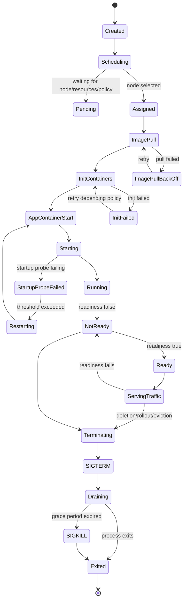

# Pod Lifecycle

## 1. Core Mental Model

Pod adalah **unit runtime terkecil** yang dijadwalkan Kubernetes.

Untuk backend engineer, pod harus dipahami sebagai **execution envelope** untuk satu atau lebih container yang berbagi beberapa resource runtime:

- network namespace,
- pod IP,
- volume,
- lifecycle policy,
- scheduling decision,
- resource accounting,
- restart behavior,
- identity melalui ServiceAccount,
- observability surface seperti logs, events, status, dan metrics.

Container menjalankan process. Pod memberi konteks Kubernetes untuk process tersebut.

Dalam Java/JAX-RS service, pod biasanya berisi satu container utama:

```text
Pod
└── Container: quote-service
    └── JVM process
        └── HTTP server / JAX-RS runtime
```

Namun di production, pod dapat memiliki komponen tambahan:

```text
Pod
├── init container     -> persiapan sebelum aplikasi start
├── app container      -> Java/JAX-RS service
├── sidecar container  -> proxy, log shipper, agent, service mesh, atau helper
└── ephemeral container -> temporary debug container
```

Mental model penting:

> Pod bukan sekadar container. Pod adalah kontrak lifecycle antara Kubernetes dan process aplikasi.

Ketika pod dibuat, Kubernetes tidak langsung berarti aplikasi siap menerima traffic. Pod harus melewati banyak tahap:

1. object dibuat di API server,
2. scheduler memilih node,
3. kubelet di node menerima assignment,
4. image ditarik,
5. init container dijalankan,
6. app container dimulai,
7. startup probe berhasil,
8. readiness probe berhasil,
9. Service mengirim traffic ke pod,
10. pod dihentikan saat rollout, eviction, scaling down, atau deletion,
11. SIGTERM dikirim,
12. readiness dihapus,
13. connection draining terjadi,
14. SIGKILL dikirim jika grace period habis.

Banyak incident terjadi karena engineer hanya memahami tahap nomor 6, padahal production safety ditentukan oleh semua tahap di atas.

---

## 2. Why Pod Lifecycle Exists

Kubernetes harus menjalankan workload pada cluster yang dinamis:

- node bisa penuh,
- image bisa gagal di-pull,
- container bisa crash,
- aplikasi bisa belum siap walaupun process hidup,
- dependency bisa lambat,
- rollout bisa mengganti pod lama dengan pod baru,
- node bisa mati,
- autoscaler bisa menambah atau mengurangi replica,
- security policy bisa menolak pod,
- resource limit bisa membunuh process,
- network policy bisa memutus akses.

Karena itu Kubernetes membutuhkan lifecycle yang eksplisit.

Tanpa lifecycle yang jelas, platform tidak bisa menjawab:

- apakah pod boleh dijadwalkan?
- apakah image tersedia?
- apakah container sudah start?
- apakah aplikasi siap menerima traffic?
- apakah aplikasi masih sehat?
- apakah aplikasi harus direstart?
- apakah pod boleh dihapus sekarang?
- apakah shutdown sudah aman?
- apakah rollout boleh lanjut?

Untuk Java/JAX-RS service, lifecycle pod menentukan apakah endpoint REST benar-benar aman untuk menerima request. JVM yang sudah hidup belum tentu siap. Server socket yang sudah listen belum tentu dependency pool siap. Readiness yang salah bisa membuat traffic masuk ke service yang belum stabil.

---

## 3. Pod Is Not a Process

Pod bukan process Linux. Pod adalah object Kubernetes.

Process sebenarnya berjalan di dalam container runtime di node.

```text
Kubernetes API object: Pod
        |
        v
kubelet on selected node
        |
        v
container runtime
        |
        v
Linux process: java -jar app.jar
```

Implikasinya:

- `kubectl get pod` menunjukkan object state, bukan hanya process state.
- `kubectl describe pod` menunjukkan scheduling, image pull, container, probe, event, dan condition.
- Container bisa restart berkali-kali tanpa object pod berubah.
- Pod bisa `Running` tetapi container di dalamnya belum `Ready`.
- Pod bisa punya IP tetapi belum menjadi endpoint Service.
- Pod bisa terminating tetapi process Java masih berjalan selama grace period.

Jangan menyamakan:

```text
Pod Running == application ready
```

Yang lebih benar:

```text
Pod Ready == application eligible to receive Service traffic
```

Bahkan ini masih bergantung pada readiness probe yang benar.

---

## 4. Pod Lifecycle as State Machine

Secara praktis, lifecycle pod dapat dimodelkan seperti state machine berikut:



Model ini tidak perlu dihafal sebagai diagram formal. Gunakan sebagai cara berpikir saat debugging:

- pod gagal sebelum scheduling?
- gagal saat image pull?
- gagal di init container?
- gagal saat process start?
- gagal karena probe?
- gagal saat menerima traffic?
- gagal saat termination?

Setiap fase punya root cause yang berbeda.

---

## 5. Pod Creation Lifecycle

Saat manifest pod dibuat, alurnya kira-kira seperti ini:

```text
manifest applied
  -> API server validates object
  -> admission controller may mutate or reject
  -> pod object stored
  -> scheduler watches unscheduled pod
  -> scheduler selects node
  -> kubelet on node watches assigned pod
  -> kubelet asks runtime to prepare sandbox
  -> runtime pulls images
  -> init containers run
  -> app containers start
  -> probes begin
  -> pod becomes Ready
```

Untuk Deployment, kamu biasanya tidak membuat pod langsung. Deployment membuat ReplicaSet. ReplicaSet membuat pod.

```text
Deployment
  -> ReplicaSet
      -> Pod
          -> Container
              -> JVM process
```

Saat debugging, jangan berhenti di pod. Periksa ownership chain.

```bash
kubectl get pod quote-service-abc123 -n quote-order -o yaml
```

Cari:

```yaml
metadata:
  ownerReferences:
    - kind: ReplicaSet
```

Lalu lihat ReplicaSet dan Deployment yang memilikinya.

---

## 6. Scheduling Phase

Scheduling adalah fase saat Kubernetes memilih node untuk pod.

Scheduler mempertimbangkan banyak hal:

- resource request CPU/memory,
- node availability,
- node selector,
- node affinity,
- pod affinity,
- pod anti-affinity,
- topology spread constraints,
- taint dan toleration,
- volume binding,
- topology zone,
- priority dan preemption,
- quota dan admission policy.

Jika pod tidak bisa dijadwalkan, status biasanya `Pending`.

Contoh symptom:

```text
0/8 nodes are available: insufficient memory
0/8 nodes are available: node(s) had taint that the pod didn't tolerate
0/8 nodes are available: volume node affinity conflict
```

Untuk Java service, scheduling failure sering muncul karena:

- memory request terlalu besar,
- node pool penuh,
- anti-affinity terlalu ketat,
- namespace quota habis,
- toleration tidak sesuai,
- PVC belum bound,
- node selector menunjuk label yang tidak ada.

### Debugging scheduling

Gunakan:

```bash
kubectl describe pod <pod> -n <namespace>
```

Fokus ke bagian:

```text
Events:
  Warning  FailedScheduling ...
```

Jangan langsung mengubah request/limit tanpa memahami constraint. Pod Pending bukan selalu berarti cluster rusak. Bisa jadi manifest meminta sesuatu yang tidak tersedia.

---

## 7. Image Pull Phase

Setelah node dipilih, kubelet meminta container runtime menarik image.

Image pull bisa gagal karena:

- image tag salah,
- digest tidak ada,
- registry tidak bisa diakses,
- registry authentication gagal,
- image pull secret salah,
- registry rate limit,
- network egress diblokir,
- private endpoint registry bermasalah,
- TLS certificate registry tidak trusted,
- node tidak punya permission ke ECR/ACR/private registry.

Status umum:

```text
ErrImagePull
ImagePullBackOff
```

Perbedaannya:

- `ErrImagePull`: pull gagal pada percobaan saat itu.
- `ImagePullBackOff`: Kubernetes melakukan retry dengan backoff.

Untuk enterprise environment, image pull failure sering terkait governance:

- image belum dipromosikan ke registry environment tersebut,
- image sudah dihapus oleh retention policy,
- tag mutable berubah,
- secret registry expired,
- node IAM/managed identity tidak punya pull permission,
- private registry route/DNS bermasalah.

### Debugging image pull

Cek event:

```bash
kubectl describe pod <pod> -n <namespace>
```

Cek image persis:

```bash
kubectl get pod <pod> -n <namespace> -o jsonpath='{.spec.containers[*].image}'
```

Cek secret:

```bash
kubectl get pod <pod> -n <namespace> -o jsonpath='{.spec.imagePullSecrets}'
```

Internal question:

> Apakah image tag/digest yang diminta benar-benar tersedia di registry environment ini?

---

## 8. Init Container Phase

Init container berjalan sebelum app container.

Karakteristik init container:

- berjalan berurutan,
- harus selesai sukses sebelum container utama start,
- bisa punya image berbeda,
- bisa punya resource request/limit sendiri,
- bisa mengakses volume yang sama,
- cocok untuk bootstrap atau precondition ringan.

Contoh penggunaan:

- menunggu dependency internal siap,
- melakukan database migration kecil,
- generate config runtime,
- fetch certificate,
- prepare volume,
- validate config.

Namun init container sering disalahgunakan.

Anti-pattern:

- init container melakukan migration besar tanpa observability,
- init container polling dependency tanpa timeout jelas,
- init container mengandung business logic,
- init container butuh credential terlalu luas,
- init container mengunduh binary saat runtime,
- init container mengubah state eksternal tanpa idempotency.

Untuk Java/JAX-RS service, init container harus dipakai hati-hati. Jika init container gagal, aplikasi tidak pernah start. Ini bisa menyebabkan rollout stuck.

### Debugging init container

Cek status:

```bash
kubectl get pod <pod> -n <namespace>
```

Output mungkin seperti:

```text
Init:0/1
Init:CrashLoopBackOff
```

Cek log init container:

```bash
kubectl logs <pod> -c <init-container-name> -n <namespace>
```

Cek event:

```bash
kubectl describe pod <pod> -n <namespace>
```

---

## 9. App Container Start Phase

Setelah init container selesai, container utama dimulai.

Untuk Java service, ini berarti process seperti berikut dijalankan:

```text
java $JAVA_OPTS -jar app.jar
```

Container bisa gagal start karena:

- command/entrypoint salah,
- jar tidak ditemukan,
- permission file salah,
- working directory salah,
- env var wajib tidak ada,
- secret/config missing,
- JVM option invalid,
- port binding gagal,
- user non-root tidak punya permission write,
- filesystem read-only tetapi aplikasi butuh write ke path tertentu,
- classpath/dependency error,
- native library tidak cocok dengan base image,
- TLS truststore missing,
- database migration gagal saat startup,
- dependency external dipanggil secara blocking saat startup.

Status umum:

```text
CrashLoopBackOff
```

Ini berarti container process keluar berulang kali dan kubelet melakukan restart dengan backoff.

### Debugging container start

Cek current logs:

```bash
kubectl logs <pod> -c <container> -n <namespace>
```

Cek previous logs jika container restart:

```bash
kubectl logs <pod> -c <container> -n <namespace> --previous
```

Cek restart count:

```bash
kubectl get pod <pod> -n <namespace>
```

Cek detail termination reason:

```bash
kubectl describe pod <pod> -n <namespace>
```

Untuk Java, log startup adalah evidence utama. Pastikan log startup tidak terlalu noisy dan jelas menunjukkan:

- active profile/environment,
- config source,
- port yang dipakai,
- DB/Kafka/RabbitMQ/Redis endpoint target,
- build version,
- commit SHA,
- startup duration,
- fatal error.

---

## 10. Startup Probe

Startup probe digunakan untuk aplikasi yang butuh waktu lama untuk start.

Selama startup probe belum sukses, Kubernetes tidak mengevaluasi liveness probe. Ini mencegah aplikasi lambat start dibunuh terlalu dini.

Use case Java:

- cold start lambat karena class loading,
- JIT warmup,
- framework initialization,
- large dependency graph,
- TLS truststore loading,
- connection pool initialization,
- migration validation,
- cache preload terbatas.

Contoh konsep:

```yaml
startupProbe:
  httpGet:
    path: /health/startup
    port: management
  periodSeconds: 5
  failureThreshold: 24
```

Ini memberi aplikasi sampai sekitar 120 detik sebelum dianggap gagal start.

### Anti-pattern

Jangan memakai startup probe untuk menyembunyikan startup yang tidak deterministik. Jika startup kadang 20 detik dan kadang 8 menit, masalahnya mungkin:

- dependency external lambat,
- migration terlalu berat,
- cache preload berlebihan,
- DNS timeout,
- thread pool blocked,
- cloud SDK credential resolution lambat,
- entropy atau TLS issue.

Startup probe adalah guardrail, bukan obat untuk startup architecture yang buruk.

---

## 11. Readiness Probe

Readiness probe menjawab pertanyaan:

> Apakah pod ini boleh menerima traffic sekarang?

Jika readiness gagal:

- pod tetap bisa Running,
- container tidak selalu direstart,
- pod dihapus dari endpoint Service,
- traffic baru tidak seharusnya dikirim ke pod tersebut.

Untuk Java/JAX-RS API, readiness harus merepresentasikan kemampuan menerima request.

Readiness biasanya boleh memeriksa:

- HTTP server sudah bind,
- dependency internal minimum sudah siap,
- config valid,
- thread pool tidak saturated secara ekstrem,
- aplikasi tidak sedang shutdown,
- migration critical sudah selesai.

Namun readiness tidak boleh terlalu agresif.

Anti-pattern readiness:

- memeriksa semua dependency downstream secara synchronous setiap beberapa detik,
- gagal readiness hanya karena dependency non-critical lambat,
- melakukan query database berat,
- memanggil Kafka/RabbitMQ/Redis/cloud service pada setiap probe,
- readiness endpoint memakai thread pool yang sama dan mudah starvation,
- readiness berubah flapping sehingga pod keluar-masuk endpoint.

### Readiness and rolling update

Readiness menentukan rollout safety.

Deployment hanya menganggap pod baru available jika pod ready sesuai aturan availability. Jika readiness salah positif, traffic masuk terlalu cepat. Jika readiness salah negatif, rollout stuck.

---

## 12. Liveness Probe

Liveness probe menjawab pertanyaan:

> Apakah container ini harus direstart karena tidak bisa pulih sendiri?

Jika liveness gagal melewati threshold, kubelet akan membunuh dan merestart container.

Liveness harus sangat konservatif.

Contoh kondisi yang layak menyebabkan restart:

- process deadlock total,
- event loop stuck total,
- HTTP server tidak bisa menerima request internal health sama sekali,
- fatal runtime state yang tidak bisa recover.

Anti-pattern liveness paling berbahaya:

```text
liveness checks database
```

Jika database lambat, semua pod bisa gagal liveness dan restart bersamaan. Ini mengubah masalah dependency menjadi outage aplikasi.

Untuk Java, liveness jangan memeriksa dependency external. Liveness harus memeriksa kesehatan process aplikasi itu sendiri.

---

## 13. Probe Endpoint Design for Java/JAX-RS

Untuk service Java/JAX-RS, biasanya lebih sehat memisahkan endpoint:

```text
/health/live
/health/ready
/health/startup
```

Atau menggunakan management endpoint yang tidak sama dengan API business.

Pertimbangan desain:

- endpoint probe harus murah,
- tidak butuh auth rumit dari kubelet,
- tidak menghasilkan log noise berlebihan,
- tidak mengekspos detail secret,
- tidak bergantung pada request path business,
- tidak melakukan operasi mutasi,
- punya timeout internal,
- tidak menunggu dependency external terlalu lama.

Jika memakai port management terpisah:

```yaml
ports:
  - name: http
    containerPort: 8080
  - name: management
    containerPort: 8081
```

Keuntungannya:

- probe tidak mengganggu traffic business,
- endpoint health bisa dibatasi,
- monitoring management lebih jelas.

Risikonya:

- port tambahan harus konsisten di Deployment, Service, NetworkPolicy, dan dashboard,
- jika management server hidup tetapi business server mati, readiness bisa salah positif jika desain endpoint buruk.

---

## 14. Sidecar Container

Sidecar adalah container tambahan yang berjalan bersama app container dalam pod yang sama.

Contoh sidecar:

- service mesh proxy,
- log forwarder,
- metrics exporter,
- certificate refresher,
- config reloader,
- local cache/proxy,
- security agent.

Karena sidecar berbagi lifecycle pod, sidecar dapat memengaruhi aplikasi.

Failure mode sidecar:

- sidecar belum ready sehingga traffic tertahan,
- sidecar restart menyebabkan koneksi aplikasi terganggu,
- sidecar menggunakan CPU/memory signifikan,
- sidecar memblokir egress karena policy/proxy,
- sidecar mengubah header atau TLS behavior,
- sidecar membuat shutdown lebih lama,
- sidecar log/metrics flooding.

Untuk Java/JAX-RS service, sidecar terutama relevan jika ada service mesh atau agent observability. Kamu harus memahami bahwa latency dan error bisa berasal dari sidecar, bukan hanya aplikasi.

Internal verification questions:

- Apakah pod memakai service mesh sidecar?
- Apakah traffic inbound/outbound melewati proxy?
- Apakah readiness app bergantung pada readiness proxy?
- Apakah resource request/limit sidecar dihitung?
- Apakah shutdown order sidecar memengaruhi draining?

---

## 15. Ephemeral Container

Ephemeral container digunakan untuk debugging pod yang sedang berjalan.

Gunanya:

- masuk ke namespace pod tanpa mengubah image utama,
- debugging image distroless yang tidak punya shell,
- menjalankan tools network seperti `curl`, `dig`, `ss`, atau `tcpdump` jika diizinkan,
- investigasi process/runtime secara terbatas.

Ephemeral container bukan mekanisme fix production. Ini alat observasi.

Risiko:

- bisa melanggar security policy,
- bisa membuka akses debug terlalu luas,
- bisa memengaruhi resource node/pod,
- command debug bisa tidak production-safe,
- audit harus jelas.

Untuk enterprise environment, penggunaan ephemeral container biasanya harus diatur melalui RBAC dan policy.

Internal verification:

- apakah developer boleh memakai ephemeral container di production?
- namespace mana yang mengizinkan?
- image debug apa yang disetujui?
- apakah aktivitas debug diaudit?
- apakah ada runbook production-safe?

---

## 16. Pod Conditions

Pod memiliki conditions yang membantu membaca state.

Contoh condition:

- `PodScheduled`,
- `Initialized`,
- `ContainersReady`,
- `Ready`,
- condition tambahan tergantung versi/fitur cluster.

Gunakan condition untuk memahami di mana lifecycle berhenti.

Contoh:

```bash
kubectl get pod <pod> -n <namespace> -o jsonpath='{.status.conditions}'
```

Interpretasi praktis:

- `PodScheduled=False`: masalah scheduling.
- `Initialized=False`: init container belum sukses.
- `ContainersReady=False`: container belum ready atau restart.
- `Ready=False`: pod tidak eligible menerima Service traffic.

Jangan hanya melihat `STATUS` ringkas dari `kubectl get pod`. Itu bagus untuk triage awal, tetapi tidak cukup untuk root cause.

---

## 17. Pod Phases

Pod phase adalah ringkasan kasar lifecycle.

Phase umum:

- `Pending`,
- `Running`,
- `Succeeded`,
- `Failed`,
- `Unknown`.

Phase bukan diagnosis lengkap.

Contoh:

```text
Running
```

Bisa berarti:

- container berjalan dan ready,
- container berjalan tapi readiness gagal,
- satu container ready, sidecar tidak ready,
- container restart count tinggi tetapi saat ini running.

Untuk debugging, gunakan kombinasi:

- phase,
- conditions,
- containerStatuses,
- events,
- logs,
- metrics,
- owner object.

---

## 18. Restart Policy

Restart policy menentukan bagaimana kubelet menangani container yang exit.

Nilai umum:

- `Always`,
- `OnFailure`,
- `Never`.

Untuk Deployment, restart policy biasanya `Always`.

Untuk Job, biasanya `OnFailure` atau `Never` tergantung desain job.

Java service dalam Deployment yang crash akan direstart oleh kubelet. Namun restart bukan solusi untuk semua error.

Jika service terus CrashLoopBackOff, jangan hanya menaikkan delay atau menambah replica. Cari root cause:

- config salah,
- dependency wajib tidak tersedia,
- permission salah,
- JVM OOM,
- startup probe/liveness salah,
- entrypoint salah,
- migration gagal,
- native library mismatch.

---

## 19. Termination Lifecycle

Termination adalah bagian paling sering diremehkan.

Saat pod dihapus karena rollout, scale down, eviction, atau node drain, Kubernetes melakukan alur kira-kira seperti ini:

```text
pod marked terminating
  -> pod should be removed from Service endpoints
  -> PreStop hook may run
  -> SIGTERM sent to container process
  -> application should stop accepting new work
  -> in-flight work should finish or timeout safely
  -> process exits
  -> if grace period expires, SIGKILL sent
```

Untuk Java/JAX-RS service, aplikasi harus menangani SIGTERM.

Jika tidak:

- request aktif bisa putus,
- Kafka/RabbitMQ message bisa diproses setengah,
- DB transaction bisa rollback tidak terduga,
- lock bisa tertahan,
- idempotency bug bisa muncul,
- client menerima 502/503/connection reset,
- rollout terlihat sukses tetapi ada data inconsistency.

---

## 20. SIGTERM and SIGKILL

Kubernetes mengirim SIGTERM sebagai sinyal sopan agar process berhenti.

Jika process belum exit sampai `terminationGracePeriodSeconds` habis, Kubernetes mengirim SIGKILL.

SIGKILL tidak bisa ditangani aplikasi.

Untuk Java:

- SIGTERM harus memicu graceful shutdown,
- HTTP server berhenti menerima request baru,
- in-flight request diberi waktu selesai,
- consumer berhenti mengambil message baru,
- producer/consumer flush/close,
- connection pool ditutup,
- telemetry exporter flush,
- process exit dengan status jelas.

Cek apakah entrypoint shell meneruskan sinyal.

Anti-pattern Dockerfile:

```dockerfile
ENTRYPOINT sh -c "java -jar app.jar"
```

Jika tidak hati-hati, shell bisa menjadi PID 1 dan sinyal tidak diteruskan dengan benar. Prefer exec form:

```dockerfile
ENTRYPOINT ["java", "-jar", "app.jar"]
```

Atau gunakan entrypoint script yang melakukan `exec java ...`.

---

## 21. PreStop Hook

PreStop hook dijalankan sebelum container dihentikan.

Use case:

- memberi waktu external load balancer berhenti mengirim traffic,
- trigger readiness false sebelum shutdown,
- memberi delay kecil untuk endpoint propagation,
- melakukan cleanup ringan.

Namun PreStop bukan tempat untuk business cleanup berat.

Anti-pattern:

- PreStop menjalankan logic lama tanpa timeout,
- PreStop melakukan call external yang tidak reliable,
- PreStop dipakai untuk menyelesaikan transaksi penting,
- PreStop delay terlalu lama sehingga rollout lambat,
- PreStop hanya `sleep` besar tanpa memahami load balancer behavior.

PreStop harus didesain bersama:

- readiness behavior,
- terminationGracePeriodSeconds,
- ingress/load balancer draining,
- HTTP server shutdown,
- consumer shutdown.

---

## 22. Readiness Removal During Termination

Saat pod terminating, pod seharusnya tidak menerima traffic baru.

Namun ada propagation delay:

```text
pod deletion
  -> endpoint updated
  -> kube-proxy/ingress observes update
  -> load balancer/ingress stops routing
  -> existing connections drain
```

Selama window ini, request masih bisa masuk ke pod yang sedang shutdown.

Karena itu aplikasi harus:

- berhenti menerima work baru setelah shutdown dimulai,
- membiarkan request aktif selesai,
- memberi response yang jelas jika tidak bisa menerima request,
- tidak langsung exit saat SIGTERM.

Untuk JAX-RS service, graceful shutdown harus dikonfigurasi di HTTP server/framework yang digunakan. Jangan asumsikan semua runtime Java otomatis drain dengan benar.

---

## 23. Pod Lifecycle and Service Routing

Service tidak mengirim traffic ke semua pod yang Running. Service mengirim traffic ke endpoint yang match selector dan ready.

Alur sederhana:

```text
Deployment creates Pods
  -> Pod labels match Service selector
  -> EndpointSlice includes ready pod IP
  -> Service routes to pod IP:targetPort
```

Jika pod tidak ready, pod tidak masuk endpoint ready.

Failure yang sering:

- label pod tidak match selector Service,
- readiness gagal,
- targetPort salah,
- named port tidak sesuai,
- pod ready tapi aplikasi listen di port berbeda,
- sidecar/proxy memengaruhi traffic,
- NetworkPolicy memblokir.

Saat Service unreachable, jangan hanya melihat Service. Lihat Pod readiness dan EndpointSlice.

```bash
kubectl get endpointslice -n <namespace>
kubectl describe service <service> -n <namespace>
kubectl get pod -l app=quote-service -n <namespace>
```

---

## 24. Pod Lifecycle and Java/JAX-RS Backend

Lifecycle pod berdampak langsung pada aplikasi Java/JAX-RS.

### Startup

Concern:

- JVM cold start,
- dependency initialization,
- connection pool,
- config validation,
- TLS truststore,
- schema migration,
- classpath error,
- port binding,
- native memory.

Probe consequence:

- startup probe terlalu pendek menyebabkan restart loop,
- readiness terlalu cepat menyebabkan traffic masuk sebelum siap,
- liveness terlalu agresif menyebabkan restart storm.

### Runtime

Concern:

- thread pool saturation,
- CPU throttling,
- memory pressure,
- GC pause,
- downstream latency,
- logging overhead,
- file descriptor usage.

Probe consequence:

- readiness bisa flapping saat thread pool penuh,
- liveness bisa gagal jika endpoint health memakai pool yang sama dan blocked.

### Shutdown

Concern:

- SIGTERM handling,
- in-flight REST request,
- async task,
- message consumer,
- DB transaction,
- telemetry flush.

Probe consequence:

- readiness harus false saat shutdown,
- process tidak boleh exit sebelum drain selesai,
- termination grace harus cukup.

---

## 25. Pod Lifecycle and PostgreSQL/Kafka/RabbitMQ/Redis/Camunda/NGINX

### PostgreSQL client behavior

Pod startup bisa gagal jika aplikasi melakukan DB connection wajib saat boot dan DB tidak reachable. Ini bisa benar atau salah tergantung requirement.

Trade-off:

- fail fast jika DB wajib untuk correctness,
- start degraded jika service bisa menerima subset request,
- jangan membuat liveness bergantung pada DB.

Saat termination, pastikan DB transaction selesai atau rollback dengan jelas.

### Kafka consumer behavior

Pod readiness untuk consumer berbeda dari REST API.

Consumer mungkin tidak menerima HTTP traffic, tetapi readiness tetap berguna untuk menunjukkan apakah consumer siap memproses partition/message.

Shutdown harus:

- stop polling,
- finish current record/batch,
- commit offset jika aman,
- close consumer,
- avoid duplicate side effect melalui idempotency.

### RabbitMQ consumer behavior

Shutdown harus:

- stop consuming,
- finish message,
- ack/nack dengan benar,
- close channel/connection,
- avoid message loss.

### Redis client behavior

Startup jangan menggantung lama karena Redis unavailable jika Redis hanya cache non-critical. Readiness bisa degraded tergantung apakah Redis critical path.

### Camunda worker behavior

Worker shutdown harus berhenti mengambil job baru dan menyelesaikan/extend/fail job dengan benar sesuai model workflow yang dipakai.

### NGINX/Ingress behavior

Ingress/load balancer punya draining sendiri. Pod termination harus sinkron dengan:

- readiness removal,
- ingress endpoint update,
- connection keep-alive,
- upstream timeout,
- retry behavior.

---

## 26. Pod Lifecycle in EKS, AKS, On-Prem, and Hybrid

Pod lifecycle core sama di semua Kubernetes, tetapi failure source bisa berbeda.

### EKS concerns

- image pull dari ECR butuh node/identity permission,
- VPC CNI memberi pod IP dari VPC sehingga IP exhaustion bisa membuat pod Pending atau networking gagal,
- ALB/NLB target registration/deregistration memengaruhi traffic saat readiness/termination,
- Security Group/NACL/route table dapat memengaruhi pod egress,
- CloudWatch/agent sidecar dapat menambah resource overhead.

### AKS concerns

- image pull dari ACR butuh identity/integration benar,
- Azure CNI/subnet capacity memengaruhi pod scheduling/networking,
- Application Gateway/AGIC atau Azure Load Balancer punya propagation/draining behavior,
- NSG/UDR/private endpoint/DNS dapat memengaruhi egress,
- Azure Monitor/agent overhead perlu dihitung.

### On-prem concerns

- registry internal bisa unavailable,
- load balancer integration mungkin custom,
- DNS/certificate chain sering spesifik enterprise,
- storage/CSI bergantung infrastruktur lokal,
- node patching dan runtime upgrade lebih banyak tanggung jawab internal.

### Hybrid concerns

- startup/readiness bisa terpengaruh dependency on-prem/cloud,
- DNS split-horizon bisa membuat pod resolve endpoint berbeda,
- firewall/proxy dapat membuat cloud SDK lambat,
- TLS trust enterprise CA harus tersedia di image/runtime,
- latency antar site bisa membuat probe timeout jika desain buruk.

---

## 27. Failure Modes

### 27.1 Pod Pending

Kemungkinan root cause:

- resource request terlalu besar,
- node pool penuh,
- quota habis,
- taint tidak ditoleransi,
- node selector salah,
- affinity terlalu ketat,
- PVC belum bound,
- admission policy menolak.

Detection:

```bash
kubectl describe pod <pod> -n <namespace>
```

Fokus ke `FailedScheduling`.

### 27.2 ImagePullBackOff

Kemungkinan root cause:

- image tag salah,
- registry auth gagal,
- image pull secret salah,
- registry unreachable,
- ECR/ACR permission kurang,
- DNS/TLS/network issue.

Detection:

```bash
kubectl describe pod <pod> -n <namespace>
```

Fokus ke event image pull.

### 27.3 Init CrashLoop

Kemungkinan root cause:

- init script gagal,
- dependency belum siap,
- secret/config missing,
- permission volume salah,
- migration tidak idempotent.

Detection:

```bash
kubectl logs <pod> -c <init-container> -n <namespace>
```

### 27.4 CrashLoopBackOff

Kemungkinan root cause:

- process exit,
- config fatal,
- JVM option invalid,
- OOM,
- permission error,
- missing jar,
- startup liveness failure,
- dependency blocking.

Detection:

```bash
kubectl logs <pod> -n <namespace> --previous
kubectl describe pod <pod> -n <namespace>
```

### 27.5 Not Ready

Kemungkinan root cause:

- readiness endpoint gagal,
- app belum bind port,
- dependency readiness salah desain,
- thread pool saturated,
- management port salah,
- NetworkPolicy memblokir probe path,
- sidecar belum ready.

Detection:

```bash
kubectl describe pod <pod> -n <namespace>
kubectl get endpointslice -n <namespace>
```

### 27.6 Termination Stuck

Kemungkinan root cause:

- PreStop hook lama,
- app tidak exit setelah SIGTERM,
- in-flight work terlalu lama,
- finalizer di object terkait,
- node issue,
- storage detach issue.

Detection:

```bash
kubectl get pod <pod> -n <namespace>
kubectl describe pod <pod> -n <namespace>
```

---

## 28. Debugging Decision Tree

Gunakan urutan berikut.

```text
1. Is the pod created?
   No  -> check Deployment/ReplicaSet/admission/quota
   Yes -> continue

2. Is the pod scheduled?
   No  -> check FailedScheduling events
   Yes -> continue

3. Are images pulled?
   No  -> check image/registry/secret/identity/network
   Yes -> continue

4. Did init containers finish?
   No  -> check init logs and idempotency
   Yes -> continue

5. Did app container start?
   No  -> check logs, entrypoint, config, JVM, permissions
   Yes -> continue

6. Is startup probe passing?
   No  -> check startup duration, endpoint, timeout, dependency
   Yes -> continue

7. Is readiness passing?
   No  -> check readiness logic, app port, dependency, endpoint
   Yes -> continue

8. Is Service routing to it?
   No  -> check selector, EndpointSlice, targetPort, NetworkPolicy
   Yes -> continue

9. Is runtime stable?
   No  -> check restarts, OOM, throttling, GC, downstream latency
   Yes -> pod lifecycle is likely healthy
```

---

## 29. Correctness Concerns

Pod lifecycle correctness berarti aplikasi tidak hanya hidup, tetapi berada dalam state yang aman.

Concern utama:

- readiness true sebelum service benar-benar siap,
- liveness restart saat dependency down,
- shutdown memutus request aktif,
- consumer mati sebelum ack/commit aman,
- init migration tidak idempotent,
- pod restart menyebabkan duplicate side effect,
- rollout mengganti semua replica sebelum readiness stabil,
- startup dependency check terlalu keras sehingga cascade failure,
- PreStop cleanup melakukan mutasi tidak aman.

Correctness principle:

> Pod lifecycle harus menjaga boundary antara not-started, started, ready, serving, draining, dan stopped.

Jangan membuat aplikasi berada di state abu-abu yang terlihat ready tetapi tidak benar-benar aman.

---

## 30. Networking Concerns

Pod lifecycle memengaruhi networking karena endpoint Service bergantung pada readiness.

Concern:

- pod punya IP tetapi belum ready,
- Service selector salah,
- EndpointSlice tidak berisi pod,
- ingress masih mengirim traffic selama propagation delay,
- DNS resolve benar tetapi target endpoint kosong,
- NetworkPolicy memblokir probe atau dependency,
- source IP/header berubah karena proxy/sidecar,
- connection draining tidak sinkron dengan termination.

Saat debugging networking, selalu tanya:

```text
Apakah pod ready dan terdaftar sebagai endpoint?
```

Jika tidak, masalahnya bukan DNS atau ingress. Masalahnya lifecycle/readiness/selector.

---

## 31. Performance Concerns

Lifecycle pod juga punya dampak performance.

Startup performance:

- image besar memperlambat pull,
- JVM cold start lambat,
- dependency initialization blocking,
- classpath besar,
- slow DNS/cloud credential resolution.

Runtime performance:

- liveness/readiness terlalu sering memberi overhead,
- probe endpoint melakukan query berat,
- sidecar menambah latency,
- resource request terlalu kecil menyebabkan throttling,
- startup surge saat rollout membebani dependency.

Shutdown performance:

- termination terlalu lama memperlambat rollout,
- grace period terlalu pendek menyebabkan SIGKILL,
- connection drain terlalu lama mengurangi deployment velocity.

Performance review harus melihat lifecycle penuh, bukan hanya latency endpoint business.

---

## 32. Security and Privacy Concerns

Pod lifecycle menyentuh security di banyak titik:

- image pull secret,
- ServiceAccount token,
- init container credential,
- sidecar privilege,
- debug ephemeral container,
- logs saat startup,
- env var secret leakage,
- filesystem write permission,
- non-root runtime,
- admission policy,
- pod security context.

Risiko besar:

- init container punya permission lebih luas dari app,
- ephemeral debug container membuka shell di production tanpa audit,
- startup log mencetak secret,
- pod memakai default ServiceAccount dengan token otomatis,
- sidecar intercept traffic sensitif tanpa governance jelas.

Principle:

> Setiap container dalam pod adalah bagian dari trust boundary yang sama.

Jangan hanya mengamankan app container. Init, sidecar, dan debug path juga harus direview.

---

## 33. Cost Concerns

Pod lifecycle memengaruhi cost secara tidak langsung:

- image besar meningkatkan pull time dan registry bandwidth,
- startup lambat membuat rollout lebih lama,
- over-request membuat node underutilized,
- CrashLoopBackOff membuang CPU/logging/alerting,
- readiness flapping meningkatkan retry dan load balancer churn,
- sidecar menambah CPU/memory per pod,
- termination grace terlalu lama menahan capacity,
- debug container dan excessive logging bisa menaikkan observability cost.

Untuk service dengan banyak replica, overhead kecil per pod bisa menjadi biaya besar.

Review resource pod harus menghitung total envelope:

```text
app container + sidecars + init behavior + observability agent overhead
```

---

## 34. Observability Concerns

Pod lifecycle harus terlihat dari observability.

Signal minimal:

- pod phase,
- pod conditions,
- container restart count,
- last termination reason,
- OOMKilled count,
- readiness/liveness failure,
- image pull failure,
- scheduling failure,
- rollout progress,
- endpoint count,
- startup duration,
- shutdown duration,
- graceful shutdown success/failure,
- Java process uptime,
- GC/memory/CPU metrics,
- HTTP request during termination.

Logs yang baik harus menjawab:

- aplikasi mulai dengan version/commit apa,
- config profile apa,
- port apa,
- dependency target apa,
- kapan ready,
- kapan menerima SIGTERM,
- kapan berhenti menerima traffic,
- kapan in-flight work selesai,
- kapan process exit.

---

## 35. Example Pod-Oriented Deployment Fragment

Contoh fragment berikut bukan template final, tetapi menunjukkan lifecycle concern yang harus muncul:

```yaml
apiVersion: apps/v1
kind: Deployment
metadata:
  name: quote-service
spec:
  replicas: 3
  selector:
    matchLabels:
      app: quote-service
  template:
    metadata:
      labels:
        app: quote-service
    spec:
      terminationGracePeriodSeconds: 60
      containers:
        - name: quote-service
          image: registry.example.com/quote-service:1.42.0
          ports:
            - name: http
              containerPort: 8080
            - name: management
              containerPort: 8081
          startupProbe:
            httpGet:
              path: /health/startup
              port: management
            periodSeconds: 5
            failureThreshold: 24
          readinessProbe:
            httpGet:
              path: /health/ready
              port: management
            periodSeconds: 5
            timeoutSeconds: 2
            failureThreshold: 3
          livenessProbe:
            httpGet:
              path: /health/live
              port: management
            periodSeconds: 10
            timeoutSeconds: 2
            failureThreshold: 3
          lifecycle:
            preStop:
              exec:
                command: ["/bin/sh", "-c", "sleep 10"]
```

Review notes:

- `sleep 10` hanya masuk akal jika sesuai load balancer/ingress propagation.
- Probe endpoint harus murah.
- Liveness tidak boleh bergantung pada database.
- Startup failure threshold harus sesuai startup worst-case yang tervalidasi.
- Grace period harus sesuai request duration dan consumer shutdown behavior.

---

## 36. Pod Lifecycle Review Checklist

Gunakan checklist ini saat review PR manifest/Helm/Kustomize.

### Scheduling

- Apakah resource request realistis?
- Apakah node selector/affinity/toleration diperlukan?
- Apakah constraint terlalu ketat?
- Apakah namespace quota cukup?
- Apakah PVC binding dapat menghambat scheduling?

### Image pull

- Apakah image tag/digest benar?
- Apakah registry environment benar?
- Apakah imagePullSecret/identity tersedia?
- Apakah image sudah dipromosikan?
- Apakah pull policy sesuai?

### Init container

- Apakah init container benar-benar perlu?
- Apakah logic init idempotent?
- Apakah punya timeout?
- Apakah credential minimal?
- Apakah log init cukup jelas?

### App container

- Apakah entrypoint benar?
- Apakah process Java menerima SIGTERM?
- Apakah working directory dan permission benar?
- Apakah non-root runtime tidak mematahkan write path?
- Apakah env/config/secret tersedia?

### Probes

- Apakah startup probe dibutuhkan?
- Apakah readiness merepresentasikan eligible-to-serve?
- Apakah liveness konservatif?
- Apakah probe endpoint murah?
- Apakah timeout dan threshold realistis?
- Apakah probe tidak memanggil dependency berat?

### Shutdown

- Apakah terminationGracePeriodSeconds cukup?
- Apakah readiness menjadi false saat shutdown?
- Apakah HTTP server drain in-flight request?
- Apakah Kafka/RabbitMQ consumer shutdown aman?
- Apakah telemetry flush sebelum exit?

### Observability

- Apakah startup duration termonitor?
- Apakah readiness/liveness failure terlihat?
- Apakah restart count alertable?
- Apakah shutdown event terekam?
- Apakah pod events dikumpulkan?

---

## 37. Internal Verification Checklist

Untuk konteks CSG/team, jangan asumsi. Verifikasi hal berikut:

### Codebase and runtime

- Runtime Java/JAX-RS yang digunakan: Jersey, RESTEasy, Quarkus, Spring-compatible stack, application server, atau runtime lain.
- Cara aplikasi menangani SIGTERM.
- Apakah graceful shutdown sudah dikonfigurasi.
- Apakah ada endpoint health terpisah untuk liveness/readiness/startup.
- Apakah management port terpisah dari business port.
- Apakah startup melakukan DB/Kafka/RabbitMQ/Redis/Camunda/cloud call blocking.
- Apakah consumer shutdown melakukan commit/ack/nack dengan aman.

### Dockerfile and image

- ENTRYPOINT exec form atau shell form.
- Apakah PID 1 meneruskan signal.
- Apakah image distroless/s slim/non-root.
- Apakah path write tersedia untuk non-root user.
- Apakah truststore/timezone/certificate tersedia.

### Kubernetes manifest

- `terminationGracePeriodSeconds`.
- `lifecycle.preStop`.
- startup/readiness/liveness probe.
- container ports dan named ports.
- resource request/limit.
- init container.
- sidecar.
- ServiceAccount.
- imagePullSecrets.
- pod labels.

### Service and traffic

- Service selector match pod labels.
- EndpointSlice behavior saat readiness false.
- Ingress/NGINX/load balancer draining behavior.
- Timeout chain dari ingress ke app.
- X-Forwarded headers dan source IP handling.

### Platform/SRE/DevOps

- Apakah ephemeral containers diizinkan.
- Debug image yang disetujui.
- Production kubectl access policy.
- Pod events retention.
- Alert untuk restart/readiness failure.
- Runbook untuk CrashLoopBackOff, ImagePullBackOff, Pending, dan NotReady.

---

## 38. Senior Engineer Heuristics

Beberapa heuristic praktis:

1. **Running is not Ready.** Jangan menyamakan process hidup dengan aplikasi siap.
2. **Liveness should be boring.** Kalau liveness terlalu pintar, ia akan membuat outage.
3. **Readiness controls traffic.** Salah readiness berarti salah routing.
4. **Startup should be bounded.** Startup boleh lambat, tetapi harus predictable.
5. **Shutdown is part of correctness.** Data loss sering terjadi saat termination, bukan saat steady state.
6. **Events are first-class evidence.** Pod events sering lebih cepat menjelaskan masalah daripada log aplikasi.
7. **Sidecar is part of runtime.** Debug latency/error harus mempertimbangkan sidecar/proxy.
8. **Init must be idempotent.** Init container yang mengubah state eksternal harus aman terhadap retry.
9. **Probe endpoint is production API.** Meski bukan business API, dampaknya langsung ke traffic dan restart.
10. **Lifecycle is a contract.** Manifest dan aplikasi harus sepakat tentang startup, readiness, serving, dan shutdown.

---

## 39. Summary

Pod lifecycle adalah jembatan antara Kubernetes control plane dan process aplikasi.

Untuk Java/JAX-RS service, lifecycle pod menentukan:

- kapan JVM start,
- kapan aplikasi dianggap siap,
- kapan traffic dikirim,
- kapan container direstart,
- kapan pod dikeluarkan dari Service,
- bagaimana shutdown dilakukan,
- apakah rollout aman,
- apakah message processing dan DB transaction tetap correct,
- apakah incident bisa didiagnosis dengan cepat.

Jika kamu menguasai pod lifecycle, kamu bisa membaca banyak failure Kubernetes dengan lebih tenang:

```text
Pending         -> scheduling/resource/policy/storage
ImagePullBackOff -> registry/image/auth/network
Init:*          -> init dependency/script/idempotency
CrashLoopBackOff -> process/config/JVM/probe/permission
Running NotReady -> readiness/app/dependency/port/sidecar
Terminating     -> shutdown/preStop/grace/draining
```

Part berikutnya membahas **Workload Resources**: bagaimana Deployment, ReplicaSet, StatefulSet, DaemonSet, Job, CronJob, dan PodDisruptionBudget membungkus pod lifecycle menjadi operational pattern untuk production systems.
