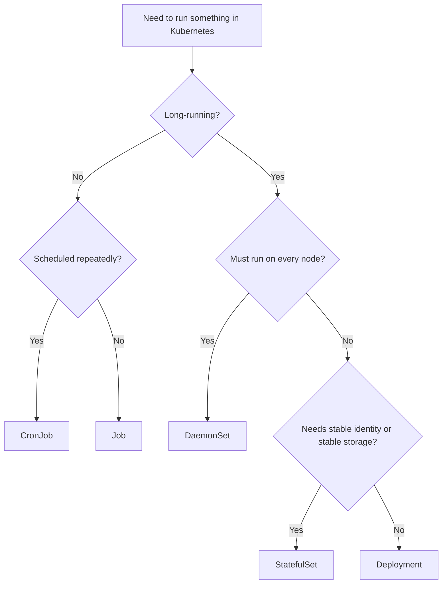

# Workload Resources

## 1. Core Mental Model

Pod adalah unit runtime. Workload resource adalah **controller-backed abstraction** yang membuat pod lifecycle menjadi operasional.

Kamu jarang ingin membuat pod langsung di production. Kamu ingin menyatakan pola workload:

- service stateless dengan beberapa replica,
- stateful service dengan stable identity,
- agent yang berjalan di setiap node,
- job yang selesai lalu berhenti,
- scheduled job yang berjalan periodik,
- workload yang harus tetap tersedia saat node drain atau rollout.

Kubernetes menyediakan workload resource untuk pola-pola tersebut.

```text
Deployment    -> stateless replicated service
ReplicaSet    -> replica manager behind Deployment
StatefulSet   -> stateful replicated workload with stable identity
DaemonSet     -> one pod per selected node
Job           -> finite task until completion
CronJob       -> scheduled Job
PDB           -> voluntary disruption guardrail
```

Mental model penting:

> Workload resource bukan hanya cara membuat pod. Workload resource adalah cara menyatakan lifecycle, identity, update behavior, availability, dan operational contract.

Untuk Java/JAX-RS backend, pemilihan workload menentukan:

- bagaimana service di-rollout,
- bagaimana replica diganti,
- apakah identity pod stabil,
- bagaimana storage dipasang,
- bagaimana message consumer diskalakan,
- bagaimana job migration dijalankan,
- bagaimana disruption dikendalikan,
- bagaimana rollback dilakukan.

---

## 2. Why Workload Resources Exist

Jika hanya ada pod, operasi production akan rapuh.

Masalah yang harus diselesaikan:

- Jika pod mati, siapa membuat pengganti?
- Jika image baru dirilis, siapa mengganti pod lama?
- Jika rollout gagal, bagaimana rollback?
- Jika node drain, berapa replica boleh hilang?
- Jika workload butuh identity stabil, bagaimana pod diberi nama konsisten?
- Jika tugas hanya perlu berjalan sekali, bagaimana completion dilacak?
- Jika tugas periodik, siapa menjadwalkan?
- Jika agent harus ada di semua node, siapa memastikan coverage?

Workload resources menjawab dengan controller yang terus melakukan reconciliation.

Contoh:

```text
Deployment desired replicas: 3
Actual ready replicas: 2
Controller action: create/replace pod until desired state reached
```

Ini bukan script. Ini control loop.

---

## 3. Workload Resource Taxonomy

Tabel praktis:

| Workload | Primary Use | Java/JAX-RS Example | Key Risk |
|---|---|---|---|
| Deployment | Stateless long-running service | REST API quote-service | readiness/shutdown/resource misconfig |
| ReplicaSet | Replica maintenance | created by Deployment | rarely managed directly |
| StatefulSet | Stateful identity/storage | self-managed Redis/RabbitMQ-like component | storage/ordering/upgrade complexity |
| DaemonSet | Node-level agent | log/metrics/security agent | node resource overhead |
| Job | Finite task | DB migration, backfill, cleanup | idempotency/retry side effect |
| CronJob | Scheduled finite task | nightly reconciliation | concurrency/missed schedule |
| PDB | Availability guardrail | keep at least N API pods available | blocking maintenance if unrealistic |

Untuk enterprise backend engineer, kemampuan penting bukan menghafal definisi. Yang penting adalah memilih workload berdasarkan invariants:

- Apakah workload long-running atau finite?
- Stateless atau stateful?
- Butuh stable identity?
- Butuh storage persistent?
- Harus berjalan di setiap node?
- Boleh berjalan paralel?
- Boleh retry?
- Ada side effect eksternal?
- Bagaimana rollback?
- Bagaimana observability dan runbook?

---

## 4. Deployment

Deployment adalah workload resource utama untuk stateless replicated application.

Cocok untuk:

- Java/JAX-RS REST API,
- stateless backend service,
- HTTP worker yang bisa diskalakan horizontal,
- service yang menyimpan state di PostgreSQL/Kafka/RabbitMQ/Redis/external systems,
- service yang bisa diganti pod-nya tanpa stable identity.

Deployment mengelola ReplicaSet.

```text
Deployment
  -> ReplicaSet revision N
      -> Pods
```

Saat image berubah:

```text
Deployment
  -> new ReplicaSet revision N+1
      -> new Pods
  -> old ReplicaSet scaled down gradually
```

Deployment memberi:

- replica management,
- rolling update,
- rollback via revision history,
- rollout status,
- availability tracking,
- declarative update strategy.

### Deployment example concept

```yaml
apiVersion: apps/v1
kind: Deployment
metadata:
  name: quote-service
spec:
  replicas: 3
  strategy:
    type: RollingUpdate
    rollingUpdate:
      maxUnavailable: 0
      maxSurge: 1
  selector:
    matchLabels:
      app: quote-service
  template:
    metadata:
      labels:
        app: quote-service
    spec:
      containers:
        - name: quote-service
          image: registry.example.com/quote-service:1.42.0
```

Key point:

- Deployment selector harus match pod template labels.
- Selector biasanya immutable secara praktis; perubahan selector bisa destruktif.
- Rolling update bergantung pada readiness probe.
- Deployment tidak menjamin zero downtime jika aplikasi tidak graceful.

---

## 5. ReplicaSet

ReplicaSet memastikan sejumlah pod dengan label tertentu tetap berjalan.

Namun dalam production, kamu hampir selalu memakai Deployment, bukan ReplicaSet langsung.

Deployment membuat dan mengelola ReplicaSet untuk setiap revision.

```text
Deployment revision 1 -> ReplicaSet A
Deployment revision 2 -> ReplicaSet B
Deployment revision 3 -> ReplicaSet C
```

ReplicaSet penting saat debugging rollout.

Gunakan:

```bash
kubectl get rs -n <namespace>
kubectl describe rs <replicaset> -n <namespace>
```

ReplicaSet dapat membantu menjawab:

- revision mana yang sedang aktif?
- berapa replica lama/baru?
- apakah pod dibuat tetapi tidak ready?
- apakah selector match?
- apakah rollout stuck karena pod baru gagal?

Anti-pattern:

- mengedit ReplicaSet langsung padahal dimiliki Deployment,
- membuat ReplicaSet manual untuk application service,
- tidak memahami ReplicaSet lama masih ada karena revision history.

---

## 6. RollingUpdate Strategy

RollingUpdate mengganti pod lama dengan pod baru secara bertahap.

Parameter utama:

- `maxUnavailable`: berapa pod boleh unavailable selama update,
- `maxSurge`: berapa pod tambahan boleh dibuat di atas replica desired.

Contoh:

```yaml
strategy:
  type: RollingUpdate
  rollingUpdate:
    maxUnavailable: 0
    maxSurge: 1
```

Interpretasi untuk replica 3:

- tidak boleh mengurangi ready replica di bawah 3,
- boleh membuat 1 pod tambahan sementara,
- update lebih aman tetapi butuh capacity lebih.

Untuk Java/JAX-RS API mission-critical, `maxUnavailable: 0` sering lebih aman, tetapi tidak selalu gratis.

Trade-off:

- butuh node capacity ekstra,
- rollout bisa stuck jika cluster tidak punya resource,
- dependency downstream bisa menerima surge connection saat pod baru start,
- startup storm bisa terjadi jika banyak deployment rollout bersamaan.

### Rolling update depends on readiness

Jika readiness terlalu cepat:

```text
Pod marked ready -> old pod removed -> traffic hits not-actually-ready app
```

Jika readiness terlalu ketat:

```text
New pod never ready -> rollout stuck -> old pods keep serving
```

Rolling update safety adalah kombinasi:

```text
readiness correctness + graceful shutdown + capacity + rollout config
```

---

## 7. Recreate Strategy

Recreate mematikan pod lama sebelum membuat pod baru.

```yaml
strategy:
  type: Recreate
```

Ini menyebabkan downtime untuk service yang menerima traffic.

Cocok hanya untuk kasus tertentu:

- workload tidak bisa berjalan dua versi bersamaan,
- local development/test,
- singleton internal service yang downtime-nya diterima,
- migration state yang tidak kompatibel dengan parallel version.

Untuk Java/JAX-RS API production, Recreate biasanya red flag kecuali ada alasan kuat.

Pertanyaan review:

- Mengapa rolling update tidak bisa dipakai?
- Apakah ada backward compatibility issue?
- Apakah downtime diterima?
- Apakah ada maintenance window?
- Apakah runbook dan rollback jelas?

---

## 8. Revision History, Rollout, and Rollback

Deployment menyimpan revision history melalui ReplicaSet lama.

Field:

```yaml
revisionHistoryLimit: 10
```

Operasi umum:

```bash
kubectl rollout status deployment/quote-service -n quote-order
kubectl rollout history deployment/quote-service -n quote-order
kubectl rollout undo deployment/quote-service -n quote-order
```

Namun rollback tidak selalu menyelesaikan masalah.

Rollback aman jika:

- image lama masih tersedia,
- config lama masih kompatibel,
- database schema backward-compatible,
- message format backward-compatible,
- secret masih valid,
- feature flag dapat dikembalikan,
- external dependency contract tidak berubah.

Rollback berbahaya jika deployment baru sudah melakukan:

- destructive migration,
- irreversible data change,
- event schema breaking change,
- state transition yang tidak bisa dibalik,
- cache invalidation yang tidak kompatibel.

Senior engineer harus selalu menilai rollback sebagai **system-level behavior**, bukan hanya `kubectl rollout undo`.

---

## 9. Deployment Failure Modes

### New pods never ready

Root cause:

- readiness endpoint gagal,
- config salah,
- dependency unavailable,
- resource terlalu kecil,
- wrong port,
- image bug,
- startup probe salah.

Effect:

- rollout stuck,
- old pods tetap melayani jika config rolling update aman,
- pipeline/GitOps health merah.

### Old pods terminated too early

Root cause:

- maxUnavailable terlalu besar,
- readiness false positive,
- graceful shutdown tidak berjalan,
- PDB tidak ada,
- node drain bersamaan.

Effect:

- request drop,
- 502/503,
- consumer rebalance storm,
- transaction disruption.

### Surge capacity unavailable

Root cause:

- maxSurge butuh resource ekstra,
- cluster penuh,
- quota habis,
- node autoscaler lambat.

Effect:

- rollout lambat/stuck,
- pod Pending.

---

## 10. StatefulSet

StatefulSet digunakan untuk workload yang butuh identity stabil dan storage stabil.

Karakteristik:

- pod name stabil,
- ordinal stabil,
- network identity stabil,
- PVC per replica melalui volumeClaimTemplates,
- ordered deployment,
- ordered termination,
- bisa memakai headless service,
- update bisa lebih hati-hati/berurutan.

Contoh identity:

```text
rabbitmq-0
rabbitmq-1
rabbitmq-2
```

Jika `rabbitmq-1` mati, penggantinya tetap `rabbitmq-1` dan memakai storage yang sama.

Cocok untuk:

- database cluster tertentu,
- broker cluster tertentu,
- distributed system yang membutuhkan identity,
- workload dengan persistent local identity.

Namun untuk senior backend engineer, pertanyaan utamanya bukan “bisa atau tidak”. Pertanyaannya:

> Apakah tim kita siap mengoperasikan stateful distributed system ini di Kubernetes?

StatefulSet bukan managed database. StatefulSet hanya memberi primitive identity/storage. Backup, restore, replication, failover, upgrade, data corruption handling, dan performance tetap tanggung jawab operator/manusia/platform.

---

## 11. StatefulSet for PostgreSQL, Kafka, RabbitMQ, Redis, and Camunda-like Dependencies

### PostgreSQL

PostgreSQL di Kubernetes membutuhkan perhatian pada:

- durable storage,
- backup/restore,
- replication,
- failover,
- WAL archiving,
- storage latency,
- node/zone placement,
- maintenance window,
- operator maturity.

Untuk enterprise system, managed database sering lebih aman kecuali ada alasan kuat menjalankan sendiri.

### Kafka

Kafka membutuhkan:

- stable broker identity,
- persistent volume,
- careful partition replication,
- network and disk throughput,
- rolling broker upgrade discipline,
- operator/runbook matang.

Kafka di Kubernetes bisa dilakukan, tetapi operasionalnya berat.

### RabbitMQ

RabbitMQ cluster membutuhkan:

- stable identity,
- persistent volume,
- quorum/queue semantics yang dipahami,
- graceful node termination,
- readiness/liveness yang tidak merusak cluster.

### Redis

Redis bisa cache atau stateful store. Jika hanya cache, persistence mungkin tidak perlu. Jika dipakai sebagai state/session/lock critical, risk profile berubah drastis.

### Camunda-like workloads

Camunda ecosystem bisa melibatkan engine, workers, database, broker, dan job processing. Workload identity dan storage bergantung pada komponen spesifik. Jangan asumsikan semua komponen cocok menjadi Deployment biasa.

Internal verification harus menentukan mana yang managed, mana yang self-hosted, dan siapa owner operasinya.

---

## 12. StatefulSet Update Strategy

StatefulSet dapat melakukan rolling update berdasarkan ordinal.

Konsep:

```text
pod-2 updated
pod-1 updated
pod-0 updated
```

Ini berguna untuk sistem stateful yang membutuhkan urutan.

Ada juga partitioned rollout.

Misalnya:

```yaml
updateStrategy:
  type: RollingUpdate
  rollingUpdate:
    partition: 2
```

Artinya hanya pod dengan ordinal >= 2 yang di-update.

Use case:

- canary satu replica stateful,
- upgrade broker bertahap,
- validasi compatibility sebelum lanjut.

Risk:

- mixed version compatibility,
- storage format compatibility,
- quorum behavior,
- client routing,
- rollback limitation.

---

## 13. DaemonSet

DaemonSet memastikan pod berjalan di setiap node yang match selector.

Cocok untuk:

- log collector,
- metrics agent,
- security agent,
- node-local DNS/cache,
- CNI component,
- storage node plugin,
- monitoring agent.

Untuk application backend biasa, DaemonSet jarang tepat.

Anti-pattern:

- menjalankan Java API sebagai DaemonSet hanya agar “ada di semua node”,
- memakai DaemonSet untuk menghindari Service/load balancing,
- menjalankan business worker di setiap node tanpa capacity model,
- tidak menghitung resource overhead per node.

DaemonSet berdampak pada capacity karena setiap node menanggung overhead.

Jika ada 100 node dan DaemonSet memakai 200Mi memory, total overhead sekitar 20Gi memory.

Internal verification:

- agent apa saja yang berjalan sebagai DaemonSet?
- apakah log/metrics/security agents mengambil resource signifikan?
- apakah DaemonSet mengganggu scheduling app pods?
- apakah update DaemonSet pernah menyebabkan cluster-wide issue?

---

## 14. Job

Job menjalankan task sampai selesai.

Cocok untuk:

- database migration,
- data backfill,
- cleanup,
- one-off reconciliation,
- batch processing,
- index rebuild,
- report generation,
- test/smoke validation tertentu.

Job berbeda dari Deployment.

```text
Deployment: should keep running
Job: should complete
```

Parameter penting:

- `completions`,
- `parallelism`,
- `backoffLimit`,
- `activeDeadlineSeconds`,
- `ttlSecondsAfterFinished`.

Contoh fragment:

```yaml
apiVersion: batch/v1
kind: Job
metadata:
  name: quote-db-migration
spec:
  backoffLimit: 1
  activeDeadlineSeconds: 600
  template:
    spec:
      restartPolicy: Never
      containers:
        - name: migration
          image: registry.example.com/quote-service:1.42.0
          command: ["java", "-jar", "app.jar", "migrate"]
```

---

## 15. Job Correctness

Job adalah tempat correctness sering rusak karena retry.

Pertanyaan wajib:

- Apakah task idempotent?
- Jika job retry, apakah side effect double?
- Jika job mati di tengah, apakah bisa dilanjutkan?
- Apakah partial progress terekam?
- Apakah lock digunakan?
- Apakah ada timeout?
- Apakah ada observability?
- Apakah job aman dijalankan paralel?
- Apakah job punya owner dan runbook?

Untuk migration job:

- migration harus versioned,
- migration harus backward-compatible dengan app version saat rollout,
- migration tidak boleh diam-diam destructive,
- rollback plan harus jelas,
- migration duration harus diketahui,
- lock contention harus dipahami.

Untuk backfill job:

- rate limit diperlukan,
- checkpoint diperlukan,
- retry harus aman,
- downstream impact harus dihitung,
- monitoring progress harus ada.

---

## 16. CronJob

CronJob membuat Job berdasarkan schedule.

Cocok untuk:

- scheduled reconciliation,
- cleanup periodik,
- report generation,
- data sync,
- expiry processing,
- retry sweeper,
- archival.

Parameter penting:

- schedule,
- concurrencyPolicy,
- startingDeadlineSeconds,
- successfulJobsHistoryLimit,
- failedJobsHistoryLimit,
- suspend.

Contoh:

```yaml
apiVersion: batch/v1
kind: CronJob
metadata:
  name: quote-expiry-sweeper
spec:
  schedule: "*/15 * * * *"
  concurrencyPolicy: Forbid
  jobTemplate:
    spec:
      template:
        spec:
          restartPolicy: Never
          containers:
            - name: sweeper
              image: registry.example.com/quote-service:1.42.0
              command: ["java", "-jar", "app.jar", "sweep-expired-quotes"]
```

### Concurrency policy

- `Allow`: job baru boleh berjalan meski job lama belum selesai.
- `Forbid`: skip job baru jika job lama masih berjalan.
- `Replace`: hentikan job lama dan mulai job baru.

Untuk financial/order/quote lifecycle tasks, `Forbid` sering lebih aman daripada `Allow`, kecuali task dirancang paralel dan idempotent.

---

## 17. PodDisruptionBudget

PodDisruptionBudget atau PDB membatasi voluntary disruption.

Voluntary disruption meliputi:

- node drain,
- cluster maintenance,
- planned node upgrade,
- autoscaler scale down,
- manual eviction.

PDB tidak mencegah involuntary disruption seperti:

- node crash,
- kernel panic,
- hardware failure,
- OOM kill,
- process crash.

Contoh:

```yaml
apiVersion: policy/v1
kind: PodDisruptionBudget
metadata:
  name: quote-service-pdb
spec:
  minAvailable: 2
  selector:
    matchLabels:
      app: quote-service
```

Untuk Deployment 3 replica, ini memastikan voluntary disruption tidak menurunkan available pod di bawah 2.

PDB sangat penting untuk mission-critical API, tetapi bisa menjadi masalah jika tidak realistis.

Anti-pattern:

- `minAvailable: 100%` pada replica kecil sehingga node drain selalu blocked,
- PDB selector salah sehingga tidak melindungi pod,
- PDB dibuat tanpa readiness yang benar,
- PDB tidak disesuaikan dengan HPA minReplicas,
- PDB dipakai sebagai pengganti replica redundancy.

---

## 18. Workload Selection Criteria

Gunakan decision model berikut.



Tambahkan pertanyaan lanjutan:

- Jika Deployment, berapa replica dan rollout strategy?
- Jika StatefulSet, siapa mengoperasikan backup/restore/failover?
- Jika Job, apakah idempotent?
- Jika CronJob, apa concurrency policy?
- Jika DaemonSet, berapa overhead per node?
- Jika PDB, apakah cocok dengan replica dan maintenance process?

---

## 19. Java/JAX-RS Workload Mapping

### REST API service

Biasanya:

```text
Deployment + Service + Ingress/Gateway + HPA + PDB
```

Concern:

- readiness endpoint,
- graceful shutdown,
- rolling update,
- HTTP timeout,
- resource request/limit,
- observability,
- autoscaling signal.

### Kafka consumer

Biasanya:

```text
Deployment + HPA/KEDA based on lag + PDB optional
```

Concern:

- consumer group rebalancing,
- partition count vs replica count,
- graceful shutdown,
- offset commit,
- idempotent processing,
- max poll interval,
- DLQ.

### RabbitMQ consumer

Biasanya:

```text
Deployment + HPA/KEDA based on queue depth + PDB optional
```

Concern:

- prefetch,
- ack/nack,
- redelivery,
- poison messages,
- graceful shutdown,
- DLQ.

### Background worker

Biasanya:

```text
Deployment or Job depending finite vs long-running
```

Concern:

- work claiming,
- idempotency,
- retry,
- visibility timeout/lock,
- shutdown.

### Database migration

Biasanya:

```text
Job controlled by CI/CD or GitOps sync wave
```

Concern:

- ordering vs app deployment,
- backward compatibility,
- timeout,
- rollback,
- lock contention.

### Scheduled reconciliation

Biasanya:

```text
CronJob
```

Concern:

- concurrencyPolicy,
- missed schedule,
- idempotency,
- duration monitoring.

---

## 20. Workload Resources and Service Routing

Deployment dan StatefulSet biasanya membutuhkan Service.

Deployment service routing:

```text
Deployment -> Pods with labels -> Service selector -> EndpointSlice -> traffic
```

StatefulSet service routing:

```text
StatefulSet -> stable pod names -> Headless Service -> per-pod DNS
```

REST API biasanya memakai normal ClusterIP Service.

Stateful peer discovery sering memakai headless service.

DaemonSet kadang memakai host networking atau node-level ports, tetapi ini harus sangat hati-hati.

Jobs/CronJobs sering tidak membutuhkan Service karena tidak menerima traffic inbound.

Review question:

> Apakah workload ini benar-benar perlu menerima traffic, atau hanya melakukan outbound work?

Jika tidak menerima inbound traffic, jangan menambah Service/Ingress tanpa alasan.

---

## 21. Workload Resources and Config/Secret

Semua workload bisa membutuhkan ConfigMap/Secret, tetapi risk profile berbeda.

Deployment:

- config change biasanya trigger rollout,
- secret rotation harus dipikirkan,
- env var secret tidak reload otomatis.

StatefulSet:

- config change bisa butuh ordered rolling restart,
- cluster config compatibility penting.

Job:

- secret harus valid saat job berjalan,
- job log tidak boleh mencetak secret,
- retry bisa memakai secret berbeda jika rotation terjadi.

CronJob:

- secret expiration dapat menyebabkan failure periodik,
- schedule bisa menyembunyikan masalah sampai waktu tertentu.

DaemonSet:

- secret/config tersebar ke semua node,
- agent misconfig bisa berdampak cluster-wide.

---

## 22. Workload Resources and PostgreSQL/Kafka/RabbitMQ/Redis/Camunda/NGINX

### PostgreSQL access

REST API Deployment biasanya client ke PostgreSQL. Jangan jadikan DB sebagai liveness dependency. Untuk migration, gunakan Job dengan ordering dan compatibility jelas.

### Kafka/RabbitMQ consumers

Consumer cocok sebagai Deployment karena long-running dan scalable. Scaling harus mempertimbangkan partition/queue semantics.

### Redis

Redis client workload bisa Deployment biasa. Redis server sendiri memerlukan StatefulSet/operator/managed service consideration.

### Camunda workers

Workers bisa Deployment jika long-running. Scheduled maintenance bisa CronJob. Migration atau cleanup bisa Job.

### NGINX

NGINX sebagai ingress controller biasanya Deployment atau DaemonSet tergantung chart/platform. NGINX sebagai sidecar/proxy perlu lifecycle/resource review.

---

## 23. Workload Resources in EKS, AKS, On-Prem, and Hybrid

### EKS

Deployment rollout dapat dipengaruhi oleh:

- node group capacity,
- Cluster Autoscaler/Karpenter latency,
- ECR pull permission,
- VPC CNI IP capacity,
- ALB/NLB target registration,
- security group and route table.

StatefulSet bergantung pada:

- EBS/EFS CSI,
- zone binding,
- volume attach/detach latency,
- backup integration.

### AKS

Deployment rollout dapat dipengaruhi oleh:

- node pool capacity,
- ACR pull identity,
- Azure CNI/subnet capacity,
- Azure Load Balancer/Application Gateway propagation,
- NSG/UDR.

StatefulSet bergantung pada:

- Azure Disk/Azure Files CSI,
- zone/availability set behavior,
- node pool upgrade process.

### On-prem

Workload behavior dipengaruhi oleh:

- self-managed control plane,
- internal registry,
- storage backend,
- load balancer integration,
- node lifecycle,
- DNS/certificate management.

### Hybrid

Job/CronJob dan Deployment bisa memanggil dependency lintas network. Schedule dan rollout harus memperhitungkan:

- latency,
- firewall change windows,
- proxy,
- DNS split-horizon,
- TLS trust,
- maintenance window cloud/on-prem.

---

## 24. Workload Anti-Patterns

### 24.1 Direct Pod in production

Membuat pod langsung tanpa controller berarti tidak ada replacement otomatis yang sehat.

Gunakan Deployment/StatefulSet/Job sesuai kebutuhan.

### 24.2 Deployment for stateful identity

Jika aplikasi bergantung pada nama pod stabil atau volume per replica, Deployment mungkin salah. Pertimbangkan StatefulSet atau ubah desain agar stateless.

### 24.3 StatefulSet as magic database solution

StatefulSet tidak otomatis memberi backup, replication, failover, atau data safety.

### 24.4 CronJob without concurrency control

CronJob yang berjalan lebih lama dari interval bisa overlap dan membuat duplicate side effect.

### 24.5 Job without idempotency

Job yang retry tanpa idempotency bisa mengubah data dua kali.

### 24.6 PDB unrealistic

PDB yang terlalu ketat bisa memblokir node maintenance dan upgrade.

### 24.7 DaemonSet for business app

Menjalankan app per node biasanya bukan scaling model yang benar. Gunakan Deployment dan scheduler.

### 24.8 Rollout without rollback compatibility

Deployment bisa rollback image, tetapi tidak bisa otomatis rollback data/schema/event side effects.

---

## 25. Failure Modes

### 25.1 Deployment rollout stuck

Possible root cause:

- new pods not ready,
- image pull failure,
- resource Pending,
- startup probe failure,
- readiness too strict,
- maxSurge unavailable,
- quota exceeded.

Detection:

```bash
kubectl rollout status deployment/<name> -n <namespace>
kubectl describe deployment <name> -n <namespace>
kubectl get rs -n <namespace>
kubectl get pod -n <namespace>
```

### 25.2 StatefulSet pod stuck

Possible root cause:

- PVC binding issue,
- volume attach issue,
- previous ordinal not ready,
- storage zone conflict,
- ordered rollout blocked,
- cluster quorum issue.

Detection:

```bash
kubectl describe statefulset <name> -n <namespace>
kubectl get pvc -n <namespace>
kubectl describe pod <name-ordinal> -n <namespace>
```

### 25.3 Job keeps retrying

Possible root cause:

- command exits non-zero,
- dependency unavailable,
- migration lock,
- config missing,
- insufficient permission,
- non-idempotent partial failure.

Detection:

```bash
kubectl get job -n <namespace>
kubectl describe job <name> -n <namespace>
kubectl logs job/<name> -n <namespace>
```

### 25.4 CronJob missed or overlapping

Possible root cause:

- suspended CronJob,
- timezone expectation mismatch,
- controller delay,
- previous job still running,
- concurrencyPolicy,
- startingDeadlineSeconds.

Detection:

```bash
kubectl describe cronjob <name> -n <namespace>
kubectl get jobs -n <namespace>
```

### 25.5 PDB blocks node drain

Possible root cause:

- minAvailable too high,
- replica too low,
- pods not ready,
- selector too broad/narrow,
- HPA scaled down below safe level.

Detection:

```bash
kubectl get pdb -n <namespace>
kubectl describe pdb <name> -n <namespace>
```

---

## 26. Debugging Workflow Resource Problems

Debugging harus dimulai dari controller, bukan hanya pod.

```text
Symptom: service unavailable after deploy

1. Check Deployment rollout status
2. Check ReplicaSets old/new
3. Check pods for new revision
4. Check pod readiness and events
5. Check EndpointSlice
6. Check Service/Ingress traffic path
7. Check application logs and metrics
8. Check rollback compatibility
```

Untuk Job:

```text
Symptom: migration failed

1. Check Job status
2. Check pod logs
3. Check exit code
4. Check retry count
5. Check DB lock/schema state
6. Check idempotency
7. Decide retry/rollback/manual remediation
```

Untuk CronJob:

```text
Symptom: scheduled task did not run

1. Check CronJob suspend flag
2. Check schedule and timezone assumptions
3. Check lastScheduleTime
4. Check created Jobs
5. Check concurrencyPolicy
6. Check missed schedule/deadline
```

---

## 27. Correctness Concerns

Workload resource correctness adalah soal menjaga invariant aplikasi saat lifecycle berubah.

### Deployment correctness

- Pod baru hanya menerima traffic setelah benar-benar ready.
- Pod lama tidak mati sebelum traffic drain.
- Dua versi aplikasi bisa berjalan bersama selama rollout.
- Schema/event/config backward-compatible.
- Rollback tidak merusak data.

### StatefulSet correctness

- Identity stabil sesuai expectation.
- Storage tidak tertukar.
- Ordered rollout tidak merusak quorum.
- Version compatibility antar replica aman.
- Backup/restore tersedia.

### Job correctness

- Retry tidak menggandakan side effect.
- Partial failure bisa dideteksi.
- Completion status dapat dipercaya.
- Timeout mencegah job menggantung tanpa batas.

### CronJob correctness

- Overlap tidak menyebabkan double processing.
- Missed schedule tertangani.
- Schedule sesuai business timezone jika relevan.
- Failure tidak silent.

### PDB correctness

- PDB melindungi availability nyata.
- PDB tidak memblokir maintenance secara tidak perlu.
- PDB sesuai dengan HPA minReplicas dan readiness.

---

## 28. Networking Concerns

Workload resource memengaruhi networking melalui labels, selectors, identity, dan rollout.

Deployment:

- pod labels harus match Service selector,
- rolling update mengubah endpoint set secara bertahap,
- readiness menentukan endpoint eligibility.

StatefulSet:

- headless service memberi DNS per pod,
- ordinal identity bisa dipakai peer discovery,
- network identity lebih stabil tetapi tetap butuh readiness.

DaemonSet:

- bisa memakai hostNetwork/hostPort, yang meningkatkan risiko konflik dan security.

Job/CronJob:

- biasanya outbound-only,
- tidak selalu perlu Service,
- NetworkPolicy egress tetap perlu.

PDB:

- tidak langsung networking, tetapi menjaga jumlah endpoint ready saat maintenance.

---

## 29. Performance Concerns

### Deployment

- rolling update bisa menciptakan startup surge,
- pod baru membuka connection pool bersamaan,
- JIT warmup membuat pod ready tetapi belum optimal,
- HPA dan rollout bisa berinteraksi buruk.

### StatefulSet

- storage latency menjadi bottleneck,
- ordered rollout lebih lambat,
- pod rescheduling bisa tertahan volume attach/detach.

### DaemonSet

- overhead per node mengurangi allocatable capacity,
- agent CPU spike bisa memengaruhi app pods.

### Job/CronJob

- parallelism bisa membebani DB/broker,
- backfill bisa mengganggu traffic online,
- schedule bersamaan banyak job bisa membuat resource spike.

### PDB

- PDB terlalu ketat bisa memperlambat node upgrade dan capacity rebalancing.

---

## 30. Security and Privacy Concerns

### Deployment

- ServiceAccount permission harus minimal,
- secret injection harus aman,
- pod security context harus hardened,
- image harus scanned.

### StatefulSet

- persistent data sensitivity,
- backup encryption,
- access to volumes,
- data remanence after reclaim,
- operator permission.

### DaemonSet

- sering butuh permission tinggi,
- bisa hostPath/privileged,
- blast radius cluster-wide,
- harus diaudit ketat.

### Job/CronJob

- sering memegang credential powerful untuk migration/backfill,
- log bisa membocorkan data,
- retry bisa mencetak sensitive payload berulang,
- completed pod history bisa menyimpan logs.

### PDB

- bukan security mechanism, tetapi memengaruhi ability platform melakukan patching. PDB terlalu ketat bisa menunda security maintenance.

---

## 31. Cost Concerns

Workload choice berdampak biaya.

Deployment:

- replica count,
- maxSurge capacity,
- request/limit accuracy,
- HPA minReplica.

StatefulSet:

- persistent volume cost,
- snapshot/backup cost,
- multi-AZ replication cost,
- underutilized dedicated nodes.

DaemonSet:

- overhead dikali jumlah node,
- log/metrics volume cluster-wide.

Job/CronJob:

- burst compute,
- database load,
- queue throughput,
- logs dari batch besar,
- failed retry loop.

PDB:

- bisa mempertahankan replica lebih tinggi agar maintenance tetap mungkin.

Cost-aware review tidak berarti selalu mengurangi resource. Artinya resource sesuai risk, SLO, dan capacity model.

---

## 32. Observability Concerns

Setiap workload butuh signal berbeda.

### Deployment

- desired/ready/available replicas,
- rollout status,
- restart count,
- request rate/error/latency,
- readiness/liveness failure,
- HPA behavior.

### StatefulSet

- ready replicas by ordinal,
- volume usage,
- replication/quorum health,
- storage latency,
- ordered rollout status.

### DaemonSet

- desired/current/ready number scheduled,
- node coverage,
- resource overhead,
- agent errors.

### Job

- completion status,
- duration,
- retry count,
- exit code,
- progress metric,
- failed side effect.

### CronJob

- last schedule time,
- last successful time,
- missed run,
- overlapping run,
- duration trend.

### PDB

- disruptionsAllowed,
- currentHealthy,
- desiredHealthy,
- blocked eviction event.

---

## 33. Example Workload Review: Quote REST API

For a stateless quote API:

```text
Recommended baseline:
Deployment
Service
Ingress/Gateway
HPA
PDB
ConfigMap/Secret
ServiceAccount
NetworkPolicy
```

Review:

- Deployment has at least 2 replicas for availability.
- Readiness is accurate.
- Liveness is conservative.
- Rolling update uses safe maxUnavailable/maxSurge.
- PDB protects minimum availability.
- Resource request supports scheduling and HPA.
- Graceful shutdown drains HTTP requests.
- Service selector matches pod labels.
- Ingress timeout matches app timeout.
- Observability includes RED metrics and pod lifecycle metrics.

---

## 34. Example Workload Review: Kafka Consumer

For Kafka consumer:

```text
Recommended baseline:
Deployment
HPA/KEDA if lag-based scaling is used
ConfigMap/Secret
ServiceAccount
NetworkPolicy egress to Kafka
PDB depending availability need
```

Review:

- Replica count does not exceed useful partition parallelism without reason.
- Shutdown stops polling before process exits.
- Offset commit semantics are safe.
- Processing is idempotent or has deduplication.
- Readiness reflects ability to process, not HTTP traffic only.
- HPA/KEDA does not cause rebalance thrashing.
- DLQ/error handling exists.
- Consumer lag is observable.

---

## 35. Example Workload Review: Migration Job

For migration:

```text
Recommended baseline:
Job
Backoff limit
Active deadline
GitOps/CI/CD ordering
Strong logs
Manual approval if destructive
```

Review:

- Migration is backward-compatible.
- Job is idempotent or protected by migration table/lock.
- Timeout exists.
- Retry count is limited.
- Logs identify version and migration step.
- Rollback/remediation plan exists.
- App rollout ordering is clear.
- DB lock impact is understood.

---

## 36. Workload Review Checklist

### Workload selection

- Is this workload long-running or finite?
- Is it stateless or stateful?
- Does it need stable identity?
- Does it need persistent storage?
- Does it need to run on every node?
- Does it need a schedule?
- Does it need inbound traffic?

### Deployment

- Are replicas sufficient?
- Is rolling update configured safely?
- Are readiness/liveness/startup probes correct?
- Is graceful shutdown configured?
- Is rollback compatible with data/config/schema?
- Is revisionHistoryLimit reasonable?

### StatefulSet

- Is StatefulSet truly required?
- Is storage class appropriate?
- Is backup/restore defined?
- Is ordered rollout acceptable?
- Is quorum/failover understood?
- Is managed service a better fit?

### DaemonSet

- Is node-level deployment required?
- What is per-node overhead?
- Does it need privileged/host access?
- Is blast radius understood?
- Is update strategy safe?

### Job

- Is the job idempotent?
- Is retry safe?
- Is timeout defined?
- Is completion observable?
- Is partial failure recoverable?
- Is side effect controlled?

### CronJob

- Is schedule correct?
- Is concurrencyPolicy safe?
- Is missed schedule behavior understood?
- Is duration monitored?
- Is failure alerted?

### PDB

- Does PDB selector match pods?
- Is minAvailable/maxUnavailable realistic?
- Does it align with replica count and HPA minReplicas?
- Can platform still drain nodes?
- Does readiness make PDB meaningful?

---

## 37. Internal Verification Checklist

Untuk konteks CSG/team, verifikasi hal berikut.

### Codebase and runtime

- Service mana yang REST API, consumer, worker, scheduler, migration, atau batch.
- Apakah service Java/JAX-RS benar-benar stateless.
- Apakah ada local state, file state, cache state, atau sticky session.
- Apakah Kafka/RabbitMQ consumer memiliki shutdown dan idempotency.
- Apakah migration/backfill memiliki mekanisme lock/checkpoint.

### Kubernetes manifests

- Workload type yang dipakai setiap service.
- Deployment strategy.
- Replica count.
- Revision history.
- PDB.
- HPA/KEDA.
- Job/CronJob settings.
- StatefulSet usage.
- DaemonSet dependencies dari platform.

### Helm/Kustomize/GitOps

- Di mana workload templates didefinisikan.
- Environment-specific overrides untuk replica/resources/probes.
- Sync wave/order untuk migration job.
- Rollback process.
- Drift detection.
- Manual hotfix policy.

### Platform and operations

- Managed service vs self-managed dependency.
- Node drain policy.
- Maintenance window.
- Cluster autoscaler behavior.
- PodDisruptionBudget standard.
- CronJob monitoring standard.
- Job log retention.
- Incident history terkait rollout/job/stateful workload.

### Cloud/on-prem

- EKS/AKS/on-prem runtime yang dipakai.
- Registry pull integration.
- Storage class yang digunakan StatefulSet.
- Load balancer/ingress propagation behavior.
- Node pool capacity model.
- Hybrid dependency used by jobs or services.

---

## 38. Senior Engineer Heuristics

1. **Default to Deployment for stateless services.** Jangan pilih StatefulSet tanpa stable identity/storage requirement.
2. **Do not manage ReplicaSet directly.** Deployment adalah abstraction yang benar untuk rollout/rollback.
3. **A Job must be idempotent or explicitly non-retryable.** Retry tanpa idempotency adalah data risk.
4. **CronJob overlap is a business decision.** Jangan biarkan default concurrency menciptakan duplicate processing.
5. **StatefulSet is not a database operator.** Ia hanya memberi identity dan storage primitive.
6. **PDB protects maintenance availability, not crashes.** Jangan salah paham scope PDB.
7. **Rollback is more than image rollback.** Schema, config, event, dan data harus kompatibel.
8. **DaemonSet has cluster-wide blast radius.** Perlakukan sebagai platform component, bukan app convenience.
9. **Workload choice encodes operational contract.** Salah workload berarti salah lifecycle.
10. **Review workload by failure mode.** Tanyakan apa yang terjadi saat pod crash, node drain, rollout gagal, retry terjadi, atau dependency down.

---

## 39. Summary

Workload resources adalah cara Kubernetes mengubah pod menjadi pola operasional production.

Ringkasnya:

```text
Deployment  -> stateless long-running service
ReplicaSet  -> internal replica mechanism behind Deployment
StatefulSet -> stable identity and storage
DaemonSet   -> node-level agent
Job         -> finite task
CronJob     -> scheduled finite task
PDB         -> voluntary disruption guardrail
```

Untuk enterprise Java/JAX-RS systems, workload choice harus mempertimbangkan:

- lifecycle,
- rollout,
- rollback,
- identity,
- storage,
- traffic,
- idempotency,
- graceful shutdown,
- autoscaling,
- observability,
- security,
- cost,
- cloud/on-prem operational constraints.

Jika Pod Lifecycle menjawab “bagaimana satu pod hidup dan mati”, Workload Resources menjawab:

> Bagaimana sekumpulan pod dikelola sebagai sistem production yang bisa di-rollout, di-scale, di-debug, dan dipulihkan?

Part berikutnya membahas **Deployment for Java/JAX-RS Services**: bagaimana menulis dan mereview Deployment manifest secara konkret untuk service backend stateless yang menerima traffic production.
