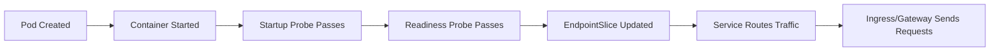
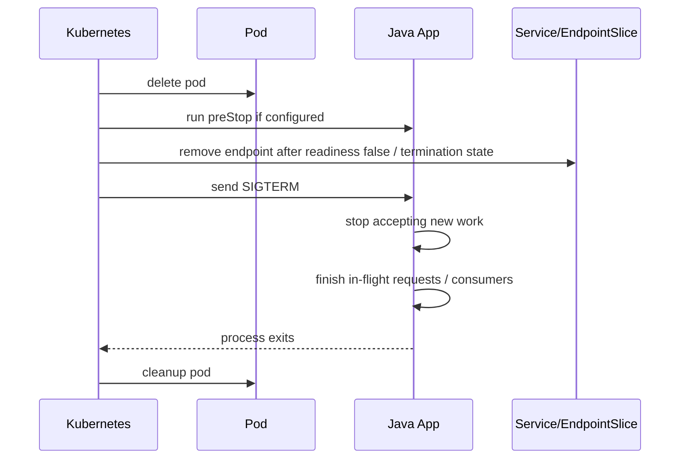

# Deployment for Java/JAX-RS Services

## 1. Core Mental Model

`Deployment` adalah cara paling umum menjalankan **stateless long-running service** di Kubernetes.

Untuk Java/JAX-RS backend, Deployment bukan hanya YAML untuk menjalankan container. Deployment adalah kontrak operasional antara aplikasi dan platform:

- image apa yang dijalankan,
- berapa replica yang harus hidup,
- port apa yang diekspos,
- konfigurasi apa yang disuntikkan,
- secret apa yang dibutuhkan,
- identity apa yang dipakai,
- resource apa yang dijanjikan,
- health signal apa yang dipercaya,
- bagaimana rollout dilakukan,
- bagaimana pod dihentikan,
- kapan traffic boleh masuk,
- bagaimana rollback dilakukan jika versi baru buruk.

Mental model utamanya:

```text
Java/JAX-RS application code
        ↓
Container image
        ↓
Deployment template
        ↓
ReplicaSet
        ↓
Pods
        ↓
Service endpoints
        ↓
Ingress / Gateway / clients
```

Deployment tidak secara langsung menerima traffic. Deployment menciptakan Pod. Service memilih Pod melalui label selector. Ingress/Gateway mengarah ke Service. Karena itu, kesalahan kecil pada label, port, probe, atau readiness bisa membuat aplikasi terlihat "deployed" tetapi tidak bisa menerima traffic.

> Production Deployment yang baik bukan hanya membuat pod `Running`. Production Deployment yang baik membuat pod bisa menerima traffic dengan aman, berhenti dengan aman, dan gagal dengan mudah didiagnosis.

---

## 2. Why Deployment Exists

Tanpa Deployment, kamu harus mengelola Pod secara manual.

Masalahnya:

- jika pod mati, tidak ada controller yang menjamin pengganti,
- jika image baru dirilis, tidak ada rollout terkontrol,
- jika rollout gagal, rollback manual menjadi rawan,
- jika node drain, availability bisa jatuh,
- jika readiness salah, traffic bisa masuk ke pod belum siap,
- jika shutdown salah, request aktif bisa terputus,
- jika resource salah, JVM bisa OOM atau throttled.

Deployment menyediakan:

- declarative desired state,
- replica management,
- rolling update,
- rollback via ReplicaSet history,
- progress tracking,
- availability constraints,
- template versioning melalui pod template hash.

Contoh pola reconciliation:

```text
Desired replicas: 4
Ready replicas: 3
Available replicas: 3
Updated replicas: 2

Deployment controller:
- membuat pod baru dari template baru,
- menunggu readiness,
- mengurangi pod lama secara bertahap,
- menjaga availability berdasarkan maxUnavailable/maxSurge.
```

Ini penting untuk Java/JAX-RS service karena startup JVM bisa lambat, warmup bisa panjang, dependency eksternal bisa belum siap, dan shutdown butuh drain.

---

## 3. Deployment Anatomy

Manifest Deployment biasanya terdiri dari:

```yaml
apiVersion: apps/v1
kind: Deployment
metadata:
  name: quote-service
  namespace: quote-order
  labels:
    app.kubernetes.io/name: quote-service
    app.kubernetes.io/component: api
spec:
  replicas: 3
  revisionHistoryLimit: 5
  strategy:
    type: RollingUpdate
    rollingUpdate:
      maxUnavailable: 0
      maxSurge: 1
  selector:
    matchLabels:
      app.kubernetes.io/name: quote-service
  template:
    metadata:
      labels:
        app.kubernetes.io/name: quote-service
        app.kubernetes.io/component: api
    spec:
      serviceAccountName: quote-service
      terminationGracePeriodSeconds: 60
      containers:
        - name: quote-service
          image: registry.example.com/quote-service:1.2.3
          ports:
            - name: http
              containerPort: 8080
            - name: management
              containerPort: 8081
          envFrom:
            - configMapRef:
                name: quote-service-config
          env:
            - name: JAVA_TOOL_OPTIONS
              value: >-
                -XX:MaxRAMPercentage=70
                -XX:InitialRAMPercentage=40
            - name: DB_PASSWORD
              valueFrom:
                secretKeyRef:
                  name: quote-service-secret
                  key: db-password
          resources:
            requests:
              cpu: "500m"
              memory: "768Mi"
            limits:
              cpu: "1"
              memory: "1Gi"
          startupProbe:
            httpGet:
              path: /health/startup
              port: management
            failureThreshold: 30
            periodSeconds: 2
          readinessProbe:
            httpGet:
              path: /health/ready
              port: management
            periodSeconds: 5
            timeoutSeconds: 2
            failureThreshold: 3
          livenessProbe:
            httpGet:
              path: /health/live
              port: management
            periodSeconds: 10
            timeoutSeconds: 2
            failureThreshold: 3
          lifecycle:
            preStop:
              exec:
                command: ["sh", "-c", "sleep 10"]
          securityContext:
            runAsNonRoot: true
            allowPrivilegeEscalation: false
            readOnlyRootFilesystem: true
            capabilities:
              drop: ["ALL"]
```

Manifest seperti ini bukan template final untuk semua service. Ini contoh struktur yang harus dievaluasi berdasarkan runtime, framework, ingress, service mesh, sidecar, dan standar platform internal.

---

## 4. Important Invariants

Deployment Java/JAX-RS yang sehat harus menjaga beberapa invariants.

| Invariant | Maksud | Jika Rusak |
|---|---|---|
| Pod template label cocok dengan Service selector | Service menemukan pod yang benar | Service no endpoint |
| Readiness hanya true saat pod siap menerima traffic | Traffic tidak masuk terlalu cepat | 502/503, startup error |
| Liveness tidak terlalu agresif | Pod tidak restart karena dependency transient | restart storm |
| Startup probe cukup untuk JVM warmup | Boot lambat tidak dianggap mati | CrashLoopBackOff |
| Resource limit selaras dengan JVM memory | Heap/native tidak melebihi cgroup | OOMKilled |
| Termination grace cukup | Request/consumer selesai sebelum kill | data loss / duplicate processing |
| ServiceAccount least privilege | Pod punya akses yang perlu saja | privilege escalation |
| Config/secret jelas sumbernya | Runtime deterministik | config drift / credential mismatch |
| Rollout menjaga availability | Update tidak menyebabkan outage | downtime saat deploy |

Kubernetes tidak bisa menebak invariant aplikasi. Manifest harus menyatakannya.

---

## 5. Container Port, Service Port, and Management Port

Untuk Java/JAX-RS service, pisahkan mental model port:

```text
containerPort   -> port process di dalam container
Service port    -> port stable yang dipakai client internal cluster
targetPort      -> port container yang dituju Service
Ingress port    -> port HTTP/HTTPS di edge
management port -> port health/metrics/admin endpoint, jika dipisah
```

Contoh:

```yaml
ports:
  - name: http
    containerPort: 8080
  - name: management
    containerPort: 8081
```

Service:

```yaml
apiVersion: v1
kind: Service
metadata:
  name: quote-service
spec:
  selector:
    app.kubernetes.io/name: quote-service
  ports:
    - name: http
      port: 80
      targetPort: http
```

Prinsip review:

- `containerPort` tidak membuka firewall. Ia dokumentasi dan referensi untuk port.
- Service `targetPort` harus cocok dengan nama atau angka port container.
- Management endpoint sebaiknya tidak diekspos ke public ingress.
- Jika health endpoint berada di management port, NetworkPolicy/Service harus mempertimbangkan akses kubelet/probe path.
- Jika service mesh atau sidecar digunakan, port dan probe bisa dimodifikasi oleh injector.

Failure umum:

```text
Application listens on 8080
Deployment says containerPort 8080
Service targetPort 8081
Result: Service routing failure / connection refused
```

---

## 6. Image Reference: Tag vs Digest

Deployment mengikat workload ke image.

```yaml
image: registry.example.com/quote-service:1.2.3
```

Tag mudah dibaca, tetapi tag bisa mutable jika registry tidak mengunci.

Lebih kuat:

```yaml
image: registry.example.com/quote-service@sha256:...
```

Praktik enterprise sering menggunakan kombinasi:

- pipeline membangun image dengan tag commit SHA,
- vulnerability scan dilakukan,
- image dipromosikan,
- manifest environment mengacu ke tag immutable atau digest,
- deployment dapat ditelusuri dari pod ke commit.

Untuk Java/JAX-RS service, image reference harus menjawab:

- commit mana yang berjalan?
- artifact Maven mana yang ada di image?
- base image mana yang digunakan?
- scan report mana yang berlaku?
- siapa yang mempromosikan image ke environment ini?
- bagaimana rollback ke image sebelumnya?

Internal verification checklist:

- Apakah tag immutable?
- Apakah digest dipakai di production?
- Apakah imagePullPolicy sesuai?
- Apakah registry policy mencegah overwrite?
- Apakah pod annotation mencatat commit/build?

---

## 7. Replica Count and Availability

`replicas` menentukan jumlah pod yang diinginkan.

```yaml
spec:
  replicas: 3
```

Namun jumlah replica bukan sekadar angka.

Pertimbangan:

- minimum capacity untuk traffic normal,
- capacity saat satu pod unavailable,
- capacity saat node drain,
- capacity saat rolling update,
- startup latency pod baru,
- cost,
- database connection pool multiplication,
- Kafka/RabbitMQ consumer concurrency,
- rate limit downstream,
- session/state assumptions.

Untuk REST API stateless:

```text
replicas >= 2 biasanya baseline availability minimal,
replicas >= 3 sering lebih aman untuk rolling update + node failure,
tetapi angka sebenarnya harus berdasarkan traffic, SLO, dan cost.
```

Untuk consumer:

- terlalu banyak replica bisa meningkatkan parallelism,
- bisa juga membuat downstream overload,
- Kafka partition count membatasi effective consumer parallelism dalam satu consumer group,
- RabbitMQ prefetch dan ack behavior menentukan beban per consumer.

Jangan menaikkan replica tanpa memahami downstream capacity.

---

## 8. Resource Requests and Limits for Java

Deployment harus menyatakan resource:

```yaml
resources:
  requests:
    cpu: "500m"
    memory: "768Mi"
  limits:
    cpu: "1"
    memory: "1Gi"
```

Mental model:

- `request` memengaruhi scheduling dan reserved capacity,
- `limit` memengaruhi runtime enforcement,
- memory limit bisa menyebabkan OOMKilled,
- CPU limit bisa menyebabkan throttling,
- JVM harus disetel agar aware terhadap memory limit,
- request terlalu kecil membuat pod tampak murah tetapi unstable,
- request terlalu besar membuat bin packing buruk dan cost naik.

Untuk Java:

```text
container memory limit
  = heap
  + metaspace
  + thread stacks
  + direct buffers
  + code cache
  + GC/native memory
  + framework/runtime overhead
```

Jika `-Xmx` atau `MaxRAMPercentage` terlalu besar, pod bisa mati meski heap belum terlihat penuh dari metric aplikasi.

Contoh risk:

```yaml
limits:
  memory: "512Mi"
env:
  - name: JAVA_TOOL_OPTIONS
    value: "-XX:MaxRAMPercentage=90"
```

Ini berbahaya untuk banyak service enterprise karena native memory, metaspace, TLS buffer, Netty/JDBC driver, thread stack, dan agent observability masih butuh ruang.

Review rule:

- Jangan lihat heap saja.
- Lihat total RSS/container memory.
- Lihat GC pause, CPU throttling, thread count, direct memory, file descriptor.
- Pastikan resource policy cocok dengan traffic dan startup behavior.

---

## 9. Environment Variables, ConfigMap, and Secret

Deployment sering menggabungkan tiga jenis konfigurasi:

```text
non-sensitive config -> ConfigMap
essential secret     -> Secret / external secret
runtime metadata     -> Downward API
```

Contoh:

```yaml
envFrom:
  - configMapRef:
      name: quote-service-config

env:
  - name: DB_PASSWORD
    valueFrom:
      secretKeyRef:
        name: quote-service-secret
        key: db-password
  - name: POD_NAME
    valueFrom:
      fieldRef:
        fieldPath: metadata.name
```

Hal yang harus dipahami:

- Env var dibaca saat process start.
- Perubahan ConfigMap/Secret tidak otomatis mengubah env var dalam process berjalan.
- Secret sebagai env var bisa muncul dalam dump environment jika tooling tidak hati-hati.
- Mounted Secret bisa dirotasi lebih mudah, tetapi aplikasi harus mendukung reload.
- Helm/Kustomize dapat membuat drift jika values environment tidak terkelola.

Untuk Java/JAX-RS:

- config harus divalidasi saat startup,
- missing required config harus fail fast,
- default harus aman,
- secret jangan dilog,
- endpoint debug/admin jangan menampilkan config sensitif,
- credential rotation harus punya strategi.

---

## 10. ServiceAccount and Runtime Identity

Deployment harus menentukan identity workload:

```yaml
serviceAccountName: quote-service
```

Jika tidak ditentukan, pod memakai `default` ServiceAccount di namespace. Ini sering tidak ideal.

ServiceAccount berhubungan dengan:

- akses ke Kubernetes API,
- token mounted ke pod,
- RBAC permission,
- AWS IRSA,
- Azure Workload Identity,
- secret manager access,
- cloud SDK credential resolution.

Prinsip:

```text
Every production workload should have an explicit ServiceAccount.
Default ServiceAccount should not become implicit permission bucket.
```

Untuk workload yang tidak perlu Kubernetes API:

```yaml
automountServiceAccountToken: false
```

Tetapi hati-hati: jika workload menggunakan IRSA/Azure Workload Identity, token projection mungkin diperlukan. Jadi ini harus disesuaikan dengan identity model platform.

Internal verification checklist:

- Apakah workload memakai explicit ServiceAccount?
- Apakah SA punya Role/RoleBinding minimal?
- Apakah token automount diperlukan?
- Apakah SA dipakai untuk IRSA/Azure Workload Identity?
- Apakah CI/CD atau GitOps memberi permission terlalu besar?

---

## 11. Probes in Deployment

Deployment Java/JAX-RS production biasanya butuh tiga probe:

```text
startupProbe   -> melindungi service lambat start dari liveness restart
readinessProbe -> menentukan apakah pod boleh menerima traffic
livenessProbe  -> menentukan apakah pod harus direstart
```

Contoh:

```yaml
startupProbe:
  httpGet:
    path: /health/startup
    port: management
  failureThreshold: 30
  periodSeconds: 2

readinessProbe:
  httpGet:
    path: /health/ready
    port: management
  periodSeconds: 5
  timeoutSeconds: 2
  failureThreshold: 3

livenessProbe:
  httpGet:
    path: /health/live
    port: management
  periodSeconds: 10
  timeoutSeconds: 2
  failureThreshold: 3
```

Key distinction:

- startup: apakah aplikasi sudah selesai bootstrap?
- readiness: apakah aplikasi siap menerima traffic sekarang?
- liveness: apakah process stuck dan harus direstart?

Anti-pattern:

```text
liveness calls database
DB transient issue
liveness fails
Kubernetes restarts all pods
incident gets worse
```

Part 012 membahas probes lebih dalam.

---

## 12. Rolling Update Strategy

Deployment default strategy adalah `RollingUpdate`.

```yaml
strategy:
  type: RollingUpdate
  rollingUpdate:
    maxUnavailable: 0
    maxSurge: 1
```

Interpretasi:

- `maxUnavailable: 0` berarti Kubernetes tidak boleh mengurangi available pod selama rollout.
- `maxSurge: 1` berarti boleh membuat satu pod ekstra sementara.

Ini umum untuk service API, tetapi tidak selalu cukup.

Pertimbangan:

- Apakah cluster punya capacity untuk surge?
- Apakah startup pod baru cukup cepat?
- Apakah readiness benar-benar menunggu warmup?
- Apakah schema/database change backward compatible?
- Apakah Kafka/RabbitMQ consumer bisa overlap versi lama dan baru?
- Apakah external API contract backward compatible?
- Apakah cache key/version kompatibel?

Jika `maxUnavailable` terlalu tinggi, availability bisa jatuh.

Jika `maxSurge` terlalu tinggi, cluster bisa kekurangan capacity atau downstream overload.

Jika readiness terlalu optimistis, Kubernetes akan menghapus pod lama sebelum pod baru benar-benar siap.

---

## 13. Readiness Before Traffic

Readiness adalah gate traffic.

Flow sederhananya:



Readiness yang benar harus mempertimbangkan:

- HTTP server sudah listening,
- dependency wajib tersedia jika service tidak bisa bekerja tanpanya,
- migration/init critical selesai,
- cache/bootstrap minimum selesai,
- thread pool tidak saturated,
- circuit breaker tidak open untuk semua critical path,
- application mode bukan maintenance/draining.

Namun readiness jangan terlalu luas sampai setiap downstream minor outage membuat seluruh service removed dari traffic dan memperparah incident.

Rule praktis:

```text
Readiness should answer:
"Can this pod safely receive normal traffic now?"

Not:
"Is the entire universe healthy?"
```

---

## 14. Startup Warmup for Java Services

Java service bisa butuh warmup karena:

- class loading,
- dependency injection initialization,
- connection pool creation,
- TLS context initialization,
- JIT warmup,
- cache load,
- schema validation,
- migration check,
- metrics/tracing agent initialization,
- service mesh sidecar readiness.

Jika startup probe tidak ada, liveness probe bisa membunuh pod sebelum startup selesai.

Contoh buruk:

```yaml
livenessProbe:
  httpGet:
    path: /health/live
    port: 8080
  initialDelaySeconds: 10
  periodSeconds: 5
```

Jika JVM kadang butuh 90 detik untuk siap, ini bisa menyebabkan CrashLoopBackOff.

Lebih baik:

```yaml
startupProbe:
  httpGet:
    path: /health/startup
    port: management
  periodSeconds: 5
  failureThreshold: 24 # up to 120 seconds
```

Dengan startup probe, liveness/readiness ditunda sampai startup berhasil.

---

## 15. Graceful Shutdown Contract

Deployment harus memberi waktu pod berhenti dengan aman.

```yaml
terminationGracePeriodSeconds: 60
```

Shutdown path:



Untuk Java/JAX-RS service:

- HTTP server harus stop menerima request baru,
- in-flight request diberi waktu selesai,
- DB transaction tidak boleh dipotong sembarangan,
- Kafka/RabbitMQ consumer harus stop polling/consuming dan commit/ack dengan benar,
- background worker harus menghentikan scheduler,
- tracing/logging buffer harus flush,
- server harus exit sebelum grace period habis.

Jika tidak selesai, Kubernetes mengirim SIGKILL.

SIGKILL tidak bisa ditangkap aplikasi.

---

## 16. Deployment and Database Compatibility

Deployment bukan hanya masalah pod. Rollout bisa merusak database compatibility.

Risiko:

- versi baru butuh kolom baru, tetapi migration belum selesai,
- versi lama tidak kompatibel dengan schema baru,
- rollback gagal karena schema sudah berubah,
- multiple replicas menjalankan migration bersamaan,
- connection pool dari replica baru membuat database overload,
- readiness true sebelum connection pool benar-benar valid.

Praktik aman:

```text
expand -> deploy -> migrate usage -> contract
```

Contoh:

1. Tambahkan kolom nullable/backward-compatible.
2. Deploy aplikasi yang bisa membaca/menulis format lama dan baru.
3. Backfill bila perlu.
4. Ubah aplikasi memakai schema baru.
5. Hapus kolom lama setelah aman.

Untuk migration:

- jangan jalankan migration otomatis dari setiap pod tanpa locking kuat,
- gunakan Job terkontrol jika platform mengizinkan,
- pastikan migration idempotent,
- pastikan rollback plan eksplisit.

---

## 17. Deployment and Messaging Workloads

Java service sering bukan hanya REST API. Bisa juga Kafka/RabbitMQ consumer.

Untuk consumer Deployment:

- readiness bukan berarti bisa menerima HTTP traffic, tetapi bisa berarti consumer siap memproses message,
- liveness harus mendeteksi deadlock/stuck process, bukan broker transient issue,
- graceful shutdown harus stop consume lalu commit/ack dengan benar,
- replica count memengaruhi concurrency,
- HPA berbasis CPU sering tidak cukup; consumer lag/queue depth lebih relevan,
- duplicate processing harus dianggap mungkin,
- handler harus idempotent jika broker delivery at-least-once.

Kafka-specific concerns:

- consumer group rebalance saat rollout,
- partition count membatasi parallelism,
- max poll interval,
- commit timing,
- poison message,
- DLQ strategy.

RabbitMQ-specific concerns:

- manual ack,
- prefetch,
- unacked messages saat shutdown,
- redelivery storm,
- DLX/DLQ.

Deployment review harus memperhatikan workload type, bukan hanya manifest generik.

---

## 18. Deployment and Redis/Camunda/NGINX Dependencies

Redis:

- connection pool sizing dikali replica,
- cache warmup bisa memengaruhi readiness,
- Redis outage jangan selalu menyebabkan liveness restart,
- timeout harus pendek dan terukur,
- fallback/circuit breaker harus jelas.

Camunda-like workers:

- worker concurrency harus selaras dengan replica,
- duplicate execution harus dipertimbangkan,
- shutdown harus release/complete/extend lock sesuai model workflow,
- long-running task butuh termination grace lebih panjang.

NGINX/Ingress:

- timeout ingress harus >= expected request duration,
- body size limit harus cocok dengan API,
- path rewrite harus benar,
- X-Forwarded headers harus diproses dengan aman,
- connection draining harus dipahami saat rollout.

PostgreSQL:

- total connection pool = pool per pod × replica,
- readiness yang membuka connection baru terus-menerus bisa membebani DB,
- startup storm bisa terjadi saat banyak pod restart bersamaan.

---

## 19. EKS, AKS, On-Prem, and Hybrid Considerations

Deployment manifest core sama di semua Kubernetes, tetapi runtime environment berbeda.

EKS concerns:

- image registry biasanya ECR atau private registry,
- workload identity bisa memakai IRSA,
- LoadBalancer/Ingress bisa memakai AWS Load Balancer Controller,
- pod IP behavior bergantung VPC CNI,
- security group/subnet/NAT/VPC endpoint memengaruhi egress,
- CloudWatch/Prometheus setup memengaruhi observability.

AKS concerns:

- image registry bisa ACR,
- identity bisa Managed Identity / Workload Identity,
- networking bisa Azure CNI/kubenet tergantung setup,
- ingress bisa Application Gateway/AGIC atau NGINX,
- Azure Monitor/Log Analytics memengaruhi observability,
- NSG/UDR/private endpoint memengaruhi traffic.

On-prem concerns:

- registry internal,
- load balancer internal,
- DNS/certificate internal,
- storage class dan CSI driver dikelola sendiri,
- patching node/control plane lebih banyak tanggung jawab platform,
- air-gapped deployment bisa membatasi image pull dan CVE updates.

Hybrid concerns:

- DNS split-horizon,
- proxy dan firewall,
- TLS trust store,
- latency ke dependency on-prem/cloud,
- route asymmetry,
- private endpoint behavior.

Internal detail harus diverifikasi. Jangan mengasumsikan CSG memakai topology tertentu tanpa bukti.

---

## 20. Failure Modes

| Symptom | Likely Cause | What to Check |
|---|---|---|
| Pod Running tapi service unreachable | Service selector/targetPort salah | Service, EndpointSlice, labels, ports |
| Rollout stuck | New pods not ready | readiness, events, logs, image, config |
| CrashLoopBackOff | app exits, bad config, startup probe absent | logs previous, env, secret, startup time |
| ImagePullBackOff | registry/auth/tag issue | image name, pull secret, registry ACL |
| OOMKilled | JVM memory > limit | container memory, JVM options, NMT, metrics |
| CPU throttling | CPU limit too low | container CPU throttling metric |
| 502/503 during deploy | readiness too early or drain too short | probes, preStop, ingress timeout |
| DB overload after rollout | pool × replicas too high | connection pool, replica count, DB max conn |
| Consumer duplicates | shutdown/rebalance/ack issue | consumer logs, offset/ack behavior |
| Forbidden cloud API | identity/RBAC/IAM issue | ServiceAccount, IRSA/Workload Identity, role |
| Config works locally not cluster | config/secret/env mismatch | ConfigMap, Secret, envFrom, Helm values |

---

## 21. Debugging Workflow

Saat Deployment bermasalah, jangan langsung restart semua pod.

Urutan aman:

```bash
kubectl get deploy -n <namespace> <name>
kubectl describe deploy -n <namespace> <name>
kubectl rollout status deploy/<name> -n <namespace>
kubectl get rs -n <namespace> -l app.kubernetes.io/name=<name>
kubectl get pods -n <namespace> -l app.kubernetes.io/name=<name> -o wide
kubectl describe pod -n <namespace> <pod>
kubectl logs -n <namespace> <pod> --previous
kubectl logs -n <namespace> <pod>
kubectl get events -n <namespace> --sort-by=.metadata.creationTimestamp
```

Untuk routing:

```bash
kubectl get svc -n <namespace> <service>
kubectl describe svc -n <namespace> <service>
kubectl get endpointslice -n <namespace> -l kubernetes.io/service-name=<service>
```

Untuk rollout:

```bash
kubectl rollout history deploy/<name> -n <namespace>
kubectl rollout undo deploy/<name> -n <namespace>
```

Production caution:

- cek impact sebelum undo,
- pastikan rollback compatible dengan database/config,
- jangan exec ke pod dan mengubah state manual kecuali runbook mengizinkan,
- dokumentasikan command yang dijalankan saat incident.

---

## 22. Deployment Review Checklist

### Workload Identity

- [ ] Deployment memakai `serviceAccountName` eksplisit.
- [ ] ServiceAccount punya permission minimal.
- [ ] Token automount sesuai kebutuhan.
- [ ] Cloud identity diverifikasi jika pod memanggil AWS/Azure service.

### Image

- [ ] Image tag/digest jelas.
- [ ] Image berasal dari registry resmi/internal.
- [ ] Image sudah di-scan.
- [ ] Build dapat ditelusuri ke commit.
- [ ] Pull secret/registry access valid.

### Ports and Routing

- [ ] `containerPort` sesuai port aplikasi.
- [ ] Service `targetPort` cocok.
- [ ] Management port tidak terekspos public tanpa sengaja.
- [ ] Label selector Deployment dan Service cocok.
- [ ] Ingress/Gateway mengarah ke Service yang benar.

### Configuration

- [ ] ConfigMap/Secret jelas.
- [ ] Required config divalidasi saat startup.
- [ ] Secret tidak dilog.
- [ ] Perubahan config punya restart/reload strategy.
- [ ] Environment overlay tidak drift.

### Resources

- [ ] CPU/memory request realistis.
- [ ] Memory limit cocok dengan JVM heap + native overhead.
- [ ] CPU limit tidak menyebabkan throttling berat.
- [ ] Ephemeral storage dipertimbangkan.
- [ ] Connection pool dikalikan replica.

### Probes

- [ ] Startup probe ada untuk JVM lambat.
- [ ] Readiness merepresentasikan traffic safety.
- [ ] Liveness tidak mengecek dependency transient secara agresif.
- [ ] Timeout dan threshold realistis.
- [ ] Probe endpoint ringan dan reliable.

### Rollout and Shutdown

- [ ] `maxUnavailable` dan `maxSurge` sesuai availability/capacity.
- [ ] `terminationGracePeriodSeconds` cukup.
- [ ] SIGTERM ditangani aplikasi.
- [ ] In-flight request/consumer shutdown aman.
- [ ] Rollback plan compatible dengan DB/config.

### Observability

- [ ] Logs structured.
- [ ] Metrics tersedia.
- [ ] Trace/correlation ID ada.
- [ ] Dashboard mencakup pod, JVM, HTTP, dependency.
- [ ] Alert mencakup rollout, readiness, error rate, latency, saturation.

---

## 23. Internal Verification Checklist

Untuk konteks CSG/team, jangan berasumsi. Verifikasi:

- [ ] Apakah service Java/JAX-RS memakai Deployment, StatefulSet, Job, atau pattern lain?
- [ ] Di mana manifest didefinisikan: raw YAML, Helm, Kustomize, Argo CD, Flux, Terraform, atau kombinasi?
- [ ] Apakah ada standard chart internal?
- [ ] Apakah ada platform baseline untuk labels/annotations?
- [ ] Bagaimana image tag/digest dipilih untuk environment?
- [ ] Apakah deployment dilakukan via GitOps atau pipeline langsung?
- [ ] Bagaimana rollback dilakukan?
- [ ] Apakah database migration terpisah dari app deployment?
- [ ] Apakah startup/readiness/liveness endpoint standard?
- [ ] Apakah management port dipisah?
- [ ] Apakah ServiceAccount per service diwajibkan?
- [ ] Apakah IRSA/Azure Workload Identity digunakan?
- [ ] Apakah NetworkPolicy default deny diterapkan?
- [ ] Apakah resource request/limit punya standard?
- [ ] Apakah ada PDB wajib untuk production?
- [ ] Apakah HPA/KEDA digunakan?
- [ ] Apakah alert rollout failure tersedia?
- [ ] Apakah incident notes pernah menunjukkan probe/shutdown/resource issue?

---

## 24. Anti-Patterns

### Anti-pattern 1: Deployment tanpa readiness probe

Pod masuk Service endpoint terlalu cepat. Traffic masuk sebelum aplikasi siap.

### Anti-pattern 2: Liveness probe mengecek semua dependency

Dependency transient menyebabkan restart massal. Incident kecil menjadi outage besar.

### Anti-pattern 3: Memory limit kecil, heap terlalu besar

Aplikasi terlihat baik di local, lalu OOMKilled di cluster.

### Anti-pattern 4: Default ServiceAccount untuk semua workload

Permission tidak jelas, audit sulit, cloud identity membingungkan.

### Anti-pattern 5: Config/secret bercampur di values file

Secret bocor ke Git, logs, chart diff, atau review artifact.

### Anti-pattern 6: Rolling update tanpa backward compatibility

Versi lama dan baru tidak bisa berjalan bersamaan. Rollout menyebabkan data/API inconsistency.

### Anti-pattern 7: Replica dinaikkan tanpa downstream capacity check

Database, Redis, Kafka, RabbitMQ, atau external API overload.

### Anti-pattern 8: Tidak ada rollback evidence

Tidak jelas image mana yang sebelumnya berjalan dan apakah rollback aman.

---

## 25. Correctness, Performance, Security, Cost, and Observability Concerns

### Correctness

- Apakah rollout kompatibel dengan schema dan message contract?
- Apakah duplicate processing aman?
- Apakah shutdown menjaga transaksi dan ack/commit?
- Apakah readiness mencegah traffic ke pod belum siap?

### Performance

- Apakah CPU throttling memengaruhi p99 latency?
- Apakah JVM heap/native memory sesuai limit?
- Apakah connection pool terlalu besar?
- Apakah startup warmup dipertimbangkan?

### Security

- Apakah pod berjalan non-root?
- Apakah ServiceAccount least privilege?
- Apakah secret tidak bocor ke logs/env dump?
- Apakah image sudah discan?

### Cost

- Apakah request terlalu besar?
- Apakah replica terlalu banyak?
- Apakah maxSurge menyebabkan capacity spike?
- Apakah autoscaling lebih cocok daripada fixed replica?

### Observability

- Apakah deployment punya dashboard?
- Apakah rollout failure terlihat?
- Apakah logs punya correlation ID?
- Apakah pod/JVM/dependency metrics tersedia?

---

## 26. Senior Engineer Questions

Saat mereview Deployment, tanyakan:

1. Apa workload type sebenarnya: API, consumer, worker, scheduler, atau hybrid?
2. Apa invariant traffic safety sebelum pod dianggap ready?
3. Apa yang terjadi jika dependency utama down?
4. Apakah liveness akan memperbaiki atau memperburuk kondisi itu?
5. Apakah shutdown cukup aman untuk request panjang atau message processing?
6. Apakah resource limit selaras dengan JVM memory model?
7. Apakah total DB/broker connection setelah scaling masih aman?
8. Apakah rollout kompatibel dengan versi lama?
9. Apakah rollback aman setelah migration/config berubah?
10. Apakah production debugging path jelas?

---

## 27. Summary

Deployment adalah pusat operasi stateless Java/JAX-RS service di Kubernetes.

Hal yang harus melekat dalam mental model:

- Deployment membuat dan mengelola pod melalui ReplicaSet.
- Service routing bergantung pada label selector dan readiness.
- Resource request/limit memengaruhi scheduling, JVM behavior, cost, dan reliability.
- Probes adalah kontrak health, bukan formalitas YAML.
- Rolling update aman hanya jika readiness, shutdown, capacity, dan compatibility benar.
- ServiceAccount menentukan identity workload.
- Config/secret harus terkelola dan terverifikasi.
- Deployment review harus mencakup correctness, security, performance, cost, observability, dan rollback.

Untuk senior backend engineer, kemampuan penting bukan sekadar menulis Deployment YAML. Kemampuan penting adalah melihat Deployment sebagai **runtime contract** antara aplikasi Java, Kubernetes control plane, traffic flow, dependency eksternal, platform policy, dan operasi production.
