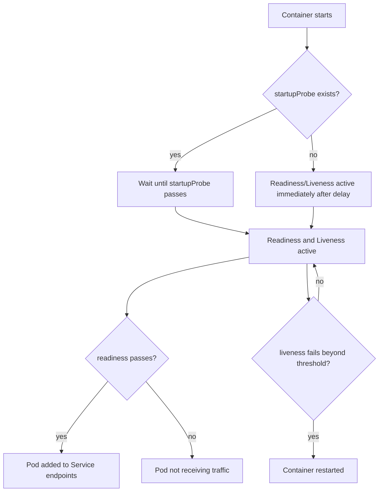
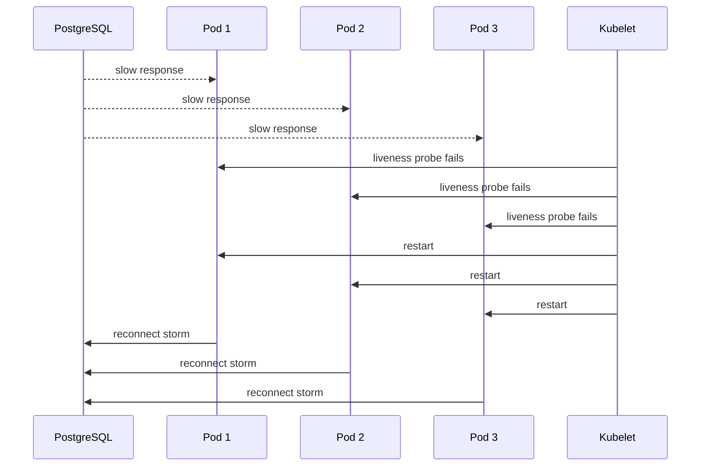

# Health Checks and Probes

## 1. Core Mental Model

Probe adalah cara Kubernetes bertanya ke container:

```text
Are you alive?
Are you ready for traffic?
Have you finished starting?
```

Untuk Java/JAX-RS service, probe bukan sekadar endpoint `/health`. Probe adalah **control signal** yang memengaruhi lifecycle pod, traffic routing, rollout, restart, incident behavior, dan customer impact.

Tiga jenis probe utama:

```text
startupProbe   -> apakah aplikasi sudah selesai bootstrap?
readinessProbe -> apakah pod boleh menerima traffic sekarang?
livenessProbe  -> apakah process perlu direstart?
```

Perbedaan ini sangat penting.

Jika readiness salah, traffic masuk ke pod yang belum siap.

Jika liveness salah, Kubernetes bisa membunuh pod sehat hanya karena dependency transient.

Jika startup probe tidak ada, aplikasi Java yang lambat start bisa masuk CrashLoopBackOff.

> Probe yang buruk bisa menjadi penyebab outage. Probe yang baik membuat rollout, failover, dan debugging jauh lebih aman.

---

## 2. Why Probes Exist

Kubernetes tidak memahami aplikasi Java secara internal.

Kubernetes hanya melihat container process dan beberapa signal runtime. Process yang masih hidup belum tentu siap menerima request. Process yang gagal dependency belum tentu harus direstart. Process yang sedang warmup belum tentu crash.

Probe menyelesaikan gap ini.

Tanpa probe:

- pod dianggap ready terlalu cepat,
- rollout melanjutkan walau versi baru tidak siap,
- pod stuck tidak pernah direstart,
- traffic masuk ke aplikasi belum bootstrap,
- Service endpoint tidak mencerminkan kemampuan aplikasi,
- incident lebih sulit didiagnosis.

Dengan probe yang benar:

- Kubernetes menunggu startup selesai,
- Service hanya mengirim traffic ke pod ready,
- pod deadlocked bisa direstart,
- rollout bisa berhenti saat versi baru gagal,
- debugging punya signal yang eksplisit.

---

## 3. Probe Types Overview

| Probe | Pertanyaan | Efek Jika Gagal | Cocok Untuk |
|---|---|---|---|
| `startupProbe` | Apakah aplikasi sudah selesai start? | Container dianggap belum selesai startup; setelah threshold gagal, restart | JVM warmup, slow bootstrap |
| `readinessProbe` | Apakah pod siap menerima traffic? | Pod dikeluarkan dari Service endpoint | traffic gating, dependency critical, draining |
| `livenessProbe` | Apakah process masih sehat secara internal? | Container direstart | deadlock, unrecoverable stuck state |

Urutan konseptual:



Key idea:

```text
startupProbe protects startup.
readinessProbe protects traffic.
livenessProbe protects stuck runtime.
```

---

## 4. Readiness Probe Deep Dive

Readiness menentukan apakah pod masuk endpoint Service.

Jika readiness gagal:

- pod tetap hidup,
- container tidak direstart,
- Service tidak mengirim traffic ke pod tersebut,
- rollout bisa tertahan karena available replica tidak bertambah.

Readiness harus menjawab:

```text
Can this pod safely serve normal traffic right now?
```

Untuk Java/JAX-RS API, readiness bisa mencakup:

- HTTP server sudah listening,
- application context selesai bootstrap,
- routing/resource method siap,
- critical config valid,
- connection pool initialized jika benar-benar wajib,
- pod tidak sedang draining,
- dependency yang wajib untuk semua request tersedia.

Namun readiness tidak harus mengecek semua dependency minor.

Contoh:

- Jika Redis hanya cache optional, Redis down mungkin tidak perlu membuat pod unready.
- Jika payment/ordering dependency wajib untuk semua endpoint, dependency tersebut bisa memengaruhi readiness.
- Jika hanya sebagian fitur gagal, readiness global mungkin terlalu kasar.

Readiness yang terlalu ketat dapat menyebabkan semua pod keluar dari Service saat satu dependency down, membuat outage lebih buruk.

---

## 5. Liveness Probe Deep Dive

Liveness menentukan apakah container perlu direstart.

Jika liveness gagal melewati threshold:

- kubelet membunuh container,
- container direstart sesuai restart policy,
- pod bisa masuk CrashLoopBackOff jika terus gagal.

Liveness harus menjawab:

```text
Is this process unrecoverably stuck such that restart is likely helpful?
```

Liveness cocok untuk:

- deadlock fatal,
- event loop stuck,
- HTTP server tidak merespons sama sekali,
- internal critical thread mati dan aplikasi tidak bisa self-recover,
- memory corruption/unrecoverable application state.

Liveness tidak cocok untuk:

- database transient down,
- Kafka broker sementara unreachable,
- RabbitMQ connection reconnecting,
- Redis timeout sementara,
- external API rate limited,
- downstream 5xx,
- temporary DNS failure.

Anti-pattern paling berbahaya:

```text
liveness endpoint checks PostgreSQL
PostgreSQL has 30 second outage
all pods fail liveness
Kubernetes restarts all pods
connection storm begins
outage becomes longer
```

Liveness harus minimal, lokal, dan stabil.

---

## 6. Startup Probe Deep Dive

Startup probe melindungi aplikasi yang butuh waktu lama untuk start.

Jika startup probe ada, Kubernetes menunda liveness dan readiness sampai startup probe berhasil.

Ini penting untuk Java karena startup bisa lambat akibat:

- classpath besar,
- dependency injection,
- JIT warmup,
- schema validation,
- TLS initialization,
- metrics/tracing agent,
- service mesh sidecar,
- loading config,
- connection pool initialization,
- cache warmup.

Contoh:

```yaml
startupProbe:
  httpGet:
    path: /health/startup
    port: management
  periodSeconds: 5
  failureThreshold: 24
```

Artinya Kubernetes memberi sekitar 120 detik sebelum menganggap startup gagal.

Startup probe sebaiknya:

- long enough untuk worst-case normal startup,
- not infinite,
- tidak terlalu sering membebani aplikasi,
- tidak mengecek dependency non-critical,
- mencerminkan bootstrap selesai.

Tanpa startup probe, orang sering mengakali dengan `initialDelaySeconds` di liveness. Itu kurang fleksibel karena delay statis dan tidak merepresentasikan startup state sebenarnya.

---

## 7. HTTP, TCP, Exec, and gRPC Probes

Kubernetes mendukung beberapa mekanisme probe.

### HTTP Probe

```yaml
readinessProbe:
  httpGet:
    path: /health/ready
    port: management
  timeoutSeconds: 2
  periodSeconds: 5
```

Cocok untuk Java/JAX-RS service karena endpoint bisa memberi status aplikasi.

Kelebihan:

- expressive,
- mudah dilog,
- cocok untuk REST service,
- bisa memisahkan liveness/readiness/startup.

Risiko:

- endpoint terlalu berat,
- endpoint butuh auth yang probe tidak punya,
- endpoint melewati filter/middleware mahal,
- endpoint tergantung dependency berlebihan.

### TCP Probe

```yaml
readinessProbe:
  tcpSocket:
    port: http
```

TCP probe hanya mengecek port bisa dibuka.

Kelebihan:

- sederhana,
- murah,
- cocok untuk service non-HTTP sederhana.

Risiko:

- port terbuka belum berarti aplikasi siap,
- tidak mengecek routing JAX-RS,
- bisa false positive saat app setengah hidup.

### Exec Probe

```yaml
livenessProbe:
  exec:
    command: ["sh", "-c", "test -f /tmp/app-alive"]
```

Exec probe menjalankan command di container.

Kelebihan:

- fleksibel,
- bisa untuk workload non-HTTP.

Risiko:

- butuh shell/tools di image,
- tidak cocok untuk distroless minimal image,
- command mahal bisa membebani node,
- security surface lebih besar.

### gRPC Probe

Cocok jika service menggunakan gRPC health checking. Untuk seri ini fokus utama JAX-RS/HTTP, tetapi gRPC awareness penting jika service enterprise campuran.

---

## 8. Probe Timing Fields

Probe behavior ditentukan oleh beberapa field.

```yaml
periodSeconds: 5
timeoutSeconds: 2
failureThreshold: 3
successThreshold: 1
initialDelaySeconds: 10
```

Makna:

| Field | Makna | Risk |
|---|---|---|
| `periodSeconds` | seberapa sering probe berjalan | terlalu sering membebani service |
| `timeoutSeconds` | batas waktu satu probe | terlalu pendek menyebabkan false failure |
| `failureThreshold` | jumlah kegagalan sebelum dianggap gagal | terlalu rendah membuat flapping |
| `successThreshold` | jumlah sukses sebelum dianggap sukses | readiness bisa dibuat lebih stabil |
| `initialDelaySeconds` | delay sebelum probe pertama | startupProbe sering lebih baik |

Effective failure window kira-kira:

```text
periodSeconds × failureThreshold
```

Contoh:

```yaml
periodSeconds: 5
failureThreshold: 3
```

Gagal sekitar 15 detik sebelum action.

Untuk liveness, 15 detik mungkin terlalu agresif jika GC pause, CPU throttling, atau node pressure kadang terjadi.

Untuk readiness, 15 detik mungkin masuk akal untuk mengeluarkan pod dari traffic jika benar-benar tidak siap.

---

## 9. Designing Health Endpoints for Java/JAX-RS

Idealnya endpoint dipisah:

```text
/health/startup
/health/live
/health/ready
/metrics
```

Atau sesuai standar framework/platform internal.

### Startup Endpoint

Menjawab:

- application bootstrap selesai,
- config valid,
- server siap membuka route,
- critical initialization selesai.

Tidak perlu mengecek semua dependency eksternal jika itu membuat startup rapuh.

### Liveness Endpoint

Menjawab:

- process event loop/thread utama hidup,
- aplikasi tidak dalam unrecoverable state,
- endpoint bisa merespons ringan.

Harus sangat murah.

### Readiness Endpoint

Menjawab:

- pod boleh menerima traffic,
- critical dependency untuk normal traffic tersedia,
- pod tidak sedang draining,
- internal queue/thread pool tidak dalam kondisi meltdown.

Tetapi jangan membuat readiness bergantung ke semua downstream secara naif.

Contoh JAX-RS style konseptual:

```java
@Path("/health")
public class HealthResource {

    @GET
    @Path("/live")
    public Response live() {
        return Response.ok("OK").build();
    }

    @GET
    @Path("/ready")
    public Response ready() {
        if (isDraining()) {
            return Response.status(503).entity("DRAINING").build();
        }
        if (!criticalSubsystemReady()) {
            return Response.status(503).entity("NOT_READY").build();
        }
        return Response.ok("READY").build();
    }

    @GET
    @Path("/startup")
    public Response startup() {
        return bootstrapComplete()
            ? Response.ok("STARTED").build()
            : Response.status(503).entity("STARTING").build();
    }
}
```

Jangan menyalin mentah. Sesuaikan dengan framework, security filter, platform health convention, dan observability standard internal.

---

## 10. Dependency Check Anti-Pattern

Health endpoint sering salah karena mencoba menjadi dashboard dependency.

Contoh buruk:

```text
/health/live checks:
- PostgreSQL
- Kafka
- RabbitMQ
- Redis
- Camunda
- External pricing API
- Azure Key Vault
- AWS Secrets Manager
```

Akibat:

- satu dependency lambat membuat liveness gagal,
- semua pod restart,
- startup storm terjadi,
- dependency makin overload,
- incident makin besar.

Lebih baik:

```text
liveness -> local process health only
readiness -> only critical traffic-serving readiness
metrics/dashboard -> full dependency health
alerts -> dependency-specific SLOs
```

Dependency health tetap penting, tetapi jangan semuanya dijadikan sinyal restart.

Untuk PostgreSQL:

- readiness boleh mempertimbangkan DB jika semua request butuh DB,
- query harus ringan,
- hasil harus cached sebentar jika perlu,
- timeout harus pendek,
- jangan membuat probe membuka koneksi baru terus-menerus.

Untuk Kafka/RabbitMQ consumer:

- broker disconnected belum tentu process harus restart,
- client biasanya punya reconnect logic,
- readiness bisa false jika consumer tidak bisa process message sama sekali,
- liveness sebaiknya mengecek event loop/consumer thread stuck, bukan broker availability saja.

Untuk Redis:

- jika Redis cache optional, Redis down jangan membuat pod unready,
- jika Redis wajib untuk correctness, readiness bisa tergantung Redis dengan timeout pendek.

---

## 11. Readiness vs Liveness Mistakes

### Mistake 1: Same endpoint for all probes

```yaml
startupProbe:
  httpGet:
    path: /health
readinessProbe:
  httpGet:
    path: /health
livenessProbe:
  httpGet:
    path: /health
```

Jika `/health` mengecek dependency, liveness menjadi terlalu rapuh.

### Mistake 2: Liveness too aggressive

```yaml
livenessProbe:
  periodSeconds: 3
  timeoutSeconds: 1
  failureThreshold: 1
```

Pada JVM dengan GC pause atau CPU throttling, ini bisa menyebabkan restart palsu.

### Mistake 3: Readiness always returns 200

Pod dianggap siap walau app belum benar-benar bisa melayani request.

### Mistake 4: No startup probe for slow Java app

Aplikasi mati berulang saat bootstrap.

### Mistake 5: Readiness checks dependency with long timeout

Probe thread menggantung, kubelet timeout, rollout stuck, dependency overload.

### Mistake 6: Health endpoint behind authentication unexpectedly

Kubelet mendapat 401/403, pod tidak ready atau restart.

### Mistake 7: Health endpoint logs too much

Probe periodik menghasilkan log noise dan biaya logging tinggi.

---

## 12. Probe-Induced Outage

Probe-induced outage terjadi ketika probe memperburuk kondisi yang seharusnya hanya dideteksi.

Scenario:



Root cause awal mungkin DB latency 30 detik. Namun liveness probe membuat semua pod restart dan menciptakan reconnection storm.

Cara mencegah:

- liveness jangan cek DB,
- readiness check DB dengan timeout pendek jika perlu,
- gunakan circuit breaker,
- batasi connection pool,
- stagger rollout/restart,
- alert dependency secara terpisah,
- gunakan startup probe untuk mencegah restart saat boot.

---

## 13. Probe Behavior During Rollout

Saat rolling update:

1. Deployment membuat pod baru.
2. Pod menjalankan startup probe.
3. Jika startup pass, readiness mulai diperhitungkan.
4. Jika readiness pass, pod masuk EndpointSlice.
5. Deployment menganggap pod available setelah `minReadySeconds` jika disetel.
6. Pod lama dikurangi sesuai `maxUnavailable` dan `maxSurge`.

Jika readiness terlalu cepat:

```text
pod baru masuk traffic sebelum warmup
request gagal
pod lama sudah dihentikan
customer melihat error
```

Jika readiness terlalu lambat atau salah:

```text
pod baru tidak pernah available
rollout stuck
old replica tetap jalan
release tidak selesai
```

Tambahkan `minReadySeconds` jika service perlu stabil beberapa detik sebelum dianggap available:

```yaml
spec:
  minReadySeconds: 15
```

Ini berguna untuk menghindari pod yang flapping readiness langsung dianggap sukses.

---

## 14. Probe Behavior During Shutdown

Readiness juga harus berhubungan dengan shutdown.

Saat pod akan dihentikan:

- pod sebaiknya berhenti menerima traffic baru,
- readiness menjadi false atau endpoint dikeluarkan,
- ingress/load balancer melakukan drain,
- in-flight request selesai,
- process exit sebelum grace period habis.

Aplikasi bisa punya state `draining`:

```text
SIGTERM received
set readiness=false
stop accepting new work
finish in-flight request
close consumers
flush logs/traces
exit
```

PreStop sering dipakai untuk memberi waktu endpoint removal tersebar:

```yaml
lifecycle:
  preStop:
    exec:
      command: ["sh", "-c", "sleep 10"]
```

Namun `sleep` bukan solusi utama. Aplikasi tetap harus menangani SIGTERM dengan benar.

---

## 15. Probes for Non-HTTP Workloads

Tidak semua Java workload adalah REST API.

### Kafka Consumer

Readiness bisa berarti:

- consumer initialized,
- consumer group joined,
- broker reachable jika wajib,
- handler siap process,
- tidak sedang draining.

Liveness bisa berarti:

- process tidak deadlocked,
- consumer loop masih progressing,
- internal fatal error tidak terjadi.

Jangan restart hanya karena broker transient reconnect.

### RabbitMQ Consumer

Readiness bisa mempertimbangkan:

- channel created,
- queue declaration valid,
- consumer registered,
- handler siap.

Shutdown harus memperhatikan ack/nack/requeue.

### CronJob/Job

Job sering tidak butuh readiness karena tidak menerima traffic. Liveness kadang juga tidak perlu jika job pendek dan failure akan terlihat dari exit code.

Namun long-running Job bisa butuh liveness jika ada risiko deadlock.

### Camunda Worker

Readiness bisa berarti:

- worker registered,
- engine reachable jika wajib,
- lock/fetch mechanism siap,
- worker tidak sedang draining.

Liveness tetap harus lokal dan tidak membuat restart storm saat engine transient down.

---

## 16. Probe Endpoint Performance

Probe endpoint dipanggil terus-menerus.

Jika 10 pod dengan 3 probe per pod berjalan setiap 5 detik:

```text
10 pods × 3 probes × 12 per minute = 360 probe calls/minute
```

Di banyak service dan namespace, probe traffic bisa signifikan.

Endpoint harus:

- ringan,
- cepat,
- tidak melakukan query berat,
- tidak membuat koneksi baru setiap call,
- tidak menghasilkan log noise,
- punya timeout internal,
- tidak melakukan call fan-out ke banyak dependency,
- tidak mengubah state.

Probe endpoint harus idempotent dan side-effect free.

---

## 17. Security Considerations

Health endpoint bisa membocorkan informasi.

Jangan tampilkan:

- credential,
- connection string,
- token,
- secret manager path sensitif,
- internal hostnames detail jika endpoint public,
- dependency version detail sensitif,
- stack trace.

Praktik:

- expose health endpoint hanya di management port internal jika memungkinkan,
- ingress public jangan membuka management endpoint,
- response body minimal,
- detailed health hanya untuk internal dashboard dengan akses aman,
- pastikan probe tidak butuh auth yang sulit dilakukan kubelet,
- jika service mesh mTLS diterapkan, verifikasi probe path tidak rusak.

Contoh safe response:

```json
{"status":"UP"}
```

Bukan:

```json
{
  "dbUrl": "jdbc:postgresql://internal-host:5432/prod",
  "redisPassword": "...",
  "awsRoleArn": "..."
}
```

---

## 18. Observability for Probes

Probe failures harus terlihat.

Signal yang perlu diamati:

- readiness failure count,
- liveness restart count,
- startup duration,
- pod restart count,
- rollout progress,
- endpoint count,
- HTTP 503/502 during deployment,
- latency/error rate around rollout,
- Kubernetes events,
- application health logs yang tidak noisy.

Kubernetes commands:

```bash
kubectl describe pod -n <namespace> <pod>
kubectl get events -n <namespace> --sort-by=.metadata.creationTimestamp
kubectl get pods -n <namespace> -w
kubectl rollout status deploy/<name> -n <namespace>
kubectl get endpointslice -n <namespace> -l kubernetes.io/service-name=<service>
```

Dalam dashboard, pisahkan:

- application health,
- Kubernetes readiness,
- container restarts,
- dependency health,
- traffic error rate.

Jangan hanya mengandalkan `/health`.

---

## 19. Debugging Probe Failure

Urutan debugging:

```bash
kubectl get pods -n <namespace>
kubectl describe pod -n <namespace> <pod>
kubectl logs -n <namespace> <pod>
kubectl logs -n <namespace> <pod> --previous
kubectl get events -n <namespace> --sort-by=.metadata.creationTimestamp
```

Cari event seperti:

```text
Readiness probe failed: HTTP probe failed with statuscode: 503
Liveness probe failed: Get "http://...": context deadline exceeded
Startup probe failed: connection refused
Back-off restarting failed container
```

Interpretasi umum:

| Event | Kemungkinan |
|---|---|
| `connection refused` | app belum listening, port salah, startup lambat |
| `context deadline exceeded` | app lambat, CPU throttling, GC pause, deadlock, network issue |
| `HTTP 503` | app sengaja not ready/live failed |
| `HTTP 404` | path salah atau context path berbeda |
| `HTTP 401/403` | endpoint kena auth/security filter |
| `no such host` | DNS issue untuk dependency yang dicek endpoint |

Debug dari dalam pod jika aman:

```bash
kubectl exec -n <namespace> <pod> -- curl -v http://localhost:8081/health/ready
```

Untuk distroless image, `curl` mungkin tidak ada. Gunakan ephemeral debug container jika policy mengizinkan.

---

## 20. Probe Configuration Examples

### Reasonable Java API Baseline

```yaml
startupProbe:
  httpGet:
    path: /health/startup
    port: management
  periodSeconds: 5
  failureThreshold: 24
  timeoutSeconds: 2

readinessProbe:
  httpGet:
    path: /health/ready
    port: management
  periodSeconds: 5
  failureThreshold: 3
  timeoutSeconds: 2

livenessProbe:
  httpGet:
    path: /health/live
    port: management
  periodSeconds: 10
  failureThreshold: 3
  timeoutSeconds: 2
```

Ini bukan angka universal. Sesuaikan dengan:

- startup p95/p99,
- GC pause,
- CPU limit,
- service mesh overhead,
- dependency behavior,
- rollout SLO,
- platform standard.

### Slow Startup Service

```yaml
startupProbe:
  httpGet:
    path: /health/startup
    port: management
  periodSeconds: 10
  failureThreshold: 30 # up to 5 minutes
```

Pastikan startup selama 5 menit benar-benar normal, bukan masking bug.

### Readiness Stabilization

```yaml
spec:
  minReadySeconds: 15
```

Digunakan saat pod perlu tetap ready selama periode pendek sebelum dianggap available.

---

## 21. EKS, AKS, On-Prem, and Hybrid Considerations

Core probe behavior sama di semua Kubernetes, tetapi environment memengaruhi symptom.

EKS:

- VPC CNI/network pressure bisa memengaruhi pod startup,
- ALB/NLB target health berbeda dari Kubernetes readiness,
- AWS Load Balancer Controller bisa punya health check sendiri,
- CloudWatch log delay bisa memperlambat debugging,
- IRSA failure bisa membuat readiness gagal jika app butuh AWS service saat startup.

AKS:

- Application Gateway/AGIC health behavior bisa berbeda dari pod readiness,
- Azure Monitor/Log Analytics delay perlu dipahami,
- Workload Identity failure bisa membuat app gagal akses Key Vault/App Config,
- NSG/UDR/private endpoint issue bisa muncul sebagai readiness failure dependency.

On-prem:

- DNS internal dan certificate trust sering menjadi penyebab startup/readiness failure,
- image minimal mungkin tidak punya debug tools,
- load balancer eksternal mungkin tidak sinkron dengan readiness Kubernetes.

Hybrid:

- dependency on-prem/cloud bisa latency tinggi,
- readiness dependency check harus punya timeout pendek,
- proxy/firewall bisa membuat health endpoint dependency lambat,
- split-horizon DNS bisa membuat hasil berbeda antara pod dan developer laptop.

---

## 22. Failure Modes

| Symptom | Likely Cause | Probe Concern |
|---|---|---|
| CrashLoopBackOff during startup | no startupProbe, liveness too early, bad config | startup/liveness |
| Pod Running but NotReady | readiness failing | readiness |
| Rollout stuck | new pod never ready | readiness/startup |
| Random restarts | liveness too aggressive, GC pause, CPU throttling | liveness |
| 503 during deploy | readiness too optimistic | readiness |
| All pods restart during DB issue | liveness checks DB | liveness anti-pattern |
| Probe returns 401/403 | health endpoint behind auth | endpoint design |
| Probe returns 404 | wrong path/context root | endpoint config |
| Probe timeout | app slow, node pressure, dependency check too slow | timeout/performance |
| Health endpoint causes DB load | probe query too heavy/frequent | dependency check |
| Logs flooded by health calls | endpoint access logging too noisy | observability/cost |

---

## 23. Probe Review Checklist

### Probe Separation

- [ ] Startup, readiness, dan liveness punya makna berbeda.
- [ ] Tidak semua probe memakai endpoint berat yang sama.
- [ ] Liveness tidak mengecek dependency transient secara agresif.
- [ ] Readiness merepresentasikan traffic safety.

### Timing

- [ ] Startup probe cukup untuk JVM startup normal terburuk.
- [ ] Liveness timeout tidak terlalu pendek untuk GC/CPU throttling reality.
- [ ] Readiness period/failure threshold tidak menyebabkan flapping.
- [ ] `minReadySeconds` dipertimbangkan untuk rollout stabil.

### Endpoint Design

- [ ] Endpoint ringan.
- [ ] Endpoint side-effect free.
- [ ] Endpoint tidak membuka koneksi baru mahal setiap call.
- [ ] Endpoint tidak menghasilkan log noise berlebihan.
- [ ] Endpoint tidak membocorkan secret/internal topology.
- [ ] Endpoint tidak terblokir auth/security filter tanpa sengaja.

### Dependency Checks

- [ ] DB check jika ada memakai timeout pendek dan query ringan.
- [ ] Redis/Kafka/RabbitMQ/Camunda dependency tidak otomatis dijadikan liveness failure.
- [ ] Dependency optional tidak membuat pod unready.
- [ ] Dependency critical didefinisikan eksplisit.

### Rollout and Shutdown

- [ ] Readiness false saat pod draining.
- [ ] Probe cocok dengan termination grace period.
- [ ] PreStop/shutdown behavior tidak bertentangan dengan probe.
- [ ] Rollout tidak melanjutkan sebelum pod benar-benar siap.

### Observability

- [ ] Probe failures terlihat di events/dashboard.
- [ ] Restart count alert tersedia.
- [ ] Readiness failure trend terlihat.
- [ ] Startup duration diukur.
- [ ] Health logs tidak noisy.

---

## 24. Internal Verification Checklist

Untuk CSG/team, verifikasi:

- [ ] Apa standard health endpoint untuk Java/JAX-RS service?
- [ ] Apakah menggunakan MicroProfile Health, Spring Actuator, custom JAX-RS endpoint, atau framework lain?
- [ ] Apakah management port dipisah dari business HTTP port?
- [ ] Apakah ingress/API gateway mengekspos endpoint health?
- [ ] Apakah liveness/readiness/startup endpoint berbeda?
- [ ] Apakah liveness mengecek PostgreSQL/Kafka/RabbitMQ/Redis/Camunda/external API?
- [ ] Apakah pernah ada incident akibat probe-induced restart?
- [ ] Berapa startup p95/p99 service Java production?
- [ ] Apakah resource throttling menyebabkan probe timeout?
- [ ] Apakah service mesh mengubah probe behavior?
- [ ] Apakah ALB/Application Gateway punya health check terpisah?
- [ ] Apakah alert membedakan app health, pod readiness, dan LB target health?
- [ ] Apakah health endpoint response aman dari secret/topology leak?
- [ ] Apakah logs mengecualikan health check dari access log noisy?

---

## 25. Senior Engineer Questions

Saat mereview probe, tanyakan:

1. Apakah failure probe akan memperbaiki keadaan atau memperburuk incident?
2. Apakah liveness benar-benar mendeteksi unrecoverable stuck process?
3. Apakah readiness menjawab traffic safety, bukan sekadar dependency dashboard?
4. Apakah startup probe sesuai realitas JVM startup?
5. Apakah endpoint health bisa gagal karena auth, context path, atau port salah?
6. Apakah timeout realistis di bawah CPU throttling dan GC pause?
7. Apakah dependency check punya timeout pendek dan tidak berat?
8. Apakah readiness false saat draining?
9. Apakah rollout akan stuck atau lanjut terlalu cepat?
10. Apakah probe failures mudah dilihat di dashboard dan events?

---

## 26. Summary

Probe adalah control signal Kubernetes untuk aplikasi.

Hal yang harus diingat:

- Startup probe melindungi proses bootstrap.
- Readiness probe melindungi traffic.
- Liveness probe melindungi dari process stuck yang perlu restart.
- Liveness yang mengecek dependency transient adalah anti-pattern berbahaya.
- Readiness yang terlalu optimistis menyebabkan 502/503 saat rollout.
- Readiness yang terlalu ketat bisa mengeluarkan semua pod dari traffic saat dependency down.
- Java/JAX-RS service butuh probe timing yang mempertimbangkan JVM startup, GC, CPU throttling, connection pool, dan shutdown.
- Probe endpoint harus ringan, aman, tidak noisy, dan tidak membocorkan detail sensitif.
- Probe design harus direview sebagai bagian dari production readiness, bukan detail YAML kecil.

Untuk senior backend engineer, probe harus dipahami sebagai bagian dari **traffic correctness, rollout safety, failure containment, and incident behavior**.
