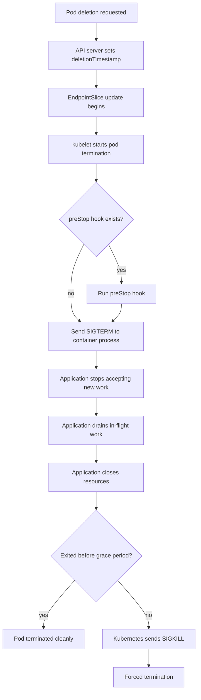

# Graceful Shutdown and Zero-Downtime Deployment

## 1. Core Mental Model

Graceful shutdown adalah kemampuan service untuk **berhenti menerima traffic baru**, **menyelesaikan pekerjaan yang sedang berjalan**, **menutup resource dengan urutan benar**, lalu **keluar sebelum Kubernetes memaksa SIGKILL**.

Zero-downtime deployment adalah hasil dari beberapa mekanisme yang bekerja bersama:

```text
Readiness gating
        +
Service endpoint update
        +
Ingress/load balancer draining
        +
Application graceful shutdown
        +
RollingUpdate configuration
        +
Sufficient replica/capacity
        +
Correct timeout chain
```

Untuk Java/JAX-RS service, masalahnya bukan hanya “pod mati”. Masalahnya adalah apa yang terjadi pada request, transaction, consumer message, lock, connection pool, retry, dan downstream call saat pod sedang dihentikan.

Pod yang menerima `SIGTERM` masih bisa:

- sedang memproses HTTP request,
- sedang menulis transaksi PostgreSQL,
- sedang memproses message Kafka,
- sedang menunggu ack RabbitMQ,
- sedang memegang Redis lock,
- sedang memanggil service lain,
- sedang menjalankan workflow worker Camunda,
- sedang berada di tengah long-running operation.

Graceful shutdown memastikan semua itu tidak berakhir menjadi partial write, duplicate processing, lost ack, broken response, atau incident yang sulit direkonstruksi.

> Pod termination bukan event teknis kecil. Dalam production system, termination adalah distributed systems event.

---

## 2. Why Graceful Shutdown Exists

Kubernetes sering menghentikan pod secara normal:

- rolling deployment,
- rollback,
- scale down,
- node drain,
- cluster upgrade,
- autoscaler mengurangi node,
- eviction karena node pressure,
- manual delete pod,
- rescheduling karena failure,
- disruption karena maintenance.

Jika aplikasi tidak siap dihentikan:

- user menerima `502`, `503`, atau request timeout,
- in-flight request terputus,
- database transaction rollback tanpa observability jelas,
- message Kafka diproses ulang tanpa idempotency,
- RabbitMQ message ter-ack sebelum efek bisnis selesai,
- Redis lock tidak dilepas sesuai ekspektasi,
- Camunda/external worker meninggalkan job dalam state ambigu,
- rollout terlihat sukses tetapi error rate naik,
- shutdown terlihat “normal” di Kubernetes tetapi tidak normal di domain bisnis.

Kubernetes menyediakan lifecycle hooks dan termination grace period, tetapi Kubernetes tidak tahu semantik aplikasi. Kubernetes tidak tahu mana request yang safe dihentikan, mana transaksi yang critical, mana message yang sudah commit, mana work item yang idempotent.

Aplikasi harus berpartisipasi.

---

## 3. Pod Deletion Lifecycle

Saat pod dihapus, Kubernetes menjalankan lifecycle konseptual seperti ini:



Important nuance:

- Pod gets a `deletionTimestamp`.
- Pod should be removed from Service endpoints, but propagation is not instantaneous.
- `preStop` hook runs before SIGTERM and consumes part of the grace period.
- After `preStop`, kubelet sends SIGTERM to the main process.
- If the process does not exit before `terminationGracePeriodSeconds`, kubelet sends SIGKILL.
- SIGKILL cannot be caught by Java.

The practical implication:

```text
terminationGracePeriodSeconds
  must be greater than
preStop duration + traffic drain delay + maximum safe in-flight processing time + shutdown overhead
```

If this budget is too short, Kubernetes will kill the process while work is still running.

---

## 4. Termination Grace Period

`terminationGracePeriodSeconds` is the maximum time Kubernetes gives the pod to stop.

Example:

```yaml
apiVersion: apps/v1
kind: Deployment
metadata:
  name: quote-service
spec:
  template:
    spec:
      terminationGracePeriodSeconds: 60
      containers:
        - name: quote-service
          image: registry.example.com/quote-service:1.42.0
```

For Java/JAX-RS services, too short is dangerous.

A bad value:

```yaml
terminationGracePeriodSeconds: 5
```

Why this is risky:

- JVM may need time to stop HTTP server,
- connection pool needs to close cleanly,
- request handlers may still run,
- Kafka/RabbitMQ consumers need to stop polling and finish current message,
- DB transactions need to commit or roll back,
- logs/traces need to flush,
- ingress endpoint propagation may take several seconds.

A better value depends on workload:

| Workload Type | Typical Shutdown Concern | Grace Period Bias |
|---|---|---|
| Stateless REST API | in-flight HTTP requests, connection draining | moderate |
| Kafka consumer | processing + offset commit | longer |
| RabbitMQ consumer | processing + ack/nack | longer |
| Batch worker | idempotent checkpointing | workload-specific |
| Camunda worker | job lock/complete/fail semantics | longer |
| Webhook receiver | external retry behavior | moderate |

Do not choose grace period by copying another service. Choose it from actual runtime behavior.

---

## 5. PreStop Hook

`preStop` hook runs before Kubernetes sends SIGTERM.

Common pattern:

```yaml
lifecycle:
  preStop:
    exec:
      command: ["/bin/sh", "-c", "sleep 10"]
```

This looks primitive, but it has a purpose: allow endpoint removal and ingress/load balancer propagation before the process starts shutting down.

However, this pattern has trade-offs.

Benefits:

- gives Service/EndpointSlice updates time to propagate,
- reduces chance pod receives traffic after termination starts,
- helps ingress/load balancer stop routing to the pod,
- useful when infrastructure has propagation delay.

Risks:

- consumes termination grace period,
- may hide poor readiness design,
- can slow rollout and node drain,
- too long increases deployment time,
- not a substitute for application-level graceful shutdown.

Better mental model:

```text
preStop sleep is not graceful shutdown.
preStop sleep is propagation padding.
```

If you use it, size it intentionally.

Example with 60 seconds total budget:

```text
preStop: 10s
application drain: 40s
shutdown overhead: 10s
```

If `preStop` is 30 seconds and termination grace is 30 seconds, the app may receive SIGTERM with almost no time left.

---

## 6. SIGTERM Handling in Java Containers

Kubernetes sends SIGTERM to the container process.

The signal must reach the Java process.

Good Dockerfile pattern:

```dockerfile
ENTRYPOINT ["java", "-jar", "/app/app.jar"]
```

Risky shell-form pattern:

```dockerfile
ENTRYPOINT java -jar /app/app.jar
```

The shell form may cause signal forwarding issues because the shell becomes PID 1. If PID 1 does not forward SIGTERM correctly, Java may not receive it.

Another risky pattern:

```dockerfile
ENTRYPOINT ["/bin/sh", "-c", "java -jar /app/app.jar"]
```

If a wrapper script is needed, use `exec`:

```sh
#!/bin/sh
set -e
exec java ${JAVA_OPTS} -jar /app/app.jar
```

The `exec` replaces the shell with the Java process so signals reach the JVM.

For some images, an init process such as `tini` or `dumb-init` may be used to handle signal forwarding and zombie reaping. Whether this is needed depends on the base image and process model.

Internal verification matters because enterprise images may already include an entrypoint wrapper.

---

## 7. Java/JAX-RS Application Shutdown Responsibilities

When SIGTERM arrives, the Java application should:

1. stop accepting new traffic,
2. fail readiness if still being probed,
3. stop polling new async work,
4. let in-flight work finish within a bounded time,
5. close HTTP server cleanly,
6. close DB connection pools,
7. close Kafka/RabbitMQ clients,
8. flush logs and traces,
9. release locks if needed,
10. exit with a clear status.

For JAX-RS, the exact mechanism depends on runtime:

- Jersey on embedded server,
- RESTEasy on Undertow/WildFly/Quarkus,
- Jakarta REST in an application server,
- Spring/Jersey integration,
- custom Netty/Jetty/Tomcat wrapper.

The platform principle is the same:

```text
Signal received
  -> readiness false
  -> no new work
  -> drain active work
  -> close external resources
  -> exit before grace period
```

Avoid runtime-specific assumptions until you verify the actual application stack.

---

## 8. Readiness Removal Before Shutdown

Readiness is the traffic gate.

During normal operation:

```text
readiness = true
Service endpoint includes pod
traffic can flow
```

During shutdown:

```text
readiness = false
Service endpoint should remove pod
new traffic should stop
old traffic may still exist
```

A pod being terminated should not receive new traffic, but endpoint and proxy propagation can lag. That is why graceful shutdown must tolerate a short window where traffic still arrives.

Recommended application behavior:

- expose readiness state controlled by application lifecycle,
- set readiness false as early as possible during shutdown,
- keep liveness true during graceful draining,
- return a clear non-ready response,
- continue serving already accepted requests if possible.

Bad pattern:

```text
SIGTERM received
  -> immediately System.exit(0)
```

Better pattern:

```text
SIGTERM received
  -> readiness false
  -> stop accepting new work
  -> wait for active work with timeout
  -> close resources
  -> exit
```

---

## 9. Connection Draining

Connection draining is the process of letting existing connections complete while preventing new ones.

In Kubernetes traffic path, draining may involve several layers:

```text
Client
  -> DNS
  -> cloud load balancer
  -> ingress controller / NGINX / API gateway
  -> Kubernetes Service
  -> EndpointSlice
  -> Pod IP
  -> Java HTTP server
```

Each layer may have its own behavior:

- TCP connection reuse,
- HTTP keep-alive,
- HTTP/2 multiplexing,
- ingress upstream keepalive,
- load balancer deregistration delay,
- proxy timeout,
- retry behavior,
- source IP handling.

Zero-downtime requires the timeout chain to make sense.

Example concern:

```text
Application needs 45s to finish request
Ingress proxy read timeout is 30s
```

Result:

- app may finish correctly,
- client still receives 504,
- logs show success in app but failure at ingress.

Timeout design must be end-to-end.

---

## 10. In-Flight HTTP Requests

For REST/JAX-RS service, shutdown safety depends on request profile.

Short request:

```text
GET quote summary -> DB read -> response < 200ms
```

Usually easy to drain.

Long request:

```text
POST quote submit -> validation -> catalog pricing -> DB write -> Kafka publish -> response
```

Riskier.

During shutdown, long requests can fail at many points:

- client disconnects,
- ingress timeout,
- app thread interrupted,
- DB transaction rollback,
- Kafka publish uncertain,
- response not delivered,
- retry creates duplicate business operation.

For write operations, graceful shutdown is not enough. You also need:

- idempotency key,
- transaction boundary clarity,
- outbox pattern where appropriate,
- retry-safe API semantics,
- correlation ID,
- clear error logging,
- domain-level reconciliation.

A deployment should not rely on “requests usually finish fast” if the endpoint performs business-critical writes.

---

## 11. Kafka Consumer Shutdown

Kafka consumer shutdown has different correctness concerns from REST API shutdown.

Dangerous pattern:

```text
poll records
process record
commit offset too early
pod receives SIGTERM
process killed before business effect completes
```

Possible result:

- message lost from business perspective,
- Kafka offset says processed,
- database state is incomplete.

Another dangerous pattern:

```text
process record
business effect completed
pod killed before offset commit
```

Possible result:

- message reprocessed,
- duplicate business effect unless idempotent.

Graceful Kafka consumer shutdown should usually:

1. stop polling new records,
2. finish current records within bounded time,
3. commit offsets only after business effect is safe,
4. close consumer cleanly,
5. rely on idempotency for reprocessing edge cases.

Important checklist:

- Is offset commit automatic or manual?
- Is processing idempotent?
- Is there an outbox/inbox pattern?
- What happens if SIGKILL occurs mid-record?
- Is consumer lag monitored during rollout?
- Does HPA/KEDA scaling interact with consumer group rebalance?

Rolling deployment of consumers can trigger rebalances. Rebalances are not just performance events; they can affect latency and duplicate processing behavior.

---

## 12. RabbitMQ Consumer Shutdown

RabbitMQ uses ack/nack semantics, so shutdown correctness depends on ack timing.

Dangerous pattern:

```text
message received
ack sent immediately
business processing starts
pod killed before processing completes
```

Possible result:

- message lost.

Safer pattern:

```text
message received
business processing completes
transaction/result committed
ack sent
```

If shutdown occurs before completion:

- stop consuming new messages,
- finish current message if possible,
- nack/requeue if safe,
- avoid ack-before-effect.

Questions to verify:

- Is manual ack used?
- What is prefetch count?
- Can processing exceed termination grace period?
- Are messages idempotent?
- Is DLQ configured?
- What happens if connection closes during shutdown?
- Are duplicate deliveries expected and safe?

RabbitMQ graceful shutdown is not only about closing the connection. It is about ack semantics relative to business side effects.

---

## 13. PostgreSQL Transaction Shutdown

Database transactions during shutdown must have clear behavior.

If pod receives SIGTERM during a request:

```text
HTTP request starts
DB transaction opens
business writes happen
SIGTERM arrives
request thread interrupted or connection closed
transaction outcome unclear from caller perspective
```

PostgreSQL itself will roll back uncommitted transactions when connection closes, but application-level correctness may still be unclear:

- Did the caller receive response?
- Did retry occur?
- Was an external message already published?
- Was Redis cache already updated?
- Was an audit row inserted?
- Was the transaction boundary correct?

For write-heavy JAX-RS endpoints, graceful shutdown must align with transaction design.

Recommended patterns:

- commit DB before publishing external event only if outbox handles event delivery,
- use idempotency for client retries,
- avoid partial side effects across DB + message broker without compensation,
- log transaction outcome with correlation ID,
- bound request duration below termination budget.

---

## 14. Redis and Lock Shutdown

Redis is often used for cache, distributed lock, rate limit, session-like data, or ephemeral coordination.

Shutdown concerns:

- lock held while pod is killed,
- cache update partially completed,
- distributed lock TTL too long,
- rate limiter state inconsistent,
- Redis connection pool closed while request still active,
- retry storm after cache miss.

If Redis lock is used:

- prefer TTL-based locks,
- avoid relying only on explicit unlock,
- ensure lock value ownership is verified before unlock,
- understand what happens if pod dies before unlock,
- make critical operation idempotent.

Graceful shutdown helps, but lock correctness must tolerate forced termination.

---

## 15. Camunda Worker Shutdown

Camunda-like workers or external task workers have their own shutdown semantics.

Typical concerns:

- worker fetched task but has not completed it,
- lock duration expires while pod is terminating,
- job is retried by another worker,
- business side effect already happened,
- worker marks task complete after downstream timeout,
- incident is created due to transient shutdown.

Graceful worker shutdown should:

- stop fetching new work,
- finish or fail current work intentionally,
- respect lock duration,
- avoid completing task if side effect is uncertain,
- emit correlation logs,
- allow retry where idempotent.

Internal verification is mandatory because Camunda usage patterns vary widely.

---

## 16. RollingUpdate Safety

Deployment rolling update controls how old and new pods overlap.

Example:

```yaml
strategy:
  type: RollingUpdate
  rollingUpdate:
    maxUnavailable: 0
    maxSurge: 1
minReadySeconds: 10
progressDeadlineSeconds: 600
```

Interpretation:

- `maxUnavailable: 0` means do not reduce available capacity during rollout,
- `maxSurge: 1` allows one extra pod during rollout,
- `minReadySeconds` requires pod to remain ready before considered available,
- `progressDeadlineSeconds` detects rollout stuck.

This is often safer for critical REST services than allowing unavailable replicas.

But there are trade-offs:

- needs spare cluster capacity,
- rollout takes longer,
- extra pods may increase cost temporarily,
- if readiness is wrong, rollout can still be unsafe,
- if startup is slow, deployment duration increases.

For consumer workloads, rolling update safety may mean controlling concurrency and rebalance behavior, not just HTTP availability.

---

## 17. PodDisruptionBudget Interaction

A PodDisruptionBudget protects availability during voluntary disruptions.

Example:

```yaml
apiVersion: policy/v1
kind: PodDisruptionBudget
metadata:
  name: quote-service-pdb
spec:
  minAvailable: 2
  selector:
    matchLabels:
      app.kubernetes.io/name: quote-service
```

PDB matters during:

- node drain,
- cluster upgrade,
- autoscaler scale-down,
- maintenance.

But PDB is not magic.

It does not protect against:

- application crash,
- bad liveness probe,
- node hard failure,
- OOMKilled,
- insufficient replicas,
- bad rollout config,
- dependency outage.

PDB can also block maintenance if configured too strictly.

Example risk:

```text
replicas: 1
PDB minAvailable: 1
```

This can block voluntary eviction. For single-replica services, zero-downtime during node maintenance is not realistic.

---

## 18. Timeout Chain Design

Timeouts must be coordinated across layers.

Example request path:

```text
Client timeout:             30s
API gateway timeout:        35s
Ingress proxy timeout:      40s
Application request timeout:25s
DB statement timeout:       20s
Termination grace period:   60s
```

This is coherent because inner operations fail before outer proxies give up, and termination grace has enough budget to drain.

Bad timeout chain:

```text
Client timeout:             20s
Ingress timeout:            15s
Application request:        60s
DB statement timeout:       120s
Termination grace period:   30s
```

Likely outcome:

- client sees timeout,
- app continues work nobody is waiting for,
- DB keeps running,
- pod termination kills work mid-flight,
- retry can duplicate operation.

Timeouts are part of graceful shutdown design.

---

## 19. NGINX and Ingress Draining

If NGINX or ingress controller is in the path, it may maintain upstream connections to pods.

Concerns:

- endpoint update propagation delay,
- upstream keepalive to terminating pod,
- proxy read/send timeout,
- load balancer deregistration delay,
- 502/503 during pod shutdown,
- long-lived HTTP connections,
- websocket or streaming endpoints if used.

For typical REST services, verify:

- ingress controller behavior when endpoint disappears,
- NGINX upstream timeout settings,
- cloud load balancer target deregistration delay,
- whether target type is node/instance or pod/IP,
- whether readiness false removes endpoint quickly enough,
- whether preStop padding is required.

Do not assume all ingress controllers drain the same way.

---

## 20. Readiness vs Liveness During Shutdown

During graceful shutdown:

```text
readiness should become false
liveness should usually remain true
```

If liveness fails during shutdown, Kubernetes may restart the container instead of letting it drain.

Bad pattern:

```text
shutdown starts
readiness false
liveness false
kubelet restarts container
rollout behavior becomes noisy
```

Better pattern:

```text
shutdown starts
readiness false
liveness true while draining
process exits cleanly after drain
```

Liveness is for unrecoverable dead process state, not for traffic gating.

---

## 21. Long-Running Requests

Long-running requests are hard to reconcile with rolling deployment.

Examples:

- large quote calculation,
- bulk order validation,
- export generation,
- synchronous integration call,
- workflow action that waits for external system.

Risk profile:

- termination grace must be long,
- ingress timeout must be long,
- rollout can become slow,
- user experience may degrade,
- retries can duplicate operation,
- pod deletion can be delayed.

Better architecture may be:

```text
POST request
  -> persist command
  -> return operation ID
  -> async worker processes
  -> client polls/subscribes status
```

Not every endpoint should remain synchronous. If a request cannot safely complete within deployment and timeout budget, it may be the wrong shape for synchronous REST.

---

## 22. Observability for Shutdown

Graceful shutdown must be observable.

Minimum logs:

```text
shutdown_signal_received
readiness_set_false
stopped_accepting_new_requests
active_requests_count
consumer_polling_stopped
waiting_for_inflight_work
resource_close_started
resource_close_completed
shutdown_completed
shutdown_forced_or_timeout
```

Useful metrics:

- active HTTP requests,
- request duration during rollout,
- readiness transition count,
- shutdown duration,
- forced termination count,
- SIGTERM to exit latency,
- Kafka consumer lag during rollout,
- RabbitMQ unacked messages,
- DB active connections,
- ingress 502/503/504 rate,
- deployment rollout duration.

Useful traces:

- request spans during pod termination,
- downstream calls near shutdown,
- publish/commit/ack timing,
- correlation ID across retry.

If a rollout causes customer errors, the observability should show whether errors came from app, ingress, dependency, timeout, or termination.

---

## 23. Common Failure Modes

### 23.1 Pod Exits Immediately on SIGTERM

Symptoms:

- sudden 502/503 during rollout,
- low shutdown duration,
- incomplete logs,
- request cancellations.

Likely causes:

- app does not drain,
- SIGTERM handler exits immediately,
- framework graceful shutdown disabled,
- shell entrypoint signal issue.

Debug:

```bash
kubectl logs <pod> --previous
kubectl describe pod <pod>
kubectl rollout history deployment/<name>
```

Check application logs around SIGTERM.

---

### 23.2 Pod Receives Traffic After Termination Starts

Symptoms:

- errors from terminating pods,
- request logs after deletion timestamp,
- ingress upstream errors.

Likely causes:

- endpoint propagation delay,
- readiness not set false early,
- no preStop padding,
- ingress/load balancer keeps connection.

Debug:

```bash
kubectl get pod <pod> -o yaml
kubectl get endpointslice -l kubernetes.io/service-name=<service>
kubectl describe ingress <ingress>
```

---

### 23.3 SIGKILL Before Drain Completes

Symptoms:

- pod terminated with exit code 137,
- logs stop abruptly,
- incomplete work,
- duplicate messages after rollout.

Likely causes:

- terminationGracePeriodSeconds too short,
- preStop consumes too much grace period,
- long-running request,
- shutdown deadlock,
- slow dependency close.

Debug:

```bash
kubectl describe pod <pod>
kubectl logs <pod> --previous
```

Compare shutdown duration with grace period.

---

### 23.4 Kafka Duplicate Processing During Rollout

Symptoms:

- duplicate domain events,
- repeated processing logs,
- consumer group rebalance spike,
- lag increases during rollout.

Likely causes:

- offset commit after processing but pod killed before commit,
- non-idempotent handler,
- long processing exceeds grace period,
- rebalance during rolling update.

Debug:

- inspect consumer logs,
- inspect offset commit strategy,
- compare rollout window with duplicate events,
- check consumer lag dashboard.

---

### 23.5 RabbitMQ Message Loss or Duplicate

Symptoms:

- missing downstream effect,
- duplicate processing,
- DLQ spike,
- unacked message pattern changes.

Likely causes:

- ack before business effect,
- connection closed mid-processing,
- requeue behavior misunderstood,
- prefetch too high for shutdown budget.

Debug:

- inspect ack mode,
- inspect prefetch,
- inspect worker logs,
- check DLQ and broker metrics.

---

### 23.6 Rollout Stuck

Symptoms:

```text
Deployment does not progress
new pods not Ready
old pods not terminating
kubectl rollout status waits forever
```

Likely causes:

- readiness probe fails,
- maxUnavailable too strict with insufficient capacity,
- PDB blocks eviction,
- new pod cannot schedule,
- image pull failure,
- config/secret missing,
- startup exceeds probe threshold.

Debug:

```bash
kubectl rollout status deployment/<name>
kubectl describe deployment <name>
kubectl get rs
kubectl describe pod <new-pod>
kubectl get events --sort-by=.lastTimestamp
```

---

## 24. Correctness Concerns

Graceful shutdown correctness is about preserving domain guarantees during termination.

Ask:

- Can the operation be retried safely?
- Can the same request be executed twice?
- Can message processing be duplicated?
- Can a DB transaction be partially visible?
- Can an event be published without DB commit?
- Can DB commit happen without event publish?
- Can a workflow task be completed with uncertain side effects?
- Can a lock remain held?
- Can the client observe timeout while server commits success?

Zero-downtime at HTTP level is not enough. Correctness must include domain side effects.

---

## 25. Networking Concerns

Shutdown interacts with networking because traffic routing changes are eventually propagated.

Check:

- Service endpoint removal delay,
- EndpointSlice update behavior,
- ingress controller sync interval,
- load balancer target deregistration delay,
- keepalive behavior,
- HTTP/2 multiplexing,
- connection draining configuration,
- DNS cache impact if client calls pod/service indirectly,
- source IP and forwarded headers for debugging.

A pod can be terminating while some layer still has an open connection to it.

---

## 26. Performance Concerns

Graceful shutdown can affect performance during rollout:

- fewer available pods,
- extra load on remaining pods,
- JVM warmup on new pods,
- connection pool cold start,
- cache cold start,
- Kafka rebalance latency,
- RabbitMQ consumer redistribution,
- autoscaler lag,
- surge capacity cost.

A rollout can cause latency spike even when no request fails.

Mitigations:

- sufficient replicas,
- `maxUnavailable: 0` for critical APIs,
- warmup-aware readiness,
- `minReadySeconds`,
- careful HPA config,
- avoid rolling all consumers too fast,
- monitor latency during deployment.

---

## 27. Security and Privacy Concerns

Shutdown logs often expose operational detail.

Avoid logging:

- raw secrets,
- authorization headers,
- full request body with PII,
- database credentials,
- broker credentials,
- cloud tokens,
- private endpoint URLs if sensitive under internal policy.

But do log enough metadata:

- correlation ID,
- request ID,
- operation type,
- shutdown phase,
- resource close result,
- message ID/hash where allowed,
- consumer partition/offset if safe,
- duration.

The balance is evidence without leakage.

---

## 28. Cost Concerns

Zero-downtime deployment often requires temporary extra capacity.

Cost drivers:

- `maxSurge` creates extra pods,
- long termination grace slows rollout,
- PDB may prevent node scale-down,
- conservative resource requests reduce bin packing,
- slow startup requires more overlap,
- canary/blue-green doubles capacity temporarily,
- extra logs/traces during deployment increase telemetry cost.

Cost optimization must not break shutdown correctness. But shutdown design should be aware of capacity overhead.

---

## 29. Practical Kubernetes Manifest Example

Example for a REST API with cautious rollout:

```yaml
apiVersion: apps/v1
kind: Deployment
metadata:
  name: quote-service
spec:
  replicas: 4
  strategy:
    type: RollingUpdate
    rollingUpdate:
      maxUnavailable: 0
      maxSurge: 1
  minReadySeconds: 10
  progressDeadlineSeconds: 600
  selector:
    matchLabels:
      app.kubernetes.io/name: quote-service
  template:
    metadata:
      labels:
        app.kubernetes.io/name: quote-service
    spec:
      terminationGracePeriodSeconds: 60
      containers:
        - name: quote-service
          image: registry.example.com/quote-service:1.42.0
          ports:
            - name: http
              containerPort: 8080
          lifecycle:
            preStop:
              exec:
                command: ["/bin/sh", "-c", "sleep 10"]
          readinessProbe:
            httpGet:
              path: /health/ready
              port: http
            periodSeconds: 5
            timeoutSeconds: 2
            failureThreshold: 2
          livenessProbe:
            httpGet:
              path: /health/live
              port: http
            periodSeconds: 10
            timeoutSeconds: 2
            failureThreshold: 3
          startupProbe:
            httpGet:
              path: /health/startup
              port: http
            periodSeconds: 5
            failureThreshold: 30
```

This is not a universal template. It is a review starting point.

Questions:

- Is 60 seconds enough?
- Is preStop needed?
- Does readiness become false during shutdown?
- Does liveness remain true during drain?
- Are request timeouts shorter than grace period?
- Can active requests finish within budget?
- Does ingress keep routing after endpoint removal?

---

## 30. Debugging Workflow During Rollout Incident

When errors happen during deployment, do not jump directly to restarting pods.

Use a structured path:

```text
1. Confirm rollout timing
2. Check error rate by pod/version
3. Check pod events
4. Check readiness transitions
5. Check ingress/LB errors
6. Check app shutdown logs
7. Check previous pod logs
8. Check resource pressure
9. Check consumer lag / broker metrics if async workload
10. Decide rollback or pause rollout
```

Useful commands:

```bash
kubectl rollout status deployment/<deployment> -n <namespace>
kubectl describe deployment <deployment> -n <namespace>
kubectl get pods -n <namespace> -l app.kubernetes.io/name=<service> -o wide
kubectl describe pod <pod> -n <namespace>
kubectl logs <pod> -n <namespace> --previous
kubectl get events -n <namespace> --sort-by=.lastTimestamp
```

For endpoint behavior:

```bash
kubectl get endpointslice -n <namespace> -l kubernetes.io/service-name=<service> -o yaml
```

For rollout pause:

```bash
kubectl rollout pause deployment/<deployment> -n <namespace>
```

For rollback:

```bash
kubectl rollout undo deployment/<deployment> -n <namespace>
```

Use production commands according to internal access and change-management policy.

---

## 31. Internal Verification Checklist

Verify these in the actual CSG/team environment.

### Application Runtime

- What Java/JAX-RS runtime is used?
- Does the runtime support graceful shutdown?
- Is graceful shutdown enabled?
- Does the app receive SIGTERM?
- Does the entrypoint use exec form?
- Is there a wrapper script that may swallow signals?
- Are shutdown hooks registered?
- Are logs flushed on shutdown?
- Are traces flushed on shutdown?

### Kubernetes Manifest

- What is `terminationGracePeriodSeconds`?
- Is there a `preStop` hook?
- Does preStop consume too much grace period?
- Are readiness/liveness/startup probes configured correctly?
- Does readiness become false during shutdown?
- Does liveness stay true while draining?
- Is `maxUnavailable` safe?
- Is `maxSurge` supported by cluster capacity?
- Is `minReadySeconds` set where needed?
- Is `progressDeadlineSeconds` reasonable?

### Traffic Flow

- What ingress controller is used?
- Is NGINX involved?
- Is there a cloud load balancer?
- What is load balancer deregistration delay?
- Are upstream keepalive settings known?
- Are proxy timeouts aligned with app timeouts?
- Are forwarded headers preserved?
- Can terminating pod still receive traffic?

### REST/JAX-RS Correctness

- Which endpoints are long-running?
- Which endpoints perform writes?
- Are write operations idempotent?
- Are client retries safe?
- Are DB transaction boundaries clear?
- Is outbox/inbox pattern used where needed?
- Are correlation IDs logged?

### Kafka/RabbitMQ/Camunda

- Are consumers deployed as separate workloads?
- How do consumers stop polling?
- Is Kafka offset commit manual or automatic?
- Is RabbitMQ ack manual or automatic?
- What is prefetch / batch size?
- Can message processing exceed termination grace?
- Are handlers idempotent?
- Is DLQ configured?
- How do Camunda workers handle shutdown?

### Observability

- Can shutdown duration be measured?
- Can forced termination be detected?
- Are rollout errors broken down by version/pod?
- Are ingress 502/503/504 tracked during deployment?
- Are consumer lag and unacked messages tracked?
- Are deployment events visible in dashboards?
- Are incident notes linked to deployment revisions?

---

## 32. PR Review Checklist

When reviewing a PR that changes deployment, Dockerfile, probes, or shutdown behavior, ask:

- Does the Java process receive SIGTERM?
- Is entrypoint signal-safe?
- Is termination grace period justified?
- Does readiness go false before shutdown completes?
- Is liveness not misused as readiness?
- Is preStop intentional and sized correctly?
- Are maxUnavailable/maxSurge safe for this service?
- Is there enough capacity for surge?
- Are request timeouts aligned with shutdown budget?
- Are long-running endpoints safe?
- Are write endpoints idempotent?
- Are Kafka/RabbitMQ consumers safe during rollout?
- Are DB transactions and external messages coordinated?
- Are logs/traces sufficient to debug shutdown?
- Is rollback safe?
- Is there a runbook for rollout failure?

---

## 33. Key Takeaways

- Graceful shutdown is a correctness mechanism, not just a Kubernetes lifecycle feature.
- Kubernetes sends SIGTERM, but the application must drain work safely.
- `preStop` is propagation padding, not a substitute for application shutdown.
- Readiness should fail during shutdown; liveness should usually remain true.
- Termination grace period must cover preStop, propagation, in-flight work, and resource cleanup.
- REST, Kafka, RabbitMQ, PostgreSQL, Redis, and Camunda each have different shutdown correctness concerns.
- Zero-downtime deployment requires readiness, rolling update, ingress draining, timeouts, capacity, and observability to align.
- If shutdown behavior is not observable, it is not production-ready.

