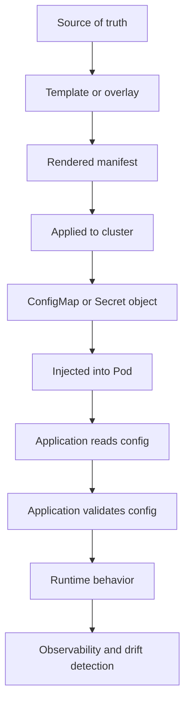

# Kubernetes Configuration

## 1. Core Mental Model

Configuration is how the same application image behaves differently across environments without rebuilding the image.

For containerized Java/JAX-RS services, the image should usually contain:

```text
Application binary
Runtime dependencies
Entrypoint
Default safe runtime behavior
```

The environment should provide:

```text
Database endpoint
Kafka/RabbitMQ endpoint
Redis endpoint
Feature flags
Timeout values
Pool sizes
Log level
External service URLs
Cloud integration settings
Non-secret operational parameters
Secret references
```

Kubernetes provides several ways to inject configuration:

```text
ConfigMap
Secret
Environment variables
Command-line arguments
Mounted files
Projected volumes
Downward API
Helm values
Kustomize overlays
External config systems
```

The important mental model:

```text
Container image should be portable.
Configuration should be environment-specific.
Secrets should be protected.
Runtime behavior should be explicit, validated, and observable.
```

A service that works only because of undocumented config in one namespace is not production-ready.

---

## 2. Why Kubernetes Configuration Exists

Without external configuration, every environment would need a different image:

```text
quote-service-dev:1.0.0
quote-service-qa:1.0.0
quote-service-prod:1.0.0
```

This breaks image promotion.

A better model:

```text
Same image digest
Different runtime configuration
Different environment binding
```

Example:

```text
Image digest: sha256:abc123...

Dev config:
- PostgreSQL dev endpoint
- Kafka dev bootstrap servers
- lower pool size
- debug logging

Prod config:
- PostgreSQL prod endpoint
- Kafka prod bootstrap servers
- production pool size
- structured logging
```

This lets the organization promote the same tested artifact through environments while changing only allowed configuration.

Configuration exists to separate:

- build-time concern,
- deploy-time concern,
- runtime concern,
- secret concern,
- environment concern.

Mixing these creates drift and debugging pain.

---

## 3. ConfigMap vs Secret

`ConfigMap` stores non-sensitive configuration.

Examples:

- service URL,
- feature toggle,
- timeout value,
- log level,
- connection pool size,
- Kafka topic name,
- Redis key prefix,
- Camunda worker setting,
- application mode.

`Secret` stores sensitive values.

Examples:

- database password,
- API token,
- private key,
- OAuth client secret,
- broker password,
- TLS key material,
- cloud credential only if workload identity is not available.

Important distinction:

```text
ConfigMap is not for secrets.
Kubernetes Secret is not automatically safe just because it is called Secret.
```

Kubernetes Secret values are base64-encoded by default. Base64 is encoding, not encryption.

Secret safety depends on:

- RBAC,
- encryption at rest,
- audit logging,
- external secret manager integration,
- exposure as env var or volume,
- log discipline,
- rotation process,
- least privilege access.

This part focuses on configuration generally. Secret management gets deeper treatment in the next part.

---

## 4. Configuration Lifecycle

Configuration has a lifecycle.



Each step can fail.

Common failure points:

- wrong environment values,
- missing key,
- typo in env var name,
- ConfigMap updated but pod not restarted,
- mounted file updated but app does not reload,
- Secret rotated but connection pool still uses old credential,
- Helm value overridden in unexpected layer,
- Kustomize overlay drifts from base,
- app silently falls back to unsafe default,
- config exists in cluster but not in Git.

Senior review should trace config from source of truth to actual process runtime.

---

## 5. ConfigMap Anatomy

Example ConfigMap:

```yaml
apiVersion: v1
kind: ConfigMap
metadata:
  name: quote-service-config
  namespace: quote-order
data:
  LOG_LEVEL: "INFO"
  HTTP_CLIENT_TIMEOUT_MS: "3000"
  POSTGRES_HOST: "postgres.quote-order.svc.cluster.local"
  POSTGRES_PORT: "5432"
  KAFKA_BOOTSTRAP_SERVERS: "kafka-bootstrap.kafka.svc.cluster.local:9092"
  REDIS_HOST: "redis.quote-order.svc.cluster.local"
  QUOTE_MAX_BATCH_SIZE: "100"
```

ConfigMap values are strings. Applications must parse them intentionally.

Bad assumption:

```text
Kubernetes validates business config types.
```

Reality:

```text
Kubernetes stores key-value data.
Your application or admission/policy layer must validate semantics.
```

If `HTTP_CLIENT_TIMEOUT_MS` is set to `fast`, Kubernetes accepts it. Your application must reject it or fail safely.

---

## 6. Injecting Config as Environment Variables

Common pattern:

```yaml
envFrom:
  - configMapRef:
      name: quote-service-config
```

Or explicit keys:

```yaml
env:
  - name: HTTP_CLIENT_TIMEOUT_MS
    valueFrom:
      configMapKeyRef:
        name: quote-service-config
        key: HTTP_CLIENT_TIMEOUT_MS
```

Explicit keys are more verbose but safer for review.

Benefits of environment variables:

- simple,
- familiar for Java frameworks,
- visible in pod spec,
- easy to bind to application config,
- stable for process lifetime.

Risks:

- values do not update inside running process when ConfigMap changes,
- large env sets become hard to review,
- accidental secret exposure via env dump,
- typo can create missing/empty value,
- `envFrom` can hide which keys are actually used,
- config precedence may be unclear.

A key property:

```text
Environment variables are read at process start.
Updating ConfigMap does not update existing env vars in running containers.
```

So a ConfigMap change usually requires pod restart or rollout.

---

## 7. Injecting Config as Volume Files

ConfigMap can be mounted as files:

```yaml
volumes:
  - name: app-config
    configMap:
      name: quote-service-config
containers:
  - name: quote-service
    volumeMounts:
      - name: app-config
        mountPath: /etc/quote-service/config
        readOnly: true
```

Each key becomes a file:

```text
/etc/quote-service/config/LOG_LEVEL
/etc/quote-service/config/HTTP_CLIENT_TIMEOUT_MS
/etc/quote-service/config/POSTGRES_HOST
```

Benefits:

- supports file-based config,
- can update mounted files when ConfigMap changes,
- useful for structured config files,
- avoids huge env var list,
- works well with projected volume patterns.

Risks:

- app must know how to read files,
- update propagation is not instant,
- app may not reload automatically,
- subPath mounts do not receive updates the same way,
- file permissions and path conventions matter,
- partial reload can be unsafe.

Mounted config update does not equal application reload. The app must either watch files, periodically reload safely, or be restarted.

---

## 8. Environment Variable vs Volume Mount

| Dimension | Env Var | Volume Mount |
|---|---|---|
| Simplicity | High | Medium |
| Runtime update | No, requires restart | File may update, app must reload |
| Reviewability | Good if explicit, weaker with `envFrom` | Good for structured config |
| Secret exposure risk | Higher via env dumps | Lower but still sensitive |
| Framework compatibility | Usually high | Depends on app |
| Large config | Poor | Better |
| Dynamic config | Poor | Possible but needs design |

Practical guideline:

- Use env vars for small stable operational parameters.
- Use mounted files for structured config.
- Use external config systems for dynamic config if required.
- Use Secret carefully for sensitive values.
- Do not pretend ConfigMap gives dynamic config reload automatically.

---

## 9. Projected Volumes

Projected volume combines multiple sources into one mount.

Example sources:

- ConfigMap,
- Secret,
- Downward API,
- ServiceAccount token.

Conceptual example:

```yaml
volumes:
  - name: projected-app-context
    projected:
      sources:
        - configMap:
            name: quote-service-config
        - downwardAPI:
            items:
              - path: pod-name
                fieldRef:
                  fieldPath: metadata.name
              - path: namespace
                fieldRef:
                  fieldPath: metadata.namespace
```

This can be useful when the app or sidecar expects a directory of runtime context.

Review concern:

- avoid mixing secret and non-secret files carelessly,
- ensure file permissions are appropriate,
- ensure app does not log the whole directory,
- ensure token projection settings are intentional.

---

## 10. Downward API

Downward API exposes pod metadata and resource information to the container.

Examples:

```yaml
env:
  - name: POD_NAME
    valueFrom:
      fieldRef:
        fieldPath: metadata.name
  - name: POD_NAMESPACE
    valueFrom:
      fieldRef:
        fieldPath: metadata.namespace
  - name: POD_IP
    valueFrom:
      fieldRef:
        fieldPath: status.podIP
  - name: CPU_REQUEST
    valueFrom:
      resourceFieldRef:
        resource: requests.cpu
  - name: MEMORY_LIMIT
    valueFrom:
      resourceFieldRef:
        resource: limits.memory
```

Useful for:

- logging context,
- telemetry resource attributes,
- pod identity in diagnostics,
- application instance ID,
- resource-aware runtime settings.

Risks:

- app becomes tightly coupled to Kubernetes,
- metadata may be misused as business identity,
- pod IP is ephemeral,
- resource values may not match JVM settings unless intentionally wired.

For Java/JAX-RS, Downward API is often useful for observability metadata, not business logic.

---

## 11. Immutable ConfigMap and Secret

Kubernetes supports immutable ConfigMaps and Secrets.

Example:

```yaml
apiVersion: v1
kind: ConfigMap
metadata:
  name: quote-service-config-v1
immutable: true
data:
  LOG_LEVEL: "INFO"
```

Benefits:

- prevents accidental mutation,
- improves predictability,
- helps GitOps immutability model,
- avoids ambiguous runtime config updates,
- can reduce API server load for watched config.

Trade-off:

- changes require new object name or replacement workflow,
- rollout mechanism must be designed,
- stale references can remain,
- operational hotfix becomes less direct.

Immutable config is useful when you want configuration changes to behave like deployments, not silent runtime mutation.

---

## 12. Restart-on-Config-Change Pattern

If env vars are used, pod restart is required for config changes.

Common Helm pattern:

```yaml
spec:
  template:
    metadata:
      annotations:
        checksum/config: {{ include (print $.Template.BasePath "/configmap.yaml") . | sha256sum }}
```

When ConfigMap content changes, the pod template annotation changes. Deployment creates a new ReplicaSet and rolls pods.

Mental model:

```text
Config change
  -> pod template hash changes
  -> Deployment rollout
  -> new pods start with new config
```

Benefits:

- explicit rollout,
- rollbackable via Git/Helm,
- clear version history,
- avoids ambiguous partial reload.

Risks:

- config-only change still restarts pods,
- bad config can cause outage,
- rollout safety depends on probes,
- secret changes may need separate handling,
- if checksum misses a source, pods do not restart.

Internal verification checklist should include whether config changes trigger rollout.

---

## 13. Config Reload Patterns

There are several ways to handle config changes.

### 13.1 Restart-Based Reload

```text
Config changes
  -> Deployment rollout
  -> pods restart
  -> app reads new config at startup
```

Best for:

- most backend services,
- JVM applications,
- config that affects connection pools,
- DB/broker endpoint changes,
- security-sensitive changes,
- predictable operations.

### 13.2 File Watch Reload

```text
ConfigMap mounted as volume
  -> file update appears
  -> app watches file
  -> app reloads config
```

Best for:

- log level,
- routing table,
- low-risk tunables,
- config designed for hot reload.

Risks:

- partial reload bugs,
- inconsistent state across threads,
- no clear rollout history,
- reload success/failure must be observable,
- not all config is safe to reload.

### 13.3 Sidecar Reload

A sidecar watches config and triggers reload endpoint or process signal.

Risks:

- extra operational complexity,
- security exposure via reload endpoint,
- race conditions,
- app must implement safe reload.

### 13.4 External Dynamic Config

Examples:

- AWS AppConfig,
- Azure App Configuration,
- internal feature flag system,
- centralized config service.

Useful when config changes frequently and safely at runtime.

But dynamic config needs:

- validation,
- rollout strategy,
- audit trail,
- fallback behavior,
- caching,
- failure mode design,
- clear ownership.

Dynamic config is a production system, not a convenience toggle.

---

## 14. Config Precedence

Java applications often have multiple config sources.

Example precedence model:

```text
Command-line arguments
Environment variables
Mounted config files
Application config file inside image
Framework defaults
Code defaults
```

Actual precedence depends on the framework.

Possible sources:

- JVM system properties,
- environment variables,
- `application.properties`,
- `application.yaml`,
- MicroProfile Config,
- Quarkus config,
- Spring config,
- Jakarta EE server config,
- custom config loader,
- cloud SDK default configuration.

Production risk:

```text
The value you think is active is not the value the process actually uses.
```

Mitigation:

- document precedence,
- log sanitized effective config at startup,
- expose safe config diagnostics endpoint if allowed,
- fail fast on ambiguous or conflicting config,
- avoid multiple names for the same setting,
- use config schema validation.

Do not log secrets.

---

## 15. Safe Defaults and Fail-Fast Behavior

Not every config should have a default.

Safe default example:

```text
LOG_LEVEL=INFO
HTTP_CLIENT_TIMEOUT_MS=3000
FEATURE_X_ENABLED=false
```

Unsafe default example:

```text
POSTGRES_HOST=localhost
AUTH_ENABLED=false
TLS_VERIFY=false
KAFKA_BOOTSTRAP_SERVERS=localhost:9092
```

In production, missing critical config should usually fail startup.

Bad behavior:

```text
missing database URL -> fallback to localhost -> pod starts -> readiness true -> runtime failures
```

Better behavior:

```text
missing database URL -> startup validation fails -> pod not ready / crash with clear error
```

Config validation is part of correctness.

---

## 16. Configuration Validation

Application should validate configuration at startup.

Validation categories:

- required key exists,
- type is valid,
- numeric range is valid,
- enum value is valid,
- URL is parseable,
- timeout relationships make sense,
- pool sizes are within resource budget,
- feature combinations are allowed,
- secret references are present,
- environment name is recognized.

Example validation rules:

```text
HTTP_CLIENT_TIMEOUT_MS must be between 100 and 30000
DB_POOL_MAX_SIZE must be <= application worker threads
KAFKA_CONSUMER_CONCURRENCY must be >= 1
READINESS_DEPENDENCY_CHECK_ENABLED must be boolean
ENVIRONMENT must be one of dev, qa, staging, prod
```

Validation failure should produce:

- clear log message,
- sanitized values,
- no secret leakage,
- non-zero exit,
- alert if production rollout fails.

---

## 17. Environment-Specific Configuration

Enterprise deployments usually have multiple environments:

```text
dev
qa
test
staging
preprod
prod
```

Each environment may differ by:

- endpoints,
- replica count,
- resource request/limit,
- log level,
- feature flags,
- database pool size,
- Kafka topic names,
- ingress host,
- TLS certificate,
- cloud identity,
- network policy,
- secret source,
- autoscaling rules.

But differences should be intentional.

Bad environment management:

```text
prod has one-off values nobody can explain
staging does not match prod topology
qa disables auth
dev uses different code path
config is manually edited in cluster
```

Better environment management:

```text
common base
explicit overlays
reviewable diffs
Git as source of truth
promotion rules
policy checks
runtime drift detection
```

---

## 18. Helm Values and Configuration

Helm often manages config through `values.yaml`.

Example:

```yaml
config:
  logLevel: INFO
  httpClientTimeoutMs: 3000
  postgres:
    host: postgres.quote-order.svc.cluster.local
    port: 5432
  kafka:
    bootstrapServers: kafka-bootstrap.kafka.svc.cluster.local:9092
```

Review concerns:

- Which values are defaults?
- Which are environment overrides?
- Are secrets accidentally stored in values?
- Are values validated by schema?
- Does config change trigger rollout?
- Are generated names stable?
- Does chart support immutable config?
- Are values duplicated across services?

Helm values are not automatically governance. They are just input. Governance comes from structure, review, schema, policy, and ownership.

---

## 19. Kustomize Overlays and Configuration

Kustomize often manages environment-specific config through overlays.

Example structure:

```text
base/
  deployment.yaml
  service.yaml
  configmap.yaml
overlays/
  dev/
    kustomization.yaml
  staging/
    kustomization.yaml
  prod/
    kustomization.yaml
```

ConfigMap generator example:

```yaml
configMapGenerator:
  - name: quote-service-config
    literals:
      - LOG_LEVEL=INFO
      - HTTP_CLIENT_TIMEOUT_MS=3000
```

Review concerns:

- Does generated name change trigger rollout?
- Are overlays minimal?
- Are patches readable?
- Are environment differences intentional?
- Is there overlay sprawl?
- Are secrets handled outside plain Kustomize files?

Kustomize is powerful, but patch-heavy overlays can become hard to reason about.

---

## 20. Configuration Drift

Configuration drift happens when actual runtime config diverges from intended source of truth.

Examples:

- manual `kubectl edit configmap`,
- emergency hotfix not committed to Git,
- Helm release values differ from repository,
- Argo CD app out of sync,
- namespace has old Secret,
- pod uses old env var because not restarted,
- mounted config updated but app did not reload,
- staging and prod overlays diverge unexpectedly.

Drift is dangerous because debugging starts from false assumptions.

Mitigation:

- GitOps reconciliation,
- drift alerts,
- immutable config objects,
- no manual cluster edits except controlled break-glass,
- rollout annotations/checksums,
- config inventory,
- environment diff review,
- post-incident drift check.

---

## 21. Configuration and Java/JAX-RS

Java/JAX-RS service config commonly controls:

- HTTP port,
- management port,
- thread pool size,
- request timeout,
- DB pool size,
- Kafka consumer concurrency,
- RabbitMQ prefetch,
- Redis timeout,
- Camunda worker lock duration,
- JSON serialization behavior,
- auth settings,
- external service endpoints,
- retry policy,
- circuit breaker settings,
- log level,
- telemetry exporter endpoint.

These values are not harmless.

Example: DB pool size.

```text
replicas = 10
DB_POOL_MAX_SIZE = 30
maximum DB connections from service = 300
```

If PostgreSQL only allows 200 connections, a rollout or scale-out can cause connection exhaustion.

Example: Kafka consumer concurrency.

```text
replicas = 8
consumer threads per pod = 8
total consumers = 64
partitions = 24
```

Many consumers will be idle or cause unnecessary rebalance overhead.

Configuration must be reviewed as system behavior, not simple key-value data.

---

## 22. Configuration Impact on PostgreSQL

PostgreSQL-related config often includes:

- host,
- port,
- database name,
- username,
- password/secret reference,
- SSL mode,
- pool min/max size,
- connection timeout,
- statement timeout,
- idle timeout,
- migration setting,
- read/write endpoint,
- schema name.

Failure modes:

- wrong host,
- wrong database,
- pool too large,
- missing SSL config,
- secret rotated but pool still uses old credential,
- statement timeout longer than ingress timeout,
- migration enabled unexpectedly in multiple pods,
- app connects to dev DB from staging/prod due misconfig.

Review connection config carefully. Database config mistakes can be catastrophic.

---

## 23. Configuration Impact on Kafka

Kafka-related config often includes:

- bootstrap servers,
- topic names,
- consumer group ID,
- client ID,
- security protocol,
- SASL mechanism,
- TLS truststore,
- auto offset reset,
- enable auto commit,
- max poll records,
- max poll interval,
- concurrency,
- retry/backoff,
- DLQ topic.

Failure modes:

- wrong topic,
- shared consumer group across environments,
- auto offset reset causes unexpected replay/skip,
- auto commit causes loss risk,
- max poll interval too short for processing,
- concurrency exceeds partition count,
- secret mismatch after rotation,
- TLS/SASL misconfigured.

Kafka config changes are behavioral changes. Treat them like code changes.

---

## 24. Configuration Impact on RabbitMQ

RabbitMQ-related config often includes:

- host,
- port,
- vhost,
- exchange,
- queue,
- routing key,
- username/password,
- TLS config,
- prefetch,
- manual ack setting,
- retry exchange,
- DLQ,
- connection recovery,
- consumer concurrency.

Failure modes:

- wrong vhost,
- wrong queue binding,
- prefetch too high for shutdown budget,
- auto ack causes message loss,
- DLQ missing,
- retry policy causes storm,
- connection recovery hides credential issue,
- TLS config mismatch.

Review RabbitMQ config with shutdown and retry semantics in mind.

---

## 25. Configuration Impact on Redis

Redis-related config often includes:

- host,
- port,
- password/secret,
- TLS,
- database index if used,
- key prefix,
- pool size,
- command timeout,
- lock TTL,
- cache TTL,
- cluster/sentinel mode,
- read replica setting.

Failure modes:

- shared key prefix across environments,
- TTL too long or too short,
- lock TTL exceeds business tolerance,
- pool too large,
- timeout too high causing request pile-up,
- wrong Redis DB index,
- TLS disabled incorrectly,
- cache stampede after config change.

Redis config often looks low-risk but can impact correctness and performance.

---

## 26. Configuration Impact on Camunda-like Workers

Worker config often includes:

- worker ID,
- topic name,
- lock duration,
- fetch interval,
- max tasks,
- retry count,
- backoff,
- endpoint URL,
- auth secret,
- completion timeout.

Failure modes:

- lock duration shorter than processing time,
- too many tasks fetched per pod,
- worker ID not unique where uniqueness matters,
- retry count too aggressive,
- wrong topic,
- completion after side effect uncertainty,
- worker fetch continues during shutdown.

Worker config must be aligned with graceful shutdown and idempotency.

---

## 27. Configuration Impact on NGINX/Ingress

Application config must align with ingress config.

Important relationships:

- app port vs Service targetPort,
- app base path vs ingress path rewrite,
- app TLS expectation vs ingress TLS termination,
- forwarded headers handling,
- request body size,
- proxy read timeout,
- keepalive behavior,
- CORS if applicable,
- health endpoint path,
- management endpoint exposure.

Failure modes:

- app listens on 8081 but service targets 8080,
- ingress rewrites path incorrectly,
- app generates wrong absolute URL behind proxy,
- health endpoint protected by auth,
- timeout mismatch causes 504,
- large request rejected by ingress but not app.

Config cannot be reviewed only at app layer. Edge config matters.

---

## 28. EKS/AKS/On-Prem/Hybrid Considerations

### EKS

Configuration may include:

- AWS region,
- IAM role via IRSA,
- AWS service endpoint override,
- Secrets Manager reference,
- SSM Parameter Store path,
- AppConfig application/environment/profile,
- VPC endpoint DNS behavior.

Verify cloud SDK config does not rely on static credentials if IRSA is expected.

### AKS

Configuration may include:

- Azure tenant ID,
- client ID for Workload Identity,
- Key Vault URI,
- Azure App Configuration endpoint,
- storage account endpoint,
- private endpoint DNS.

Verify workload identity and SDK credential resolution.

### On-Prem

Configuration may include:

- internal DNS names,
- internal CA trust,
- proxy settings,
- internal registry endpoints,
- local secret management,
- static network routes.

### Hybrid

Configuration may include:

- private DNS suffix,
- proxy/no_proxy,
- firewall-dependent endpoints,
- TLS truststore,
- regional endpoint selection,
- failover target.

Hybrid config mistakes often look like application timeout but are actually DNS, route, proxy, or TLS problems.

---

## 29. Debugging Configuration Issues

Start by proving what config the pod actually has.

Commands:

```bash
kubectl get configmap <name> -n <namespace> -o yaml
kubectl describe configmap <name> -n <namespace>
kubectl get secret <name> -n <namespace> -o yaml
kubectl describe pod <pod> -n <namespace>
kubectl exec <pod> -n <namespace> -- printenv
kubectl exec <pod> -n <namespace> -- ls -la /etc/<app>/config
kubectl exec <pod> -n <namespace> -- cat /etc/<app>/config/<key>
```

Be careful with secrets. Do not print secret values in shared terminals, logs, screenshots, or tickets.

Debug questions:

- Is the ConfigMap present?
- Is the key present?
- Is the pod referencing the right object?
- Did the pod restart after config change?
- Is the app reading env var or file?
- Is the framework overriding value from another source?
- Is the active pod from old ReplicaSet?
- Is GitOps in sync?
- Did Helm/Kustomize render what you expected?

For rendered manifests:

```bash
helm template ...
kustomize build ...
kubectl diff -f ...
```

Use internal approved workflows for production.

---

## 30. Common Failure Modes

### 30.1 ConfigMap Missing

Symptoms:

- pod stuck in `CreateContainerConfigError`,
- event says configmap not found.

Debug:

```bash
kubectl describe pod <pod> -n <namespace>
kubectl get configmap -n <namespace>
```

Likely causes:

- wrong namespace,
- GitOps sync order issue,
- name mismatch,
- Helm template value wrong,
- config object deleted manually.

---

### 30.2 Key Missing

Symptoms:

- container fails to start,
- app logs missing config key,
- pod CrashLoopBackOff,
- default value unexpectedly used.

Likely causes:

- typo in key,
- environment overlay missing value,
- `optional: true` hides missing config,
- app changed config key without manifest update.

---

### 30.3 Config Updated but App Still Uses Old Value

Symptoms:

- ConfigMap shows new value,
- pod behavior still old,
- no new ReplicaSet created.

Likely causes:

- env var injection requires restart,
- checksum annotation missing,
- GitOps applied ConfigMap only,
- app does not reload mounted file,
- pod from old rollout still running.

Debug:

```bash
kubectl get pod <pod> -o yaml
kubectl rollout history deployment/<deployment> -n <namespace>
```

---

### 30.4 Wrong Environment Endpoint

Symptoms:

- staging calls dev service,
- prod connects to wrong dependency,
- data inconsistency,
- unexpected auth failure.

Likely causes:

- copied values,
- overlay drift,
- DNS alias confusion,
- secret/config mismatch,
- manual hotfix not reverted.

This is a high-severity configuration class because it can cross environment boundaries.

---

### 30.5 Unsafe Default Used

Symptoms:

- app starts even with missing config,
- unexpected localhost connection,
- auth disabled,
- TLS verification disabled,
- debug mode active.

Likely causes:

- code default intended for local dev leaks into production,
- missing validation,
- ambiguous profile selection,
- environment variable typo.

Fix:

- fail fast for production-critical config,
- separate local defaults from production runtime,
- validate environment profile.

---

### 30.6 Secret Rotation Breaks Config

Symptoms:

- app starts failing authentication,
- existing pods work but new pods fail,
- connection pool errors after rotation,
- only some replicas affected.

Likely causes:

- secret updated without coordinated rollout,
- old and new credentials not both valid during transition,
- mounted secret updated but pool not reloaded,
- external secret sync delay,
- wrong secret version.

Secret rotation needs its own operational design.

---

## 31. Correctness Concerns

Configuration affects correctness when it changes behavior.

Examples:

- timeout changes alter retry outcome,
- feature flag changes business path,
- topic name changes event routing,
- DB endpoint changes data source,
- consumer group changes processing semantics,
- lock TTL changes concurrency behavior,
- ingress path changes API routing,
- TLS mode changes trust boundary.

Treat critical config changes as code changes:

- reviewed,
- tested,
- promoted,
- observable,
- rollbackable,
- auditable.

---

## 32. Networking Concerns

Many config values are network-dependent:

- hostnames,
- ports,
- protocols,
- proxy settings,
- TLS settings,
- DNS suffixes,
- private endpoint names,
- no_proxy lists,
- ingress base URLs,
- service discovery names.

Common issue:

```text
NO_PROXY missing .svc.cluster.local
```

Result:

- internal Kubernetes service traffic goes through corporate proxy,
- calls fail or become slow.

Another issue:

```text
Private endpoint DNS not resolved inside pod
```

Result:

- app times out calling cloud service,
- SDK error looks like connectivity failure,
- root cause is DNS config.

Configuration review must include network path assumptions.

---

## 33. Performance Concerns

Config values can create performance incidents:

- DB pool too large,
- HTTP timeout too long,
- retry count too high,
- Kafka max poll records too high,
- RabbitMQ prefetch too high,
- Redis timeout too long,
- thread pool too large for CPU limit,
- log level set to DEBUG in production,
- metrics cardinality increased,
- tracing sample rate too high.

Configuration is one of the fastest ways to create a production performance issue without changing code.

---

## 34. Security and Privacy Concerns

Configuration can weaken security:

- auth disabled,
- TLS verification disabled,
- debug endpoint enabled,
- management port exposed,
- secret placed in ConfigMap,
- secret exposed via env var logs,
- CORS too permissive,
- allowed origins set to `*`,
- audit logging disabled,
- PII logging enabled.

Review security-sensitive config separately from ordinary tuning config.

---

## 35. Cost Concerns

Configuration can increase cost:

- high replica count,
- oversized DB pool causing larger DB tier,
- DEBUG logs increasing log storage,
- high metrics/traces cardinality,
- aggressive polling interval,
- excessive retry causing downstream load,
- too many consumers,
- large cache TTL causing memory pressure,
- low cache TTL causing DB load.

Cost-aware engineering includes config review.

---

## 36. Internal Verification Checklist

Verify these in the actual CSG/team environment.

### Source of Truth

- Where is configuration defined?
- GitOps repo?
- Helm values?
- Kustomize overlays?
- Terraform?
- External config service?
- Manual cluster object?
- Is Git the source of truth?
- Are manual edits allowed?

### ConfigMap Usage

- Which ConfigMaps are used by the service?
- Are keys explicit or via `envFrom`?
- Are ConfigMaps immutable?
- Does config change trigger rollout?
- Are defaults documented?
- Are values environment-specific?
- Are ConfigMaps generated by Helm/Kustomize?

### Secret Boundary

- Are any secrets stored in ConfigMap?
- Are sensitive values injected as env vars?
- Are secrets mounted as files?
- Is external secret management used?
- Is encryption at rest enabled?
- Is secret access restricted by RBAC?
- Is rotation documented?

### Application Behavior

- Does the app validate config at startup?
- Does it log sanitized effective config?
- Does it fail fast on missing critical values?
- Does it silently use local defaults?
- Does it support runtime reload?
- If yes, is reload safe and observable?

### Java/JAX-RS Runtime

- How are env vars mapped to Java config?
- Are JVM options configured separately?
- Are HTTP and management ports configurable?
- Are thread pools configurable?
- Are request timeouts configurable?
- Are DB/broker/client pools configurable?

### Dependency Config

- PostgreSQL host/pool/SSL/timeout?
- Kafka bootstrap/topic/group/security/commit behavior?
- RabbitMQ queue/exchange/prefetch/ack/DLQ?
- Redis TTL/pool/timeout/key prefix?
- Camunda worker lock/fetch/retry config?
- NGINX/ingress path/timeout/body size/header config?

### Environment and Drift

- Are dev/staging/prod overlays clearly different?
- Are differences intentional?
- Are rendered manifests reviewed?
- Is Argo CD/Flux detecting drift?
- Are emergency config changes committed back?
- Is config diff part of PR review?

### Observability

- Can config version be linked to pod version?
- Are config changes visible in deployment timeline?
- Are config-related startup failures alerted?
- Are unsafe defaults detectable?
- Are dependency endpoint values visible in sanitized diagnostics?

---

## 37. PR Review Checklist

When reviewing config changes, ask:

- Is this value non-secret or secret?
- Is the source of truth clear?
- Is the environment scope correct?
- Does this change require pod restart?
- Will restart happen automatically?
- Is the app validating this config?
- Is there a safe default?
- Should missing value fail startup?
- Does this affect traffic, timeout, retry, pool, or security behavior?
- Does this affect PostgreSQL/Kafka/RabbitMQ/Redis/Camunda/NGINX?
- Does this affect cloud identity or private endpoint routing?
- Is the config value observable without leaking secrets?
- Is rollback straightforward?
- Could this config cause cross-environment traffic?
- Could this config increase cost?
- Could this config disable a security control?

---

## 38. Key Takeaways

- Configuration is runtime behavior, not harmless metadata.
- ConfigMap is for non-secret values; Secret requires additional security controls.
- Env var config is simple but requires restart to change.
- Mounted config files may update, but the app must reload safely.
- Config changes should be validated, reviewed, promoted, observable, and rollbackable.
- Critical config should fail fast when missing or invalid.
- Java/JAX-RS config affects thread pools, timeouts, DB pools, broker behavior, retries, and observability.
- PostgreSQL, Kafka, RabbitMQ, Redis, Camunda, and NGINX config changes can alter correctness, performance, and security.
- GitOps/IaC reduces drift only if manual changes are controlled.
- A senior engineer reviews config as part of architecture, not as a text file.

