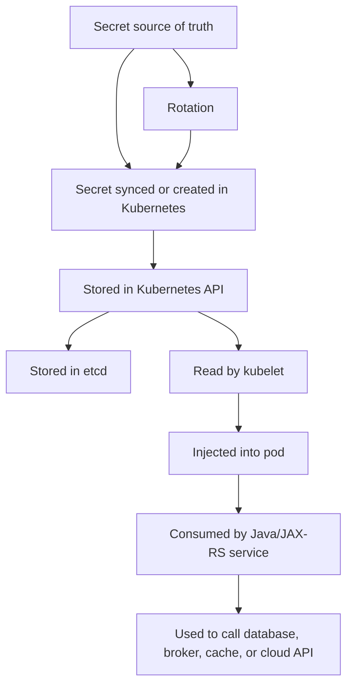
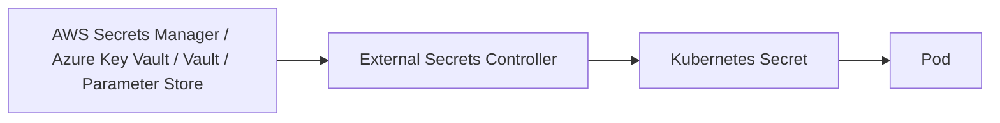
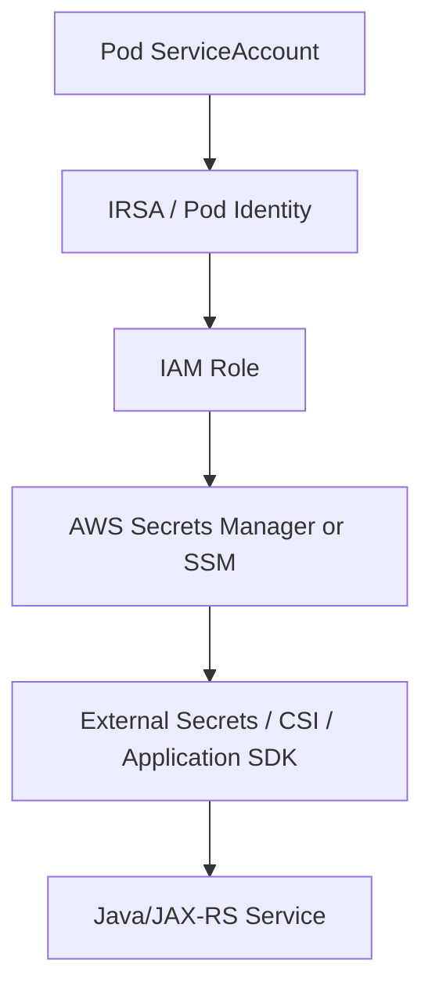
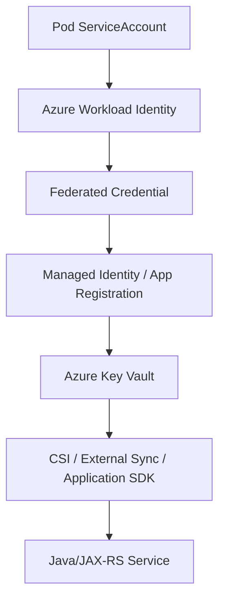

# Secret Management

## 1. Core Mental Model

A secret is not just configuration with a different name.

A secret is any value that can give access, authority, identity, or sensitive capability if exposed.

Examples:

```text
Database password
Kafka SASL password
RabbitMQ password
Redis password
JWT signing key
TLS private key
OAuth client secret
API token
Cloud access key
Webhook signing secret
Encryption key
License key
Private endpoint credential
```

For enterprise Java/JAX-RS systems, secret management is about controlling the full lifecycle:

```text
Source of truth
Storage
Encryption
Access control
Delivery to workload
Runtime consumption
Rotation
Reload/restart
Revocation
Audit
Leakage prevention
Incident response
```

The core rule:

```text
A secret is only as secure as the weakest place it appears.
```

If a secret is stored safely in AWS Secrets Manager but then copied into Git, printed in logs, exposed through `/env`, passed in a command line, or made readable by every pod in a namespace, the secret strategy has failed.

In Kubernetes, a Secret object is a delivery mechanism. It is not automatically a complete enterprise secret management system.

---

## 2. Why Secret Management Exists

Without a disciplined secret model, teams usually drift into unsafe patterns:

```text
Password in application.properties
Token in Helm values committed to Git
Private key copied into ConfigMap
Credential exposed as environment variable and dumped in logs
Shared database credential across many services
Long-lived cloud access key mounted into pods
Manual secret update with no audit trail
No rotation plan
No ownership
```

These patterns create hard-to-detect production risks:

- credential leakage,
- lateral movement between services,
- failed rotation,
- inconsistent environment state,
- outage during credential change,
- audit and compliance gaps,
- inability to revoke one workload independently,
- excessive privilege for Java services,
- hidden dependency on one manually patched namespace.

Secret management exists to make sensitive values:

```text
Centralized enough to govern
Scoped enough to limit blast radius
Auditable enough to investigate
Rotatable enough to recover
Invisible enough to avoid accidental leakage
Available enough to prevent startup failures
```

---

## 3. Secret vs ConfigMap

A `ConfigMap` is for non-sensitive configuration.

A `Secret` is for sensitive data.

Wrong:

```yaml
apiVersion: v1
kind: ConfigMap
metadata:
  name: quote-service-config
data:
  DB_PASSWORD: "super-secret-password"
```

Better:

```yaml
apiVersion: v1
kind: Secret
metadata:
  name: quote-service-db-secret
type: Opaque
stringData:
  DB_PASSWORD: "replace-me-through-secure-delivery"
```

But do not misread this.

A Kubernetes Secret is not secure simply because it is called `Secret`.

The real security comes from:

```text
RBAC
Encryption at rest
Restricted namespace access
External source of truth
Secret rotation
Admission policy
No Git plaintext exposure
No log exposure
No excessive mount scope
No broad service account access
```

A good review question:

```text
If this secret leaks, who can use it, what can they access, how fast can we revoke it, and how would we know?
```

---

## 4. The Base64 Misconception

Kubernetes Secret `data` values are base64-encoded.

Base64 is encoding, not encryption.

Example:

```yaml
apiVersion: v1
kind: Secret
metadata:
  name: example-secret
type: Opaque
data:
  password: cGFzc3dvcmQxMjM=
```

This value is trivially decoded:

```bash
echo 'cGFzc3dvcmQxMjM=' | base64 --decode
```

Output:

```text
password123
```

The useful property of base64 is that it can safely represent binary data in YAML/JSON. It is not a confidentiality boundary.

For authoring secrets, Kubernetes also supports `stringData`:

```yaml
apiVersion: v1
kind: Secret
metadata:
  name: quote-service-secret
type: Opaque
stringData:
  DB_USERNAME: quote_app
  DB_PASSWORD: do-not-commit-real-value
```

`stringData` is convenient for examples and generated manifests, but plaintext secret values still must not be committed to Git unless protected by a secure encryption workflow such as Sealed Secrets or another approved mechanism.

---

## 5. Kubernetes Secret Object Lifecycle

A simplified lifecycle:



Important boundaries:

```text
Source of truth may be external.
Kubernetes API exposes Secret objects to authorized identities.
etcd stores the object data.
kubelet delivers the secret to the node/pod.
The application reads the secret through env var or file.
The secret may enter logs, heap dumps, metrics, traces, command lines, or error messages if the application is careless.
```

A secret review must inspect the full path, not only the YAML.

---

## 6. Secret Delivery Methods

Kubernetes commonly delivers secrets in two ways:

```text
Environment variables
Mounted files through volumes
```

### 6.1 Secret as Environment Variable

Example:

```yaml
env:
  - name: DB_PASSWORD
    valueFrom:
      secretKeyRef:
        name: quote-service-db-secret
        key: password
```

Advantages:

- simple,
- common in Java frameworks,
- works well with configuration libraries,
- easy to map to `System.getenv()`.

Risks:

- environment variables may be exposed through debug endpoints,
- crash reports or diagnostic dumps may include them,
- application logs may accidentally print the environment,
- updates do not automatically change the running process environment,
- secrets may be visible to processes with sufficient node/process access.

For Java/JAX-RS services, environment variable delivery is often acceptable when:

```text
The pod is non-root.
Debug endpoints do not expose env.
Logging sanitizes config dumps.
Secret rotation uses pod restart or controlled rollout.
ServiceAccount and RBAC are scoped.
```

### 6.2 Secret as Mounted File

Example:

```yaml
volumes:
  - name: db-secret
    secret:
      secretName: quote-service-db-secret

containers:
  - name: quote-service
    volumeMounts:
      - name: db-secret
        mountPath: /var/run/secrets/quote-db
        readOnly: true
```

The container can read:

```text
/var/run/secrets/quote-db/username
/var/run/secrets/quote-db/password
```

Advantages:

- good for certificates and private keys,
- supports file-based reload patterns,
- avoids exposing secret as environment variable,
- can support projected volumes.

Risks:

- application must know file path,
- file permissions must be reviewed,
- secret may still be copied to logs or dumps,
- reload behavior depends on application design,
- not every Java library expects credential files.

For TLS private keys, truststores, keystores, and certificates, mounted files are usually more natural than environment variables.

---

## 7. Secret Update and Runtime Reload

A running Java process does not magically re-read every secret.

There are three common patterns.

### Pattern 1: Restart on Secret Change

```text
Secret changes
Deployment template annotation changes
ReplicaSet rolls out
New pod reads new secret
Old pod terminates gracefully
```

This is simple and predictable.

It works well for:

- database passwords,
- broker passwords,
- API tokens,
- application-level credentials.

Risk:

```text
If rollout fails, the new credential may not become active.
If old credential is revoked too early, old pods may fail.
```

### Pattern 2: Runtime File Reload

```text
Secret mounted as file
Kubelet updates mounted content
Application watches file or reloads periodically
Connection pool refreshes credential
```

This can work for TLS certificates and selected clients.

Risk:

```text
Many Java clients do not reload credentials automatically.
A file changed on disk does not mean existing DB/Kafka/RabbitMQ connections refresh.
```

### Pattern 3: External Secret Fetch at Runtime

```text
Application starts
Application uses workload identity
Application calls AWS Secrets Manager or Azure Key Vault
Application caches secret
Application refreshes secret on interval or signal
```

Advantages:

- secret may never be stored as Kubernetes Secret,
- central audit in cloud secret manager,
- dynamic refresh can be implemented.

Risks:

- application startup depends on cloud service availability,
- retry and timeout design becomes critical,
- identity misconfiguration can break startup,
- high call volume can create cost/rate-limit issues,
- application now owns more secret lifecycle logic.

For most enterprise services, a platform-managed sync or CSI pattern is often preferable to each Java service implementing custom secret retrieval logic.

---

## 8. External Secrets Operator Awareness

External Secrets Operator style pattern:



The application sees a normal Kubernetes Secret, but the source of truth is external.

Example conceptual object:

```yaml
apiVersion: external-secrets.io/v1beta1
kind: ExternalSecret
metadata:
  name: quote-service-db-secret
spec:
  refreshInterval: 1h
  secretStoreRef:
    name: platform-secret-store
    kind: ClusterSecretStore
  target:
    name: quote-service-db-secret
  data:
    - secretKey: password
      remoteRef:
        key: /prod/quote-service/db
        property: password
```

Benefits:

- central secret source,
- Kubernetes-native consumption,
- rotation can be platform-managed,
- better audit at source,
- avoids committing plaintext secret to Git.

Review concerns:

```text
Who can edit ExternalSecret?
Who can read generated Kubernetes Secret?
Who owns SecretStore / ClusterSecretStore?
How often is refresh performed?
What happens when external provider is unavailable?
Are remote keys environment-scoped?
Can one namespace reference secrets from another environment?
```

---

## 9. Sealed Secrets Awareness

Sealed Secrets pattern:


Benefits:

- encrypted secret can be stored in Git,
- GitOps-friendly,
- no plaintext secret in repository,
- cluster private key controls decryption.

Risks:

```text
Cluster private key backup becomes critical.
Resealing may be needed after key rotation.
Scope rules must be understood.
A SealedSecret still creates a normal Kubernetes Secret in the cluster.
```

Use Sealed Secrets only if it is an approved internal pattern. Some organizations prefer External Secrets with cloud secret managers instead.

---

## 10. Secret Store CSI Driver Awareness

CSI driver pattern:

```text
External secret manager
Secret Store CSI driver
Mounted secret file in pod
Optional sync to Kubernetes Secret
```

This is common for cloud integrations:

```text
AWS Secrets Manager CSI Driver awareness
Azure Key Vault CSI Driver awareness
HashiCorp Vault CSI awareness
```

Advantages:

- secret can be mounted directly from external provider,
- useful for certificates and keys,
- can avoid permanent Kubernetes Secret object depending on configuration.

Review concerns:

```text
Is sync-to-Kubernetes-Secret enabled?
What identity does the pod use?
What file path is mounted?
Does application reload the file?
How is rotation handled?
What happens when provider is unavailable?
Are mount permissions safe?
```

---

## 11. AWS Secret Management Options

Common AWS sources:

```text
AWS Secrets Manager
AWS Systems Manager Parameter Store
AWS AppConfig for non-secret dynamic configuration
EKS IRSA / Pod Identity for secretless access
KMS for encryption
```

Typical EKS pattern:



Review questions:

```text
Does the pod use IRSA or another approved identity model?
Is access scoped to only required secret paths?
Are secrets environment-scoped?
Is KMS key access restricted?
Is CloudTrail/audit enabled?
Are secret reads observable?
Is there a rotation window?
Does rotation coordinate with DB/broker credential updates?
```

Avoid long-lived AWS access keys inside Kubernetes Secrets when workload identity is available.

---

## 12. Azure Secret Management Options

Common Azure sources:

```text
Azure Key Vault
Azure App Configuration for non-secret configuration
Azure Workload Identity
Managed Identity
Key Vault CSI Driver
Azure RBAC / access policies
```

Typical AKS pattern:



Review questions:

```text
Does the pod use Azure Workload Identity or legacy pod identity?
Is Key Vault access scoped to required secret names only?
Are private endpoints and private DNS required?
Is Azure RBAC or access policy used?
Are secret gets audited?
Does rotation require pod restart?
Are certificates handled differently from passwords?
```

---

## 13. Secret Naming and Scoping

Secret naming should expose purpose, not value.

Good examples:

```text
quote-service-db-credentials
quote-service-kafka-sasl
quote-service-rabbitmq-credentials
quote-service-redis-auth
quote-service-jwt-signing-key
quote-service-external-api-token
```

Poor examples:

```text
password
prod-secret
all-secrets
shared-secret
admin-credentials
```

Scoping rules:

```text
One service should not read every secret in a namespace.
One namespace should not automatically access another namespace's secrets.
One environment should not reference another environment's credentials.
Shared credentials should be treated as a risk requiring justification.
```

A secret should usually be scoped by:

```text
Application
Environment
Dependency
Purpose
Rotation owner
```

Example:

```text
prod/quote-service/postgresql/app-user
prod/quote-service/kafka/sasl
prod/quote-service/redis/auth
prod/quote-service/external-tax-api/token
```

Exact naming depends on internal platform standards and must be verified.

---

## 14. Java/JAX-RS Runtime Implications

A Java/JAX-RS service usually consumes secrets through:

```text
Environment variable
System property
Configuration file
Mounted certificate/key file
Cloud SDK credential provider chain
Framework-specific configuration binding
```

Key risks:

### 14.1 Logging Secrets During Startup

Many services log their effective configuration at startup.

Bad:

```text
DB_PASSWORD=actual-password
JWT_SECRET=actual-secret
KAFKA_SASL_PASSWORD=actual-password
```

Better:

```text
DB_PASSWORD=******
JWT_SECRET=******
KAFKA_SASL_PASSWORD=******
```

The redaction logic must be tested.

### 14.2 Connection Pool Behavior

Database credentials are often loaded once when the connection pool starts.

If the secret changes:

```text
Existing connections may continue using old credential.
New connections may use old credential until pool is restarted.
The application may not notice the mounted secret changed.
```

Rotation needs choreography:

```text
Create new credential
Allow both old and new temporarily if possible
Update secret source
Roll pods
Verify new connections
Revoke old credential
Monitor errors
```

### 14.3 Kafka/RabbitMQ Client Credentials

Messaging clients may hold long-lived authenticated connections.

Secret rotation can cause:

```text
Consumer disconnect
Rebalance
Message redelivery
DLQ spike
Processing lag
Duplicate processing if idempotency is weak
```

The application must handle reconnect and idempotency.

### 14.4 TLS Material

Java often uses:

```text
JKS
PKCS12
PEM files
Truststore
Keystore
```

Review:

```text
Where is the truststore mounted?
Is the private key protected?
Does the service reload certificates?
Does HTTP client use the mounted trust material?
Does Kafka/RabbitMQ client use the correct truststore?
```

---

## 15. PostgreSQL, Kafka, RabbitMQ, Redis, Camunda, and NGINX Implications

### PostgreSQL

Secrets may include:

```text
Username
Password
TLS client certificate
CA certificate
Connection URL
```

Concerns:

```text
Pool restart during rotation
Credential scope per service
Read/write privilege boundary
Migration user vs runtime user
Secret in JDBC URL logs
```

### Kafka

Secrets may include:

```text
SASL username/password
mTLS certificate
Truststore password
Keystore password
Schema registry token
```

Concerns:

```text
Consumer reconnect
Rebalance
Lag during rotation
Credential scope per topic/group
Secret exposure in client config logs
```

### RabbitMQ

Secrets may include:

```text
AMQP username/password
TLS certificate
Management API token
```

Concerns:

```text
Connection recovery
Consumer ack behavior
Redelivery on shutdown
Credential privilege per vhost/queue/exchange
```

### Redis

Secrets may include:

```text
AUTH password
TLS material
Sentinel credentials
Cluster credentials
```

Concerns:

```text
Connection reconnect storm
Cache outage impact
Fail-open vs fail-closed behavior
```

### Camunda-like Workloads

Secrets may include:

```text
Database credentials
Worker API credentials
External task credentials
OAuth client secrets
```

Concerns:

```text
Long-running process execution
Worker reconnect
Transaction consistency
Secret rotation during job execution
```

### NGINX / Ingress

Secrets may include:

```text
TLS certificate
TLS private key
Basic auth credentials
Upstream mTLS material
```

Concerns:

```text
Certificate expiry
Secret reload by ingress controller
TLS chain correctness
Private key exposure
```

---

## 16. Rotation Strategy

A robust rotation strategy answers:

```text
What is being rotated?
Who owns the rotation?
Can old and new credentials overlap?
Does the application need restart?
How is successful adoption verified?
How is old credential revoked?
How is failure rolled back?
What alert catches broken rotation?
```

A safe generic sequence:

```text
1. Create or enable new credential.
2. Grant equivalent least-privilege access.
3. Update secret source of truth.
4. Sync to Kubernetes or mount to pods.
5. Roll application pods if needed.
6. Verify new pods authenticate successfully.
7. Monitor dependency errors and latency.
8. Revoke old credential.
9. Verify old credential no longer works.
10. Record evidence/audit.
```

Do not revoke the old credential before verifying that all active pods use the new credential unless the incident requires emergency revocation.

Emergency rotation is different:

```text
Contain exposure
Revoke compromised credential
Deploy replacement
Accept controlled service disruption if necessary
Investigate blast radius
Rotate adjacent secrets if needed
```

---

## 17. Failure Modes

### 17.1 Secret Missing

Symptoms:

```text
CreateContainerConfigError
Pod does not start
Event says secret not found
```

Likely causes:

```text
Secret not created in namespace
Wrong secret name
Wrong GitOps sync order
External secret controller failed
Namespace mismatch
```

Debug:

```bash
kubectl describe pod <pod> -n <namespace>
kubectl get secret <secret-name> -n <namespace>
kubectl get events -n <namespace> --sort-by=.lastTimestamp
```

### 17.2 Secret Key Missing

Symptoms:

```text
Pod fails to start
Environment variable source key not found
Volume file missing
Application startup config error
```

Likely causes:

```text
Wrong key name
External provider property mismatch
Helm values mismatch
Secret format changed
```

### 17.3 Wrong Secret Value

Symptoms:

```text
Authentication failed
JDBC login failure
Kafka SASL authentication failure
RabbitMQ ACCESS_REFUSED
Redis NOAUTH / invalid password
Cloud SDK access denied
```

Likely causes:

```text
Wrong environment value
Stale secret
Secret from wrong namespace/environment
Rotation incomplete
External sync delay
```

### 17.4 Secret Rotation Outage

Symptoms:

```text
Sudden auth failures
Connection pool failures
Consumer disconnects
Readiness failures
Error rate spike
```

Likely causes:

```text
Old credential revoked too early
Pods not restarted
Application does not reload secret
External secret failed to sync
Dependency and application credentials out of sync
```

### 17.5 Secret Leakage

Symptoms:

```text
Secret appears in logs
Secret appears in traces
Secret appears in metrics label
Secret appears in Git history
Secret appears in support bundle
Secret appears in crash dump
```

Immediate response:

```text
Treat as compromised.
Rotate the secret.
Remove exposure from current systems.
Preserve evidence.
Search for additional copies.
Review access logs.
Patch redaction and handling.
```

---

## 18. Detection and Debugging Workflow

Use this order during incident triage:

```text
1. Identify which dependency is failing.
2. Check pod events for missing secret/config errors.
3. Check application logs for sanitized authentication error.
4. Verify secret object exists in the correct namespace.
5. Verify expected key names exist.
6. Verify ExternalSecret/CSI/SealedSecret controller status if used.
7. Verify workload identity if secret source is cloud-based.
8. Verify dependency-side credential status.
9. Verify recent deployment or rotation changes.
10. Roll forward or roll back using approved runbook.
```

Useful commands:

```bash
kubectl describe pod <pod> -n <namespace>
kubectl get secret <secret> -n <namespace>
kubectl describe secret <secret> -n <namespace>
kubectl get externalsecret -n <namespace>
kubectl describe externalsecret <name> -n <namespace>
kubectl get events -n <namespace> --sort-by=.lastTimestamp
```

Be careful with:

```bash
kubectl get secret <secret> -o yaml
```

Even though values are base64, this still exposes secret material. Do not paste secret output into tickets, chat, logs, or documentation.

---

## 19. Observability Concerns

Secret handling needs observability without exposing secret values.

Good signals:

```text
Secret sync status
External secret controller errors
Application authentication failure count
Dependency connection failure count
Credential rotation timestamp
Certificate expiry days
TLS handshake failure count
Cloud secret manager access denied count
Cloud SDK credential resolution failure
```

Bad signals:

```text
Metric label containing token
Log line containing password
Trace attribute containing Authorization header
Dashboard showing secret value
Alert payload containing credential
```

For Java/JAX-RS services, sanitize:

```text
Authorization header
Cookie header
Set-Cookie header
DB URL password
Kafka SASL config
RabbitMQ URI
Redis URI
OAuth token
JWT value
API key query parameter
```

---

## 20. Security and Privacy Concerns

Secret management is tightly connected to privacy and compliance.

Concerns:

```text
Secret exposure in logs can become reportable incident.
PII encryption keys require strict access control.
Shared credentials obscure accountability.
Broad read access to Secret objects enables lateral movement.
Long-lived credentials increase compromise window.
Untracked manual secret edits break auditability.
```

Good controls:

```text
Least privilege ServiceAccount
Namespace-scoped secret access
Encryption at rest for Kubernetes secrets
External secret source with audit log
No plaintext secrets in Git
Secret scanning in repositories
Log redaction
Token/certificate expiry monitoring
Rotation runbook
Incident response procedure
```

---

## 21. Performance and Availability Concerns

Secret systems can affect availability.

Examples:

```text
Application calls cloud secret manager during startup.
Cloud secret manager has transient latency.
Pod startup blocks on secret retrieval.
Readiness stays false.
Deployment stalls.
HPA scales more pods, increasing secret calls.
Rate limit occurs.
```

Mitigation:

```text
Prefer platform-level sync for common static secrets.
Use caching for runtime secret retrieval.
Set explicit timeouts.
Handle retry with backoff.
Avoid secret fetch per request.
Avoid high-cardinality secret-related metrics.
Monitor secret provider rate limits.
```

Never fetch a secret from a remote provider on every HTTP request unless there is a very specific, reviewed reason.

---

## 22. Cost Concerns

Secret management can create cloud cost through:

```text
Frequent secret manager API calls
High refresh interval across many namespaces
Excessive runtime fetches
Private endpoint data path cost
Logging leaked secrets that require retention cleanup
Incident remediation and emergency rotation effort
```

Cost-aware practices:

```text
Use reasonable refresh intervals.
Cache secrets where appropriate.
Avoid per-request secret reads.
Centralize common rotation workflows.
Monitor API call volume.
Use labels/tags for ownership.
```

---

## 23. EKS, AKS, On-Prem, and Hybrid Considerations

### EKS

Verify:

```text
IRSA or Pod Identity usage
AWS Secrets Manager vs SSM Parameter Store
KMS key policy
CloudTrail audit
Secrets Store CSI driver usage
External Secrets Operator usage
VPC endpoint for Secrets Manager/SSM if private cluster
ECR pull credentials if relevant
```

### AKS

Verify:

```text
Azure Workload Identity
Managed Identity binding
Azure Key Vault access model
Key Vault CSI driver
Azure RBAC/access policy
Private Endpoint and Private DNS Zone
Azure Monitor/Audit logs
```

### On-Prem

Verify:

```text
Secret source of truth
Vault or equivalent secret manager
Kubernetes secret encryption at rest
Backup/restore handling for encrypted secrets
Air-gapped secret delivery
Certificate authority process
Manual rotation risk
```

### Hybrid

Verify:

```text
Cloud secret manager reachability from on-prem cluster
Private DNS behavior
Firewall/proxy egress
TLS trust chain
Latency impact during startup
Disaster recovery behavior
```

---

## 24. Correctness Concerns

A secret change is a state transition.

Correctness questions:

```text
Can old and new credentials overlap?
Can a partially rolled deployment process traffic safely?
Are consumers idempotent if rotation causes reconnect and redelivery?
Can migration jobs use separate credentials from runtime service?
Can rollback use the old credential?
Does config validation catch missing secret before accepting traffic?
```

For mission-critical systems, credential rotation should be treated like a deployment with its own rollout, monitoring, rollback, and evidence.

---

## 25. PR Review Checklist

When reviewing a PR that touches secrets, ask:

```text
Is any plaintext secret added to Git?
Is a ConfigMap incorrectly used for sensitive data?
Is the secret scoped to the service and environment?
Is access least-privilege?
Is the secret delivered through approved mechanism?
Does the pod need restart on secret change?
Is rotation behavior documented?
Are logs/traces/metrics sanitized?
Does the secret appear in command-line args?
Does the secret appear in a URL that may be logged?
Is cloud identity used instead of static cloud keys where possible?
Does the PR change RBAC access to Secret objects?
Does the PR change ExternalSecret/SecretStore/KeyVault/SecretsManager mapping?
Is there a rollback plan?
Is there an alert for auth failure after rollout?
```

Reject the PR if it introduces secret exposure, excessive privilege, or unreviewed manual secret handling.

---

## 26. Internal Verification Checklist

For the CSG/team context, verify rather than assume:

```text
Which secret management pattern is approved?
Are Kubernetes Secrets encrypted at rest?
Is External Secrets Operator used?
Is Sealed Secrets used?
Is Secrets Store CSI Driver used?
Are AWS Secrets Manager, SSM Parameter Store, Azure Key Vault, or Vault used?
How are secrets promoted across environments?
Who can read Secret objects in each namespace?
Who can edit ExternalSecret or SecretStore objects?
How are database credentials rotated?
How are Kafka/RabbitMQ/Redis credentials rotated?
How are TLS certificates rotated?
How are JWT signing keys rotated?
Are secret values scanned in Git repositories?
Are logs scanned for leaked secrets?
Are heap dumps/support bundles controlled?
What is the emergency rotation procedure?
What evidence is required for compliance/audit?
```

Also inspect:

```text
Dockerfile
Maven build
Application config binding
Helm chart
Kustomize overlays
Kubernetes Secret manifests
ExternalSecret manifests
ServiceAccount
RBAC
GitOps repository
CI/CD secret injection
Cloud IAM/RBAC
Cloud secret manager policy
Observability dashboards
Alerting rules
Incident notes
```

---

## 27. Senior Engineer Summary

A senior backend engineer should treat secrets as production-critical state.

The key mental model:

```text
Secret management is not only about storing passwords.
It is about controlling authority safely across build, deploy, runtime, rotation, audit, and incident response.
```

For Java/JAX-RS services on Kubernetes, the most important habits are:

```text
Do not commit plaintext secrets.
Do not log secrets.
Do not over-grant secret read access.
Do not use static cloud keys when workload identity exists.
Do not assume Kubernetes Secret means encrypted and safe.
Do not rotate credentials without understanding connection lifecycle.
Do not ignore mounted-file reload behavior.
Do not debug by pasting secret YAML into chat or tickets.
```

A production-ready secret strategy is boring, auditable, least-privilege, rotatable, and observable without revealing the secret itself.
