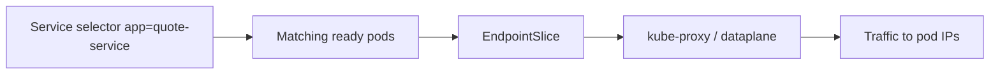
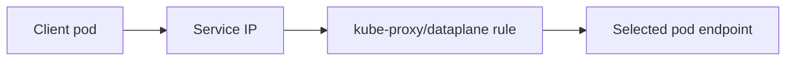
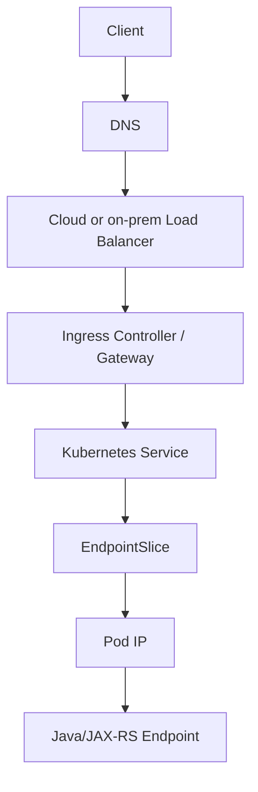

# Kubernetes Networking Foundation

## 1. Core Mental Model

Kubernetes networking is the abstraction that lets dynamic workloads communicate even though pods are constantly created, destroyed, rescheduled, and replaced.

A Java/JAX-RS service does not run on a stable machine with a stable IP.

It runs in pods:

```text
Pod starts
Pod receives an IP
Pod becomes ready
Service routes traffic to the pod
Pod may die
New pod appears with a different IP
Service keeps a stable endpoint for clients
```

The key Kubernetes networking idea:

```text
Pods are ephemeral.
Services are stable.
DNS gives names to services.
EndpointSlice connects Services to ready pods.
CNI provides pod networking.
kube-proxy or equivalent dataplane implements service routing.
Ingress/Gateway/LoadBalancer exposes selected services externally.
NetworkPolicy controls allowed traffic where supported.
```

Do not think of Kubernetes networking as one component.

Think of it as layers:

```text
Container network namespace
Pod IP
Node network
CNI plugin
Service virtual IP
EndpointSlice
kube-proxy / dataplane
DNS / CoreDNS
Ingress / Gateway / LoadBalancer
NetworkPolicy
Cloud or on-prem network
Application-level timeout, TLS, retry, and headers
```

---

## 2. Why Kubernetes Networking Exists

Without Kubernetes networking abstractions, every client would need to know the current IP of every pod.

That is impossible in a dynamic orchestrator.

Example pod lifecycle:

```text
quote-service pod A: 10.244.1.12
quote-service pod B: 10.244.2.19
quote-service pod A dies
quote-service pod C: 10.244.3.41
```

Clients should not need to know this.

Instead, clients call:

```text
http://quote-service.quote.svc.cluster.local:8080
```

Kubernetes maps this stable name to the current ready pod endpoints.

Networking exists to provide:

```text
Stable discovery
Load distribution
Pod-to-pod communication
Service abstraction
External exposure
Traffic policy
Security boundaries
Cloud/on-prem integration
Debuggable routing model
```

---

## 3. Kubernetes Networking Requirements

The classic Kubernetes networking model expects:

```text
Every pod can communicate with every other pod without NAT.
Every node can communicate with every pod without NAT.
The IP that a pod sees for itself is the same IP other pods use to reach it.
```

In practice, the exact implementation depends on the CNI plugin and environment:

```text
AWS VPC CNI
Azure CNI
Calico
Cilium
Flannel
Weave Net
Antrea
Other platform-specific CNI
```

The model is stable, but implementation details differ.

That difference matters during debugging.

For example:

```text
EKS with AWS VPC CNI may assign pod IPs from VPC subnets.
AKS with Azure CNI may assign pod IPs from VNet space.
Overlay CNIs may use an encapsulated pod network.
eBPF-based CNIs may replace or bypass traditional kube-proxy behavior.
```

Never assume the dataplane. Verify it.

---

## 4. Pod Network

Each pod gets its own network namespace.

Containers inside the same pod share the same network namespace.

That means containers in the same pod share:

```text
IP address
Port space
Loopback interface
Network interfaces
```

Example:

```text
Pod IP: 10.244.2.15
Container A listens on 8080
Container B can call localhost:8080
Another pod calls 10.244.2.15:8080
```

Important consequence:

```text
Two containers in the same pod cannot both bind the same port.
```

For Java/JAX-RS services, the typical pod has one main application container. Sidecars may exist for proxy, logging, security, or service mesh patterns, but should not be assumed.

Internal verification is required for whether sidecars exist in the CSG/team deployment model.

---

## 5. Pod IP

A pod IP is assigned when the pod is scheduled and networked.

The pod IP is:

```text
Ephemeral
Not suitable as a stable dependency endpoint
Tied to pod lifecycle
Used behind Services and EndpointSlices
```

Bad pattern:

```text
Service A calls Service B by pod IP.
```

Better pattern:

```text
Service A calls Service B by Kubernetes Service DNS name.
```

Example:

```text
http://order-service.orders.svc.cluster.local:8080
```

A pod IP can be useful for debugging, but not for application configuration.

---

## 6. Service IP

A Kubernetes Service gives a stable virtual endpoint in front of a dynamic set of pods.

For a normal `ClusterIP` Service:

```text
Service name: quote-service
Service IP: 10.96.120.30
Selected pods:
- 10.244.1.10:8080
- 10.244.2.12:8080
- 10.244.3.15:8080
```

Clients call:

```text
quote-service.quote.svc.cluster.local:8080
```

Kubernetes routes to one of the selected pod endpoints.

The Service IP is usually virtual. It is not a real process listening on that IP in the application namespace.

This is why debugging service traffic requires checking Service, EndpointSlice, labels, ports, kube-proxy/dataplane, and NetworkPolicy.

---

## 7. Service Types Overview

### 7.1 ClusterIP

Default Service type.

Used for internal cluster communication.

```yaml
apiVersion: v1
kind: Service
metadata:
  name: quote-service
spec:
  type: ClusterIP
  selector:
    app: quote-service
  ports:
    - name: http
      port: 8080
      targetPort: http
```

Use for:

```text
Service-to-service calls
Internal APIs
Internal consumers exposing metrics or management endpoints
```

### 7.2 NodePort

Exposes a service on a port across nodes.

Often used internally by load balancer implementations.

Usually not the preferred direct exposure method for enterprise applications.

### 7.3 LoadBalancer

Requests an external or internal load balancer from the environment.

In cloud:

```text
AWS NLB/ALB depending on controller and annotations
Azure Load Balancer depending on AKS configuration
```

In on-prem:

```text
May require MetalLB or platform-specific load balancer integration
```

### 7.4 Headless Service

A Service with no cluster IP:

```yaml
spec:
  clusterIP: None
```

Useful for:

```text
StatefulSet stable DNS
Direct endpoint discovery
Databases and brokers with stable identities
```

### 7.5 ExternalName

Maps a Kubernetes Service name to an external DNS name.

Useful cautiously for external dependencies, but can hide important routing, TLS, and DNS behavior.

---

## 8. Endpoint and EndpointSlice

A Service does not route to pods directly by magic.

It maps selectors to endpoints.

Modern Kubernetes uses EndpointSlice.



If a Service has no endpoints, traffic cannot reach application pods.

Common reasons:

```text
Service selector does not match pod labels
Pods are not ready
Pods expose different targetPort
Wrong namespace
Deployment has zero replicas
Pods are crashing
Readiness probe failing
```

Debug:

```bash
kubectl get svc quote-service -n quote
kubectl get endpointslice -n quote -l kubernetes.io/service-name=quote-service
kubectl get pods -n quote --show-labels
kubectl describe svc quote-service -n quote
```

A `Service no endpoint` incident is often a label/readiness mismatch, not a network outage.

---

## 9. kube-proxy and Dataplane Awareness

`kube-proxy` watches Services and EndpointSlices and programs node-level networking rules to implement Service routing.

Common modes:

```text
iptables
IPVS
eBPF replacement in some CNIs
```

You do not need to memorize every rule to be productive, but you must understand the effect:

```text
Traffic to Service IP:port is translated or routed to one of the backend pod IPs.
```

Simplified flow:



Implementation differences matter for:

```text
Source IP preservation
Load balancing behavior
Connection tracking
Performance
NetworkPolicy interaction
Debug tooling
eBPF observability
```

Internal verification checklist:

```text
Is kube-proxy used?
Is kube-proxy mode iptables or IPVS?
Is Cilium/eBPF replacing kube-proxy?
Are there known dataplane limitations?
What tools does platform/SRE use for packet-level debugging?
```

---

## 10. CNI: Container Network Interface

CNI is how Kubernetes delegates pod networking to a network plugin.

The CNI is responsible for:

```text
Creating pod network interface
Assigning pod IP
Connecting pod to node/overlay/VPC/VNet network
Implementing routing behavior
Sometimes implementing NetworkPolicy
Sometimes implementing eBPF observability/security
```

Common CNI concerns:

```text
IP exhaustion
Subnet sizing
MTU mismatch
NetworkPolicy support
Pod-to-node routing
Pod-to-cloud-service routing
Performance overhead
Encapsulation overhead
Debugging tooling
```

For EKS/AKS/on-prem, CNI choice is a major architectural variable.

It affects:

```text
How pod IPs are allocated
How many pods fit per node
Whether pod IPs are visible in the cloud network
How NetworkPolicy is enforced
How traffic is observed
How private endpoints are reached
```

---

## 11. DNS and CoreDNS

Kubernetes gives Services DNS names.

Common pattern:

```text
<service>.<namespace>.svc.cluster.local
```

Example:

```text
quote-service.quote.svc.cluster.local
```

From the same namespace, a pod may call:

```text
http://quote-service:8080
```

From a different namespace:

```text
http://quote-service.quote:8080
```

Fully qualified:

```text
http://quote-service.quote.svc.cluster.local:8080
```

CoreDNS resolves Service names to Service IPs or endpoint records depending on Service type.

DNS failure symptoms:

```text
UnknownHostException in Java
Name or service not known
Temporary failure in name resolution
Intermittent outbound failures
Long connection latency due to DNS retries
```

Java-specific concern:

```text
JVM DNS caching can make DNS changes appear stale if TTL settings are not understood.
```

This becomes important for ExternalName, private DNS, failover, and cloud endpoint changes.

---

## 12. East-West Traffic

East-west traffic is service-to-service traffic inside the platform.

Examples:

```text
quote-service -> order-service
quote-service -> catalog-service
quote-service -> pricing-service
worker-service -> Kafka
worker-service -> RabbitMQ
api-service -> Redis
api-service -> PostgreSQL
```

Kubernetes abstractions involved:

```text
Service DNS
ClusterIP
EndpointSlice
Pod IP
NetworkPolicy
mTLS/service mesh if present
Application timeout/retry
```

For Java/JAX-RS services, east-west traffic needs:

```text
Explicit connect timeout
Explicit read timeout
Bounded retries
Circuit breaking where appropriate
Correlation ID propagation
Correct X-Forwarded handling if through proxy
Metrics per dependency
```

A network path that exists does not mean the application behavior is safe.

Without timeout and retry discipline, a small network issue can become thread pool exhaustion.

---

## 13. North-South Traffic

North-south traffic enters or leaves the cluster.

Inbound examples:

```text
Client -> DNS -> cloud load balancer -> ingress controller -> service -> pod
Corporate network -> internal load balancer -> ingress -> service -> pod
API gateway -> Kubernetes service
```

Outbound examples:

```text
Pod -> PostgreSQL managed service
Pod -> Kafka broker
Pod -> AWS Secrets Manager
Pod -> Azure Key Vault
Pod -> external tax/rating/billing service
Pod -> on-prem API
```

North-south traffic involves more layers:

```text
Public/private DNS
CDN/front door if used
Cloud load balancer
Ingress controller or Gateway API
TLS termination
Firewall/security group/NSG
NAT Gateway or egress gateway
Private endpoint
Proxy
NetworkPolicy
Application client configuration
```

This is why end-to-end traffic debugging must be done layer by layer.

---

## 14. Ingress, Gateway, and Load Balancer Awareness

This part is only the networking foundation. Ingress and Gateway API have their own deep-dive later.

For now, remember:

```text
Service exposes pods inside cluster.
Ingress/Gateway exposes HTTP routing into cluster.
LoadBalancer exposes a network entry point through cloud/on-prem infrastructure.
```

Simplified inbound flow:



Common failure surfaces:

```text
DNS record wrong
Certificate invalid
Load balancer target unhealthy
Ingress rule mismatch
Service has no endpoints
Readiness false
Pod port mismatch
Application returns error
Timeout chain mismatch
```

---

## 15. NetworkPolicy Awareness

NetworkPolicy controls traffic between pods and between pods and external IPs, if supported by the CNI.

Important caveat:

```text
NetworkPolicy has no effect unless the CNI enforces it.
```

Basic model:

```text
No NetworkPolicy: traffic may be broadly allowed depending on cluster setup.
Default deny policy: traffic blocked unless explicitly allowed.
Allow rules: permit required ingress/egress.
```

NetworkPolicy can restrict:

```text
Ingress to a pod
Egress from a pod
Traffic by pod selector
Traffic by namespace selector
Traffic by IPBlock
Traffic by port/protocol
```

Common mistake:

```text
Default deny egress is enabled, but DNS egress to CoreDNS is not allowed.
```

Symptoms:

```text
All external calls fail by hostname.
Direct IP may work.
Java shows UnknownHostException.
```

NetworkPolicy receives a dedicated part later. For foundation, treat it as the security layer that can make a correct Service/DNS setup still unreachable.

---

## 16. Java/JAX-RS Backend Implications

Kubernetes networking directly affects Java service behavior.

### 16.1 Bind Address

Inside a container, the service should usually bind to:

```text
0.0.0.0
```

Not:

```text
127.0.0.1
```

If the JAX-RS server binds only to loopback, Kubernetes Service cannot reach it from outside the pod.

### 16.2 Port Consistency

The chain must align:

```text
Application listens on 8080
Container exposes/logically documents 8080
Deployment containerPort 8080
Service targetPort 8080 or named port
Ingress backend service port correct
```

A single mismatch can create 502/503 or connection refused.

### 16.3 Timeout Chain

A Java HTTP client may have:

```text
connect timeout
read timeout
connection pool timeout
retry policy
circuit breaker
```

The platform may have:

```text
load balancer idle timeout
ingress proxy timeout
service mesh timeout
application server timeout
```

These must be designed together.

Wrong:

```text
Ingress timeout: 30s
Java upstream read timeout: 120s
Client timeout: 10s
```

This creates ambiguous failures and wasted work.

### 16.4 Thread Pool Exhaustion

Networking failures often show up as application saturation:

```text
Slow dependency
Blocked HTTP client calls
Request threads occupied
Readiness starts failing
HPA scales pods
More pods call the same dependency
Dependency gets worse
```

Network reliability and application bulkheading are connected.

---

## 17. PostgreSQL, Kafka, RabbitMQ, Redis, Camunda, and NGINX Networking Implications

### PostgreSQL

Concerns:

```text
DNS name for database endpoint
Private endpoint routing
Connection pool size
TCP keepalive
TLS verification
NetworkPolicy egress
Failover DNS behavior
```

Failure symptoms:

```text
Connection refused
Connection timeout
SSL handshake failure
FATAL authentication failure
Stale DNS after failover
```

### Kafka

Kafka has special networking concerns because advertised listeners matter.

Concerns:

```text
Bootstrap server DNS
Broker advertised addresses
SASL/TLS ports
NetworkPolicy egress
Consumer group rebalance during network issue
Large message transfer and MTU
```

A pod reaching the bootstrap server does not guarantee it can reach all advertised brokers.

### RabbitMQ

Concerns:

```text
AMQP endpoint
TLS port
Management endpoint separation
Connection recovery
Heartbeat timeout
NetworkPolicy egress
```

### Redis

Concerns:

```text
Standalone vs cluster vs sentinel endpoint
TLS/auth
Connection timeout
Reconnect storm
NetworkPolicy egress
```

### Camunda-like Workloads

Concerns:

```text
Database connectivity
Worker-to-engine API connectivity
External task polling timeout
Long-running job behavior during network interruption
```

### NGINX / Ingress

Concerns:

```text
Backend service resolution
Upstream keepalive
Proxy timeout
Header forwarding
TLS termination
Client body size
Connection draining
```

---

## 18. EKS, AKS, On-Prem, and Hybrid Considerations

### EKS

Networking variables to verify:

```text
AWS VPC CNI configuration
Pod IP allocation from VPC subnets
Subnet capacity
Security Groups for nodes/pods if used
AWS Load Balancer Controller
ALB/NLB target type
Route 53 DNS
ACM certificate
NAT Gateway / VPC Endpoint
Private cluster endpoint
```

EKS-specific failure examples:

```text
Pod pending or CNI error due to IP exhaustion
ALB target unhealthy due to wrong health check path
NLB target registration issue
Security group blocks pod-to-service traffic
NAT Gateway missing for outbound internet dependency
VPC endpoint DNS not resolving privately
```

### AKS

Networking variables to verify:

```text
Azure CNI or kubenet
VNet/subnet sizing
NSG rules
UDR route tables
Azure Load Balancer
Application Gateway / AGIC
Azure Front Door if used
Azure DNS / Private DNS Zone
Private Endpoint
Outbound type
```

AKS-specific failure examples:

```text
Subnet IP exhaustion
NSG blocks pod egress
UDR routes traffic to firewall incorrectly
Application Gateway backend unhealthy
Private Endpoint DNS resolves to public endpoint unexpectedly
```

### On-Prem

Networking variables to verify:

```text
CNI plugin
Load balancer integration
MetalLB if used
BGP/L2 mode if used
Internal DNS
Corporate firewall
Certificate authority
Proxy requirement
Storage/network segmentation
```

### Hybrid

Networking variables to verify:

```text
VPN / Direct Connect / ExpressRoute
Private DNS forwarding
Firewall rules
Proxy
TLS trust
MTU
Latency
Route asymmetry
Cloud-to-on-prem and on-prem-to-cloud directionality
```

---

## 19. Common Failure Modes

### 19.1 Service Has No Endpoints

Symptoms:

```text
Ingress 503
Service unreachable
kubectl get endpointslice shows no endpoints
```

Likely causes:

```text
Selector mismatch
Pods not ready
Wrong namespace
Deployment has no replicas
Readiness failing
```

### 19.2 Connection Refused

Symptoms:

```text
java.net.ConnectException: Connection refused
Ingress 502
```

Likely causes:

```text
Application not listening on expected port
Application bound to localhost
Service targetPort mismatch
Container port mismatch
Pod ready too early
```

### 19.3 Connection Timeout

Symptoms:

```text
java.net.SocketTimeoutException
HTTP client timeout
Ingress 504
```

Likely causes:

```text
NetworkPolicy block
Firewall/security group/NSG block
Route table issue
Pod not reachable across nodes
Dependency down
Private endpoint routing issue
```

### 19.4 DNS Failure

Symptoms:

```text
java.net.UnknownHostException
Temporary failure in name resolution
```

Likely causes:

```text
CoreDNS issue
NetworkPolicy blocks DNS
Wrong service name
Wrong namespace
Private DNS misconfiguration
JVM DNS cache stale
```

### 19.5 Intermittent Failure

Symptoms:

```text
Some requests work, some fail
Only one replica fails
Only cross-zone calls fail
Only some nodes affected
```

Likely causes:

```text
One pod unhealthy but ready
One node has CNI issue
Endpoint includes bad pod
Zone-specific network issue
Connection tracking exhaustion
Load balancer target inconsistency
```

---

## 20. Debugging Workflow

Use layered debugging.

Do not jump directly to packet capture unless simpler layers are verified.

```text
1. Is the application listening on the expected port?
2. Is the pod ready?
3. Does the Service selector match the pod labels?
4. Does EndpointSlice contain the expected pod IP and port?
5. Can another pod resolve the Service DNS?
6. Can another pod connect to the Service port?
7. Can it connect directly to the pod IP and port?
8. Is NetworkPolicy blocking traffic?
9. Is cloud/on-prem firewall blocking traffic?
10. Is ingress/load balancer routing to the right Service?
11. Are timeouts, TLS, and headers correct?
```

Useful commands:

```bash
kubectl get pod -n <namespace> -o wide
kubectl get svc -n <namespace>
kubectl describe svc <service> -n <namespace>
kubectl get endpointslice -n <namespace>
kubectl get endpointslice -n <namespace> -l kubernetes.io/service-name=<service>
kubectl describe pod <pod> -n <namespace>
kubectl logs <pod> -n <namespace>
kubectl exec -it <pod> -n <namespace> -- sh
```

From a debug pod:

```bash
nslookup quote-service.quote.svc.cluster.local
curl -v http://quote-service.quote.svc.cluster.local:8080/health/ready
wget -S -O- http://quote-service:8080/health/ready
nc -vz quote-service 8080
```

Use approved debug images and production-safe procedures.

---

## 21. Observability Concerns

Networking observability should include:

```text
Application request rate/error/latency
Dependency call latency by target
HTTP client timeout count
DNS error count
Connection pool usage
Ingress request metrics
Load balancer target health
Service endpoint count
Pod readiness state
NetworkPolicy deny metrics if available
CNI metrics
CoreDNS metrics
Node network errors
```

For Java/JAX-RS services, expose dependency-level metrics:

```text
PostgreSQL connection acquisition latency
Kafka producer/consumer errors
RabbitMQ connection recovery events
Redis timeout count
External HTTP client latency
Cloud SDK retry count
```

A dashboard that only shows pod CPU/memory is not enough for network debugging.

---

## 22. Security Concerns

Kubernetes networking should not rely on obscurity.

Security concerns:

```text
All pods can talk to all pods by default in many clusters.
Internal service does not mean safe service.
Lack of egress control allows unexpected outbound calls.
DNS can be abused for data exfiltration.
Ingress misconfiguration can expose internal endpoints.
Missing TLS verification enables MITM in some paths.
Source IP/header trust can be spoofed if proxy boundaries are unclear.
```

Good practices:

```text
Use NetworkPolicy where supported.
Restrict ingress to required clients.
Restrict egress to required dependencies.
Protect management endpoints.
Use TLS/mTLS where required.
Validate forwarded headers only from trusted proxies.
Separate public and internal routes.
Monitor unexpected outbound traffic.
```

---

## 23. Performance Concerns

Networking affects performance through:

```text
DNS lookup latency
Connection establishment latency
TLS handshake cost
Proxy hops
Load balancer behavior
Cross-zone traffic
NAT bottlenecks
CNI overhead
Connection tracking limits
Small timeout/retry mistakes
```

Java-specific performance risks:

```text
Creating new HTTP client per request
No connection pooling
Unbounded retry storm
Long blocking IO on request threads
No bulkhead between dependencies
DNS cache settings inappropriate for failover
```

Production tuning should consider:

```text
HTTP keep-alive
Connection pool size
Timeouts
Retry budget
Circuit breaker
Bulkhead
Backpressure
Cross-zone traffic policy
Proxy timeout alignment
```

---

## 24. Cost Concerns

Networking cost can be significant in cloud environments.

Cost surfaces:

```text
Load balancer hourly cost
Load balancer data processing cost
NAT Gateway cost
Cross-zone data transfer
Cross-region data transfer
Private endpoint cost
Ingress/egress data processing
High-volume logs and flow logs
Service mesh proxy overhead
```

Cost-aware questions:

```text
Does every service need its own LoadBalancer?
Can internal traffic use ClusterIP instead?
Is cross-zone traffic expected and justified?
Is NAT Gateway used for calls that could use VPC/Private Endpoint?
Are retries multiplying traffic during dependency incidents?
Are access logs too verbose for high-volume services?
```

Do not optimize cost by removing safety-critical controls blindly. Optimize architecture and traffic path intentionally.

---

## 25. Correctness Concerns

Networking correctness is not only reachability.

Correctness questions:

```text
Does the client call the correct service in the correct namespace?
Does the route preserve required headers?
Is source IP required for audit/rate limit?
Is TLS terminated at the intended layer?
Does the application trust only safe forwarded headers?
Are timeouts ordered correctly?
Can retry cause duplicate command execution?
Can network interruption cause partial transaction or duplicate message processing?
```

For CPQ/quote/order systems, duplicate or partial processing matters. Network retry behavior must be aligned with idempotency and transaction boundaries.

---

## 26. PR Review Checklist

When reviewing Kubernetes networking changes, ask:

```text
Does the Service selector match the pod labels?
Is targetPort correct?
Are named ports used consistently?
Is the Service type appropriate?
Does this change expose an internal service externally?
Does the ingress rule route to the intended service and port?
Are TLS termination points clear?
Are forwarded headers trusted safely?
Are timeouts aligned across client, ingress, service mesh, and app?
Does NetworkPolicy allow only required traffic?
Is DNS name correct for namespace/environment?
Does the Java service bind to 0.0.0.0?
Are dependency calls configured with explicit timeouts?
Is cross-zone/cross-region traffic intentional?
Is observability sufficient to debug this path?
Is there a rollback path?
```

Reject changes that make traffic path ambiguous, expose internal endpoints accidentally, or remove timeout/security controls without justification.

---

## 27. Internal Verification Checklist

For the CSG/team context, verify rather than assume:

```text
Which Kubernetes platform is used: EKS, AKS, on-prem, hybrid, or multiple?
Which CNI is used?
Does the CNI enforce NetworkPolicy?
Is kube-proxy used or replaced by eBPF dataplane?
What Service types are allowed?
Which ingress controller is used?
Is Gateway API used?
Is NGINX Ingress used?
Is there an API Gateway before Kubernetes?
How are internal vs external routes separated?
How is DNS managed?
How are private DNS zones handled?
How are cloud load balancers provisioned?
How are certificates provisioned and rotated?
How are source IP and X-Forwarded headers handled?
What are standard ingress/proxy timeouts?
What are standard application HTTP client timeouts?
What network observability tools are approved?
What is the production-safe packet/debug procedure?
```

Also inspect:

```text
Service manifests
Deployment labels
EndpointSlice output
Ingress/Gateway resources
NetworkPolicy manifests
Namespace labels
CoreDNS config if accessible
Helm values
Kustomize overlays
GitOps repository
Cloud load balancer resources
DNS records
Certificate resources
Observability dashboard
Alert rules
Incident notes
```

---

## 28. Senior Engineer Summary

Kubernetes networking is not just “pods can talk to services.”

The senior mental model is:

```text
A request crosses many independently failing layers.
Each layer has its own owner, lifecycle, timeout, security boundary, and observability signal.
```

For Java/JAX-RS services, the most important habits are:

```text
Use Service DNS, not pod IP.
Bind application to the correct interface and port.
Align application port, Service targetPort, and ingress backend.
Design explicit timeouts and retries.
Assume DNS, ingress, NetworkPolicy, CNI, and cloud routing can each fail independently.
Treat NetworkPolicy as security boundary, not afterthought.
Observe dependency calls, not only pod health.
Debug from application outward and from network inward until both views meet.
```

A production-ready engineer can draw the traffic path, name every hop, identify the owner of every hop, and know which signal proves whether each hop is healthy.
