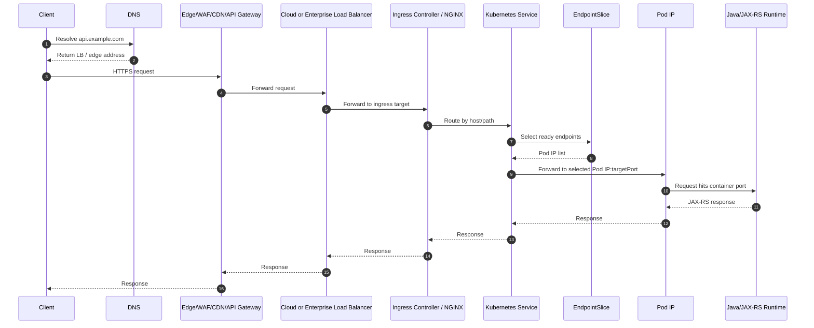
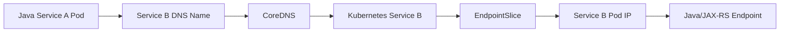

# Part 019 — End-to-End Traffic Flow in Kubernetes

## 1. Core Mental Model

Traffic flow di Kubernetes bukan satu hop sederhana dari client ke pod.

Untuk backend enterprise Java/JAX-RS, request production biasanya melewati beberapa lapisan:

1. Client.
2. DNS.
3. CDN, front door, WAF, atau API gateway jika ada.
4. Cloud load balancer atau enterprise load balancer.
5. Ingress controller, NGINX, API gateway, atau Gateway API implementation.
6. Kubernetes Service.
7. EndpointSlice.
8. Pod IP.
9. Container port.
10. Java HTTP server.
11. JAX-RS resource method.
12. Downstream call ke PostgreSQL, Kafka, RabbitMQ, Redis, Camunda, atau cloud service.

Kubernetes menyembunyikan banyak detail routing agar deployment application lebih sederhana. Tetapi saat production incident terjadi, abstraction ini harus dibuka lagi.

Senior engineer harus bisa menjawab:

- Request masuk dari mana?
- DNS mengarah ke mana?
- TLS terminate di mana?
- Load balancer memilih target apa?
- Ingress memilih backend service mana?
- Service punya endpoint atau tidak?
- Endpoint mengarah ke pod yang ready atau tidak?
- Pod menerima traffic di port yang benar atau tidak?
- Java service memahami forwarded headers atau tidak?
- Timeout mana yang habis dulu?
- Error berasal dari edge, ingress, service mesh, application, atau downstream?

## 2. Why This Concept Exists

Kubernetes workload bersifat dinamis.

Pod bisa:

- dibuat ulang,
- dipindah node,
- diganti saat rollout,
- dianggap not ready,
- mati karena OOMKilled,
- diskalakan naik/turun,
- dihapus karena node drain,
- diganti saat Deployment revision berubah.

Client tidak boleh bergantung pada IP pod yang ephemeral.

Karena itu Kubernetes menyediakan beberapa abstraction:

| Abstraction | Tujuan |
|---|---|
| DNS | Nama stabil untuk endpoint |
| Load balancer | Entry point dari luar cluster |
| Ingress/Gateway | HTTP-aware routing |
| Service | Virtual stable endpoint untuk sekumpulan pod |
| EndpointSlice | Daftar pod IP yang eligible menerima traffic |
| Readiness probe | Gate apakah pod boleh menerima traffic |
| Labels/selectors | Menghubungkan service ke pod |
| kube-proxy/CNI | Membuat packet routing bekerja |

Tanpa abstraction ini, setiap perubahan pod akan memaksa client mengetahui topology runtime terbaru.

## 3. Canonical North-South Traffic Flow

North-south traffic adalah traffic dari luar cluster menuju workload di dalam cluster.



Not every environment uses every component.

Examples:

- Simple internal service may use only `Service` and cluster DNS.
- Public REST API may use DNS → cloud LB → ingress controller → service → pod.
- Enterprise production may add CDN, WAF, API gateway, mTLS gateway, service mesh, private endpoint, or corporate proxy.

## 4. Request Flow by Layer

### 4.1 Client

The client may be:

- browser,
- mobile app,
- partner API consumer,
- internal service,
- batch job,
- Kafka/RabbitMQ worker calling REST API,
- Camunda worker,
- NGINX reverse proxy,
- API gateway,
- cloud service callback.

Important client-side concerns:

- DNS cache.
- TLS trust.
- HTTP method and path.
- timeout.
- retry policy.
- idempotency.
- authentication token.
- correlation ID.
- proxy configuration.
- connection pooling.

Failure symptoms from this layer:

- `UnknownHostException`.
- TLS handshake failure.
- connection refused.
- connection timeout.
- read timeout.
- 401/403.
- duplicate writes from unsafe retries.
- stale DNS cache.

### 4.2 DNS

DNS maps a name such as:

```text
api.example.com
quote-api.internal.example.com
service-name.namespace.svc.cluster.local
```

to an address or canonical name.

DNS may point to:

- cloud load balancer,
- enterprise load balancer,
- API gateway,
- ingress controller,
- internal Kubernetes service,
- private endpoint,
- external service via `ExternalName`.

Failure symptoms:

- wrong IP returned,
- stale record,
- NXDOMAIN,
- split-horizon DNS mismatch,
- internal client resolving public address,
- private endpoint DNS resolving to public endpoint,
- CoreDNS latency,
- Java DNS cache holding old answer.

### 4.3 Edge, WAF, CDN, or API Gateway

This layer may exist before Kubernetes.

Responsibilities may include:

- TLS termination,
- WAF rules,
- authentication,
- rate limiting,
- request size limits,
- path rewrite,
- header normalization,
- routing to region,
- tenant routing,
- audit logging,
- API product governance.

Do not assume this layer exists in CSG. Treat it as an internal verification item.

Failure symptoms:

- 403 from WAF.
- 413 payload too large.
- 429 rate limited.
- 404 due to route mismatch.
- 502/503 because backend target unhealthy.
- lost headers.
- unexpected path rewrite.
- missing correlation ID.

### 4.4 Cloud or Enterprise Load Balancer

In cloud-managed Kubernetes, `Service type: LoadBalancer` or an ingress controller may provision an external load balancer.

In AWS/EKS this may involve:

- ALB,
- NLB,
- target group,
- security group,
- subnet,
- Route 53,
- ACM certificate.

In Azure/AKS this may involve:

- Azure Load Balancer,
- Application Gateway,
- NSG,
- Azure DNS,
- Private DNS Zone,
- certificate integration.

In on-prem this may involve:

- F5,
- NGINX,
- HAProxy,
- MetalLB,
- enterprise load balancer,
- manually managed VIP.

Failure symptoms:

- LB target unhealthy.
- wrong target port.
- security group or NSG block.
- subnet routing issue.
- source IP not preserved.
- health check mismatch.
- TLS cert expired.
- cross-zone behavior mismatch.
- idle timeout shorter than application request.

### 4.5 Ingress Controller / NGINX / Gateway

Ingress is HTTP-aware routing inside Kubernetes.

It commonly routes by:

- host,
- path,
- path type,
- TLS secret,
- backend service,
- annotation,
- rewrite rule,
- backend protocol.

Potential ingress implementations:

- NGINX Ingress Controller.
- AWS Load Balancer Controller.
- Application Gateway Ingress Controller.
- Traefik.
- Kong.
- Istio ingress gateway.
- Envoy Gateway.
- Gateway API implementation.

Failure symptoms:

- 404 from ingress because no matching rule.
- 502 because backend connection failed.
- 503 because no ready upstream endpoint.
- 504 because backend timeout.
- path rewrite breaks JAX-RS route.
- backend protocol mismatch HTTP vs HTTPS.
- body size limit exceeded.
- missing `X-Forwarded-*` header.
- sticky session misconfiguration.
- canary rule catching wrong traffic.

### 4.6 Kubernetes Service

A Service provides a stable virtual endpoint.

It selects pods using labels.

Example:

```yaml
apiVersion: v1
kind: Service
metadata:
  name: quote-api
spec:
  type: ClusterIP
  selector:
    app: quote-api
  ports:
    - name: http
      port: 80
      targetPort: http
```

Important fields:

| Field | Meaning |
|---|---|
| `selector` | Which pods belong to the service |
| `port` | Port exposed by service |
| `targetPort` | Port on pod/container |
| `type` | ClusterIP, NodePort, LoadBalancer, ExternalName |
| `sessionAffinity` | Optional sticky client behavior |

Failure symptoms:

- Service exists but has no endpoints.
- Selector does not match pod labels.
- `targetPort` wrong.
- named port missing on container.
- application listens on different port.
- service points to non-ready pods only through custom endpoint configuration.
- session affinity causes uneven load.

### 4.7 EndpointSlice

EndpointSlice stores the actual backing endpoints for a Service.

It answers the practical question:

> Which pod IPs are currently eligible to receive traffic for this service?

Readiness affects endpoint membership.

A pod can be running but not part of Service endpoints if readiness is failing.

Debug commands:

```bash
kubectl get endpointslice -n <namespace> -l kubernetes.io/service-name=<service-name>
kubectl describe endpointslice -n <namespace> <endpoint-slice-name>
kubectl get endpoints -n <namespace> <service-name>
```

Failure symptoms:

- no endpoints,
- endpoints point to unexpected pod IPs,
- endpoint not ready,
- stale endpoints during rollout,
- wrong port mapping.

### 4.8 Pod IP and Container Port

Kubernetes routes to Pod IP and target port.

Inside the pod:

- container must listen on the expected port,
- process must bind to `0.0.0.0`, not only `127.0.0.1`,
- network policy must allow traffic,
- sidecar or service mesh may intercept traffic,
- application thread pool must accept the request.

Common Java/JAX-RS issue:

```text
Application starts successfully but binds to localhost only.
Kubernetes Service routes to Pod IP, but the process does not accept traffic on Pod IP.
```

For production services, verify:

- `containerPort`.
- actual listening port.
- management port if separate.
- HTTP server host binding.
- readiness endpoint port.
- service `targetPort`.
- ingress backend service port.

### 4.9 Java/JAX-RS Endpoint

After reaching the Java process, routing enters application-level concerns:

- servlet container or embedded HTTP server,
- JAX-RS application path,
- resource class path,
- HTTP method annotation,
- request filters,
- authentication filters,
- tenant context,
- validation,
- transaction boundary,
- downstream calls,
- response mapping.

Traffic can reach the pod but still fail because of:

- wrong base path,
- context path mismatch,
- path rewrite mismatch,
- missing `Authorization` header,
- missing tenant header,
- forwarded proto/host misconfiguration,
- large request body,
- blocking thread pool,
- database connection pool exhaustion,
- downstream timeout.

## 5. East-West Traffic Flow

East-west traffic is service-to-service traffic inside the platform.

Example:

```text
quote-api -> catalog-api
quote-api -> pricing-api
order-api -> quote-api
worker -> quote-api
camunda-worker -> order-api
```

Typical flow:



Concerns:

- service DNS name,
- namespace boundary,
- NetworkPolicy,
- mTLS/service mesh if used,
- request timeout,
- retry amplification,
- circuit breaker,
- correlation ID propagation,
- rate limiting,
- version compatibility,
- deployment ordering,
- readiness during rollout.

A common failure pattern:

```text
Service A retries aggressively when Service B is rolling out.
Service B has slow startup.
Readiness is too optimistic.
Traffic reaches pods before warmup.
Service A retry storm increases load.
HPA reacts slowly.
Incident becomes platform-wide latency spike.
```

## 6. Source IP Preservation

Source IP can change at multiple layers.

Possible observed source at application:

- real client IP,
- CDN IP,
- WAF IP,
- load balancer IP,
- ingress controller pod IP,
- node IP,
- service mesh sidecar IP.

Headers commonly used:

- `X-Forwarded-For`
- `X-Forwarded-Host`
- `X-Forwarded-Proto`
- `X-Real-IP`
- standardized `Forwarded`
- proxy protocol metadata if enabled

Critical concern:

> Never blindly trust forwarded headers from arbitrary clients.

The application or gateway must trust only known proxy boundaries.

For Java/JAX-RS, verify:

- framework support for forwarded headers,
- reverse proxy config,
- generated absolute URLs,
- redirects using HTTPS instead of HTTP,
- audit logging client IP,
- rate limiting source identity,
- security decisions not based on spoofable headers.

## 7. TLS Termination Points

TLS can terminate at different layers:

| Termination point | Common use | Risk |
|---|---|---|
| CDN/WAF | Public edge protection | Backend may receive HTTP unless re-encrypted |
| Cloud LB | Managed cert and scaling | Header/protocol correctness required |
| Ingress controller | Kubernetes-level routing | Secret/cert lifecycle must be managed |
| Service mesh sidecar | mTLS east-west | Operational complexity |
| Application pod | End-to-end TLS | App owns cert reload and TLS config |

Questions to ask:

- Where is TLS terminated?
- Is traffic re-encrypted after termination?
- Who owns certificate renewal?
- What happens on certificate expiry?
- Is mTLS required for internal traffic?
- Does Java trust the downstream CA?
- Are private endpoints using private CA?
- Are redirects generated with correct scheme?

## 8. Timeout Chain

Timeouts must be aligned from outermost to innermost layer.

Example timeout chain:

| Layer | Example timeout | Risk if misaligned |
|---|---:|---|
| Client | 5s | Client gives up before backend finishes |
| CDN/WAF/API gateway | 30s | Gateway returns 504 |
| Cloud load balancer | 60s idle | Long request cut mid-flight |
| Ingress controller | 30s proxy read | 504 from ingress |
| Java HTTP server | 60s | Threads held too long |
| Java HTTP client | 2s connect, 5s read | Downstream failures surface fast |
| Database query | 3s statement timeout | DB protected from runaway query |
| Message consumer processing | workload-specific | May duplicate or redeliver |

Bad timeout design:

```text
Application waits 120s for downstream.
Ingress times out at 30s.
Client receives 504.
Application keeps working after client already gave up.
Retry creates duplicate or amplified work.
```

Better design:

- define latency budget,
- keep downstream timeouts shorter than upstream,
- make writes idempotent where retries exist,
- apply request deadline propagation if supported,
- use circuit breakers for known unstable dependencies,
- expose timeout metrics.

## 9. HTTP Status Code Interpretation by Layer

Same status code can come from different layers.

| Status | Possible source |
|---|---|
| 400 | gateway validation, app validation |
| 401 | API gateway, ingress auth, app auth |
| 403 | WAF, RBAC, app authorization |
| 404 | wrong ingress host/path, wrong JAX-RS path |
| 408 | client/request timeout |
| 413 | edge/ingress body size limit |
| 429 | gateway rate limit, app rate limit |
| 499 | client closed request, common in NGINX logs |
| 500 | application error |
| 502 | ingress cannot connect to backend |
| 503 | no ready endpoint, overloaded app, maintenance |
| 504 | timeout at gateway/ingress/proxy |

Debug rule:

> First identify which layer produced the response, then debug that layer.

Do not immediately blame Java application for every 5xx.

## 10. Kubernetes Traffic Flow Debugging Workflow

### 10.1 From outside to inside

```bash
dig api.example.com
curl -vk https://api.example.com/path
```

Check:

- DNS result,
- TLS certificate,
- response headers,
- status code,
- redirect,
- proxy/gateway headers.

### 10.2 Check ingress

```bash
kubectl get ingress -n <namespace>
kubectl describe ingress -n <namespace> <ingress-name>
kubectl logs -n <ingress-namespace> deploy/<ingress-controller>
```

Check:

- host,
- path,
- backend service,
- TLS secret,
- ingress class,
- annotations,
- canary routing,
- rewrite behavior.

### 10.3 Check service

```bash
kubectl get svc -n <namespace>
kubectl describe svc -n <namespace> <service-name>
```

Check:

- service type,
- selector,
- port,
- targetPort,
- endpoints.

### 10.4 Check EndpointSlice

```bash
kubectl get endpointslice -n <namespace> -l kubernetes.io/service-name=<service-name>
kubectl describe endpointslice -n <namespace> <endpoint-slice-name>
```

Check:

- endpoint count,
- ready endpoints,
- pod IPs,
- target port.

### 10.5 Check pod readiness

```bash
kubectl get pod -n <namespace> -l app=<app-name> -o wide
kubectl describe pod -n <namespace> <pod-name>
kubectl logs -n <namespace> <pod-name>
```

Check:

- Running vs Ready,
- probe failures,
- restarts,
- events,
- node,
- pod IP.

### 10.6 Check application listener

```bash
kubectl exec -n <namespace> <pod-name> -- sh -c 'ss -lntp || netstat -lntp'
```

Check:

- listening port,
- host binding,
- management port,
- HTTP server startup logs.

### 10.7 Test from inside cluster

```bash
kubectl run tmp-curl -n <namespace> --rm -it --image=curlimages/curl -- sh
curl -v http://<service-name>.<namespace>.svc.cluster.local:<port>/health
```

Check:

- service DNS,
- service route,
- application response,
- latency.

## 11. Impact on Java/JAX-RS Backend

Traffic flow affects Java/JAX-RS services in several concrete ways.

### 11.1 Base path correctness

JAX-RS path may include:

- application context path,
- servlet mapping,
- `@ApplicationPath`,
- class-level `@Path`,
- method-level `@Path`.

Ingress rewrite can break route matching.

Example failure:

```text
External path: /quote/api/v1/quotes
Ingress rewrites to: /api/v1/quotes
JAX-RS expects: /quote/api/v1/quotes
Result: 404 from application.
```

### 11.2 Forwarded headers

Without correct forwarded header handling:

- generated URLs use internal host,
- redirects use HTTP instead of HTTPS,
- audit logs show proxy IP only,
- security logic may misclassify request source.

### 11.3 Connection and thread pool

Ingress and load balancer can create large concurrent load.

Java concerns:

- accept queue,
- worker thread pool,
- connection pool,
- DB pool,
- HTTP client pool,
- backpressure,
- request timeout,
- queue length,
- rejected request behavior.

### 11.4 Graceful rollout

During rollout:

- pod becomes ready,
- service endpoint receives traffic,
- old pod receives SIGTERM,
- readiness should be removed,
- inflight requests should drain,
- consumer loops should stop accepting work,
- shutdown must finish before SIGKILL.

Bad readiness and shutdown design creates intermittent 502/503 during deployment.

## 12. Impact on PostgreSQL, Kafka, RabbitMQ, Redis, Camunda, and NGINX

### PostgreSQL

Traffic to PostgreSQL is usually egress from application pod.

Concerns:

- DNS to database endpoint,
- private endpoint,
- connection pool size,
- TLS trust,
- statement timeout,
- NetworkPolicy egress,
- failover DNS behavior,
- connection lifetime after failover.

### Kafka

Kafka clients are sensitive to advertised listeners.

Concerns:

- bootstrap DNS,
- broker advertised address,
- NetworkPolicy,
- TLS/SASL,
- consumer rebalance during pod restart,
- graceful shutdown,
- retry and idempotent producer config.

### RabbitMQ

Concerns:

- connection recovery,
- channel lifecycle,
- consumer prefetch,
- message ack on shutdown,
- NetworkPolicy,
- service DNS,
- TLS.

### Redis

Concerns:

- DNS to primary/replica/sentinel/cluster,
- connection timeout,
- retry policy,
- stale connection after failover,
- cache stampede during partial outage.

### Camunda-like workloads

Concerns:

- worker polling,
- long-running tasks,
- retries,
- external task lock duration,
- graceful shutdown before lock expiry,
- database connection pressure.

### NGINX

NGINX may be:

- edge reverse proxy,
- ingress controller,
- sidecar,
- internal gateway.

Concerns:

- path rewrite,
- timeout,
- body size,
- buffering,
- upstream health,
- proxy headers,
- client IP preservation,
- access logs.

## 13. EKS, AKS, On-Prem, and Hybrid Considerations

### EKS

Verify:

- ALB vs NLB.
- target type instance vs IP.
- AWS Load Balancer Controller annotations.
- security groups.
- subnet tags.
- Route 53 record.
- ACM certificate.
- VPC CNI behavior.
- pod IP routability.
- source IP preservation requirements.

### AKS

Verify:

- Azure Load Balancer vs Application Gateway.
- AGIC or other ingress controller.
- Azure CNI vs kubenet.
- NSG rules.
- UDR routes.
- Azure DNS and Private DNS Zone.
- source IP behavior.
- certificate ownership.

### On-prem

Verify:

- enterprise load balancer integration.
- VIP ownership.
- MetalLB if used.
- DNS team process.
- firewall rules.
- certificate management.
- ingress controller exposure.
- internal registry/network constraints.

### Hybrid

Verify:

- route from pod CIDR or node subnet to on-prem.
- firewall permit.
- DNS resolution path.
- proxy requirement.
- TLS trust chain.
- MTU issues.
- latency budget.
- retry amplification across WAN.

## 14. Correctness Concerns

- Does the external path map exactly to the JAX-RS route?
- Is host-based routing correct per environment?
- Are only ready pods receiving traffic?
- Are canary rules scoped correctly?
- Are forwarded headers trusted only from known proxies?
- Are retries safe for non-idempotent operations?
- Is source IP used safely?
- Are request deadlines propagated?
- Does rollout preserve compatibility between versions?
- Is downstream dependency timeout shorter than upstream timeout?

## 15. Performance Concerns

- Too many proxy layers add latency.
- TLS re-encryption adds CPU overhead.
- Ingress buffering can affect streaming.
- Long timeout chains hold threads.
- Connection pools may be undersized.
- DNS latency can amplify service latency.
- Cross-zone or cross-region traffic can increase cost and latency.
- Sticky sessions may create hotspot pods.
- Service mesh sidecars may add overhead.
- Readiness too early can send traffic to cold JVM.

## 16. Security and Privacy Concerns

- Do not trust raw `X-Forwarded-For` from clients.
- Ensure TLS termination is intentional.
- Avoid leaking internal hostnames in redirects or errors.
- Validate ingress exposure: internal vs external.
- Avoid exposing management port publicly.
- Confirm auth is enforced at correct layer.
- Ensure sensitive headers are not logged.
- Ensure WAF/API gateway does not strip required security headers.
- Use mTLS where required by internal policy.
- Ensure audit logs preserve enough identity without leaking PII.

## 17. Cost Concerns

Traffic design affects cost.

Cost drivers:

- cloud load balancer count,
- NAT Gateway traffic,
- cross-AZ data transfer,
- cross-region data transfer,
- logging volume,
- WAF/API gateway request volume,
- service mesh overhead,
- overprovisioned ingress controller,
- duplicated private endpoints,
- high-cardinality metrics.

Senior review question:

> Does this routing design need another managed load balancer, NAT path, or cross-zone hop?

## 18. Observability Concerns

Minimum useful signals:

- ingress request count, latency, status code,
- upstream connect/read timeout,
- service endpoint availability,
- pod readiness transitions,
- application request latency,
- JAX-RS route metrics,
- downstream dependency latency,
- error rate by layer,
- correlation ID propagation,
- client IP/proxy metadata,
- rollout revision in metrics/logs.

Recommended log fields:

```text
timestamp
trace_id
span_id
correlation_id
request_method
request_path
route_template
status_code
duration_ms
client_ip_or_trusted_source
x_forwarded_for_sanitized
user_or_service_identity
tenant_id_if_allowed
deployment_revision
pod_name
namespace
```

Avoid logging:

- Authorization headers,
- cookies,
- tokens,
- raw PII,
- passwords,
- secret values,
- full payloads unless explicitly approved.

## 19. Common Failure Scenarios

### Scenario 1 — Ingress returns 404

Likely causes:

- host mismatch,
- path mismatch,
- wrong IngressClass,
- rewrite rule wrong,
- canary rule mismatch,
- request goes to wrong environment.

Debug:

```bash
kubectl describe ingress -n <namespace> <ingress-name>
curl -vk -H "Host: <host>" https://<lb-address>/<path>
```

### Scenario 2 — Ingress returns 503

Likely causes:

- service has no ready endpoints,
- readiness failing,
- selector mismatch,
- pods not running,
- rollout stuck.

Debug:

```bash
kubectl get svc,endpoints,endpointslice,pod -n <namespace> -l app=<app>
kubectl describe pod -n <namespace> <pod-name>
```

### Scenario 3 — Ingress returns 504

Likely causes:

- backend request timeout,
- Java thread pool exhausted,
- DB call slow,
- downstream dependency slow,
- ingress timeout too low,
- app timeout too high.

Debug:

```bash
kubectl logs -n <namespace> <pod-name>
kubectl top pod -n <namespace>
kubectl describe ingress -n <namespace> <ingress-name>
```

### Scenario 4 — Service DNS works but request hangs

Likely causes:

- NetworkPolicy blocks traffic,
- application not listening,
- targetPort wrong,
- sidecar intercept issue,
- pod CPU throttled,
- connection pool exhausted.

Debug:

```bash
kubectl exec -n <namespace> <debug-pod> -- curl -v http://<service>:<port>/health
kubectl describe netpol -n <namespace>
kubectl exec -n <namespace> <app-pod> -- ss -lntp
```

### Scenario 5 — Only some requests fail during rollout

Likely causes:

- readiness too early,
- shutdown not graceful,
- connection draining mismatch,
- canary version incompatible,
- sticky session to terminating pod,
- HPA scaling cold pods too quickly.

Debug:

```bash
kubectl rollout history deploy/<deployment> -n <namespace>
kubectl get pod -n <namespace> -w
kubectl describe pod -n <namespace> <terminating-pod>
```

## 20. PR Review Checklist

Use this checklist when reviewing traffic-related changes.

### DNS and edge

- [ ] DNS target is correct for environment.
- [ ] Public vs private exposure is intentional.
- [ ] TTL is appropriate.
- [ ] WAF/API gateway behavior is understood.
- [ ] TLS certificate ownership is clear.

### Load balancer and ingress

- [ ] IngressClass or GatewayClass is correct.
- [ ] Host/path routing matches expected API contract.
- [ ] Path rewrite is explicit and tested.
- [ ] Backend protocol is correct.
- [ ] Timeout settings align with application timeout.
- [ ] Body size limits are appropriate.
- [ ] Canary/sticky-session rules are safe.
- [ ] Source IP preservation requirements are handled.

### Service and EndpointSlice

- [ ] Service selector matches pod labels.
- [ ] `port` and `targetPort` are correct.
- [ ] named ports exist in pod spec.
- [ ] endpoint count expected.
- [ ] readiness controls service membership.

### Java/JAX-RS

- [ ] Application binds to expected host/port.
- [ ] JAX-RS context path matches ingress path.
- [ ] forwarded headers are handled safely.
- [ ] request timeout and downstream timeout are aligned.
- [ ] graceful shutdown behavior is tested.
- [ ] management endpoint is not publicly exposed.

### Observability

- [ ] Ingress metrics available.
- [ ] Application route metrics available.
- [ ] Correlation ID propagated.
- [ ] Logs identify pod, namespace, revision.
- [ ] Dashboards show latency/status by route.
- [ ] Alerting distinguishes 404/502/503/504.

## 21. Internal Verification Checklist

Verify these inside CSG/team before assuming topology:

- [ ] Is the service exposed publicly, privately, or only inside cluster?
- [ ] What DNS zone owns the service hostname?
- [ ] Is there CDN, WAF, API gateway, or front door before Kubernetes?
- [ ] What cloud or enterprise load balancer is used?
- [ ] Is the ingress controller NGINX, cloud-native, service mesh gateway, or Gateway API?
- [ ] Are Ingress resources, Gateway API resources, or API gateway configs used?
- [ ] Where does TLS terminate?
- [ ] Is traffic re-encrypted after TLS termination?
- [ ] Are source IP and forwarded headers trusted/normalized?
- [ ] What is the exact host/path rewrite behavior?
- [ ] Which Kubernetes Service backs the route?
- [ ] Which labels connect Service to pods?
- [ ] Are EndpointSlices healthy during rollout?
- [ ] Are readiness probes used as traffic gate?
- [ ] What timeouts exist at client, gateway, LB, ingress, service mesh, app, and downstream?
- [ ] Is there service mesh sidecar?
- [ ] Is NetworkPolicy enforced?
- [ ] Is management port separated from public API port?
- [ ] Are traffic dashboards available?
- [ ] Are ingress and app logs correlated by trace/correlation ID?
- [ ] Are runbooks available for 404/502/503/504 incidents?

## 22. Senior Engineer Heuristics

- A 503 is often an endpoint/readiness problem, not an application exception.
- A 504 is often a timeout-chain problem, not merely a slow API.
- A 404 can be produced by ingress or application; identify which one first.
- A running pod is not necessarily a routable pod.
- A service with no endpoints is a selector/readiness/workload problem.
- Readiness is part of traffic control, not just health reporting.
- Path rewrite must be treated as API contract transformation.
- Source IP is a security boundary only if proxy trust is configured.
- Timeout alignment is part of correctness.
- Traffic flow must be observable per layer, otherwise incident triage becomes guesswork.

## 23. Key Takeaways

- Kubernetes traffic flow is layered: DNS, load balancer, ingress, service, EndpointSlice, pod, container, Java runtime, JAX-RS route.
- The most important debugging skill is identifying which layer produced the symptom.
- Service routing depends on labels, selectors, ports, EndpointSlices, and readiness.
- Ingress routing depends on host/path/TLS/backend protocol/rewrite configuration.
- Java/JAX-RS correctness depends on context path, forwarded headers, shutdown, timeout, and thread/connection pools.
- Production traffic design must consider correctness, performance, security, observability, and cost together.
