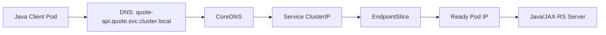

# Part 020 — Kubernetes DNS and Service Discovery

## 1. Core Mental Model

Kubernetes service discovery is mostly DNS plus Service abstraction.

A pod should not call another pod by pod IP.

Instead, it should call a stable name such as:

```text
quote-api
quote-api.quote.svc
quote-api.quote.svc.cluster.local
```

Kubernetes DNS resolves stable service names into addresses that represent dynamic workloads.

The core idea:

```text
Application uses stable DNS name.
Kubernetes maps that name to a Service.
Service maps to currently ready pod endpoints.
Pods can change without changing client configuration.
```

DNS is not only a convenience feature. In distributed systems, DNS is part of runtime correctness.

When DNS fails, the symptom often looks like:

- service unreachable,
- connection timeout,
- intermittent dependency failure,
- Kafka/RabbitMQ/Redis/PostgreSQL connection failure,
- private endpoint unreachable,
- wrong environment called,
- old address used after failover.

## 2. Why Kubernetes DNS Exists

Pods are ephemeral.

A pod IP can change when:

- Deployment rolls out,
- pod restarts,
- node is drained,
- HPA scales up/down,
- cluster autoscaler changes nodes,
- crash recovery happens,
- workload is rescheduled.

Applications need a stable way to discover services without hardcoding pod IPs.

Kubernetes solves this using:

| Component | Role |
|---|---|
| Service | Stable logical endpoint |
| CoreDNS | DNS server for cluster names |
| EndpointSlice | Backing pod IPs for service |
| kubelet DNS config | Injects pod resolver config |
| search domain | Allows short service names |
| CNI/networking | Makes resolved addresses routable |

## 3. Kubernetes DNS Name Forms

Assume:

```text
service name: quote-api
namespace: quote
cluster domain: cluster.local
```

Common DNS forms:

```text
quote-api
quote-api.quote
quote-api.quote.svc
quote-api.quote.svc.cluster.local
```

Meaning:

| Name | Scope |
|---|---|
| `quote-api` | Same namespace, depends on search domain |
| `quote-api.quote` | Specific namespace shortcut |
| `quote-api.quote.svc` | Specific service namespace |
| `quote-api.quote.svc.cluster.local` | Fully qualified cluster service DNS |

Best practice for cross-namespace calls:

```text
<service>.<namespace>.svc.cluster.local
```

or at least:

```text
<service>.<namespace>.svc
```

Avoid relying on same-namespace short names when the call is cross-domain or critical.

## 4. Service DNS

For a normal `ClusterIP` service, DNS returns the Service virtual IP.

Example:

```yaml
apiVersion: v1
kind: Service
metadata:
  name: quote-api
  namespace: quote
spec:
  type: ClusterIP
  selector:
    app: quote-api
  ports:
    - name: http
      port: 80
      targetPort: http
```

DNS:

```text
quote-api.quote.svc.cluster.local -> ClusterIP
```

Request flow:



Important:

- DNS returns the Service address.
- Service routing then chooses a backing endpoint.
- DNS does not directly return all pods for normal ClusterIP service.

## 5. Pod DNS Configuration

Each pod receives DNS configuration.

You can inspect it:

```bash
kubectl exec -n <namespace> <pod-name> -- cat /etc/resolv.conf
```

Typical content:

```text
nameserver <cluster-dns-ip>
search <namespace>.svc.cluster.local svc.cluster.local cluster.local
options ndots:5
```

Important fields:

| Field | Meaning |
|---|---|
| `nameserver` | Usually cluster DNS service IP |
| `search` | Suffixes tried for short names |
| `ndots` | Controls when name is treated as absolute vs search-expanded |

## 6. Search Domain

Search domains allow short names.

From pod in namespace `quote`:

```text
catalog-api
```

may be expanded into:

```text
catalog-api.quote.svc.cluster.local
catalog-api.svc.cluster.local
catalog-api.cluster.local
```

This is convenient but can create ambiguity.

Risk:

```text
A service named payment-api exists in namespace A.
Another payment-api exists in namespace B.
Short name resolves differently depending on caller namespace.
```

For critical service-to-service calls, prefer explicit namespace:

```text
payment-api.payment.svc.cluster.local
```

## 7. ndots

`ndots` controls DNS resolution behavior.

With `ndots:5`, a name with fewer than 5 dots may be tried with search domains first.

Example:

```text
api.partner.com
```

This may be attempted as:

```text
api.partner.com.<namespace>.svc.cluster.local
api.partner.com.svc.cluster.local
api.partner.com.cluster.local
api.partner.com
```

This can increase DNS query volume and latency for external names.

Production concern:

- external dependency calls may trigger multiple DNS lookups,
- CoreDNS load may increase,
- latency may appear before connection starts,
- noisy DNS logs can hide real failures.

Mitigations:

- use fully qualified external names with trailing dot in specific cases,
- tune application DNS caching carefully,
- review CoreDNS load,
- avoid excessive short-name external calls,
- verify platform DNS policy before changing pod DNS config.

## 8. Headless Service DNS

A headless Service has:

```yaml
clusterIP: None
```

Example:

```yaml
apiVersion: v1
kind: Service
metadata:
  name: rabbitmq
spec:
  clusterIP: None
  selector:
    app: rabbitmq
  ports:
    - name: amqp
      port: 5672
```

For headless services, DNS can return individual pod IP records instead of a single ClusterIP.

This is useful for:

- StatefulSet identity,
- direct peer discovery,
- Kafka brokers,
- RabbitMQ nodes,
- Redis cluster/sentinel,
- databases requiring stable identity,
- custom clustered protocols.

Trade-off:

- client becomes more aware of individual endpoints,
- DNS caching behavior matters,
- readiness and endpoint publication need careful design,
- not all clients handle multiple A records correctly.

## 9. StatefulSet DNS

StatefulSet gives stable pod identity.

Typical pattern:

```text
<pod-name>.<headless-service>.<namespace>.svc.cluster.local
```

Example:

```text
rabbitmq-0.rabbitmq.messaging.svc.cluster.local
rabbitmq-1.rabbitmq.messaging.svc.cluster.local
rabbitmq-2.rabbitmq.messaging.svc.cluster.local
```

This matters for stateful systems that require stable peer identity.

Examples:

- RabbitMQ cluster nodes.
- Kafka brokers.
- Redis cluster nodes.
- PostgreSQL replicas in some operator setups.
- Camunda dependencies if backed by stateful components.

Caution:

For many enterprise teams, databases and brokers are better consumed as managed or platform-provided services rather than hand-managed StatefulSets by application teams.

## 10. Pod DNS

Pods may also have DNS records if enabled and configured.

However, pod DNS is rarely the right abstraction for application integration.

Prefer:

- Service DNS for normal service-to-service traffic.
- Headless service DNS for stateful peer identity.
- Cloud/private DNS for managed services.
- Explicit endpoint discovery only when required by protocol.

Anti-pattern:

```text
Service A stores Pod IP or Pod DNS of Service B.
After rollout, Pod IP changes.
Service A fails.
```

## 11. ExternalName Service

An `ExternalName` service maps a Kubernetes service name to an external DNS name.

Example:

```yaml
apiVersion: v1
kind: Service
metadata:
  name: external-payment-api
  namespace: quote
spec:
  type: ExternalName
  externalName: payment-api.internal.example.com
```

Then inside cluster:

```text
external-payment-api.quote.svc.cluster.local
```

resolves as a CNAME to:

```text
payment-api.internal.example.com
```

Useful for:

- abstracting external service names,
- migrating dependencies,
- environment-specific naming,
- keeping app config Kubernetes-native.

Risks:

- no port mapping enforcement,
- no health check by Kubernetes,
- no EndpointSlice readiness,
- DNS chain becomes harder to debug,
- TLS hostname must still match expected host,
- observability can become less obvious.

## 12. DNS Caching

DNS caching happens at multiple layers:

- CoreDNS cache plugin.
- node-local DNS cache if enabled.
- application runtime.
- JVM DNS cache.
- HTTP client connection pool.
- OS resolver behavior inside container.
- external DNS resolver.
- cloud private DNS resolver.

Caching can create stale dependency routing.

Example:

```text
Database failover changes DNS target.
JVM caches old address too long.
Application keeps connecting to old primary.
```

For Java, DNS caching is affected by JVM/security properties and runtime behavior.

Operationally important questions:

- How long does Java cache positive DNS answers?
- How long does it cache negative DNS answers?
- Does the HTTP client pool keep connections beyond DNS TTL?
- Does the database driver re-resolve host after connection failure?
- Does Kafka client rely on broker advertised listeners?
- Does Redis client handle topology refresh?

## 13. DNS TTL

TTL controls how long DNS answers should be cached.

But not every client respects TTL exactly.

In Kubernetes service DNS:

- ClusterIP service names are stable.
- Endpoint changes generally happen behind Service routing, not DNS.
- Headless service answers can change with pod membership.
- ExternalName and private DNS depend on upstream TTL.

Practical guidance:

- Short TTL helps failover but increases query load.
- Long TTL reduces DNS load but may delay failover.
- JVM and client pools can override expected behavior.
- Headless and stateful workloads require extra attention.
- Private endpoint DNS must be tested during failover.

## 14. CoreDNS

CoreDNS is the default Kubernetes DNS server in most clusters.

It handles:

- Kubernetes service discovery,
- pod/service DNS records,
- forwarding external queries,
- caching,
- plugin-based behavior.

Inspect CoreDNS:

```bash
kubectl get pods -n kube-system -l k8s-app=kube-dns
kubectl get svc -n kube-system kube-dns
kubectl get configmap -n kube-system coredns -o yaml
kubectl logs -n kube-system -l k8s-app=kube-dns
```

CoreDNS failure can cause broad application failures.

Symptoms:

- many services report `UnknownHostException`,
- intermittent dependency resolution,
- elevated DNS latency,
- pods can connect by IP but not by name,
- external DNS resolution fails from pods,
- CoreDNS pods CPU throttled or OOMKilled.

CoreDNS should be monitored as platform-critical infrastructure.

## 15. NodeLocal DNSCache Awareness

Some clusters use NodeLocal DNSCache.

Purpose:

- reduce CoreDNS load,
- improve DNS latency,
- avoid conntrack issues for DNS traffic,
- provide local node DNS cache.

Potential issues:

- node-local daemon failure affects pods on that node,
- cache staleness,
- configuration mismatch,
- debugging path includes node-local agent before CoreDNS.

Internal verification item:

- confirm whether NodeLocal DNSCache is enabled,
- know where its metrics/logs are,
- know how DNS path changes when enabled.

## 16. Private DNS

Private DNS appears in cloud and hybrid enterprise environments.

Examples:

- AWS Route 53 private hosted zone.
- Azure Private DNS Zone.
- on-prem internal DNS.
- split-horizon corporate DNS.
- private endpoint DNS override.
- service discovery namespace.

Private DNS is critical for:

- managed PostgreSQL,
- managed Redis,
- Kafka platform endpoint,
- private API gateway,
- AWS Secrets Manager VPC endpoint,
- Azure Key Vault private endpoint,
- internal NGINX/API gateways.

Failure patterns:

- pod resolves public endpoint instead of private endpoint,
- VPC/VNet not linked to private DNS zone,
- resolver forwarding missing,
- on-prem client resolves different IP than cloud pod,
- private endpoint exists but DNS points elsewhere,
- wildcard/corporate search domain causes wrong resolution.

## 17. Split-Horizon DNS

Split-horizon DNS means the same hostname resolves differently depending on network location.

Example:

```text
api.internal.example.com
```

From inside cloud VPC/VNet:

```text
10.10.20.30
```

From public internet:

```text
203.0.113.10
```

From on-prem:

```text
172.16.40.50
```

This can be intentional.

But it creates debugging complexity:

- your laptop result may differ from pod result,
- pod in EKS may differ from pod in AKS,
- on-prem worker may differ from cloud worker,
- DNS result may change based on resolver path.

Debug rule:

> Always run DNS checks from the same network location as the failing workload.

## 18. DNS and Java/JAX-RS Services

Java backend services are affected by DNS in several ways.

### 18.1 Outbound REST clients

A Java service calling another service may use:

- JAX-RS client,
- Apache HttpClient,
- OkHttp,
- Spring WebClient if used elsewhere,
- custom SDK client.

Concerns:

- DNS cache,
- connection pool stale connections,
- retry on unknown host,
- retry on stale connection,
- route planner/proxy,
- TLS hostname verification,
- timeout.

### 18.2 PostgreSQL client

PostgreSQL DNS issues surface as:

- connection timeout,
- connection refused,
- failover not detected,
- old primary still used,
- certificate hostname mismatch.

Review:

- JDBC URL hostname,
- driver failover parameters,
- connection pool lifetime,
- DNS TTL behavior,
- TLS mode.

### 18.3 Kafka client

Kafka is special because broker discovery depends on advertised listeners.

Failure pattern:

```text
Client resolves bootstrap server.
Bootstrap succeeds.
Broker metadata returns addresses unreachable from pod.
Client fails to connect to brokers.
```

Review:

- bootstrap DNS,
- advertised listeners,
- TLS/SASL,
- network policy,
- private endpoint,
- DNS resolution from pod.

### 18.4 RabbitMQ client

RabbitMQ DNS issues affect:

- initial connection,
- cluster node discovery,
- reconnection,
- TLS validation,
- load-balanced AMQP endpoint behavior.

Review:

- hostname,
- connection recovery,
- DNS cache,
- TLS hostname,
- NetworkPolicy egress.

### 18.5 Redis client

Redis DNS issues affect:

- sentinel discovery,
- cluster topology refresh,
- primary/replica failover,
- stale connections,
- private endpoint resolution.

Review:

- client mode,
- topology refresh,
- DNS TTL,
- connection pool,
- failover behavior.

### 18.6 Camunda-like workers

Workers may poll endpoints or connect to workflow engine/database.

DNS concerns:

- engine API hostname,
- database hostname,
- worker retry loop,
- lock duration,
- timeout,
- connection pool,
- failover.

## 19. DNS Debugging Workflow

### 19.1 Check pod resolver config

```bash
kubectl exec -n <namespace> <pod-name> -- cat /etc/resolv.conf
```

Look for:

- nameserver,
- search domains,
- ndots,
- custom DNS config.

### 19.2 Resolve service name from pod

```bash
kubectl exec -n <namespace> <pod-name> -- nslookup quote-api.quote.svc.cluster.local
```

or:

```bash
kubectl exec -n <namespace> <pod-name> -- getent hosts quote-api.quote.svc.cluster.local
```

If the container lacks tools, use a debug pod:

```bash
kubectl run dns-debug -n <namespace> --rm -it --image=busybox:1.36 -- sh
nslookup quote-api.quote.svc.cluster.local
```

### 19.3 Check Service and EndpointSlice

```bash
kubectl get svc -n quote quote-api
kubectl get endpointslice -n quote -l kubernetes.io/service-name=quote-api
kubectl describe svc -n quote quote-api
```

DNS may work while service has no healthy backend.

### 19.4 Query CoreDNS directly

Find DNS service IP:

```bash
kubectl get svc -n kube-system kube-dns
```

Then:

```bash
nslookup quote-api.quote.svc.cluster.local <kube-dns-service-ip>
```

### 19.5 Check CoreDNS logs and health

```bash
kubectl get pods -n kube-system -l k8s-app=kube-dns
kubectl logs -n kube-system -l k8s-app=kube-dns
kubectl describe pod -n kube-system -l k8s-app=kube-dns
```

Look for:

- errors,
- throttling,
- OOMKilled,
- readiness failures,
- config reload failure.

### 19.6 Check private DNS from pod

```bash
kubectl run dns-debug -n <namespace> --rm -it --image=busybox:1.36 -- sh
nslookup mydb.private.example.com
wget -S -O- https://mydb.private.example.com
```

For TLS debugging use an image with OpenSSL if permitted:

```bash
openssl s_client -connect myservice.internal.example.com:443 -servername myservice.internal.example.com
```

### 19.7 Compare from different locations

Run DNS check from:

- failing pod,
- another pod in same namespace,
- pod in another namespace,
- node if permitted,
- CI runner,
- developer laptop,
- on-prem host,
- cloud VM.

Different answers indicate split-horizon DNS or resolver path issue.

## 20. Common DNS Failure Modes

### 20.1 `UnknownHostException`

Likely causes:

- service name wrong,
- namespace wrong,
- CoreDNS unavailable,
- private DNS zone not linked,
- external resolver unavailable,
- typo,
- DNS search domain expectation wrong.

### 20.2 Resolves but connection fails

Likely causes:

- DNS points to correct IP but network blocked,
- NetworkPolicy denies egress,
- firewall/SG/NSG denies traffic,
- service has no endpoint,
- application not listening,
- wrong port,
- TLS mismatch.

### 20.3 Works from laptop, fails from pod

Likely causes:

- split-horizon DNS,
- pod uses cluster DNS,
- private DNS not linked to cluster VPC/VNet,
- corporate VPN resolver differs,
- firewall allows laptop but not pod subnet,
- proxy difference.

### 20.4 Works from one namespace, fails from another

Likely causes:

- short name resolves differently,
- NetworkPolicy namespace selector,
- service exists only in one namespace,
- RBAC irrelevant for DNS but relevant for debug commands,
- DNS search domain difference.

### 20.5 Intermittent DNS latency

Likely causes:

- CoreDNS overloaded,
- ndots causing excessive queries,
- external DNS slow,
- NodeLocal DNSCache issue,
- UDP fragmentation,
- conntrack pressure,
- noisy application repeatedly resolving.

### 20.6 Headless service returns stale or unexpected endpoints

Likely causes:

- pods not ready,
- `publishNotReadyAddresses` behavior,
- StatefulSet rollout,
- DNS cache,
- client not handling multiple records,
- operator-managed service behavior.

## 21. DNS and NetworkPolicy

DNS requires network access.

If a namespace has default deny egress, DNS must be explicitly allowed.

Common DNS egress rule pattern:

```yaml
apiVersion: networking.k8s.io/v1
kind: NetworkPolicy
metadata:
  name: allow-dns-egress
spec:
  podSelector: {}
  policyTypes:
    - Egress
  egress:
    - to:
        - namespaceSelector:
            matchLabels:
              kubernetes.io/metadata.name: kube-system
      ports:
        - protocol: UDP
          port: 53
        - protocol: TCP
          port: 53
```

Caution:

- actual labels may differ by cluster,
- NodeLocal DNSCache may change target,
- managed DNS implementation may require different policy,
- confirm with platform team before applying generic policy.

## 22. DNS and Service Mesh

If a service mesh is used, DNS may interact with:

- sidecar interception,
- service registry,
- virtual services,
- destination rules,
- mTLS identity,
- egress gateways,
- DNS proxying,
- synthetic service names.

Failure can look like DNS but actually be mesh routing.

Internal verification:

- Is Istio/Linkerd/Consul/other mesh used?
- Does sidecar intercept DNS?
- Are external services defined in mesh config?
- Are egress gateways required?
- Are mTLS policies blocking traffic?
- Are virtual services overriding routes?

## 23. DNS in EKS

EKS-specific areas to verify:

- CoreDNS add-on version.
- CoreDNS autoscaling/resource limits.
- VPC DNS resolution and hostnames.
- Route 53 private hosted zone association.
- VPC endpoint private DNS enabled.
- Security groups for DNS/endpoint traffic.
- NodeLocal DNSCache if enabled.
- Pod DNS path with VPC CNI.
- hybrid resolver rules if on-prem integrated.

Common EKS failure:

```text
AWS service VPC endpoint exists, but private DNS is disabled.
Pod resolves public AWS endpoint.
NetworkPolicy or NAT policy blocks access.
SDK call fails.
```

## 24. DNS in AKS

AKS-specific areas to verify:

- CoreDNS customization.
- Azure Private DNS Zone link to VNet.
- private cluster DNS behavior.
- Azure CNI/kubenet routing impact.
- custom DNS servers on VNet.
- Azure Private Endpoint DNS records.
- NSG/UDR/firewall path to DNS.
- Azure-provided DNS vs custom resolver.
- hybrid DNS forwarding to on-prem.

Common AKS failure:

```text
Private Endpoint exists for Key Vault.
Private DNS Zone is not linked to AKS VNet.
Pod resolves public Key Vault endpoint.
Firewall blocks public path.
Application gets timeout.
```

## 25. DNS in On-Prem and Hybrid Environments

On-prem and hybrid DNS are often more complex than cloud-only DNS.

Verify:

- cluster DNS forwarding,
- corporate DNS forwarding,
- internal zones,
- wildcard zones,
- firewall rules for DNS,
- DNS over TCP support,
- conditional forwarders,
- overlapping domains,
- split-horizon policy,
- proxy requirement,
- TLS trust with internal CA.

Hybrid symptom:

```text
Cloud pod can resolve on-prem API name but receives unreachable IP.
DNS works.
Routing or firewall fails.
```

Do not stop debugging at DNS success.

DNS resolution is necessary but not sufficient for connectivity.

## 26. Correctness Concerns

- Does the service name include the correct namespace?
- Is a short name accidentally resolving inside the caller namespace?
- Is DNS pointing to the correct environment?
- Does private endpoint DNS resolve to private IP from pod?
- Does Java cache DNS longer than failover expectations?
- Does the client connection pool refresh after DNS changes?
- Does Kafka advertised listener return reachable names?
- Does TLS certificate match the DNS name used?
- Are headless service records consumed by clients correctly?
- Does NetworkPolicy allow DNS egress?

## 27. Performance Concerns

- High DNS query volume can overload CoreDNS.
- `ndots` can multiply external DNS queries.
- Slow DNS resolution increases request latency.
- JVM repeated DNS lookup can affect high-QPS clients.
- DNS cache too short increases DNS load.
- DNS cache too long delays failover.
- CoreDNS CPU throttling can become platform-wide incident.
- NodeLocal DNSCache may improve latency but adds another operational component.
- Headless service with many endpoints may create larger DNS responses.

## 28. Security and Privacy Concerns

- DNS can leak internal service names if forwarded incorrectly.
- ExternalName can hide external dependency behind internal-looking name.
- Private DNS misconfiguration can send traffic over public internet.
- DNS spoofing risk depends on resolver trust and network control.
- Sensitive environment names can appear in DNS logs.
- Service names can reveal domain concepts.
- Split-horizon DNS must be intentional and documented.
- TLS hostname verification must not be disabled to bypass DNS/cert mismatch.
- Do not hardcode credentials in DNS names, URLs, or connection strings.

## 29. Cost Concerns

DNS affects cost indirectly.

Cost drivers:

- external resolver query volume,
- NAT Gateway traffic caused by public endpoint resolution,
- cross-zone/cross-region routing due to wrong DNS answer,
- logging high-volume DNS queries,
- managed private endpoint duplication,
- downtime from stale DNS or misrouting.

Cost review question:

> Does this DNS name resolve to a private, local, intended endpoint from the pod network?

## 30. Observability Concerns

Recommended DNS/platform metrics:

- CoreDNS request rate,
- CoreDNS error rate,
- CoreDNS latency,
- cache hit ratio,
- NXDOMAIN count,
- SERVFAIL count,
- CoreDNS CPU/memory,
- CoreDNS pod restarts,
- NodeLocal DNSCache health,
- application `UnknownHostException` count,
- dependency connection failure rate,
- DNS resolution latency if instrumented.

Application logs should capture:

- dependency logical name,
- exception class,
- resolved endpoint only if safe,
- timeout type,
- correlation ID,
- pod namespace,
- pod name,
- deployment revision.

Avoid logging:

- full connection string with credentials,
- secret tokens,
- private keys,
- sensitive query parameters.

## 31. PR Review Checklist

### Service naming

- [ ] Cross-namespace calls use explicit namespace.
- [ ] Service name matches actual Kubernetes Service.
- [ ] No pod IPs hardcoded.
- [ ] No environment-specific host accidentally committed.
- [ ] ExternalName use is intentional and documented.

### DNS behavior

- [ ] DNS path from pod is understood.
- [ ] Private DNS resolves correctly from workload namespace.
- [ ] JVM/client DNS caching behavior is acceptable.
- [ ] Connection pool behavior after DNS change is understood.
- [ ] Failover behavior is tested where relevant.

### Stateful/service discovery

- [ ] Headless service use is justified.
- [ ] StatefulSet DNS names are correct.
- [ ] Kafka advertised listeners are reachable from pods.
- [ ] RabbitMQ/Redis/PostgreSQL discovery behavior is understood.
- [ ] `publishNotReadyAddresses` is not used accidentally.

### Network and security

- [ ] NetworkPolicy allows DNS egress.
- [ ] Private endpoint DNS is configured.
- [ ] TLS hostname verification works with chosen DNS name.
- [ ] No public endpoint is used unintentionally.
- [ ] DNS names do not leak sensitive environment details unnecessarily.

### Observability

- [ ] DNS failures are visible in logs/metrics.
- [ ] CoreDNS dashboard exists.
- [ ] Dependency failure dashboard distinguishes DNS vs connect vs read timeout.
- [ ] Runbook includes DNS commands from inside pod.

## 32. Internal Verification Checklist

Verify these inside CSG/team before assuming DNS/service discovery behavior:

- [ ] What is the cluster domain? Usually `cluster.local`, but verify.
- [ ] Is CoreDNS the DNS implementation?
- [ ] Is NodeLocal DNSCache enabled?
- [ ] Are there CoreDNS customizations?
- [ ] What is the standard service naming convention?
- [ ] Are cross-namespace calls allowed or discouraged?
- [ ] Are short service names allowed in app config?
- [ ] Are ExternalName services used?
- [ ] Are headless services used for stateful dependencies?
- [ ] Are PostgreSQL/Kafka/RabbitMQ/Redis/Camunda dependencies inside cluster, managed, or external?
- [ ] How are private endpoints represented in DNS?
- [ ] Are Route 53 private hosted zones used in AWS?
- [ ] Are Azure Private DNS Zones used in Azure?
- [ ] Is hybrid DNS forwarding configured?
- [ ] Are corporate DNS resolvers involved?
- [ ] Does NetworkPolicy default deny egress?
- [ ] How is DNS egress allowed?
- [ ] Are CoreDNS metrics and logs available?
- [ ] Are DNS incidents documented?
- [ ] What Java DNS caching settings are used, if any?
- [ ] Do service clients use connection pools that survive DNS changes?
- [ ] Are TLS certificates aligned with internal DNS names?
- [ ] Is private vs public DNS resolution tested from pods?

## 33. Production-Safe DNS Debugging Checklist

When debugging DNS in production:

1. Start from a read-only observation.
2. Run DNS lookup from the failing pod or same namespace.
3. Compare FQDN and short-name behavior.
4. Check `/etc/resolv.conf`.
5. Check Service and EndpointSlice.
6. Check CoreDNS health.
7. Check NetworkPolicy DNS egress.
8. Check private DNS zone association.
9. Check whether failure is DNS, TCP connect, TLS, or HTTP.
10. Avoid changing CoreDNS config during incident unless platform owner approves.
11. Avoid disabling TLS hostname verification as a workaround.
12. Document exact resolver result, source pod, namespace, and timestamp.

## 34. Senior Engineer Heuristics

- DNS success does not mean connectivity success.
- Connectivity success does not mean TLS success.
- TLS success does not mean HTTP route correctness.
- Short names are convenient but dangerous across namespaces.
- Private endpoint without private DNS is incomplete.
- Java DNS cache and connection pool behavior can defeat expected failover.
- Kafka advertised listeners are service discovery, not just broker config.
- Headless services expose endpoint dynamics to clients.
- CoreDNS is production infrastructure; monitor it like any critical service.
- Debug DNS from the failing workload location, not from your laptop.

## 35. Key Takeaways

- Kubernetes service discovery is built on DNS plus Service abstraction.
- Normal ClusterIP Service DNS resolves to Service IP; headless Service DNS can expose pod endpoints.
- Search domains and `ndots` make short names convenient but can add ambiguity and latency.
- CoreDNS health affects the entire cluster.
- Private DNS is essential for AWS/Azure private endpoints and hybrid connectivity.
- Java services need explicit attention to DNS caching, connection pooling, TLS hostname verification, and failover behavior.
- DNS debugging must separate name resolution, network reachability, TLS validation, and application routing.
