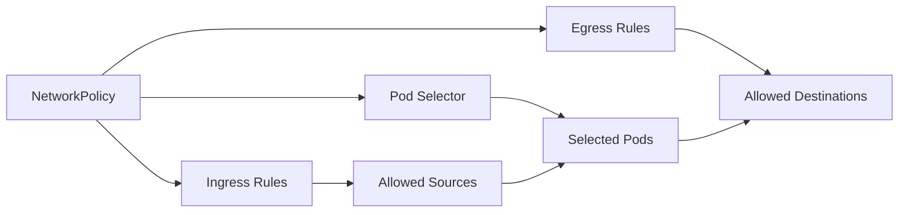
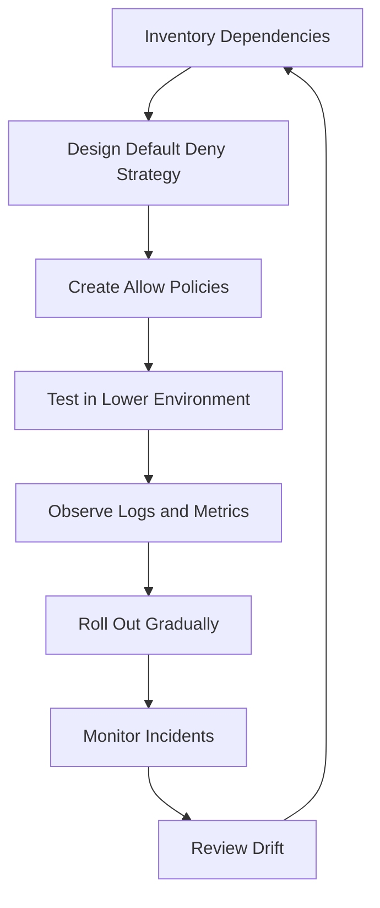

# Part 021 — NetworkPolicy and Microsegmentation

NetworkPolicy adalah mekanisme Kubernetes untuk membatasi traffic antar Pod dan dari Pod ke tujuan lain. Untuk backend engineer, NetworkPolicy bukan sekadar fitur security. Ia adalah cara membuat dependency graph aplikasi menjadi eksplisit.

Tanpa NetworkPolicy, banyak cluster berjalan dengan model implicit trust: setiap Pod bisa mencoba bicara ke banyak service lain selama routing dan DNS memungkinkan. Itu nyaman untuk development, tetapi berbahaya untuk production enterprise system. Satu service yang compromised dapat menjadi pivot ke PostgreSQL, Kafka, RabbitMQ, Redis, internal API, metadata endpoint, atau cloud service lain.

Microsegmentation adalah disiplin membagi network access menjadi zona kecil berbasis workload, namespace, label, dan dependency nyata. Prinsipnya sederhana: workload hanya boleh bicara ke tujuan yang memang dibutuhkan untuk menjalankan fungsi bisnisnya.

Dalam konteks Java/JAX-RS enterprise systems, NetworkPolicy membantu menjawab pertanyaan berikut:

- service ini boleh menerima request dari siapa?
- service ini boleh memanggil service mana?
- service ini boleh keluar ke PostgreSQL, Kafka, RabbitMQ, Redis, Camunda, atau cloud endpoint mana?
- apakah DNS tetap diizinkan?
- apakah debug tool, migration job, atau batch worker punya akses yang terlalu luas?
- jika service compromised, seberapa jauh blast radius-nya?

> CSG note: jangan mengasumsikan CSG sudah memakai NetworkPolicy, default deny, CNI tertentu, atau microsegmentation model tertentu. Semua detail tersebut harus diverifikasi ke platform/SRE/security/backend team.

---

## 1. Core Concept

NetworkPolicy mendefinisikan aturan traffic yang berlaku pada Pod yang dipilih oleh label selector.

Konsep pentingnya:



NetworkPolicy bekerja pada level Pod, bukan level Java class, endpoint JAX-RS, REST route, atau business capability. Ia tidak tahu bahwa `/quotes/{id}` berbeda dari `/orders/{id}`. Ia hanya tahu traffic network: source, destination, port, protocol, namespace, pod label, dan IP block.

Artinya NetworkPolicy adalah network guardrail. Authorization business tetap harus ada di aplikasi.

---

## 2. Why NetworkPolicy Exists

Kubernetes membuat komunikasi antar Pod sangat mudah. Service discovery, flat pod network, dan DNS membuat microservices bisa saling menemukan. Tetapi kemudahan ini memiliki risiko.

Tanpa pembatasan:

- semua service bisa mencoba connect ke semua service lain,
- service non-sensitive bisa mencoba connect ke database sensitive,
- debug pod bisa menjadi jump host,
- namespace antar environment bisa bocor jika tidak diisolasi,
- credential leakage menjadi lebih berbahaya karena network path terbuka,
- lateral movement menjadi mudah saat ada compromise.

NetworkPolicy ada untuk mengubah model dari:

```text
Everything can talk unless blocked
```

menjadi:

```text
Nothing can talk unless explicitly allowed
```

Untuk sistem quote/order enterprise, ini penting karena service biasanya menyentuh data customer, pricing, catalog, order, workflow, event stream, audit, dan integration endpoint.

---

## 3. NetworkPolicy Is Enforced by CNI

Kubernetes API menyediakan object NetworkPolicy, tetapi enforcement dilakukan oleh CNI plugin.

Implikasinya penting:

- membuat NetworkPolicy object tidak otomatis berarti policy benar-benar enforced,
- beberapa CNI tidak mendukung NetworkPolicy penuh,
- behavior dapat berbeda antara EKS, AKS, on-prem, atau managed CNI,
- debugging harus memperhatikan CNI yang digunakan.

Pertanyaan wajib:

```text
Apakah cluster CSG menggunakan CNI yang enforce NetworkPolicy?
```

Jika jawabannya tidak, maka manifest NetworkPolicy hanya menjadi object dekoratif tanpa proteksi nyata.

---

## 4. Ingress Rule vs Egress Rule

NetworkPolicy punya dua arah utama.

### 4.1 Ingress Rule

Ingress rule mengatur siapa yang boleh masuk ke selected Pod.

Contoh mental model:

```text
Selected Pod: quote-api
Allowed ingress:
- dari ingress-controller namespace ke port 8080
- dari internal gateway ke port 8080
- dari monitoring namespace ke metrics port jika diperlukan
```

Ingress di sini bukan Kubernetes Ingress object. Ingress rule berarti traffic masuk ke Pod.

### 4.2 Egress Rule

Egress rule mengatur ke mana selected Pod boleh keluar.

Contoh mental model:

```text
Selected Pod: quote-api
Allowed egress:
- CoreDNS untuk DNS resolution
- pricing-service port 8080
- PostgreSQL port 5432
- Redis port 6379 jika memang dipakai
- Kafka bootstrap broker port tertentu
- cloud private endpoint tertentu
```

Banyak outage NetworkPolicy terjadi karena egress DNS dilupakan. Aplikasi terlihat tidak bisa connect ke database, padahal akar masalahnya DNS lookup gagal.

---

## 5. Selector Model

NetworkPolicy menggunakan selector. Ini membuat label governance sangat penting.

Tipe selector umum:

- `podSelector`
- `namespaceSelector`
- kombinasi `namespaceSelector` + `podSelector`
- `ipBlock`

Contoh risiko selector:

```yaml
podSelector: {}
```

Di konteks policy, selector kosong bisa berarti semua Pod di namespace tersebut. Ini valid, tetapi harus disengaja.

Contoh risiko lain:

```yaml
namespaceSelector: {}
```

Ini bisa berarti semua namespace. Dalam production, ini harus sangat hati-hati.

Label yang buruk membuat policy buruk. Jika label `app`, `component`, `tier`, `environment`, atau `team` tidak konsisten, NetworkPolicy menjadi sulit dipercaya.

---

## 6. Default Deny Pattern

Default deny adalah pola microsegmentation paling penting.

### 6.1 Default Deny Ingress

```yaml
apiVersion: networking.k8s.io/v1
kind: NetworkPolicy
metadata:
  name: default-deny-ingress
spec:
  podSelector: {}
  policyTypes:
    - Ingress
```

Artinya semua Pod di namespace tidak menerima ingress traffic kecuali ada policy lain yang mengizinkan.

### 6.2 Default Deny Egress

```yaml
apiVersion: networking.k8s.io/v1
kind: NetworkPolicy
metadata:
  name: default-deny-egress
spec:
  podSelector: {}
  policyTypes:
    - Egress
```

Artinya semua Pod di namespace tidak boleh keluar ke mana pun kecuali ada policy lain yang mengizinkan.

### 6.3 Production Reality

Default deny sangat bagus untuk security, tetapi bisa menyebabkan outage jika diterapkan tanpa dependency inventory.

Sebelum default deny:

- identifikasi semua inbound caller,
- identifikasi semua outbound dependency,
- validasi DNS egress,
- validasi observability scraping/logging path,
- validasi cloud SDK call,
- validasi migration job,
- validasi support/debug workflow.

---

## 7. Allow Required Ingress for Java/JAX-RS API

Misalkan ada service `quote-api` dengan REST endpoint di port 8080.

Policy yang sehat biasanya tidak mengizinkan semua namespace. Ia hanya mengizinkan source tertentu.

Contoh konseptual:

```yaml
apiVersion: networking.k8s.io/v1
kind: NetworkPolicy
metadata:
  name: quote-api-allow-ingress
spec:
  podSelector:
    matchLabels:
      app: quote-api
  policyTypes:
    - Ingress
  ingress:
    - from:
        - namespaceSelector:
            matchLabels:
              platform.csg.io/purpose: ingress
      ports:
        - protocol: TCP
          port: 8080
```

Hal yang perlu dipahami:

- policy memilih Pod tujuan dengan `podSelector`,
- `from` menentukan sumber yang boleh masuk,
- `ports` menentukan port tujuan di Pod,
- label namespace harus benar,
- jika ingress controller berada di namespace berbeda, namespaceSelector harus cocok.

Untuk JAX-RS, NetworkPolicy tidak menggantikan authentication/authorization. Ia hanya membatasi siapa yang bisa mencapai socket aplikasi.

---

## 8. Allow DNS Egress

DNS adalah dependency tersembunyi hampir semua aplikasi.

Tanpa DNS egress, aplikasi bisa gagal dengan error seperti:

```text
UnknownHostException
Temporary failure in name resolution
Name or service not known
Connection timeout after DNS lookup
```

Contoh konseptual allow DNS egress:

```yaml
apiVersion: networking.k8s.io/v1
kind: NetworkPolicy
metadata:
  name: quote-api-allow-dns-egress
spec:
  podSelector:
    matchLabels:
      app: quote-api
  policyTypes:
    - Egress
  egress:
    - to:
        - namespaceSelector:
            matchLabels:
              kubernetes.io/metadata.name: kube-system
          podSelector:
            matchLabels:
              k8s-app: kube-dns
      ports:
        - protocol: UDP
          port: 53
        - protocol: TCP
          port: 53
```

Catatan penting:

- label CoreDNS bisa berbeda antar cluster,
- namespace DNS bisa berbeda pada platform tertentu,
- beberapa environment memakai NodeLocal DNSCache,
- policy harus diverifikasi terhadap implementasi real.

---

## 9. Database Egress

Java service yang memakai PostgreSQL perlu egress ke endpoint database.

Jika PostgreSQL berada di cluster, policy bisa memakai namespace/pod selector.

Jika PostgreSQL berada di managed cloud atau on-prem, policy mungkin memakai IPBlock, private endpoint CIDR, atau CNI-specific policy.

Risiko utama:

- membuka egress ke seluruh CIDR terlalu luas,
- mengizinkan semua Pod connect ke database,
- lupa port read-replica vs primary,
- DNS private endpoint berubah,
- failover database membuat IP berubah,
- policy berbasis IP tidak tahan terhadap perubahan endpoint.

Untuk PostgreSQL:

```text
Typical port: TCP 5432
But verify internal standard.
```

Review question:

```text
Apakah hanya service yang benar-benar membutuhkan database yang punya egress ke database?
```

---

## 10. Kafka and RabbitMQ Egress

Messaging dependency sering lebih kompleks daripada database biasa.

### Kafka

Kafka client biasanya connect ke bootstrap broker, lalu menerima metadata broker lain. Jika advertised listener mengarah ke beberapa broker/hostname, policy harus mengizinkan semua endpoint yang diperlukan.

Failure mode umum:

- bootstrap reachable tetapi broker advertised tidak reachable,
- DNS broker gagal,
- TLS/SASL endpoint berbeda,
- NetworkPolicy hanya mengizinkan satu broker,
- egress port salah,
- broker berada di private endpoint yang DNS-nya berbeda antar environment.

### RabbitMQ

RabbitMQ biasanya memakai AMQP port dan kadang management port. Workload consumer harus punya egress ke broker. Tetapi tidak semua service perlu management port.

Review question:

```text
Apakah policy membedakan runtime broker access dan admin/management access?
```

Jangan memberi akses RabbitMQ management UI/API ke semua workload.

---

## 11. Redis Egress

Redis sering terlihat sederhana, tetapi berbahaya jika terbuka terlalu luas.

Risiko:

- service lain membaca cache key yang bukan miliknya,
- cache berisi data sensitif,
- Redis dipakai sebagai lock/session/state store,
- command destructive bisa dijalankan dari workload yang compromised,
- TLS/auth berbeda antar environment.

NetworkPolicy tidak memahami command Redis. Ia hanya membatasi koneksi. Authorization dan namespacing key tetap harus dirancang di aplikasi/platform.

---

## 12. Cloud Service Egress

Pod yang memanggil AWS/Azure service membutuhkan kombinasi:

- identity benar,
- DNS benar,
- route benar,
- TLS benar,
- egress policy benar,
- proxy jika digunakan,
- private endpoint jika dipakai.

NetworkPolicy egress ke cloud service bisa sulit karena endpoint IP dapat berubah, terutama public endpoint. Karena itu enterprise setup sering memakai:

- private endpoint,
- VPC endpoint,
- PrivateLink,
- private DNS,
- egress gateway,
- firewall/proxy controlled path.

Untuk Java service, error yang muncul bisa misleading:

```text
SdkClientException
ConnectTimeoutException
UnknownHostException
SSLHandshakeException
AccessDeniedException
```

AccessDenied biasanya identity/IAM. Timeout bisa network policy, route, SG/NSG, firewall, proxy, DNS, atau endpoint.

---

## 13. NetworkPolicy and NGINX / Ingress Controller

Jika traffic masuk dari NGINX Ingress Controller, Pod aplikasi harus mengizinkan ingress dari Pod ingress controller.

Yang perlu diverifikasi:

- namespace ingress controller,
- label Pod ingress controller,
- port tujuan aplikasi,
- apakah ingress controller menggunakan hostNetwork,
- apakah source terlihat sebagai Pod IP, node IP, atau LB path tertentu,
- apakah policy engine mendukung model tersebut.

Failure umum:

```text
Ingress returns 502/503 because backend Pod is reachable by Service but blocked by NetworkPolicy.
```

Atau:

```text
Readiness passes, Service has endpoints, but ingress controller cannot connect to Pod.
```

---

## 14. Namespace Boundary Is Not Security by Itself

Namespace membantu organisasi resource, tetapi namespace saja bukan security boundary absolut.

Tanpa NetworkPolicy dan RBAC yang benar:

- Pod di namespace A bisa connect ke Service di namespace B,
- user dengan permission luas bisa membaca secret namespace lain,
- service account bisa terlalu powerful,
- shared ingress/gateway bisa membuka traffic tak disengaja.

Microsegmentation harus dipadukan dengan:

- namespace standard,
- RBAC least privilege,
- secret isolation,
- service account isolation,
- admission policy,
- observability dan audit.

---

## 15. Policy Lifecycle

Lifecycle NetworkPolicy production biasanya seperti ini:



Jangan memulai dari menulis YAML. Mulai dari dependency inventory.

Dependency inventory untuk Java/JAX-RS service minimal mencakup:

- inbound caller,
- outbound REST service,
- PostgreSQL,
- Kafka,
- RabbitMQ,
- Redis,
- Camunda endpoint/worker dependency,
- DNS,
- observability collector,
- cloud SDK endpoint,
- secret/config provider,
- identity/token endpoint jika relevan.

---

## 16. Failure Modes

### 16.1 DNS Blocked

Symptom:

- `UnknownHostException`,
- service name tidak resolve,
- cloud endpoint tidak resolve,
- startup gagal saat aplikasi resolve dependency.

Likely cause:

- DNS egress tidak diizinkan,
- CoreDNS label selector salah,
- NodeLocal DNSCache tidak dipertimbangkan.

### 16.2 Service Reachable by DNS but Connection Timeout

Symptom:

- hostname resolve,
- connect timeout,
- ingress 502/504,
- Java HTTP client timeout.

Likely cause:

- egress blocked,
- ingress target blocked,
- wrong port,
- service endpoint salah,
- security group/firewall di luar cluster.

### 16.3 Kafka Bootstrap Works but Consumer Still Fails

Symptom:

- bootstrap connection berhasil,
- metadata diterima,
- broker lain unreachable.

Likely cause:

- policy hanya allow bootstrap,
- advertised listener mengarah ke hostname/IP lain,
- TLS/SASL endpoint berbeda.

### 16.4 Ingress 503 Despite Ready Pods

Symptom:

- Pod ready,
- Service has endpoints,
- ingress returns 503.

Likely cause:

- ingress controller blocked by policy,
- backend protocol mismatch,
- wrong targetPort,
- source namespace selector salah.

### 16.5 Cloud SDK Timeout

Symptom:

- AWS/Azure SDK timeout,
- no clear access denied,
- retry storm.

Likely cause:

- egress blocked,
- private endpoint DNS issue,
- proxy/firewall issue,
- VPC/NSG/security group issue.

---

## 17. Debugging Workflow

Gunakan urutan berikut.

### Step 1 — Confirm Pod Selection

```bash
kubectl get pod -n <namespace> --show-labels
kubectl get networkpolicy -n <namespace>
kubectl describe networkpolicy -n <namespace> <policy-name>
```

Pertanyaan:

- apakah policy memilih Pod yang dimaksud?
- apakah ada default deny?
- apakah ada policy lain yang juga berlaku?

NetworkPolicy bersifat additive. Jika ada beberapa policy yang memilih Pod yang sama, allowed traffic adalah gabungan allow rules.

### Step 2 — Confirm DNS

```bash
kubectl exec -n <namespace> <pod> -- nslookup <service-name>
kubectl exec -n <namespace> <pod> -- getent hosts <service-name>
```

Jika image aplikasi tidak punya tool, gunakan ephemeral debug container jika policy memungkinkan.

### Step 3 — Confirm TCP Connectivity

```bash
kubectl exec -n <namespace> <pod> -- nc -vz <host> <port>
```

Jika `nc` tidak tersedia, gunakan debug image sesuai policy internal.

### Step 4 — Confirm Service Endpoints

```bash
kubectl get svc -n <namespace>
kubectl get endpointslice -n <namespace>
kubectl describe svc -n <namespace> <service-name>
```

Jangan langsung menyalahkan NetworkPolicy jika Service tidak punya endpoint.

### Step 5 — Confirm CNI/Policy Logs

Beberapa CNI menyediakan flow logs atau policy verdict logs. Ini sangat membantu untuk melihat traffic `DENY`.

Internal verification wajib:

```text
Apakah platform menyediakan network flow log atau policy decision log?
```

---

## 18. EKS Considerations

Di EKS, detail enforcement tergantung CNI dan network policy engine yang digunakan.

Hal yang perlu diverifikasi:

- apakah memakai Amazon VPC CNI saja atau dengan NetworkPolicy support,
- apakah memakai Calico/Cilium/add-on policy engine,
- apakah Pod IP berasal dari VPC CIDR,
- bagaimana Security Group for Pods digunakan jika ada,
- bagaimana ALB/NLB source traffic terlihat ke Pod,
- apakah egress ke AWS services lewat public endpoint, NAT, VPC Endpoint, atau PrivateLink.

EKS-specific risk:

- membuka egress ke semua VPC CIDR terlalu luas,
- lupa allow egress ke VPC endpoint,
- SG/NACL memblokir meski NetworkPolicy allow,
- NetworkPolicy allow tetapi IAM/IRSA deny.

NetworkPolicy bukan pengganti Security Group atau IAM. Semua layer harus konsisten.

---

## 19. AKS Considerations

Di AKS, enforcement juga tergantung network plugin dan policy engine.

Hal yang perlu diverifikasi:

- Azure CNI atau kubenet,
- network policy engine yang dipakai,
- NSG dan UDR,
- Azure Firewall/proxy,
- Private Endpoint dan Private DNS Zone,
- Application Gateway/AGIC source path,
- Workload Identity access ke Azure services.

AKS-specific risk:

- NetworkPolicy allow tetapi NSG deny,
- DNS private endpoint salah,
- UDR mengirim traffic ke firewall yang memblokir,
- egress ke Azure service melewati path yang tidak diharapkan.

---

## 20. On-Prem and Hybrid Considerations

Di on-prem/hybrid, NetworkPolicy harus dipahami bersama enterprise firewall dan routing.

Hal yang sering terjadi:

- policy allow tetapi firewall deny,
- firewall allow tetapi policy deny,
- DNS split-horizon mengarah ke IP berbeda,
- proxy wajib tetapi aplikasi tidak dikonfigurasi proxy,
- MTU issue menyebabkan koneksi aneh,
- TLS trust chain berbeda antara cloud dan on-prem.

Untuk hybrid, jangan hanya bertanya “apakah port terbuka?”. Tanyakan:

```text
Dari Pod mana, namespace apa, node mana, lewat route mana, DNS apa, menuju IP mana, port apa, dan firewall rule mana?
```

---

## 21. Correctness Concerns

NetworkPolicy dapat memengaruhi correctness karena aplikasi mungkin bergantung pada dependency yang tiba-tiba unreachable.

Contoh:

- quote calculation gagal karena pricing service blocked,
- order submission stuck karena Kafka blocked,
- idempotency check gagal karena Redis blocked,
- workflow worker tidak bisa connect ke Camunda,
- migration job tidak bisa connect ke PostgreSQL,
- retry storm terjadi karena egress cloud blocked.

Correctness review harus memastikan policy tidak hanya aman, tetapi juga sesuai dependency graph yang benar.

---

## 22. Performance Concerns

NetworkPolicy biasanya bukan bottleneck utama, tetapi policy engine dan observability dapat memengaruhi performance.

Pertimbangan:

- policy terlalu banyak dan kompleks,
- selector tidak terstandar,
- CNI dataplane iptables/IPVS/eBPF berbeda,
- flow logging terlalu verbose,
- egress via proxy/firewall menambah latency,
- private endpoint routing berbeda per zone.

Untuk Java service, timeout dan connection pool harus disesuaikan dengan real network path.

---

## 23. Security and Privacy Concerns

NetworkPolicy membantu mengurangi blast radius, tetapi tidak mengenkripsi traffic dan tidak melakukan identity-aware authorization.

Tetap butuh:

- TLS/mTLS jika diperlukan,
- application authz,
- RBAC,
- secret management,
- audit logs,
- secure ingress,
- least privilege IAM/cloud identity.

Privacy concern:

- jangan izinkan workload non-authorized connect ke data service yang menyimpan PII,
- jangan izinkan broad egress ke logging/debug destination yang dapat menerima data sensitif,
- jangan mengandalkan network isolation untuk menggantikan data access control.

---

## 24. Cost Concerns

NetworkPolicy dapat memengaruhi cost secara tidak langsung.

Contoh:

- egress dipaksa lewat NAT Gateway mahal,
- cloud service call tidak memakai private endpoint,
- retry storm karena blocked network meningkatkan load,
- observability flow logs terlalu verbose,
- traffic hairpin lewat firewall/proxy mahal.

Cost-aware review harus melihat traffic path, bukan hanya policy YAML.

---

## 25. Observability Concerns

NetworkPolicy sulit di-debug tanpa observability network.

Minimal butuh:

- Kubernetes events,
- application connection error logs,
- ingress controller logs,
- DNS metrics,
- CNI flow logs jika tersedia,
- firewall/security group logs,
- cloud private endpoint metrics,
- dashboard untuk connection timeout/error rate.

Aplikasi Java sebaiknya log connection failure dengan dependency name, bukan hanya stacktrace generic.

Contoh log yang lebih berguna:

```json
{
  "event": "dependency_call_failed",
  "dependency": "pricing-service",
  "target": "pricing-service.quote.svc.cluster.local:8080",
  "failureType": "CONNECT_TIMEOUT",
  "timeoutMs": 2000,
  "correlationId": "..."
}
```

---

## 26. PR Review Checklist

Gunakan checklist berikut saat review NetworkPolicy.

### Scope

- [ ] Policy memilih Pod yang benar.
- [ ] Namespace target benar.
- [ ] Label selector tidak terlalu luas.
- [ ] `podSelector: {}` disengaja dan terdokumentasi.
- [ ] `namespaceSelector: {}` tidak dipakai sembarangan.

### Ingress

- [ ] Hanya caller yang valid diizinkan.
- [ ] Ingress controller/gateway diizinkan jika diperlukan.
- [ ] Monitoring scraper diizinkan hanya ke port yang benar.
- [ ] Port aplikasi dan management port dibedakan.

### Egress

- [ ] DNS egress diizinkan.
- [ ] PostgreSQL/Kafka/RabbitMQ/Redis egress sesuai kebutuhan.
- [ ] Cloud service egress sesuai endpoint private/public yang benar.
- [ ] Egress tidak dibuka ke `0.0.0.0/0` tanpa alasan kuat.
- [ ] External API/proxy/firewall path dipahami.

### Failure and Operations

- [ ] Ada cara debug connectivity.
- [ ] Ada observability untuk denied traffic atau timeout.
- [ ] Rollout policy dilakukan bertahap.
- [ ] Ada rollback plan.
- [ ] Dependency inventory sudah divalidasi owner service.

---

## 27. Internal Verification Checklist

Verifikasi hal berikut di internal CSG/team:

- [ ] Apakah cluster menggunakan NetworkPolicy?
- [ ] CNI apa yang dipakai?
- [ ] Apakah NetworkPolicy benar-benar enforced?
- [ ] Apakah ada default deny namespace?
- [ ] Apakah ada standard label namespace/pod?
- [ ] Apakah ada policy template untuk REST service?
- [ ] Apakah ada policy template untuk consumer/worker/job?
- [ ] Bagaimana egress DNS diizinkan?
- [ ] Bagaimana egress PostgreSQL diizinkan?
- [ ] Bagaimana egress Kafka/RabbitMQ/Redis diizinkan?
- [ ] Bagaimana akses ke Camunda/workflow engine diatur?
- [ ] Bagaimana egress cloud service diatur?
- [ ] Apakah memakai private endpoint/VPC endpoint?
- [ ] Apakah ada egress gateway/proxy/firewall?
- [ ] Apakah ada flow logs atau CNI policy logs?
- [ ] Siapa owner policy: platform, security, atau service team?
- [ ] Bagaimana emergency bypass dilakukan?
- [ ] Apakah bypass diaudit?
- [ ] Apakah ada incident sebelumnya akibat NetworkPolicy?

---

## 28. Mental Model Final

NetworkPolicy bukan sekadar security YAML. Ia adalah executable dependency boundary.

Untuk senior backend engineer, pertanyaan utamanya:

```text
Apakah network access service ini sesuai dependency graph bisnis dan operasionalnya?
```

Jika jawabannya tidak jelas, production risk masih tinggi.

NetworkPolicy yang baik memiliki karakteristik:

- eksplisit,
- minimal,
- bisa dijelaskan,
- bisa di-debug,
- selaras dengan label governance,
- selaras dengan RBAC/secret/IAM,
- selaras dengan EKS/AKS/on-prem network path,
- tidak memutus observability,
- punya rollback path.

NetworkPolicy yang buruk biasanya terlalu luas, tidak diuji, tidak punya dependency inventory, dan baru dipahami saat production outage.
