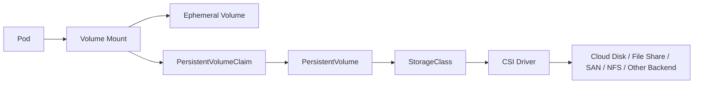
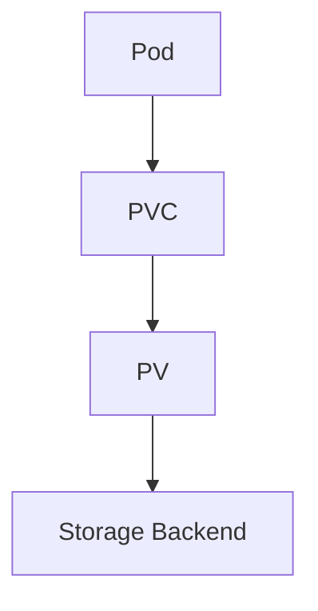
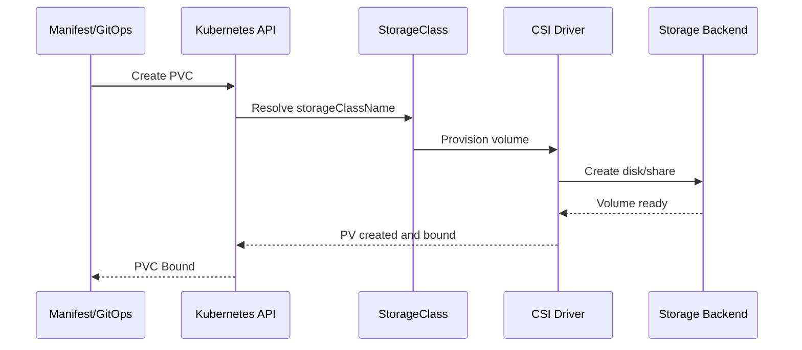

# Part 022 — Kubernetes Storage Foundation

Kubernetes storage adalah area yang sering diremehkan oleh backend engineer karena banyak service terlihat stateless. Namun di production, hampir semua sistem enterprise tetap menyentuh storage dalam beberapa bentuk: database, queue, cache, file temporary, uploaded artifact, migration output, log buffer, certificate, config volume, secret volume, atau persistent workflow state.

Untuk Java/JAX-RS service, storage concern tidak selalu berarti “aplikasi menyimpan file ke disk”. Storage concern juga muncul saat container butuh writable temp directory, JVM menulis heap dump, library membuat cache lokal, TLS truststore dimount, config dimount sebagai file, atau batch job menghasilkan output sementara.

Kubernetes storage harus dipahami dengan hati-hati karena Pod bersifat ephemeral. Jika Pod mati, reschedule, atau node hilang, storage lokal di container bisa hilang. Persistent storage di Kubernetes disediakan melalui abstraction layer: Volume, PersistentVolume, PersistentVolumeClaim, StorageClass, dan CSI driver.

> CSG note: jangan mengasumsikan database, Kafka, RabbitMQ, Redis, atau Camunda stateful dependency dijalankan di Kubernetes. Bisa saja memakai managed service, VM, appliance, on-prem platform, atau operator. Semua detail harus diverifikasi internal.

---

## 1. Core Concept

Kubernetes memisahkan workload lifecycle dari storage lifecycle.

Pod bisa datang dan pergi. Storage bisa bersifat ephemeral atau persistent.



Mental model utama:

```text
Container filesystem is not durable by default.
Pod lifecycle is not storage lifecycle.
PVC is the workload request for persistent storage.
PV is the cluster representation of provisioned storage.
StorageClass defines how storage is provisioned.
CSI driver connects Kubernetes to real storage backend.
```

---

## 2. Why Kubernetes Storage Exists

Kubernetes awalnya sangat kuat untuk stateless workloads, tetapi real systems membutuhkan state.

Storage abstraction ada agar workload bisa meminta storage tanpa tahu detail backend fisik/cloud.

Tanpa abstraction:

- aplikasi harus tahu disk/cloud API langsung,
- deployment tidak portable,
- provisioning manual,
- lifecycle disk tidak terhubung dengan workload,
- backup/restore sulit distandardisasi,
- environment parity buruk.

Dengan Kubernetes storage:

- service meminta PVC,
- platform menyediakan StorageClass,
- CSI driver melakukan provisioning,
- Pod mount volume,
- lifecycle bisa dikontrol melalui reclaim policy dan binding.

Namun abstraction tidak menghapus real-world storage trade-off: latency, IOPS, durability, zone affinity, backup, restore, corruption, permission, dan cost tetap nyata.

---

## 3. Volume

Volume adalah directory yang dapat di-mount ke container dalam Pod.

Volume bisa ephemeral atau persistent.

Contoh tipe volume:

- `emptyDir`
- `configMap`
- `secret`
- `projected`
- `persistentVolumeClaim`
- `hostPath`
- CSI volume

Volume berada pada level Pod, bukan container. Beberapa container dalam Pod yang sama bisa mount volume yang sama.

Untuk sidecar pattern, ini sering dipakai untuk berbagi file antara app container dan sidecar.

---

## 4. Container Filesystem Is Ephemeral

Filesystem container berasal dari image layer plus writable layer runtime. Writable layer container tidak boleh diperlakukan sebagai durable storage.

Jika container restart, data tertentu mungkin masih ada selama Pod sama. Tetapi jika Pod diganti atau reschedule ke node lain, data hilang.

Anti-pattern:

```text
Java service writes business-critical data to local container filesystem.
```

Contoh risiko:

- generated quote document disimpan lokal lalu Pod mati,
- reconciliation checkpoint disimpan lokal,
- migration status disimpan lokal,
- uploaded file disimpan lokal sebelum diproses async,
- worker lock file disimpan lokal sebagai coordination mechanism.

Jika data penting, gunakan storage yang memang durable atau external system yang sesuai.

---

## 5. emptyDir

`emptyDir` adalah volume ephemeral yang dibuat saat Pod ditempatkan di node dan dihapus saat Pod dihapus dari node.

Use case yang valid:

- temporary file,
- scratch space,
- shared file antara init container dan app container,
- temporary cache yang boleh hilang,
- file generated selama request jika tidak perlu durable.

Risiko:

- memakai `emptyDir` untuk data penting,
- tidak membatasi size,
- memakai disk node sampai node pressure,
- menulis heap dump besar tanpa limit,
- temp file leak.

Contoh konseptual:

```yaml
volumes:
  - name: tmp
    emptyDir:
      sizeLimit: 1Gi
containers:
  - name: app
    volumeMounts:
      - name: tmp
        mountPath: /tmp
```

Untuk Java, `emptyDir` sering relevan jika root filesystem dibuat read-only dan aplikasi tetap butuh `/tmp` writable.

---

## 6. ConfigMap Volume

ConfigMap dapat dimount sebagai file.

Use case:

- application config file,
- truststore reference config,
- routing config,
- feature config non-secret,
- framework config.

Kelebihan file mount:

- cocok untuk aplikasi yang membaca file,
- bisa memisahkan config dari image,
- lebih mudah untuk config multi-line.

Risiko:

- aplikasi tidak otomatis reload config,
- perubahan ConfigMap tidak selalu dipahami lifecycle-nya,
- environment drift,
- config sensitive salah taruh di ConfigMap.

ConfigMap bukan tempat secret.

---

## 7. Secret Volume

Secret juga bisa dimount sebagai file.

Use case:

- certificate,
- private key,
- password file,
- token,
- TLS material,
- truststore/keystore material.

Secret volume biasanya lebih baik daripada secret environment variable untuk material yang harus dibaca sebagai file, karena env var mudah terekspos melalui process environment dump.

Tetapi Secret volume tetap bukan magic security. Harus dipadukan dengan:

- Kubernetes Secret encryption at rest,
- RBAC least privilege,
- secret rotation,
- external secret manager jika digunakan,
- log hygiene,
- file permission.

---

## 8. Projected Volume

Projected volume menggabungkan beberapa source ke satu mount.

Source bisa berupa:

- Secret,
- ConfigMap,
- Downward API,
- service account token.

Use case:

- mount config + token + metadata dalam satu directory,
- workload identity token projection,
- exposing pod metadata ke aplikasi.

Risiko:

- token audience/expiration salah,
- aplikasi cache token terlalu lama,
- permission file terlalu longgar,
- observability/debug tool menampilkan isi sensitive.

---

## 9. PersistentVolume and PersistentVolumeClaim

PersistentVolumeClaim adalah request storage dari workload.

PersistentVolume adalah storage resource aktual di cluster.



PVC mendeklarasikan:

- ukuran storage,
- access mode,
- storage class,
- volume mode,
- selector jika diperlukan.

Contoh sederhana:

```yaml
apiVersion: v1
kind: PersistentVolumeClaim
metadata:
  name: app-data
spec:
  accessModes:
    - ReadWriteOnce
  storageClassName: standard
  resources:
    requests:
      storage: 10Gi
```

Pod kemudian mount PVC:

```yaml
volumes:
  - name: app-data
    persistentVolumeClaim:
      claimName: app-data
containers:
  - name: app
    volumeMounts:
      - name: app-data
        mountPath: /data
```

---

## 10. StorageClass

StorageClass mendefinisikan bagaimana persistent storage dibuat.

Ia biasanya mengikat Kubernetes ke backend seperti:

- AWS EBS,
- AWS EFS,
- Azure Disk,
- Azure Files,
- vSphere volume,
- NFS,
- SAN,
- custom CSI backend.

StorageClass dapat mengatur:

- provisioner,
- disk type,
- reclaim policy,
- volume binding mode,
- expansion,
- parameters backend.

Contoh konseptual:

```yaml
apiVersion: storage.k8s.io/v1
kind: StorageClass
metadata:
  name: fast-ssd
provisioner: ebs.csi.aws.com
reclaimPolicy: Delete
volumeBindingMode: WaitForFirstConsumer
allowVolumeExpansion: true
```

Backend-specific parameters harus diverifikasi terhadap platform internal.

---

## 11. Access Modes

Access mode mendefinisikan bagaimana volume bisa dimount.

Umum:

- `ReadWriteOnce` atau RWO
- `ReadOnlyMany` atau ROX
- `ReadWriteMany` atau RWX
- `ReadWriteOncePod` atau RWOP jika tersedia/support

### ReadWriteOnce

Volume dapat dimount read-write oleh satu node. Banyak cloud block disk memakai model ini.

Cocok untuk:

- single-writer workload,
- StatefulSet replica dengan PVC per replica,
- database single primary jika didesain benar.

### ReadWriteMany

Volume dapat dimount read-write oleh banyak node.

Cocok untuk:

- shared file workload,
- beberapa batch worker yang butuh shared filesystem,
- content repository tertentu.

Risiko RWX:

- file locking,
- consistency,
- latency,
- throughput,
- permission,
- accidental concurrent write.

Jangan menganggap RWX sama dengan database concurrency control.

---

## 12. Reclaim Policy

Reclaim policy menentukan apa yang terjadi pada PV saat PVC dilepas.

Umum:

- `Delete`
- `Retain`

### Delete

Storage backend dihapus saat PVC dihapus. Cocok untuk ephemeral-ish persistent data atau environment non-prod tertentu.

Risiko:

- data production bisa hilang jika PVC terhapus,
- GitOps delete salah bisa destruktif.

### Retain

PV tetap ada setelah PVC dihapus. Cocok untuk data penting yang butuh manual recovery/inspection.

Risiko:

- orphaned volume,
- cost bocor,
- cleanup manual,
- data sensitive tertinggal.

Production stateful data harus memiliki kebijakan reclaim yang eksplisit dan dipahami.

---

## 13. Dynamic Provisioning

Dynamic provisioning membuat PV otomatis saat PVC dibuat.

Flow:



Keuntungan:

- self-service,
- konsisten,
- automation friendly,
- environment provisioning lebih mudah.

Risiko:

- storage dibuat terlalu mudah tanpa cost awareness,
- default StorageClass salah,
- reclaim policy tidak sesuai,
- volume zone binding salah,
- quota tidak dikontrol.

---

## 14. Volume Binding Mode

Dua mode penting:

- `Immediate`
- `WaitForFirstConsumer`

### Immediate

Volume diprovision segera saat PVC dibuat. Pada cloud multi-zone, ini bisa membuat volume berada di zone tertentu sebelum Pod dijadwalkan.

Risiko:

- Pod tidak bisa scheduled karena volume ada di zone berbeda.

### WaitForFirstConsumer

Volume diprovision setelah scheduler tahu Pod akan ditempatkan di mana.

Ini biasanya lebih aman untuk topology-aware storage.

Untuk EKS/AKS multi-zone, mode ini sangat penting untuk menghindari mismatch zone antara Pod dan volume.

---

## 15. CSI Driver

CSI atau Container Storage Interface adalah standard interface untuk storage provider.

CSI driver bertugas:

- provision volume,
- attach volume ke node,
- mount volume ke Pod,
- resize volume,
- snapshot jika supported,
- delete volume sesuai reclaim policy.

Failure CSI dapat menyebabkan:

- PVC Pending,
- Pod stuck ContainerCreating,
- volume attach timeout,
- mount permission denied,
- filesystem error,
- slow mount,
- node-specific storage issue.

Debugging storage harus melihat CSI controller dan node plugin logs jika tersedia.

---

## 16. HostPath Risk

`hostPath` mount path dari node host ke Pod.

Ini berbahaya karena membuka akses ke filesystem node.

Risiko:

- privilege escalation,
- data leakage antar workload,
- node coupling,
- tidak portable,
- Pod hanya benar di node tertentu,
- bypass isolation.

HostPath mungkin valid untuk DaemonSet platform-level tertentu, seperti logging agent atau node agent, tetapi jarang valid untuk aplikasi Java/JAX-RS biasa.

PR review question:

```text
Mengapa aplikasi backend biasa perlu hostPath?
```

Jika jawabannya tidak kuat, tolak atau eskalasi ke platform/security.

---

## 17. Storage and Java/JAX-RS Workloads

Banyak Java service terlihat stateless, tetapi tetap punya storage behavior.

Hal yang harus dicek:

- apakah aplikasi menulis ke `/tmp`?
- apakah aplikasi membuat local cache?
- apakah aplikasi menulis upload sementara?
- apakah aplikasi menghasilkan report/document?
- apakah JVM heap dump diaktifkan?
- apakah GC log ditulis ke file?
- apakah TLS keystore/truststore dimount?
- apakah config file dimount?
- apakah batch job menulis output lokal?

Jika root filesystem dibuat read-only, aplikasi harus punya writable mount untuk path yang memang dibutuhkan.

Contoh pattern:

```yaml
securityContext:
  readOnlyRootFilesystem: true
volumeMounts:
  - name: tmp
    mountPath: /tmp
volumes:
  - name: tmp
    emptyDir:
      sizeLimit: 512Mi
```

---

## 18. Storage and PostgreSQL/Kafka/RabbitMQ/Redis/Camunda

Stateful dependencies memiliki storage semantics yang jauh lebih berat daripada stateless REST service.

### PostgreSQL

Storage concern:

- durability,
- fsync,
- IOPS,
- latency,
- backup/restore,
- WAL,
- replication,
- failover,
- corruption handling.

### Kafka

Storage concern:

- log segments,
- retention,
- broker identity,
- disk throughput,
- replication factor,
- rebalance impact,
- data loss policy.

### RabbitMQ

Storage concern:

- durable queue,
- quorum queue/replication,
- disk alarm,
- message persistence,
- cluster recovery.

### Redis

Storage concern:

- cache vs durable mode,
- RDB/AOF,
- memory pressure,
- persistence expectation,
- eviction policy.

### Camunda-like Workloads

Storage concern:

- process state usually database-backed,
- job executor behavior,
- history/audit data,
- transaction boundary,
- external worker retry.

Senior engineer harus bertanya:

```text
Apakah storage semantics dependency ini cocok dijalankan di Kubernetes, atau lebih tepat managed service/platform khusus?
```

Part berikutnya akan membahas stateful workload lebih dalam.

---

## 19. EKS Storage Considerations

Di EKS, storage umum melibatkan:

- EBS CSI driver,
- EFS CSI driver,
- StorageClass untuk EBS/EFS,
- zone-aware scheduling,
- IAM permission untuk CSI driver,
- snapshot/backup integration,
- encryption using KMS jika dikonfigurasi.

EBS biasanya block storage dan cocok untuk RWO. EFS biasanya file storage dan dapat mendukung RWX dengan trade-off latency/throughput.

Hal yang perlu diverifikasi:

- StorageClass default,
- reclaim policy,
- volumeBindingMode,
- encryption,
- KMS key,
- snapshot policy,
- backup ownership,
- multi-AZ behavior.

---

## 20. AKS Storage Considerations

Di AKS, storage umum melibatkan:

- Azure Disk CSI,
- Azure Files CSI,
- StorageClass,
- managed identity permission,
- zone-aware disk,
- Azure Backup/snapshot integration,
- encryption settings.

Azure Disk biasanya cocok untuk RWO block storage. Azure Files bisa digunakan untuk RWX file sharing dengan trade-off performa dan semantics.

Hal yang perlu diverifikasi:

- StorageClass default,
- disk SKU,
- reclaim policy,
- volume expansion,
- zone behavior,
- backup/snapshot,
- private endpoint/storage account network rules jika Azure Files digunakan.

---

## 21. On-Prem Storage Considerations

On-prem Kubernetes storage sangat tergantung platform internal.

Kemungkinan backend:

- NFS,
- SAN,
- vSphere CSI,
- Ceph/Rook,
- Portworx,
- Longhorn,
- custom enterprise storage.

Risiko umum:

- performance tidak konsisten,
- attach/detach lambat,
- backup tidak jelas,
- snapshot tidak tersedia,
- RWX semantics tidak sesuai aplikasi,
- storage team dan platform team ownership terpisah.

Internal verification sangat penting di sini. Jangan mengasumsikan behavior cloud disk berlaku di on-prem.

---

## 22. Hybrid Storage Concerns

Hybrid storage lebih kompleks karena data locality dan network latency.

Pertanyaan penting:

- apakah workload di cloud mengakses storage on-prem?
- apakah workload on-prem mengakses managed database cloud?
- apakah backup cross-region/cross-site?
- apakah DNS dan routing stabil?
- apakah latency memengaruhi transaction timeout?
- apakah data residency membatasi lokasi storage?

Untuk Java service, remote storage latency bisa muncul sebagai:

- request latency spike,
- DB connection timeout,
- transaction timeout,
- slow batch job,
- queue consumer lag.

---

## 23. Failure Modes

### 23.1 PVC Pending

Symptom:

```text
PVC stays Pending.
Pod cannot start.
```

Likely causes:

- StorageClass tidak ada,
- provisioner/CSI driver gagal,
- quota habis,
- parameter StorageClass salah,
- cloud permission kurang,
- topology/zone issue.

Debug:

```bash
kubectl get pvc -n <namespace>
kubectl describe pvc -n <namespace> <pvc-name>
kubectl get storageclass
kubectl get events -n <namespace> --sort-by=.lastTimestamp
```

### 23.2 Pod Stuck ContainerCreating

Likely causes:

- volume attach gagal,
- mount gagal,
- permission denied,
- CSI node plugin issue,
- node cannot access backend storage.

Debug:

```bash
kubectl describe pod -n <namespace> <pod-name>
```

Lihat event seperti `FailedMount` atau `FailedAttachVolume`.

### 23.3 Data Lost After Pod Restart

Likely causes:

- data ditulis ke container filesystem,
- data ditulis ke emptyDir,
- PVC tidak dipakai,
- reclaim policy/delete event,
- application path salah.

### 23.4 Node Disk Pressure

Likely causes:

- emptyDir terlalu besar,
- log file lokal membesar,
- heap dump besar,
- temp file leak,
- image garbage collection issue.

Symptom:

- Pod evicted,
- node pressure event,
- application restart.

### 23.5 Permission Denied

Likely causes:

- container runAsUser tidak cocok ownership volume,
- fsGroup tidak diset,
- read-only volume,
- secret/config file permission,
- storage backend permission.

---

## 24. Debugging Workflow

### Step 1 — Identify Storage Type

```bash
kubectl get pod -n <namespace> <pod-name> -o yaml
```

Cari:

- `volumes`,
- `volumeMounts`,
- `persistentVolumeClaim`,
- `emptyDir`,
- `configMap`,
- `secret`,
- `hostPath`.

### Step 2 — Inspect PVC/PV

```bash
kubectl get pvc -n <namespace>
kubectl describe pvc -n <namespace> <pvc-name>
kubectl get pv
kubectl describe pv <pv-name>
```

Perhatikan:

- status,
- capacity,
- access mode,
- storage class,
- reclaim policy,
- events.

### Step 3 — Inspect StorageClass

```bash
kubectl get storageclass
kubectl describe storageclass <name>
```

Perhatikan:

- provisioner,
- reclaimPolicy,
- volumeBindingMode,
- allowVolumeExpansion,
- parameters.

### Step 4 — Inspect Pod Events

```bash
kubectl describe pod -n <namespace> <pod-name>
```

Cari:

- `FailedMount`,
- `FailedAttachVolume`,
- `MountVolume.SetUp failed`,
- permission denied,
- timeout.

### Step 5 — Inspect Application Path

Pastikan aplikasi menulis ke path yang benar.

```bash
kubectl exec -n <namespace> <pod-name> -- df -h
kubectl exec -n <namespace> <pod-name> -- mount
kubectl exec -n <namespace> <pod-name> -- ls -lah /path
```

Gunakan hanya jika sesuai policy internal production debugging.

---

## 25. Correctness Concerns

Storage salah bisa merusak correctness.

Contoh:

- migration job menulis checkpoint lokal lalu restart dan mengulang tidak idempotent,
- uploaded file hilang sebelum async processing,
- batch job menghasilkan output parsial,
- cache lokal dianggap source of truth,
- multiple replicas menulis ke volume shared tanpa locking benar,
- StatefulSet PVC tertukar karena manual operation.

Correctness rule:

```text
Jika data memengaruhi keputusan bisnis, jangan simpan di ephemeral storage tanpa recovery design.
```

---

## 26. Performance Concerns

Storage performance memengaruhi latency dan throughput.

Pertimbangan:

- IOPS,
- throughput,
- latency,
- filesystem type,
- network file system overhead,
- sync write behavior,
- fsync cost,
- volume attach/detach time,
- zone locality,
- noisy neighbor.

Untuk Java:

- logging ke file synchronous bisa lambat,
- heap dump ke disk bisa memenuhi volume,
- temp file besar bisa memperlambat request,
- local cache di disk bisa tidak predictable di Kubernetes,
- database latency jauh lebih penting daripada JVM tuning dalam beberapa kasus.

---

## 27. Security and Privacy Concerns

Storage sering menyimpan data sensitif.

Review:

- apakah volume encrypted at rest?
- siapa bisa membaca PVC/PV?
- apakah Secret dimount dengan permission aman?
- apakah heap dump bisa berisi PII/secret?
- apakah temp file berisi customer data?
- apakah retained PV menyimpan data setelah app dihapus?
- apakah backup mengandung data regulated?
- apakah data residency terpenuhi?

Heap dump dan debug artifact sangat berisiko karena dapat berisi token, password, payload customer, dan PII.

---

## 28. Cost Concerns

Storage cost sering tersembunyi.

Sumber cost:

- orphaned PV,
- Retain policy tanpa cleanup,
- oversized PVC,
- high-performance disk yang tidak perlu,
- snapshot retention,
- backup storage,
- cross-zone/cross-region traffic,
- RWX file storage,
- logs/heap dump/temp files.

Cost-aware checklist:

- request size realistis,
- expansion policy jelas,
- cleanup policy ada,
- snapshot retention sesuai,
- owner label ada,
- environment non-prod tidak memakai kelas storage production tanpa alasan.

---

## 29. Observability Concerns

Storage observability minimal:

- PVC usage,
- volume capacity,
- inode usage jika relevan,
- disk latency,
- disk throughput,
- attach/mount errors,
- node disk pressure,
- application file write errors,
- database/storage backend metrics,
- backup/snapshot success.

Application log harus membedakan:

- permission denied,
- disk full,
- path not found,
- read-only filesystem,
- timeout,
- corrupted file,
- dependency storage unavailable.

---

## 30. PR Review Checklist

### Volume Usage

- [ ] Aplikasi tidak menyimpan business-critical data di container filesystem.
- [ ] `emptyDir` hanya untuk data temporary.
- [ ] `emptyDir` punya size limit jika risk besar.
- [ ] ConfigMap/Secret volume dipakai dengan benar.
- [ ] Tidak ada `hostPath` untuk workload aplikasi biasa.

### PVC/PV

- [ ] PVC size realistis.
- [ ] Access mode sesuai workload.
- [ ] StorageClass benar.
- [ ] Reclaim policy dipahami.
- [ ] VolumeBindingMode cocok untuk multi-zone.
- [ ] Backup/restore expectation jelas.

### Java Runtime

- [ ] `/tmp` writable jika root filesystem read-only.
- [ ] Heap dump path jelas dan tidak memenuhi node.
- [ ] GC log tidak memenuhi local disk.
- [ ] Upload/temp file lifecycle jelas.
- [ ] Keystore/truststore mount aman.

### Security

- [ ] Secret volume tidak bocor ke logs.
- [ ] File permission sesuai.
- [ ] Data sensitive encrypted at rest jika dibutuhkan.
- [ ] Retained storage cleanup jelas.

### Operations

- [ ] PVC Pending runbook ada.
- [ ] Mount failure runbook ada.
- [ ] Disk full alert ada.
- [ ] Backup/restore owner jelas.
- [ ] Storage cost owner jelas.

---

## 31. Internal Verification Checklist

Verifikasi hal berikut di internal CSG/team:

- [ ] StorageClass apa saja yang tersedia?
- [ ] Mana default StorageClass?
- [ ] CSI driver apa yang digunakan?
- [ ] Apakah EKS memakai EBS/EFS CSI?
- [ ] Apakah AKS memakai Azure Disk/Azure Files CSI?
- [ ] Apakah on-prem memakai NFS/SAN/vSphere/Ceph/driver lain?
- [ ] Apa reclaim policy default?
- [ ] Apakah volume expansion diizinkan?
- [ ] Apakah storage encrypted at rest?
- [ ] Siapa owner backup/restore?
- [ ] Apakah snapshot digunakan?
- [ ] Apakah ada restore drill?
- [ ] Apakah ada policy untuk HostPath?
- [ ] Apakah root filesystem read-only diwajibkan?
- [ ] Bagaimana `/tmp` disediakan untuk Java service?
- [ ] Apakah heap dump diaktifkan di production?
- [ ] Di mana heap dump disimpan?
- [ ] Apakah logs ditulis stdout atau file?
- [ ] Apakah ada PVC quota per namespace?
- [ ] Apakah ada storage cost dashboard?
- [ ] Apakah ada incident karena PVC Pending, disk full, atau mount failure?

---

## 32. Mental Model Final

Kubernetes storage bukan sekadar cara mount disk ke Pod. Ia adalah kontrak antara workload, scheduler, storage backend, security, backup, cost, dan operations.

Untuk senior backend engineer, pertanyaan utama adalah:

```text
Data apa yang boleh hilang, data apa yang harus durable, siapa owner lifecycle-nya, dan bagaimana kita membuktikan recovery-nya?
```

Storage design yang baik:

- membedakan ephemeral dan persistent data,
- tidak menyimpan business-critical data di container filesystem,
- menggunakan PVC/StorageClass secara sadar,
- memahami access mode dan reclaim policy,
- memperhatikan zone/topology,
- punya backup/restore plan,
- punya observability,
- tidak membuka security risk melalui HostPath atau secret leakage,
- cost-aware.

Part berikutnya akan melanjutkan dari fondasi ini ke **Stateful Workloads in Kubernetes**, termasuk trade-off PostgreSQL, RabbitMQ, Redis, Kafka, Camunda-like workloads, operator pattern, dan managed service vs self-managed decision.
