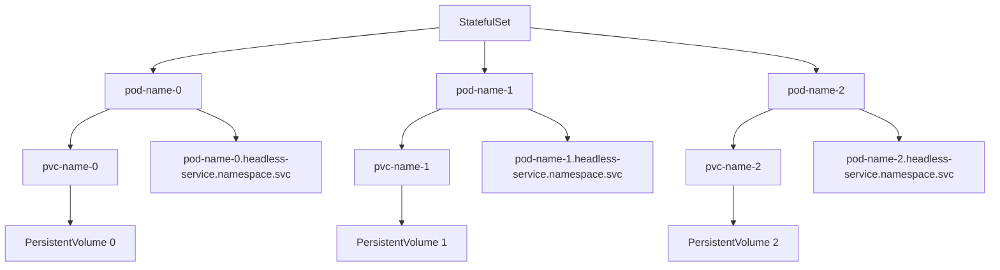

# Part 023 — Stateful Workloads in Kubernetes

Stateful workload adalah salah satu area Kubernetes yang paling mudah disalahpahami. Banyak engineer melihat Kubernetes sebagai platform yang bisa menjalankan semua hal, lalu menyimpulkan bahwa database, message broker, cache, workflow engine, dan search cluster tinggal dibungkus sebagai `StatefulSet`. Secara teknis bisa. Secara operasional belum tentu benar.

Untuk backend engineer yang bekerja pada Java/JAX-RS microservices, stateful workload harus dipahami dari dua sisi:

1. **Aplikasi Java sebagai client stateful dependency** — service memanggil PostgreSQL, Kafka, RabbitMQ, Redis, Camunda, atau sistem lain.
2. **Stateful dependency itu sendiri sebagai workload** — dependency tersebut mungkin berjalan di Kubernetes, managed cloud service, VM, appliance, on-prem platform, atau platform internal.

Perbedaan ini penting. Sebagian besar Java/JAX-RS service seharusnya tetap stateless. Tetapi service tersebut sering bergantung pada sistem stateful yang menentukan correctness, ordering, durability, latency, failover, dan disaster recovery.

> CSG note: jangan mengasumsikan PostgreSQL, Kafka, RabbitMQ, Redis, atau Camunda dependency di lingkungan CSG dijalankan di Kubernetes. Bisa saja memakai managed service, on-prem platform, VM, operator, atau platform internal. Semua topology, ownership, backup, failover, dan runbook harus diverifikasi internal.

---

## 1. Core Concept

Kubernetes `StatefulSet` adalah workload resource untuk menjalankan Pod yang membutuhkan identitas stabil, storage stabil, dan urutan lifecycle yang lebih terkontrol dibanding `Deployment`.

`Deployment` cocok untuk workload stateless:

```text
Any replica can serve any request.
Pod identity is disposable.
Storage is disposable.
Replacement pod is equivalent to old pod.
```

`StatefulSet` cocok untuk workload yang membutuhkan:

```text
Pod identity matters.
Pod ordering matters.
Storage must follow the logical replica.
Network identity must be predictable.
Scale/upgrade/termination order may matter.
```

Contoh identitas StatefulSet:

```text
postgres-0
postgres-1
postgres-2

rabbitmq-0
rabbitmq-1
rabbitmq-2

redis-0
redis-1
redis-2
```

Pod name bukan sekadar label. Ia menjadi bagian dari identitas operasional workload.

---

## 2. Why StatefulSet Exists

Kubernetes Pod bersifat ephemeral. Jika Pod mati, scheduler dapat membuat Pod baru di node lain dengan IP baru dan filesystem baru.

Untuk stateless HTTP service, ini normal. Untuk database atau broker, ini berbahaya.

Stateful systems membutuhkan beberapa hal yang tidak diberikan oleh `Deployment` biasa:

- replica identity yang stabil,
- storage yang tidak tertukar antar replica,
- DNS name yang predictable,
- startup order yang bisa dikontrol,
- termination order yang bisa dikontrol,
- mapping replica ke persistent volume,
- cluster membership yang bisa diprediksi,
- restore/failover yang tidak random.

StatefulSet menyediakan primitive dasar tersebut, tetapi tidak otomatis menyediakan semua aspek operasional database/broker.



---

## 3. StatefulSet vs Deployment

| Concern | Deployment | StatefulSet |
|---|---|---|
| Pod identity | Disposable | Stable ordinal identity |
| Pod name | Random suffix | Predictable ordinal suffix |
| Storage | Usually ephemeral or shared config volume | Stable PVC per replica |
| DNS | Usually via Service only | Pod-specific DNS possible via headless Service |
| Rollout | Replace any replica | Ordered or partitioned behavior |
| Scale | Replicas are interchangeable | Ordinal identity matters |
| Best fit | Stateless API, workers, consumers | Databases, brokers, clustered systems |
| Operational complexity | Lower | Higher |

A common mistake:

```text
"It has a PVC, therefore StatefulSet is enough."
```

Correct mental model:

```text
StatefulSet provides stable identity and storage.
It does not provide database correctness, backup, restore, failover, replication safety, quorum management, or operational expertise by itself.
```

---

## 4. Stable Identity

StatefulSet assigns ordinal identity to Pods:

```text
<statefulset-name>-0
<statefulset-name>-1
<statefulset-name>-2
```

This matters because many clustered systems need node identity.

Examples:

- Kafka broker ID,
- RabbitMQ node name,
- PostgreSQL primary/replica identity,
- Redis master/replica or shard identity,
- workflow engine cluster node identity,
- coordination membership.

Stable identity helps the system know whether a restarted process is the same logical member or a new member.

Failure if identity is wrong:

- cluster sees duplicate node,
- replica rejoins incorrectly,
- data directory belongs to wrong logical member,
- quorum membership becomes inconsistent,
- operator cannot reconcile cluster state safely.

---

## 5. Stable Storage

StatefulSet commonly uses `volumeClaimTemplates`.

Each Pod gets its own PVC:

```text
app-0 -> data-app-0
app-1 -> data-app-1
app-2 -> data-app-2
```

The PVC is not deleted automatically just because the Pod is restarted. This is the core reason StatefulSet can preserve state across Pod rescheduling.

Important implication:

```text
Deleting a Pod is not the same as deleting its data.
Deleting a StatefulSet may not delete PVCs.
Deleting PVCs may destroy durable data depending on reclaim policy and storage backend.
```

Production rule:

```text
Never treat PVC deletion as a harmless cleanup step.
```

---

## 6. Headless Service

A StatefulSet usually pairs with a headless Service:

```yaml
apiVersion: v1
kind: Service
metadata:
  name: rabbitmq
spec:
  clusterIP: None
  selector:
    app: rabbitmq
  ports:
    - name: amqp
      port: 5672
      targetPort: 5672
```

`clusterIP: None` means Kubernetes does not allocate a virtual ClusterIP. Instead, DNS resolves directly to Pod endpoints.

This enables predictable names such as:

```text
rabbitmq-0.rabbitmq.namespace.svc.cluster.local
rabbitmq-1.rabbitmq.namespace.svc.cluster.local
rabbitmq-2.rabbitmq.namespace.svc.cluster.local
```

Why this matters:

- cluster members can discover peers,
- replicas can identify specific nodes,
- clients/operators can target specific members when needed,
- StatefulSet identity maps cleanly to DNS.

For normal Java/JAX-RS stateless services, headless Service is usually unnecessary. For stateful clustered systems, it is often fundamental.

---

## 7. Ordered Deployment and Ordered Termination

StatefulSet can create, update, and delete Pods in predictable order.

Typical behavior:

```text
Create:    app-0 -> app-1 -> app-2
Delete:    app-2 -> app-1 -> app-0
```

Why order matters:

- cluster bootstrap may require first node,
- followers may need primary/seed node,
- termination order can avoid losing quorum,
- rolling update must avoid taking down too many replicas,
- storage attach/detach may need deterministic recovery.

But ordered lifecycle is not a replacement for application-level clustering correctness.

If the database/broker cannot tolerate a member restart safely, StatefulSet ordering alone will not save it.

---

## 8. VolumeClaimTemplate

A simplified StatefulSet storage pattern:

```yaml
apiVersion: apps/v1
kind: StatefulSet
metadata:
  name: example-stateful
spec:
  serviceName: example-stateful
  replicas: 3
  selector:
    matchLabels:
      app: example-stateful
  template:
    metadata:
      labels:
        app: example-stateful
    spec:
      containers:
        - name: app
          image: example/app:1.0.0
          volumeMounts:
            - name: data
              mountPath: /var/lib/example
  volumeClaimTemplates:
    - metadata:
        name: data
      spec:
        accessModes:
          - ReadWriteOnce
        storageClassName: fast-ssd
        resources:
          requests:
            storage: 100Gi
```

Review points:

- Is storage class correct for latency/durability?
- Is access mode correct?
- Is requested capacity realistic?
- What is the reclaim policy?
- Is backup configured outside this manifest?
- What happens during node failure?
- What happens during zone failure?
- Can the volume reattach safely?
- Is the workload single-AZ or multi-AZ aware?

---

## 9. PostgreSQL in Kubernetes

PostgreSQL can run in Kubernetes, but it is not automatically a good idea.

Key operational concerns:

- WAL durability,
- fsync behavior,
- storage latency,
- backup and point-in-time recovery,
- replication topology,
- primary election,
- split-brain prevention,
- connection pooling,
- schema migration coordination,
- failover testing,
- major version upgrades,
- restore drills,
- data corruption response.

For many enterprise systems, PostgreSQL may be better served by:

- managed database service,
- dedicated database platform,
- on-prem database cluster,
- team-owned database infrastructure,
- operator-managed Kubernetes PostgreSQL with strong runbooks.

Decision question:

```text
Who owns data durability and restore correctness at 3 AM?
```

If the answer is unclear, the design is not production-ready.

Java/JAX-RS impact:

- JDBC connection pool must tolerate failover,
- transaction retries must be deliberate,
- long transactions increase recovery pain,
- connection leak becomes more visible during failover,
- readiness should not blindly depend on DB availability unless intentionally designed,
- migration Job must be coordinated with app rollout.

---

## 10. RabbitMQ in Kubernetes

RabbitMQ is stateful because queues, messages, cluster membership, and node identity matter.

Key concerns:

- durable queue storage,
- quorum queue behavior,
- mirrored queue legacy behavior,
- cluster partition handling,
- node identity,
- Erlang cookie secret,
- persistent volume performance,
- disk alarms,
- memory alarms,
- rolling restart safety,
- consumer reconnection,
- publisher confirm behavior.

Java/JAX-RS impact:

- consumers must handle reconnect,
- consumers must stop gracefully before Pod termination,
- ack/nack behavior must be correct,
- message duplication must be expected,
- idempotency is mandatory for critical consumers,
- DLQ and retry topology must be observable.

Kubernetes concern:

```text
Restarting a RabbitMQ Pod is not equivalent to restarting a stateless HTTP replica.
```

A restart can trigger queue leader movement, consumer rebalance, connection storms, and message redelivery.

---

## 11. Redis in Kubernetes

Redis can be cache, broker-like primitive, distributed lock store, session store, or primary data store depending on usage. The risk depends heavily on which one.

Questions that matter:

- Is Redis used as disposable cache?
- Is Redis used for session state?
- Is Redis used for lock coordination?
- Is Redis used for rate limiting?
- Is Redis used as durable queue?
- Is Redis persistence enabled?
- Is Redis Cluster used?
- Is Sentinel used?
- What happens if data is lost?

If Redis is a cache, data loss may be tolerable. If Redis stores business-critical workflow state, it is a database and must be treated as one.

Java/JAX-RS impact:

- client timeout must be short and explicit,
- retry must avoid thundering herd,
- cache stampede protection may be needed,
- lock TTL must be correct,
- connection pool must handle failover,
- circuit breaker may be required for degraded mode.

---

## 12. Kafka in Kubernetes

Kafka is deeply stateful. Broker identity, storage, partitions, replicas, controller quorum, ISR, network latency, and disk throughput all matter.

Key concerns:

- broker ID,
- log directory persistence,
- partition replica placement,
- ISR health,
- controller quorum,
- listener configuration,
- advertised listeners,
- disk throughput,
- page cache behavior,
- rolling restart safety,
- partition reassignment,
- client compatibility,
- consumer group rebalancing,
- broker upgrade path.

Kubernetes-specific risks:

- Pod IP changes break badly configured advertised listeners,
- storage attach latency delays broker recovery,
- zone placement affects replica durability,
- node pressure can affect disk/network performance,
- bad rolling restart can shrink ISR,
- operator misconfiguration can cause cluster-wide instability.

Java service impact:

- producers must handle retry and idempotence where needed,
- consumers must handle rebalance,
- consumer shutdown must commit offsets deliberately,
- message handling must be idempotent,
- lag must be observable,
- autoscaling must account for partitions and consumer group behavior.

---

## 13. Camunda-Like Workloads and Workflow State

Camunda-like platforms may involve several stateful aspects:

- process instance state,
- job executor state,
- external task state,
- database dependency,
- engine clustering,
- worker concurrency,
- timers,
- retries,
- incident records,
- history/audit data.

Often the engine itself may be stateless-ish while the database is the real stateful system. But the operational behavior is still stateful because workflow correctness depends on durable state, locks, timers, and retries.

Java worker impact:

- workers must shut down gracefully,
- in-flight work must be completed, extended, or released,
- retries must be idempotent,
- duplicated work must be expected,
- timeout and lock duration must be calibrated,
- deployment version compatibility matters for long-running processes.

Internal verification is essential:

```text
Where is workflow state stored?
Who owns schema migration?
How are workers scaled?
How are stuck jobs detected?
How are duplicate executions handled?
```

---

## 14. Operator Pattern

An operator is a Kubernetes controller that embeds domain-specific operational knowledge.

For stateful systems, operators can manage:

- cluster bootstrap,
- member discovery,
- failover,
- backup,
- restore,
- rolling upgrade,
- certificate rotation,
- scaling,
- configuration reconciliation,
- status reporting.

But an operator is not magic.

Operator quality varies. A poor operator can encode poor operational assumptions and make failures harder to reason about.

Review questions:

- Is the operator production-grade?
- Who maintains it?
- What CRDs does it install?
- What permissions does it need?
- How does it perform backup/restore?
- How does it handle failover?
- How does it expose status?
- How is operator upgrade tested?
- What happens if the operator itself is down?

---

## 15. Managed Service vs Self-Managed Stateful Workload

This is an architecture decision, not only a Kubernetes decision.

| Option | Strength | Risk |
|---|---|---|
| Managed cloud service | Lower operational burden, integrated backup/monitoring, vendor support | Cloud coupling, cost, limits, network/private endpoint complexity |
| Self-managed on VM/on-prem | Full control, familiar DBA/SRE model | Manual automation, patching burden, capacity planning |
| Self-managed in Kubernetes | Unified deployment model, declarative config, possible operator automation | High platform maturity required, storage/network/operator complexity |
| Internal platform service | Standardized enterprise operation | Dependency on internal platform roadmap and access model |

Senior-level framing:

```text
Do not ask: "Can Kubernetes run it?"
Ask: "Can our organization operate it safely under failure, upgrade, restore, and incident pressure?"
```

---

## 16. Stateful Workload Failure Modes

Common failure modes:

| Failure | Typical symptom | Likely cause |
|---|---|---|
| PVC Pending | Pod stuck Pending | StorageClass issue, quota, zone mismatch |
| Volume attach failure | Pod scheduled but volume cannot mount | Node/zone conflict, CSI issue, stale attachment |
| Slow recovery | Pod starts but service unavailable | WAL replay, broker log recovery, cache warmup |
| Split brain | Two nodes think they are primary | Bad failover logic, network partition, weak fencing |
| Data loss | Missing messages/rows/state | Wrong reclaim policy, deleted PVC, bad backup/restore |
| Quorum loss | Cluster unavailable | Too many replicas down, bad disruption handling |
| Rebalance storm | High latency, unstable consumers | Rolling restart, autoscaling, broker instability |
| Disk full | Write failures | Retention misconfig, missing alerts, undersized volume |
| Storage latency spike | Application timeout | backend storage degradation, noisy neighbor, network path |
| Operator reconcile loop | Repeated changes/events | Bad CR spec, permission issue, incompatible version |

---

## 17. Debugging Stateful Workloads

Debugging order:

```bash
kubectl get statefulset -n <namespace>
kubectl get pods -n <namespace> -l app=<app>
kubectl get pvc -n <namespace>
kubectl describe pod <pod> -n <namespace>
kubectl describe pvc <pvc> -n <namespace>
kubectl get events -n <namespace> --sort-by=.metadata.creationTimestamp
kubectl logs <pod> -n <namespace> --previous
```

Then inspect domain-specific health:

```text
PostgreSQL: replication lag, primary identity, WAL status, connection count
RabbitMQ: node health, queue leaders, memory/disk alarms, partition status
Redis: role, replication state, memory pressure, persistence status
Kafka: ISR, under-replicated partitions, controller, broker logs, consumer lag
Camunda-like: job executor health, stuck jobs, incidents, DB connectivity
```

Production-safe rule:

```text
Do not delete PVC, force-recreate cluster members, or scale stateful systems blindly during incident response.
```

---

## 18. Java/JAX-RS Service Impact

Even when Java services are stateless, stateful dependency behavior shapes application correctness.

Review these application-level concerns:

- connection pool size,
- timeout budget,
- retry policy,
- circuit breaker,
- idempotency,
- transaction boundary,
- consumer ack semantics,
- offset commit semantics,
- duplicate event handling,
- cache fallback,
- startup dependency behavior,
- readiness behavior,
- graceful shutdown.

Bad pattern:

```text
Pod starts only if every dependency is reachable.
Liveness fails when database is temporarily slow.
Consumer is killed before committing/aborting work safely.
Retry storm hits recovering database or broker.
```

Better pattern:

```text
Startup validates required static config.
Readiness reflects whether this instance can receive traffic now.
Liveness reflects whether process is internally deadlocked or unrecoverable.
Dependency failures are handled with timeout, retry budget, backoff, circuit breaker, and observability.
```

---

## 19. Networking Concerns

Stateful workloads often require more careful networking than stateless services.

Concerns:

- stable DNS,
- headless Service,
- client vs peer traffic,
- advertised listener configuration,
- source IP requirements,
- network policy for peer traffic,
- cross-zone latency,
- TLS between members,
- private endpoint access,
- DNS caching behavior,
- connection pooling during failover.

Kafka-specific example:

```text
Bootstrap address is not the same as broker advertised address.
If advertised listeners point to unreachable addresses, clients connect to bootstrap but fail afterward.
```

RabbitMQ-specific example:

```text
AMQP port may work, but clustering port or peer discovery may be blocked by NetworkPolicy.
```

PostgreSQL-specific example:

```text
Application can connect to old primary address after failover if DNS/cache/pool behavior is not aligned.
```

---

## 20. Security and Privacy Concerns

Stateful systems usually hold sensitive data.

Review concerns:

- encryption at rest,
- encryption in transit,
- secret rotation,
- database credential scope,
- broker credential scope,
- admin endpoint exposure,
- backup encryption,
- restore access control,
- audit logs,
- PII in logs,
- PVC snapshot access,
- operator RBAC,
- debug shell access,
- port-forward access,
- data export procedure.

Do not treat Kubernetes RBAC as the only security layer. Stateful systems have their own authentication, authorization, and audit models.

---

## 21. Observability Concerns

Stateful workloads need domain metrics, not only Pod metrics.

Required signal categories:

- Kubernetes Pod health,
- PVC usage,
- storage latency,
- CPU/memory,
- restart count,
- application-level health,
- replication health,
- queue depth,
- consumer lag,
- disk pressure,
- connection count,
- error rate,
- failover event,
- backup success/failure,
- restore drill result.

For Java clients, also track:

- dependency latency,
- connection pool usage,
- timeout count,
- retry count,
- circuit breaker state,
- consumer lag,
- duplicate handling,
- DLQ rate,
- transaction error rate.

---

## 22. Cost Concerns

Stateful workloads can be expensive because they often require:

- high-performance disks,
- multi-zone replication,
- provisioned IOPS,
- snapshots,
- backups,
- cross-zone traffic,
- dedicated node pools,
- larger memory footprint,
- long retention periods,
- monitoring/logging volume,
- disaster recovery environment.

Cost review should ask:

```text
Is this storage performance required?
Is the retention period justified?
Is cross-zone traffic expected?
Is managed service cheaper after operational cost is included?
What is the cost of downtime or data loss?
```

---

## 23. PR Review Checklist

Use this when reviewing stateful workload changes.

### Workload Type

- Is `StatefulSet` actually required?
- Could this be a managed service instead?
- Is the workload truly stateful or only misusing local disk?
- Is there an operator? Is it approved?

### Identity

- Are Pod names stable and expected?
- Is headless Service configured when needed?
- Does the application need stable DNS?
- Are cluster member names deterministic?

### Storage

- Is `volumeClaimTemplates` configured correctly?
- Is StorageClass appropriate?
- Are access modes correct?
- Is capacity realistic?
- Is reclaim policy understood?
- Are backups configured?
- Is restore tested?

### Availability

- Is quorum requirement understood?
- Is anti-affinity configured?
- Is zone spreading configured?
- Is PDB safe?
- Can rolling restart happen without outage?
- Is failover tested?

### Application Client Impact

- Do Java clients handle reconnect?
- Are timeouts explicit?
- Are retries bounded?
- Are consumers idempotent?
- Is graceful shutdown implemented?
- Are duplicate messages/events expected?

### Security

- Are credentials stored safely?
- Is TLS enabled where required?
- Are admin endpoints protected?
- Is backup access controlled?
- Is operator RBAC least privilege?

### Observability

- Are domain metrics available?
- Are alerts defined for replication/quorum/disk/lag?
- Is backup monitored?
- Is restore drill documented?
- Are client-side dependency metrics visible?

---

## 24. Internal Verification Checklist

Verify these in CSG/team context before making conclusions:

- Which stateful dependencies are used by the service?
- Are PostgreSQL/Kafka/RabbitMQ/Redis/Camunda dependencies managed, on-prem, VM-based, operator-managed, or Kubernetes-native?
- Who owns each dependency operationally?
- What are the backup and restore procedures?
- Are restore drills performed?
- What is the RPO/RTO?
- What is the failover mechanism?
- What is the upgrade process?
- Are stateful workloads using StatefulSet?
- Are operators used? Which ones?
- What StorageClass is used?
- Are PVCs backed by cloud disk, file storage, SAN, NFS, or other backend?
- Are workloads zone-aware?
- Are PodDisruptionBudgets configured?
- Are NetworkPolicies applied?
- Are domain metrics visible in dashboards?
- Are alerts configured for lag, disk, replication, quorum, and backup failure?
- Are Java clients configured with proper timeout, retry, reconnect, and graceful shutdown behavior?
- Are incident notes available for prior stateful dependency failures?

---

## 25. Key Takeaways

StatefulSet gives Kubernetes stable identity and stable storage for Pods. It does not automatically give you safe database, broker, cache, or workflow operation.

For senior backend engineers, the key skill is not merely writing a StatefulSet manifest. The key skill is knowing when state belongs in Kubernetes, when it belongs in managed infrastructure, and how application correctness changes when a stateful dependency fails, restarts, fails over, or becomes slow.

If a system stores durable business state, the most important questions are not only Kubernetes questions:

```text
Can we back it up?
Can we restore it?
Can we fail over safely?
Can we upgrade it safely?
Can we observe it?
Can we prove correctness after failure?
Who owns it during an incident?
```
