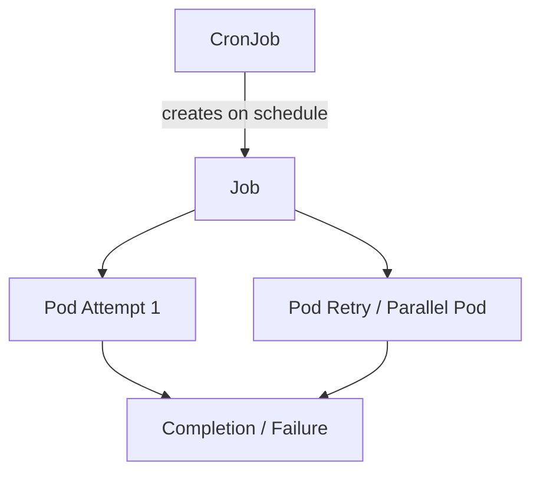

# Part 024 — Kubernetes Jobs and Schedulers

Tidak semua workload di Kubernetes adalah service yang berjalan terus-menerus. Banyak pekerjaan production lebih cocok dimodelkan sebagai **finite work**: jalan, selesai, lalu meninggalkan status sukses atau gagal. Di Kubernetes, pola ini dimodelkan dengan `Job` dan `CronJob`.

Untuk enterprise Java/JAX-RS systems, Job/CronJob sering muncul dalam bentuk:

- database migration,
- data backfill,
- reconciliation process,
- cleanup process,
- report generation,
- scheduled integration sync,
- retry processor,
- batch export/import,
- cache warmup,
- index rebuild,
- workflow recovery task,
- one-off operational task.

Job kelihatannya sederhana, tetapi failure mode-nya bisa sangat mahal. Job yang tidak idempotent bisa menggandakan data. CronJob yang overlap bisa membuat race condition. Migration job yang gagal di tengah bisa mengunci rollout. Cleanup job yang salah selector bisa menghapus data penting.

> CSG note: jangan mengasumsikan migration, backfill, cleanup, atau scheduled integration di CSG selalu memakai Kubernetes Job/CronJob. Bisa saja memakai CI/CD step, application scheduler, Quartz, Camunda timer, external orchestrator, database scheduler, atau platform internal. Semua mekanisme harus diverifikasi internal.

---

## 1. Core Concept

`Job` memastikan satu atau beberapa Pod berhasil menyelesaikan pekerjaan sampai completion target tercapai.

`CronJob` membuat `Job` berdasarkan schedule.



Mental model:

```text
Deployment: keep N replicas running.
Job: run work until completion.
CronJob: create Jobs on schedule.
```

Do not use Deployment for finite work just because it is familiar.

Do not use CronJob when the work is actually event-driven and should be triggered by queue/message/workflow state.

---

## 2. Why Jobs Exist

Without Job abstraction, batch work would be awkward:

- who restarts failed attempt?
- how many completions are required?
- how many attempts are allowed?
- how long can the work run?
- can multiple Pods run in parallel?
- how is success/failure represented?
- how are old runs cleaned up?
- how do operators inspect history?

`Job` gives Kubernetes a lifecycle model for finite work.

`CronJob` adds scheduling on top of that lifecycle.

---

## 3. Job Lifecycle

A simplified Job lifecycle:

```text
Job created
  -> Pod created
  -> container starts
  -> work executes
  -> process exits 0 or non-zero
  -> Job records success/failure
  -> retry/backoff if needed
  -> completion condition reached or failed condition reached
```

Important distinction:

```text
A running Pod does not mean the Job is healthy.
A completed Pod does not mean the business operation is correct.
```

For production, Job correctness is defined by business outcome, not only exit code.

---

## 4. Basic Job Manifest

Example simplified Job:

```yaml
apiVersion: batch/v1
kind: Job
metadata:
  name: order-reconciliation-2026-07-11
spec:
  backoffLimit: 3
  activeDeadlineSeconds: 1800
  ttlSecondsAfterFinished: 86400
  template:
    spec:
      restartPolicy: Never
      containers:
        - name: reconcile
          image: example/order-service:1.2.3
          command: ["java"]
          args:
            - "-jar"
            - "/app/app.jar"
            - "reconcile-orders"
          envFrom:
            - configMapRef:
                name: order-service-config
            - secretRef:
                name: order-service-secret
```

Review immediately:

- Is the command explicit?
- Is the image immutable?
- Are config/secret sources correct?
- Is retry safe?
- Is timeout bounded?
- Is output observable?
- Is the operation idempotent?

---

## 5. Completion and Parallelism

Key fields:

```yaml
spec:
  completions: 10
  parallelism: 2
```

Meaning:

```text
completions: how many successful completions are required
parallelism: how many Pods may run at the same time
```

Use cases:

- process 10 partitions,
- run parallel workers for independent shards,
- split backfill by tenant/date/account range,
- perform controlled fan-out.

Risk:

```text
Parallelism creates concurrency. Concurrency creates correctness requirements.
```

Before enabling parallelism, verify:

- work partitioning is deterministic,
- two Pods cannot process the same data unsafely,
- database locks are understood,
- external API rate limits are respected,
- ordering is not required,
- retries do not duplicate side effects.

---

## 6. Backoff Limit

`backoffLimit` controls how many retries Kubernetes allows before considering Job failed.

```yaml
spec:
  backoffLimit: 3
```

This is not a substitute for application-level retry design.

Kubernetes retry restarts the whole Pod. Application retry retries a specific operation.

Wrong mental model:

```text
"If it fails, Kubernetes will retry, so it is safe."
```

Correct mental model:

```text
Kubernetes may retry the whole job attempt.
The job must be safe to re-run from the beginning or from a checkpoint.
```

If the Job already performed side effects, retry can duplicate them unless idempotency is designed.

---

## 7. Active Deadline

`activeDeadlineSeconds` limits how long a Job may run.

```yaml
spec:
  activeDeadlineSeconds: 3600
```

Why it matters:

- prevents infinite stuck batch,
- limits resource consumption,
- stops hung network calls,
- bounds migration/backfill window,
- prevents old scheduled work from overlapping with new work.

But a deadline can also interrupt useful work.

Review:

- Is timeout aligned with expected data volume?
- Does the application handle SIGTERM?
- Is partial progress safe?
- Can the work resume?
- Is failure alerted?

---

## 8. TTL After Finished

`ttlSecondsAfterFinished` cleans up completed/failed Jobs after a period.

```yaml
spec:
  ttlSecondsAfterFinished: 86400
```

This avoids thousands of old Job objects accumulating.

Trade-off:

- short TTL keeps cluster clean,
- long TTL helps debugging/audit,
- logs may live elsewhere,
- business audit should not depend only on Kubernetes Job history.

Production rule:

```text
If Job output matters for audit, write durable audit records outside Kubernetes object history.
```

---

## 9. Restart Policy

For Jobs, common values are:

```yaml
restartPolicy: Never
```

or:

```yaml
restartPolicy: OnFailure
```

`Never` creates a new Pod for retry. `OnFailure` restarts the container inside the same Pod.

Use `Never` when you want clearer attempt history.

Use `OnFailure` only when container-level restart semantics are acceptable.

Important:

```text
Deployment-style restart expectations do not map cleanly to Job correctness.
```

For production batch work, explicit attempt visibility is often more valuable than hiding restart inside a Pod.

---

## 10. CronJob Basics

A `CronJob` creates Jobs on a schedule.

```yaml
apiVersion: batch/v1
kind: CronJob
metadata:
  name: nightly-order-cleanup
spec:
  schedule: "0 2 * * *"
  concurrencyPolicy: Forbid
  successfulJobsHistoryLimit: 3
  failedJobsHistoryLimit: 5
  jobTemplate:
    spec:
      backoffLimit: 2
      activeDeadlineSeconds: 1800
      template:
        spec:
          restartPolicy: Never
          containers:
            - name: cleanup
              image: example/order-service:1.2.3
              args: ["cleanup-expired-orders"]
```

CronJob review starts with this question:

```text
What happens if the previous run is still active when the next schedule fires?
```

---

## 11. Concurrency Policy

CronJob supports concurrency policy:

```yaml
concurrencyPolicy: Allow
concurrencyPolicy: Forbid
concurrencyPolicy: Replace
```

| Policy | Meaning | Risk |
|---|---|---|
| Allow | New Job can start even if previous still running | Overlap, race condition, duplicated work |
| Forbid | Skip new run if previous still running | Missed schedule, stale data |
| Replace | Replace current Job with new one | Interrupted work, partial side effects |

For enterprise systems, `Forbid` is often safer than `Allow` unless overlap is explicitly designed.

Use `Replace` carefully. It can kill in-flight work.

---

## 12. Suspend

CronJob can be suspended:

```yaml
spec:
  suspend: true
```

Useful for:

- stopping scheduled cleanup during incident,
- pausing integration sync,
- preventing repeated failure while debugging,
- freezing scheduled mutation before migration,
- emergency kill switch.

But suspension is operationally meaningful and should be tracked.

Review:

- who can suspend/resume?
- is there audit trail?
- is alerting adjusted?
- will missed work be backfilled?
- does business know the schedule is paused?

---

## 13. Migration Jobs

Database migration is one of the most sensitive uses of Job.

Risk categories:

- schema lock,
- long-running DDL,
- backward incompatibility,
- app version mismatch,
- partial migration,
- duplicate execution,
- rollback impossibility,
- multi-service coordination.

Good migration job properties:

```text
versioned
idempotent where possible
forward-compatible
observable
bounded by timeout
owned by rollout process
safe under retry
clear rollback/roll-forward plan
```

Dangerous pattern:

```text
App deployment and destructive DB migration happen at the same time with no compatibility window.
```

Safer pattern:

```text
Expand -> deploy compatible app -> backfill -> switch reads/writes -> contract later.
```

---

## 14. Backfill Jobs

Backfill jobs update historical data or derived state.

Risks:

- large database load,
- lock contention,
- transaction log growth,
- replication lag,
- API rate limit,
- duplicate processing,
- partial progress ambiguity,
- customer-visible inconsistency,
- expensive rollback.

Backfill design checklist:

- partition by stable key/range,
- checkpoint progress,
- make operation idempotent,
- limit batch size,
- throttle writes,
- expose progress metrics,
- support pause/resume,
- support dry run if possible,
- define failure recovery,
- define verification query.

Backfill is not just a script. In production, it is a controlled data operation.

---

## 15. Reconciliation Jobs

Reconciliation jobs compare expected state and actual state, then repair or report drift.

Examples:

- order state reconciliation,
- quote/order sync verification,
- billing state reconciliation,
- external system sync check,
- workflow incident repair,
- cache vs database consistency check,
- message replay validation.

Design options:

```text
report-only mode
repair mode
dry-run mode
single-tenant mode
range-limited mode
full-scan mode
```

Senior review question:

```text
Can this job prove what it changed and why?
```

A reconciliation job without audit trail can become a hidden data mutation engine.

---

## 16. Cleanup Jobs

Cleanup jobs delete or expire data.

They are dangerous because bugs are destructive.

Examples:

- delete expired sessions,
- delete old temp files,
- delete old exports,
- purge old workflow history,
- remove stale locks,
- delete orphaned records,
- clean old messages or metadata.

Safety checklist:

- use retention policy from config,
- log count before delete,
- support dry run,
- use small batches,
- avoid broad unbounded deletes,
- protect active records,
- use transaction boundaries carefully,
- expose deletion metrics,
- alert on abnormal deletion volume,
- define restore path.

Bad cleanup job:

```text
DELETE FROM table WHERE created_at < now() - interval '30 days';
```

Better cleanup job:

```text
select bounded candidate set
validate eligibility
delete in small batches
record deletion audit
emit metrics
stop on anomaly threshold
```

---

## 17. Job Idempotency

Idempotency means running the same Job again does not create incorrect additional side effects.

For Jobs, idempotency is not optional. Kubernetes retry, operator retry, human retry, and pipeline retry can all re-run work.

Idempotency strategies:

- unique operation ID,
- business key constraint,
- processed marker,
- checkpoint table,
- compare-and-set update,
- upsert instead of insert,
- external idempotency key,
- output overwrite with version,
- dry-run verification,
- resumable partition processing.

Bad pattern:

```text
INSERT new record for every processed input without uniqueness protection.
```

Better pattern:

```text
INSERT with deterministic key or UPSERT by business key.
```

---

## 18. Job Observability

A Job needs more than logs.

Required observability:

- start time,
- end time,
- duration,
- status,
- exit code,
- item count processed,
- success count,
- failure count,
- retry count,
- skipped count,
- checkpoint/progress,
- business validation result,
- error summary,
- correlation/run ID,
- resource usage,
- downstream dependency latency.

Kubernetes-level signals:

```bash
kubectl get jobs -n <namespace>
kubectl describe job <job> -n <namespace>
kubectl get pods -n <namespace> --selector=job-name=<job>
kubectl logs job/<job> -n <namespace>
kubectl get events -n <namespace> --sort-by=.metadata.creationTimestamp
```

Application-level signal should answer:

```text
What did this job actually do?
How far did it get?
Is it safe to retry?
Was business state corrected?
```

---

## 19. Java Job Implementation Pattern

A Java service image can expose multiple runtime modes:

```text
java -jar app.jar server
java -jar app.jar migrate
java -jar app.jar backfill --from=... --to=...
java -jar app.jar reconcile --tenant=...
java -jar app.jar cleanup --dry-run=false
```

This can be practical because the same image contains domain logic and dependencies.

But it creates governance concerns:

- who can run operational commands?
- are commands safe for production?
- are destructive commands gated?
- are command arguments audited?
- are dry-run modes available?
- does the command use same config as service?
- does it emit metrics/logs consistently?

Avoid hidden operational commands that are known only to one engineer.

---

## 20. Resource Management for Jobs

Jobs need resource requests/limits too.

Common mistake:

```text
Batch jobs are temporary, so resource sizing does not matter.
```

Reality:

- a large backfill can starve service Pods,
- a migration can consume excessive memory,
- a cleanup can overload database,
- parallel jobs can exhaust connection pools,
- CPU-heavy jobs can cause node pressure,
- unbounded logs can increase cost.

Review:

- CPU request/limit,
- memory request/limit,
- ephemeral storage,
- database connection count,
- batch size,
- parallelism,
- node placement,
- priority class,
- timeout budget.

---

## 21. Scheduling and Placement for Jobs

Some jobs should not run anywhere.

Concerns:

- should migration job run near database?
- should batch job avoid customer-facing node pool?
- should cleanup job run in maintenance window?
- should expensive job tolerate spot/preemptible node?
- should job be isolated to dedicated node pool?
- should job be prevented during incident?

Kubernetes tools:

- nodeSelector,
- node affinity,
- taints/tolerations,
- PriorityClass,
- resource quota,
- namespace isolation,
- CronJob suspend,
- admission policy.

---

## 22. Security Concerns

Jobs often need high privilege because they mutate data or perform operations.

Security review:

- ServiceAccount permissions,
- database role permissions,
- secret access,
- cloud IAM role,
- namespace isolation,
- image provenance,
- command argument leakage,
- logs containing sensitive data,
- dry-run access,
- destructive command guardrails,
- who can manually create Jobs,
- who can rerun Jobs,
- audit trail.

Dangerous pattern:

```text
Production Job uses the same broad admin credentials as the application.
```

Better pattern:

```text
Job-specific identity with least privilege for the exact operation.
```

---

## 23. Networking Concerns

Jobs may need different network access from the service.

Examples:

- migration job needs database access,
- backfill job needs external API access,
- reconciliation job needs multiple system endpoints,
- cleanup job needs storage/object store access,
- report job needs internal data service access.

NetworkPolicy must account for Job labels and namespace.

Failure pattern:

```text
Deployment can reach database, but migration Job cannot because NetworkPolicy only allows app Pod labels.
```

Review:

- does Job use expected labels?
- does NetworkPolicy allow required egress?
- does DNS work from Job Pod?
- does cloud/private endpoint resolve?
- are proxy settings needed?
- are TLS truststores available?

---

## 24. Failure Modes

| Failure | Symptom | Likely Cause |
|---|---|---|
| Job never starts | Pod Pending | quota, node capacity, affinity, image pull, PVC |
| Job repeatedly fails | Failed Pods increasing | bad config, app error, dependency failure |
| Job stuck running | active Pod never completes | hung network call, deadlock, no timeout |
| Job duplicated side effects | duplicate records/messages | retry without idempotency |
| CronJob overlaps | multiple active Jobs | concurrencyPolicy Allow, long runtime |
| CronJob misses run | no Job created | suspended, controller issue, timezone/schedule misunderstanding |
| Migration blocks rollout | app incompatible with schema | poor deployment sequencing |
| Backfill overloads DB | latency spike, errors | batch too large, no throttling |
| Cleanup deletes too much | data loss | weak predicate, no dry run, no anomaly threshold |
| Job invisible after failure | no logs/history | short TTL, missing log shipping |

---

## 25. Debugging Jobs

Start with Kubernetes state:

```bash
kubectl get cronjob -n <namespace>
kubectl get job -n <namespace>
kubectl describe cronjob <cronjob> -n <namespace>
kubectl describe job <job> -n <namespace>
kubectl get pods -n <namespace> --selector=job-name=<job>
kubectl describe pod <pod> -n <namespace>
kubectl logs <pod> -n <namespace>
kubectl logs <pod> -n <namespace> --previous
kubectl get events -n <namespace> --sort-by=.metadata.creationTimestamp
```

Then inspect application behavior:

```text
Was config loaded?
Was secret available?
Did DB connection succeed?
What item/range was being processed?
What was the last checkpoint?
Was the failure retryable?
Did the job partially mutate state?
Is rerun safe?
```

Production-safe debugging rule:

```text
Before rerunning a failed Job, prove whether it is idempotent or identify the exact partial progress boundary.
```

---

## 26. Job Review Checklist

### Lifecycle

- Is this finite work appropriate for Job/CronJob?
- Is the command explicit?
- Is restartPolicy correct?
- Is backoffLimit safe?
- Is activeDeadlineSeconds set?
- Is ttlSecondsAfterFinished appropriate?

### Correctness

- Is the operation idempotent?
- Can it resume after partial failure?
- Is there checkpointing?
- Are duplicate side effects prevented?
- Is retry behavior safe?
- Is transaction scope bounded?

### Cron Scheduling

- Is schedule correct?
- Is timezone understood?
- Is concurrencyPolicy safe?
- Are missed schedules acceptable?
- Is suspend/resume procedure documented?

### Data Safety

- Is dry-run available for destructive jobs?
- Is deletion/update bounded?
- Is anomaly detection present?
- Is audit trail written?
- Is rollback/restore path defined?

### Resource and Dependency Safety

- Are resource requests/limits set?
- Is batch size controlled?
- Is database/API load controlled?
- Is parallelism safe?
- Are timeout and retry budgets explicit?

### Security

- Does the Job use least-privilege identity?
- Are secrets scoped correctly?
- Are command args safe from leakage?
- Is manual rerun controlled?
- Is audit available?

### Observability

- Are logs structured?
- Is run ID emitted?
- Are success/failure metrics emitted?
- Is progress visible?
- Are alerts configured for failure/stuck jobs?

---

## 27. Internal Verification Checklist

Verify these in CSG/team context:

- Are database migrations run via Kubernetes Job, CI/CD step, application startup, Flyway/Liquibase, or another orchestrator?
- Are CronJobs used for scheduled work?
- Are there app-level schedulers such as Quartz, Spring Scheduler, Camunda timers, or platform schedulers?
- Which Jobs are destructive?
- Which Jobs mutate business data?
- Are Jobs idempotent?
- Are failed Jobs safe to rerun?
- Is there a standard for `backoffLimit`, `activeDeadlineSeconds`, and TTL?
- Are Job logs shipped to the observability platform?
- Are Job failures alerted?
- Are migration Jobs tied to deployment gates?
- Are backfill Jobs reviewed separately?
- Are cleanup Jobs dry-run capable?
- Are ServiceAccounts scoped per Job type?
- Are NetworkPolicies allowing Job egress intentionally?
- Are Job resource limits defined?
- Are large batch Jobs isolated from latency-sensitive workloads?
- Are runbooks available for failed migrations/backfills/cleanup tasks?
- Are incident notes available for historical scheduled job failures?

---

## 28. Key Takeaways

Jobs and CronJobs are not just “containers that run once”. They are production mutation mechanisms.

A senior engineer should review every Job through these questions:

```text
What side effects can this produce?
What happens if it runs twice?
What happens if it fails halfway?
What happens if it overlaps with itself?
What happens if dependency latency increases?
What proves that the job completed correctly?
Who can rerun it?
How do we observe and audit it?
```

If those questions cannot be answered, the Job is not production-ready.
