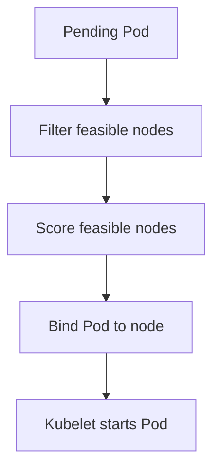

# Part 026 — Scheduling and Placement

Scheduling adalah proses Kubernetes memilih node untuk menjalankan Pod. Placement adalah keputusan arsitektural tentang **di mana** workload seharusnya berjalan agar memenuhi requirement availability, performance, isolation, compliance, cost, dan operability.

Backend engineer sering hanya melihat Deployment sebagai jumlah replica. Senior engineer harus melihat lebih dalam:

```text
Replica count answers: how many Pods?
Scheduling answers: on which nodes?
Placement answers: under what failure, latency, security, and cost assumptions?
```

Untuk enterprise Java/JAX-RS systems, placement memengaruhi:

- latency ke PostgreSQL/Kafka/RabbitMQ/Redis/Camunda,
- availability saat zone failure,
- blast radius saat node drain,
- noisy-neighbor risk,
- cost pada spot/preemptible node,
- compliance/security isolation,
- rollout safety,
- autoscaler behavior,
- resilience terhadap node pressure.

> CSG note: jangan mengasumsikan node pool, zone strategy, affinity rule, taint/toleration, dedicated node, spot usage, atau isolation model di CSG. Semua placement rule harus diverifikasi di manifest, Helm values, cluster/node labels, autoscaler config, platform standards, dan diskusi dengan platform/SRE/backend/security team.

---

## 1. Core Concept

Kubernetes scheduler memilih node berdasarkan beberapa tahap konseptual:

```text
Pod created
  -> scheduler watches unscheduled Pod
  -> filters nodes that cannot run it
  -> scores feasible nodes
  -> binds Pod to selected node
  -> kubelet on that node starts containers
```

Simplified flow:



Reasons a node may be rejected:

- insufficient CPU request capacity,
- insufficient memory request capacity,
- nodeSelector mismatch,
- node affinity mismatch,
- taint not tolerated,
- volume topology mismatch,
- port conflict for hostPort,
- topology constraints cannot be satisfied,
- node unschedulable,
- node condition not healthy,
- policy/admission constraints.

---

## 2. Why Scheduling Matters

If scheduling is wrong, symptoms may look like application failure:

- Pod stuck `Pending`,
- rollout never completes,
- HPA cannot scale,
- replicas concentrate in one zone,
- one node failure removes too many replicas,
- consumer lag spikes after node drain,
- latency increases because Pod runs far from dependency,
- batch workload starves API workload,
- spot interruption causes production instability,
- stateful workload cannot mount volume in selected zone.

Scheduling is part of reliability engineering.

---

## 3. Pod Pending Debugging

When Pod stays `Pending`, start here:

```bash
kubectl describe pod <pod> -n <namespace>
```

Look at events:

```text
0/10 nodes are available: 3 Insufficient cpu, 2 Insufficient memory, 5 node(s) didn't match Pod's node affinity/selector.
```

Debug path:

```text
Pod Pending
  -> read scheduler events
  -> check requests
  -> check node capacity
  -> check nodeSelector/affinity
  -> check taints/tolerations
  -> check topology spread
  -> check PVC topology
  -> check quota
  -> check autoscaler events
```

Never guess. Scheduler events usually tell the first-order reason.

---

## 4. Node Selector

`nodeSelector` is the simplest way to constrain Pod placement.

```yaml
spec:
  nodeSelector:
    workload-type: api
```

It means:

```text
Only schedule this Pod on nodes with label workload-type=api.
```

Pros:

- simple,
- readable,
- deterministic.

Cons:

- rigid,
- no preference scoring,
- easy to break if label missing,
- can cause Pending if no matching node has capacity.

Use for hard requirements, not vague preference.

Review:

- Who owns node labels?
- Are labels stable?
- Are labels applied to all expected node pools?
- What happens if matching nodes are full?
- Does autoscaler know how to add matching nodes?

---

## 5. Node Affinity

Node affinity is more expressive than nodeSelector.

Hard requirement:

```yaml
affinity:
  nodeAffinity:
    requiredDuringSchedulingIgnoredDuringExecution:
      nodeSelectorTerms:
        - matchExpressions:
            - key: workload-type
              operator: In
              values:
                - api
```

Soft preference:

```yaml
affinity:
  nodeAffinity:
    preferredDuringSchedulingIgnoredDuringExecution:
      - weight: 80
        preference:
          matchExpressions:
            - key: workload-type
              operator: In
              values:
                - api
```

Important phrase:

```text
IgnoredDuringExecution
```

Meaning: if labels change after scheduling, Kubernetes does not automatically evict the Pod for violating this affinity.

Use node affinity for:

- dedicated node pools,
- architecture-specific nodes,
- zone/region placement,
- hardware-specific workloads,
- compliance-specific isolation,
- preference without hard failure.

---

## 6. Pod Affinity

Pod affinity places Pods near other Pods.

Example use cases:

- colocate app with cache side workload,
- place worker near related service,
- improve locality for tightly coupled workloads.

Example:

```yaml
affinity:
  podAffinity:
    requiredDuringSchedulingIgnoredDuringExecution:
      - labelSelector:
          matchLabels:
            app: dependency-service
        topologyKey: kubernetes.io/hostname
```

This means:

```text
Schedule this Pod on a node where a Pod with app=dependency-service already exists.
```

Risk:

- reduces scheduler flexibility,
- can make Pods Pending,
- can concentrate failure risk,
- can fight autoscaling,
- can create hidden coupling.

Use pod affinity rarely and intentionally.

---

## 7. Pod Anti-Affinity

Pod anti-affinity keeps Pods apart.

Common purpose:

```text
Do not put all replicas of the same service on one node.
```

Example hard anti-affinity per node:

```yaml
affinity:
  podAntiAffinity:
    requiredDuringSchedulingIgnoredDuringExecution:
      - labelSelector:
          matchLabels:
            app: quote-api
        topologyKey: kubernetes.io/hostname
```

This means:

```text
Do not schedule two quote-api Pods on the same node.
```

This improves resilience but can reduce schedulability.

For many services, soft anti-affinity is safer:

```yaml
affinity:
  podAntiAffinity:
    preferredDuringSchedulingIgnoredDuringExecution:
      - weight: 100
        podAffinityTerm:
          labelSelector:
            matchLabels:
              app: quote-api
          topologyKey: kubernetes.io/hostname
```

Hard anti-affinity can block scale-up when there are fewer nodes than replicas.

---

## 8. Topology Spread Constraints

Topology spread constraints distribute Pods across topology domains such as nodes or zones.

Example zone spreading:

```yaml
topologySpreadConstraints:
  - maxSkew: 1
    topologyKey: topology.kubernetes.io/zone
    whenUnsatisfiable: DoNotSchedule
    labelSelector:
      matchLabels:
        app: quote-api
```

Meaning:

```text
Keep quote-api replicas balanced across zones with max skew 1.
If that cannot be satisfied, do not schedule.
```

Alternative:

```yaml
whenUnsatisfiable: ScheduleAnyway
```

This turns it into a softer placement rule.

Use topology spread for:

- multi-zone availability,
- node distribution,
- reducing blast radius,
- improving resilience during node/zone failure,
- avoiding replica concentration.

Review:

- Is topology key correct?
- Do nodes have zone labels?
- Is `DoNotSchedule` too strict?
- What happens during zone capacity shortage?
- Does cluster autoscaler understand the constraint?

---

## 9. Taints and Tolerations

Taints repel Pods. Tolerations allow Pods to be scheduled onto tainted nodes.

Node taint example:

```text
workload=platform:NoSchedule
```

Pod toleration:

```yaml
tolerations:
  - key: "workload"
    operator: "Equal"
    value: "platform"
    effect: "NoSchedule"
```

Mental model:

```text
Taint says: keep ordinary Pods away.
Toleration says: this Pod is allowed here.
```

Toleration does not force placement. It only permits placement.

To force or prefer placement, combine toleration with nodeSelector/nodeAffinity.

Use cases:

- dedicated node pool,
- GPU/special hardware,
- system node pool,
- batch workload pool,
- spot/preemptible nodes,
- compliance-isolated nodes,
- high-memory nodes.

---

## 10. Taint Effects

Common taint effects:

```text
NoSchedule       -> do not schedule new Pods unless tolerated
PreferNoSchedule -> avoid scheduling unless needed
NoExecute        -> evict existing Pods unless tolerated
```

`NoExecute` is more aggressive because it affects running Pods.

Example with toleration seconds:

```yaml
tolerations:
  - key: "node.kubernetes.io/not-ready"
    operator: "Exists"
    effect: "NoExecute"
    tolerationSeconds: 300
```

This means Pod can remain on not-ready node for 300 seconds before eviction.

Review carefully. Bad tolerations can keep critical Pods on unhealthy nodes too long or evict them too quickly.

---

## 11. Dedicated Node Pools

Dedicated node pools isolate workload classes.

Examples:

- API service nodes,
- worker/consumer nodes,
- batch nodes,
- system nodes,
- observability nodes,
- stateful nodes,
- high-memory nodes,
- spot/preemptible nodes,
- compliance-sensitive nodes.

Pattern:

```text
node pool label + taint + workload toleration + node affinity
```

Example:

```yaml
tolerations:
  - key: "dedicated"
    operator: "Equal"
    value: "java-api"
    effect: "NoSchedule"
affinity:
  nodeAffinity:
    requiredDuringSchedulingIgnoredDuringExecution:
      nodeSelectorTerms:
        - matchExpressions:
            - key: dedicated
              operator: In
              values:
                - java-api
```

This says:

```text
This Pod is allowed on java-api nodes and requires java-api nodes.
```

Dedicated pools improve isolation but reduce flexibility and can increase cost if underutilized.

---

## 12. PriorityClass and Preemption

`PriorityClass` indicates scheduling priority.

Example:

```yaml
apiVersion: scheduling.k8s.io/v1
kind: PriorityClass
metadata:
  name: critical-api
value: 100000
preemptionPolicy: PreemptLowerPriority
globalDefault: false
description: "Critical customer-facing API workloads"
```

Pod usage:

```yaml
spec:
  priorityClassName: critical-api
```

If cluster lacks capacity, high-priority Pods may preempt lower-priority Pods.

Preemption is powerful and dangerous.

Risk:

- lower-priority workloads evicted unexpectedly,
- batch jobs interrupted,
- internal service degraded,
- cascading impact if priority is abused.

Use PriorityClass for true criticality, not team preference.

---

## 13. Zone Spreading

Multi-zone clusters improve availability only if replicas actually spread across zones.

Bad state:

```text
3 replicas, all in zone-a
zone-a fails
service loses all replicas
```

Better state:

```text
3 replicas distributed across zone-a, zone-b, zone-c
one zone fails
service still has capacity
```

Mechanisms:

- topology spread constraints,
- pod anti-affinity by zone,
- node pool distribution,
- PDB,
- sufficient replica count,
- load balancer health checking,
- storage topology awareness.

Important:

```text
Replica count alone does not guarantee zone resilience.
```

---

## 14. Stateful Workload Placement

Stateful workloads have additional constraints:

- PVC may be bound to a zone,
- volume may not attach across zones,
- stable identity matters,
- leader/follower distribution matters,
- quorum requires failure-domain awareness,
- local disk topology matters,
- operator may impose scheduling rules.

Example failure:

```text
StatefulSet Pod cannot schedule because PVC is bound to zone-a, but node affinity or capacity forces zone-b.
```

Debug:

```bash
kubectl describe pod <pod>
kubectl describe pvc <pvc>
kubectl describe pv <pv>
```

For PostgreSQL/Kafka/RabbitMQ/Redis, placement is not just about Pod location. It is about data, quorum, replication, and recovery.

---

## 15. Spot / Preemptible Node Awareness

Spot/preemptible nodes reduce cost but can disappear.

Suitable candidates:

- stateless workers,
- idempotent batch jobs,
- horizontally scalable consumers,
- non-critical dev/test workloads,
- workloads with checkpoint/retry.

Risky candidates:

- critical customer-facing API without sufficient redundancy,
- stateful workloads,
- long-running non-idempotent jobs,
- workloads with expensive warmup,
- single-replica services,
- leader-only components.

Pattern:

```text
Use taints to keep ordinary workloads off spot nodes.
Use tolerations only for workloads designed for interruption.
Use PDB and graceful shutdown where possible.
```

Review interruption behavior:

- Does app handle SIGTERM?
- Is in-flight work idempotent?
- Are messages acknowledged safely?
- Is retry bounded?
- Is capacity available on on-demand nodes?

---

## 16. Workload Isolation

Isolation can be required for:

- security,
- compliance,
- noisy-neighbor prevention,
- performance predictability,
- team ownership,
- platform/system workload protection,
- stateful workload protection.

Isolation layers:

```text
namespace -> RBAC -> NetworkPolicy -> node pool -> taint/toleration -> admission policy -> cloud account/subscription/VPC/VNet
```

Node-level isolation is useful but not always necessary. It is more expensive than namespace-level isolation.

Senior review asks:

```text
What risk are we isolating?
Is node isolation necessary?
Can namespace + policy solve it?
What is the cost of reduced bin packing?
Who owns capacity for the isolated pool?
```

---

## 17. Scheduling and HPA

HPA can request more replicas, but scheduler must place them.

Failure mode:

```text
HPA scales desired replicas from 4 to 12.
Scheduler cannot place new Pods due to resource/affinity constraints.
Pods stay Pending.
Traffic remains overloaded.
```

Check:

```bash
kubectl describe hpa <hpa>
kubectl get pods -n <namespace>
kubectl describe pod <pending-pod>
```

Autoscaling depends on:

- resource requests,
- node pool capacity,
- cluster autoscaler,
- affinity rules,
- taints/tolerations,
- topology spread constraints,
- quotas,
- image pull speed,
- startup time,
- readiness delay.

Scaling design is scheduling design.

---

## 18. Scheduling and Rolling Updates

During rolling update, Deployment may temporarily create extra Pods based on `maxSurge`.

Example:

```yaml
strategy:
  type: RollingUpdate
  rollingUpdate:
    maxSurge: 25%
    maxUnavailable: 0
```

If cluster has no spare capacity, surge Pods may remain Pending.

Failure mode:

```text
maxUnavailable=0 requires old Pods to stay.
maxSurge creates new Pods.
No capacity for new Pods.
Rollout stuck.
```

Review:

- Is there capacity for surge?
- Will quota allow surge?
- Will topology constraints allow surge?
- Will anti-affinity block surge?
- Can autoscaler add nodes fast enough?
- Is image pull slow?
- Is startup warmup long?

Zero-downtime deployment requires capacity headroom.

---

## 19. Scheduling and PodDisruptionBudget

PDB controls voluntary disruption.

Example:

```yaml
apiVersion: policy/v1
kind: PodDisruptionBudget
metadata:
  name: quote-api-pdb
spec:
  minAvailable: 2
  selector:
    matchLabels:
      app: quote-api
```

PDB interacts with scheduling and maintenance:

- node drain,
- cluster upgrade,
- autoscaler scale-down,
- voluntary eviction,
- zone maintenance.

Bad combination:

```text
replicas: 2
PDB minAvailable: 2
one node needs drain
no Pod can be evicted
maintenance blocked
```

Good PDB requires enough replicas and enough placement spread.

---

## 20. Scheduling and Network Locality

Placement can affect network latency and cost.

Examples:

- Pod in zone-a calls DB primary in zone-c,
- cross-zone traffic increases latency and cost,
- pod-to-private-endpoint path differs by subnet,
- NAT gateway location affects egress cost/path,
- on-prem dependency adds WAN latency,
- Kafka brokers distributed across zones require client awareness.

Do not over-optimize locality at the cost of availability. But do not ignore it for high-throughput or latency-sensitive services.

Review:

- Where are dependencies located?
- Are cross-zone calls expected?
- Is source IP/NAT behavior understood?
- Are private endpoints zone-aware?
- Does topology spread align with downstream topology?

---

## 21. Scheduling and Storage Locality

Storage may constrain placement.

Examples:

- EBS volume is zonal,
- Azure Disk is zonal depending on configuration,
- local persistent volume is node-bound,
- on-prem storage may have topology constraints,
- CSI driver may enforce zone/node affinity.

Debug volume scheduling issue:

```bash
kubectl describe pod <pod>
kubectl describe pvc <pvc>
kubectl describe pv <pv>
kubectl get storageclass
```

Look for:

```text
volume node affinity conflict
pod has unbound immediate PersistentVolumeClaims
```

Stateful placement must align compute and storage topology.

---

## 22. EKS-Specific Placement Concerns

In EKS, placement interacts with AWS infrastructure.

Verify:

- managed node group labels,
- taints on node groups,
- instance family CPU/memory ratio,
- AZ distribution,
- subnet capacity,
- VPC CNI IP address availability,
- max Pods per node,
- security groups for pods if used,
- Karpenter provisioner/node pool constraints,
- Cluster Autoscaler node group discovery,
- spot/on-demand mix,
- EBS volume zone binding.

Common EKS issue:

```text
Node has CPU/memory capacity but cannot schedule more Pods because pod IP capacity is exhausted.
```

So placement capacity is not only CPU/memory. It can also be IP capacity.

---

## 23. AKS-Specific Placement Concerns

In AKS, placement interacts with Azure infrastructure.

Verify:

- system vs user node pools,
- node pool labels and taints,
- VM SKU CPU/memory ratio,
- availability zone distribution,
- Azure CNI IP planning,
- max pods per node,
- subnet IP exhaustion,
- Cluster Autoscaler config,
- spot node pool behavior,
- Azure Disk zone constraints,
- NSG/UDR implications.

Common AKS issue:

```text
Pods cannot scale because subnet IP space is exhausted under Azure CNI.
```

Again: schedulability is not just node CPU/memory.

---

## 24. On-Prem and Hybrid Placement Concerns

On-prem clusters may have constraints that cloud-managed clusters hide:

- uneven node hardware,
- limited spare capacity,
- manual capacity procurement,
- custom load balancer integration,
- storage topology constraints,
- rack/room failure domain,
- maintenance windows,
- internal firewall zones,
- private DNS dependency,
- limited autoscaling.

Hybrid systems add:

- cloud/on-prem latency,
- egress firewalls,
- proxy requirements,
- TLS trust chain,
- dependency locality,
- DR/failover capacity.

Placement must reflect enterprise topology, not just Kubernetes topology.

---

## 25. Production Debugging Workflow

When scheduling or placement fails:

```text
1. Check Pod phase.
2. If Pending, read scheduler events.
3. Check resource requests vs node allocatable.
4. Check nodeSelector and node affinity.
5. Check taints and tolerations.
6. Check topology spread constraints.
7. Check pod anti-affinity.
8. Check namespace quota.
9. Check PVC/PV topology.
10. Check node pool capacity.
11. Check autoscaler events.
12. Check cloud-specific limits: IPs, subnets, instance quota, VM SKU availability.
```

Commands:

```bash
kubectl get pods -n <namespace> -o wide
kubectl describe pod <pod> -n <namespace>
kubectl get nodes --show-labels
kubectl describe node <node>
kubectl get events -n <namespace> --sort-by=.lastTimestamp
kubectl describe quota -n <namespace>
kubectl describe pvc <pvc> -n <namespace>
```

For cluster autoscaler/Karpenter/AKS autoscaler, check platform-specific logs and events through the approved internal method.

---

## 26. Common Anti-Patterns

### Anti-pattern: hard anti-affinity everywhere

Problem:

```text
Pods become unschedulable during scale-up or rollout.
```

Use soft preference unless strict separation is required.

### Anti-pattern: nodeSelector without capacity planning

Problem:

```text
Pod can only run on a tiny node pool and gets stuck Pending.
```

### Anti-pattern: toleration without node affinity

Problem:

```text
Pod is allowed on special nodes but not required there. Placement remains ambiguous.
```

### Anti-pattern: all replicas in one zone

Problem:

```text
Replica count gives false confidence. Zone failure still causes outage.
```

### Anti-pattern: critical API on spot nodes without interruption design

Problem:

```text
Spot interruption becomes customer-facing outage.
```

### Anti-pattern: ignoring PVC topology

Problem:

```text
Stateful Pod cannot move across zones even if compute is available.
```

---

## 27. Correctness Concerns

Placement can affect correctness:

- duplicate workers during unstable rescheduling,
- message processing interrupted by spot termination,
- workflow lock expires due to node drain,
- quorum member concentration causes data service unavailability,
- batch job restarts on different node without persistent checkpoint,
- zone outage removes all replicas of a supposedly HA service,
- cross-zone latency changes timeout/retry behavior.

Correctness requires understanding failure domains.

---

## 28. Performance Concerns

Placement affects performance through:

- CPU/memory characteristics of node type,
- noisy-neighbor workload,
- cross-zone network latency,
- pod density,
- network plugin overhead,
- storage locality,
- cache warmup after reschedule,
- image pull latency,
- NUMA/hardware differences for specialized workloads.

Measure performance by node pool and zone when debugging inconsistent latency.

---

## 29. Security and Privacy Concerns

Placement may be part of security boundary:

- sensitive workload on dedicated node pool,
- regulated workload separated from generic workloads,
- privileged platform agents isolated,
- tenant/team isolation,
- node IAM/managed identity blast radius,
- hostPath/privileged workload separation,
- logging/audit workload protection.

Questions:

- Does this workload require node-level isolation?
- Could it share node with lower-trust workloads?
- Does node identity grant cloud permissions?
- Are privileged DaemonSets present on the node?
- Is compliance evidence required for placement?

---

## 30. Cost Concerns

Placement affects cost:

- dedicated node pools may reduce bin packing,
- hard topology constraints may require extra nodes,
- anti-affinity may waste capacity,
- on-demand-only placement may be expensive,
- spot-only placement may be unreliable,
- cross-zone traffic may add cost,
- oversized node types may leave idle capacity,
- scale-up latency can require overprovisioning.

Cost-aware placement balances:

```text
availability + isolation + performance + flexibility + cost
```

---

## 31. PR Review Checklist

When reviewing scheduling/placement:

- Does the manifest use nodeSelector?
- Does it use node affinity? Is it hard or soft?
- Does it use pod affinity/anti-affinity? Is hard required?
- Are topology spread constraints present for multi-replica critical services?
- Does the service actually have enough replicas for zone spreading?
- Are taints/tolerations intentional?
- Is dedicated node pool usage justified?
- Is spot/preemptible placement safe for this workload?
- Are PDB and topology rules compatible?
- Can rollout surge Pods be scheduled?
- Can HPA scale Pods be scheduled?
- Does quota allow expected scale?
- Are stateful PVC topology constraints understood?
- Are EKS/AKS IP/subnet limits considered?
- Are node labels stable and platform-owned?
- Is placement documented in ADR or service runbook?

---

## 32. Internal Verification Checklist

Verify internally:

- cluster node pools,
- node labels standard,
- node taints standard,
- system/user/application node separation,
- spot/preemptible node usage,
- workload classes allowed on each node pool,
- topology spread standard,
- anti-affinity standard,
- PriorityClass usage policy,
- PDB policy,
- cluster autoscaler/Karpenter behavior,
- EKS VPC CNI/IP capacity limits if using EKS,
- AKS Azure CNI/subnet IP limits if using AKS,
- PVC topology constraints,
- zone/rack failure domain model,
- dedicated node pool ownership and cost attribution,
- platform guidance for Java API vs consumer vs batch workloads,
- production incident history related to Pending Pods, node drain, zone failure, or autoscaler delay.

---

## 33. Key Takeaways

Scheduling is not just Kubernetes internals. It is where application requirements meet infrastructure reality.

For senior backend engineers:

```text
Pod Pending is usually a declared-assumption failure.
Replica count is not availability unless placement spreads replicas.
Affinity and topology rules improve resilience but reduce scheduler freedom.
Taints repel; tolerations permit; affinity directs.
Autoscaling only works if new Pods can be scheduled.
Rollout safety requires spare placement capacity.
Cloud-specific limits like pod IP capacity can block scheduling.
```

A production-ready service should have placement rules that are intentional, observable, and compatible with autoscaling, rollout, disruption, security, and cost constraints.
