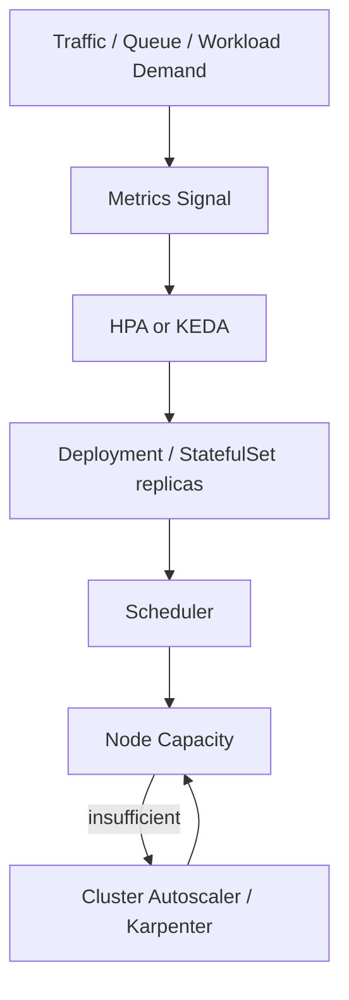

# Part 027 — Autoscaling

Autoscaling adalah mekanisme untuk menyesuaikan kapasitas sistem berdasarkan perubahan demand. Di Kubernetes, autoscaling bukan satu fitur tunggal. Ada beberapa lapisan yang saling terkait:

```text
Application demand
  -> Pod replicas
  -> Pod resource sizing
  -> Node capacity
  -> Cloud/on-prem infrastructure capacity
```

Untuk backend Java/JAX-RS enterprise, autoscaling harus dipahami sebagai **control loop yang punya delay, signal quality, bottleneck, dan failure mode**. Autoscaling yang salah bisa lebih berbahaya daripada tidak autoscaling sama sekali.

Contoh kesalahan umum:

- HPA scale out berdasarkan CPU, tetapi bottleneck sebenarnya database connection pool.
- Consumer Kafka/RabbitMQ scale out terlalu agresif, lalu downstream PostgreSQL overload.
- HPA tidak bekerja karena container tidak memiliki CPU request.
- Cluster Autoscaler menambah node terlalu lambat sehingga pod Pending terlalu lama.
- Readiness probe terlalu cepat hijau sehingga pod menerima traffic sebelum JVM warm.
- Scale down mematikan consumer saat masih memproses message.
- HPA dan VPA saling mengganggu karena sama-sama mengubah dimensi kapasitas.
- Scale-to-zero dipakai untuk workload yang harus selalu menerima traffic low-latency.

> CSG note: jangan mengasumsikan autoscaling strategy di CSG. Verifikasi HPA/VPA/KEDA, metrics backend, cluster autoscaler/Karpenter, node pool strategy, min/max replica, scaling metric, consumer lag metric, downstream protection, dan runbook autoscaling dengan platform/SRE/backend team.

---

## 1. Core Concept

Autoscaling menjawab tiga pertanyaan berbeda:

```text
How many Pods should run?
How large should each Pod be?
How much cluster capacity is needed?
```

Di Kubernetes, tiga pertanyaan ini biasanya dipisah:

| Problem | Kubernetes mechanism | Scales what? |
|---|---|---|
| More traffic needs more replicas | Horizontal Pod Autoscaler | Pod replica count |
| Pod resource request too low/high | Vertical Pod Autoscaler | CPU/memory request recommendation or update |
| Cluster lacks nodes for pods | Cluster Autoscaler / Karpenter / AKS autoscaler | Node count/capacity |
| Queue backlog needs consumers | KEDA / custom HPA external metrics | Pod replica count |

Mental model:



Autoscaling is not magic. It is only as good as:

- the metric,
- the target,
- the scaling policy,
- the pod startup time,
- the scheduler capacity,
- the downstream dependency capacity,
- the readiness behavior,
- the shutdown behavior,
- the observability around all of the above.

---

## 2. Autoscaling Is a Feedback Control Loop

A control loop observes state, compares it with desired target, then applies change.

Simplified HPA loop:

```text
observe metric
  -> compare current metric with target
  -> compute desired replicas
  -> update scale subresource
  -> Deployment creates/removes Pods
  -> scheduler places Pods
  -> kubelet starts containers
  -> readiness passes
  -> traffic shifts
  -> metrics change later
```

Important implication:

```text
Autoscaling reacts after load exists.
It does not eliminate the need for baseline capacity.
```

For mission-critical Java services, you usually need:

- non-zero baseline replicas,
- enough warm capacity for sudden spikes,
- readiness gates to avoid cold pod traffic,
- enough node headroom or fast node provisioning,
- downstream protection,
- rate limits and backpressure,
- alerting when scaling is saturated.

---

## 3. Scaling Planes

There are multiple scaling planes:

```text
Replica scaling     -> more pods
Resource scaling    -> larger pods
Node scaling        -> more or larger nodes
Dependency scaling  -> database/cache/broker capacity
Traffic scaling     -> ingress/LB/API gateway capacity
Operational scaling -> dashboards, alerts, runbooks, on-call response
```

A common senior-engineering mistake is optimizing only replica scaling while ignoring dependency scaling.

Example:

```text
REST API replicas: 5 -> 50
PostgreSQL max connections: unchanged
Connection pool per pod: 30
Potential DB connections: 150 -> 1500
Result: DB saturation, timeout storm, retry storm
```

Autoscaling must be designed with downstream limits.

---

## 4. Horizontal Pod Autoscaler

HPA changes the replica count of a scalable resource such as Deployment, StatefulSet, or custom workload that exposes the scale subresource.

Basic HPA flow:

```text
HPA watches metric
  -> computes desired replicas
  -> updates target replicas
  -> Deployment reconciles ReplicaSet
  -> Pods are added or removed
```

Example:

```yaml
apiVersion: autoscaling/v2
kind: HorizontalPodAutoscaler
metadata:
  name: quote-service
spec:
  scaleTargetRef:
    apiVersion: apps/v1
    kind: Deployment
    name: quote-service
  minReplicas: 3
  maxReplicas: 20
  metrics:
    - type: Resource
      resource:
        name: cpu
        target:
          type: Utilization
          averageUtilization: 70
```

This says:

```text
Keep average CPU utilization near 70% of requested CPU.
Never run below 3 replicas.
Never run above 20 replicas.
```

Subtle but critical:

```text
CPU utilization is based on CPU request, not CPU limit.
```

If a container has no CPU request, CPU utilization based HPA cannot reason correctly.

---

## 5. HPA Formula Intuition

Simplified HPA formula:

```text
desiredReplicas = currentReplicas * currentMetric / targetMetric
```

Example:

```text
current replicas = 4
current CPU utilization = 140%
target CPU utilization = 70%

desired replicas = 4 * 140 / 70 = 8
```

This is why target selection matters.

Too low:

```text
HPA scales out too early
  -> excess cost
  -> more DB connections
  -> more cache pressure
  -> more network chatter
```

Too high:

```text
Pods run hot
  -> latency spike
  -> CPU throttling
  -> long GC pause risk
  -> slow readiness
  -> timeout storm
```

---

## 6. Metrics Server

Metrics Server provides basic resource metrics to Kubernetes, commonly CPU and memory.

HPA using resource metrics depends on:

- Metrics Server installed,
- kubelet summary API availability,
- valid resource requests,
- metrics freshness,
- no RBAC/network blocking between Metrics Server and nodes.

Failure symptoms:

```text
kubectl get hpa
  -> current metrics: <unknown>
```

Common causes:

- Metrics Server not installed,
- Metrics Server cannot scrape kubelets,
- TLS/auth issue,
- pod missing CPU request,
- metrics delay,
- RBAC issue.

Debug commands:

```bash
kubectl top pods -n <namespace>
kubectl top nodes
kubectl describe hpa <name> -n <namespace>
kubectl get apiservice v1beta1.metrics.k8s.io
```

---

## 7. CPU-Based Scaling

CPU is the most common HPA metric. It works well when CPU correlates with demand.

Good candidates:

- CPU-bound request processing,
- serialization/deserialization heavy APIs,
- calculation-heavy services,
- validation-heavy flows,
- transformation workers.

Weak candidates:

- IO-bound services,
- DB-bound services,
- external API-bound services,
- lock-contention-heavy services,
- queue consumers where lag is the real demand metric,
- services bottlenecked by connection pool.

For Java/JAX-RS services, CPU-based scaling can work for REST APIs, but only if:

- CPU request is realistic,
- latency correlates with CPU,
- downstream dependency is not the actual bottleneck,
- JVM warmup is accounted for,
- GC overhead is observed,
- max replicas will not overload DB/cache/broker.

---

## 8. Memory-Based Scaling

Memory-based HPA is often misunderstood.

Memory usage in Java usually does not drop immediately after traffic drops because:

- heap expands and remains committed,
- object allocation patterns vary,
- GC timing is not directly traffic-proportional,
- metaspace/direct memory/thread stacks are persistent,
- cache inside process may retain objects.

This means memory is often a poor metric for horizontal scaling Java services.

Memory HPA can cause:

```text
memory remains high
  -> HPA scales out
  -> each new JVM warms heap/cache
  -> total memory grows
  -> cost increases
  -> no real pressure relieved
```

Use memory scaling carefully. It is more useful when memory usage genuinely correlates with queue backlog or concurrent workload size.

For JVM services, memory is often better used for:

- right-sizing request/limit,
- detecting leaks,
- setting alerts,
- protecting nodes from OOM,
- VPA recommendation,
- not as primary HPA metric.

---

## 9. Custom Metrics

Custom metrics let HPA scale based on application-specific signals.

Examples:

- HTTP requests per second per pod,
- p95 latency,
- active request count,
- pending work items,
- worker busy ratio,
- thread pool queue depth,
- database connection pool saturation,
- Kafka consumer lag,
- RabbitMQ queue depth,
- Camunda external task backlog.

Custom metrics are powerful because they can reflect real demand better than CPU.

But they require discipline:

- metric definition must be stable,
- metric cardinality must be controlled,
- metric scraping must be reliable,
- target must be chosen carefully,
- scaling must not amplify downstream failure,
- dashboard must explain why HPA acted.

Bad metric example:

```text
Scale REST API replicas based on p95 latency without understanding DB timeout spike.
```

Result:

```text
More pods generate more DB pressure.
Latency gets worse.
HPA continues scaling.
Incident expands.
```

---

## 10. External Metrics

External metrics come from systems outside the pod resource metrics pipeline.

Examples:

- Kafka lag from broker/exporter,
- RabbitMQ queue length,
- SQS queue depth,
- Azure Service Bus queue length,
- cloud load balancer request count,
- business backlog metric,
- workflow task backlog.

External metrics are useful for asynchronous workloads because demand is often visible as backlog.

But they introduce failure modes:

- metric adapter unavailable,
- metric delayed,
- metric name mismatch,
- auth problem to metrics backend,
- stale backlog values,
- noisy backlog from poison messages,
- scaling based on backlog but processing is blocked by downstream dependency.

---

## 11. Queue-Based Scaling

Queue-based scaling is common for Kafka/RabbitMQ consumers.

The basic idea:

```text
backlog high -> add consumers
backlog low  -> remove consumers
```

But safe consumer scaling requires understanding:

- partition count,
- consumer group behavior,
- ordering requirements,
- message processing time,
- retry policy,
- DLQ behavior,
- idempotency,
- downstream database capacity,
- graceful shutdown,
- rebalance cost,
- visibility timeout or ack timeout.

For Kafka:

```text
Max useful consumer replicas for one consumer group is often bounded by partition count.
```

If a topic has 12 partitions, running 50 consumers in one group usually does not increase parallelism beyond 12 active consumers.

For RabbitMQ:

```text
Concurrency depends on queue design, prefetch, ack mode, consumer count, and ordering requirements.
```

A consumer can scale too far and create:

- DB lock contention,
- duplicate processing risk,
- dead-letter storm,
- retry storm,
- broker pressure,
- out-of-order side effects,
- downstream rate limit violations.

---

## 12. KEDA Awareness

KEDA provides event-driven autoscaling for Kubernetes workloads. It commonly integrates with queue systems, brokers, cloud services, and external metrics.

KEDA pattern:

```text
Scaler observes external system
  -> KEDA updates HPA-like scaling decision
  -> workload replicas change
```

Example conceptual ScaledObject:

```yaml
apiVersion: keda.sh/v1alpha1
kind: ScaledObject
metadata:
  name: quote-consumer
spec:
  scaleTargetRef:
    name: quote-consumer
  minReplicaCount: 1
  maxReplicaCount: 20
  pollingInterval: 30
  cooldownPeriod: 300
  triggers:
    - type: kafka
      metadata:
        bootstrapServers: kafka.example:9092
        topic: quote-events
        consumerGroup: quote-consumer
        lagThreshold: "100"
```

Review questions:

- What exact backlog/lag metric is used?
- Is authentication to broker secure?
- Does scaling respect partition/concurrency limits?
- What happens on poison messages?
- What happens when broker is unavailable?
- What is the cooldown period?
- Does scale-down allow graceful message completion?
- Does maxReplicaCount protect downstream dependencies?

> Internal verification checklist: verify whether KEDA is installed, allowed, supported by platform team, connected to Kafka/RabbitMQ/cloud queues, and included in production runbooks.

---

## 13. Scale-to-Zero

Scale-to-zero means replicas can become 0 when no work exists.

This may be useful for:

- infrequent batch processors,
- development/test workloads,
- cost-sensitive non-critical jobs,
- event-driven workers with acceptable cold start.

It is risky for:

- latency-sensitive REST APIs,
- always-on business APIs,
- services with expensive JVM warmup,
- consumers that must react immediately,
- services with strict availability SLO,
- dependencies requiring warm connection pools.

For Java/JAX-RS services, cold start is not just container start. It may include:

- image pull,
- JVM startup,
- class loading,
- dependency injection/container initialization,
- JIT warmup,
- TLS connection setup,
- DB pool initialization,
- cache warmup,
- readiness probe delay,
- ingress/service endpoint propagation.

Scale-to-zero must be treated as an explicit product/SLO trade-off.

---

## 14. Scaling Latency

Autoscaling is delayed by multiple stages:

```text
Load increases
  -> metric observed later
  -> HPA sync loop runs
  -> Deployment scales
  -> Pod scheduled
  -> image pulled if not cached
  -> container starts
  -> JVM warms
  -> readiness passes
  -> Service endpoint updates
  -> traffic reaches new Pod
```

This delay can be seconds to minutes.

Latency drivers:

- HPA sync period,
- metrics scrape interval,
- metric adapter delay,
- image pull time,
- pod scheduling delay,
- node provisioning delay,
- JVM startup time,
- readiness delay,
- ingress/LB endpoint propagation,
- dependency warmup.

Design implication:

```text
Autoscaling handles sustained load better than sudden vertical spikes.
```

For sudden spikes, consider:

- higher minReplicas,
- predictive scaling if available,
- queue buffering,
- rate limiting,
- graceful degradation,
- pre-warmed capacity,
- faster image pulls,
- smaller images,
- startup probe tuning.

---

## 15. Thrashing

Thrashing happens when autoscaler rapidly scales up and down.

Symptoms:

- replica count oscillates,
- frequent pod creation/deletion,
- unstable latency,
- consumer group rebalancing repeatedly,
- cold pods receiving traffic,
- cost spike,
- deployment noise,
- alert fatigue.

Causes:

- target too aggressive,
- metric too noisy,
- cooldown too short,
- workload has bursty traffic,
- scale-down too fast,
- readiness not aligned with real capacity,
- queue backlog drains quickly then returns,
- downstream dependency latency oscillates.

Mitigation:

- stabilization windows,
- scale-up/down policies,
- minimum replicas,
- cooldown period,
- smoother metric,
- better target,
- queue buffering,
- downstream rate limit,
- separate consumer groups by workload class.

Example HPA behavior tuning:

```yaml
behavior:
  scaleUp:
    stabilizationWindowSeconds: 60
    policies:
      - type: Percent
        value: 100
        periodSeconds: 60
  scaleDown:
    stabilizationWindowSeconds: 300
    policies:
      - type: Percent
        value: 25
        periodSeconds: 60
```

Interpretation:

```text
Scale up can be faster.
Scale down is slower and more conservative.
```

This is usually safer for production APIs.

---

## 16. Vertical Pod Autoscaler

VPA recommends or changes CPU/memory requests based on observed usage.

Modes vary by installation and policy:

- recommendation only,
- initial recommendation at pod creation,
- auto update with pod restart/eviction.

VPA is useful for:

- right-sizing workloads,
- detecting overprovisioning,
- identifying under-requested pods,
- cost optimization,
- capacity planning.

But VPA can be risky for Java services if it restarts pods unexpectedly or conflicts with HPA behavior.

Common pattern:

```text
Use VPA recommendation for analysis.
Use humans/PRs/GitOps to apply resource changes.
```

For JVM workloads, VPA recommendation must be interpreted with:

- heap sizing,
- off-heap memory,
- direct buffer memory,
- thread stacks,
- metaspace,
- GC behavior,
- traffic seasonality,
- burst requirements,
- startup memory peak.

---

## 17. HPA and VPA Interaction

HPA and VPA can interact badly if not designed carefully.

HPA changes replica count.
VPA changes resource requests.

CPU utilization HPA depends on CPU request:

```text
CPU utilization = actual CPU usage / CPU request
```

If VPA increases CPU request, HPA observed utilization may drop even if actual load is unchanged.

Example:

```text
Actual CPU usage per pod: 500m
CPU request before VPA: 500m -> utilization 100%
CPU request after VPA: 1000m -> utilization 50%
HPA target: 70%
HPA may scale down
```

This may be correct or dangerous depending on workload.

Internal rule should define:

- whether VPA is enabled,
- mode used,
- whether HPA and VPA can coexist,
- which metrics HPA uses,
- who approves VPA changes,
- whether VPA evictions are allowed in production.

---

## 18. Cluster Autoscaler

Cluster Autoscaler adds/removes nodes when pods cannot be scheduled due to insufficient cluster capacity.

Important distinction:

```text
HPA creates more Pods.
Cluster Autoscaler creates more node capacity.
```

Flow:

```text
HPA increases replicas
  -> new Pods Pending
  -> scheduler cannot place Pods
  -> Cluster Autoscaler detects unschedulable Pods
  -> node group scales up
  -> node joins cluster
  -> pods scheduled
```

This can take minutes.

Failure cases:

- node group max size reached,
- quota exhausted,
- subnet IP exhausted,
- cloud capacity unavailable,
- taints/affinity prevent placement,
- PVC zone constraints block scheduling,
- pod request too large for any node shape,
- IAM/cloud permission issue,
- autoscaler disabled for node group.

Debugging clues:

```bash
kubectl get pods -n <namespace>
kubectl describe pod <pending-pod> -n <namespace>
kubectl get events -n <namespace> --sort-by=.lastTimestamp
```

Look for:

```text
0/10 nodes are available: insufficient cpu
0/10 nodes are available: node(s) didn't match Pod's node affinity
0/10 nodes are available: had untolerated taint
```

---

## 19. Karpenter Awareness for AWS

Karpenter is commonly used in AWS/EKS environments to provision right-sized nodes dynamically.

Conceptually, Karpenter can respond to unschedulable pods by launching nodes that fit workload requirements.

Senior backend engineer does not need to operate Karpenter deeply unless owning platform, but should understand its application impact:

- new node startup adds scale latency,
- instance type availability matters,
- spot interruption may affect workloads,
- node consolidation can trigger pod disruption,
- placement constraints affect node provisioning,
- resource requests influence node size selection,
- daemonset overhead affects capacity,
- PDB and topology rules affect consolidation/drain.

Internal verification questions:

- Is Karpenter used or Cluster Autoscaler?
- Are critical services allowed on spot nodes?
- Is consolidation enabled?
- Are interruption notices handled?
- What node classes/pools exist?
- Are resource requests accurate enough for provisioning?

---

## 20. AKS Cluster Autoscaling Awareness

In AKS, cluster autoscaling is commonly tied to node pools.

Important concerns:

- system vs user node pool,
- min/max count per node pool,
- VM SKU availability,
- Azure CNI IP capacity,
- subnet size,
- NSG/UDR constraints,
- zone availability,
- spot node pool behavior,
- maintenance windows,
- quota limits.

For backend workloads, the application-level question is:

```text
If HPA asks for more pods, can AKS provide enough eligible node capacity quickly and safely?
```

---

## 21. On-Prem Autoscaling Reality

On-prem Kubernetes may not have elastic node capacity like cloud.

Implications:

- HPA can create pods that remain Pending,
- node capacity planning is more important,
- overprovisioning buffer may be required,
- hardware procurement is slow,
- autoscaling may be limited to replica scaling within fixed capacity,
- cluster autoscaler may not exist or may integrate with private virtualization platform.

For on-prem/hybrid systems, autoscaling design must include:

- fixed capacity envelope,
- priority classes,
- quota,
- admission policy,
- graceful degradation,
- workload shedding,
- capacity review cadence.

---

## 22. Autoscaling REST APIs

For JAX-RS REST services, scaling signals might include:

- CPU utilization,
- request rate per pod,
- concurrent in-flight requests,
- p95/p99 latency,
- thread pool queue depth,
- connection pool saturation,
- error rate,
- dependency timeout rate.

CPU is often acceptable when the service is CPU-correlated.

Better architecture:

```text
Primary scaling metric: CPU or request-per-pod
Guardrails: latency, error rate, dependency saturation
Max replicas: set based on downstream capacity
```

Review questions:

- What is the max safe replica count before DB/cache/broker becomes overloaded?
- Does each pod open a fixed connection pool?
- Does scale-out multiply outbound connections?
- Does ingress/load balancer distribute fairly?
- Are new pods ready only after warmup?
- Is there rate limiting before downstream collapse?

---

## 23. Autoscaling Kafka Consumers

Kafka consumer autoscaling should consider:

- consumer group,
- topic partition count,
- lag per partition,
- processing time per message,
- ordering requirements,
- rebalance behavior,
- commit strategy,
- idempotency,
- downstream capacity,
- max poll interval,
- graceful shutdown.

Scaling too high can be pointless when partition count is lower than replicas.

```text
Topic partitions: 8
Consumer replicas: 20
Useful active consumers in one group: up to 8
Extra pods: waste or standby depending on client behavior
```

Failure modes:

- rebalance storm,
- duplicate processing after abrupt shutdown,
- lag metric stale,
- poison messages keep lag high,
- consumers scale out but DB becomes bottleneck,
- max.poll.interval.ms exceeded,
- commit happens before side effect is durable,
- pod killed before offset commit.

For Kafka consumers, autoscaling is not only a capacity problem. It is a correctness problem.

---

## 24. Autoscaling RabbitMQ Consumers

RabbitMQ consumer scaling should consider:

- queue depth,
- prefetch count,
- manual vs auto ack,
- message processing time,
- delivery timeout,
- ordering expectations,
- retry/dead-letter behavior,
- connection/channel count,
- broker resource pressure,
- downstream capacity.

Common mistake:

```text
Queue depth high -> add many consumers -> DB overloaded -> messages fail -> retries increase -> queue depth worsens
```

Scaling must be paired with:

- max concurrency,
- prefetch tuning,
- idempotent processing,
- backoff,
- DLQ design,
- circuit breaker to downstream,
- alert on retry/DLQ rate.

---

## 25. Autoscaling Workers and Camunda-like Workloads

For workflow/task workers, scaling depends on:

- task backlog,
- lock duration,
- worker polling interval,
- task type,
- business priority,
- external service limits,
- idempotency,
- compensation behavior,
- timeout/retry behavior.

A worker may not be safely scalable if:

- tasks are not idempotent,
- external side effects cannot be repeated,
- lock timeout is too short,
- scaling causes external API rate limit breach,
- ordering matters,
- compensation is weak.

For mission-critical workflows:

```text
Scale only after correctness model is clear.
```

---

## 26. Downstream Dependency Protection

Autoscaling multiplies demand on dependencies.

For each workload, calculate:

```text
maxPods * perPodConcurrency = maximum concurrent work
maxPods * DB pool size = maximum DB connections
maxPods * outbound HTTP pool = maximum external connections
maxPods * consumer concurrency = maximum parallel message processing
```

Example:

```text
maxReplicas = 30
DB pool per pod = 20
Potential DB connections = 600
```

If PostgreSQL safe connection budget for the service is 120, this HPA max is unsafe unless connection pool is reduced or pooled externally.

Senior autoscaling review always asks:

```text
What breaks first when this scales to maxReplicas?
```

---

## 27. Readiness and Autoscaling

Autoscaling depends on readiness correctness.

New pods should not receive traffic until they are truly ready.

For Java service readiness may require:

- HTTP server bound,
- dependency injection complete,
- critical config loaded,
- DB pool initialized if needed,
- cache initialized if required,
- message consumer not yet accepting until ready,
- warmup complete enough for expected latency.

Readiness too early:

```text
HPA scales out
  -> new cold pods ready too soon
  -> traffic sent to cold JVM
  -> latency spike
  -> more HPA scale-out
```

Readiness too strict:

```text
dependency slow
  -> pods never ready
  -> rollout stuck
  -> capacity unavailable
```

Readiness design must balance traffic safety and dependency failure isolation.

---

## 28. Graceful Scale-Down

Scale-down is termination. Termination is a correctness event.

During scale-down:

```text
HPA lowers replicas
  -> Deployment deletes Pods
  -> endpoints removed eventually
  -> SIGTERM sent
  -> terminationGracePeriodSeconds starts
  -> container exits or gets SIGKILL
```

For REST services:

- stop accepting new traffic,
- drain in-flight requests,
- close HTTP server gracefully,
- stop background schedulers,
- flush logs/traces.

For consumers:

- stop polling,
- finish current message if possible,
- commit offset/ack only after durable side effect,
- release locks,
- close broker connection.

Scale-down failure modes:

- duplicate message processing,
- lost in-flight request,
- partial transaction,
- offset committed incorrectly,
- broker redelivery storm,
- stuck termination until SIGKILL.

---

## 29. PDB, Rollout, and Autoscaling

PodDisruptionBudget affects voluntary disruptions, not all disruptions.

Autoscaling interactions:

- HPA scale-down may reduce replicas near PDB thresholds.
- Cluster autoscaler node drain may be blocked by PDB.
- Rollout surge pods need schedulable capacity.
- Topology spread can prevent new pods from scheduling.
- Min replicas must align with availability requirements.

Example issue:

```text
minReplicas = 2
PDB minAvailable = 2
Rolling update maxUnavailable = 1
Node drain cannot evict pod safely
```

Autoscaling cannot be reviewed in isolation from rollout and disruption policy.

---

## 30. Resource Requests and Autoscaling

Resource requests drive:

- scheduling,
- HPA CPU utilization percentage,
- cluster autoscaler node sizing,
- cost attribution,
- bin packing,
- QoS class.

Bad request values create bad autoscaling.

Under-requesting CPU:

```text
actual CPU: 500m
request: 100m
utilization: 500%
HPA scales aggressively
scheduler thinks pod is cheap
node becomes overloaded
```

Over-requesting CPU:

```text
actual CPU: 200m
request: 2000m
utilization: 10%
HPA may not scale
scheduler wastes node capacity
cost increases
```

For Java, request sizing must account for:

- baseline CPU,
- request peak,
- GC CPU,
- startup CPU,
- consumer batch CPU,
- encryption/serialization CPU,
- p95 traffic profile.

---

## 31. JVM-Specific Autoscaling Concerns

Java has characteristics that affect autoscaling:

- cold start can be slower than Go/Node services,
- JIT warmup affects latency,
- heap behavior affects memory signals,
- GC can create periodic CPU spikes,
- thread pools can saturate before CPU saturates,
- DB pools multiply with replicas,
- shutdown hooks must finish within grace period,
- image size affects pull time,
- classpath and framework startup affect readiness delay.

Scaling decision should account for:

```text
startup time + readiness delay + metric delay + node provisioning delay
```

A service that takes 90 seconds to become truly useful cannot rely on reactive HPA alone for sudden spikes.

---

## 32. EKS Concerns

In EKS, autoscaling design may involve:

- HPA,
- VPA if installed,
- KEDA if installed,
- Cluster Autoscaler,
- Karpenter,
- managed node groups,
- self-managed node groups,
- Fargate profiles,
- VPC CNI IP capacity,
- subnet capacity,
- instance type availability,
- spot interruption,
- CloudWatch/Prometheus metrics.

EKS-specific failure examples:

- HPA creates pods, but subnet lacks IP capacity.
- Karpenter cannot provision instance type due to constraints.
- Spot nodes are interrupted and consumers rebalance.
- Security groups or NetworkPolicy block metrics adapter.
- IRSA for metrics adapter is broken.

Internal verification checklist:

- autoscaler type,
- node group limits,
- Karpenter node pools/classes,
- subnet IP headroom,
- spot usage policy,
- CloudWatch/Prometheus metrics source,
- KEDA scaler auth.

---

## 33. AKS Concerns

In AKS, autoscaling design may involve:

- HPA,
- VPA if installed,
- KEDA integration,
- cluster autoscaler per node pool,
- system/user node pools,
- Azure CNI IP capacity,
- subnet size,
- VMSS scaling,
- spot node pools,
- Azure Monitor/Log Analytics metrics,
- Managed Identity/Workload Identity for metric access.

AKS-specific failure examples:

- node pool max count reached,
- subnet IP exhaustion under Azure CNI,
- VM SKU capacity unavailable,
- KEDA scaler cannot authenticate,
- metrics unavailable in Azure Monitor,
- user workloads scheduled onto wrong node pool.

Internal verification checklist:

- node pool autoscaler settings,
- Azure CNI mode,
- subnet capacity,
- KEDA add-on usage,
- spot policy,
- Azure Monitor metrics,
- identity used by scaler.

---

## 34. Observability for Autoscaling

Autoscaling must be observable.

Minimum dashboard signals:

- desired replicas,
- current replicas,
- available replicas,
- HPA current metric,
- HPA target metric,
- scaling events,
- pending pods,
- unschedulable reasons,
- node utilization,
- CPU throttling,
- memory usage/OOMKilled,
- request rate,
- latency,
- error rate,
- DB pool usage,
- Kafka lag/RabbitMQ queue depth,
- consumer processing rate,
- DLQ/retry rate,
- cluster autoscaler/Karpenter events.

Autoscaling alert examples:

- HPA at max replicas and latency high,
- HPA metric unknown,
- pods Pending longer than threshold,
- queue lag increasing while replicas at max,
- CPU throttling high after scale-out,
- DB connection pool saturated after scale-out,
- node provisioning failures,
- frequent scale oscillation.

---

## 35. Debugging HPA Not Scaling

Symptoms:

```text
Load high but replicas unchanged.
```

Check:

```bash
kubectl get hpa -n <namespace>
kubectl describe hpa <name> -n <namespace>
kubectl top pods -n <namespace>
kubectl get deployment <name> -n <namespace>
```

Possible causes:

- metric unknown,
- CPU request missing,
- target metric not exceeded,
- maxReplicas already reached,
- scale up stabilization/policy limiting changes,
- HPA references wrong target,
- target does not support scale subresource,
- custom metric adapter failure,
- RBAC issue,
- metrics stale.

Review HPA events carefully. They usually reveal the first broken assumption.

---

## 36. Debugging HPA Over-Scaling

Symptoms:

```text
Replicas increase aggressively, but user experience does not improve.
```

Check:

- CPU target too low,
- request too low,
- metric noise,
- DB latency,
- external API latency,
- retry storm,
- thread pool queue,
- GC overhead,
- readiness too early,
- downstream saturation,
- queue poison messages,
- maxReplicas too high.

Senior diagnosis:

```text
Ask whether HPA is scaling the bottleneck or amplifying it.
```

---

## 37. Debugging Pods Pending After Scale-Out

Symptoms:

```text
HPA desired replicas > current available replicas
new pods Pending
```

Check:

```bash
kubectl describe pod <pending-pod> -n <namespace>
kubectl get events -n <namespace> --sort-by=.lastTimestamp
kubectl describe node <node>
```

Possible causes:

- insufficient CPU/memory,
- quota exceeded,
- LimitRange issue,
- node affinity impossible,
- taint not tolerated,
- topology spread unsatisfiable,
- PVC zone conflict,
- image pull issue,
- cluster autoscaler maxed,
- subnet IP exhaustion,
- cloud quota exhausted.

---

## 38. Debugging Queue Autoscaling

Symptoms:

```text
Queue lag high but consumers do not scale.
```

Check:

- scaler installed,
- scaler auth works,
- metric name correct,
- topic/queue name correct,
- consumer group correct,
- lag/queue metric visible,
- min/max replica config,
- cooldown period,
- trigger threshold,
- external metrics API,
- broker network connectivity.

Symptoms:

```text
Consumers scale but lag does not reduce.
```

Check:

- partition count,
- per-message processing time,
- downstream DB latency,
- retry/DLQ rate,
- poison messages,
- consumer errors,
- ack/commit behavior,
- broker throttling,
- resource throttling,
- thread pool saturation.

---

## 39. Failure Modes

| Failure mode | Likely cause | Detection | Mitigation |
|---|---|---|---|
| HPA metric unknown | Metrics Server/adaptor issue | `kubectl describe hpa` | Fix metrics pipeline |
| HPA not scaling | Target not exceeded, max/min constraint | HPA status/events | Adjust target/config |
| HPA over-scaling | Bad metric/request/target | Replica oscillation, cost spike | Tune metric/behavior |
| Pods Pending | No schedulable capacity | Pod events | Fix requests/node capacity/constraints |
| Cluster autoscaler not adding nodes | Maxed node group, quota, constraints | autoscaler logs/events | Increase limits/fix constraints |
| Queue lag persists | Bottleneck not consumer count | lag + processing metrics | Fix downstream/consumer logic |
| Consumer duplicates | Bad shutdown/commit behavior | duplicate side effects | Fix idempotency/shutdown |
| DB overload after scale-out | Connection multiplication | DB metrics | Cap replicas/pools/rate |
| Scale-down data loss | abrupt termination | logs, missing commits | graceful shutdown/PDB |
| Thrashing | noisy metric/cooldown too low | replica oscillation | stabilization/cooldown |

---

## 40. Performance Concerns

Autoscaling affects performance through:

- cold start,
- JIT warmup,
- image pull latency,
- uneven load balancing,
- new pod connection storms,
- DB/cache pool expansion,
- node CPU contention,
- GC behavior,
- network path saturation,
- broker rebalance overhead.

Performance review questions:

- How long from scale signal to ready pod?
- What is p95/p99 latency during scale-out?
- Do new pods cause DB connection storms?
- Is warmup required before readiness?
- Does scale-down interrupt requests/messages?
- Is max replica count tested?
- Does load test include autoscaling behavior?

---

## 41. Security Concerns

Autoscaling can affect security indirectly:

- more pods means more identities/tokens active,
- more nodes means larger attack surface,
- spot/preemptible nodes may have different risk posture,
- autoscaled jobs may amplify secret access,
- metrics adapters may need cloud/broker credentials,
- KEDA scaler authentication must be secured,
- debug access during scaling incident must remain controlled.

Review:

- ServiceAccount used by scaled workload,
- IAM/Workload Identity permissions,
- KEDA trigger authentication,
- secret exposure in scaler config,
- RBAC for HPA/VPA/KEDA controllers,
- admission policy for max replicas/resource bounds.

---

## 42. Cost Concerns

Autoscaling is cost control only when bounded and observable.

Cost drivers:

- maxReplicas too high,
- over-requested resources,
- node overprovisioning,
- cluster autoscaler buffer,
- Karpenter node choice,
- load balancer cost,
- NAT gateway egress cost,
- logging/metrics cost from more pods,
- queue retry storm increasing compute,
- scale thrashing.

Cost review questions:

- What is worst-case cost at max scale?
- Is maxReplicas justified by load test?
- Are resource requests accurate?
- Does scale-out increase NAT/logging costs?
- Are cost labels applied?
- Is there alerting on abnormal replica growth?

---

## 43. Correctness Concerns

Autoscaling changes concurrency. Concurrency changes correctness risk.

Correctness questions:

- Is processing idempotent?
- Are database updates safe under higher parallelism?
- Are unique constraints used correctly?
- Are distributed locks safe?
- Are Kafka offsets committed after durable side effects?
- Are RabbitMQ messages acked only after success?
- Are retries bounded?
- Does scale-down preserve in-flight work?
- Does ordering matter?
- Does more concurrency violate business invariants?

For regulatory/order/quote systems, correctness beats throughput.

---

## 44. Autoscaling PR Review Checklist

Use this checklist when reviewing HPA/KEDA/VPA/autoscaling changes:

- Is autoscaling necessary for this workload?
- What exact metric drives scaling?
- Does the metric represent demand or just symptoms?
- Is CPU request defined and realistic?
- Are minReplicas and maxReplicas justified?
- Is maxReplicas safe for PostgreSQL/Kafka/RabbitMQ/Redis/Camunda/external APIs?
- Is scale-up fast enough for SLO?
- Is scale-down conservative enough for correctness?
- Are stabilization windows configured?
- Are startup/readiness probes aligned with warmup?
- Are graceful shutdown and termination grace period safe?
- Are resource requests/limits compatible with HPA target?
- Are topology spread and PDB compatible with scale-out?
- Can cluster autoscaler provision nodes for max scale?
- Are queue scaling limits aligned with partition/concurrency model?
- Is idempotency guaranteed for consumers/workers?
- Is observability sufficient to explain scaling decisions?
- Are alerts defined for HPA at max, metric unknown, pending pods, backlog growth, and downstream saturation?
- Is there a rollback path?
- Is cost impact known?

---

## 45. Internal Verification Checklist

Verify internally:

- whether HPA is used,
- HPA API version and behavior config,
- standard min/max replica policy,
- CPU/memory request standard,
- whether VPA is installed,
- VPA mode allowed in production,
- whether KEDA is installed,
- supported KEDA scalers,
- Kafka lag metric source,
- RabbitMQ queue metric source,
- custom/external metrics adapter,
- Metrics Server health,
- Prometheus/CloudWatch/Azure Monitor integration,
- Cluster Autoscaler vs Karpenter vs AKS autoscaler,
- node group/node pool min/max,
- spot/preemptible policy,
- EKS subnet/IP capacity constraints,
- AKS Azure CNI/subnet constraints,
- max DB connection budget per service,
- max Kafka/RabbitMQ consumer concurrency,
- graceful shutdown implementation,
- autoscaling dashboards,
- autoscaling alerts,
- incident history related to scaling.

---

## 46. Key Takeaways

Autoscaling is not a checkbox. It is a production control system.

For senior backend engineers:

```text
HPA scales replicas, not bottlenecks.
VPA changes resource assumptions.
Cluster autoscaler changes infrastructure capacity.
KEDA connects external backlog to replica count.
Queue scaling is a correctness problem, not just throughput.
Java cold start and JVM memory behavior matter.
Max replicas must be bounded by downstream capacity.
Autoscaling without observability is blind automation.
```

A production-ready autoscaling design must be metric-aware, dependency-aware, correctness-aware, cost-aware, and debuggable under incident pressure.
