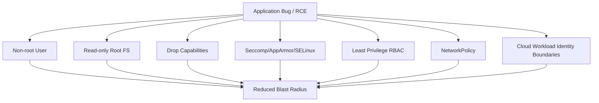

# Part 028 — Kubernetes Security Foundation

Kubernetes security dimulai dari prinsip sederhana:

```text
A Pod is not just an application deployment unit.
A Pod is also a security boundary candidate.
```

Tetapi Pod bukan security boundary yang sempurna. Container berbagi kernel node. Salah konfigurasi kecil seperti privileged container, HostPath mount, atau token automount berlebihan bisa mengubah bug aplikasi menjadi compromise node atau cluster.

Untuk enterprise Java/JAX-RS systems, Kubernetes security bukan hanya urusan platform team. Backend engineer yang menulis Dockerfile, Deployment, Helm values, probes, config, secret, dan service account ikut menentukan runtime security posture.

Security harus dipikirkan sebagai kombinasi:

- image security,
- runtime user,
- filesystem permission,
- Linux capabilities,
- kernel syscall filtering,
- host access prevention,
- Kubernetes RBAC,
- secret access,
- network segmentation,
- admission policy,
- runtime detection,
- observability and audit evidence.

> CSG note: jangan mengasumsikan Pod Security Standard, admission controller, image policy, runtime detection, seccomp profile, AppArmor/SELinux, atau exception process di CSG. Semua security standard harus diverifikasi di platform/security documentation, namespace policy, Helm chart, CI/CD gate, GitOps policy, dan diskusi dengan platform/SRE/security/backend team.

---

## 1. Core Concept

Security foundation untuk pod menjawab pertanyaan:

```text
What can this container do if the application is compromised?
```

Jika attacker mendapatkan remote code execution di aplikasi Java, batas kerusakan ditentukan oleh:

- user identity inside container,
- filesystem writable scope,
- Linux capabilities,
- privilege escalation ability,
- access to host namespace,
- mounted secrets,
- service account token permissions,
- network egress,
- access to cloud identity,
- admission/runtime controls.

Security hardening bertujuan mengurangi blast radius.



---

## 2. Threat Model for Backend Services

A realistic threat model for a Java/JAX-RS service includes:

- vulnerable dependency,
- unsafe deserialization,
- command injection,
- SSRF,
- path traversal,
- log injection,
- leaked secret,
- overly broad service account,
- compromised image,
- malicious init/sidecar container,
- exposed debug endpoint,
- egress to sensitive internal service,
- cloud IAM role misuse,
- insecure volume mount,
- writable container filesystem used for persistence or tampering.

Kubernetes hardening does not replace secure application code. It limits impact when application security fails.

---

## 3. Pod Security Standards

Pod Security Standards define broad security profiles for pods:

- **Privileged**: unrestricted; should be exceptional.
- **Baseline**: prevents known privilege escalations while allowing common workloads.
- **Restricted**: strongly hardened; best target for most application workloads.

For typical Java/JAX-RS application pods, target posture should usually be closer to Restricted:

- non-root user,
- no privileged container,
- no host namespace access,
- no dangerous capabilities,
- no HostPath,
- seccomp enabled,
- read-only root filesystem where feasible,
- controlled volume mounts.

Some infrastructure workloads may require stronger privileges, but application pods should not inherit platform-level privileges.

---

## 4. SecurityContext

`securityContext` can exist at pod level and container level.

Pod-level example:

```yaml
spec:
  securityContext:
    runAsNonRoot: true
    runAsUser: 10001
    runAsGroup: 10001
    fsGroup: 10001
    seccompProfile:
      type: RuntimeDefault
```

Container-level example:

```yaml
containers:
  - name: quote-service
    securityContext:
      allowPrivilegeEscalation: false
      readOnlyRootFilesystem: true
      capabilities:
        drop:
          - ALL
```

Mental model:

```text
Pod securityContext = default process/filesystem security for the pod.
Container securityContext = specific constraints for each container.
```

Container-level settings can override or refine pod-level settings.

---

## 5. Run as Non-Root

Running as root inside a container is dangerous because container isolation is not the same as a VM boundary.

Bad pattern:

```yaml
securityContext:
  runAsUser: 0
```

Better pattern:

```yaml
securityContext:
  runAsNonRoot: true
  runAsUser: 10001
  runAsGroup: 10001
```

Dockerfile should support this:

```dockerfile
RUN addgroup --system app && adduser --system --ingroup app app
USER app
```

For distroless images, user handling may differ, but the principle remains:

```text
Application process should not run as root.
```

Java impact:

- application must be able to read jar/config/certs,
- log to stdout/stderr instead of root-owned file path,
- write only to approved writable directories,
- bind to non-privileged port such as 8080,
- avoid requiring root-owned temp directory.

---

## 6. Non-Root Is Necessary but Not Sufficient

Non-root does not automatically make a pod secure.

A non-root process may still:

- read mounted secrets,
- call Kubernetes API if token has permission,
- access internal services over network,
- exploit kernel bugs,
- write to mounted volumes,
- use excessive capabilities if granted,
- abuse cloud identity,
- exfiltrate data through egress.

Security must be layered.

```text
Non-root reduces local privilege.
RBAC limits cluster API access.
NetworkPolicy limits network reach.
IAM limits cloud access.
Secret management limits credential exposure.
Admission policy prevents unsafe manifests.
```

---

## 7. Read-Only Root Filesystem

A read-only root filesystem prevents the application or attacker from modifying the container image filesystem at runtime.

Example:

```yaml
securityContext:
  readOnlyRootFilesystem: true
```

This helps against:

- runtime tampering,
- writing malware into image filesystem,
- accidental file writes,
- hidden state inside container,
- debugging hacks that become persistent assumptions.

Java services may still need writable paths for:

- `/tmp`,
- temporary upload buffering,
- native library extraction,
- heap dumps,
- GC logs if not sent to stdout,
- application temporary files.

Use explicit writable volumes:

```yaml
volumes:
  - name: tmp
    emptyDir: {}
containers:
  - name: quote-service
    volumeMounts:
      - name: tmp
        mountPath: /tmp
```

Review question:

```text
What exact paths must be writable, and why?
```

---

## 8. Capabilities

Linux capabilities split root privileges into smaller privileges.

A container may not need any extra capability for typical Java REST service.

Recommended baseline:

```yaml
securityContext:
  capabilities:
    drop:
      - ALL
```

Avoid adding capabilities unless justified.

Dangerous examples:

- `NET_ADMIN`: can alter network config.
- `SYS_ADMIN`: extremely broad; often equivalent to too much power.
- `SYS_PTRACE`: can inspect processes.
- `DAC_OVERRIDE`: bypass file permission checks.

For Java/JAX-RS services, extra capabilities are usually a smell.

If a service claims it needs capabilities, ask:

- Why does an application pod need this?
- Is this actually an infrastructure sidecar concern?
- Can the functionality be moved elsewhere?
- Is there a safer alternative?
- Is the exception documented and time-bound?

---

## 9. Privileged Containers

Privileged containers remove many isolation protections.

Bad pattern for application pods:

```yaml
securityContext:
  privileged: true
```

Privileged containers may be needed for some low-level infrastructure components, but they should almost never be needed for Java/JAX-RS application services.

Risk:

- host device access,
- kernel-level attack surface,
- container escape impact,
- ability to bypass normal controls,
- node compromise risk.

Review rule:

```text
Privileged application container should be treated as a production security exception requiring explicit approval.
```

---

## 10. allowPrivilegeEscalation

`allowPrivilegeEscalation` controls whether a process can gain more privileges than its parent process.

Recommended:

```yaml
securityContext:
  allowPrivilegeEscalation: false
```

This reduces risk from setuid binaries and similar mechanisms.

For minimal Java runtime images, privilege escalation should not be needed.

If disabling it breaks the application, investigate:

- base image content,
- startup script behavior,
- file ownership,
- runtime user,
- unnecessary OS packages,
- shell wrapper behavior.

---

## 11. Host Network

`hostNetwork: true` puts the pod into the node network namespace.

Bad pattern for normal application services:

```yaml
spec:
  hostNetwork: true
```

Risks:

- bypasses normal pod networking assumptions,
- port conflicts with host services,
- increased blast radius,
- harder NetworkPolicy behavior,
- exposure to node-local interfaces,
- confusing source/destination traffic analysis.

Application services should normally use pod networking and Service/Ingress abstractions.

Host network may be legitimate for certain platform agents, but not for regular Java REST APIs.

---

## 12. Host PID and Host IPC

Dangerous settings:

```yaml
spec:
  hostPID: true
  hostIPC: true
```

Risks:

- visibility into host processes,
- process inspection,
- IPC namespace exposure,
- lateral movement opportunity,
- privilege escalation assistance.

Typical Java/JAX-RS services should not require host PID or host IPC.

If present in an application manifest, treat as a high-severity review finding.

---

## 13. HostPath Risk

`hostPath` mounts a path from the node filesystem into the pod.

Example:

```yaml
volumes:
  - name: host-log
    hostPath:
      path: /var/log
```

Risk:

- read sensitive node files,
- write to node filesystem,
- persist across pod lifecycle,
- escape normal storage abstraction,
- node-specific behavior,
- bypass Kubernetes storage governance.

For application workloads, HostPath is usually an anti-pattern.

Safer alternatives:

- ConfigMap volume,
- Secret volume,
- EmptyDir,
- PVC,
- projected volume,
- object storage integration,
- stdout/stderr logging pipeline.

Review question:

```text
Why does this application need direct node filesystem access?
```

Usually the answer should be: it does not.

---

## 14. Seccomp

Seccomp restricts Linux system calls available to a container.

Recommended baseline:

```yaml
securityContext:
  seccompProfile:
    type: RuntimeDefault
```

This uses the container runtime default syscall filter.

Why it matters:

- reduces kernel attack surface,
- blocks unnecessary syscalls,
- helps contain compromised process,
- aligns with restricted security posture.

For normal Java services, RuntimeDefault should usually work.

If a service needs `Unconfined`, ask:

- Which syscall fails?
- Why is it needed?
- Is the base image doing something unusual?
- Is native code involved?
- Can the runtime or library be changed?
- Is the exception approved?

---

## 15. AppArmor Awareness

AppArmor is a Linux security module that can restrict program capabilities using profiles.

Kubernetes may support AppArmor depending on nodes and configuration.

For backend engineers, key awareness:

- AppArmor may enforce runtime restrictions beyond manifest settings,
- denied operations can appear as permission errors,
- profiles are platform-managed,
- profile changes can affect workload behavior,
- exceptions should be reviewed with platform/security.

Common symptom:

```text
Application fails to read/write/execute something despite filesystem permissions looking correct.
```

Possible cause:

```text
AppArmor profile denial.
```

---

## 16. SELinux Awareness

SELinux is another Linux security module common in some enterprise/on-prem environments.

It can enforce mandatory access control beyond UNIX file permissions.

Relevance:

- more common in hardened enterprise Linux environments,
- may affect volume mounts,
- may affect container file access,
- may require platform-managed labels/policies,
- can be important in on-prem Kubernetes.

Backend engineer does not need to write SELinux policy in most cases, but should recognize when a permission issue may not be a Java problem.

---

## 17. Admission Control

Admission controllers intercept requests to Kubernetes API before objects are persisted.

They can:

- reject unsafe manifests,
- mutate manifests to add defaults,
- enforce policy,
- require labels/annotations,
- enforce image registry rules,
- require resource requests,
- block privileged pods,
- enforce Pod Security Standards.

Tools may include:

- built-in Pod Security Admission,
- OPA Gatekeeper,
- Kyverno,
- custom admission webhooks,
- image policy webhooks.

Example policy behavior:

```text
Developer applies Deployment with privileged: true
  -> admission rejects request
  -> unsafe pod never reaches cluster state
```

This is better than detecting the problem after deployment.

---

## 18. Image Policy

Image policy controls what images may run.

Common controls:

- allowed registries only,
- no `latest` tag,
- digest pinning,
- signed image required,
- vulnerability scan required,
- SBOM required,
- base image allowlist,
- disallow untrusted public registry,
- block critical CVEs.

For enterprise Java services, image policy connects CI/CD and runtime security.

Review questions:

- Can this image be traced to a commit?
- Was it scanned?
- Was it signed?
- Is the base image approved?
- Is tag mutable?
- Is digest recorded?
- Can production pull from registry reliably?

---

## 19. Runtime Security

Runtime security detects suspicious behavior after pod starts.

Examples of suspicious behavior:

- shell spawned inside application container,
- unexpected outbound connection,
- writing executable file to `/tmp`,
- privilege escalation attempt,
- crypto miner behavior,
- scanning internal network,
- reading service account token unexpectedly,
- unexpected process tree.

Possible tooling:

- Falco-like runtime detection,
- cloud runtime security services,
- eBPF-based detection,
- node security agents,
- SIEM correlation.

Backend engineer should know:

- what runtime alerts exist,
- how alerts map to workloads,
- whether debug sessions create false positives,
- how to handle compromised pod suspicion.

---

## 20. ServiceAccount Token Exposure

By default, pods may receive a Kubernetes service account token.

If the application does not need to call the Kubernetes API, consider disabling token automount:

```yaml
spec:
  automountServiceAccountToken: false
```

Risk of unnecessary token:

- attacker with RCE can read token,
- token may call Kubernetes API,
- overbroad RBAC increases blast radius,
- token may help cluster reconnaissance.

If workload uses cloud identity through projected service account token, do not disable blindly. Understand the identity mechanism.

Review question:

```text
Does this Java application need Kubernetes API access, cloud workload identity, both, or neither?
```

---

## 21. Secret Mounting Security

Secrets can be exposed through:

- env vars,
- mounted files,
- projected volumes,
- init container files,
- sidecar sync,
- application logs,
- heap dumps,
- crash dumps,
- debug endpoints.

Security concerns:

- env vars may appear in process dumps or diagnostic output,
- mounted files can be read by compromised process,
- broad secret volume exposes unnecessary credentials,
- secrets can leak into logs,
- heap dump may contain credentials,
- excessive RBAC may allow reading all secrets in namespace.

Best practice direction:

```text
Mount only required secrets.
Prefer least privilege.
Avoid logging config dumps.
Rotate secrets.
Use external secret managers where appropriate.
```

---

## 22. Network Is Part of Runtime Security

Pod hardening is incomplete without network controls.

A compromised pod can still:

- call internal APIs,
- scan service DNS names,
- connect to databases,
- exfiltrate data,
- call cloud metadata or service endpoints,
- abuse outbound internet access.

NetworkPolicy and egress controls reduce this risk.

Security review should ask:

- Which services can call this pod?
- Which services can this pod call?
- Is DNS egress explicitly allowed?
- Is database egress scoped?
- Are Kafka/RabbitMQ/Redis endpoints scoped?
- Is outbound internet allowed?
- Are cloud API endpoints restricted/private?

This part covers security foundation; NetworkPolicy is covered deeper in Part 021.

---

## 23. Java/JAX-RS Runtime Security Impact

Kubernetes hardening interacts with Java runtime behavior.

Potential compatibility issues:

| Security control | Java impact |
|---|---|
| non-root user | file ownership must be correct |
| read-only root filesystem | `/tmp` or dump paths need explicit volume |
| drop capabilities | usually safe for Java services |
| seccomp RuntimeDefault | usually safe unless unusual native code |
| no host networking | service should bind normal pod port |
| no HostPath | logs must go stdout/stderr or approved volume |
| token automount disabled | app cannot call Kubernetes API unless explicitly configured |
| restricted egress | HTTP clients/cloud SDK may fail if endpoints not allowed |

Java service design should avoid requiring elevated container privileges.

A REST API needing root, HostPath, host networking, or privileged mode is usually a design smell.

---

## 24. PostgreSQL, Kafka, RabbitMQ, Redis, and Camunda Impact

Security hardening affects dependency access:

- PostgreSQL credentials must be scoped and rotated.
- Kafka client certs/secrets must be mounted securely.
- RabbitMQ credentials must not leak through env dumps/logs.
- Redis access should be network-scoped and authenticated where applicable.
- Camunda worker credentials and task access should be scoped.
- TLS truststore/keystore files must be readable by non-root user.
- NetworkPolicy must allow required ports only.
- Cloud identity must not grant unrelated data access.

Review should include both application pod security and dependency access security.

---

## 25. Secure Deployment Example

A reasonably hardened Java Deployment fragment:

```yaml
apiVersion: apps/v1
kind: Deployment
metadata:
  name: quote-service
spec:
  replicas: 3
  selector:
    matchLabels:
      app: quote-service
  template:
    metadata:
      labels:
        app: quote-service
    spec:
      automountServiceAccountToken: false
      securityContext:
        runAsNonRoot: true
        runAsUser: 10001
        runAsGroup: 10001
        fsGroup: 10001
        seccompProfile:
          type: RuntimeDefault
      containers:
        - name: quote-service
          image: registry.example.com/quote-service@sha256:example
          ports:
            - containerPort: 8080
              name: http
          securityContext:
            allowPrivilegeEscalation: false
            readOnlyRootFilesystem: true
            capabilities:
              drop:
                - ALL
          volumeMounts:
            - name: tmp
              mountPath: /tmp
          resources:
            requests:
              cpu: "500m"
              memory: "768Mi"
            limits:
              memory: "1Gi"
      volumes:
        - name: tmp
          emptyDir: {}
```

This is not universal. It is a review baseline.

Some workloads may require service account token for cloud workload identity. Some Java runtimes may need additional writable paths. The point is to make exceptions explicit.

---

## 26. Security Anti-Patterns

Avoid these for application pods:

```yaml
securityContext:
  privileged: true
```

```yaml
spec:
  hostNetwork: true
```

```yaml
spec:
  hostPID: true
```

```yaml
volumes:
  - name: host
    hostPath:
      path: /
```

```yaml
securityContext:
  capabilities:
    add:
      - SYS_ADMIN
```

```yaml
containers:
  - image: some-public-image:latest
```

```yaml
env:
  - name: DB_PASSWORD
    value: plaintext-password
```

```yaml
spec:
  serviceAccountName: cluster-admin-like-service-account
```

Each of these can create serious production risk.

---

## 27. Debugging SecurityContext Failures

Security hardening can break applications that assumed root or writable filesystem.

Common symptoms:

```text
Permission denied
Read-only file system
Operation not permitted
Cannot create temp file
Cannot write log file
Cannot bind port
Cannot load native library
```

Debug sequence:

```bash
kubectl describe pod <pod> -n <namespace>
kubectl logs <pod> -n <namespace>
kubectl exec -it <pod> -n <namespace> -- id
kubectl exec -it <pod> -n <namespace> -- sh
```

Note: shell may not exist in distroless images. Use ephemeral debug container if allowed.

Check:

- runtime user ID,
- file ownership,
- writable paths,
- mounted volume permissions,
- readOnlyRootFilesystem,
- seccomp/AppArmor/SELinux denial,
- port number,
- native library temp path,
- JVM dump/log path.

Do not fix by making the container root unless root is truly required and approved.

---

## 28. Debugging Admission Rejections

Symptoms:

```text
kubectl apply fails
Argo CD sync fails
Helm upgrade fails
```

Possible messages:

```text
violates PodSecurity "restricted"
privileged containers are not allowed
hostPath volumes are not allowed
runAsNonRoot != true
image registry not allowed
resources.requests required
```

Debug sequence:

```bash
kubectl apply --dry-run=server -f manifest.yaml
kubectl describe application <app> -n argocd
helm template ... | kubectl apply --dry-run=server -f -
```

Resolution approach:

- understand policy,
- fix manifest,
- avoid broad exception,
- document legitimate exceptions,
- coordinate with platform/security.

Admission rejection is a guardrail working as designed unless the policy itself is wrong.

---

## 29. Debugging Runtime Security Alerts

Runtime security alerts may indicate compromise or unusual behavior.

Example alert types:

- shell spawned in container,
- unexpected outbound connection,
- sensitive file read,
- package manager execution,
- write below system directory,
- crypto miner signature,
- Kubernetes token read,
- suspicious DNS lookup.

Triage questions:

- Is this expected application behavior?
- Was someone debugging with exec?
- Did a startup script run unexpected binaries?
- Was there a recent image change?
- Is the pod exposed externally?
- Are secrets mounted?
- What service account permissions exist?
- What egress was possible?
- Should the pod be isolated/restarted/redeployed?

Incident handling should follow internal security process. Do not quietly suppress alerts without analysis.

---

## 30. EKS Security Concerns

In EKS, pod security interacts with AWS-specific controls:

- IAM Roles for Service Accounts,
- EKS Pod Identity if used,
- security groups,
- security groups for pods if enabled,
- AWS Load Balancer Controller permissions,
- ECR image policies,
- VPC endpoints,
- CloudWatch logging,
- KMS encryption,
- Secrets Manager/SSM access,
- node IAM role blast radius.

Review questions:

- Does the pod use IRSA?
- Is IAM role scoped to only required AWS actions/resources?
- Is node IAM role overly broad?
- Are ECR images private and scanned?
- Are Secrets Manager permissions least privilege?
- Are VPC endpoints/private DNS used where required?
- Are audit logs enabled and retained?

---

## 31. AKS Security Concerns

In AKS, pod security interacts with Azure-specific controls:

- Managed Identity,
- Azure Workload Identity,
- ACR integration,
- Key Vault CSI driver,
- Azure RBAC,
- NSG/UDR,
- Azure Policy,
- Defender for Containers if used,
- Azure Monitor/Log Analytics,
- Private Endpoint,
- Key Vault access policies/RBAC.

Review questions:

- Does the pod use Workload Identity?
- Is federated credential scoped correctly?
- Is Key Vault access least privilege?
- Is ACR access controlled?
- Are Azure Policy constraints enforced?
- Are NSG/UDR rules aligned with egress design?
- Are logs/audit evidence retained?

---

## 32. On-Prem and Hybrid Security Concerns

On-prem/hybrid environments may add constraints:

- internal CA trust,
- proxy requirements,
- private registry,
- air-gapped image scanning,
- SELinux enforcement,
- corporate firewall,
- internal DNS,
- certificate distribution,
- patch management responsibility,
- node hardening ownership,
- physical/virtual infrastructure ownership.

Questions:

- Who patches nodes?
- Who owns container runtime security?
- Is registry trusted and replicated?
- Are images scanned before entering air-gapped environment?
- How are certificates rotated?
- How is runtime detection handled?
- Are security exceptions tracked?

---

## 33. Security and Observability

Security posture must be observable.

Useful signals:

- admission policy violations,
- privileged pod attempts,
- pods running as root,
- containers with added capabilities,
- hostNetwork/hostPID usage,
- HostPath mounts,
- service accounts with broad permissions,
- secret access events,
- image vulnerability status,
- runtime security alerts,
- unusual egress,
- failed authentication to dependencies,
- audit logs.

Dashboards should help answer:

```text
Which workloads violate baseline?
Which workloads have approved exceptions?
Which security risks are newly introduced?
Which secrets/identities are exposed to which pods?
```

---

## 34. Failure Modes

| Failure mode | Likely cause | Detection | Safer response |
|---|---|---|---|
| App cannot start as non-root | file ownership issue | logs: permission denied | fix image ownership/user |
| App cannot write temp file | read-only root FS | logs: read-only filesystem | mount explicit EmptyDir |
| App cannot bind port 80 | non-root user | bind permission error | use high port like 8080 |
| Native lib fails | no writable extraction path | JVM error | configure temp dir/volume |
| Admission rejects pod | policy violation | apply/sync error | fix manifest or request exception |
| Runtime alert fires | suspicious behavior/debug | security alert | triage with security process |
| Cloud API denied | workload identity/RBAC issue | SDK 403/AccessDenied | fix least-privilege permission |
| Secret leaked in logs | config dump/logging bug | log scan | remove log, rotate secret |
| Network egress blocked | policy/NSG/firewall | timeout | verify intended egress path |
| Pod overprivileged | bad manifest/chart default | policy scan | harden securityContext |

---

## 35. Production Review Questions

For every application pod, ask:

- Does it run as non-root?
- Is root filesystem read-only?
- Are writable paths explicit and minimal?
- Are Linux capabilities dropped?
- Is privilege escalation disabled?
- Is seccomp RuntimeDefault enabled?
- Does it avoid privileged mode?
- Does it avoid hostNetwork, hostPID, hostIPC?
- Does it avoid HostPath?
- Does it need service account token?
- Is service account least privilege?
- Does it use cloud workload identity safely?
- Are secrets mounted minimally?
- Are secrets protected from logs/dumps?
- Is network egress restricted?
- Is image from approved registry?
- Is image scanned/signed?
- Are exceptions documented?
- Are security alerts actionable?

---

## 36. Kubernetes Security PR Review Checklist

Use this when reviewing Deployment/Helm/Kustomize changes:

- No privileged application container.
- No unnecessary root user.
- `runAsNonRoot: true` set where feasible.
- `runAsUser`/`runAsGroup` explicit where platform standard requires.
- `allowPrivilegeEscalation: false` set.
- Capabilities dropped, preferably `ALL`.
- No dangerous added capabilities.
- `readOnlyRootFilesystem: true` where feasible.
- Explicit writable volumes only for required paths.
- No HostPath unless approved exception.
- No hostNetwork/hostPID/hostIPC unless approved exception.
- `seccompProfile: RuntimeDefault` set where supported.
- ServiceAccount token automount disabled if not needed.
- ServiceAccount least privilege if needed.
- Cloud identity scoped to required resources only.
- Secrets are not hardcoded in manifest.
- Secret mounts/env vars are minimal.
- NetworkPolicy or equivalent egress control exists where required.
- Image comes from approved registry.
- Image tag/digest policy followed.
- Vulnerability/SBOM/signing gates passed.
- Admission policy violations understood and fixed.
- Security exceptions documented with owner and expiry.

---

## 37. Internal Verification Checklist

Verify internally:

- Pod Security Admission level per namespace,
- OPA Gatekeeper/Kyverno/custom policy usage,
- required securityContext baseline,
- allowed/disallowed capabilities,
- privileged exception process,
- HostPath exception process,
- seccomp default policy,
- AppArmor/SELinux status,
- image registry allowlist,
- image signing policy,
- vulnerability gate policy,
- SBOM requirement,
- runtime detection tooling,
- Kubernetes audit log access,
- secret manager integration,
- secret rotation process,
- service account token policy,
- RBAC review process,
- cloud workload identity standard,
- NetworkPolicy baseline,
- EKS-specific security controls if using AWS,
- AKS-specific security controls if using Azure,
- on-prem node hardening standard if applicable,
- security incident runbook,
- exception tracking and expiry.

---

## 38. Key Takeaways

Kubernetes security is a blast-radius discipline.

For senior backend engineers:

```text
A container is not a VM.
Root in a container is still dangerous.
Privileged pods are production security exceptions.
HostPath and host namespaces break isolation assumptions.
Non-root, read-only filesystem, dropped capabilities, and seccomp are application defaults, not advanced features.
RBAC, secret access, network egress, and cloud identity determine real blast radius.
Admission policy prevents unsafe workloads before they run.
Runtime detection tells you when assumptions are violated after deployment.
```

A production-ready Java/JAX-RS workload should be secure by default, explicit about exceptions, and reviewable through manifest, image, identity, network, and runtime evidence.
