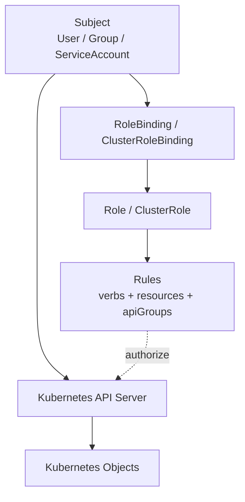
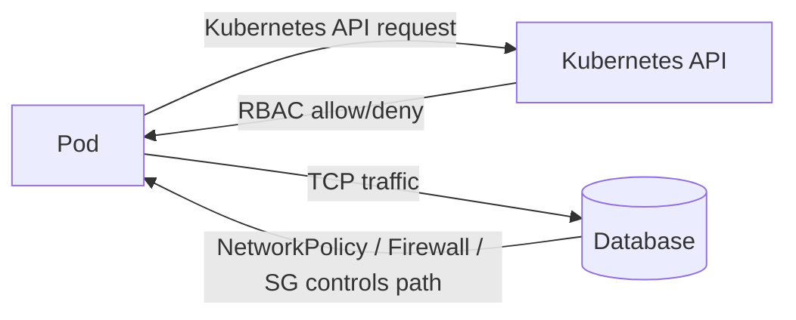
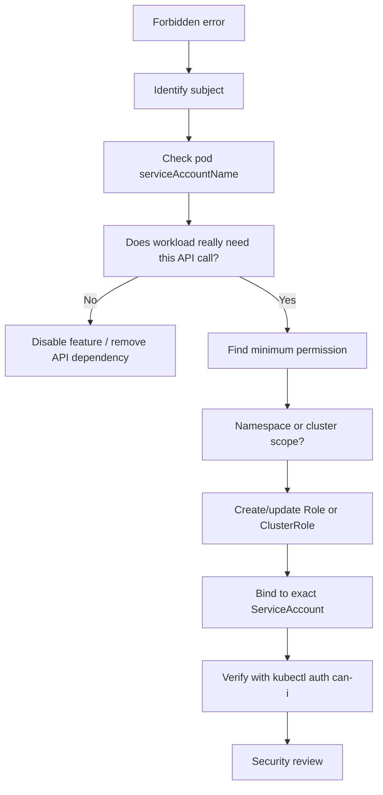

# Part 029 — Kubernetes RBAC and ServiceAccount

Kubernetes RBAC adalah sistem permission untuk API Kubernetes.

ServiceAccount adalah identitas Kubernetes untuk workload.

Keduanya sering terlihat seperti detail manifest kecil, tetapi di production keduanya menentukan seberapa besar kerusakan yang bisa terjadi ketika:

- aplikasi Java/JAX-RS terkena RCE,
- pod berhasil dieksploitasi,
- token service account bocor ke log,
- CI/CD runner salah konfigurasi,
- GitOps controller diberi cluster-admin,
- operator punya permission terlalu luas,
- developer memakai kubeconfig admin untuk debugging biasa.

RBAC bukan hanya security topic. RBAC adalah control plane safety topic.

Jika Docker/Kubernetes security foundation sebelumnya bertanya:

```text
What can the container do to the node/runtime?
```

RBAC bertanya:

```text
What can this identity do to the Kubernetes API?
```

Untuk enterprise Java/JAX-RS systems, backend engineer tidak perlu menjadi cluster administrator, tetapi harus mampu membaca permission workload yang mereka deploy. Service yang hanya expose REST API biasanya tidak perlu membaca Pod, Secret, ConfigMap, atau Deployment dari Kubernetes API. Jika manifest memberinya permission luas, itu adalah smell.

> CSG note: jangan mengasumsikan standar ServiceAccount, Role, RoleBinding, token projection, GitOps permission, CI/CD permission, namespace model, atau cluster-admin exception di CSG. Semua harus diverifikasi di Helm chart, Kustomize overlay, GitOps repo, platform policy, namespace standard, dan diskusi dengan platform/SRE/security/backend team.

---

## 1. Core Concept

RBAC adalah mekanisme authorization Kubernetes berbasis aturan:

```text
subject can perform verb on resource within scope
```

Subject bisa berupa:

- User,
- Group,
- ServiceAccount.

Verb bisa berupa:

- get,
- list,
- watch,
- create,
- update,
- patch,
- delete,
- deletecollection,
- impersonate,
- bind,
- escalate.

Resource bisa berupa:

- pods,
- services,
- deployments,
- secrets,
- configmaps,
- jobs,
- leases,
- custom resources,
- nodes,
- namespaces,
- roles,
- clusterroles.

Scope bisa berupa:

- namespace-scoped,
- cluster-scoped.

RBAC tidak memberi network permission. RBAC memberi permission ke Kubernetes API.



Mental model paling penting:

```text
ServiceAccount is the workload identity inside Kubernetes.
RBAC controls what that identity can do to Kubernetes objects.
```

---

## 2. Why RBAC Exists

Kubernetes adalah API-driven platform. Hampir semua hal dilakukan lewat API server:

- membuat pod,
- membaca secret,
- mengubah deployment,
- melihat log,
- membuat job,
- menghapus service,
- membaca custom resource,
- melakukan rollout,
- mengubah role,
- mengakses node metadata.

Tanpa RBAC, setiap workload atau user yang bisa bicara ke API server berpotensi mengubah cluster.

RBAC ada untuk menjawab:

- siapa boleh melihat apa,
- siapa boleh mengubah apa,
- siapa boleh membuat resource apa,
- siapa boleh membaca secret,
- siapa boleh menjalankan exec/log/port-forward,
- siapa boleh mengubah permission orang lain,
- siapa boleh deploy ke namespace tertentu,
- siapa boleh mengoperasikan controller,
- siapa boleh melakukan cluster-wide operation.

Di enterprise, RBAC juga menjadi evidence:

- compliance,
- auditability,
- separation of duties,
- least privilege,
- incident blast radius control,
- production access governance.

---

## 3. ServiceAccount

ServiceAccount adalah identitas yang digunakan pod saat berbicara ke Kubernetes API.

Contoh sederhana:

```yaml
apiVersion: v1
kind: ServiceAccount
metadata:
  name: quote-order-api
  namespace: quote-order
```

Deployment menggunakannya:

```yaml
apiVersion: apps/v1
kind: Deployment
metadata:
  name: quote-order-api
  namespace: quote-order
spec:
  template:
    spec:
      serviceAccountName: quote-order-api
      containers:
        - name: app
          image: registry.example.com/quote-order-api:1.2.3
```

Jika `serviceAccountName` tidak ditentukan, Kubernetes memakai default ServiceAccount di namespace tersebut.

Ini sering menjadi risk:

```text
No explicit ServiceAccount = hidden dependency on namespace default identity.
```

Untuk production workload, lebih baik explicit:

```yaml
spec:
  serviceAccountName: quote-order-api
```

Dan pastikan permission-nya minimal.

---

## 4. Default ServiceAccount Smell

Default ServiceAccount sering terlihat harmless:

```yaml
spec:
  serviceAccountName: default
```

atau tidak ada field sama sekali.

Masalahnya:

- semua workload yang lupa set ServiceAccount berbagi identity yang sama,
- sulit audit workload mana butuh permission mana,
- jika default ServiceAccount diberi permission luas, semua pod default ikut mendapat permission,
- privilege escalation bisa terjadi diam-diam ketika chart baru memakai default.

Rule praktis:

```text
Every production workload should have an explicit ServiceAccount.
Default ServiceAccount should have no meaningful privilege.
```

Internal verification checklist:

- Apakah namespace default ServiceAccount punya RoleBinding?
- Apakah service production memakai ServiceAccount explicit?
- Apakah Helm chart membuat ServiceAccount per workload?
- Apakah ada chart value seperti `serviceAccount.create` dan `serviceAccount.name`?
- Apakah default ServiceAccount pernah diberi permission untuk compatibility lama?

---

## 5. Role

Role adalah kumpulan permission dalam namespace tertentu.

Contoh Role yang hanya boleh membaca ConfigMap tertentu:

```yaml
apiVersion: rbac.authorization.k8s.io/v1
kind: Role
metadata:
  name: config-reader
  namespace: quote-order
rules:
  - apiGroups: [""]
    resources: ["configmaps"]
    resourceNames: ["quote-order-runtime-config"]
    verbs: ["get"]
```

Komponen rule:

```yaml
apiGroups: [""]
resources: ["configmaps"]
verbs: ["get"]
```

`apiGroups: [""]` berarti core API group, misalnya:

- pods,
- services,
- configmaps,
- secrets,
- persistentvolumeclaims.

Untuk Deployment:

```yaml
apiGroups: ["apps"]
resources: ["deployments"]
verbs: ["get", "list"]
```

Role hanya berlaku di namespace tempat Role dibuat.

---

## 6. ClusterRole

ClusterRole adalah kumpulan permission yang bisa cluster-scoped atau reusable lintas namespace.

Contoh ClusterRole untuk membaca node:

```yaml
apiVersion: rbac.authorization.k8s.io/v1
kind: ClusterRole
metadata:
  name: node-reader
rules:
  - apiGroups: [""]
    resources: ["nodes"]
    verbs: ["get", "list", "watch"]
```

ClusterRole dibutuhkan untuk resource cluster-scoped, seperti:

- nodes,
- namespaces,
- persistentvolumes,
- clusterroles,
- custom resource tertentu.

ClusterRole juga bisa dipakai bersama RoleBinding di namespace tertentu.

Artinya:

```text
ClusterRole does not always mean cluster-wide access.
ClusterRoleBinding usually does.
```

Perbedaan penting:

| Object | Permission Definition Scope | Binding Scope |
|---|---:|---:|
| Role | namespace | RoleBinding only |
| ClusterRole | cluster | RoleBinding or ClusterRoleBinding |
| RoleBinding | namespace | grants in namespace |
| ClusterRoleBinding | cluster | grants cluster-wide |

---

## 7. RoleBinding

RoleBinding menghubungkan subject ke Role atau ClusterRole dalam namespace tertentu.

Contoh menghubungkan ServiceAccount ke Role:

```yaml
apiVersion: rbac.authorization.k8s.io/v1
kind: RoleBinding
metadata:
  name: quote-order-config-reader
  namespace: quote-order
subjects:
  - kind: ServiceAccount
    name: quote-order-api
    namespace: quote-order
roleRef:
  kind: Role
  name: config-reader
  apiGroup: rbac.authorization.k8s.io
```

RoleBinding bisa menunjuk ke ClusterRole:

```yaml
roleRef:
  kind: ClusterRole
  name: view
  apiGroup: rbac.authorization.k8s.io
```

Jika RoleBinding ada di namespace `quote-order`, permission hanya berlaku di namespace `quote-order` meskipun roleRef menunjuk ClusterRole.

---

## 8. ClusterRoleBinding

ClusterRoleBinding memberikan ClusterRole ke subject secara cluster-wide.

Contoh:

```yaml
apiVersion: rbac.authorization.k8s.io/v1
kind: ClusterRoleBinding
metadata:
  name: platform-controller-cluster-admin
subjects:
  - kind: ServiceAccount
    name: platform-controller
    namespace: platform-system
roleRef:
  kind: ClusterRole
  name: cluster-admin
  apiGroup: rbac.authorization.k8s.io
```

Ini sangat powerful.

ClusterRoleBinding perlu perhatian khusus karena bisa memberi akses ke:

- semua namespace,
- semua secret,
- semua workload,
- semua CRD,
- node-level resource,
- RBAC object itu sendiri.

Rule praktis:

```text
Application workloads almost never need ClusterRoleBinding.
```

Kecuali workload adalah controller/operator/platform component yang memang perlu observe banyak namespace atau cluster resource.

---

## 9. RBAC Scope Decision

Gunakan pertanyaan ini:

```text
Does this workload need Kubernetes API access at all?
```

Jika tidak, jangan beri RoleBinding.

Jika ya:

```text
Does it need namespace-scoped objects only?
```

Gunakan Role + RoleBinding.

Jika perlu object cluster-scoped:

```text
Can the permission be narrowed to specific resources and verbs?
```

Gunakan ClusterRole hati-hati.

Jika perlu cluster-wide across namespace:

```text
Is this a platform controller/operator, not application service?
```

Baru pertimbangkan ClusterRoleBinding.

Decision table:

| Need | Suggested RBAC |
|---|---|
| Java REST API tidak akses Kubernetes API | Explicit ServiceAccount, no RoleBinding |
| App membaca satu ConfigMap via API | Role + RoleBinding, get only |
| App membaca Secret via API | Hindari jika bisa; mount Secret; kalau perlu, get specific resourceName |
| Controller manage Deployment dalam namespace | Role + RoleBinding |
| Operator watch CRD semua namespace | ClusterRole + ClusterRoleBinding, narrow verbs/resources |
| GitOps controller deploy banyak namespace | ClusterRole/ClusterRoleBinding sesuai scope, audited |
| CI deploy satu namespace | RoleBinding namespace, no cluster-admin |

---

## 10. Least Privilege

Least privilege berarti identity hanya punya permission minimum untuk melakukan tugasnya.

Bukan:

```text
Give broad access now, clean up later.
```

Karena dalam practice, later jarang terjadi.

Prinsip least privilege RBAC:

- mulai dari no permission,
- tambah permission berdasarkan kebutuhan nyata,
- pilih verb paling sempit,
- pilih resource paling sempit,
- gunakan namespace scope jika cukup,
- gunakan `resourceNames` jika memungkinkan,
- hindari wildcard,
- hindari cluster-admin,
- pisahkan permission workload, CI/CD, GitOps, dan human debugging,
- audit secara berkala.

Bad smell:

```yaml
rules:
  - apiGroups: ["*"]
    resources: ["*"]
    verbs: ["*"]
```

Ini pada dasarnya cluster-admin jika di-bind luas.

Better:

```yaml
rules:
  - apiGroups: [""]
    resources: ["configmaps"]
    resourceNames: ["quote-order-runtime-config"]
    verbs: ["get"]
```

---

## 11. Verb Semantics

RBAC verbs punya konsekuensi berbeda.

| Verb | Meaning | Risk |
|---|---|---|
| get | membaca satu object | exposure data object |
| list | membaca semua object dalam scope | exposure luas |
| watch | stream perubahan object | long-lived visibility |
| create | membuat object baru | resource injection |
| update | mengganti object | state mutation |
| patch | perubahan sebagian | mutation, sering dipakai controller |
| delete | menghapus object | availability risk |
| deletecollection | mass delete | high blast radius |
| bind | bind role ke subject | privilege escalation |
| escalate | membuat role dengan permission lebih tinggi | privilege escalation |
| impersonate | bertindak sebagai subject lain | audit/security risk |

Untuk aplikasi Java biasa, permission seperti `bind`, `escalate`, `impersonate`, `deletecollection`, atau `secrets list` hampir selalu red flag.

---

## 12. `get` vs `list` vs `watch`

Banyak manifest memberi:

```yaml
verbs: ["get", "list", "watch"]
```

Padahal kebutuhan bisa hanya `get`.

Perbedaan:

- `get`: membaca object tertentu,
- `list`: melihat semua object di scope,
- `watch`: subscribe perubahan object.

Controller/operator biasanya perlu `list/watch`.
Aplikasi bisnis biasanya jarang.

Jika Java service hanya membaca konfigurasi tertentu lewat Kubernetes API:

```yaml
verbs: ["get"]
resourceNames: ["quote-order-runtime-config"]
```

lebih baik daripada:

```yaml
verbs: ["get", "list", "watch"]
resources: ["configmaps"]
```

---

## 13. `resourceNames`

`resourceNames` membatasi permission ke object tertentu.

Contoh:

```yaml
rules:
  - apiGroups: [""]
    resources: ["secrets"]
    resourceNames: ["quote-order-db-credentials"]
    verbs: ["get"]
```

Ini lebih aman daripada memberi akses ke semua Secret dalam namespace.

Namun ada caveat:

- `resourceNames` tidak bekerja untuk semua operasi dengan cara yang sama,
- `list` dan `watch` tidak bisa dibatasi dengan `resourceNames` seperti `get`,
- controller yang perlu watch collection tidak cocok dengan resourceNames,
- nama object harus stabil.

Untuk app biasa, jika perlu akses API, `resourceNames` sering berguna.

---

## 14. ServiceAccount Token

Pod dapat menerima token ServiceAccount.

Token ini bisa dipakai untuk memanggil Kubernetes API server.

Di dalam pod biasanya tersedia melalui mounted projected volume, misalnya:

```text
/var/run/secrets/kubernetes.io/serviceaccount/token
/var/run/secrets/kubernetes.io/serviceaccount/ca.crt
/var/run/secrets/kubernetes.io/serviceaccount/namespace
```

Jika aplikasi atau dependency membaca token ini, ia bisa call API server sesuai RBAC identity pod.

Risk utama:

- token terbaca oleh aplikasi yang compromised,
- token bocor ke log atau diagnostic dump,
- dependency/library tidak sengaja memakai in-cluster config,
- app diberi RBAC terlalu luas,
- token lifetime/rotation tidak dipahami,
- token dipakai untuk privilege escalation.

---

## 15. Automount ServiceAccount Token

Secara default, pod bisa mendapat ServiceAccount token.

Untuk workload yang tidak perlu bicara ke Kubernetes API, pertimbangkan:

```yaml
apiVersion: v1
kind: ServiceAccount
metadata:
  name: quote-order-api
automountServiceAccountToken: false
```

Atau di Pod spec:

```yaml
spec:
  automountServiceAccountToken: false
```

Ini mengurangi credential exposure.

Namun hati-hati:

- beberapa service mesh sidecar mungkin butuh token,
- workload identity cloud mungkin butuh token projected khusus,
- monitoring/security agent tertentu mungkin bergantung pada token,
- operator-managed workloads bisa punya requirement spesifik.

Rule praktis:

```text
Disable automount unless workload needs Kubernetes API access or platform integration requires it.
```

Internal verification checklist:

- Apakah Java service butuh Kubernetes API?
- Apakah service mesh butuh ServiceAccount token?
- Apakah cloud workload identity butuh projected token?
- Apakah admission controller mengubah token mount?
- Apakah chart punya value untuk `automountServiceAccountToken`?

---

## 16. Token Projection

Kubernetes mendukung projected ServiceAccount token dengan audience dan expiration.

Contoh:

```yaml
volumes:
  - name: k8s-api-token
    projected:
      sources:
        - serviceAccountToken:
            path: token
            audience: api
            expirationSeconds: 3600
```

Projected token lebih baik daripada token legacy karena:

- punya audience,
- punya expiration,
- dapat dirotasi,
- lebih cocok untuk workload identity federation.

Untuk cloud identity seperti AWS IRSA atau Azure Workload Identity, projected token adalah bagian penting dari flow.

Namun jangan samakan:

```text
Kubernetes API token != cloud provider access token
```

Projected service account token biasanya dipakai sebagai federated identity proof untuk menukar credential cloud.

---

## 17. Workload Identity Boundary

ServiceAccount punya dua peran yang sering bercampur:

1. Kubernetes API identity.
2. Cloud workload identity anchor.

Contoh di AWS EKS:

```yaml
apiVersion: v1
kind: ServiceAccount
metadata:
  name: quote-order-api
  annotations:
    eks.amazonaws.com/role-arn: arn:aws:iam::123456789012:role/quote-order-api-role
```

Contoh di Azure AKS dengan Workload Identity:

```yaml
apiVersion: v1
kind: ServiceAccount
metadata:
  name: quote-order-api
  annotations:
    azure.workload.identity/client-id: "<managed-identity-client-id>"
```

RBAC Kubernetes dan cloud IAM/RBAC berbeda.

ServiceAccount bisa tidak punya Kubernetes API permission, tetapi punya cloud permission via workload identity.

Sebaliknya, ServiceAccount bisa punya Kubernetes RBAC tetapi tidak punya cloud permission.

Review harus mengecek keduanya.

---

## 18. Java/JAX-RS Service: Does It Need RBAC?

Sebagian besar Java/JAX-RS REST API tidak perlu Kubernetes API access.

Biasanya mereka butuh:

- environment variables,
- ConfigMap mounted/env,
- Secret mounted/env,
- network access ke PostgreSQL/Kafka/RabbitMQ/Redis/Camunda/cloud service,
- identity cloud untuk secret manager/object storage/queue, jika ada.

Mereka tidak perlu:

- list pods,
- watch endpoints,
- read all secrets,
- patch deployments,
- create jobs,
- delete pods,
- read nodes.

Jika service Java punya RBAC luas, tanyakan:

```text
Why does business application need Kubernetes API access?
```

Valid exception:

- application adalah Kubernetes operator,
- service memang melakukan orchestration Kubernetes,
- test/automation job perlu membuat resource sementara,
- migration controller perlu membuat Job,
- platform-sidecar membutuhkan API access.

Tetap harus scoped.

---

## 19. RBAC for Controllers and Operators

Controller/operator berbeda dari aplikasi biasa.

Mereka memang perlu:

- list/watch resource,
- reconcile object,
- update status,
- create/update/delete child resources,
- handle finalizer.

Contoh permission operator:

```yaml
rules:
  - apiGroups: ["example.com"]
    resources: ["quoteservices"]
    verbs: ["get", "list", "watch", "update", "patch"]
  - apiGroups: ["example.com"]
    resources: ["quoteservices/status"]
    verbs: ["get", "update", "patch"]
  - apiGroups: ["apps"]
    resources: ["deployments"]
    verbs: ["get", "list", "watch", "create", "update", "patch", "delete"]
```

Even for operator, avoid:

```yaml
apiGroups: ["*"]
resources: ["*"]
verbs: ["*"]
```

unless benar-benar platform controller yang diaudit ketat.

---

## 20. RBAC for CI/CD

CI/CD identity biasanya perlu deploy.

Tetapi permission harus dibatasi.

Bad pattern:

```text
CI/CD kubeconfig = cluster-admin
```

Risk:

- pipeline compromise menjadi cluster compromise,
- salah script bisa delete cluster-wide object,
- branch/fork/runner risk meningkat,
- sulit audit siapa mengubah resource apa.

Better pattern:

- CI hanya build/test/image push,
- GitOps controller yang apply manifest,
- CI hanya update GitOps repo atau image tag,
- deploy permission scoped per environment/namespace,
- production promotion gated,
- no direct kubectl apply to production kecuali break-glass.

Jika CI harus apply langsung:

- gunakan namespace-scoped Role,
- resource terbatas,
- no secrets read jika tidak perlu,
- no RBAC mutation,
- no cluster-admin,
- audit token usage,
- rotate credential.

Internal verification checklist:

- CI deploy langsung atau via GitOps?
- Credential apa yang dipakai pipeline?
- Apakah CI bisa deploy ke production?
- Apakah CI bisa baca Secret?
- Apakah CI bisa mengubah RBAC?
- Apakah branch non-main bisa trigger deploy?

---

## 21. RBAC for GitOps Controllers

GitOps controller seperti Argo CD atau Flux biasanya butuh permission untuk reconcile resources.

Permission tergantung model:

- satu controller cluster-wide,
- controller per environment,
- controller per namespace,
- app-of-apps,
- multi-tenant GitOps.

Risiko GitOps controller:

- diberi cluster-admin tanpa guardrail,
- repo compromise menjadi cluster compromise,
- sync otomatis menghapus resource penting,
- controller bisa membaca semua secret,
- namespace boundary tidak enforce,
- app project terlalu longgar,
- manual override tidak tercatat.

Review GitOps permission harus mencakup:

- controller ServiceAccount,
- Role/ClusterRole,
- allowed namespaces,
- allowed resource kinds,
- app project policy,
- repo access,
- sync policy,
- prune policy,
- break-glass procedure.

Rule praktis:

```text
GitOps controller may need broad permissions, but broad permissions must be compensated by repo governance, project policy, review gates, audit, and blast-radius boundaries.
```

---

## 22. RBAC for Human Access

Human access harus berbeda dari workload access.

Developer mungkin butuh:

- view pods,
- view logs,
- describe resources,
- port-forward in non-prod,
- exec only in controlled scenarios,
- restart rollout in non-prod,
- read events.

Production access biasanya harus lebih ketat:

- just-in-time access,
- approval,
- audit,
- no secret read by default,
- no cluster-admin by default,
- separate break-glass role,
- incident evidence capture.

Risky permissions untuk human:

- `secrets get/list`,
- `pods/exec`,
- `pods/portforward`,
- `deployments patch`,
- `roles bind/escalate`,
- `clusterroles *`,
- `nodes proxy`,
- `pods delete` production.

Backend engineer harus tahu aksesnya sendiri:

```bash
kubectl auth can-i get pods -n quote-order
kubectl auth can-i get secrets -n quote-order
kubectl auth can-i patch deployment quote-order-api -n quote-order
kubectl auth can-i create pods/exec -n quote-order
```

---

## 23. Subresources Matter

Kubernetes punya subresource yang permission-nya terpisah.

Contoh:

- `pods/log`,
- `pods/exec`,
- `pods/portforward`,
- `deployments/scale`,
- `deployments/status`,
- `jobs/status`,
- `customresources/status`,
- `customresources/finalizers`.

Permission pods biasa tidak otomatis berarti boleh exec.

Contoh Role untuk membaca log:

```yaml
rules:
  - apiGroups: [""]
    resources: ["pods", "pods/log"]
    verbs: ["get", "list"]
```

Permission exec:

```yaml
rules:
  - apiGroups: [""]
    resources: ["pods/exec"]
    verbs: ["create"]
```

Kenapa `create`? Karena exec membuat koneksi subresource.

`pods/exec` di production sensitif karena user bisa menjalankan command dalam container dan berpotensi melihat env var/secret file.

---

## 24. Secret Access Is Special

Permission membaca Secret sangat sensitif.

```yaml
rules:
  - apiGroups: [""]
    resources: ["secrets"]
    verbs: ["get", "list", "watch"]
```

Ini biasanya terlalu luas.

Jika subject bisa list secrets di namespace, ia bisa melihat banyak credential aplikasi.

Risk:

- DB password exposure,
- Kafka/RabbitMQ credential exposure,
- Redis auth token exposure,
- TLS private key exposure,
- cloud credential exposure,
- API token exposure,
- cross-service lateral movement.

Better pattern:

- aplikasi tidak membaca Secret via API,
- Secret di-mount oleh kubelet sesuai pod spec,
- external secret controller yang punya permission membaca source secret manager,
- workload diberi identity cloud minimal,
- human tidak diberi secret read by default.

Jika harus memberi Secret API access:

```yaml
resources: ["secrets"]
resourceNames: ["quote-order-api-specific-secret"]
verbs: ["get"]
```

Dan dokumentasikan alasannya.

---

## 25. ConfigMap Access

ConfigMap lebih rendah sensitivity daripada Secret, tetapi tetap bisa sensitif.

ConfigMap dapat berisi:

- endpoint internal,
- feature flag,
- routing rule,
- customer-specific behavior,
- non-secret credential by mistake,
- operational knobs.

Aplikasi jarang perlu membaca ConfigMap via API. Biasanya cukup env var atau volume mount.

Jika aplikasi membaca ConfigMap via API untuk dynamic config, review:

- permission get/list/watch,
- resourceNames,
- config validation,
- config reload safety,
- auditability,
- fallback behavior,
- blast radius salah config.

---

## 26. RBAC and NetworkPolicy Are Different

RBAC tidak mengontrol traffic network.
NetworkPolicy tidak mengontrol Kubernetes API permission.

Contoh:

- Pod tidak punya RBAC ke Secret, tetapi bisa connect ke database jika NetworkPolicy mengizinkan.
- Pod tidak bisa connect ke database, tetapi bisa read Secret jika RBAC mengizinkan.
- Pod bisa call API server secara network, tetapi API server menolak karena RBAC.
- Pod tidak bisa call API server karena egress NetworkPolicy, meski RBAC mengizinkan.

Security posture butuh keduanya.



Review harus menanyakan:

```text
What can the pod call over the network?
What can the pod do through Kubernetes API?
What can the pod do through cloud identity?
```

---

## 27. RBAC and Admission Control

RBAC menjawab:

```text
Is this subject allowed to submit this request?
```

Admission control menjawab:

```text
Should this object be accepted after authorization?
```

Contoh:

- RBAC mengizinkan user create pod,
- admission policy menolak pod karena privileged container,
- RBAC mengizinkan deployment update,
- admission policy menolak image tanpa digest/signature,
- RBAC mengizinkan secret create,
- admission policy menolak secret tanpa label owner.

RBAC bukan satu-satunya guardrail.

Di enterprise, policy-as-code seperti OPA Gatekeeper atau Kyverno sering dipakai untuk enforce standard:

- non-root container,
- no privileged,
- required labels,
- required resource requests,
- required probes,
- no latest image tag,
- allowed registry,
- restricted hostPath,
- allowed ingress class.

---

## 28. RBAC Debugging: `kubectl auth can-i`

Command paling penting:

```bash
kubectl auth can-i get pods -n quote-order
```

Untuk ServiceAccount:

```bash
kubectl auth can-i get configmaps \
  --as=system:serviceaccount:quote-order:quote-order-api \
  -n quote-order
```

Cek Secret access:

```bash
kubectl auth can-i get secrets \
  --as=system:serviceaccount:quote-order:quote-order-api \
  -n quote-order
```

Cek exec access:

```bash
kubectl auth can-i create pods/exec \
  --as=system:serviceaccount:quote-order:developer-debugger \
  -n quote-order
```

Cek semua permission diri sendiri:

```bash
kubectl auth can-i --list -n quote-order
```

Cek permission service account:

```bash
kubectl auth can-i --list \
  --as=system:serviceaccount:quote-order:quote-order-api \
  -n quote-order
```

---

## 29. RBAC Debugging Workflow

Jika aplikasi mendapat error seperti:

```text
Forbidden: User "system:serviceaccount:quote-order:quote-order-api" cannot get resource "configmaps" in API group "" in the namespace "quote-order"
```

Debugging workflow:

1. Identifikasi subject.
2. Identifikasi verb.
3. Identifikasi resource.
4. Identifikasi apiGroup.
5. Identifikasi namespace.
6. Cari RoleBinding/ClusterRoleBinding untuk subject.
7. Baca Role/ClusterRole yang di-refer.
8. Jalankan `kubectl auth can-i`.
9. Pastikan token/service account yang dipakai pod benar.
10. Jangan langsung memberi wildcard permission.

Contoh mapping:

```text
User: system:serviceaccount:quote-order:quote-order-api
Verb: get
Resource: configmaps
API group: ""
Namespace: quote-order
```

Cari RoleBinding:

```bash
kubectl get rolebinding -n quote-order -o yaml | grep -A20 quote-order-api
kubectl get clusterrolebinding -o yaml | grep -A20 quote-order-api
```

Lalu cek roleRef.

---

## 30. Common RBAC Failure Modes

### 30.1 Forbidden Error

Symptom:

```text
forbidden: User ... cannot get resource ...
```

Likely cause:

- RoleBinding missing,
- wrong namespace,
- wrong ServiceAccount,
- wrong verb,
- wrong apiGroup,
- missing subresource permission,
- ClusterRole referenced incorrectly.

Debug:

```bash
kubectl auth can-i <verb> <resource> -n <namespace> --as=<subject>
```

---

### 30.2 App Uses Default ServiceAccount Unexpectedly

Symptom:

```text
User "system:serviceaccount:quote-order:default" cannot ...
```

Cause:

- `serviceAccountName` missing,
- Helm value not set,
- ServiceAccount not created,
- chart condition disabled SA creation,
- typo in ServiceAccount name.

Debug:

```bash
kubectl get pod <pod> -n quote-order -o jsonpath='{.spec.serviceAccountName}'
```

---

### 30.3 Permission Exists But Still Forbidden

Likely cause:

- RoleBinding in wrong namespace,
- subject namespace typo,
- roleRef points wrong Role,
- apiGroup wrong,
- subresource missing,
- aggregated ClusterRole not updated,
- admission webhook denies after authorization.

Debug:

```bash
kubectl describe rolebinding <name> -n <namespace>
kubectl describe role <name> -n <namespace>
kubectl auth can-i --list --as=system:serviceaccount:<ns>:<sa> -n <ns>
```

---

### 30.4 Too Much Permission

Symptom:

- workload can list secrets,
- workload can patch deployments,
- service account bound to cluster-admin,
- app can delete pods,
- CI can mutate RBAC.

Cause:

- copied chart template,
- quick fix during incident,
- controller permission reused for application,
- shared ServiceAccount,
- default ServiceAccount over-privileged.

Mitigation:

- split ServiceAccount per workload,
- replace wildcard with explicit rules,
- namespace scope,
- remove Secret list/watch,
- add policy-as-code,
- audit RoleBinding/ClusterRoleBinding.

---

### 30.5 Cloud Access Confused With Kubernetes RBAC

Symptom:

- app can call Kubernetes API but cannot call AWS/Azure service,
- app has IAM role but cannot read Kubernetes Secret,
- engineer changes RoleBinding but AWS SDK still fails,
- engineer changes IAM but Kubernetes API still returns forbidden.

Cause:

- Kubernetes RBAC and cloud IAM/RBAC are separate systems.

Debug:

```text
Kubernetes API forbidden -> check RBAC.
AWS/Azure SDK access denied -> check workload identity/cloud IAM/RBAC.
Network timeout -> check routing/DNS/egress/private endpoint.
```

---

## 31. API Group Mistakes

Core resources use empty API group:

```yaml
apiGroups: [""]
resources: ["pods", "services", "secrets", "configmaps"]
```

Apps resources use `apps`:

```yaml
apiGroups: ["apps"]
resources: ["deployments", "statefulsets", "daemonsets", "replicasets"]
```

Batch resources use `batch`:

```yaml
apiGroups: ["batch"]
resources: ["jobs", "cronjobs"]
```

Networking resources may use `networking.k8s.io`:

```yaml
apiGroups: ["networking.k8s.io"]
resources: ["ingresses", "networkpolicies"]
```

RBAC failure sering terjadi karena apiGroup salah.

---

## 32. Aggregated ClusterRoles

Kubernetes punya default ClusterRole seperti:

- `view`,
- `edit`,
- `admin`,
- `cluster-admin`.

Ada juga aggregated ClusterRole yang bisa ditambah oleh label pada ClusterRole lain.

Contoh konsep:

```yaml
metadata:
  labels:
    rbac.authorization.k8s.io/aggregate-to-view: "true"
```

Ini bisa menambahkan permission ke built-in role.

Risk:

- permission default berubah setelah operator/CRD install,
- user yang punya `view` tiba-tiba bisa melihat CRD tertentu,
- privilege surface bertambah tanpa terlihat di RoleBinding.

Internal verification:

- Apakah platform menggunakan built-in view/edit/admin?
- Apakah CRD/operator menambahkan aggregated roles?
- Apakah `view` boleh melihat CRD sensitif?

---

## 33. Admin Anti-Patterns

Anti-pattern umum:

```yaml
roleRef:
  kind: ClusterRole
  name: cluster-admin
```

untuk aplikasi biasa.

Anti-pattern lain:

- satu ServiceAccount dipakai banyak workload,
- default ServiceAccount diberi admin,
- CI/CD token cluster-admin,
- human debugging pakai kubeconfig admin,
- app diberi Secret list/watch,
- operator diberi wildcard karena malas enumerate resource,
- Helm chart default membuat ClusterRoleBinding tanpa alasan,
- namespace team diberi edit yang bisa mutate banyak resource tanpa policy,
- PR review tidak melihat generated manifest.

Pertanyaan review:

```text
What exact Kubernetes API calls does this identity need?
What happens if this token is stolen?
Can this permission be namespace-scoped?
Can this permission be read-only?
Can this permission be resourceNames-scoped?
Can we disable token automount?
```

---

## 34. RBAC and Java Frameworks

Java/JAX-RS service biasanya tidak otomatis call Kubernetes API.

Namun beberapa library/framework/integration bisa melakukannya:

- Kubernetes client library,
- Spring Cloud Kubernetes,
- Fabric8 client,
- service discovery integration,
- config reload integration,
- custom operator code,
- health check yang query Kubernetes API,
- leader election library,
- job orchestration logic.

Jika dependency memakai in-cluster config, ia akan membaca ServiceAccount token.

Review dependency:

- apakah ada Kubernetes client dependency?
- apakah app membaca ConfigMap/Secret via Kubernetes API?
- apakah leader election memakai Lease object?
- apakah app watch Endpoints/Services?
- apakah service discovery dilakukan via DNS saja atau Kubernetes API?

Untuk leader election, app mungkin perlu permission ke Lease:

```yaml
apiGroups: ["coordination.k8s.io"]
resources: ["leases"]
verbs: ["get", "list", "watch", "create", "update", "patch"]
```

Ini harus sengaja, bukan implicit.

---

## 35. RBAC for Leader Election

Beberapa worker/consumer butuh leader election agar hanya satu instance melakukan tugas tertentu.

Kubernetes Lease umum digunakan.

Contoh Role:

```yaml
apiVersion: rbac.authorization.k8s.io/v1
kind: Role
metadata:
  name: quote-order-leader-election
  namespace: quote-order
rules:
  - apiGroups: ["coordination.k8s.io"]
    resources: ["leases"]
    resourceNames: ["quote-order-scheduler-leader"]
    verbs: ["get", "update", "patch"]
  - apiGroups: ["coordination.k8s.io"]
    resources: ["leases"]
    verbs: ["create"]
```

Caveat:

- create tidak bisa resourceNames-scoped secara sama seperti get/update,
- app harus handle lease contention,
- clock skew dan renewal timeout harus dipahami,
- liveness probe jangan membunuh leader karena transient API failure.

---

## 36. RBAC for Watching Endpoints/Services

Beberapa service discovery library watch Service/EndpointSlice.

Permission bisa seperti:

```yaml
rules:
  - apiGroups: [""]
    resources: ["services"]
    verbs: ["get", "list", "watch"]
  - apiGroups: ["discovery.k8s.io"]
    resources: ["endpointslices"]
    verbs: ["get", "list", "watch"]
```

Tanyakan:

```text
Why not use DNS-based service discovery?
```

Untuk banyak Java microservice, DNS cukup.

API watch menambah:

- RBAC surface,
- API server load,
- dependency ke Kubernetes API availability,
- failure mode baru.

---

## 37. RBAC for Jobs and Migration

Migration job mungkin perlu permission minimal atau tidak sama sekali.

Jika migration hanya connect ke database:

- tidak butuh Kubernetes API,
- hanya butuh DB credential,
- maybe cloud identity untuk secret manager.

Jika migration job membuat Kubernetes Job lain, itu orchestration concern dan permission harus jelas.

Bad pattern:

```text
Migration job has cluster-admin because it was easier.
```

Better:

- satu job per migration,
- no Kubernetes API access,
- no automount token,
- resource/time limit,
- idempotency,
- audit log,
- rollback plan.

---

## 38. RBAC and Secrets Mounted Into Pod

Penting:

```text
Pod can use a Secret volume without ServiceAccount having RBAC get secrets.
```

Kubelet mengambil Secret berdasarkan Pod spec dan permission node/kubelet, bukan aplikasi membaca Secret API langsung.

Jadi jangan memberi app RBAC Secret read hanya karena pod memakai Secret.

Contoh:

```yaml
volumes:
  - name: db-secret
    secret:
      secretName: quote-order-db
```

Aplikasi membaca file mounted, bukan Kubernetes API.

Internal review:

- Apakah aplikasi benar-benar call API untuk secret?
- Atau cukup mount Secret?
- Apakah ServiceAccount punya secret read tanpa alasan?

---

## 39. RBAC and Logs

`kubectl logs` butuh permission `pods/log`.

Developer sering butuh logs untuk debugging.

Namun log bisa berisi sensitive data.

Production log access harus dipikirkan bersama:

- centralized logging access,
- Kubernetes API log access,
- audit trail,
- PII masking,
- secret redaction,
- namespace boundary.

Jika engineer punya `pods/log`, ia bisa membaca logs container di namespace tersebut. Ini bukan selalu aman.

---

## 40. RBAC and Exec

`kubectl exec` sangat powerful.

Permission:

```yaml
resources: ["pods/exec"]
verbs: ["create"]
```

Risk:

- melihat environment variable,
- membaca mounted secret file,
- menjalankan network tool internal,
- bypass normal application path,
- mengubah file jika filesystem writable,
- melakukan destructive debug command.

Production policy harus jelas:

- siapa boleh exec,
- kapan boleh exec,
- apakah approval dibutuhkan,
- apakah command direkam,
- apakah image punya shell/tools,
- bagaimana audit dilakukan.

Untuk distroless image, exec mungkin tidak punya shell. Itu security benefit sekaligus debugging trade-off.

---

## 41. RBAC and Port Forward

Port-forward permission:

```yaml
resources: ["pods/portforward"]
verbs: ["create"]
```

Risk:

- bypass ingress/API gateway,
- bypass auth layer jika service internal tidak enforce auth,
- expose admin port locally,
- reach database proxy or internal endpoint,
- create unobserved access path.

Port-forward useful untuk non-prod debugging, tetapi production harus controlled.

---

## 42. RBAC and Namespace Tenancy

Namespace sering dipakai sebagai boundary:

- team,
- environment,
- application group,
- tenant,
- product area.

RBAC harus align dengan namespace model.

Pertanyaan:

- Apakah namespace per service, per domain, per team, atau per environment?
- Apakah developer satu team bisa melihat namespace team lain?
- Apakah Secret namespace A bisa dibaca subject namespace B?
- Apakah GitOps controller cluster-wide?
- Apakah CI token per namespace?
- Apakah NetworkPolicy default deny per namespace?

RBAC tanpa namespace model yang jelas akan kacau.

---

## 43. RBAC and Custom Resources

Banyak platform memakai CRD:

- Argo CD Application,
- ExternalSecret,
- SealedSecret,
- Certificate,
- Gateway/HTTPRoute,
- ServiceMonitor,
- PrometheusRule,
- custom operator resource.

RBAC untuk CRD harus direview seperti resource lain.

Contoh:

```yaml
apiGroups: ["external-secrets.io"]
resources: ["externalsecrets"]
verbs: ["get", "list", "watch", "create", "update", "patch", "delete"]
```

Risk:

- membuat ExternalSecret bisa mengambil secret dari secret manager,
- membuat Certificate bisa request TLS cert,
- membuat HTTPRoute bisa expose service,
- membuat PrometheusRule bisa spam alert,
- membuat Argo CD Application bisa deploy resource.

CRD bukan resource netral.

---

## 44. RBAC and Secret Controllers

External Secrets Operator, Sealed Secrets, CSI driver, atau secret sync controller biasanya punya permission sensitif.

Mereka bisa:

- membaca external secret backend,
- membuat Kubernetes Secret,
- update Secret,
- watch ExternalSecret CRD,
- manage rotation.

Review harus mencakup:

- controller ServiceAccount,
- cloud identity controller,
- namespace scope,
- allowed secret stores,
- who can create ExternalSecret,
- who can reference ClusterSecretStore,
- audit event,
- rotation failure alert.

Aplikasi biasa tidak perlu permission controller-level.

---

## 45. RBAC Review Checklist for Java/JAX-RS Service

Gunakan checklist ini saat review PR Helm/manifest.

### Identity

- Apakah workload punya ServiceAccount explicit?
- Apakah ServiceAccount namanya sesuai workload?
- Apakah default ServiceAccount tidak dipakai diam-diam?
- Apakah ServiceAccount dipakai bersama banyak workload?
- Apakah automount token disabled jika tidak perlu?

### Kubernetes API Access

- Apakah aplikasi perlu Kubernetes API?
- Jika ya, API call apa yang dilakukan?
- Apakah permission hanya mencakup resource dan verb yang diperlukan?
- Apakah `resourceNames` bisa dipakai?
- Apakah ada list/watch tanpa alasan?

### Secret Exposure

- Apakah ServiceAccount bisa read/list/watch Secret?
- Apakah secret access benar-benar diperlukan via API?
- Apakah Secret cukup dimount sebagai volume/env?
- Apakah logs bisa mengekspos token atau secret?

### Scope

- Apakah RoleBinding cukup?
- Apakah ClusterRoleBinding benar-benar perlu?
- Apakah permission lintas namespace diperlukan?
- Apakah namespace subject benar?

### Dangerous Verbs

- Apakah ada wildcard `*`?
- Apakah ada `bind`, `escalate`, `impersonate`?
- Apakah ada `deletecollection`?
- Apakah ada `pods/exec` atau `pods/portforward`?

### Operational

- Apakah `kubectl auth can-i` sudah diverifikasi?
- Apakah RBAC failure punya alert/log yang jelas?
- Apakah ada runbook untuk forbidden error?
- Apakah permission diaudit berkala?

---

## 46. Example: Minimal REST API ServiceAccount

Untuk REST API biasa yang tidak call Kubernetes API:

```yaml
apiVersion: v1
kind: ServiceAccount
metadata:
  name: quote-order-api
  namespace: quote-order
automountServiceAccountToken: false
```

Deployment:

```yaml
apiVersion: apps/v1
kind: Deployment
metadata:
  name: quote-order-api
  namespace: quote-order
spec:
  template:
    spec:
      serviceAccountName: quote-order-api
      automountServiceAccountToken: false
      containers:
        - name: app
          image: registry.example.com/quote-order-api:1.2.3
```

Tidak ada RoleBinding.

Ini ideal jika:

- app tidak butuh Kubernetes API,
- tidak memakai workload identity yang butuh token,
- tidak ada service mesh/platform integration yang butuh token.

---

## 47. Example: App Needs Lease for Leader Election

ServiceAccount:

```yaml
apiVersion: v1
kind: ServiceAccount
metadata:
  name: quote-order-scheduler
  namespace: quote-order
```

Role:

```yaml
apiVersion: rbac.authorization.k8s.io/v1
kind: Role
metadata:
  name: quote-order-scheduler-leader-election
  namespace: quote-order
rules:
  - apiGroups: ["coordination.k8s.io"]
    resources: ["leases"]
    resourceNames: ["quote-order-scheduler"]
    verbs: ["get", "update", "patch"]
  - apiGroups: ["coordination.k8s.io"]
    resources: ["leases"]
    verbs: ["create"]
```

RoleBinding:

```yaml
apiVersion: rbac.authorization.k8s.io/v1
kind: RoleBinding
metadata:
  name: quote-order-scheduler-leader-election
  namespace: quote-order
subjects:
  - kind: ServiceAccount
    name: quote-order-scheduler
    namespace: quote-order
roleRef:
  kind: Role
  name: quote-order-scheduler-leader-election
  apiGroup: rbac.authorization.k8s.io
```

Review:

- no Secret read,
- no pod list,
- no Deployment patch,
- namespace-scoped,
- permission matches leader election only.

---

## 48. Example: Bad RBAC for App

Bad:

```yaml
apiVersion: rbac.authorization.k8s.io/v1
kind: ClusterRoleBinding
metadata:
  name: quote-order-api-admin
subjects:
  - kind: ServiceAccount
    name: quote-order-api
    namespace: quote-order
roleRef:
  kind: ClusterRole
  name: cluster-admin
  apiGroup: rbac.authorization.k8s.io
```

Why bad:

- app compromise becomes cluster compromise,
- app can read all secrets,
- app can mutate RBAC,
- app can delete workloads,
- audit blast radius huge,
- no justification for REST API.

Review response:

```text
Reject unless this workload is a controlled platform operator with documented need, compensating controls, and security approval.
```

---

## 49. Debugging Forbidden from Inside Java

Java exception might look like:

```text
io.kubernetes.client.openapi.ApiException: Forbidden
Message: Forbidden!Configured service account doesn't have access.
```

or:

```text
User "system:serviceaccount:quote-order:quote-order-api" cannot list resource "endpointslices" in API group "discovery.k8s.io"
```

Debug steps:

1. Extract subject, verb, resource, apiGroup, namespace.
2. Check pod ServiceAccount.
3. Check RoleBinding.
4. Check Role rules.
5. Run `kubectl auth can-i` as that ServiceAccount.
6. Check library/framework requiring API access.
7. Decide whether permission is valid or library config should be changed.

Do not fix by giving `cluster-admin`.

---

## 50. RBAC Failure Decision Tree



---

## 51. Internal Verification Checklist

Gunakan checklist ini saat masuk ke codebase/team.

### ServiceAccount

- Service mana saja yang memakai ServiceAccount explicit?
- Service mana yang masih memakai default ServiceAccount?
- Apakah default ServiceAccount punya permission?
- Apakah automount token disabled untuk app yang tidak butuh API?
- Apakah ServiceAccount dipakai bersama beberapa workload?

### Role and Binding

- Role apa saja yang ada di namespace aplikasi?
- RoleBinding mengikat subject apa saja?
- Apakah ada ClusterRoleBinding untuk workload aplikasi?
- Apakah ada wildcard apiGroups/resources/verbs?
- Apakah ada `cluster-admin` binding?

### Secrets

- Siapa bisa read/list/watch Secret?
- Apakah developer bisa membaca Secret production?
- Apakah CI/CD bisa membaca Secret?
- Apakah GitOps controller bisa membaca semua Secret?
- Apakah secret access diaudit?

### CI/CD and GitOps

- Apakah pipeline deploy langsung ke cluster?
- Apakah GitOps controller cluster-wide?
- Permission apa yang dimiliki GitOps controller?
- Apakah manual hotfix bisa bypass GitOps?
- Apakah production deploy identity terpisah dari non-prod?

### Debug Access

- Siapa bisa `kubectl logs`?
- Siapa bisa `kubectl exec`?
- Siapa bisa `kubectl port-forward`?
- Apakah exec/port-forward di production perlu approval?
- Apakah ada audit trail?

### Cloud Identity Boundary

- Apakah ServiceAccount juga dipakai untuk AWS IRSA/Azure Workload Identity?
- Apakah Kubernetes RBAC dan cloud IAM/RBAC direview bersama?
- Apakah token audience benar?
- Apakah permission cloud terlalu luas?

---

## 52. Production Readiness Questions

Sebelum service masuk production, tanyakan:

1. Apakah workload benar-benar perlu Kubernetes API access?
2. Jika tidak, apakah automount token dimatikan?
3. Jika ya, apakah permission minimal?
4. Apakah ServiceAccount explicit?
5. Apakah tidak memakai default ServiceAccount?
6. Apakah RoleBinding namespace-scoped cukup?
7. Apakah tidak ada ClusterRoleBinding untuk aplikasi biasa?
8. Apakah Secret read/list/watch dihindari?
9. Apakah `pods/exec` dan `pods/portforward` dibatasi?
10. Apakah CI/CD dan GitOps permission tidak overprivileged?
11. Apakah cloud identity permission direview terpisah?
12. Apakah forbidden error punya debugging runbook?

---

## 53. Senior Engineer PR Review Signals

Reject atau challenge PR jika melihat:

- `cluster-admin` untuk aplikasi biasa,
- wildcard `apiGroups/resources/verbs`,
- default ServiceAccount dipakai production,
- ServiceAccount token automount tanpa kebutuhan,
- app diberi Secret list/watch,
- CI token diberi cluster-wide admin,
- RoleBinding subject namespace salah,
- ClusterRoleBinding dibuat oleh chart aplikasi,
- no explanation for Kubernetes API dependency,
- no `kubectl auth can-i` evidence,
- cloud IAM role attached tanpa permission boundary,
- GitOps controller permission berubah tanpa platform/security review.

Approve lebih percaya diri jika melihat:

- explicit ServiceAccount,
- no RoleBinding untuk app yang tidak perlu API,
- token automount disabled,
- Role namespace-scoped,
- verbs minimal,
- resourceNames digunakan bila masuk akal,
- no Secret API read unless justified,
- generated manifest direview,
- platform/security policy align,
- debugging command documented.

---

## 54. Key Takeaways

RBAC dan ServiceAccount adalah fondasi identity di Kubernetes.

Untuk backend engineer, intinya bukan menghafal semua YAML, tetapi memahami boundary:

```text
Container security controls what process can do to runtime/node.
RBAC controls what identity can do to Kubernetes API.
Cloud IAM/RBAC controls what workload can do to cloud resources.
NetworkPolicy controls what workload can reach over network.
```

Aplikasi Java/JAX-RS biasa sering tidak perlu Kubernetes API access sama sekali.

Production-safe baseline:

```text
Explicit ServiceAccount.
No default ServiceAccount dependency.
No token automount unless needed.
No RoleBinding unless needed.
Namespace-scoped permission.
No cluster-admin.
No Secret list/watch.
No wildcard.
Verify with kubectl auth can-i.
```

RBAC yang terlalu longgar tidak selalu langsung membuat incident. Tetapi saat aplikasi, pipeline, atau repository compromised, RBAC menentukan apakah incident berhenti di satu pod atau berubah menjadi cluster-wide compromise.

