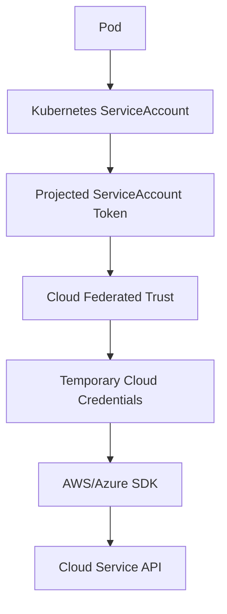
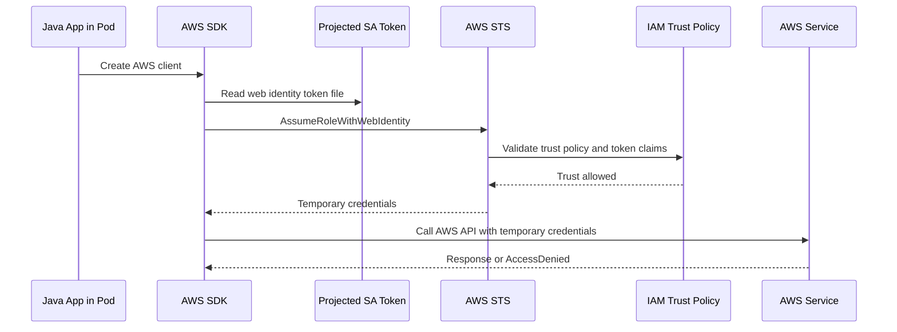
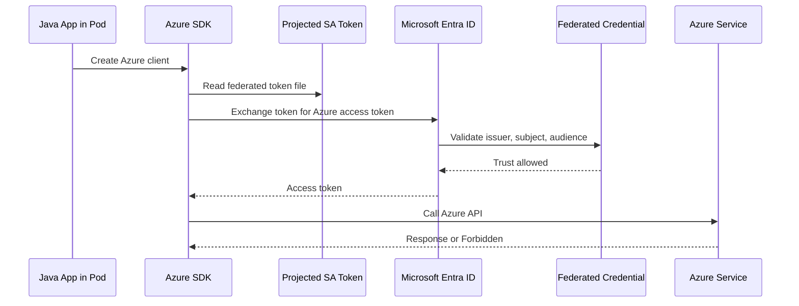
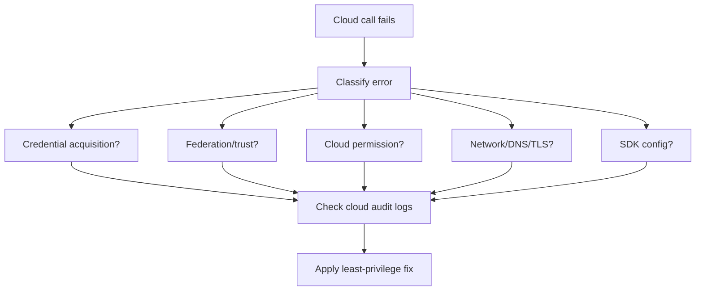

# Part 030 — Kubernetes Identity with AWS and Azure

Part sebelumnya membahas Kubernetes RBAC: apa yang boleh dilakukan ServiceAccount terhadap Kubernetes API.

Part ini membahas identitas cloud: bagaimana pod di Kubernetes mendapatkan permission untuk memanggil AWS atau Azure service tanpa menyimpan access key, client secret, atau credential statis di Secret.

Ini penting untuk enterprise Java/JAX-RS systems karena service backend sering perlu memanggil:

- AWS Secrets Manager,
- AWS SSM Parameter Store,
- AWS S3,
- AWS SQS/SNS,
- AWS KMS,
- AWS STS,
- Azure Key Vault,
- Azure Storage,
- Azure Service Bus,
- Azure App Configuration,
- Azure Event Hubs,
- Azure Monitor,
- private endpoint service,
- managed database/service lain.

Kesalahan identity integration sering muncul sebagai:

- `AccessDeniedException`,
- `403 Forbidden`,
- `NoCredentialProviders`,
- `Unable to load credentials`,
- `AADSTS` error,
- `ManagedIdentityCredential authentication unavailable`,
- token audience mismatch,
- trust policy mismatch,
- SDK credential chain mengambil credential yang salah,
- pod berjalan tetapi gagal mengakses secret manager,
- service hanya gagal di cluster tertentu atau namespace tertentu.

> CSG note: jangan mengasumsikan CSG memakai EKS IRSA, EKS Pod Identity, Azure Workload Identity, AAD Pod Identity legacy, Managed Identity, static cloud credentials, secret manager tertentu, private endpoint tertentu, atau SDK credential pattern tertentu. Semua harus diverifikasi di internal platform docs, ServiceAccount annotation, Helm values, Terraform/IaC, GitOps repo, cloud IAM/RBAC, cloud audit log, dan diskusi dengan platform/SRE/security/backend team.

---

## 1. Core Concept

Kubernetes ServiceAccount bisa menjadi anchor identity untuk cloud provider.

Tetapi ada tiga domain permission yang berbeda:

```text
Kubernetes RBAC      -> permission to Kubernetes API
AWS IAM             -> permission to AWS APIs
Azure IAM/RBAC      -> permission to Azure resources
```

ServiceAccount adalah object Kubernetes. Cloud IAM/RBAC adalah object cloud provider.

Workload identity menghubungkan keduanya melalui federation.



Mental model:

```text
The pod proves who it is using a Kubernetes-issued token.
The cloud provider trusts that token through an identity federation configuration.
The cloud provider returns temporary credentials.
The SDK uses those credentials to call cloud APIs.
```

---

## 2. Why Workload Identity Exists

Sebelum workload identity, aplikasi sering diberi credential statis:

- AWS access key + secret key,
- Azure client id + client secret,
- shared secret file,
- long-lived token,
- credential dalam Kubernetes Secret.

Masalahnya:

- credential bisa bocor ke log/env dump,
- rotation sulit,
- credential sering terlalu luas,
- sulit trace workload mana memakai credential,
- credential bisa dipakai di luar cluster,
- incident blast radius tinggi,
- compliance evidence lemah.

Workload identity bertujuan:

- menghindari long-lived secret,
- memakai temporary credential,
- mengikat permission ke workload identity,
- mengurangi secret distribution,
- memperbaiki auditability,
- mendukung least privilege per service,
- membuat credential rotation lebih aman.

Prinsipnya:

```text
Do not inject cloud credentials if the platform can issue short-lived credentials based on workload identity.
```

---

## 3. Kubernetes ServiceAccount vs Cloud Identity

ServiceAccount bukan IAM role.
ServiceAccount bukan Azure Managed Identity.

ServiceAccount adalah identitas Kubernetes.

Cloud identity dihubungkan melalui konfigurasi trust.

Contoh mapping concept:

| Kubernetes | AWS | Azure |
|---|---|---|
| ServiceAccount | IAM Role via IRSA / EKS Pod Identity | Managed Identity / App Registration via Workload Identity |
| Projected token | OIDC token | OIDC token |
| Trust policy | IAM trust relationship | Federated credential |
| Temporary credential | STS credentials | AAD token |
| SDK resolution | AWS credential provider chain | Azure DefaultAzureCredential chain |

Review harus melihat mapping penuh:

```text
Pod -> ServiceAccount -> projected token -> trust config -> cloud identity -> cloud permission -> cloud API
```

---

## 4. AWS EKS Identity Options

Dalam konteks EKS, beberapa pola identity yang mungkin ditemui:

1. IAM Roles for Service Accounts atau IRSA.
2. EKS Pod Identity awareness.
3. Node IAM role fallback.
4. Static access key dalam Secret.
5. External Secrets/CSI driver yang mengambil secret atas nama workload atau controller.

Untuk senior backend engineer, yang paling penting adalah memahami risiko fallback.

Ideal pattern:

```text
Pod uses its own workload identity with least-privilege IAM permissions.
```

Risky pattern:

```text
Pod accidentally uses node IAM role or shared static access key.
```

Karena node role bisa terlalu luas dan shared credential sulit diaudit.

---

## 5. AWS IRSA Mental Model

IRSA menghubungkan Kubernetes ServiceAccount ke AWS IAM Role melalui OIDC.

Flow konseptual:



Komponen utama:

- EKS cluster OIDC provider,
- Kubernetes ServiceAccount,
- ServiceAccount annotation ke IAM role ARN,
- projected web identity token,
- IAM role trust policy,
- IAM permission policy,
- AWS SDK support untuk web identity credential provider.

---

## 6. IRSA ServiceAccount Annotation

Contoh ServiceAccount:

```yaml
apiVersion: v1
kind: ServiceAccount
metadata:
  name: quote-order-api
  namespace: quote-order
  annotations:
    eks.amazonaws.com/role-arn: arn:aws:iam::123456789012:role/quote-order-api-role
```

Deployment:

```yaml
apiVersion: apps/v1
kind: Deployment
metadata:
  name: quote-order-api
  namespace: quote-order
spec:
  template:
    spec:
      serviceAccountName: quote-order-api
      containers:
        - name: app
          image: 123456789012.dkr.ecr.ap-southeast-1.amazonaws.com/quote-order-api:1.2.3
```

Review points:

- ServiceAccount name benar,
- namespace benar,
- role ARN benar,
- pod benar-benar memakai ServiceAccount tersebut,
- SDK mendukung web identity,
- no static AWS credential env var overriding chain,
- IAM trust policy mengizinkan subject yang tepat.

---

## 7. IRSA Trust Policy

IAM role trust policy harus mempercayai OIDC token dari cluster dan subject ServiceAccount tertentu.

Contoh konseptual:

```json
{
  "Version": "2012-10-17",
  "Statement": [
    {
      "Effect": "Allow",
      "Principal": {
        "Federated": "arn:aws:iam::123456789012:oidc-provider/oidc.eks.region.amazonaws.com/id/CLUSTER_ID"
      },
      "Action": "sts:AssumeRoleWithWebIdentity",
      "Condition": {
        "StringEquals": {
          "oidc.eks.region.amazonaws.com/id/CLUSTER_ID:sub": "system:serviceaccount:quote-order:quote-order-api",
          "oidc.eks.region.amazonaws.com/id/CLUSTER_ID:aud": "sts.amazonaws.com"
        }
      }
    }
  ]
}
```

Critical claims:

- `sub`: Kubernetes ServiceAccount identity,
- `aud`: token audience,
- OIDC provider issuer,
- AWS account,
- role ARN.

Common mistake:

```text
ServiceAccount annotation exists, but IAM trust policy does not match namespace/name/audience/issuer.
```

---

## 8. AWS SDK Credential Resolution

AWS SDK memakai credential provider chain.

Untuk IRSA, SDK biasanya membaca environment variable seperti:

- `AWS_ROLE_ARN`,
- `AWS_WEB_IDENTITY_TOKEN_FILE`,
- region env var atau config,
- token file projected oleh Kubernetes/EKS integration.

Namun chain bisa di-override oleh credential lain:

- `AWS_ACCESS_KEY_ID`,
- `AWS_SECRET_ACCESS_KEY`,
- shared credential file,
- system properties,
- container credential endpoint,
- node metadata role fallback.

Debug principle:

```text
First determine which credential provider the SDK actually used.
```

Java service harus log credential source secara aman jika memungkinkan, bukan credential value.

Contoh safe diagnostic:

```text
AWS credential source: web-identity-token
AWS region: ap-southeast-1
AWS role arn configured: arn:aws:iam::...:role/quote-order-api-role
```

Jangan log:

- access key secret,
- session token,
- raw JWT,
- signed request header.

---

## 9. AWS Permission Policy

Trust policy menjawab:

```text
Can this pod assume the role?
```

Permission policy menjawab:

```text
What can the assumed role do?
```

Contoh IAM permission untuk membaca secret tertentu:

```json
{
  "Version": "2012-10-17",
  "Statement": [
    {
      "Effect": "Allow",
      "Action": [
        "secretsmanager:GetSecretValue"
      ],
      "Resource": [
        "arn:aws:secretsmanager:ap-southeast-1:123456789012:secret:quote-order/prod/db-*"
      ]
    }
  ]
}
```

Least privilege:

- action spesifik,
- resource spesifik,
- region sesuai,
- account sesuai,
- condition jika relevan,
- no wildcard luas,
- no shared role antar banyak service.

---

## 10. AWS IRSA Failure Modes

### 10.1 No Credentials Found

Symptom:

```text
Unable to load AWS credentials from any provider in the chain
```

Likely causes:

- ServiceAccount tidak punya annotation,
- pod tidak memakai ServiceAccount yang benar,
- token file tidak mounted,
- SDK terlalu lama/tidak mendukung web identity,
- env var tidak ter-inject,
- automount/token projection terganggu,
- container user tidak bisa read token file.

Debug:

```bash
kubectl get pod <pod> -n quote-order -o jsonpath='{.spec.serviceAccountName}'
kubectl get sa quote-order-api -n quote-order -o yaml
kubectl exec <pod> -n quote-order -- env | grep AWS
```

Hati-hati saat exec production.

---

### 10.2 AssumeRoleWithWebIdentity AccessDenied

Symptom:

```text
AccessDenied: Not authorized to perform sts:AssumeRoleWithWebIdentity
```

Likely causes:

- trust policy `sub` mismatch,
- namespace mismatch,
- ServiceAccount name mismatch,
- wrong OIDC provider,
- token audience mismatch,
- role ARN wrong,
- cluster recreated and OIDC ID changed,
- cross-account trust not configured.

Debug:

- verify ServiceAccount subject,
- verify role trust policy,
- verify OIDC provider,
- verify annotation role ARN,
- inspect CloudTrail STS failure.

---

### 10.3 AWS Service AccessDenied

Symptom:

```text
AccessDeniedException: User is not authorized to perform secretsmanager:GetSecretValue
```

This means identity was obtained, but permission policy denies action.

Likely causes:

- IAM policy missing action,
- resource ARN mismatch,
- region mismatch,
- KMS decrypt missing,
- permission boundary denies,
- SCP denies,
- explicit deny,
- secret resource policy denies.

Debug:

- identify assumed role ARN,
- check action/resource,
- check KMS permission,
- check CloudTrail,
- check IAM policy simulator if available internally.

---

### 10.4 Wrong Credential Source

Symptom:

- service works in one environment but not another,
- CloudTrail shows node role, not workload role,
- SDK uses static key unexpectedly,
- permission too broad or too narrow unexpectedly.

Likely causes:

- static env vars override IRSA,
- shared credential file exists in image,
- node metadata reachable and used,
- wrong SDK chain order/config,
- local dev credential leaked into image.

Debug:

- inspect env vars,
- inspect image for credential files,
- check CloudTrail principal,
- log safe credential provider source,
- block IMDS from pods if platform supports/mandates it.

---

## 11. EKS Pod Identity Awareness

Some EKS environments may use newer pod identity mechanisms instead of or alongside IRSA.

Conceptually, goal remains the same:

```text
Associate Kubernetes workload identity with IAM permissions without static credentials.
```

Review items remain similar:

- which ServiceAccount is associated,
- which IAM role is used,
- which namespace is allowed,
- what agent/add-on is required,
- what SDK credential source is used,
- what fallback behavior exists,
- what happens if identity agent fails.

Do not assume IRSA if platform uses another EKS identity mechanism.

Internal verification:

- Apakah cluster memakai IRSA, EKS Pod Identity, atau keduanya?
- Apakah ada pod identity agent/add-on?
- Bagaimana association didefinisikan di Terraform/GitOps?
- Apakah role mapping bisa dilihat oleh backend team?

---

## 12. Azure AKS Identity Options

Dalam konteks AKS, beberapa pola identity yang mungkin ditemui:

1. Azure Workload Identity.
2. Managed Identity associated with workload.
3. AAD Pod Identity legacy awareness.
4. Static client secret dalam Kubernetes Secret.
5. Key Vault CSI driver atau External Secrets pattern.

Modern target biasanya workload identity/federation, bukan static secret.

Risky patterns:

- client secret disimpan sebagai env var,
- shared Managed Identity terlalu luas,
- pod memakai identity node secara tidak sengaja,
- Azure SDK DefaultAzureCredential memilih credential yang tidak diharapkan,
- Key Vault permission terlalu luas.

---

## 13. Azure Workload Identity Mental Model

Azure Workload Identity memakai federated credential untuk mempercayai Kubernetes ServiceAccount token.

Flow konseptual:



Komponen utama:

- AKS OIDC issuer enabled,
- Kubernetes ServiceAccount,
- ServiceAccount annotation/label,
- federated credential on identity/app registration,
- Azure role assignment / access policy,
- Azure SDK credential chain,
- token file environment variables.

---

## 14. Azure Workload Identity ServiceAccount

Contoh konseptual ServiceAccount:

```yaml
apiVersion: v1
kind: ServiceAccount
metadata:
  name: quote-order-api
  namespace: quote-order
  annotations:
    azure.workload.identity/client-id: "00000000-0000-0000-0000-000000000000"
  labels:
    azure.workload.identity/use: "true"
```

Deployment:

```yaml
apiVersion: apps/v1
kind: Deployment
metadata:
  name: quote-order-api
  namespace: quote-order
spec:
  template:
    metadata:
      labels:
        azure.workload.identity/use: "true"
    spec:
      serviceAccountName: quote-order-api
      containers:
        - name: app
          image: myregistry.azurecr.io/quote-order-api:1.2.3
```

Review points:

- ServiceAccount annotation benar,
- label/selector requirement platform benar,
- pod memakai ServiceAccount benar,
- federated credential subject cocok,
- client ID cocok,
- tenant ID benar,
- SDK memakai credential workload identity,
- no static client secret overriding chain.

---

## 15. Azure Federated Credential

Federated credential menghubungkan Kubernetes token ke Azure identity.

Field penting secara konseptual:

- issuer: AKS OIDC issuer URL,
- subject: `system:serviceaccount:<namespace>:<serviceaccount>`,
- audience: token audience yang diharapkan,
- identity/client ID target.

Common mistake:

```text
ServiceAccount annotation exists, but federated credential subject does not match namespace/name.
```

Atau:

```text
AKS OIDC issuer changed/recreated, federated credential still points to old issuer.
```

---

## 16. Azure SDK Credential Resolution

Azure SDK sering memakai `DefaultAzureCredential`.

Ini convenient, tetapi di production harus dipahami.

`DefaultAzureCredential` bisa mencoba beberapa provider, seperti:

- environment credential,
- workload identity credential,
- managed identity credential,
- developer CLI credential untuk local dev,
- IDE credential, tergantung environment dan SDK config.

Risk:

- local dev works karena Azure CLI login, cluster gagal,
- cluster memakai env client secret, bukan workload identity,
- wrong tenant/client id,
- managed identity tidak tersedia,
- workload token file tidak ada,
- DefaultAzureCredential mencoba provider yang tidak diinginkan.

Production pattern:

```text
Be explicit enough to know which credential should be used.
Do not rely on accidental credential fallback.
```

Safe diagnostics:

```text
Azure credential source: workload-identity
Azure client id configured: <client-id-prefix-only-or-redacted>
Azure tenant configured: <tenant-id-redacted>
Azure authority host: default/public-cloud or configured cloud
```

Jangan log:

- token,
- client secret,
- JWT,
- Authorization header.

---

## 17. Azure Permission: RBAC vs Access Policy

Setelah identity berhasil mendapat token, Azure resource masih bisa menolak karena permission.

Contoh untuk Key Vault:

- model Azure RBAC,
- model access policy, tergantung konfigurasi vault.

Untuk Storage:

- role assignment seperti Storage Blob Data Reader/Contributor,
- scope subscription/resource group/storage account/container.

Untuk Service Bus:

- data plane role assignment,
- namespace/queue/topic scope.

Failure:

```text
Identity works, but resource permission denies.
```

Debug:

- cek principal/client ID,
- cek role assignment scope,
- cek data plane vs management plane role,
- cek Key Vault firewall/private endpoint,
- cek tenant mismatch,
- cek propagation delay.

---

## 18. Azure Workload Identity Failure Modes

### 18.1 Credential Unavailable

Symptom:

```text
WorkloadIdentityCredential authentication unavailable
```

Likely causes:

- missing ServiceAccount annotation,
- missing pod label expected by webhook,
- webhook not installed/working,
- token file not mounted,
- client ID missing,
- tenant ID missing,
- pod not using expected ServiceAccount,
- SDK version/config issue.

Debug:

```bash
kubectl get pod <pod> -n quote-order -o jsonpath='{.spec.serviceAccountName}'
kubectl get sa quote-order-api -n quote-order -o yaml
kubectl describe pod <pod> -n quote-order
```

Check env safely:

```bash
kubectl exec <pod> -n quote-order -- env | grep AZURE
```

Do not print token file.

---

### 18.2 AADSTS Error

Symptom:

```text
AADSTS... assertion failed
AADSTS... no matching federated identity record found
```

Likely causes:

- issuer mismatch,
- subject mismatch,
- audience mismatch,
- client ID wrong,
- tenant wrong,
- federated credential missing,
- cluster OIDC issuer changed.

Debug:

- verify AKS OIDC issuer,
- verify federated credential issuer/subject/audience,
- verify ServiceAccount namespace/name,
- verify client ID annotation,
- inspect Azure sign-in/audit logs if available.

---

### 18.3 Azure Resource 403

Symptom:

```text
Status code 403: Forbidden
```

If token acquisition succeeded, this is resource authorization or network policy.

Likely causes:

- missing role assignment,
- role assigned at wrong scope,
- using management-plane role for data-plane operation,
- Key Vault access policy missing,
- firewall denies pod source,
- private endpoint DNS issue,
- tenant mismatch,
- propagation delay.

Debug:

- identify principal/client ID,
- verify role assignment scope,
- verify private endpoint/DNS/firewall,
- check Azure Activity Log/resource diagnostic log,
- check SDK endpoint being called.

---

## 19. Pod Identity Legacy Awareness

Some older AKS environments may use AAD Pod Identity.

You may see objects like:

- AzureIdentity,
- AzureIdentityBinding,
- MIC/NMI components.

This pattern has different failure modes:

- binding selector mismatch,
- NMI interception issue,
- MIC assignment failure,
- node managed identity complexity,
- migration to workload identity incomplete.

Do not assume Azure Workload Identity if manifests show legacy pod identity objects.

Internal verification:

- Is AAD Pod Identity still used?
- Is migration planned/completed?
- Which workloads still depend on it?
- What is the supported identity model for new services?

---

## 20. Static Cloud Credentials Anti-Pattern

Static credentials may appear as:

```yaml
env:
  - name: AWS_ACCESS_KEY_ID
    valueFrom:
      secretKeyRef:
        name: aws-static-credentials
        key: accessKeyId
  - name: AWS_SECRET_ACCESS_KEY
    valueFrom:
      secretKeyRef:
        name: aws-static-credentials
        key: secretAccessKey
```

Or Azure:

```yaml
env:
  - name: AZURE_CLIENT_SECRET
    valueFrom:
      secretKeyRef:
        name: azure-client-secret
        key: clientSecret
```

This is sometimes unavoidable in legacy systems, but it is a risk.

Risks:

- long-lived secret,
- copied across namespaces,
- hard rotation,
- accidental logging,
- broad permission,
- usable outside cluster,
- unclear ownership.

Preferred:

- AWS IRSA/EKS Pod Identity,
- Azure Workload Identity,
- external secret controller with controlled identity,
- short-lived credentials,
- cloud-side audit.

If static credential exists, review:

- why workload identity is not used,
- rotation frequency,
- secret owner,
- permission boundary,
- usage audit,
- migration plan.

---

## 21. Identity and Secret Manager Access

Many Java services need secret values.

There are several patterns:

### Pattern A — App reads cloud secret manager directly

Flow:

```text
Pod -> workload identity -> AWS Secrets Manager / Azure Key Vault -> app memory
```

Pros:

- no Kubernetes Secret copy,
- cloud audit direct,
- dynamic fetch possible.

Cons:

- app needs cloud SDK and permission,
- startup depends on cloud API,
- retry/timeout needed,
- local dev complexity,
- secret caching/rotation complexity.

### Pattern B — External controller syncs to Kubernetes Secret

Flow:

```text
External Secrets Controller -> cloud secret manager -> Kubernetes Secret -> Pod mount/env
```

Pros:

- app simpler,
- standard Kubernetes Secret consumption,
- central controller pattern.

Cons:

- secret copied into Kubernetes,
- controller has powerful permission,
- rotation/reload still needed,
- RBAC around ExternalSecret matters.

### Pattern C — CSI driver mounts secret

Flow:

```text
CSI driver -> cloud secret manager -> mounted volume
```

Pros:

- avoids env var,
- can integrate rotation,
- no app SDK needed for secret retrieval.

Cons:

- driver dependency,
- mount failure affects pod start,
- provider-specific config,
- observability needed.

No universal answer. Review based on risk, operations, rotation, and platform standard.

---

## 22. Identity and Network Are Separate

Having cloud permission does not guarantee network reachability.

Example:

```text
AWS role allows secretsmanager:GetSecretValue.
But pod cannot reach Secrets Manager endpoint due to egress policy, route, DNS, VPC endpoint, or proxy.
```

Azure equivalent:

```text
Managed identity has Key Vault Secrets User.
But pod cannot reach Key Vault private endpoint due to private DNS or NSG.
```

Troubleshooting must split:

| Symptom | Likely Domain |
|---|---|
| No credential provider | SDK/runtime config |
| AssumeRoleWithWebIdentity denied | federation/trust |
| AADSTS federated credential error | Azure federation |
| AccessDenied/Forbidden after token | cloud permission |
| timeout | network/routing/DNS/firewall/proxy |
| TLS error | certificate/trust/endpoint/proxy |
| NXDOMAIN/wrong IP | DNS/private DNS |

---

## 23. Token Audience

Projected tokens have audience.

Audience answers:

```text
Who is this token intended for?
```

AWS IRSA commonly expects audience for STS.
Azure Workload Identity expects configured audience for token exchange.
Kubernetes API expects Kubernetes API audience.

Audience mismatch causes federation failure.

Review:

- token audience in projected volume,
- cloud trust policy/federated credential audience,
- webhook-injected environment,
- SDK expectation.

Do not reuse arbitrary Kubernetes API token for cloud federation unless audience matches the trust configuration.

---

## 24. Token Subject

Subject usually looks like:

```text
system:serviceaccount:<namespace>:<serviceaccount-name>
```

This is the anchor for trust.

If any of these change, trust breaks:

- namespace rename,
- ServiceAccount rename,
- Helm release name changes SA name,
- environment uses different namespace,
- blue/green namespace changes,
- service split into new workload,
- platform migrates namespace model.

Review GitOps/Helm carefully:

```yaml
serviceAccount:
  create: true
  name: quote-order-api
```

Generated manifest matters more than values intent.

---

## 25. Permission Boundary

Least privilege cloud identity needs boundaries:

- IAM permission policy,
- IAM permission boundary,
- AWS Organizations SCP,
- resource policy,
- KMS key policy,
- Azure role assignment scope,
- Azure deny assignment/policy,
- Key Vault firewall/access model,
- network boundary,
- environment boundary.

A workload identity should usually be per service or per small workload group.

Bad:

```text
All services in namespace share one IAM role/Managed Identity with broad permissions.
```

Better:

```text
Each service has a scoped identity aligned to its actual cloud API needs.
```

Exception may exist for operational simplicity, but must be explicit.

---

## 26. Environment Boundary

Production identity should not be shared with non-production.

Bad:

```text
same IAM role / managed identity used by dev, test, staging, prod
```

Risks:

- non-prod compromise affects prod,
- test data can access prod secret,
- audit ambiguity,
- accidental production calls from lower env,
- blast radius too high.

Better:

- separate cloud account/subscription/resource group where possible,
- separate IAM role/managed identity per environment,
- separate secret path/vault/resource scope,
- environment-specific trust subject,
- production promotion gate.

---

## 27. Java SDK Configuration

Java applications should avoid hardcoding credential material.

Preferred configuration:

- rely on workload identity provider chain,
- configure region/endpoint explicitly where needed,
- configure retry policy,
- configure timeout,
- configure user agent/application name,
- log safe startup diagnostics,
- fail fast for required dependency if startup cannot proceed,
- degrade safely for optional dependency.

AWS SDK example concept:

```java
// Conceptual only. Let the default provider chain resolve web identity in EKS.
SecretsManagerClient client = SecretsManagerClient.builder()
    .region(Region.AP_SOUTHEAST_1)
    .build();
```

Azure SDK example concept:

```java
// Conceptual only. Ensure DefaultAzureCredential resolves workload identity in AKS.
TokenCredential credential = new DefaultAzureCredentialBuilder().build();
SecretClient client = new SecretClientBuilder()
    .vaultUrl("https://example.vault.azure.net/")
    .credential(credential)
    .buildClient();
```

Production review:

- Does SDK use default chain intentionally?
- Is region/vault/endpoint configurable?
- Are timeouts explicit?
- Are retries bounded?
- Is credential source observable safely?
- Does local dev use separate credentials?

---

## 28. Local Development vs Cluster Identity

Local dev often uses:

- AWS profile,
- Azure CLI login,
- developer identity,
- localstack/mock,
- dev secret file,
- Docker Compose env var.

Cluster uses:

- IRSA/EKS Pod Identity,
- Azure Workload Identity,
- Managed Identity,
- secret sync.

Danger:

```text
It works locally because your personal admin identity is too powerful.
It fails in cluster because workload identity is correctly restricted.
```

Local dev should simulate permission boundaries where possible.

Checklist:

- use least-privilege dev role,
- avoid personal admin credential for app tests,
- document required cloud actions,
- have integration tests for denied permission,
- separate local config from production config,
- ensure static local credential never enters image.

---

## 29. Identity and Observability

For production debugging, you need to answer:

```text
Which identity did this request use?
Which cloud API was called?
Was it denied by identity, network, or resource policy?
```

Observability signals:

- application log with operation name, not secret value,
- cloud audit log principal,
- SDK error code,
- request ID/correlation ID,
- endpoint/region redacted if necessary,
- retry count,
- timeout count,
- credential source category,
- Kubernetes pod/namespace/service account labels,
- trace span for cloud call.

Avoid logging:

- token,
- secret value,
- full Authorization header,
- raw signed URL if sensitive,
- client secret,
- private key.

---

## 30. Cloud Identity Debugging Workflow

Use this general workflow:



Classify first:

| Error Pattern | First Domain to Check |
|---|---|
| no credential provider | SDK/env/token mount |
| assume role denied | trust/federation |
| AADSTS no federated credential | Azure federation |
| access denied for action | cloud permission |
| timeout | network/private endpoint/proxy |
| TLS handshake | cert/proxy/endpoint |
| wrong region/resource not found | config/endpoint/region |

---

## 31. AWS Debugging Commands and Checks

From Kubernetes side:

```bash
kubectl get pod <pod> -n <ns> -o jsonpath='{.spec.serviceAccountName}'
kubectl get sa <sa> -n <ns> -o yaml
kubectl describe pod <pod> -n <ns>
```

Check env carefully:

```bash
kubectl exec <pod> -n <ns> -- env | grep '^AWS_'
```

Expected in IRSA-like flow may include:

- `AWS_ROLE_ARN`,
- `AWS_WEB_IDENTITY_TOKEN_FILE`,
- `AWS_REGION` or `AWS_DEFAULT_REGION`.

From AWS side, verify:

- IAM role trust policy,
- IAM permission policy,
- OIDC provider,
- CloudTrail STS events,
- CloudTrail service API events,
- resource policy,
- KMS key policy,
- SCP/permission boundary.

Do not print raw token in shared channels.

---

## 32. Azure Debugging Commands and Checks

From Kubernetes side:

```bash
kubectl get pod <pod> -n <ns> -o jsonpath='{.spec.serviceAccountName}'
kubectl get sa <sa> -n <ns> -o yaml
kubectl describe pod <pod> -n <ns>
```

Check env carefully:

```bash
kubectl exec <pod> -n <ns> -- env | grep '^AZURE_'
```

Expected workload identity environment may include values related to:

- client ID,
- tenant ID,
- federated token file.

From Azure side, verify:

- federated credential issuer,
- federated credential subject,
- client ID,
- tenant ID,
- role assignment scope,
- Key Vault access mode,
- diagnostic logs,
- sign-in/audit logs,
- private endpoint/firewall/DNS.

Do not print token file.

---

## 33. Image and Credential Leakage

Identity can be compromised before runtime if image contains credentials.

Check image for:

- `.aws/credentials`,
- Azure service principal files,
- kubeconfig,
- `.env`,
- Maven settings with credentials,
- npm/pip config with token,
- private key,
- test fixture secrets,
- build ARG containing secret,
- layer history exposing secret.

Dockerfile bad:

```dockerfile
ARG AWS_SECRET_ACCESS_KEY
RUN echo $AWS_SECRET_ACCESS_KEY > /tmp/key
```

Even if deleted later, it may remain in image layer history.

Use BuildKit secret mounts where needed, never bake credentials into image.

---

## 34. Identity and Init Containers

Init containers may need cloud identity too.

Examples:

- fetch config from secret manager,
- run migration requiring cloud KMS,
- download artifact from storage,
- wait for cloud dependency.

Init container shares pod ServiceAccount.

Risk:

```text
Main app does not need cloud permission, but init container does.
Both get same workload identity.
```

If identity is shared at pod level, permission may be broader than main app needs.

Review:

- Does init container need separate credential pattern?
- Can work be moved to CI/CD or Job?
- Is permission temporary or permanent?
- Does main container have access to same token?
- Is secret fetched into shared volume?

---

## 35. Identity and Sidecars

Sidecars share pod identity context.

Potential sidecars:

- service mesh proxy,
- logging agent,
- metrics exporter,
- secret sync sidecar,
- proxy for cloud API,
- database proxy.

Risk:

- sidecar can access projected token,
- app can access sidecar token/config if mounted shared,
- identity needed by sidecar forces app pod to have cloud permission,
- proxy hides actual caller identity,
- observability attributes all calls to same identity.

Review sidecar identity assumptions carefully.

---

## 36. Identity and Multi-Container Pod

All containers in a pod share the same ServiceAccount.

If one container needs powerful cloud permission, all containers may be able to access projected token unless volume mount is controlled.

Question:

```text
Should this be one pod or separate workloads?
```

For strong identity separation, separate pod/workload is often cleaner.

---

## 37. Identity and Kafka/RabbitMQ/PostgreSQL/Redis/Camunda

Cloud identity usually does not replace application-level auth for dependencies unless those dependencies support cloud IAM-based auth.

Examples:

- PostgreSQL may use password, certificate, or IAM-based auth depending environment,
- Kafka may use SASL/SCRAM, mTLS, IAM-based auth in certain managed services,
- RabbitMQ often uses username/password or mTLS,
- Redis may use auth token/TLS or managed identity integration in certain platforms,
- Camunda may use DB credentials and API credentials.

Do not assume workload identity automatically grants access to DB/message broker.

Review:

- How are DB/broker credentials obtained?
- From Kubernetes Secret, cloud secret manager, CSI mount, or direct IAM auth?
- How are they rotated?
- Does app restart/reload on rotation?
- Is network path private?
- Are TLS certificates managed separately?

---

## 38. Identity and Egress Policy

Even with correct identity, egress policy may block token exchange or cloud API calls.

AWS IRSA needs access to STS endpoint, unless private endpoint/proxy is used.
Azure workload identity needs access to token endpoint and target resource endpoint, unless private/proxy path is configured.

NetworkPolicy/firewall/proxy must allow required endpoints.

Review:

- STS endpoint reachability,
- Azure login/token endpoint reachability,
- secret manager/key vault endpoint reachability,
- DNS resolution,
- proxy configuration,
- private endpoint DNS,
- TLS inspection impact,
- NetworkPolicy egress rules.

---

## 39. Private Endpoint Interaction

When cloud services are accessed through private endpoint:

Identity may be correct, but endpoint resolution changes.

Example failure:

```text
Key Vault permission is correct.
But DNS resolves to public endpoint and firewall blocks public access.
```

Or:

```text
Secrets Manager IAM is correct.
But VPC endpoint policy denies the action.
```

Review additional policy layers:

- VPC endpoint policy,
- PrivateLink allowed principals,
- Azure Private Endpoint approval,
- Key Vault firewall,
- Storage firewall,
- private DNS zone linkage,
- route table,
- SG/NSG.

---

## 40. Permission Propagation Delay

Cloud permission changes may not be immediate.

Symptoms:

- role assignment just added but app still gets 403,
- IAM policy update seems delayed,
- federated credential just created but token exchange fails briefly.

Do not build systems that rely on instantaneous permission propagation during request path.

Operationally:

- plan rollout after identity resources exist,
- create IAM/RBAC before deployment,
- verify with smoke test,
- avoid permission change and app deployment in same uncontrolled step,
- document propagation expectations internally.

---

## 41. Identity Rotation and Lifecycle

Workload identity reduces secret rotation burden, but identity resources still have lifecycle:

- ServiceAccount name changes,
- namespace changes,
- IAM role changes,
- managed identity changes,
- federated credential changes,
- cluster OIDC issuer changes,
- cloud account/subscription migration,
- permission policy changes,
- decommissioned service cleanup.

Review lifecycle:

- Who owns IAM role/managed identity?
- Who owns ServiceAccount manifest?
- Who updates trust mapping?
- How are unused identities detected?
- How are permissions reviewed?
- How are identity changes tested?

---

## 42. Cross-Account and Cross-Subscription Access

Enterprise systems often access resources in another AWS account or Azure subscription.

This adds layers:

AWS:

- role in workload account,
- role in target account,
- trust relationship,
- resource policy,
- SCP,
- KMS key policy,
- VPC endpoint policy.

Azure:

- identity in one subscription/tenant,
- resource in another subscription,
- role assignment at scope,
- tenant constraints,
- private endpoint across VNet/subscription,
- policy/deny assignment.

Failure can happen at any layer.

Do not debug only inside Kubernetes.

---

## 43. Multi-Cluster Identity

If service runs in multiple clusters:

- dev/stage/prod,
- region A/region B,
- EKS and AKS,
- cloud and on-prem,
- blue/green cluster.

Each cluster may have different issuer, namespace, ServiceAccount, identity mapping, DNS, and network path.

Risk:

```text
Same Helm values deployed to another cluster, but trust policy only allows old issuer.
```

Review:

- cluster-specific issuer,
- per-cluster identity mapping,
- environment overlay,
- cloud role assignment per environment,
- promotion flow,
- failover identity readiness.

---

## 44. Identity and Audit

A good identity design makes audit answerable:

```text
Which workload accessed this secret/object/resource at this time?
```

AWS audit may show assumed role session.
Azure audit may show service principal/managed identity.
Kubernetes audit may show ServiceAccount.

To correlate:

- include service name in IAM role/managed identity name,
- include namespace and service account in tags/labels,
- include pod labels in logs/metrics,
- configure SDK user agent if appropriate,
- propagate correlation ID,
- use cloud audit logs,
- preserve deployment version metadata.

Avoid shared identity that hides caller.

---

## 45. Security Review Checklist

### Kubernetes Side

- Is ServiceAccount explicit?
- Is ServiceAccount name stable and environment-specific?
- Does pod use expected ServiceAccount?
- Is automount token required?
- Is token projected with correct audience?
- Are RBAC permissions minimal?

### AWS Side

- Is IRSA/EKS identity mechanism confirmed?
- Is OIDC provider correct?
- Does trust policy match namespace and ServiceAccount?
- Is audience correct?
- Is IAM permission scoped to required action/resource?
- Are KMS/resource policies aligned?
- Is node role fallback prevented or understood?

### Azure Side

- Is Workload Identity/Managed Identity model confirmed?
- Is OIDC issuer enabled and correct?
- Does federated credential match namespace and ServiceAccount?
- Is client ID annotation correct?
- Is tenant correct?
- Is role assignment at correct scope?
- Is Key Vault access model understood?

### Common

- Are static credentials avoided?
- Are credentials absent from image layers?
- Is local dev using separate credentials?
- Are audit logs available?
- Are permission failures observable?
- Is network/private endpoint path verified?

---

## 46. Production Readiness Questions

Before deploying a cloud-integrated service:

1. What cloud APIs does this service call?
2. Which cloud identity is used?
3. Which ServiceAccount anchors the identity?
4. What exact actions/resources are allowed?
5. Is permission environment-specific?
6. Is federation trust scoped to namespace and ServiceAccount?
7. Does SDK use intended credential provider?
8. Are static credentials absent?
9. Is token/log leakage prevented?
10. Is cloud API call timeout/retry configured?
11. Is private endpoint/DNS/firewall path verified?
12. Are audit logs sufficient to trace calls?
13. Is there a runbook for identity failure?
14. Is there a rollback path if identity mapping breaks?

---

## 47. PR Review Signals

Challenge PR if you see:

- AWS access key in Secret,
- Azure client secret in Secret without migration rationale,
- shared IAM role/Managed Identity across unrelated services,
- ServiceAccount annotation copied from another service,
- trust policy wildcard subject,
- IAM policy resource `*` without justification,
- Azure role assignment at subscription scope without need,
- app uses DefaultAzureCredential with no clarity in production,
- SDK region/endpoint hardcoded incorrectly,
- no timeout/retry around cloud call,
- no observability for access denied vs timeout,
- no private endpoint DNS validation,
- static credential baked into image,
- production and non-production share cloud identity.

Good PR signals:

- explicit ServiceAccount,
- scoped cloud role/managed identity,
- trust mapping per namespace/service,
- least-privilege actions/resources,
- no static secret,
- safe diagnostics,
- cloud audit considered,
- network path verified,
- failure mode documented,
- smoke test includes identity-dependent call.

---

## 48. Internal Verification Checklist

Untuk CSG/team, verifikasi:

### Platform Identity Model

- Apakah EKS memakai IRSA, EKS Pod Identity, node role, atau static credentials?
- Apakah AKS memakai Azure Workload Identity, Managed Identity, AAD Pod Identity legacy, atau static client secret?
- Apakah model berbeda antar environment?
- Apakah ada policy standard untuk new service?

### ServiceAccount and Manifest

- ServiceAccount apa yang dipakai service?
- Annotation identity apa yang ada?
- Apakah Helm/Kustomize overlay mengubah nama ServiceAccount?
- Apakah namespace environment berubah?
- Apakah generated manifest cocok dengan trust config?

### Cloud IAM/RBAC

- IAM role/Managed Identity mana yang dipakai?
- Permission apa saja yang diberikan?
- Resource scope apa?
- Apakah permission boundary/SCP/deny policy ada?
- Siapa owner role/identity?

### Secret and Config

- Apakah app membaca secret manager langsung?
- Apakah External Secrets/CSI driver dipakai?
- Apakah secret disalin ke Kubernetes Secret?
- Bagaimana rotation dilakukan?
- Apakah app reload/restart saat secret berubah?

### Network Path

- Apakah cloud service diakses via public endpoint, VPC endpoint, PrivateLink, Private Endpoint, atau proxy?
- Apakah DNS private benar?
- Apakah NetworkPolicy/SG/NSG/firewall allow path?
- Apakah TLS trust chain benar?

### Observability and Operations

- Apakah CloudTrail/Azure audit log tersedia?
- Apakah app log membedakan credential failure, authorization failure, timeout, DNS failure?
- Apakah dashboard/alert ada untuk cloud dependency?
- Apakah runbook identity failure tersedia?

---

## 49. Troubleshooting Matrix

| Symptom | AWS Likely Cause | Azure Likely Cause | Kubernetes Check | Cloud Check |
|---|---|---|---|---|
| No credential | missing IRSA env/token | missing workload identity env/token | SA, pod env, token mount | identity config |
| Federation denied | trust policy mismatch | federated credential mismatch | SA namespace/name | OIDC issuer, subject, audience |
| Access denied | IAM policy/KMS/SCP | role assignment/access policy | credential source | audit logs, resource scope |
| Timeout | VPC endpoint/DNS/egress | Private Endpoint/DNS/NSG | NetworkPolicy, DNS | routing/firewall/private endpoint |
| Works local not cluster | local profile stronger | Azure CLI credential stronger | env/config diff | actual principal |
| Works in dev not prod | identity/env mismatch | role assignment/scope mismatch | overlay/SA/namespace | account/subscription policy |
| Wrong principal | node role/static key fallback | env credential fallback | pod env/image | audit principal |

---

## 50. Key Takeaways

Kubernetes ServiceAccount is not enough by itself.

For cloud calls, the complete chain is:

```text
Pod
-> ServiceAccount
-> projected token
-> cloud federation trust
-> temporary credential/token
-> cloud permission policy
-> network path
-> cloud service API
```

RBAC, IAM/RBAC, and network policy are separate but interacting controls.

Most production failures come from mixing them up:

```text
RBAC forbidden is not IAM denied.
IAM allowed is not network reachable.
Network reachable is not resource authorized.
SDK default credential is not always the credential you intended.
```

Production-safe identity design should aim for:

- no static cloud credentials,
- explicit ServiceAccount,
- scoped trust by namespace and ServiceAccount,
- least-privilege cloud permissions,
- environment separation,
- safe SDK credential resolution,
- private connectivity awareness,
- auditability,
- observable failures,
- documented runbook.

For senior backend engineers, the goal is not to own all IAM/Azure RBAC configuration, but to be able to read the chain, challenge unsafe assumptions, debug failures, and ask the right platform/security questions before a cloud integration becomes a production incident.

