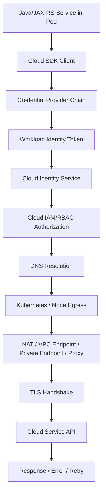

# Part 031 — Calling Cloud Services from Kubernetes Pods

Part sebelumnya membahas bagaimana pod mendapatkan identitas cloud melalui mekanisme seperti AWS IAM Roles for Service Accounts dan Azure Workload Identity.

Part ini membahas langkah berikutnya: ketika aplikasi Java/JAX-RS di dalam pod benar-benar memanggil AWS atau Azure service.

Ini bukan sekadar masalah kode SDK.

Satu cloud service call dari pod melewati banyak lapisan:

```text
Java code
  -> SDK client
  -> credential provider chain
  -> workload identity token
  -> cloud identity exchange
  -> IAM/RBAC authorization
  -> DNS resolution
  -> Kubernetes egress
  -> node/network route
  -> NAT gateway / VPC endpoint / private endpoint / proxy
  -> TLS handshake
  -> cloud service API
  -> service-specific authorization
  -> response / retry / timeout / metrics
```

Kalau salah satu lapisan rusak, symptom di aplikasi sering terlihat sama: `timeout`, `403`, `connection refused`, `unknown host`, atau `unable to load credentials`.

Untuk senior backend engineer, kemampuan pentingnya bukan hanya “memakai SDK”, tetapi bisa menelusuri call path dari resource method JAX-RS sampai cloud service boundary.

> CSG note: jangan mengasumsikan CSG memakai AWS SDK, Azure SDK, IRSA, Azure Workload Identity, static credentials, proxy, NAT gateway, VPC endpoint, Azure Private Endpoint, AWS Secrets Manager, Azure Key Vault, SSM Parameter Store, AppConfig, Azure App Configuration, atau network topology tertentu. Semua detail harus diverifikasi di codebase, Helm values, Kubernetes manifest, ServiceAccount, NetworkPolicy, Terraform/IaC, cloud IAM/RBAC, DNS, platform docs, observability dashboard, dan diskusi dengan platform/SRE/security/backend team.

---

## 1. Core Concept

Calling cloud service from pod adalah gabungan dari empat concern besar:

1. **Identity** — siapa pod ini?
2. **Authorization** — apa yang boleh dilakukan pod ini?
3. **Connectivity** — bagaimana paket jaringan sampai ke cloud service?
4. **Client behavior** — bagaimana aplikasi mengelola timeout, retry, pool, rate limit, dan failure?

Kesalahan umum adalah hanya fokus ke satu layer.

Contoh:

- Backend engineer melihat `AccessDenied` lalu menganggap network bermasalah.
- Platform engineer melihat DNS resolve lalu menganggap aplikasi pasti bisa connect.
- Security engineer melihat IAM policy benar lalu lupa NetworkPolicy memblokir egress.
- Developer melihat SDK client berhasil dibuat lalu lupa call pertama baru terjadi saat runtime.
- Readiness probe hijau padahal dependency cloud yang critical belum bisa diakses.

Mental model yang benar:



Cloud service call bukan atomic operation. Ia adalah distributed path.

---

## 2. Why This Matters in Enterprise Java Systems

Enterprise Java/JAX-RS service biasanya tidak berdiri sendiri. Service bisa perlu memanggil:

- secret manager,
- parameter store,
- object storage,
- message queue,
- event bus,
- KMS,
- cloud logging/monitoring API,
- feature flag/config service,
- managed database API,
- private API internal,
- identity provider,
- document storage,
- notification service,
- billing service,
- customer data platform,
- audit service.

Dalam quote/order/CPQ-style system, cloud service call bisa memengaruhi:

- quote creation,
- price calculation,
- order submission,
- workflow progression,
- document generation,
- entitlement check,
- catalog sync,
- event publication,
- notification dispatch,
- audit trail,
- customer-facing API latency.

Cloud integration failure bukan hanya technical error. Ia bisa menjadi business process failure.

Contoh impact:

| Failure | Technical Symptom | Business Impact |
|---|---|---|
| Secret manager unreachable | service gagal startup | deployment gagal |
| S3/Blob timeout | document gagal dibuat | quote/order tidak lengkap |
| KMS denied | encryption/decryption gagal | data tidak bisa diproses |
| Queue publish throttled | event tertunda | downstream tidak konsisten |
| AppConfig/Parameter Store gagal | config stale | behavior environment salah |
| Private endpoint DNS salah | timeout | outage parsial per environment |

---

## 3. Lifecycle of a Cloud Service Call

Cloud service call punya lifecycle yang perlu dipahami.

### 3.1 Startup Phase

Pada startup, aplikasi biasanya melakukan:

- membaca environment variables,
- membuat SDK client,
- resolve region/endpoint,
- mencari credential provider,
- membaca token workload identity,
- mungkin melakukan initial call ke config/secret service,
- membuat connection pool,
- menjalankan health/readiness checks.

Failure startup umum:

- region tidak dikonfigurasi,
- env var salah,
- SDK credential chain tidak menemukan credential,
- ServiceAccount annotation salah,
- token file tidak ada,
- cloud identity trust policy salah,
- dependency critical belum reachable,
- startup probe terlalu agresif.

### 3.2 Runtime Phase

Saat runtime, aplikasi melakukan:

- token refresh,
- API request,
- retry,
- backoff,
- circuit breaking,
- connection reuse,
- rate limit handling,
- response parsing,
- metrics/logging/tracing.

Failure runtime umum:

- token expired dan gagal refresh,
- permission berubah,
- DNS cache stale,
- private endpoint berubah,
- cloud API throttling,
- network flap,
- TLS certificate issue,
- proxy issue,
- dependency latency spike.

### 3.3 Shutdown Phase

Saat shutdown, aplikasi harus:

- berhenti menerima request baru,
- menyelesaikan in-flight call,
- menutup SDK client / HTTP client,
- flush telemetry,
- menghentikan consumer/publisher secara aman.

Failure shutdown umum:

- request ke cloud service terpotong,
- partial write,
- duplicate publish karena retry setelah SIGTERM,
- telemetry tidak terkirim,
- connection leak.

---

## 4. AWS SDK from Pod

Pada EKS atau Kubernetes yang terintegrasi AWS, Java service biasanya memakai AWS SDK.

Credential source yang sehat untuk pod production biasanya bukan access key hardcoded, melainkan workload identity.

Common pattern:

```text
Pod
  -> Kubernetes ServiceAccount
  -> projected token
  -> AWS STS AssumeRoleWithWebIdentity
  -> temporary credentials
  -> AWS service API call
```

### 4.1 Important AWS Inputs

AWS SDK call biasanya membutuhkan:

- AWS region,
- credentials,
- optional custom endpoint,
- HTTP client config,
- retry policy,
- timeout policy,
- service-specific config,
- TLS trust,
- proxy config jika dipakai,
- observability instrumentation.

### 4.2 AWS Credential Provider Chain Concern

AWS SDK memiliki credential provider chain. Dalam container, chain bisa mencoba beberapa sumber, misalnya:

- environment variables,
- system properties,
- web identity token file,
- profile file,
- container credentials,
- instance metadata service.

Dalam pod production, risiko utamanya:

- SDK mengambil credential dari env var lama yang tidak sengaja masih ada,
- SDK fallback ke node role karena IMDS dapat diakses,
- token file path salah,
- role ARN salah,
- region tidak konsisten,
- service account annotation salah,
- SDK versi lama tidak mendukung mekanisme identity yang dipakai.

### 4.3 AWS Authorization Layer

Credential berhasil didapat bukan berarti request diizinkan.

Authorization bisa ditolak oleh:

- IAM policy,
- trust policy,
- permission boundary,
- SCP organisasi,
- resource policy,
- KMS key policy,
- S3 bucket policy,
- Secrets Manager resource policy,
- VPC endpoint policy,
- condition key seperti source VPC, principal ARN, tag, region, atau encryption context.

Senior engineer perlu menanyakan:

```text
Apakah failure ini credential discovery, identity federation, atau authorization policy?
```

Ketiganya menghasilkan error berbeda, tetapi sering disamakan sebagai “IAM issue”.

---

## 5. Azure SDK from Pod

Pada AKS atau Kubernetes yang terintegrasi Azure, Java service biasanya memakai Azure SDK.

Common pattern untuk workload identity:

```text
Pod
  -> Kubernetes ServiceAccount
  -> projected token
  -> Azure federated credential
  -> Microsoft Entra ID token
  -> Azure resource API call
```

### 5.1 Important Azure Inputs

Azure SDK call biasanya membutuhkan:

- tenant ID,
- client ID,
- subscription/resource scope,
- authority host jika environment khusus,
- endpoint/resource URI,
- credential implementation,
- retry/timeout config,
- proxy config,
- TLS trust,
- observability instrumentation.

### 5.2 DefaultAzureCredential Concern

`DefaultAzureCredential` sangat nyaman, tetapi di production harus dipahami urutannya.

Risiko umum:

- credential lokal/dev ikut terbaca di environment yang tidak diharapkan,
- Managed Identity dicoba padahal workload identity yang diinginkan,
- client ID salah,
- tenant ID salah,
- federated credential subject mismatch,
- token audience mismatch,
- SDK versi tidak sesuai,
- aplikasi berbeda behavior antara lokal, CI, dan cluster.

Untuk production, credential chain harus sengaja dikontrol.

### 5.3 Azure Authorization Layer

Credential berhasil didapat bukan berarti request diizinkan.

Authorization bisa ditolak oleh:

- Azure RBAC role assignment,
- Key Vault access model,
- resource-level policy,
- management group/subscription policy,
- private endpoint configuration,
- firewall setting,
- public network access disabled,
- tenant boundary,
- conditional access tertentu.

Senior engineer perlu membedakan:

```text
Authentication berhasil? Authorization berhasil? Network path berhasil?
```

---

## 6. Credential Provider Chain: Production Rules

Credential provider chain harus deterministic.

Aturan production:

1. Jangan hardcode access key, secret key, client secret, atau connection string sensitif.
2. Jangan mengandalkan credential lokal developer.
3. Jangan membiarkan fallback ke node identity tanpa sengaja.
4. Jangan menyimpan cloud credential statis di Kubernetes Secret kecuali ada alasan kuat dan disetujui security.
5. Pakai workload identity jika platform mendukung.
6. Log credential source secara aman, bukan credential value.
7. Validasi region/tenant/client/role saat startup.
8. Pastikan token refresh tidak gagal diam-diam.

Contoh log yang aman:

```text
Cloud credential provider initialized: web-identity / workload-identity
Cloud region: ap-southeast-1
Cloud service endpoint mode: private
```

Contoh log yang berbahaya:

```text
AWS_SECRET_ACCESS_KEY=...
AZURE_CLIENT_SECRET=...
Authorization: Bearer eyJ...
```

---

## 7. IAM/RBAC Permission Design

Least privilege bukan hanya jumlah action sedikit. Permission harus sesuai dengan business capability service.

Contoh mapping:

| Workload Capability | AWS Permission Example | Azure Permission Example |
|---|---|---|
| Read runtime secret | `secretsmanager:GetSecretValue` | Key Vault Secrets User |
| Read config | `ssm:GetParameter`, `appconfig:GetConfiguration` | App Configuration Data Reader |
| Write object | `s3:PutObject` | Storage Blob Data Contributor |
| Read object | `s3:GetObject` | Storage Blob Data Reader |
| Decrypt data | `kms:Decrypt` | Key Vault Crypto User |
| Publish message | `sns:Publish`, `sqs:SendMessage` | Service Bus Data Sender |
| Consume message | `sqs:ReceiveMessage`, `sqs:DeleteMessage` | Service Bus Data Receiver |

Permission harus scoped berdasarkan:

- environment,
- namespace,
- service identity,
- resource ARN/resource ID,
- operation,
- encryption key,
- tenant/subscription/account,
- data classification.

Anti-pattern:

```text
Allow: * on *
Contributor on subscription
Owner role for application pod
One shared role for all services
One shared managed identity for all workloads
```

---

## 8. Connectivity Path

Setelah identity dan authorization benar, request masih harus melewati network.

Possible egress patterns:

```text
Pod -> Node -> NAT Gateway -> Public Cloud API
Pod -> Node -> VPC Endpoint / Private Endpoint -> Cloud API
Pod -> Node -> Corporate Proxy -> Cloud API
Pod -> Node -> Firewall -> On-prem / Cloud Private API
```

### 8.1 Public Endpoint via NAT

Pattern ini umum tetapi punya concern:

- NAT gateway cost,
- NAT gateway availability,
- egress IP allowlist,
- public internet path,
- firewall policy,
- source IP visibility,
- rate limit per egress IP.

### 8.2 Private Endpoint

Private endpoint memberi private network path ke service cloud.

Concern:

- DNS harus resolve ke private IP,
- route harus benar,
- SG/NSG/firewall harus allow,
- endpoint policy bisa menolak,
- TLS hostname tetap harus sesuai service hostname,
- cross-region/cross-VNet/VPC routing harus jelas.

### 8.3 Proxy

Enterprise environment sering memakai proxy.

Concern:

- `HTTP_PROXY`, `HTTPS_PROXY`, `NO_PROXY`,
- SDK apakah membaca proxy env var,
- private endpoint seharusnya bypass proxy atau tidak,
- TLS inspection,
- corporate CA trust,
- proxy authentication,
- proxy timeout.

---

## 9. DNS Resolution

DNS menentukan apakah aplikasi menuju public endpoint, private endpoint, atau endpoint yang salah.

Untuk cloud service call, DNS failure bisa berupa:

- `UnknownHostException`,
- resolve ke public IP padahal harus private,
- resolve ke private IP tetapi route tidak ada,
- split-horizon DNS salah,
- CoreDNS tidak bisa forward,
- search domain/ndots menyebabkan delay,
- DNS TTL/cache membuat perubahan lambat terlihat,
- private DNS zone belum linked ke VPC/VNet.

Debugging dasar dari pod:

```bash
kubectl exec -n <namespace> <pod> -- nslookup <cloud-service-hostname>
kubectl exec -n <namespace> <pod> -- getent hosts <cloud-service-hostname>
kubectl exec -n <namespace> <pod> -- cat /etc/resolv.conf
```

Interpretasi hasil:

| Result | Meaning |
|---|---|
| Public IP | mungkin lewat NAT/public internet |
| Private IP | mungkin private endpoint aktif |
| NXDOMAIN | DNS zone/forwarder salah |
| Timeout | CoreDNS/upstream DNS/firewall issue |
| Different IP per namespace/node | DNS policy/cache/topology issue |

---

## 10. TLS and Trust

Cloud API call hampir selalu memakai TLS.

TLS failure umum:

- certificate tidak dipercaya,
- corporate TLS inspection CA tidak ada di truststore,
- SNI mismatch,
- hostname mismatch karena aplikasi connect ke IP langsung,
- private endpoint memakai hostname yang salah,
- JDK truststore tidak punya CA yang dibutuhkan,
- clock skew membuat certificate dianggap invalid,
- TLS protocol/cipher mismatch.

Rule penting:

```text
Connect to hostname, not private IP.
```

Private endpoint biasanya tetap mengharapkan hostname service resmi agar certificate cocok.

Debugging TLS dari pod:

```bash
kubectl exec -n <namespace> <pod> -- openssl s_client -connect <host>:443 -servername <host>
```

Untuk Java:

- cek JDK truststore,
- cek custom truststore jika ada,
- cek `javax.net.ssl.trustStore`,
- cek container base image CA certificates,
- cek apakah distroless image punya CA bundle sesuai kebutuhan.

---

## 11. Retry, Timeout, and Rate Limit

Cloud SDK biasanya punya default retry dan timeout. Default ini tidak selalu cocok untuk production.

Concern utama:

- timeout terlalu panjang membuat thread JAX-RS habis,
- timeout terlalu pendek menyebabkan false failure,
- retry tanpa backoff memperparah outage,
- retry pada non-idempotent operation bisa menyebabkan duplicate effect,
- SDK retry + application retry + service mesh retry bisa berlipat,
- rate limit 429 tidak dihormati,
- circuit breaker tidak ada,
- request cancellation saat client disconnect tidak diteruskan.

### Timeout Chain

Untuk JAX-RS service, timeout harus konsisten di seluruh chain:

```text
Client timeout
  > API gateway / ingress timeout
    > JAX-RS server request timeout
      > cloud SDK total timeout
        > cloud SDK connect/read timeout
```

Kalau cloud SDK timeout lebih panjang daripada ingress timeout, request bisa tetap berjalan setelah client sudah menerima timeout.

### Idempotency

Cloud write operation perlu idempotency.

Contoh:

- object upload pakai deterministic key,
- message publish punya idempotency key/correlation ID,
- workflow command punya business key,
- retry tidak membuat double order,
- write result disimpan dengan status yang jelas.

---

## 12. Java/JAX-RS Runtime Impact

Cloud service call memengaruhi Java runtime.

### 12.1 Thread Pool

Blocking SDK call memakai thread. Kalau cloud API lambat, thread pool bisa habis.

Risk:

```text
Cloud API latency spike
  -> JAX-RS worker threads blocked
  -> request queue grows
  -> readiness still green
  -> service returns 503/504 upstream
```

Mitigation:

- set timeout eksplisit,
- gunakan bulkhead/circuit breaker,
- batasi concurrency per dependency,
- expose dependency latency metrics,
- jangan melakukan call lambat di request path jika bisa async.

### 12.2 Connection Pool

SDK HTTP client biasanya punya connection pool.

Concern:

- max connections terlalu rendah,
- connection leak,
- idle connection stale,
- DNS change tidak diikuti karena connection reuse,
- TLS handshake terlalu sering karena no reuse,
- ephemeral port exhaustion.

### 12.3 Startup Dependency

Jangan sembarangan membuat aplikasi gagal startup karena dependency cloud yang tidak critical.

Pertanyaan desain:

- Apakah secret/config ini wajib untuk start?
- Apakah dependency bisa lazy-load?
- Apakah fallback aman?
- Apakah readiness harus false sampai dependency critical reachable?
- Apakah liveness boleh gagal karena dependency external? Biasanya tidak.

---

## 13. Dependency-Specific Patterns

### 13.1 Secret Manager / Key Vault

Pattern:

- baca secret saat startup atau mount melalui CSI/external secret,
- cache secret dengan TTL,
- dukung rotation,
- jangan log secret,
- jangan expose secret di health endpoint.

Failure mode:

- access denied,
- secret version disabled,
- secret deleted,
- rotation belum sinkron,
- private endpoint DNS salah,
- startup blocked.

### 13.2 Parameter Store / App Configuration

Pattern:

- baca config by environment,
- validasi schema config,
- audit perubahan config,
- kontrol reload.

Failure mode:

- config stale,
- config environment salah,
- partial reload,
- missing required key,
- config value invalid.

### 13.3 Object Storage

Pattern:

- deterministic object key,
- metadata/correlation ID,
- server-side encryption,
- content type,
- size limit,
- retry idempotent,
- lifecycle policy.

Failure mode:

- upload timeout,
- partial write semantics misunderstanding,
- permission denied on KMS key,
- bucket/container policy denied,
- object not found due to wrong environment/prefix.

### 13.4 Queue/Event Service

Pattern:

- idempotent publish,
- message key/correlation ID,
- DLQ,
- visibility timeout / lock duration,
- retry/backoff,
- poison message handling.

Failure mode:

- duplicate message,
- publish throttled,
- consumer permission denied,
- message invisible too long,
- DLQ growth ignored.

---

## 14. Kubernetes Egress Policy

NetworkPolicy bisa membatasi egress dari pod.

Kalau default deny egress aktif, cloud call perlu allow rule.

Challenge:

- NetworkPolicy sering berbasis IP/CIDR, sementara cloud service hostname bisa berubah.
- Private endpoint IP lebih stabil, tetapi tetap perlu DNS dan route.
- DNS egress harus diizinkan ke CoreDNS.
- Egress firewall/service mesh bisa menambah policy layer.

Contoh conceptual NetworkPolicy:

```yaml
apiVersion: networking.k8s.io/v1
kind: NetworkPolicy
metadata:
  name: allow-dns-and-private-cloud-endpoint
spec:
  podSelector:
    matchLabels:
      app: quote-service
  policyTypes:
    - Egress
  egress:
    - to:
        - namespaceSelector:
            matchLabels:
              kubernetes.io/metadata.name: kube-system
      ports:
        - protocol: UDP
          port: 53
        - protocol: TCP
          port: 53
    - to:
        - ipBlock:
            cidr: 10.40.20.15/32
      ports:
        - protocol: TCP
          port: 443
```

> Jangan copy-paste contoh ini ke production. CIDR, namespace label, CNI behavior, DNS location, dan policy model harus diverifikasi internal.

---

## 15. Cloud Call Observability

Cloud call yang tidak observable akan sulit dibedakan antara app bug, IAM denial, network failure, dan cloud outage.

Minimum telemetry:

- dependency name,
- operation name,
- region,
- endpoint mode public/private,
- status code/error code,
- latency histogram,
- retry count,
- timeout count,
- throttle count,
- circuit breaker state,
- correlation ID,
- cloud request ID,
- Kubernetes namespace/pod/service version,
- identity role/client ID yang aman untuk dicatat.

Log example yang berguna:

```json
{
  "event": "cloud_call_failed",
  "dependency": "aws-secrets-manager",
  "operation": "GetSecretValue",
  "region": "ap-southeast-1",
  "status": 403,
  "errorCode": "AccessDeniedException",
  "role": "quote-service-runtime-role",
  "correlationId": "...",
  "durationMs": 184
}
```

Jangan log:

- secret value,
- token,
- authorization header,
- signed URL penuh jika mengandung credential,
- customer PII.

---

## 16. Common Failure Modes

| Symptom | Likely Layer | Possible Cause |
|---|---|---|
| `NoCredentialProviders` | Credential chain | token/env/profile tidak tersedia |
| `AccessDenied` / 403 | Authorization | IAM/RBAC/resource policy/KMS policy denied |
| `UnknownHostException` | DNS | CoreDNS/private DNS/hostname salah |
| Connection timeout | Network | route, firewall, endpoint, proxy, NetworkPolicy |
| TLS handshake failed | TLS | CA trust, SNI, hostname, TLS inspection |
| 429 throttling | Cloud API limit | retry storm, quota, rate spike |
| 5xx from cloud API | Cloud service/dependency | regional issue, service outage, overload |
| Works locally, fails in pod | Identity/network | local credential berbeda, cluster egress berbeda |
| Works in dev, fails in prod | Config/policy | prod IAM, DNS, endpoint, firewall berbeda |
| Slow request | Client/network | timeout too high, retry amplification, pool exhaustion |

---

## 17. Debugging Workflow

Gunakan urutan dari paling dekat ke aplikasi sampai cloud boundary.

### Step 1 — Confirm Application Configuration

Cek:

- region,
- endpoint override,
- credential mode,
- client ID/role ARN,
- timeout,
- proxy env,
- feature flag,
- config source.

Command:

```bash
kubectl describe pod -n <namespace> <pod>
kubectl exec -n <namespace> <pod> -- printenv | grep -E 'AWS|AZURE|HTTP|HTTPS|NO_PROXY'
```

Jangan dump semua env var di production bila ada secret.

### Step 2 — Confirm ServiceAccount and Token

Cek:

```bash
kubectl get pod -n <namespace> <pod> -o jsonpath='{.spec.serviceAccountName}'
kubectl get sa -n <namespace> <service-account> -o yaml
```

Verifikasi annotation/federation sesuai platform.

### Step 3 — Confirm DNS

```bash
kubectl exec -n <namespace> <pod> -- nslookup <cloud-hostname>
kubectl exec -n <namespace> <pod> -- getent hosts <cloud-hostname>
```

Pastikan IP sesuai expectation: public atau private.

### Step 4 — Confirm TCP/TLS Reachability

```bash
kubectl exec -n <namespace> <pod> -- sh -c 'timeout 5 sh -c "</dev/tcp/<host>/443"'
kubectl exec -n <namespace> <pod> -- openssl s_client -connect <host>:443 -servername <host>
```

Tool dalam image production mungkin minimal. Gunakan debug pod atau ephemeral container sesuai policy internal.

### Step 5 — Confirm Cloud Authorization

Cek:

- cloud audit log,
- IAM policy simulation bila tersedia,
- role assignment,
- resource policy,
- KMS/key policy,
- endpoint policy,
- denied action/resource/condition.

### Step 6 — Confirm Application Client Behavior

Cek:

- timeout,
- retry count,
- connection pool,
- circuit breaker,
- thread dump,
- metrics latency,
- rate limit/throttle.

---

## 18. Production Debugging Safety

Hindari tindakan ini di production tanpa prosedur:

- mencetak semua env var,
- menyalin token dari pod,
- menjalankan shell interaktif pada pod yang memproses data sensitif,
- mengubah NetworkPolicy manual tanpa GitOps,
- menaikkan IAM permission ke wildcard,
- disable TLS verification,
- bypass private endpoint ke public endpoint,
- restart massal tanpa memahami blast radius,
- mematikan liveness/readiness tanpa mitigasi.

Debugging production harus meninggalkan audit trail.

---

## 19. EKS, AKS, On-Prem, and Hybrid Concerns

### EKS Concern

Verifikasi:

- IRSA/EKS Pod Identity,
- AWS SDK version,
- region,
- VPC endpoint,
- endpoint policy,
- Security Group,
- NACL,
- NAT gateway,
- Route 53 private hosted zone,
- CloudWatch logs/metrics,
- CloudTrail denied event,
- ECR/Secrets Manager/S3/KMS specific policy.

### AKS Concern

Verifikasi:

- Azure Workload Identity,
- Managed Identity,
- Azure SDK version,
- tenant/client ID,
- private endpoint,
- Private DNS Zone,
- NSG/UDR,
- Azure Firewall/proxy,
- Azure Monitor/Log Analytics,
- Activity Log,
- Key Vault/Storage/AppConfig role assignment.

### On-Prem Concern

Verifikasi:

- outbound firewall,
- proxy,
- corporate CA,
- DNS forwarding,
- private connectivity,
- egress allowlist,
- static credential exception,
- network latency,
- certificate trust.

### Hybrid Concern

Verifikasi:

- cloud-to-on-prem route,
- on-prem-to-cloud route,
- private DNS resolution from both sides,
- TLS trust boundary,
- MTU,
- firewall statefulness,
- proxy bypass,
- latency budget.

---

## 20. Correctness Concerns

Cloud service call correctness harus menjawab:

- Apakah operation idempotent?
- Apa yang terjadi bila request timeout tetapi operation sebenarnya sukses?
- Apakah retry bisa membuat duplicate effect?
- Apakah response partial bisa terjadi?
- Apakah transaction lokal dan cloud write bisa divergen?
- Apakah ada outbox pattern untuk event publish?
- Apakah ada reconciliation job untuk repair?
- Apakah failure dicatat sebagai state eksplisit?
- Apakah user-facing API mengembalikan status yang benar?

Untuk quote/order system, ini sangat penting karena external side effect bisa membuat lifecycle entity tidak konsisten.

---

## 21. Security and Privacy Concerns

Checklist security:

- gunakan workload identity,
- hindari static credential,
- least privilege,
- scope permission per service/environment,
- jangan log token/secret/PII,
- TLS verification aktif,
- secret rotation didukung,
- audit log aktif,
- egress dibatasi,
- private endpoint dipakai jika diperlukan,
- cloud request ID dicatat,
- resource policy tidak wildcard,
- KMS/key policy sesuai data classification.

---

## 22. Performance and Cost Concerns

Performance concern:

- SDK timeout,
- retry amplification,
- connection pool size,
- DNS latency,
- TLS handshake overhead,
- NAT/proxy bottleneck,
- endpoint cross-zone/cross-region latency,
- thread blocking,
- backpressure.

Cost concern:

- NAT gateway data processing,
- private endpoint hourly/data processing,
- cross-AZ data transfer,
- excessive retry,
- high-cardinality telemetry,
- verbose cloud API polling,
- unnecessary startup calls per pod replica,
- too many secret/config fetches without caching.

---

## 23. PR Review Checklist

Saat mereview PR yang menambah cloud service call, tanyakan:

- Service cloud apa yang dipanggil?
- Operation apa yang dilakukan?
- Apakah read atau write?
- Apakah operation idempotent?
- Identity apa yang digunakan?
- Permission minimum apa yang dibutuhkan?
- Apakah ada resource policy/KMS policy tambahan?
- Endpoint public atau private?
- DNS expectation apa?
- Apakah NetworkPolicy perlu diubah?
- Timeout berapa?
- Retry policy bagaimana?
- Apakah retry aman?
- Apakah ada circuit breaker/bulkhead?
- Apakah metrics/log/traces cukup?
- Apakah secret/token tidak akan bocor di log?
- Apakah failure memengaruhi readiness?
- Apakah ada fallback/reconciliation?
- Apakah behavior dev/staging/prod konsisten?

---

## 24. Internal Verification Checklist

Verifikasi di internal CSG/team:

- Cloud provider yang dipakai untuk workload terkait: AWS, Azure, on-prem, hybrid, atau multi-cloud.
- SDK yang dipakai: AWS SDK v1/v2, Azure SDK, custom client, atau wrapper internal.
- Credential mode: IRSA, EKS Pod Identity, Azure Workload Identity, Managed Identity, static secret, atau lainnya.
- ServiceAccount annotation.
- IAM role / managed identity / federated credential.
- IAM/RBAC permission.
- Resource policy, KMS/key policy, endpoint policy.
- Region/tenant/subscription/resource group.
- Endpoint override.
- Public vs private endpoint mode.
- VPC endpoint / Azure Private Endpoint.
- Private DNS zone / Route 53 private hosted zone.
- NetworkPolicy egress.
- Firewall/proxy configuration.
- TLS truststore/custom CA.
- SDK timeout/retry config.
- Connection pool settings.
- Cloud API rate limits.
- Observability dashboard.
- Audit logs: CloudTrail, Azure Activity Log, Key Vault diagnostics, etc.
- Incident notes terkait cloud dependency.
- Runbook untuk access denied, timeout, DNS failure, TLS failure, dan throttling.

---

## 25. Senior Engineer Mental Model

Saat melihat error cloud service call dari Kubernetes pod, jangan langsung menyimpulkan.

Gunakan model ini:

```text
1. Does the app know what to call?
2. Can the SDK obtain credentials?
3. Does the identity authenticate successfully?
4. Is the identity authorized for this resource/action?
5. Does DNS resolve to the expected endpoint?
6. Can the pod reach that endpoint over the network?
7. Does TLS validate correctly?
8. Does the cloud service accept the request?
9. Does client retry/timeout behavior preserve correctness?
10. Is the failure observable enough to diagnose next time?
```

Kalau jawaban untuk salah satu layer tidak pasti, itu bukan “cloud issue” atau “Kubernetes issue”. Itu adalah distributed call path yang belum diverifikasi.
