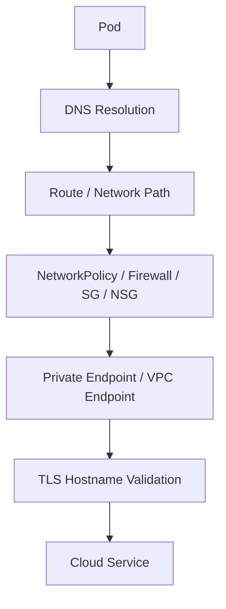
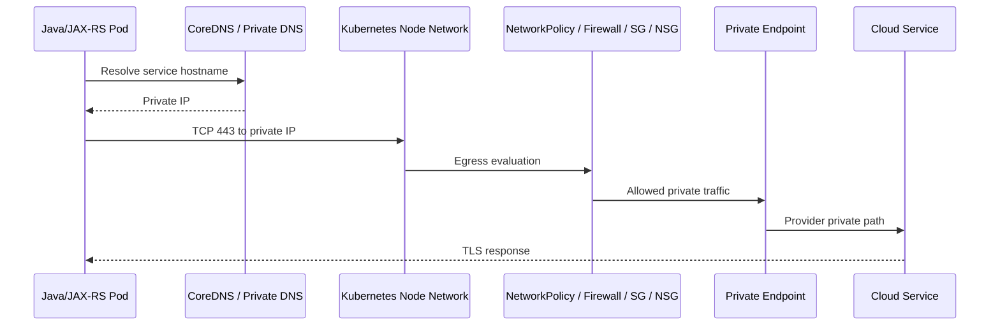

# Part 032 — Private Endpoint and Private Connectivity

Part sebelumnya membahas cara pod memanggil AWS/Azure service dari perspektif SDK, credential, IAM/RBAC, DNS, TLS, retry, timeout, dan observability.

Part ini memperdalam satu area yang sering menjadi akar incident production: private connectivity.

Private endpoint membuat cloud service bisa diakses melalui private network path, bukan public internet path. Namun private endpoint bukan magic. Ia menambah dependency pada DNS, route, firewall, SG/NSG, endpoint policy, TLS hostname, dan hybrid network.

Kesalahan private connectivity sering terlihat seperti masalah aplikasi:

- request timeout,
- DNS resolve ke IP salah,
- TLS handshake gagal,
- `403` karena endpoint policy,
- service works in dev but fails in prod,
- pod bisa resolve DNS tapi tidak bisa connect,
- connection hanya gagal dari namespace/node tertentu,
- traffic diam-diam keluar lewat public endpoint,
- failover environment tidak bisa akses dependency.

> CSG note: jangan mengasumsikan CSG memakai AWS VPC Endpoint, AWS PrivateLink, Azure Private Endpoint, Private DNS Zone, Route 53 private hosted zone, VPN, Direct Connect, ExpressRoute, firewall, proxy, service mesh egress, NAT gateway, hub-spoke network, atau hybrid DNS pattern tertentu. Semua detail harus diverifikasi di Terraform/IaC, cloud console, Kubernetes manifest, NetworkPolicy, DNS config, route table, SG/NSG/firewall rules, observability, runbook, dan diskusi dengan platform/SRE/network/security team.

---

## 1. Core Concept

Private connectivity adalah upaya membuat traffic ke service tertentu berjalan di private network, dengan kontrol security dan routing yang lebih ketat.

Tetapi keberhasilan private connectivity membutuhkan empat hal sekaligus:

```text
DNS resolves to the right private destination
Route knows how to reach that destination
Security controls allow the traffic
TLS/identity/policy accepts the request
```

Kalau salah satu gagal, aplikasi gagal connect.



Mental model penting:

```text
Private endpoint is not only networking.
It is DNS + routing + security policy + service authorization + TLS correctness.
```

---

## 2. Why Private Endpoint Exists

Private endpoint/private connectivity biasanya dipakai untuk:

- menghindari public internet exposure,
- memenuhi compliance/security requirement,
- membatasi data exfiltration path,
- mengurangi dependency pada public egress,
- mengontrol source network,
- menghindari public IP allowlist yang rapuh,
- mengakses service cloud dari private subnet,
- menghubungkan cloud dan on-prem system,
- menjaga traffic tetap dalam provider backbone,
- mempermudah audit network path.

Namun private endpoint juga menambah complexity:

- DNS split-horizon,
- route propagation,
- endpoint policy,
- SG/NSG/firewall rule,
- cross-zone/cross-region behavior,
- per-environment configuration,
- endpoint cost,
- troubleshooting lebih sulit.

---

## 3. Public vs Private Endpoint

### Public Endpoint Pattern

```text
Pod -> Node -> NAT Gateway / Internet Egress -> Public Cloud Service Endpoint
```

Kelebihan:

- sederhana,
- default cloud SDK biasanya langsung bekerja,
- tidak perlu private DNS setup khusus.

Kekurangan:

- bergantung pada public endpoint,
- membutuhkan NAT/proxy/firewall,
- egress cost,
- source IP allowlist,
- exposure/security concern,
- bisa dilarang oleh compliance.

### Private Endpoint Pattern

```text
Pod -> Node -> Private Network -> Private Endpoint -> Cloud Service
```

Kelebihan:

- private path,
- lebih cocok untuk sensitive workloads,
- bisa mengurangi public exposure,
- network control lebih granular,
- bisa membatasi akses via resource policy.

Kekurangan:

- DNS harus benar,
- route harus benar,
- SG/NSG/firewall harus benar,
- endpoint policy bisa membingungkan,
- operational complexity lebih tinggi,
- cost endpoint bisa signifikan.

---

## 4. AWS VPC Endpoint

AWS VPC Endpoint memungkinkan workload di VPC mengakses AWS service tanpa harus keluar lewat public internet.

Ada dua konsep besar:

### 4.1 Gateway Endpoint

Umumnya untuk service tertentu seperti S3 dan DynamoDB.

Karakteristik:

- ditambahkan ke route table,
- tidak memakai ENI per endpoint seperti interface endpoint,
- tidak menggunakan Security Group di endpoint,
- bisa punya endpoint policy,
- traffic diarahkan melalui route table.

Failure mode:

- route table subnet node tidak mengarah ke endpoint,
- endpoint policy denied,
- bucket policy mensyaratkan source VPC endpoint tertentu,
- workload berjalan di subnet yang route table-nya tidak punya endpoint route,
- DNS/region mismatch.

### 4.2 Interface Endpoint

Interface endpoint memakai AWS PrivateLink dan menyediakan ENI dengan private IP di subnet.

Karakteristik:

- punya private IP,
- punya Security Group,
- biasanya bisa mengaktifkan private DNS,
- bisa punya endpoint policy,
- digunakan untuk banyak AWS service,
- biaya per jam dan data processing.

Flow umum:

```text
Pod -> VPC CNI Pod IP / Node Network -> Interface Endpoint ENI -> AWS Service
```

Failure mode:

- private DNS tidak aktif,
- private hosted zone tidak resolve dari cluster,
- endpoint SG tidak allow source,
- subnet/AZ endpoint tidak sesuai,
- NACL/route issue,
- endpoint policy denied,
- resource policy mensyaratkan endpoint berbeda,
- aplikasi memakai endpoint override yang salah.

---

## 5. AWS PrivateLink

PrivateLink memungkinkan service provider mengekspos service via endpoint service, lalu consumer membuat interface endpoint di VPC mereka.

Ini sering dipakai untuk:

- SaaS private access,
- cross-account internal platform service,
- shared service VPC,
- partner integration,
- private API exposure.

PrivateLink concern:

- provider endpoint service acceptance,
- consumer endpoint approval,
- NLB target health,
- private DNS name association,
- cross-account permission,
- endpoint SG,
- target service TLS/SNI,
- source IP behavior,
- region boundary.

PrivateLink bukan pengganti authentication. Ia hanya private connectivity path.

Aplikasi tetap perlu:

- API auth,
- mTLS atau token jika diperlukan,
- request authorization,
- timeout/retry,
- observability.

---

## 6. Azure Private Endpoint

Azure Private Endpoint membuat private IP di VNet untuk mengakses Azure PaaS service atau private link service.

Common components:

- private endpoint NIC,
- subnet,
- Private DNS Zone,
- DNS zone link ke VNet,
- target resource,
- private endpoint connection approval,
- NSG/UDR/firewall depending on topology,
- public network access setting.

Flow umum:

```text
Pod -> AKS Node/VNet -> Private Endpoint IP -> Azure Service
```

Private endpoint DNS biasanya memakai domain `privatelink.*` di belakang hostname public service.

Aplikasi tetap connect ke hostname service normal. DNS yang mengarahkan hostname tersebut ke private IP.

Rule penting:

```text
Do not change application code to call private IP directly.
Fix DNS so the normal service hostname resolves privately.
```

Failure mode:

- Private DNS Zone belum linked ke VNet AKS,
- A record tidak ada atau salah,
- public network access disabled tetapi DNS masih resolve public,
- private endpoint belum approved,
- NSG/UDR/firewall memblokir,
- wrong subresource,
- wrong tenant/subscription/resource group,
- SDK endpoint override salah,
- TLS hostname mismatch karena connect ke IP.

---

## 7. Azure Service Endpoint Awareness

Azure Service Endpoint berbeda dengan Private Endpoint.

Service Endpoint memperluas VNet identity ke Azure service public endpoint dan memungkinkan resource firewall mengizinkan subnet tertentu.

Private Endpoint menyediakan private IP untuk resource.

Perbandingan sederhana:

| Aspect | Service Endpoint | Private Endpoint |
|---|---|---|
| Destination | public service endpoint | private IP in VNet |
| DNS behavior | umumnya tetap public endpoint | private DNS sangat penting |
| Exposure | service masih public endpoint-based | resource bisa disable public access |
| Use case | subnet-based access control | private access / tighter isolation |
| Complexity | lebih sederhana | lebih kompleks |

Senior engineer tidak perlu menghafal semua detail provider, tetapi harus tahu bahwa keduanya bukan konsep yang sama.

---

## 8. Private DNS and Split-Horizon DNS

Private endpoint sangat bergantung pada DNS.

Split-horizon DNS berarti hostname yang sama bisa resolve berbeda tergantung dari mana query dilakukan.

Contoh:

```text
From laptop internet: service.example.cloud -> public IP
From pod in cluster:  service.example.cloud -> private IP
From on-prem DNS:     service.example.cloud -> private IP or forwarded result
```

Failure mode DNS:

- pod resolve public IP padahal harus private,
- pod resolve private IP tetapi on-prem client resolve public IP,
- CoreDNS tidak forward ke corporate DNS,
- corporate DNS tidak forward ke cloud private DNS,
- private hosted zone tidak associated ke VPC/VNet,
- stale DNS cache,
- multiple private zones conflict,
- wrong region zone,
- search domain/ndots menambah latency.

Debugging dari pod:

```bash
kubectl exec -n <namespace> <pod> -- nslookup <service-hostname>
kubectl exec -n <namespace> <pod> -- getent hosts <service-hostname>
kubectl exec -n <namespace> <pod> -- cat /etc/resolv.conf
```

Debugging dari node/debug pod mungkin diperlukan bila image app minimal.

---

## 9. Route Tables, UDR, and Network Path

DNS hanya memberi alamat. Route menentukan jalur.

### AWS Route Concern

Cek:

- subnet route table,
- NAT gateway route,
- gateway endpoint route,
- peering/TGW route,
- Direct Connect/VPN propagated route,
- NACL,
- Security Group,
- VPC endpoint subnet/AZ.

### Azure Route Concern

Cek:

- system route,
- user-defined route,
- Azure Firewall route,
- VNet peering route,
- ExpressRoute/VPN route,
- NSG,
- Private Endpoint subnet,
- AKS subnet,
- hub-spoke topology.

Route issue sering muncul sebagai timeout, bukan immediate error.

---

## 10. Security Group, NSG, Firewall, and Policy

Private endpoint path tetap melewati security controls.

Layer yang mungkin memblokir:

- Kubernetes NetworkPolicy,
- service mesh egress policy,
- node firewall,
- AWS Security Group,
- AWS NACL,
- Azure NSG,
- Azure Firewall,
- corporate firewall,
- proxy allowlist,
- endpoint policy,
- resource firewall,
- resource policy,
- IAM/RBAC.

Senior engineer harus berhati-hati dengan kalimat:

```text
DNS sudah benar, jadi network pasti benar.
```

DNS benar hanya berarti nama menjadi IP. Connect masih bisa ditolak atau timeout.

---

## 11. Pod-to-Private-Endpoint Flow

Flow generik:



Hal yang harus benar:

- pod memakai DNS policy yang sesuai,
- CoreDNS bisa resolve private zone,
- private IP reachable dari node/pod network,
- egress policy allow,
- SG/NSG/firewall allow,
- TLS hostname valid,
- cloud identity/authorization valid.

---

## 12. EKS-Specific Private Connectivity Concern

Pada EKS, yang perlu diverifikasi:

- VPC CNI behavior: pod IP berasal dari VPC atau tidak,
- subnet tempat node berjalan,
- route table subnet,
- VPC endpoint type,
- private DNS enabled,
- Route 53 private hosted zone association,
- endpoint Security Group,
- endpoint policy,
- node Security Group,
- pod security group jika dipakai,
- NACL,
- NAT gateway fallback,
- cross-AZ routing,
- IRSA permission,
- CloudTrail denied events,
- VPC Flow Logs.

Common EKS failure:

```text
Pod resolves AWS service to public IP
  -> private DNS disabled or wrong DNS path
  -> traffic exits via NAT
  -> resource policy expects VPC endpoint
  -> AccessDenied or timeout
```

Atau:

```text
Pod resolves private IP
  -> endpoint SG does not allow pod/node CIDR
  -> connection timeout
```

---

## 13. AKS-Specific Private Connectivity Concern

Pada AKS, yang perlu diverifikasi:

- Azure CNI atau kubenet,
- pod IP routability,
- AKS subnet,
- Private Endpoint subnet,
- Private DNS Zone link ke VNet,
- VNet peering DNS behavior,
- UDR ke firewall,
- NSG rule,
- Azure Firewall application/network rule,
- public network access disabled/enabled,
- private endpoint approval state,
- Workload Identity/Managed Identity permission,
- Azure Monitor/NSG flow logs.

Common AKS failure:

```text
Public network access disabled on Key Vault
  -> pod DNS still resolves public IP
  -> request fails although identity is correct
```

Atau:

```text
Private DNS Zone linked to hub VNet only
  -> AKS spoke VNet cannot resolve private endpoint
  -> UnknownHost or public resolution
```

---

## 14. On-Prem-to-Cloud Private Connectivity

Hybrid environment sering membutuhkan on-prem system memanggil service di cloud atau cloud workload memanggil on-prem API.

Connectivity options:

- VPN,
- AWS Direct Connect,
- Azure ExpressRoute,
- transit gateway / hub-spoke,
- firewall appliance,
- proxy,
- private DNS forwarding,
- private CA trust.

Concern utama:

- route propagation,
- asymmetric routing,
- firewall statefulness,
- DNS forwarding,
- overlapping CIDR,
- MTU/fragmentation,
- TLS trust,
- latency,
- packet inspection,
- proxy bypass,
- failover path.

Hybrid failure sering intermittent karena routing path dan firewall state berbeda antar direction.

---

## 15. Cloud-to-On-Prem API Call

Flow umum:

```text
Pod in Kubernetes
  -> cloud VPC/VNet route
  -> VPN/Direct Connect/ExpressRoute
  -> enterprise firewall
  -> on-prem load balancer/API gateway
  -> internal service
```

Failure mode:

- route back missing,
- firewall blocks return traffic,
- DNS resolves internal hostname only from corporate network, not cluster,
- TLS certificate signed by internal CA not trusted by container,
- proxy required but not configured,
- MTU issue causing large response timeout,
- on-prem allowlist missing pod/node CIDR,
- source NAT changes source IP unexpectedly.

---

## 16. On-Prem-to-Cloud API Call

Flow umum:

```text
On-prem client
  -> corporate DNS
  -> VPN/Direct Connect/ExpressRoute
  -> cloud private endpoint/load balancer
  -> Kubernetes ingress/service/pod
```

Failure mode:

- DNS resolves public endpoint instead of private,
- firewall does not allow cloud CIDR,
- cloud load balancer internal only but route missing,
- certificate hostname mismatch,
- ingress only accepts specific host header,
- source IP not preserved as expected,
- WAF/proxy strips headers,
- MTU/latency breaks long requests.

---

## 17. TLS Trust in Private Connectivity

Private network tidak berarti boleh disable TLS verification.

Common TLS issues:

- application connects to private IP directly,
- certificate CN/SAN does not match hostname,
- internal CA not in JDK truststore,
- corporate TLS inspection CA missing,
- mTLS client certificate missing,
- SNI not sent,
- legacy TLS disabled,
- clock skew.

Rule:

```text
Use private DNS to map official hostname to private IP.
Do not bypass hostname validation by using private IP.
```

Debug command:

```bash
kubectl exec -n <namespace> <pod> -- openssl s_client -connect <host>:443 -servername <host> -showcerts
```

Untuk Java container:

- cek CA bundle OS image,
- cek JDK truststore,
- cek custom truststore mount,
- cek `JAVA_TOOL_OPTIONS`,
- cek distroless CA packaging,
- cek certificate rotation policy.

---

## 18. NetworkPolicy with Private Endpoint

NetworkPolicy bisa membatasi pod hanya boleh egress ke private endpoint tertentu.

Namun ada trade-off:

- IP private endpoint bisa berubah saat recreate,
- banyak cloud service punya beberapa endpoint/IP,
- CNI support berbeda,
- DNS-based egress policy tidak tersedia di NetworkPolicy standard,
- service mesh/egress gateway mungkin lebih cocok untuk hostname-based control.

Pattern yang sering dipakai:

```text
Default deny egress
Allow DNS to CoreDNS
Allow egress to private endpoint CIDR/IP
Allow egress to required internal services
Deny public internet by default
```

Tetapi jangan hanya mengandalkan NetworkPolicy. Cloud resource policy dan endpoint policy juga penting.

---

## 19. Endpoint Policy and Resource Policy

Private endpoint bisa punya policy yang membatasi action/resource/principal.

Contoh policy layer:

```text
Pod identity permission allows action
Resource policy allows principal
Endpoint policy allows action/resource
Network path allows TCP
```

Semua harus allow.

Failure umum:

- IAM role punya permission, tetapi endpoint policy deny,
- endpoint policy allow, tetapi bucket/key/resource policy deny,
- resource policy mensyaratkan source endpoint tertentu,
- principal ARN tidak sesuai karena role berbeda antar namespace,
- condition key region/VPC/VNet tidak cocok.

Jangan menyelesaikan masalah ini dengan wildcard permission tanpa root cause.

---

## 20. Observability for Private Connectivity

Sinyal yang berguna:

- application dependency latency,
- error code/status code,
- DNS resolution result,
- CoreDNS metrics,
- Kubernetes events,
- NetworkPolicy drops jika tersedia,
- VPC Flow Logs / NSG Flow Logs,
- firewall logs,
- proxy logs,
- private endpoint metrics,
- cloud audit logs,
- load balancer metrics,
- TLS error logs,
- cloud service request ID,
- correlation ID.

Tanpa flow logs/firewall logs, timeout private endpoint sering sangat sulit dibedakan dari aplikasi hang.

---

## 21. Debugging Private Endpoint Issues

Gunakan workflow berlapis.

### Step 1 — Identify Expected Path

Tentukan expectation:

```text
Should this call go public, NAT, proxy, VPC endpoint, PrivateLink, Azure Private Endpoint, VPN, Direct Connect, or ExpressRoute?
```

Kalau expectation tidak jelas, debugging akan random.

### Step 2 — Check DNS from Pod

```bash
kubectl exec -n <namespace> <pod> -- nslookup <hostname>
kubectl exec -n <namespace> <pod> -- getent hosts <hostname>
```

Validasi apakah IP public/private sesuai.

### Step 3 — Check TCP Reachability

```bash
kubectl exec -n <namespace> <pod> -- sh -c 'timeout 5 sh -c "</dev/tcp/<hostname>/443"'
```

Jika image tidak punya shell/tooling, gunakan approved debug pod atau ephemeral container.

### Step 4 — Check TLS

```bash
kubectl exec -n <namespace> <pod> -- openssl s_client -connect <hostname>:443 -servername <hostname>
```

Cek certificate chain, hostname, SNI, dan trust.

### Step 5 — Check Kubernetes Policy

```bash
kubectl get networkpolicy -n <namespace>
kubectl describe networkpolicy -n <namespace> <policy>
```

Cek apakah DNS dan endpoint egress diizinkan.

### Step 6 — Check Cloud Network Controls

AWS:

- VPC endpoint status,
- endpoint SG,
- route table,
- NACL,
- private DNS enabled,
- Route 53 private hosted zone,
- VPC Flow Logs.

Azure:

- private endpoint status,
- private DNS zone link,
- A record,
- NSG,
- UDR,
- Azure Firewall,
- NSG flow logs.

### Step 7 — Check Authorization

Kalau TCP/TLS berhasil tetapi API menolak:

- IAM/RBAC,
- endpoint policy,
- resource policy,
- KMS/key policy,
- cloud audit denied event.

---

## 22. Common Failure Modes

| Symptom | Likely Cause | Diagnostic Direction |
|---|---|---|
| Resolves public IP | private DNS not configured | DNS zone/association/link |
| NXDOMAIN | DNS zone missing | CoreDNS/upstream/private zone |
| TCP timeout | route/firewall/SG/NSG | flow logs/firewall logs |
| TLS hostname mismatch | connecting to IP/wrong hostname | SNI/certificate/DNS |
| 403 with private endpoint | endpoint/resource/IAM policy | cloud audit/policy |
| Works from node, fails from pod | NetworkPolicy/CNI/pod route | pod egress/debug pod |
| Works in one namespace only | policy/service account/env config | namespace diff |
| Works in dev, fails in prod | DNS/firewall/policy drift | environment diff |
| Random timeout | cross-zone route/firewall/NAT/proxy | flow logs/latency metrics |
| Slow first call | DNS/TLS/connection warmup | client metrics |

---

## 23. Performance and Cost Concerns

Private connectivity has cost and performance trade-offs.

### Performance Concern

- extra network hop through firewall/proxy,
- cross-zone/cross-region endpoint access,
- DNS latency,
- TLS handshake overhead,
- connection pool reuse,
- MTU issue in VPN/hybrid path,
- bandwidth limit on endpoint/firewall,
- private endpoint cold path during failover.

### Cost Concern

- AWS Interface Endpoint hourly cost,
- PrivateLink data processing,
- Azure Private Endpoint cost,
- Private DNS cost,
- cross-AZ data transfer,
- NAT gateway avoided or still accidentally used,
- firewall data processing cost,
- duplicated endpoints per environment/region,
- excessive retry causing data processing cost.

Cost-aware design does not mean avoiding private endpoint. It means knowing what traffic uses it and why.

---

## 24. Correctness Concerns

Private connectivity errors can create correctness risk:

- service accidentally calls public endpoint in one environment,
- prod points to staging private endpoint,
- DNS split brain sends traffic to wrong region,
- failover path uses different authorization policy,
- timeout causes duplicate write retry,
- partial outage affects only certain nodes/zones,
- batch job writes to wrong storage account/bucket,
- on-prem integration silently queues or drops events.

Design needs explicit environment binding:

- endpoint naming,
- config validation,
- region validation,
- tenant/account validation,
- startup guardrails,
- observable dependency identity.

---

## 25. Security and Privacy Concerns

Private endpoint improves network posture, but does not replace security controls.

Still required:

- workload identity,
- least privilege,
- TLS verification,
- resource policy,
- endpoint policy,
- NetworkPolicy,
- firewall allowlist,
- audit logs,
- no secret leakage,
- no PII in logs,
- data classification,
- certificate rotation,
- incident traceability.

Anti-pattern:

```text
It is private network, so auth can be weak.
```

Private network reduces exposure. It does not prove caller authorization.

---

## 26. PR Review Checklist

Saat mereview PR yang menambah private endpoint/private connectivity dependency, tanyakan:

- Dependency apa yang dipanggil?
- Apakah endpoint harus public atau private?
- Hostname apa yang digunakan aplikasi?
- Dari pod, hostname resolve ke IP apa?
- Private DNS zone/hosted zone sudah terhubung ke VPC/VNet yang benar?
- Route dari pod/node ke endpoint benar?
- SG/NSG/firewall allow?
- NetworkPolicy egress allow?
- Endpoint policy/resource policy/IAM/RBAC allow?
- TLS hostname valid?
- Apakah ada proxy atau egress gateway?
- Apakah ada fallback ke public endpoint? Apakah itu diizinkan?
- Timeout dan retry sesuai latency path?
- Observability cukup untuk membedakan DNS/network/TLS/auth failure?
- Bagaimana behavior di dev/staging/prod?
- Bagaimana failover/DR behavior?
- Apakah ada runbook?

---

## 27. Internal Verification Checklist

Verifikasi di internal CSG/team:

- Apakah workload memakai private endpoint, public endpoint, NAT, proxy, firewall, atau hybrid route.
- Cloud provider: AWS, Azure, on-prem, hybrid, atau multi-cloud.
- AWS VPC Endpoint: gateway/interface, private DNS, endpoint policy, endpoint SG.
- AWS PrivateLink: provider/consumer account, endpoint service, approval, NLB health.
- Azure Private Endpoint: target resource, subresource, approval state, private IP.
- Azure Private DNS Zone: zone name, A record, VNet link.
- Route 53 private hosted zone: association, records, resolver forwarding.
- CoreDNS forwarding behavior.
- Route table / UDR.
- NAT gateway fallback.
- Security Group / NSG / firewall rules.
- NetworkPolicy egress.
- Service mesh egress policy jika ada.
- Proxy environment variables.
- TLS CA/truststore.
- Cloud IAM/RBAC and resource policy.
- VPC Flow Logs / NSG Flow Logs / firewall logs.
- DNS dashboard / CoreDNS metrics.
- Incident history terkait private endpoint.
- Runbook untuk timeout, DNS failure, TLS failure, and access denied.

---

## 28. Senior Engineer Mental Model

Private endpoint debugging harus dimulai dari pertanyaan yang sangat konkret:

```text
What exact hostname is the app calling?
What IP does that hostname resolve to from inside the pod?
Is that IP expected to be private?
Is there a route from pod/node to that IP?
Do all security controls allow TCP 443?
Does TLS validate the hostname?
Does cloud identity authorize the action?
Is the endpoint/resource policy also allowing it?
```

Private connectivity yang sehat bukan hanya “bisa ping”. Bahkan ping sering tidak relevan.

Yang perlu dibuktikan:

```text
The real application hostname resolves correctly,
the real protocol/port connects,
the real TLS handshake succeeds,
the real identity is authorized,
and the real operation is observable.
```

Itulah standar senior engineer untuk private endpoint dan hybrid connectivity di production Kubernetes.
