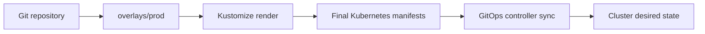

# Part 035 — Kustomize

Part sebelumnya membahas Helm sebagai templating dan packaging layer untuk Kubernetes.

Part ini membahas Kustomize sebagai cara menyusun manifest Kubernetes dengan pendekatan **base + overlay**. Untuk enterprise Java/JAX-RS system, Kustomize sering dipakai untuk mengelola perbedaan antar environment seperti dev, test, staging, production, EKS, AKS, on-prem, atau region tertentu tanpa mengubah base manifest.

Kustomize terlihat lebih sederhana daripada Helm karena tidak memakai template language yang berat. Tetapi kesederhanaan itu bisa menipu. Overlay yang tidak dikontrol dapat berubah menjadi sprawl: patch tersebar, behavior environment tidak jelas, dan hasil akhir manifest sulit diprediksi.

> CSG note: jangan mengasumsikan CSG memakai Kustomize, struktur base/overlay tertentu, folder environment tertentu, Argo CD integration tertentu, atau naming convention tertentu. Semua detail harus diverifikasi di repository deployment, GitOps repo, CI/CD pipeline, manifest rendered output, dan diskusi dengan platform/SRE/backend team.

---

## 1. Core Concept

Kustomize adalah tool untuk membangun manifest Kubernetes dari kumpulan resource dan perubahan deklaratif.

Mental model paling sederhana:

```text
base manifests + environment overlays + patches + generators + image overrides
= final Kubernetes manifests
```

Kustomize tidak melakukan templating seperti Helm.

Helm biasanya berpikir:

```text
template + values -> rendered manifest
```

Kustomize berpikir:

```text
valid Kubernetes YAML + patch/transform -> final valid Kubernetes YAML
```

Artinya base sebaiknya tetap valid Kubernetes manifest.

---

## 2. Why Kustomize Exists

Masalah umum dalam deployment enterprise:

```text
same application
same baseline deployment model
different environment-specific details
```

Contoh perbedaan antar environment:

- replica count,
- image tag atau digest,
- namespace,
- resource request/limit,
- ingress host,
- ConfigMap value,
- Secret reference,
- HPA threshold,
- NetworkPolicy egress destination,
- cloud-specific annotation,
- storage class,
- node selector,
- topology spread,
- service account annotation untuk IRSA atau Azure Workload Identity.

Tanpa Kustomize, tim sering melakukan copy-paste manifest:

```text
k8s/dev/deployment.yaml
k8s/staging/deployment.yaml
k8s/prod/deployment.yaml
```

Masalahnya:

- perubahan base harus diulang banyak tempat,
- environment drift sulit terlihat,
- bug fix deployment bisa lupa diterapkan ke prod,
- review PR sulit karena terlalu banyak YAML duplikat,
- security standard tidak konsisten.

Kustomize mencoba menyelesaikan ini dengan base yang reusable dan overlay yang eksplisit.

---

## 3. Typical Repository Structure

Struktur umum:

```text
k8s/
  base/
    kustomization.yaml
    deployment.yaml
    service.yaml
    configmap.yaml
    serviceaccount.yaml
    hpa.yaml
    pdb.yaml
  overlays/
    dev/
      kustomization.yaml
      patch-resources.yaml
      patch-ingress.yaml
    staging/
      kustomization.yaml
      patch-resources.yaml
      patch-ingress.yaml
    prod/
      kustomization.yaml
      patch-resources.yaml
      patch-ingress.yaml
      patch-security.yaml
```

Base mendefinisikan bentuk canonical workload.

Overlay mendefinisikan perbedaan environment.

Prinsip review:

```text
The base defines what the service is.
The overlay defines where and how it runs.
```

Jika overlay mulai mengubah terlalu banyak behavior inti, kemungkinan base salah desain atau environment model terlalu bercabang.

---

## 4. Base

Base berisi resource utama yang berlaku lintas environment.

Contoh `base/kustomization.yaml`:

```yaml
apiVersion: kustomize.config.k8s.io/v1beta1
kind: Kustomization
resources:
  - deployment.yaml
  - service.yaml
  - serviceaccount.yaml
  - pdb.yaml
```

Contoh base Deployment:

```yaml
apiVersion: apps/v1
kind: Deployment
metadata:
  name: quote-order-service
  labels:
    app.kubernetes.io/name: quote-order-service
    app.kubernetes.io/component: api
spec:
  replicas: 2
  selector:
    matchLabels:
      app.kubernetes.io/name: quote-order-service
  template:
    metadata:
      labels:
        app.kubernetes.io/name: quote-order-service
        app.kubernetes.io/component: api
    spec:
      serviceAccountName: quote-order-service
      containers:
        - name: app
          image: quote-order-service:local
          ports:
            - name: http
              containerPort: 8080
          readinessProbe:
            httpGet:
              path: /health/ready
              port: http
          livenessProbe:
            httpGet:
              path: /health/live
              port: http
```

Base harus cukup lengkap untuk menunjukkan intent workload.

Base tidak boleh terlalu environment-specific.

---

## 5. Overlay

Overlay mereferensikan base dan menambahkan perubahan.

Contoh `overlays/prod/kustomization.yaml`:

```yaml
apiVersion: kustomize.config.k8s.io/v1beta1
kind: Kustomization
namespace: quote-order-prod
resources:
  - ../../base
patches:
  - path: patch-resources.yaml
  - path: patch-replicas.yaml
images:
  - name: quote-order-service
    newName: registry.example.com/quote-order/quote-order-service
    digest: sha256:aaaaaaaaaaaaaaaaaaaaaaaaaaaaaaaaaaaaaaaaaaaaaaaaaaaaaaaaaaaaaaaa
```

Overlay production sebaiknya eksplisit untuk hal yang memengaruhi risk:

- image digest,
- replica count,
- resource request/limit,
- HPA,
- PDB,
- NetworkPolicy,
- ingress host,
- service account identity,
- production secret reference,
- production observability label.

---

## 6. Patch Types

Kustomize mendukung beberapa cara patch.

### Strategic Merge Patch

Contoh:

```yaml
apiVersion: apps/v1
kind: Deployment
metadata:
  name: quote-order-service
spec:
  replicas: 4
  template:
    spec:
      containers:
        - name: app
          resources:
            requests:
              cpu: "500m"
              memory: "1Gi"
            limits:
              cpu: "1"
              memory: "2Gi"
```

Cocok untuk patch Kubernetes native object.

Risiko:

- merge behavior list bisa membingungkan,
- field tidak ada bisa silently ditambahkan,
- patch besar membuat overlay seperti manifest copy-paste terselubung.

### JSON6902 Patch

Contoh:

```yaml
- op: replace
  path: /spec/replicas
  value: 4
- op: add
  path: /spec/template/metadata/annotations/prometheus.io~1scrape
  value: "true"
```

Cocok untuk perubahan presisi.

Risiko:

- path mudah rusak jika base berubah,
- kurang mudah dibaca untuk reviewer non-platform,
- error bisa muncul saat render, bukan saat menulis.

Rule praktis:

```text
Small precise field change -> JSON6902 can be good.
Readable Kubernetes-shaped override -> strategic merge can be better.
Huge patch -> probably wrong abstraction.
```

---

## 7. Image Override

Kustomize dapat mengganti image.

Contoh:

```yaml
images:
  - name: quote-order-service
    newName: registry.example.com/quote-order/quote-order-service
    newTag: "2.8.4"
```

Untuk production, digest lebih defensible:

```yaml
images:
  - name: quote-order-service
    newName: registry.example.com/quote-order/quote-order-service
    digest: sha256:aaaaaaaaaaaaaaaaaaaaaaaaaaaaaaaaaaaaaaaaaaaaaaaaaaaaaaaaaaaaaaaa
```

Tag mudah berubah jika registry mengizinkan mutable tag.

Digest mengikat manifest ke artifact immutable.

Review harus memastikan:

```text
commit -> image digest -> rendered manifest -> running pod
```

traceable.

---

## 8. ConfigMap Generator

Kustomize dapat membuat ConfigMap dari file atau literal.

Contoh:

```yaml
configMapGenerator:
  - name: quote-order-config
    literals:
      - LOG_LEVEL=INFO
      - FEATURE_X_ENABLED=false
```

Secara default, Kustomize menambahkan hash ke nama ConfigMap:

```text
quote-order-config-7m5mtf9h7k
```

Ini berguna karena perubahan config menghasilkan nama ConfigMap baru dan memicu rollout jika direferensikan oleh pod template.

Risiko:

- aplikasi tidak siap restart saat config berubah,
- perubahan config terlihat kecil tapi memicu full rollout,
- generator behavior tidak dipahami oleh reviewer,
- disable name suffix hash dapat menyebabkan rollout tidak terjadi.

Jika `disableNameSuffixHash: true` dipakai, harus ada strategi lain untuk restart-on-config-change.

---

## 9. Secret Generator Risk

Kustomize mendukung `secretGenerator`, tetapi ini perlu hati-hati.

Contoh:

```yaml
secretGenerator:
  - name: quote-order-secret
    literals:
      - DB_PASSWORD=do-not-commit-this
```

Untuk enterprise production, menyimpan secret literal di Git hampir selalu salah.

Alternatif yang lebih aman:

- External Secrets Operator,
- Sealed Secrets,
- SOPS,
- cloud secret manager integration,
- Key Vault/Secrets Manager/SSM source of truth,
- secret reference saja di manifest.

Review rule:

```text
Kustomize may define secret object shape.
It should not casually store raw production secret values.
```

---

## 10. Name Prefix, Name Suffix, Namespace

Kustomize bisa menambahkan prefix/suffix dan namespace.

Contoh:

```yaml
namePrefix: prod-
namespace: quote-order-prod
```

Masalah yang perlu diwaspadai:

- Service name berubah sehingga DNS berubah,
- RoleBinding subject berubah tidak sesuai,
- NetworkPolicy selector tidak match,
- external dependency mengandalkan nama lama,
- dashboard/alert query berdasarkan name lama rusak.

Prefix/suffix terlihat ringan, tetapi bisa mengubah identity object.

Untuk service yang dipakai downstream, perubahan nama harus dianggap breaking change.

---

## 11. Common Labels and Annotations

Kustomize bisa menambahkan label/annotation global.

Contoh:

```yaml
commonLabels:
  app.kubernetes.io/part-of: quote-order
  app.kubernetes.io/managed-by: kustomize

commonAnnotations:
  platform.example.com/owner: quote-order-team
```

Hati-hati dengan label selector.

Jika label yang dipakai selector berubah secara global, Service atau Deployment selector bisa terdampak.

Prinsip:

```text
Labels used for selection are part of routing correctness.
Labels used for ownership/observability are metadata.
Do not mix them casually.
```

---

## 12. Kustomize Components

Component dipakai untuk reusable optional behavior.

Contoh:

```text
components/
  otel-sidecar/
  network-policy-default-deny/
  pod-security-restricted/
```

Overlay bisa mengaktifkan component tertentu.

Kelebihan:

- reusable cross-cutting config,
- security baseline bisa distandardisasi,
- observability sidecar bisa dikontrol.

Risiko:

- component dependency tidak jelas,
- terlalu banyak indirection,
- reviewer tidak sadar final manifest berubah banyak.

Rule:

```text
Every component must have a clear purpose and rendered manifest must be reviewed.
```

---

## 13. Kustomize vs Helm

Kustomize dan Helm menyelesaikan masalah yang berbeda.

| Aspect | Kustomize | Helm |
|---|---|---|
| Model | Patch/transform valid YAML | Template + values |
| Abstraction | Base/overlay | Chart/release |
| Complexity | Lower syntax complexity | Higher templating power |
| Reusability | Good for environment overlays | Good for packaged apps |
| Release history | Not built-in | Built-in Helm release |
| GitOps fit | Very strong | Very common too |
| Risk | Overlay sprawl | Template opacity |

Kustomize cocok saat:

- base manifest sudah jelas,
- perbedaan environment berupa patch,
- tim ingin final YAML mudah dipahami,
- GitOps controller merender overlay.

Helm cocok saat:

- butuh packaging reusable,
- banyak parameterisasi,
- ada dependency chart,
- ingin release abstraction.

Banyak organisasi memakai keduanya:

```text
Helm chart rendered/managed by GitOps
or
Kustomize overlays wrapping Helm chart
```

Ini harus diverifikasi, bukan diasumsikan.

---

## 14. GitOps with Kustomize

Dalam GitOps, Argo CD atau Flux dapat menunjuk ke overlay tertentu.

Contoh mental model:



Review GitOps harus melihat:

- path overlay yang dipakai,
- target namespace,
- image update mechanism,
- sync policy,
- prune behavior,
- diff behavior,
- health check,
- secret integration,
- environment promotion path.

Kustomize overlay yang benar di Git belum tentu benar di cluster jika GitOps controller memakai path atau revision yang berbeda.

---

## 15. Java/JAX-RS Service Example

Base untuk Java/JAX-RS service sebaiknya memuat common workload behavior:

- container port,
- readiness/liveness/startup probe,
- graceful termination,
- resource placeholder,
- ConfigMap/Secret reference,
- ServiceAccount,
- labels untuk observability,
- PDB bila service production critical,
- HPA bila scaling policy umum.

Overlay dev bisa mengubah:

- replica 1,
- resource kecil,
- debug log,
- non-production ingress host,
- mock/stub endpoint.

Overlay prod bisa mengubah:

- replica minimal 2 atau lebih,
- request/limit hasil profiling,
- strict NetworkPolicy,
- production secret reference,
- production identity annotation,
- production ingress host,
- PDB,
- HPA,
- node placement.

Yang tidak boleh terjadi:

```text
prod overlay accidentally disables readiness probe
prod overlay changes Service selector
prod overlay removes securityContext
prod overlay injects raw secret
prod overlay uses mutable latest image tag
```

---

## 16. Environment Overlay Drift

Overlay drift terjadi saat environment tidak lagi berbeda secara sengaja, tetapi berbeda karena sejarah copy-paste.

Signal overlay drift:

- patch prod sangat besar,
- staging tidak mirip prod,
- dev punya securityContext tapi prod tidak,
- resource limit hanya ada di sebagian environment,
- probe path berbeda tanpa alasan,
- NetworkPolicy berbeda tanpa dokumen,
- image tag update berbeda manual,
- ingress annotation berbeda karena hotfix lama.

Drift buruk karena staging tidak lagi memvalidasi production.

Pertanyaan review:

```text
Is this environment difference intentional, documented, and tested?
```

Jika tidak, itu drift.

---

## 17. Rendered Manifest Review

Jangan review Kustomize hanya dari patch.

Selalu render hasil akhir:

```bash
kubectl kustomize overlays/prod
```

atau:

```bash
kustomize build overlays/prod
```

Kemudian cek:

```bash
kustomize build overlays/prod | kubectl apply --dry-run=server -f -
```

Review final manifest harus mencakup:

- Deployment final,
- Service final,
- Ingress/Gateway final,
- ConfigMap/Secret reference,
- ServiceAccount,
- RBAC,
- NetworkPolicy,
- HPA,
- PDB,
- labels/selectors,
- resource request/limit,
- securityContext,
- annotations cloud-specific.

---

## 18. Failure Modes

### Patch Does Not Match Target

Symptom:

```text
kustomize build fails or patch silently does not affect expected object
```

Possible causes:

- metadata.name changed,
- apiVersion/kind mismatch,
- namespace mismatch,
- target selector wrong.

### Service Has No Endpoint

Possible causes:

- overlay changed pod labels,
- Service selector not updated,
- namePrefix changed object names unexpectedly.

### Wrong Image Deployed

Possible causes:

- image override missing,
- mutable tag reused,
- GitOps image updater updated wrong overlay,
- staging/prod overlay points to different registry.

### Config Change Did Not Roll Out

Possible causes:

- ConfigMap name hash disabled,
- pod template annotation not updated,
- app expects dynamic reload but does not support it.

### Production Behavior Differs from Staging

Possible causes:

- overlay drift,
- prod-only patch,
- cloud-specific annotation,
- secret value difference,
- NetworkPolicy difference,
- resource limit difference.

---

## 19. Debugging Workflow

Basic render:

```bash
kustomize build overlays/prod
```

Compare environments:

```bash
kustomize build overlays/staging > /tmp/staging.yaml
kustomize build overlays/prod > /tmp/prod.yaml
diff -u /tmp/staging.yaml /tmp/prod.yaml
```

Validate against cluster API:

```bash
kustomize build overlays/prod | kubectl apply --dry-run=server -f -
```

Inspect live object:

```bash
kubectl get deployment quote-order-service -n quote-order-prod -o yaml
```

Compare live vs desired:

```bash
kubectl diff -k overlays/prod
```

GitOps-specific:

```text
Check rendered desired manifests in Argo CD or Flux.
Check whether controller path points to expected overlay.
Check whether live drift is ignored by diff customization.
```

---

## 20. EKS, AKS, On-Prem, and Hybrid Concerns

Kustomize overlays often carry cloud-specific differences.

EKS overlay may include:

- ServiceAccount annotation for IRSA,
- AWS Load Balancer Controller annotations,
- subnet/security group annotations,
- EBS/EFS StorageClass,
- Route 53/external-dns annotations,
- AWS-specific ingress behavior.

AKS overlay may include:

- Workload Identity labels/annotations,
- Application Gateway/AGIC annotations,
- Azure Load Balancer annotations,
- Azure Disk/Azure Files StorageClass,
- Key Vault CSI references.

On-prem overlay may include:

- internal ingress controller class,
- MetalLB service annotations,
- internal registry,
- custom StorageClass,
- internal CA bundle,
- air-gapped image reference.

Hybrid overlay may include:

- proxy config,
- private DNS config,
- egress NetworkPolicy,
- certificate trust bundle,
- environment-specific endpoint routing.

Rule:

```text
Cloud-specific overlays must not hide application-level behavior changes.
```

---

## 21. Correctness, Security, Performance, Cost, and Observability Concerns

### Correctness

- selector must match pod labels,
- image override must target correct container,
- patch must apply to intended object,
- namespace must match GitOps target,
- config/secret reference must exist.

### Security

- no raw production secret in Git,
- securityContext not removed by overlay,
- ServiceAccount identity explicit,
- NetworkPolicy consistent,
- cloud annotations reviewed.

### Performance

- resource request/limit differs intentionally,
- JVM memory aligns with memory limit,
- HPA target matches production load,
- ingress timeout compatible with JAX-RS request behavior.

### Cost

- replica count and requests are environment appropriate,
- prod overprovisioning justified,
- dev/test not accidentally using prod-scale resources,
- load balancer/storage annotations understood.

### Observability

- labels/annotations support dashboard grouping,
- metrics scrape annotations consistent,
- log correlation config not environment-drifted,
- alerts target correct namespace/service labels.

---

## 22. Kustomize Review Checklist

Use this checklist when reviewing a PR that changes Kustomize configuration.

### Structure

- Is the base valid and minimal?
- Are overlays named clearly?
- Is the environment path obvious?
- Are patches small and intentional?
- Is there duplication that indicates overlay sprawl?

### Rendered Output

- Has the final manifest been rendered?
- Has server-side dry-run passed?
- Are labels/selectors correct?
- Are names/namespaces correct?
- Are cloud annotations correct?

### Java/JAX-RS Workload

- Are probes preserved?
- Are JVM env vars correct?
- Are resource limits aligned with JVM sizing?
- Is graceful shutdown config preserved?
- Are management and HTTP ports correct?

### Security

- Are secrets referenced safely?
- Is securityContext preserved?
- Is ServiceAccount explicit?
- Is NetworkPolicy intact?
- Are cloud identity annotations reviewed?

### Operations

- Does config change trigger intended rollout?
- Does image override use immutable digest where required?
- Does GitOps point to this overlay?
- Is rollback possible?
- Are monitoring labels preserved?

---

## 23. Internal Verification Checklist

Verify these in the actual CSG/team environment:

- apakah deployment memakai Kustomize, Helm, atau kombinasi keduanya,
- lokasi repository manifest/GitOps,
- struktur `base/overlay`,
- overlay per environment,
- overlay per cloud/on-prem/region,
- command render yang dipakai di CI/CD,
- Argo CD/Flux source path,
- image update mechanism,
- secret handling approach,
- ConfigMap generator policy,
- raw secret scanning policy,
- label/annotation standard,
- namespace standard,
- environment promotion rule,
- drift detection dashboard,
- siapa owner platform manifest,
- siapa reviewer wajib untuk production overlay,
- apakah rendered manifest disimpan sebagai artifact pipeline,
- apakah ada dry-run/server validation,
- apakah ada policy-as-code validation.

---

## 24. Senior Engineer Mental Model

Kustomize bukan sekadar YAML patcher.

Kustomize adalah environment-differentiation mechanism.

Senior engineer harus bertanya:

```text
Is this difference between environments intentional?
Is it visible in rendered manifest?
Is it safe for rollout?
Is it compatible with Java runtime behavior?
Is it secure?
Is it observable?
Can we roll it back?
```

Jika jawaban tidak jelas, perubahan Kustomize belum siap masuk production.

---

## 25. Summary

Hal penting dari part ini:

- Kustomize memakai model base + overlay, bukan template-heavy rendering.
- Base mendefinisikan workload canonical.
- Overlay mendefinisikan perbedaan environment.
- Patch harus kecil, jelas, dan intentional.
- Rendered manifest harus selalu direview.
- Secret literal di Git adalah risiko besar.
- ConfigMap generator dapat memicu rollout melalui hash name.
- Overlay drift membuat staging tidak lagi merepresentasikan production.
- Cloud-specific overlay harus dipisahkan dari application behavior change.
- Kustomize sangat kuat untuk GitOps, tetapi bisa berbahaya jika overlay sprawl tidak dikontrol.

Part berikutnya membahas GitOps dan IaC sebagai model operasi deployment berbasis desired state, reconciliation, drift detection, environment promotion, rollback, dan governance.
