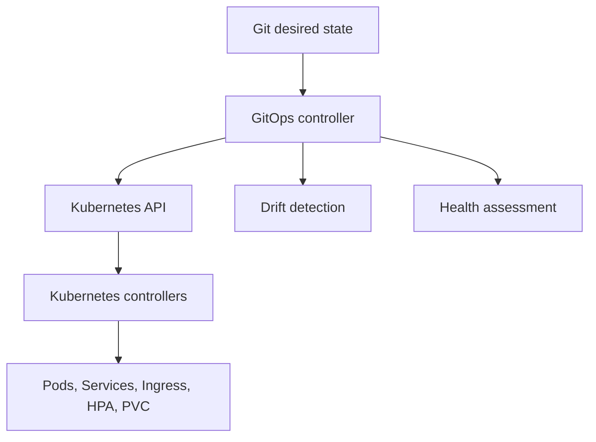

# Part 036 — GitOps and IaC

Part sebelumnya membahas Kustomize sebagai mekanisme base/overlay untuk mengelola variasi manifest antar environment.

Part ini membahas GitOps dan Infrastructure as Code sebagai operating model untuk deployment Kubernetes enterprise. Untuk Java/JAX-RS microservices, GitOps bukan sekadar cara deploy. GitOps menentukan bagaimana perubahan image, manifest, config, secret reference, ingress, RBAC, NetworkPolicy, autoscaling, dan cloud integration masuk ke cluster secara terkontrol.

GitOps yang baik membuat production state dapat diaudit, direproduksi, di-rollback, dan diperdebatkan melalui PR. GitOps yang buruk hanya memindahkan chaos manual deployment ke repository Git.

> CSG note: jangan mengasumsikan CSG memakai Argo CD, Flux, Terraform, Helm, Kustomize, environment promotion tertentu, branching strategy tertentu, cluster topology tertentu, atau GitOps repo structure tertentu. Semua detail harus diverifikasi di internal repository, CI/CD pipeline, GitOps controller, cloud account, dan diskusi dengan platform/SRE/DevOps/security/backend team.

---

## 1. Core Concept

GitOps adalah model operasi di mana Git menjadi source of truth untuk desired state.

Mental model:

```text
Git desired state -> GitOps controller -> Kubernetes API -> cluster actual state
```

Controller terus membandingkan desired state dengan actual state.

Jika berbeda, controller dapat:

- melaporkan drift,
- melakukan sync manual,
- melakukan auto-sync,
- prune object yang tidak lagi ada di Git,
- menjalankan health assessment,
- menandai aplikasi out-of-sync atau degraded.

GitOps bukan hanya deployment tool.

GitOps adalah control loop untuk platform state.

---

## 2. Why GitOps Exists

Tanpa GitOps, deployment sering bergantung pada operasi push dari pipeline atau manusia:

```text
CI pipeline -> kubectl apply -> cluster
```

Masalahnya:

- cluster state bisa berubah manual,
- siapa yang mengubah apa sulit dilacak,
- rollback tergantung command history,
- environment drift tidak terlihat,
- production hotfix tidak kembali ke Git,
- audit trail tersebar di pipeline logs,
- deploy permission terlalu luas.

GitOps mengubah model menjadi:

```text
CI builds artifact.
Git records desired deployment state.
GitOps controller applies desired state.
Cluster changes are reconciled from Git.
```

Keuntungan:

- audit trail via Git,
- PR review sebelum production change,
- drift detection,
- reproducibility,
- easier rollback via Git revert,
- separation of build and deploy responsibility,
- narrower cluster access for CI pipeline.

---

## 3. Desired State and Reconciliation

Kubernetes sendiri adalah desired state system.

GitOps menambahkan desired state layer di atas Kubernetes.



Ada dua reconciliation loop:

1. GitOps controller merekonsiliasi Git ke Kubernetes API.
2. Kubernetes controllers merekonsiliasi Kubernetes objects ke runtime state.

Saat incident, penting membedakan:

```text
GitOps sync problem
vs
Kubernetes runtime problem
vs
Application runtime problem
```

Contoh:

- GitOps sync failed karena manifest invalid.
- Kubernetes Deployment stuck karena pod not ready.
- Application pod ready false karena DB unreachable.

Ketiganya terlihat sebagai deployment gagal, tetapi root cause berbeda.

---

## 4. Pull-Based Deployment

GitOps biasanya memakai pull-based deployment.

Controller berada di cluster dan menarik desired state dari Git.

Keuntungan:

- CI tidak perlu cluster-admin credential,
- cluster dapat mengontrol apa yang disinkronkan,
- audit lebih jelas,
- firewall/security boundary lebih baik,
- multi-cluster deployment lebih mudah dikelola.

Push-based model:

```text
CI runner has kubeconfig -> kubectl apply
```

Pull-based model:

```text
GitOps controller has scoped permission -> watches Git -> applies state
```

Untuk enterprise, pull-based biasanya lebih defensible dari sisi security.

---

## 5. Argo CD Mental Model

Argo CD memodelkan aplikasi sebagai desired state yang menunjuk ke Git repo/path/revision.

Core object:

```text
Application
ApplicationSet
Project
Repository credential
Cluster credential
Sync policy
Health status
Diff status
```

Mental model:

```text
Argo CD Application = mapping between Git path and cluster destination
```

Hal yang perlu direview:

- repo URL,
- target revision,
- path overlay,
- destination cluster,
- destination namespace,
- sync policy,
- prune enabled/disabled,
- self-heal enabled/disabled,
- sync waves/hooks,
- ignoreDifferences rules,
- project permission boundary.

Risiko besar:

```text
Application points to wrong path or wrong revision.
```

Akibatnya, PR benar tetapi cluster menerima overlay yang salah.

---

## 6. Flux Mental Model

Flux juga bekerja dengan reconciliation loop.

Core resources umum:

```text
GitRepository
Kustomization
HelmRepository
HelmRelease
ImageRepository
ImagePolicy
ImageUpdateAutomation
```

Mental model:

```text
Flux source controller fetches artifacts.
Flux kustomize/helm controller reconciles manifests.
Flux image automation can update Git when new image is available.
```

Hal yang perlu direview:

- source repository,
- interval reconciliation,
- path,
- pruning,
- dependency order,
- HelmRelease values,
- image automation policy,
- secret decryption integration,
- suspend flag.

Risiko besar:

```text
Image automation updates deployment faster than review process expects.
```

---

## 7. Terraform and GitOps Boundary

Terraform dan GitOps sering sama-sama disebut IaC, tetapi domainnya berbeda.

Terraform cocok untuk:

- cloud infrastructure,
- VPC/VNet,
- subnets,
- route tables,
- IAM/Managed Identity,
- EKS/AKS cluster,
- node pools/node groups,
- security groups/NSG,
- private endpoints,
- DNS zones,
- storage accounts,
- managed databases,
- registry.

GitOps cocok untuk:

- Kubernetes workloads,
- Deployment,
- Service,
- Ingress/Gateway,
- ConfigMap/Secret reference,
- RBAC,
- NetworkPolicy,
- HPA/PDB,
- HelmRelease/Kustomization,
- application-specific manifests.

Boundary yang sehat:

```text
Terraform provisions platform substrate.
GitOps reconciles Kubernetes desired state on top of it.
```

Boundary yang buruk:

```text
Terraform and GitOps both manage the same Kubernetes object.
```

Itu menyebabkan drift war.

---

## 8. Repository Structure Patterns

Tidak ada satu struktur universal. Tetapi struktur harus membuat ownership, environment, dan promotion path jelas.

### App Repo + Deployment Repo

```text
quote-order-service/
  src/
  Dockerfile
  pom.xml

platform-deployments/
  apps/
    quote-order-service/
      base/
      overlays/
        dev/
        staging/
        prod/
```

Kelebihan:

- deployment state terpusat,
- platform review mudah,
- separation of app and environment.

Kekurangan:

- perubahan app dan manifest beda repo,
- coordination overhead.

### App Repo Contains Manifests

```text
quote-order-service/
  src/
  Dockerfile
  k8s/
    base/
    overlays/
```

Kelebihan:

- service owner dekat dengan manifest,
- PR app + deploy config bisa satu tempat.

Kekurangan:

- platform governance lebih sulit jika banyak repo,
- environment secrets/policies harus hati-hati.

### Environment Repo

```text
environments/
  dev/
    apps/
  staging/
    apps/
  prod/
    apps/
```

Kelebihan:

- environment state sangat eksplisit,
- promotion via PR antar environment jelas.

Kekurangan:

- duplikasi bisa muncul,
- cross-environment drift harus dikontrol.

Yang penting bukan struktur paling indah, tetapi invariants jelas.

---

## 9. Environment Promotion

Promotion adalah proses menaikkan artifact dan manifest dari satu environment ke environment berikutnya.

Contoh flow:

```text
commit -> CI build -> image digest -> dev deploy -> staging promotion -> prod promotion
```

Promotion yang sehat harus menjawab:

- artifact apa yang dipromosikan,
- digest image apa,
- manifest apa yang berubah,
- config apa yang environment-specific,
- siapa approver,
- test apa yang wajib pass,
- rollback bagaimana,
- audit evidence di mana.

Anti-pattern:

```text
Rebuild image separately for prod from the same commit.
```

Lebih defensible:

```text
Build once, promote immutable artifact.
```

Jika image berbeda per environment, harus ada alasan kuat dan traceability.

---

## 10. Image Update Strategies

Ada beberapa cara mengubah image yang dideploy.

### Manual PR Update

Developer atau CI membuat PR yang mengubah image tag/digest.

Kelebihan:

- review eksplisit,
- audit jelas,
- cocok untuk production.

Kekurangan:

- lebih lambat,
- butuh automation agar tidak melelahkan.

### Automated Image Updater

Argo CD Image Updater atau Flux Image Automation dapat mengupdate Git.

Kelebihan:

- cepat,
- cocok untuk dev/staging,
- mengurangi manual update.

Risiko:

- production berubah terlalu cepat,
- policy image tidak ketat,
- mutable tag menyebabkan surprise,
- PR review dilewati jika automation langsung commit.

Production rule:

```text
Prefer immutable digest and explicit approval for high-risk environments.
```

---

## 11. Sync Policy

GitOps controller biasanya memiliki sync policy.

Mode umum:

```text
manual sync
auto sync
auto sync + prune
auto sync + self-heal
```

Manual sync cocok jika:

- environment production butuh explicit operator approval,
- change window ketat,
- compliance membutuhkan manual gate.

Auto sync cocok jika:

- environment dev/staging,
- low-risk system,
- strong policy validation,
- rollback path jelas.

Prune berarti object yang tidak ada di Git dapat dihapus dari cluster.

Prune sangat berguna untuk mencegah zombie resource, tetapi berbahaya jika path/revision salah.

Self-heal berarti manual change di cluster akan dikembalikan ke desired state.

Self-heal bagus untuk mencegah drift, tetapi bisa mengejutkan saat incident jika engineer mencoba hotfix manual.

---

## 12. Sync Waves, Hooks, and Ordering

Beberapa resource harus diterapkan dalam urutan tertentu.

Contoh:

```text
Namespace -> CRD -> RBAC -> Secret/ExternalSecret -> Deployment -> Service -> Ingress
```

Argo CD memiliki sync waves dan hooks.

Flux memiliki dependency mechanisms seperti `dependsOn`.

Ordering penting untuk:

- CRD sebelum CR,
- ExternalSecret sebelum Deployment,
- migration Job sebelum app rollout,
- RBAC sebelum controller workload,
- ServiceAccount sebelum pod,
- NetworkPolicy setelah required egress siap.

Risiko:

```text
Deployment starts before secret/config/CRD dependency is ready.
```

Akibatnya pod crash, rollout stuck, atau service not ready.

---

## 13. Health Checks in GitOps

GitOps controller perlu menilai health aplikasi.

Health bukan hanya "manifest applied".

Health bisa berarti:

- Deployment available,
- pods ready,
- Service has endpoints,
- Ingress configured,
- Job succeeded,
- custom resource healthy,
- Helm release deployed,
- ExternalSecret synced.

Untuk Java/JAX-RS service:

```text
GitOps healthy does not always mean API is functionally healthy.
```

Deployment bisa available, tetapi:

- downstream DB lambat,
- Kafka lag naik,
- Redis timeout,
- ingress timeout chain salah,
- authentication ke cloud service gagal.

GitOps health harus dilengkapi observability aplikasi.

---

## 14. Drift Detection

Drift adalah perbedaan antara Git desired state dan cluster actual state.

Penyebab drift:

- manual kubectl edit,
- controller lain mengubah object,
- HPA mengubah replicas,
- cert-manager menambah status/annotation,
- cloud controller menambah annotation,
- mutating admission webhook,
- emergency hotfix,
- Terraform juga mengelola object yang sama.

Tidak semua drift buruk.

Beberapa field memang dikelola controller lain.

Karena itu GitOps sering punya ignore-differences rules.

Risiko:

```text
ignoreDifferences too broad hides real production drift.
```

Review harus memastikan ignored field spesifik dan justified.

---

## 15. Rollback

Rollback GitOps biasanya dilakukan dengan revert commit atau mengubah target revision/image digest.

Rollback yang sehat:

```text
revert desired state -> controller sync -> Kubernetes rollout rollback/recreate -> observe metrics
```

Tetapi rollback tidak selalu sederhana.

Rollback sulit jika:

- database migration tidak backward compatible,
- message schema berubah,
- Kafka/RabbitMQ consumer behavior berubah,
- config/secret berubah tidak kompatibel,
- CRD upgraded,
- PVC/data format berubah,
- external cloud resource berubah via Terraform,
- feature flag state tidak ikut rollback.

Senior engineer harus bertanya:

```text
Can the previous app version run against the current data, config, messages, and infrastructure?
```

Jika tidak, rollback hanya ilusi.

---

## 16. Manual Hotfix Risk

Saat incident, engineer sering tergoda melakukan:

```bash
kubectl edit deployment ...
kubectl patch ...
kubectl scale ...
```

Ini kadang perlu untuk mitigasi cepat, tetapi dalam GitOps environment ada risiko:

- self-heal mengembalikan perubahan,
- Git tidak mencatat hotfix,
- drift tidak diselesaikan,
- rollback state tidak jelas,
- post-incident RCA kehilangan evidence.

Rule production:

```text
If manual hotfix is necessary, backport it to Git immediately or document it as temporary operational deviation.
```

Manual change tanpa rekonsiliasi ke Git adalah debt operasional.

---

## 17. Secret Handling in GitOps

GitOps repository sering menyimpan manifest. Secret harus diperlakukan khusus.

Opsi umum:

- External Secrets Operator,
- Sealed Secrets,
- SOPS-encrypted secrets,
- cloud secret manager reference,
- Key Vault/Secrets Manager/SSM integration,
- CSI secret store.

Anti-pattern:

```text
raw production secret committed to Git
base64 secret treated as encryption
secret value exposed in rendered manifest artifact
```

Review harus membedakan:

```text
secret reference is often acceptable
secret material requires strict protection
```

---

## 18. Java/JAX-RS Deployment Impact

Untuk Java/JAX-RS service, GitOps/IaC memengaruhi:

- image digest yang berjalan,
- JVM options,
- resource request/limit,
- startup/readiness/liveness probes,
- HTTP/management port,
- graceful shutdown settings,
- ConfigMap/Secret references,
- ServiceAccount identity,
- ingress timeout/routing,
- NetworkPolicy egress ke PostgreSQL/Kafka/RabbitMQ/Redis/Camunda,
- autoscaling behavior,
- observability labels,
- rollout strategy.

Perubahan kecil di GitOps repo dapat menghasilkan perubahan runtime besar.

Contoh:

```text
memory limit changed from 2Gi to 1Gi
-> JVM heap still MaxRAMPercentage 75%
-> native memory squeezed
-> OOMKilled under load
```

Atau:

```text
readiness path changed
-> pod never ready
-> rollout stuck
-> GitOps app degraded
```

---

## 19. EKS, AKS, On-Prem, and Hybrid Concerns

GitOps/IaC boundary berbeda tergantung platform.

### EKS

Terraform mungkin mengelola:

- VPC,
- subnet,
- EKS cluster,
- node group,
- IAM roles,
- IRSA OIDC provider,
- ECR,
- VPC endpoints,
- Route 53,
- ACM.

GitOps mungkin mengelola:

- AWS Load Balancer Controller resources,
- service account annotations,
- ingress manifests,
- ExternalSecret,
- workloads,
- NetworkPolicy,
- HPA/PDB.

### AKS

Terraform mungkin mengelola:

- VNet,
- subnet,
- AKS cluster,
- node pools,
- managed identities,
- ACR,
- private endpoints,
- Azure DNS,
- Key Vault.

GitOps mungkin mengelola:

- Workload Identity annotations,
- Key Vault CSI references,
- ingress resources,
- workloads,
- NetworkPolicy,
- HPA/PDB.

### On-Prem

IaC/GitOps harus memperhatikan:

- internal registry,
- air-gapped deployment,
- private CA,
- MetalLB/load balancer,
- storage class,
- custom DNS,
- patch/upgrade ownership.

### Hybrid

GitOps config sering membawa:

- private endpoint DNS,
- proxy config,
- firewall-driven egress assumptions,
- cloud-to-on-prem endpoint reference,
- TLS trust bundle.

Semua ini harus diverifikasi internal.

---

## 20. Failure Modes

### GitOps App OutOfSync

Possible causes:

- Git changed but not synced,
- live cluster manually changed,
- controller cannot apply resource,
- ignored fields misconfigured.

### GitOps App Degraded

Possible causes:

- Deployment not available,
- pod not ready,
- Job failed,
- CRD health check failed,
- ExternalSecret not synced.

### Sync Failed

Possible causes:

- invalid manifest,
- missing CRD,
- RBAC denied,
- namespace missing,
- admission policy rejected,
- immutable field changed,
- webhook unavailable.

### Wrong Environment Deployed

Possible causes:

- Application points to wrong path,
- wrong branch/revision,
- overlay path typo,
- promotion PR targets wrong directory,
- image updater changed wrong manifest.

### Drift War

Possible causes:

- Terraform and GitOps manage same object,
- HPA and GitOps fight over replicas without ignore rule,
- mutating webhook changes fields not ignored,
- manual kubectl edit repeatedly reverted.

### Rollback Fails

Possible causes:

- migration incompatible,
- config schema changed,
- message schema changed,
- secret rotated,
- CRD version changed,
- old image no longer exists in registry.

---

## 21. Debugging Workflow

When deployment fails, separate layers.

### 1. Git Layer

Check:

- correct repo,
- correct branch/revision,
- correct path,
- last commit,
- PR approval,
- rendered manifest.

### 2. GitOps Controller Layer

Check:

- app sync status,
- health status,
- sync error,
- diff,
- events,
- controller logs,
- project permission,
- repo credential.

### 3. Kubernetes API Layer

Check:

```bash
kubectl get events -n <namespace>
kubectl describe deployment <name> -n <namespace>
kubectl get pods -n <namespace>
kubectl describe pod <pod> -n <namespace>
```

### 4. Runtime Layer

Check:

```bash
kubectl logs <pod> -n <namespace>
kubectl top pod -n <namespace>
kubectl get endpointslice -n <namespace>
kubectl describe hpa <name> -n <namespace>
```

### 5. Application Layer

Check:

- JAX-RS logs,
- health endpoint,
- downstream dependency errors,
- DB/Kafka/RabbitMQ/Redis/Camunda connectivity,
- cloud SDK credential failure,
- timeout/retry behavior.

---

## 22. PR Review Checklist

Use this checklist for GitOps/IaC PRs.

### Source of Truth

- Is this the correct repository?
- Is this the correct environment path?
- Is the target revision clear?
- Is the change reviewed by correct owner?

### Artifact

- Is image tag/digest immutable?
- Is digest traceable to commit?
- Was image scanned?
- Is rollback image still available?

### Manifest

- Has rendered manifest been reviewed?
- Are probes unchanged or intentionally changed?
- Are resource changes justified?
- Are labels/selectors safe?
- Are namespace and service account correct?

### Security

- Are secrets handled safely?
- Are RBAC changes least-privilege?
- Are NetworkPolicy changes understood?
- Are cloud identity annotations correct?
- Would admission policy accept this?

### Operations

- Does sync order matter?
- Is migration required?
- Is rollback safe?
- Are alerts/dashboards ready?
- Is blast radius understood?
- Is change window required?

### Cost

- Does replica/resource change affect cost?
- Does it create new load balancer, PVC, NAT traffic, or logging volume?
- Is cost owner label present?

---

## 23. Internal Verification Checklist

Verify these in the actual CSG/team environment:

- apakah deployment memakai GitOps,
- tool yang dipakai: Argo CD, Flux, custom controller, atau pipeline push,
- repository source of truth,
- repo app vs repo deployment separation,
- path environment dev/staging/prod,
- cluster destination mapping,
- namespace mapping,
- sync policy per environment,
- prune/self-heal policy,
- manual sync approval process,
- image update strategy,
- image digest/tag policy,
- Terraform boundary,
- cloud resource ownership,
- secret management approach,
- rollback process,
- drift detection workflow,
- ignoreDifferences policy,
- sync wave/hook usage,
- migration job process,
- production hotfix process,
- audit evidence location,
- who approves platform-affecting PRs,
- who owns GitOps controller operations.

---

## 24. Senior Engineer Mental Model

GitOps is not "deployment by YAML".

GitOps is production state governance through reconciliation.

Senior engineer should ask:

```text
What is the source of truth?
What artifact is being promoted?
What controller reconciles it?
What state will the cluster converge to?
What happens if someone changes the cluster manually?
What is the rollback path?
What is the blast radius?
What evidence proves this change is safe?
```

If these questions cannot be answered, the deployment process is not production-ready.

---

## 25. Summary

Hal penting dari part ini:

- GitOps menjadikan Git sebagai source of truth untuk desired state.
- GitOps controller melakukan reconciliation dan drift detection.
- Pull-based deployment mengurangi kebutuhan CI memiliki credential cluster luas.
- Terraform dan GitOps harus punya boundary jelas.
- Environment promotion harus mempromosikan artifact immutable, bukan rebuild acak.
- Auto-sync, prune, dan self-heal powerful tetapi berisiko jika salah konfigurasi.
- Rollback tidak aman jika data, schema, config, message, atau infra berubah tidak kompatibel.
- Manual hotfix harus direkonsiliasi kembali ke Git.
- Secret material tidak boleh bocor ke GitOps repo.
- GitOps health harus dilengkapi observability aplikasi.
- Senior backend engineer harus bisa membaca GitOps PR sebagai perubahan production state, bukan sekadar YAML diff.

Part berikutnya membahas CI/CD for Containerized Services: build pipeline, test pipeline, image build/scan/push, manifest update, deployment promotion, migration job, smoke/canary test, rollback, artifact versioning, dan traceability dari commit sampai pod.
