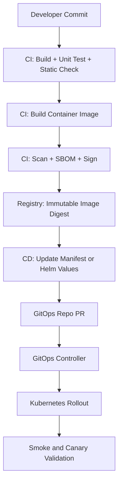

# Part 037 — CI/CD for Containerized Services

Part sebelumnya membahas GitOps dan Infrastructure as Code sebagai operating model untuk menjaga desired state Kubernetes tetap dapat diaudit, direview, dan direkonsiliasi.

Part ini membahas CI/CD untuk service Java/JAX-RS yang berjalan sebagai container di Kubernetes. Fokusnya bukan sekadar membuat pipeline yang bisa deploy, tetapi membuat pipeline yang aman, reproducible, traceable, rollbackable, dan cocok untuk mission-critical microservices.

Untuk enterprise backend system, CI/CD adalah bagian dari production architecture. Pipeline yang buruk dapat menyebabkan image salah naik ke production, manifest drift, credential bocor, migration merusak data, atau rollback tidak mungkin dilakukan saat incident.

> CSG note: jangan mengasumsikan CSG memakai GitHub Actions, Jenkins, GitLab CI, Azure DevOps, Argo CD, Flux, Terraform, Helm, Kustomize, ECR, ACR, internal registry, atau promotion model tertentu. Semua nama tool, repository, environment gate, approval flow, registry, cloud account, cluster, namespace, dan deployment procedure harus diverifikasi di internal CSG/team.

---

## 1. Core Concept

CI/CD untuk containerized service adalah pipeline yang mengubah source code menjadi runtime state di Kubernetes melalui artifact yang dapat dilacak.

Mental model ideal:

```text
source commit
  -> build/test
  -> container image
  -> image scan/sign/SBOM
  -> registry
  -> deployment manifest update
  -> GitOps/IaC reconciliation
  -> Kubernetes rollout
  -> smoke/canary validation
  -> production observation
```

Pipeline yang sehat memisahkan tiga hal:

1. **Build artifact**: menghasilkan image dari source code.
2. **Promote artifact**: memindahkan image yang sama antar environment.
3. **Deploy desired state**: mengubah manifest/GitOps state agar cluster memakai artifact tersebut.

Kesalahan umum adalah membangun ulang image di setiap environment.

```text
Wrong mental model:
source -> build image for dev
source -> build image again for staging
source -> build image again for prod
```

Ini membuat artifact production tidak identik dengan artifact yang diuji.

Mental model yang lebih defensible:

```text
one commit -> one immutable image digest -> promoted across environments
```

---

## 2. Why CI/CD Matters in Kubernetes

Kubernetes membuat deployment terlihat mudah:

```bash
kubectl apply -f deployment.yaml
```

Tetapi production deployment bukan hanya apply manifest.

Yang harus dikontrol:

- source code mana yang dibuild,
- dependency mana yang masuk,
- base image mana yang dipakai,
- image digest mana yang dipromosikan,
- vulnerability apa yang diterima atau ditolak,
- config mana yang berubah,
- secret reference mana yang dipakai,
- migration apa yang dijalankan,
- namespace/cluster mana yang dituju,
- rollout strategy apa yang dipakai,
- smoke/canary signal apa yang dianggap sehat,
- bagaimana rollback dilakukan,
- siapa yang menyetujui production change,
- bagaimana audit trail dibuat.

Pipeline adalah control surface untuk semua hal di atas.

---

## 3. CI vs CD vs GitOps

CI, CD, dan GitOps sering dicampur.

Lebih aman dibedakan seperti ini:

```text
CI     = build and validate code/artifact
CD     = promote and deploy artifact
GitOps = reconcile desired state from Git to cluster
```

Contoh pembagian responsibility:



Pemisahan ini membantu security:

- CI tidak harus punya cluster-admin access.
- GitOps controller bisa punya permission scoped.
- Production deployment bisa lewat PR approval.
- Rollback bisa berupa Git revert.

---

## 4. Artifact Versioning

Artifact utama containerized service adalah image.

Minimal identity image:

```text
registry/repository:tag
registry/repository@sha256:digest
```

Tag berguna untuk manusia.

Digest berguna untuk correctness.

Contoh tag informatif:

```text
quote-service:1.12.7
quote-service:1.12.7-git-a1b2c3d
quote-service:pr-482-a1b2c3d
quote-service:main-a1b2c3d-20260711
```

Tetapi production harus bisa melacak digest:

```text
quote-service@sha256:...
```

Prinsip:

- tag boleh mutable untuk dev jika policy mengizinkan,
- production sebaiknya memakai immutable tag atau digest,
- digest harus tercatat di deployment history,
- image yang sama harus dipromosikan antar environment,
- jangan membangun ulang image untuk production dari branch yang sama tanpa traceability.

---

## 5. Traceability from Commit to Pod

Senior engineer harus bisa menjawab pertanyaan ini saat incident:

```text
Pod ini menjalankan commit yang mana?
Image ini dibuild oleh pipeline run yang mana?
Deployment ini berasal dari PR yang mana?
Config yang aktif berasal dari Git revision mana?
```

Traceability chain ideal:

```text
Git commit SHA
  -> CI run ID
  -> image tag
  -> image digest
  -> SBOM/scanning report
  -> GitOps commit
  -> Kubernetes ReplicaSet revision
  -> Pod labels/annotations
  -> logs/metrics/traces version label
```

Recommended Kubernetes metadata:

```yaml
metadata:
  labels:
    app.kubernetes.io/name: quote-service
    app.kubernetes.io/component: api
    app.kubernetes.io/version: "1.12.7"
    app.kubernetes.io/managed-by: argocd
  annotations:
    build.git/commit: "a1b2c3d4"
    build.ci/run-id: "123456"
    image.opencontainers.org/revision: "a1b2c3d4"
```

Gunakan label untuk query dan grouping.

Gunakan annotation untuk metadata detail yang tidak dipakai selector.

---

## 6. Build Pipeline

Build pipeline untuk Java/JAX-RS service biasanya mencakup:

```text
checkout
  -> setup JDK
  -> dependency restore/cache
  -> compile
  -> unit test
  -> static analysis
  -> package jar/war
  -> integration test if feasible
  -> container build
```

Untuk Maven:

```bash
mvn -B clean verify
```

Namun command bukan bagian terpenting.

Yang penting:

- dependency resolution reproducible,
- test tidak flaky,
- build tidak bergantung pada state lokal runner,
- version tercatat,
- artifact jar/war sesuai image,
- build cache tidak menyembunyikan dependency corruption,
- sensitive repository credential tidak masuk image layer.

CI failure yang tampak kecil bisa menjadi production risk jika diabaikan.

---

## 7. Test Pipeline

Test pipeline harus menguji level yang tepat.

Layer umum:

```text
unit test
component test
contract test
integration test
container smoke test
migration test
security test
performance smoke test
```

Untuk Java/JAX-RS service:

- unit test untuk business logic,
- component test untuk resource/service layer,
- contract test untuk API compatibility,
- integration test untuk PostgreSQL/Kafka/RabbitMQ/Redis jika feasible,
- container smoke test untuk memastikan image bisa start,
- probe endpoint test untuk readiness/liveness behavior,
- serialization test untuk DTO/API schema,
- migration test untuk database change.

Poin penting:

```text
A green unit test does not prove the container can run.
A running container does not prove it is production-ready.
```

---

## 8. Container Image Build

Image build harus menghasilkan artifact yang deterministic dan aman.

Checklist image build:

- Dockerfile pinned atau base image governed,
- BuildKit enabled jika digunakan,
- build context kecil,
- `.dockerignore` benar,
- dependency cache layer efektif,
- secret build tidak masuk final image,
- final image tidak membawa source code/test file yang tidak perlu,
- runtime user non-root,
- entrypoint jelas,
- JVM options runtime-injectable,
- image labels berisi revision/build metadata.

Contoh OCI labels:

```dockerfile
LABEL org.opencontainers.image.source="internal-repo-url"
LABEL org.opencontainers.image.revision="$GIT_COMMIT"
LABEL org.opencontainers.image.created="$BUILD_TIME"
LABEL org.opencontainers.image.version="$APP_VERSION"
```

Jangan menaruh secret sebagai label.

---

## 9. Image Scan

Image scan mencari vulnerability pada:

- OS packages,
- language dependencies,
- base image,
- transitive dependencies,
- known vulnerable libraries.

Scan harus dilakukan sebelum image dipromosikan.

Tetapi scan bukan hanya pass/fail sederhana.

CVE triage perlu melihat:

- severity,
- exploitability,
- package reachable atau tidak,
- fixed version tersedia atau tidak,
- base image update path,
- compensating control,
- production exposure,
- exception expiry.

Anti-pattern:

```text
Scan fails -> disable scanner.
Scan passes -> assume image secure.
```

Scanner adalah signal, bukan pengganti security review.

---

## 10. SBOM and Provenance

SBOM membantu menjawab:

```text
Library apa yang ada di image ini?
Versi dependency apa yang ikut deploy?
Apakah service ini terdampak CVE baru?
```

Provenance membantu menjawab:

```text
Image ini dibuild dari source mana?
Oleh pipeline mana?
Dengan builder apa?
Artifact ini bisa dipercaya atau tidak?
```

Untuk enterprise, artifact tanpa provenance membuat incident response lambat.

Saat ada CVE besar, pertanyaan pertama biasanya:

```text
Service mana yang membawa dependency itu?
Image mana yang sudah deploy?
Environment mana yang terdampak?
```

Tanpa SBOM dan metadata, jawabannya menjadi grep manual di banyak repository.

---

## 11. Image Push

Image push ke registry harus mempertimbangkan:

- authentication,
- repository naming,
- immutability,
- retention,
- replication,
- scanning trigger,
- promotion model,
- access control,
- outage behavior.

Registry bukan hanya tempat menyimpan image.

Registry adalah production dependency.

Jika registry down, node baru mungkin gagal pull image.

Failure mode:

```text
New rollout -> node pulls image -> registry unavailable -> ImagePullBackOff
```

Mitigation:

- image already cached on nodes jika memungkinkan,
- registry HA/replication,
- rollback image tersedia,
- avoid deleting active production image,
- retention policy tidak agresif.

---

## 12. Manifest Update

Setelah image dibuat, deployment state harus berubah.

Cara umum:

1. update Helm values,
2. update Kustomize image override,
3. update raw manifest,
4. update GitOps Application parameter,
5. update environment promotion file.

Contoh Kustomize image update:

```yaml
images:
  - name: internal-registry/quote-service
    newTag: "1.12.7-git-a1b2c3d"
```

Contoh Helm values:

```yaml
image:
  repository: internal-registry/quote-service
  tag: "1.12.7-git-a1b2c3d"
  digest: "sha256:..."
```

Hal yang harus dijaga:

- manifest update jelas terlihat di PR,
- image digest/tag sesuai scan report,
- environment overlay benar,
- config change tidak tercampur diam-diam dengan image change,
- rollback target diketahui.

---

## 13. Deployment Promotion

Promotion adalah proses memindahkan artifact dari environment rendah ke environment lebih tinggi.

Model yang baik:

```text
same image digest -> dev -> test -> staging -> production
```

Bukan:

```text
rebuild different image for each environment
```

Promotion harus membawa evidence:

- build passed,
- tests passed,
- scan passed atau exception approved,
- smoke test passed,
- migration test passed jika ada,
- deployment diff reviewed,
- rollback plan tersedia,
- owner jelas.

Promotion bukan hanya menaikkan tag.

Promotion adalah risk acceptance step.

---

## 14. Environment Gates

Environment gate adalah kontrol sebelum perubahan masuk environment tertentu.

Contoh gate:

- automated test gate,
- security scan gate,
- manual approval,
- change window,
- freeze window,
- incident freeze,
- compliance approval,
- platform approval,
- database migration approval,
- performance benchmark threshold,
- canary health threshold.

Gate yang terlalu longgar membuat production rawan.

Gate yang terlalu berat membuat tim mencari bypass.

Design gate harus proportional terhadap risk.

---

## 15. Database Migration Job

Untuk Java/JAX-RS service yang memakai PostgreSQL, migration adalah salah satu bagian deployment paling berbahaya.

Risiko:

- migration tidak backward-compatible,
- lock table terlalu lama,
- rollback aplikasi tidak rollback schema,
- migration job dijalankan dua kali,
- migration sukses sebagian,
- migration tidak observable,
- migration berjalan bersamaan dari beberapa replica.

Pattern umum:

```text
CI validates migration
CD deploys migration job
migration job runs once
application rollout starts after migration success
```

Namun tidak semua perubahan schema harus deploy dengan cara yang sama.

Untuk production-safe migration, pikirkan expand/contract:

```text
1. expand schema backward-compatible
2. deploy app that can use both old/new schema
3. backfill if needed
4. switch reads/writes
5. contract old schema later
```

Rollback concern:

```text
Application rollback is easy.
Database rollback is often not easy.
```

---

## 16. Smoke Test

Smoke test menjawab:

```text
Apakah deployment yang baru bisa melayani request dasar?
```

Smoke test bukan full regression test.

Smoke test harus cepat, deterministic, dan production-safe.

Contoh smoke test:

- `/health/ready` returns healthy,
- one read-only endpoint works,
- service can resolve key dependency,
- version endpoint returns expected build,
- can reach required downstream dependency,
- log/tracing emits expected metadata.

Untuk production, jangan membuat smoke test yang:

- membuat data customer palsu tanpa cleanup,
- memicu workflow irreversible,
- mengirim message ke Kafka/RabbitMQ production topic tanpa idempotency,
- mengubah order/quote/payment state nyata,
- bergantung pada third-party unstable endpoint tanpa fallback logic.

---

## 17. Canary Test

Canary test menjawab:

```text
Apakah versi baru sehat saat menerima sebagian traffic nyata?
```

Canary cocok untuk:

- REST API stateless,
- perubahan logic berisiko,
- perubahan dependency client,
- perubahan performance-sensitive,
- perubahan serialization/API compatibility,
- perubahan Kafka/RabbitMQ consumer yang bisa dibatasi scope-nya.

Canary membutuhkan metric yang benar.

Signal umum:

- error rate,
- latency p95/p99,
- HTTP 5xx,
- business error rate,
- JVM memory/GC behavior,
- CPU throttling,
- Kafka consumer lag,
- RabbitMQ queue depth,
- DB connection pool saturation,
- retry storm,
- downstream timeout.

Canary tanpa metric hanya rolling update pelan.

---

## 18. Rollback

Rollback harus dirancang sebelum deploy.

Pertanyaan rollback:

```text
Apa artifact rollback?
Apa manifest rollback?
Apakah database schema backward-compatible?
Apakah config lama masih tersedia?
Apakah secret lama masih valid?
Apakah message format backward-compatible?
Apakah cache key/version compatible?
Apakah client masih compatible?
```

Rollback model umum:

- Git revert pada GitOps repo,
- Helm rollback,
- Argo CD rollback/sync previous revision,
- Kubernetes rollout undo,
- redeploy previous image digest.

Tetapi hati-hati:

```text
Rollback app does not rollback external side effects.
```

External side effects mencakup:

- DB migration,
- Kafka message publication,
- RabbitMQ message publication,
- Redis cache mutation,
- external API call,
- Camunda workflow state transition,
- customer-visible state change.

---

## 19. Migration and Rollback Compatibility Matrix

Untuk backend enterprise, deployment harus dicek terhadap compatibility.

| Change Type | Forward Deploy Risk | Rollback Risk | Recommended Pattern |
|---|---:|---:|---|
| Add optional API field | Low | Low | backward-compatible release |
| Remove API field | High | High | contract/versioning first |
| Add DB nullable column | Low | Low | expand phase |
| Rename DB column | High | High | add new column, dual read/write, contract later |
| Change Kafka message schema | High | High | schema compatibility, versioned consumer |
| Change Redis key format | Medium | Medium | versioned keys, dual read fallback |
| Change RabbitMQ routing key | High | Medium | dual publish/consume transition |
| Change Camunda worker behavior | High | High | versioned workflow/task handling |
| Change timeout/retry | Medium | Low | canary with downstream metrics |

Pipeline should block or require approval for high-risk changes.

---

## 20. CI/CD for Kafka and RabbitMQ Consumers

Consumer deployment differs from REST API deployment.

REST service scaling concern:

```text
traffic -> load balancer -> pods
```

Consumer scaling concern:

```text
queue/topic partitions/messages -> consumers -> processing side effects
```

CI/CD must validate:

- consumer group behavior,
- partition assignment impact,
- graceful shutdown,
- offset commit timing,
- poison message handling,
- retry/DLQ behavior,
- idempotent processing,
- schema compatibility,
- queue/topic permissions,
- lag metrics.

Canary for consumers may require:

- separate consumer group,
- limited partitions,
- shadow topic,
- feature flag,
- controlled queue binding,
- staged replica count.

Do not assume REST canary pattern applies directly to consumers.

---

## 21. CI/CD for Redis-Using Services

Redis changes can be subtle.

Deployment risks:

- cache key schema changes,
- TTL changes,
- serialization format changes,
- distributed lock behavior changes,
- cache stampede,
- stale data after rollback,
- memory growth,
- connection pool saturation.

Pipeline should consider tests for:

- key version compatibility,
- serialization/deserialization fallback,
- TTL correctness,
- lock timeout behavior,
- cache-miss path correctness,
- Redis unavailable behavior.

Rollback concern:

```text
Old app may not understand cache entries written by new app.
```

Use versioned keys or compatibility windows for risky changes.

---

## 22. CI/CD for Camunda-Like Workflow Workers

Workflow worker deployments are risky because workflow state is long-lived.

Risks:

- worker no longer handles existing task type,
- variable schema changes,
- BPMN/process version mismatch,
- retry behavior changes,
- incident escalation behavior changes,
- non-idempotent task execution,
- worker shutdown leaves locks open,
- old process instances require old behavior.

Pipeline should verify:

- process versioning strategy,
- worker compatibility with existing process instances,
- idempotency of external tasks/jobs,
- retry and incident behavior,
- observability per task type,
- rollback strategy for worker logic.

For workflow systems, deployment is not just code rollout.

It is lifecycle management of long-running business processes.

---

## 23. NGINX and Ingress Interaction

If deployment changes ingress, NGINX, or API Gateway config, pipeline risk increases.

Examples:

- path rewrite changed,
- timeout changed,
- body size changed,
- TLS/certificate reference changed,
- backend protocol changed,
- sticky session changed,
- canary annotation changed,
- host routing changed,
- header forwarding changed.

CI/CD should validate:

- generated ingress manifest,
- route conflicts,
- TLS secret reference,
- service/port existence,
- smoke test through ingress path,
- X-Forwarded headers behavior,
- timeout compatibility with app server.

Deploying app and ingress change together can make rollback harder.

---

## 24. EKS Considerations

In EKS, CI/CD may interact with:

- ECR,
- IAM/IRSA,
- AWS Load Balancer Controller,
- ALB/NLB annotations,
- Route 53,
- ACM certificates,
- VPC endpoints,
- CloudWatch logs/metrics,
- Karpenter or Cluster Autoscaler,
- node groups,
- security groups.

Pipeline checks may need to validate:

- image pushed to correct ECR repository/account/region,
- node has permission to pull image,
- service account has correct IRSA annotation,
- ingress annotations are safe,
- target group health becomes healthy,
- CloudWatch logs contain new version label,
- deployment does not require unavailable node capacity.

Internal verification is mandatory because EKS setups vary significantly.

---

## 25. AKS Considerations

In AKS, CI/CD may interact with:

- ACR,
- Managed Identity,
- Azure Workload Identity,
- Azure Load Balancer,
- Application Gateway/AGIC,
- Azure DNS,
- Key Vault CSI,
- Azure Monitor,
- Log Analytics,
- node pools,
- private endpoints.

Pipeline checks may need to validate:

- image pushed to correct ACR,
- AKS has ACR pull permission,
- service account identity mapping is correct,
- Key Vault secret mount works,
- ingress/application gateway route is healthy,
- Azure Monitor receives logs/metrics,
- private DNS resolution works from pod.

Do not assume EKS and AKS deployment behavior is identical.

---

## 26. On-Prem and Hybrid Considerations

On-prem/hybrid CI/CD introduces constraints that cloud-native pipelines may not have.

Examples:

- internal registry only,
- air-gapped artifact promotion,
- manually mirrored base images,
- private CA trust bundle,
- corporate proxy,
- firewall approval,
- internal DNS,
- limited autoscaling,
- storage class differences,
- custom load balancer integration,
- maintenance windows.

Pipeline must account for:

- artifact replication delay,
- registry availability,
- cluster access model,
- private certificate distribution,
- network path from runner to Git/registry/cluster,
- environment-specific constraints.

Hybrid failure often looks like application failure but root cause is DNS, proxy, firewall, or certificate trust.

---

## 27. Pipeline Secrets

CI/CD pipelines often handle sensitive material:

- registry credential,
- Maven repository token,
- Git token,
- cloud credential,
- signing key,
- scanner token,
- Kubernetes credential,
- deployment approval token.

Risks:

- secret echoed in logs,
- secret copied into image layer,
- secret persisted in build cache,
- secret exposed through PR from fork,
- long-lived cloud credential,
- CI runner compromise,
- overly broad deployment credential.

Safer principles:

- prefer short-lived credentials,
- prefer workload identity/federation over static keys,
- scope credentials per environment,
- separate build and deploy credentials,
- mask logs,
- restrict secret access for untrusted PRs,
- avoid mounting Docker socket where possible.

---

## 28. Branching and Promotion Models

CI/CD must match team workflow.

Common models:

```text
trunk-based development
release branch
environment branch
GitOps environment directory
tag-based release
PR-based promotion
```

No universal best model.

Evaluate based on:

- deployment frequency,
- compliance/audit need,
- number of environments,
- rollback expectation,
- release train vs continuous deployment,
- hotfix process,
- team ownership,
- multi-service coordination.

Weak model symptom:

```text
Nobody knows which branch actually represents production.
```

That is a governance failure, not a Git problem.

---

## 29. Pipeline Failure Modes

Common CI/CD failure modes:

| Symptom | Likely Cause | Debug Direction |
|---|---|---|
| Build passes locally but fails in CI | environment mismatch, dependency cache, JDK version | compare runner image, Maven settings, env var |
| Image builds but app fails in pod | entrypoint/env/config mismatch | run image locally, inspect logs, check env |
| Image scan fails | vulnerable package/dependency | inspect CVE, fixed version, base image update |
| Image push fails | registry auth/permission/quota | check token, repo policy, registry status |
| GitOps app out-of-sync | manifest update failed, drift, controller error | inspect GitOps diff and controller logs |
| Rollout stuck | readiness failure, resource issue, image issue | describe deployment/pod/events |
| Smoke test fails | route/config/dependency issue | compare pod logs, ingress, service, endpoint |
| Rollback fails | schema/config/secret incompatibility | inspect migration and compatibility |

Debugging pipeline requires following the artifact chain, not guessing from the last error only.

---

## 30. Production-Safe Debugging of CI/CD

During deployment incident:

Do:

- identify image digest currently running,
- identify previous known-good digest,
- inspect GitOps diff,
- inspect rollout status,
- inspect pod events/logs,
- compare config and secret references,
- check ingress/service/endpoints,
- check migration job result,
- validate rollback compatibility,
- communicate blast radius.

Avoid:

- rebuilding image blindly,
- force pushing mutable production tag,
- manually editing live resources without recording change,
- deleting pods repeatedly without root cause,
- bypassing GitOps permanently,
- running migration rollback without data impact analysis,
- changing ingress and app simultaneously during unclear incident.

---

## 31. Observability Requirements for CI/CD

Pipeline observability should include:

- build duration,
- test failure rate,
- flaky test rate,
- image scan status,
- deployment frequency,
- lead time for change,
- change failure rate,
- rollback frequency,
- mean time to restore,
- rollout duration,
- canary failure rate,
- environment drift count,
- manual hotfix count.

Runtime observability must expose version metadata:

- app version,
- git commit,
- image digest,
- deployment revision,
- environment,
- cluster/namespace,
- pod name.

Without version metadata, incident triage becomes guesswork.

---

## 32. Cost Concerns

CI/CD has cost too.

Cost drivers:

- repeated image builds,
- large Docker build contexts,
- poor build cache,
- excessive integration environment runtime,
- duplicated ephemeral environments,
- long-running CI runners,
- large artifact retention,
- verbose logs,
- repeated scanner usage,
- preview environments not cleaned up,
- over-provisioned test clusters.

Cost optimization should not remove safety gates blindly.

Better approach:

- optimize cache,
- reduce context size,
- use targeted test selection carefully,
- clean preview environments,
- tune retention,
- separate fast PR checks from heavier scheduled checks,
- promote same artifact instead of rebuilding.

---

## 33. Security and Compliance Concerns

For regulated or mission-critical systems, pipeline must produce evidence.

Evidence examples:

- source commit,
- reviewer approval,
- test result,
- scan report,
- SBOM,
- artifact signature,
- deployment approval,
- change ticket if required,
- production deployment time,
- rollback plan,
- exception approval,
- audit logs.

Security review should ask:

```text
Can a compromised CI job deploy to production?
Can a developer overwrite a production image tag?
Can an unreviewed manifest change reach production?
Can secrets leak through logs or image layers?
Can a scanner exception live forever?
```

If yes, pipeline governance is incomplete.

---

## 34. PR Review Checklist

Use this checklist when reviewing CI/CD changes:

- Is the build reproducible?
- Is the image built once and promoted?
- Is the image digest traceable?
- Are tests meaningful for the changed component?
- Is image scanning enforced?
- Is SBOM/provenance generated if required?
- Are secrets handled safely?
- Does CI have excessive cluster permission?
- Is production deployment mediated by GitOps or controlled approval?
- Is manifest update explicit and reviewable?
- Are migration jobs idempotent and observable?
- Are smoke/canary tests production-safe?
- Is rollback plan realistic?
- Are high-risk config/ingress/RBAC/NetworkPolicy changes visible?
- Does runtime expose version metadata?
- Are EKS/AKS/on-prem differences accounted for?

---

## 35. Internal Verification Checklist

For CSG/team verification, check:

- CI/CD tool used.
- Build pipeline definition.
- Test stages and required gates.
- Maven/JDK version used in CI.
- Dockerfile build process.
- BuildKit usage.
- Registry provider: ECR, ACR, Docker Hub, internal registry, or other.
- Image tag strategy.
- Image digest usage.
- Image immutability policy.
- Vulnerability scanner.
- SBOM generation.
- Image signing/provenance policy.
- Registry retention policy.
- Deployment mechanism: GitOps, direct kubectl, Helm, Kustomize, Terraform, or hybrid.
- GitOps repo structure.
- Environment promotion process.
- Approval gates.
- Production freeze/change window process.
- Migration job process.
- Smoke test process.
- Canary test process.
- Rollback procedure.
- Runtime version metadata.
- Dashboard/alert for rollout failure.
- Incident notes for past failed deployments.
- Permission model for CI runners.
- Secret handling in pipeline.
- EKS/AKS/on-prem specific deployment differences.

---

## 36. Senior Engineer Mental Model

A senior engineer should not ask only:

```text
Does the pipeline deploy?
```

Ask:

```text
Can we prove what is deployed?
Can we prove how it was built?
Can we prove it passed the right gates?
Can we roll it back safely?
Can we detect deployment damage quickly?
Can we prevent the same failure next time?
```

CI/CD is not automation for convenience.

CI/CD is an operational control system.

For Java/JAX-RS services on Kubernetes, the pipeline must connect code, artifact, manifest, cluster state, runtime behavior, and business impact into one traceable lifecycle.
