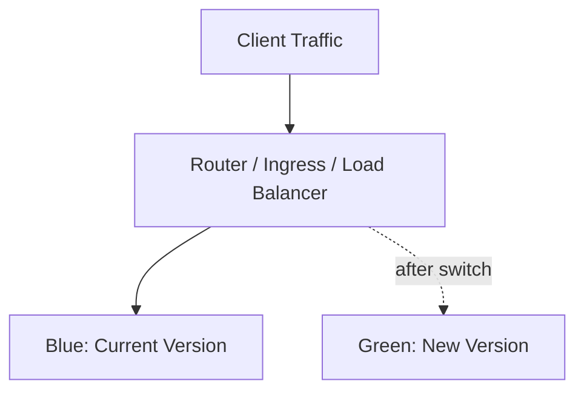

# Part 038 — Deployment Strategy

Part sebelumnya membahas CI/CD untuk containerized services: bagaimana source code menjadi image, image dipromosikan, manifest diperbarui, dan Kubernetes rollout divalidasi.

Part ini membahas deployment strategy. Untuk senior backend engineer, strategi deployment bukan soal memilih istilah populer seperti rolling, blue-green, atau canary. Strategi deployment adalah cara mengendalikan risiko perubahan production.

Risiko deployment muncul dari banyak sumber:

- bug aplikasi,
- schema database tidak kompatibel,
- API contract berubah,
- Kafka/RabbitMQ message format berubah,
- Redis cache format berubah,
- Camunda workflow state tidak kompatibel,
- config/secret salah,
- ingress timeout berubah,
- resource terlalu kecil,
- autoscaling lambat,
- downstream dependency tidak tahan retry baru.

> CSG note: jangan mengasumsikan CSG memakai rolling update saja, Argo Rollouts, Flagger, service mesh, NGINX canary, ALB weighted target group, Application Gateway, feature flag platform, release train, atau deployment approval tertentu. Strategi actual harus diverifikasi di repository, CI/CD pipeline, GitOps controller, Helm/Kustomize values, ingress configuration, runbook, dan diskusi dengan platform/SRE/DevOps/backend/security team.

---

## 1. Core Concept

Deployment strategy menjawab:

```text
Bagaimana versi baru masuk ke production dengan blast radius terkendali?
```

Ada tiga dimensi utama:

1. **Traffic exposure**: berapa banyak user/request/message yang terkena versi baru.
2. **State compatibility**: apakah versi baru kompatibel dengan DB, message, cache, workflow, dan client lama.
3. **Rollback ability**: apakah sistem bisa kembali ke versi lama tanpa data corruption atau customer impact lebih besar.

Strategi yang baik tidak hanya membuat deploy berhasil.

Strategi yang baik membatasi kerusakan saat deploy gagal.

---

## 2. Deployment Strategy Is Risk Management

Perubahan kecil tidak selalu risiko kecil.

Contoh perubahan yang terlihat kecil tetapi berisiko besar:

- mengubah timeout HTTP client,
- mengubah retry count,
- mengubah connection pool size,
- mengubah readiness endpoint,
- mengubah Redis key format,
- mengubah Kafka consumer group,
- mengubah DB index atau migration,
- mengubah ingress path rewrite,
- mengubah serialization field,
- mengubah feature flag default.

Deployment strategy harus dipilih berdasarkan risk profile, bukan kebiasaan.

Pertanyaan awal:

```text
Jika versi ini salah, seberapa cepat kita tahu?
Jika versi ini salah, siapa yang terdampak?
Jika rollback dilakukan, apakah state masih kompatibel?
```

---

## 3. Kubernetes Rolling Update

Rolling update adalah strategi default Deployment Kubernetes.

Mental model:

```text
new ReplicaSet created
new pods start
old pods gradually terminate
Service routes to ready pods
```

Parameter penting:

```yaml
strategy:
  type: RollingUpdate
  rollingUpdate:
    maxUnavailable: 0
    maxSurge: 1
```

`maxUnavailable` mengontrol berapa pod minimum yang boleh hilang.

`maxSurge` mengontrol berapa pod extra yang boleh dibuat selama rollout.

Rolling update cocok untuk:

- stateless REST API,
- backward-compatible change,
- readiness probe akurat,
- resource capacity cukup untuk surge,
- graceful shutdown benar,
- DB/message/cache compatibility terjaga.

Rolling update tidak cukup jika:

- butuh validasi traffic bertahap,
- perubahan schema/message tidak kompatibel,
- satu request salah bisa berdampak finansial besar,
- sulit mendeteksi error dengan cepat,
- startup warmup lama,
- old dan new version tidak boleh berjalan bersamaan.

---

## 4. Rolling Update Failure Modes

Failure mode umum:

| Failure | Cause | Impact |
|---|---|---|
| Rollout stuck | new pod never ready | deployment tidak selesai |
| Capacity drop | maxUnavailable terlalu tinggi | error/latency naik |
| Resource pressure | maxSurge butuh node capacity ekstra | pod pending atau node pressure |
| Mixed-version bug | old/new version tidak kompatibel | data/API/message corruption |
| Readiness false positive | pod ready sebelum benar-benar siap | traffic masuk terlalu cepat |
| Shutdown unsafe | old pod killed saat request/consumer aktif | request gagal, duplicate processing |

Rolling update hanya aman jika readiness dan shutdown benar.

---

## 5. Recreate Strategy

Recreate strategy menghentikan semua pod lama sebelum membuat pod baru.

```yaml
strategy:
  type: Recreate
```

Cocok untuk kasus terbatas:

- old dan new version tidak boleh berjalan bersamaan,
- singleton workload,
- development/test environment,
- maintenance window yang menerima downtime,
- stateful component tertentu dengan operator/runbook khusus.

Tidak cocok untuk REST API production yang membutuhkan availability.

Risiko:

```text
No old pods + new pods not ready = full outage
```

Gunakan Recreate dengan sadar, bukan karena lebih sederhana.

---

## 6. Blue-Green Deployment

Blue-green memiliki dua environment/version aktif secara paralel:

```text
blue  = current production
 green = new version ready but not receiving production traffic yet
```

Switch dilakukan di routing layer.



Cocok untuk:

- butuh fast cutover,
- butuh fast rollback traffic,
- workload stateless,
- environment capacity cukup dua versi,
- smoke test green sebelum cutover,
- routing layer mendukung switch.

Kelemahan:

- butuh resource lebih banyak,
- DB/schema compatibility tetap harus aman,
- cache/session consistency harus dipikirkan,
- traffic switch bisa menyebabkan sudden load,
- rollback traffic tidak rollback side effects.

---

## 7. Blue-Green and Database Compatibility

Blue-green sering disalahpahami sebagai rollback mudah.

Untuk aplikasi stateless saja, rollback routing memang mudah.

Tetapi untuk database:

```text
green writes new schema/data -> switch back to blue -> blue may not understand new data
```

Maka blue-green tetap membutuhkan:

- backward-compatible schema,
- expand/contract migration,
- dual-read/dual-write jika perlu,
- feature flag untuk write path,
- migration rollback analysis,
- data validation.

Blue-green mengontrol traffic.

Blue-green tidak otomatis mengontrol state compatibility.

---

## 8. Canary Deployment

Canary deployment mengekspos versi baru ke sebagian kecil traffic.

Mental model:

```text
95% traffic -> stable
 5% traffic -> canary
```

Canary cocok untuk:

- perubahan logic berisiko,
- perubahan performance,
- perubahan dependency client,
- rollout bertahap ke user segment,
- validasi production traffic nyata,
- ingin mengurangi blast radius.

Canary membutuhkan:

- routing split,
- metric per version,
- log/tracing per version,
- rollback automation/manual yang jelas,
- enough traffic untuk validasi,
- stable baseline.

Canary tanpa observability hanya deployment bertahap tanpa mata.

---

## 9. Canary Metrics

Canary harus dinilai dengan signal yang tepat.

Technical metrics:

- HTTP 5xx rate,
- HTTP 4xx abnormal increase,
- p95/p99 latency,
- timeout rate,
- retry rate,
- CPU throttling,
- memory usage,
- GC pause,
- DB pool saturation,
- downstream error rate,
- pod restart count.

Business/domain metrics:

- quote creation success rate,
- order submission failure rate,
- pricing calculation failure,
- workflow task incident count,
- message processing failure,
- validation error spike,
- customer-visible error.

Canary should not rely only on pod readiness.

Readiness means pod can receive traffic.

It does not mean the release is correct.

---

## 10. Canary Failure Modes

Common failure modes:

| Failure | Cause | Impact |
|---|---|---|
| No per-version metrics | labels missing | cannot compare stable vs canary |
| Canary too small | insufficient traffic | false confidence |
| Canary too large | high blast radius | many users impacted |
| Bad baseline | stable already unhealthy | canary decision noisy |
| Slow failure | bug appears after cache TTL/job interval | canary passes too early |
| State corruption | small traffic writes bad state | rollback insufficient |
| Sticky sessions | users pinned inconsistently | inconsistent behavior |

Canary is powerful only when telemetry and rollback are mature.

---

## 11. Shadow Traffic

Shadow traffic sends copy of production traffic to new version without returning its response to user.

Mental model:

```text
request -> stable -> response to user
       -> shadow copy -> new version response discarded
```

Cocok untuk:

- performance comparison,
- compatibility testing,
- read-only evaluation,
- downstream dependency behavior observation,
- validating parser/serializer logic.

Risiko besar:

```text
Shadow service must not cause side effects.
```

For Java/JAX-RS systems, shadow endpoint must avoid:

- DB writes,
- Kafka/RabbitMQ publish,
- Redis mutation,
- external API side effects,
- Camunda workflow state transition,
- duplicate audit events.

Shadow traffic is not safe unless side effects are controlled.

---

## 12. A/B Routing

A/B routing sends different user/request segments to different behavior or version.

Common segmentation:

- customer group,
- tenant,
- region,
- account type,
- header/cookie,
- feature flag cohort,
- percentage bucket.

A/B is useful for product experiments.

But for backend enterprise systems, be careful:

- regulatory consistency may matter,
- quote/order behavior must be explainable,
- downstream state can diverge,
- customer support complexity increases,
- audit trail must identify variant.

A/B routing is not just deployment strategy.

It can become business logic governance.

---

## 13. Feature Flags

Feature flags decouple deployment from activation.

```text
deploy code disabled
validate runtime
enable feature gradually
rollback by disabling flag
```

Feature flags are useful for:

- risky business logic,
- progressive enablement,
- tenant-based rollout,
- kill switch,
- emergency disable,
- dark launch.

Risks:

- flag debt,
- unclear default,
- inconsistent config across pods,
- stale flags,
- hidden branching complexity,
- untested flag combinations,
- flag changes bypass deployment review.

A feature flag is production control plane.

Treat it like config with audit, ownership, and rollback rules.

---

## 14. Kill Switch

Kill switch is a fast disable mechanism for dangerous behavior.

Examples:

- disable new pricing algorithm,
- disable external API integration,
- disable Kafka producer path,
- pause consumer processing,
- reject high-risk workflow action,
- fallback to cached reference data,
- disable non-critical background job.

A useful kill switch must be:

- fast,
- documented,
- observable,
- access-controlled,
- audited,
- tested,
- scoped.

Bad kill switch:

```text
Nobody knows it exists.
Nobody knows who can use it.
Nobody knows what side effects it has.
```

---

## 15. Progressive Delivery

Progressive delivery combines deployment automation, traffic shifting, metric evaluation, and rollback.

Typical flow:

```text
rollout 5%
observe metrics
rollout 25%
observe metrics
rollout 50%
observe metrics
rollout 100%
```

Tools may include:

- Argo Rollouts,
- Flagger,
- service mesh,
- ingress controller canary,
- cloud load balancer weighted routing,
- custom pipeline gates.

The tool is less important than the control loop:

```text
increase exposure only when signal is healthy
```

---

## 16. Argo Rollouts Awareness

Argo Rollouts extends Kubernetes rollout strategies.

Common concepts:

- Rollout resource,
- canary strategy,
- blueGreen strategy,
- analysis template,
- analysis run,
- traffic routing integration,
- pause step,
- abort,
- promote.

Example mental model:

```text
Rollout controller manages ReplicaSets and traffic weights based on steps and analysis.
```

Risks to review:

- metric query correctness,
- analysis threshold,
- pause duration,
- traffic router integration,
- rollback behavior,
- manual promotion permission,
- version labels for observability.

Do not adopt advanced rollout controller without metric maturity.

---

## 17. Flagger Awareness

Flagger automates progressive delivery with service mesh, ingress, or provider integrations.

Mental model:

```text
new version detected
traffic gradually shifted
metrics checked
promotion or rollback
```

Review concerns:

- metric provider configured,
- thresholds realistic,
- interval and step weight appropriate,
- traffic provider integration correct,
- alerting clear,
- rollback semantics known,
- application metrics meaningful.

Flagger can automate bad decisions if metrics are wrong.

Automation magnifies signal quality.

---

## 18. Ingress-Based Canary

Some ingress controllers support canary routing.

Examples of routing dimensions:

- weight,
- header,
- cookie,
- host/path,
- annotation-based routing.

Concerns:

- source of truth for canary config,
- conflict between ingress rules,
- session affinity behavior,
- TLS/backend protocol consistency,
- observability per backend,
- rollback by removing canary rule,
- cache/CDN interaction.

Ingress canary is useful for HTTP services.

It does not directly solve async consumer rollout.

---

## 19. Async Consumer Deployment Strategy

Kafka/RabbitMQ consumers need different thinking.

REST canary shifts request traffic.

Consumer canary shifts message processing.

Options:

- reduce replica count,
- deploy new consumer group for shadow read,
- route subset of queues/topics,
- use partition assignment carefully,
- use feature flag inside consumer,
- use DLQ/retry isolation,
- deploy new version to non-critical tenant/topic first.

Risks:

- duplicate processing,
- out-of-order processing,
- offset commit incompatibility,
- poison message loop,
- schema incompatibility,
- side effects cannot be undone.

Consumer deployment strategy must include idempotency and rollback analysis.

---

## 20. Database-Aware Deployment Strategy

Database compatibility determines whether rollback is real.

Safe pattern:

```text
expand -> deploy compatible app -> migrate/backfill -> switch -> contract later
```

Avoid:

```text
rename/drop column and deploy app simultaneously
```

Questions:

- Can old app run with new schema?
- Can new app run with old schema during rollout?
- Are migrations idempotent?
- Can migration be paused?
- Does migration lock large tables?
- Is rollback app-only or data rollback too?
- Is there a backfill job?
- Is there monitoring for migration progress?

Deployment strategy without schema strategy is incomplete.

---

## 21. Redis and Cache-Aware Deployment Strategy

Redis can break rollback through cache format changes.

Risk examples:

- new app writes new JSON format,
- old app cannot deserialize,
- TTL changed too long,
- lock key changed,
- cache invalidation missed,
- hot key behavior changes,
- cache warmup causes DB surge.

Mitigation:

- versioned cache keys,
- dual-read fallback,
- short TTL during transition,
- safe cache invalidation,
- rollback-compatible serialization,
- monitor Redis memory and command latency,
- avoid mass cache flush unless approved.

Cache is state.

Treat it as part of deployment compatibility.

---

## 22. Camunda/Workflow-Aware Deployment Strategy

Workflow systems are long-running.

A rollout may affect process instances created days or weeks earlier.

Risks:

- worker no longer handles old task variables,
- process version mismatch,
- job retry behavior changes,
- external task lock duration changes,
- incident count spikes,
- compensation logic changes,
- non-idempotent worker retries side effect.

Strategies:

- version workers if needed,
- keep backward compatibility for old process instances,
- rollout workers gradually,
- observe task failure by type/version,
- maintain kill switch/pause mechanism,
- validate process migration separately.

Workflow deployment strategy must account for time.

Not all active state was created by the latest code.

---

## 23. Deployment Metrics and Rollback Signals

Rollback signal must be defined before deployment.

Examples:

```text
HTTP 5xx > baseline + threshold for 5 minutes
p99 latency > SLO threshold
readiness failure > threshold
pod restart count increasing
DB pool saturation > threshold
Kafka consumer lag increasing unexpectedly
RabbitMQ queue depth increasing unexpectedly
workflow incidents spike
business success rate drops
customer-impact alert fires
```

Good rollback signal is:

- measurable,
- timely,
- tied to customer/business impact,
- scoped to version,
- actionable,
- not too noisy.

Bad rollback signal:

```text
People feel something is wrong.
```

Human intuition helps, but production control should use evidence.

---

## 24. Blast Radius Control

Blast radius is the amount of damage a bad deploy can cause.

Control dimensions:

- percentage of traffic,
- tenant/customer cohort,
- region/zone,
- namespace/environment,
- replica count,
- queue/topic subset,
- feature flag scope,
- write path enabled/disabled,
- downstream call enabled/disabled,
- time window.

Example:

```text
Deploy to one region, 5% traffic, read-only path, non-critical tenants first.
```

For mission-critical systems, blast radius should be intentionally designed, not accidental.

---

## 25. Deployment Strategy Selection Matrix

| Strategy | Best For | Avoid When | Key Requirement |
|---|---|---|---|
| Rolling update | low/medium risk stateless service | incompatible old/new versions | readiness + graceful shutdown |
| Recreate | singleton or downtime-tolerant service | high availability required | maintenance window |
| Blue-green | fast cutover/rollback | state incompatibility unresolved | double capacity + routing switch |
| Canary | risky changes with measurable signals | no per-version observability | traffic split + metrics |
| Shadow | read-only behavior validation | side effects cannot be suppressed | side-effect isolation |
| A/B | product experiment/cohort behavior | regulated consistency required | audit + cohort control |
| Feature flag | decouple deploy/activation | flag governance absent | audited config control |
| Progressive delivery | mature platform automation | poor metrics | automated analysis |

No strategy is universally best.

The right strategy matches risk, observability, and rollback reality.

---

## 26. Java/JAX-RS Specific Concerns

For Java/JAX-RS services, review:

- server startup time,
- JVM warmup,
- JIT warmup,
- connection pool initialization,
- readiness timing,
- thread pool sizing,
- graceful shutdown,
- HTTP keep-alive behavior,
- request timeout behavior,
- serialization compatibility,
- OpenAPI/client compatibility,
- structured logs with version labels,
- metrics per endpoint/version.

JVM services can appear ready before performance stabilizes.

Canary and rollout should account for warmup and first-request latency.

---

## 27. Resource and Capacity Concerns

Deployment strategy affects capacity.

Rolling update with surge requires extra capacity.

Blue-green may require near double capacity.

Canary may require parallel stable and canary workloads.

If cluster lacks capacity:

- pod pending,
- node autoscaling delay,
- old pods terminated before new capacity ready,
- latency spike,
- CPU throttling,
- OOMKilled,
- noisy neighbor effects.

Before rollout, check:

- current node utilization,
- requested vs available CPU/memory,
- HPA behavior,
- Cluster Autoscaler/Karpenter/node pool scaling,
- PDB constraints,
- topology spread constraints,
- quota.

Deployment strategy without capacity planning can create outage even when code is correct.

---

## 28. Security and Privacy Concerns

Deployment can introduce security/privacy changes:

- new secret reference,
- broader RBAC,
- new egress path,
- new ingress exposure,
- changed TLS behavior,
- new log fields containing PII,
- changed auth filter,
- changed cloud IAM role,
- new sidecar,
- new image base.

Deployment strategy should not hide these changes inside a routine rollout.

High-risk security changes may require:

- separate PR,
- security review,
- staged rollout,
- audit evidence,
- rollback plan,
- runtime verification.

Canary does not protect privacy if even one request leaks sensitive data.

For privacy-sensitive changes, prevention is more important than gradual exposure.

---

## 29. EKS Deployment Strategy Concerns

In EKS, rollout behavior may involve:

- AWS Load Balancer Controller,
- ALB target group health,
- NLB connection behavior,
- target type instance vs IP,
- security groups,
- Route 53 DNS cutover,
- ACM certificate,
- CloudWatch metrics/logs,
- Karpenter/Cluster Autoscaler capacity,
- node group availability zones.

For blue-green/canary, verify:

- traffic splitting mechanism,
- target group health checks,
- deregistration delay,
- source IP preservation,
- ingress annotations,
- rollback route update,
- CloudWatch metric labels.

EKS deployment strategy is partly Kubernetes and partly AWS networking/load balancing.

---

## 30. AKS Deployment Strategy Concerns

In AKS, rollout behavior may involve:

- Azure Load Balancer,
- Application Gateway,
- AGIC,
- Azure Front Door if used,
- Azure DNS,
- Private DNS Zone,
- NSG/UDR,
- Azure Monitor,
- node pool scaling,
- Managed Identity/Workload Identity,
- ACR pull behavior.

For canary/blue-green, verify:

- routing layer capability,
- health probe behavior,
- backend pool update timing,
- source IP/header behavior,
- certificate/TLS behavior,
- Azure Monitor metric labels,
- rollback route update.

Do not assume the same annotations or traffic behavior as EKS/NGINX.

---

## 31. On-Prem and Hybrid Deployment Concerns

On-prem/hybrid deployment often has stricter constraints:

- load balancer integration may be custom,
- DNS propagation may be slow/manual,
- internal CA trust matters,
- firewall/proxy can affect new version,
- registry replication may lag,
- capacity may be fixed,
- maintenance windows may be mandatory,
- rollback may require coordination with network/platform team.

For hybrid traffic:

- cloud-to-on-prem calls,
- on-prem-to-cloud calls,
- private endpoint calls,
- VPN/Direct Connect/ExpressRoute paths,
- corporate proxy,
- split-horizon DNS.

A deployment can fail because the new version calls a different hostname, port, certificate chain, or endpoint path.

---

## 32. Deployment Anti-Patterns

Avoid these:

- using rolling update for incompatible schema change,
- canary without per-version metrics,
- blue-green while sharing non-compatible database writes,
- shadow traffic with side effects enabled,
- feature flag without audit trail,
- kill switch never tested,
- rollback plan that ignores database/message/cache state,
- deploying app, ingress, DB migration, RBAC, and NetworkPolicy in one large PR,
- changing resource limits and app logic together without observing impact,
- treating readiness as business correctness,
- assuming Kubernetes rollout success equals release success.

Kubernetes can successfully roll out a broken business change.

---

## 33. Production-Safe Deployment Review Flow

Before deployment, ask:

1. What changed?
2. What state does it read/write?
3. Is it backward-compatible?
4. What strategy is used?
5. What blast radius is expected?
6. What metrics prove health?
7. What signal triggers rollback?
8. How fast can rollback happen?
9. What cannot be rolled back?
10. Who owns decision during incident?

During deployment, observe:

- rollout status,
- pod readiness,
- ingress/service health,
- error rate,
- latency,
- dependency metrics,
- queue lag/depth,
- DB pool and query health,
- business KPIs,
- logs/traces by version.

After deployment, verify:

- stable metrics,
- no delayed error pattern,
- no queue backlog,
- no workflow incident spike,
- no customer-impact ticket spike,
- no resource saturation,
- no security/privacy alert.

---

## 34. Failure Mode Debugging

If rollout fails:

```bash
kubectl rollout status deployment/<name> -n <namespace>
kubectl describe deployment/<name> -n <namespace>
kubectl get rs -n <namespace>
kubectl get pods -n <namespace> -l app=<app>
kubectl describe pod <pod> -n <namespace>
kubectl logs <pod> -n <namespace>
```

Then check:

- image pull,
- pod scheduling,
- config/secret mount,
- startup logs,
- readiness/liveness events,
- resource pressure,
- service endpoints,
- ingress backend health,
- application dependency errors,
- GitOps sync status,
- migration job result.

Do not debug only from Deployment status.

Deployment status is a symptom aggregator.

---

## 35. Internal Verification Checklist

For CSG/team verification, check:

- Default deployment strategy for Java/JAX-RS services.
- RollingUpdate maxUnavailable/maxSurge standards.
- Readiness/liveness/startup probe standards.
- Graceful shutdown standard.
- Blue-green support if any.
- Canary support if any.
- Argo Rollouts usage if any.
- Flagger usage if any.
- NGINX ingress canary usage if any.
- Service mesh usage if any.
- Feature flag platform if any.
- Kill switch pattern if any.
- Smoke test process.
- Canary metrics.
- Rollback procedure.
- Rollback approval path.
- Database migration strategy.
- Kafka/RabbitMQ consumer rollout strategy.
- Redis/cache compatibility practice.
- Camunda/workflow deployment practice.
- EKS/AKS/on-prem traffic routing mechanism.
- Dashboard for per-version metrics.
- Incident notes from failed deployments.
- Change management requirement.
- Production freeze/maintenance window policy.

---

## 36. PR Review Checklist

When reviewing deployment strategy changes, ask:

- Is the selected strategy appropriate for the risk?
- Is the change backward-compatible?
- Can old and new versions run together?
- Is database schema compatible with rollback?
- Are message formats compatible?
- Are Redis keys/cache values compatible?
- Are workflow workers compatible with existing instances?
- Is readiness accurate?
- Is graceful shutdown implemented?
- Are resource/capacity requirements understood?
- Are rollout metrics defined?
- Are rollback signals defined?
- Is blast radius limited?
- Is ingress/load balancer behavior understood?
- Are EKS/AKS/on-prem differences accounted for?
- Is the deployment observable by version?
- Is rollback realistic or only theoretical?

---

## 37. Senior Engineer Mental Model

Deployment strategy is not a YAML preference.

It is a production risk model.

A weak review asks:

```text
Will Kubernetes roll this out?
```

A stronger review asks:

```text
What happens if this version is wrong?
How many users are impacted before we know?
Can we stop the damage?
Can we rollback safely?
What state might already be changed?
```

For enterprise Java/JAX-RS systems, deployment strategy must account for REST traffic, database schema, asynchronous messages, cache state, workflow lifecycle, ingress behavior, cloud networking, observability, and human incident response.

A good deployment strategy does not guarantee there will be no bugs.

It ensures bugs do not automatically become major incidents.
