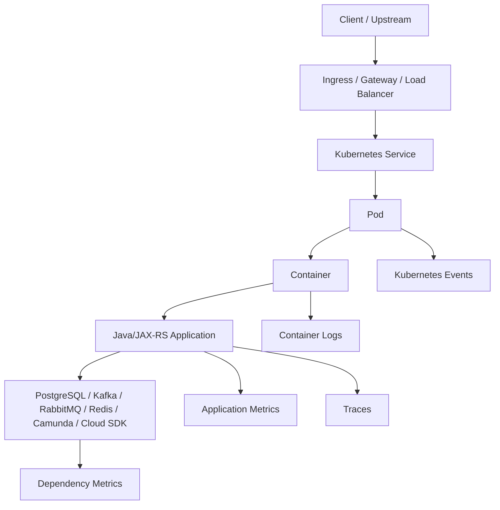
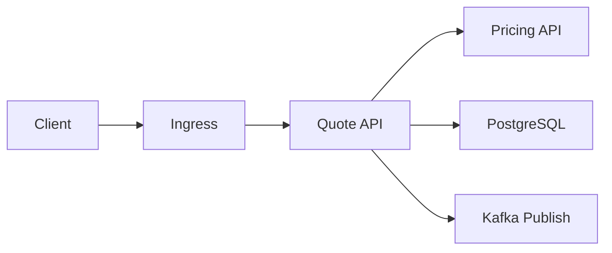

# Part 039 — Observability in Kubernetes

Part sebelumnya membahas deployment strategy: bagaimana versi baru masuk ke production dengan blast radius, rollback signal, dan exposure yang terkendali.

Part ini membahas observability di Kubernetes. Untuk senior backend engineer, observability bukan sekadar "punya log" atau "punya dashboard". Observability adalah kemampuan menjawab pertanyaan production dengan bukti:

```text
Apa yang terjadi?
Di mana terjadi?
Sejak kapan?
Berapa besar dampaknya?
Komponen mana yang berubah?
Apakah masalah ada di aplikasi, pod, node, network, dependency, atau cloud service?
```

Tanpa observability, incident berubah menjadi tebak-tebakan. Dengan observability yang benar, debugging menjadi proses eliminasi yang terstruktur.

> CSG note: jangan mengasumsikan stack observability internal CSG. Bisa saja memakai Prometheus/Grafana, OpenTelemetry, CloudWatch, Azure Monitor, ELK/OpenSearch, Splunk, Datadog, New Relic, Dynatrace, Fluent Bit, Fluentd, Loki, Tempo, Jaeger, atau kombinasi lain. Semua detail actual harus diverifikasi di repository, Helm values, platform documentation, dashboard, alert rule, incident notes, dan diskusi dengan platform/SRE/DevOps/security/backend team.

---

## 1. Core Concept

Observability adalah kemampuan memahami state internal sistem dari output eksternal.

Di Kubernetes, output eksternal utama adalah:

1. **Logs**: apa yang aplikasi dan platform tulis sebagai event tekstual.
2. **Metrics**: angka time-series yang menunjukkan kondisi sistem.
3. **Traces**: perjalanan request lintas service.
4. **Events**: sinyal lifecycle Kubernetes seperti scheduling, image pull, probe failure, eviction, dan rollout.
5. **Profiles**: informasi runtime detail seperti CPU, memory allocation, thread, GC, lock contention jika tersedia.
6. **Audit logs**: siapa mengubah apa dan kapan.

Senior engineer tidak hanya menanyakan "log error-nya apa?".

Senior engineer menanyakan:

```text
Signal apa yang membuktikan root cause?
Signal apa yang membuktikan customer impact?
Signal apa yang membuktikan mitigation berhasil?
```

---

## 2. Kubernetes Observability Mental Model

Kubernetes workload punya beberapa lapisan observability.



A production symptom can originate from any layer:

| Symptom | Possible Layer |
|---|---|
| HTTP 503 | ingress, service, readiness, pod crash, endpoint absence |
| HTTP 504 | ingress timeout, downstream timeout, DB slow query, message broker stall |
| latency spike | JVM GC, CPU throttling, DB lock, queue lag, network path, DNS |
| pod restart | OOMKilled, liveness failure, crash, node eviction |
| no logs | app not starting, log collector failure, stdout/stderr misuse, RBAC/logging config |
| metrics missing | scrape config, ServiceMonitor, port mismatch, auth, endpoint path issue |

Observability harus membantu membedakan lapisan ini.

---

## 3. Logs: Container Logs and Pod Logs

Container di Kubernetes sebaiknya menulis log ke `stdout` dan `stderr`.

Mental model:

```text
application writes stdout/stderr
container runtime captures stream
kubelet exposes logs
log agent ships logs
central log backend stores/searches logs
```

Command dasar:

```bash
kubectl logs deployment/quote-service -n quote-order
kubectl logs pod/quote-service-abc123 -n quote-order
kubectl logs pod/quote-service-abc123 -n quote-order -c app
kubectl logs pod/quote-service-abc123 -n quote-order --previous
```

`--previous` penting untuk CrashLoopBackOff karena container lama sudah mati dan container baru sedang restart.

### Logging rules untuk Java/JAX-RS service

Log production harus:

- structured jika platform mendukung JSON logs,
- memiliki timestamp yang konsisten,
- memiliki level yang benar,
- memiliki correlation ID / request ID,
- memiliki service name, environment, version, pod name,
- tidak membocorkan secret, token, PII, credential, auth header,
- tidak terlalu noisy,
- cukup detail untuk debugging tanpa restart dengan debug mode.

Contoh structured log field yang berguna:

```json
{
  "timestamp": "2026-07-11T10:15:30.123Z",
  "level": "ERROR",
  "service": "quote-service",
  "version": "1.42.7",
  "environment": "prod",
  "pod": "quote-service-7dd9d7d7c5-r9xqz",
  "traceId": "8d2f...",
  "spanId": "4ac...",
  "correlationId": "REQ-20260711-001",
  "customerImpact": false,
  "operation": "createQuote",
  "errorType": "DownstreamTimeout",
  "message": "Pricing service timed out"
}
```

### Logging anti-patterns

| Anti-pattern | Why Dangerous |
|---|---|
| log only human prose | sulit query dan aggregate |
| no correlation ID | sulit trace request lintas service |
| stacktrace tanpa context | error ada, business operation tidak jelas |
| log secret/env dump | data leakage |
| debug log always enabled | cost tinggi, noise tinggi |
| swallowing exception | failure tidak terlihat |
| logging every request body | PII/security/cost risk |
| relying only on logs | tidak cukup untuk latency, saturation, trend |

---

## 4. Metrics: The Production Control Surface

Metrics menjawab pertanyaan kuantitatif:

```text
Berapa banyak?
Berapa cepat?
Berapa lama?
Berapa sering gagal?
Berapa penuh?
Apakah memburuk?
```

Untuk Kubernetes workload, metrics perlu dibagi menjadi beberapa kategori.

### Golden signals untuk API service

| Signal | Example |
|---|---|
| Traffic | request per second per route/status |
| Errors | 5xx rate, 4xx rate, exception count |
| Latency | p50/p95/p99 request duration |
| Saturation | CPU, memory, connection pool, queue size, thread pool |

### Kubernetes workload metrics

| Metric | Why It Matters |
|---|---|
| pod restart count | crash, OOM, liveness failure |
| CPU usage vs request | capacity and HPA behavior |
| CPU throttling | latency spikes despite low average CPU |
| memory working set | OOM risk |
| container OOM events | fatal memory pressure |
| pod ready count | serving capacity |
| deployment desired/available replicas | rollout and availability |
| HPA desired replicas | scaling signal |
| node pressure | cluster-level risk |

### JVM metrics

Java service perlu metrics runtime:

- heap used/committed/max,
- non-heap memory,
- metaspace,
- direct buffer memory if available,
- GC pause count and duration,
- thread count,
- deadlock indicator,
- class loading,
- file descriptor usage,
- HTTP server worker pool,
- connection pool usage,
- executor queue depth.

JVM memory issue sering tidak terlihat dari heap saja.

```text
container memory = heap + metaspace + direct memory + thread stacks + JIT + native libs + allocator overhead
```

### Dependency metrics

Java/JAX-RS service jarang gagal sendirian. Ia sering gagal karena dependency.

| Dependency | Metrics |
|---|---|
| PostgreSQL | connection pool active/idle, wait time, query latency, lock wait, error count |
| Kafka | consumer lag, poll duration, rebalance count, commit latency, processing latency |
| RabbitMQ | queue depth, unacked messages, consumer count, publish/consume rate, redelivery |
| Redis | command latency, connection count, timeout, hit ratio, eviction |
| Camunda | job acquisition latency, failed jobs, external task lock failures, incident count |
| NGINX/Ingress | request rate, 4xx/5xx, upstream latency, upstream reset, timeout |

---

## 5. Prometheus and Grafana Awareness

Prometheus biasanya menarik metrics dari endpoint HTTP.

Mental model:

```text
application exposes /metrics
Prometheus scrapes endpoint
Prometheus stores time-series
Grafana visualizes query
Alertmanager routes alerts
```

Dalam Kubernetes, scrape biasanya dikonfigurasi melalui:

- annotation,
- ServiceMonitor,
- PodMonitor,
- scrape config static,
- operator-specific custom resource.

Contoh concern:

```text
Service port name salah -> Prometheus tidak scrape.
Metrics path salah -> series missing.
Readiness port beda dengan metrics port -> dashboard kosong.
Cardinality terlalu tinggi -> Prometheus memory meledak.
```

### Cardinality risk

Cardinality adalah jumlah kombinasi label.

Label berbahaya:

- user ID,
- account ID,
- quote ID,
- order ID,
- request ID,
- trace ID,
- raw URL dengan path parameter,
- exception message yang mengandung value dinamis.

Metric seperti ini berbahaya:

```text
http_requests_total{quoteId="Q-123456789"}
```

Lebih aman:

```text
http_requests_total{route="/quotes/{quoteId}", method="GET", status="200"}
```

High cardinality bisa membuat observability platform mahal, lambat, atau down.

---

## 6. OpenTelemetry and Distributed Tracing

Tracing menjawab:

```text
Request ini melewati service mana saja dan waktu habis di mana?
```

Trace berguna untuk:

- latency across microservices,
- dependency timeout,
- fan-out request,
- retry amplification,
- circular call,
- missing correlation between ingress and backend,
- DB/message/cloud SDK timing.

Mental model:



Setiap hop menjadi span.

Untuk Java service, pastikan:

- incoming HTTP headers dipropagate,
- outgoing HTTP client membawa trace context,
- Kafka/RabbitMQ message membawa correlation/trace context jika pattern mendukung,
- asynchronous boundary ditangani eksplisit,
- trace sampling dipahami,
- sensitive data tidak masuk span attributes.

### Trace anti-patterns

| Anti-pattern | Impact |
|---|---|
| trace hanya di ingress | backend latency tetap gelap |
| no propagation to outbound client | trace terputus |
| no correlation ID in logs | sulit bridge logs dan traces |
| sampling terlalu rendah | incident rare hilang |
| span attribute mengandung PII | privacy risk |
| trace every payload | cost/security risk |

---

## 7. Kubernetes Events

Kubernetes events adalah sinyal control-plane dan kubelet.

Command:

```bash
kubectl get events -n quote-order --sort-by=.lastTimestamp
kubectl describe pod quote-service-abc123 -n quote-order
```

Events penting untuk:

- FailedScheduling,
- FailedMount,
- FailedPull,
- BackOff,
- Unhealthy probe,
- Killing container,
- Evicted,
- ScalingReplicaSet,
- SuccessfulCreate,
- FailedCreate.

Events sering lebih jujur daripada log aplikasi ketika container belum sempat start.

Contoh:

```text
Warning  FailedScheduling  default-scheduler  0/12 nodes are available: insufficient memory
Warning  BackOff           kubelet            Back-off restarting failed container
Warning  Unhealthy         kubelet            Readiness probe failed: HTTP probe failed with statuscode: 503
```

---

## 8. Kubernetes Dashboard Design

Dashboard production harus menjawab pertanyaan operasional, bukan hanya terlihat bagus.

Minimal dashboard untuk service Java/JAX-RS:

1. **Availability panel**
   - ready replicas,
   - desired replicas,
   - pod restart count,
   - rollout status.

2. **Traffic panel**
   - RPS,
   - status code distribution,
   - route-level latency.

3. **Latency panel**
   - p50/p95/p99,
   - upstream latency,
   - dependency latency.

4. **Error panel**
   - exception rate,
   - 5xx rate,
   - downstream error rate.

5. **Resource panel**
   - CPU usage vs request,
   - CPU throttling,
   - memory usage vs limit,
   - GC pause.

6. **Dependency panel**
   - DB pool saturation,
   - Kafka/RabbitMQ lag/queue depth,
   - Redis timeout,
   - cloud SDK error/latency.

7. **Deployment panel**
   - app version,
   - image digest,
   - rollout event,
   - error/latency after deploy.

8. **SLO panel**
   - availability SLI,
   - latency SLI,
   - error budget burn if used.

---

## 9. Alerting Strategy

Alerting harus actionable.

Alert yang baik memiliki:

- customer impact atau leading indicator yang kuat,
- threshold yang jelas,
- duration untuk menghindari flapping,
- owner yang jelas,
- runbook link,
- severity yang masuk akal,
- deduplication,
- routing yang benar.

Bad alert:

```text
CPU > 80% for 1 minute
```

Bisa noisy dan tidak selalu customer-impacting.

Better alert:

```text
p95 latency > SLO threshold for 10 minutes AND traffic > minimum threshold
```

atau:

```text
ready replicas < desired replicas for 5 minutes in prod
```

atau:

```text
Kafka consumer lag increasing for 15 minutes AND oldest message age > business SLA
```

### Alert categories

| Category | Example |
|---|---|
| Page immediately | customer-facing outage, severe error budget burn, no ready pods |
| Ticket soon | sustained warning, capacity trend, certificate expiry |
| Dashboard only | expected deploy transient, low-traffic noise |

---

## 10. Observability for Rollout and Rollback

Deployment strategy dari Part 038 membutuhkan observability signal.

Sebelum deploy, pastikan ada baseline:

- current error rate,
- current p95/p99 latency,
- current traffic,
- current resource usage,
- current dependency health.

Saat deploy, monitor:

- new pod readiness,
- old pod termination,
- version label distribution,
- 5xx rate,
- latency by version,
- logs by version,
- restart count,
- CPU/memory changes,
- downstream errors.

Setelah rollback, buktikan:

```text
error rate turun
latency kembali normal
ready replicas stabil
no new restarts
queue lag berhenti naik
customer-impacting symptom berhenti
```

Rollback tanpa observability hanya berharap.

---

## 11. Java/JAX-RS Impact

Untuk JAX-RS service, observability harus dikaitkan ke resource method dan operation business.

Contoh label yang berguna:

- route template,
- HTTP method,
- status code,
- exception class,
- operation name,
- downstream service name,
- tenant/region jika aman dan bounded,
- version,
- pod,
- namespace,
- environment.

Contoh concern:

```text
GET /quotes/{quoteId} p99 latency naik
POST /orders 5xx naik
PricingClient timeout naik
DB connection pool wait meningkat
Kafka publish latency naik
```

Bukan hanya:

```text
service lambat
```

### Thread pool observability

Java server biasanya punya worker pool.

Pantau:

- active threads,
- queue depth,
- max thread utilization,
- rejected execution,
- request timeout,
- blocked thread indicator if available.

Jika thread pool penuh, readiness bisa tetap true tapi service sebenarnya saturating.

---

## 12. PostgreSQL, Kafka, RabbitMQ, Redis, Camunda, and NGINX Impact

### PostgreSQL

Observability wajib:

- connection pool active/idle/max,
- wait time for connection,
- query duration,
- slow query count,
- lock wait,
- deadlock,
- transaction duration,
- database error count.

Failure signal:

```text
HTTP latency naik + DB pool wait naik = likely DB saturation/pool issue
```

### Kafka

Observability wajib:

- consumer lag,
- oldest message age,
- rebalance count,
- poll duration,
- processing duration,
- commit failure,
- producer error,
- delivery latency.

Failure signal:

```text
consumer lag naik + pod CPU throttling = consumer under-capacity
```

### RabbitMQ

Observability wajib:

- queue depth,
- unacked messages,
- consumer count,
- redelivery rate,
- dead letter count,
- publish/consume rate.

Failure signal:

```text
unacked naik + consumer restarts = unsafe shutdown or processing stall
```

### Redis

Observability wajib:

- command latency,
- timeout count,
- connection pool saturation,
- hit/miss ratio,
- evictions,
- memory usage.

Failure signal:

```text
cache timeout naik + HTTP p99 naik = Redis dependency influencing API latency
```

### Camunda-like workflow dependencies

Observability wajib:

- job acquisition latency,
- failed job count,
- external task lock failure,
- incident count,
- worker processing duration,
- retry/dead-letter-like state.

Failure signal:

```text
worker pods healthy + failed jobs increasing = business/process failure, not pod failure
```

### NGINX / Ingress

Observability wajib:

- request rate,
- status codes,
- upstream latency,
- upstream connection error,
- timeout,
- TLS handshake error,
- backend selection.

Failure signal:

```text
ingress 504 + backend request log absent = request may not reach app
```

---

## 13. EKS, AKS, On-Prem, and Hybrid Concerns

### EKS

Verify actual usage, but common observability integration may include:

- CloudWatch logs,
- CloudWatch Container Insights,
- Prometheus on EKS,
- AWS Load Balancer Controller metrics/logs,
- ALB/NLB target health,
- VPC Flow Logs,
- Route 53 health/DNS observations,
- EKS add-on status,
- Karpenter/Cluster Autoscaler logs.

EKS-specific failure to observe:

```text
ALB target unhealthy while pod readiness is true
```

This points to mismatch among health check path, port, target type, SG, or readiness behavior.

### AKS

Verify actual usage, but common observability integration may include:

- Azure Monitor,
- Container Insights,
- Log Analytics,
- Application Gateway logs,
- Azure Load Balancer metrics,
- NSG flow logs if enabled,
- ACR pull events,
- node pool health,
- Managed Identity / Workload Identity failure logs.

AKS-specific failure to observe:

```text
Application Gateway returns 502 while service endpoints exist
```

This can involve AGIC, backend health probe, NSG, route, port, or TLS config.

### On-prem

On-prem observability must explicitly cover:

- node health,
- control plane health,
- internal load balancer,
- storage backend,
- DNS,
- certificate expiry,
- internal registry,
- air-gapped update process,
- log retention.

### Hybrid

Hybrid observability must correlate:

- Kubernetes pod metrics,
- firewall/proxy logs,
- VPN/Direct Connect/ExpressRoute health,
- private DNS resolution,
- TLS handshake failures,
- MTU/fragmentation symptoms,
- cross-region/cross-site latency.

---

## 14. Failure Modes

| Failure Mode | Detection Signal | Typical Debug Direction |
|---|---|---|
| Logs missing | no pod logs in backend | stdout/stderr, log agent, label, namespace, collector |
| Metrics missing | dashboard gap | scrape config, ServiceMonitor, port, path, auth |
| Trace broken | partial spans | propagation header, async boundary, SDK instrumentation |
| Alert noisy | frequent non-actionable pages | threshold, duration, severity, aggregation |
| Cardinality explosion | Prometheus/log backend cost or instability | label design, route normalization |
| Incident blind spot | symptom seen by user but no dashboard signal | missing SLI/SLO, missing dependency metric |
| False health | readiness true but users fail | health endpoint too shallow |
| Rollback uncertainty | cannot prove mitigation worked | missing versioned metrics/logs |

---

## 15. Debugging Observability Itself

Sometimes the observability system is the broken part.

Checklist:

```bash
kubectl get pods -n observability
kubectl get svc -n observability
kubectl get servicemonitor -A
kubectl describe pod <log-agent-pod> -n <namespace>
kubectl logs <log-agent-pod> -n <namespace>
```

Questions:

- Is the app exposing metrics?
- Is the metrics endpoint reachable from the scraper?
- Is the correct namespace selected?
- Are labels expected by the scraper present?
- Is the log agent running on the node?
- Are logs written to stdout/stderr?
- Is the dashboard filtering the wrong namespace/version?
- Is sampling hiding traces?
- Is retention too short for postmortem?

---

## 16. Internal Verification Checklist

For CSG/team verification, check:

- observability stack used for logs,
- observability stack used for metrics,
- observability stack used for traces,
- whether OpenTelemetry is used,
- log format standard,
- required correlation ID / trace ID standard,
- PII and secret logging policy,
- Kubernetes events retention,
- dashboard location,
- alert rule repository,
- runbook link convention,
- ServiceMonitor/PodMonitor usage,
- metrics endpoint path and port,
- JVM metrics exposure,
- HTTP route metrics,
- DB connection pool metrics,
- Kafka/RabbitMQ/Redis/Camunda metrics,
- ingress/load balancer metrics,
- CloudWatch/Azure Monitor integration,
- log retention duration,
- trace retention duration,
- alert severity mapping,
- on-call routing,
- incident postmortem examples,
- production debugging access policy.

---

## 17. PR Review Checklist

When reviewing a PR that changes workload behavior, ask:

- Does the new code add or preserve correlation ID propagation?
- Are new endpoints covered by metrics?
- Are route labels normalized?
- Are new dependency calls measured?
- Are timeouts and retries observable?
- Are error logs structured and actionable?
- Could logs leak PII, token, secret, or request payload?
- Does the deployment expose the metrics port/path?
- Does Helm/Kustomize include monitor resources if required?
- Are alert thresholds updated if workload behavior changes?
- Can we detect rollback success?
- Can we distinguish app error from ingress/service/network/dependency error?
- Are dashboard panels version-aware during rollout?
- Is cardinality bounded?

---

## 18. Senior Engineer Mental Model

A junior debugging pattern:

```text
Look at logs until something obvious appears.
```

A senior debugging pattern:

```text
Build a hypothesis from symptoms.
Select the signal that can confirm or falsify it.
Use logs, metrics, traces, and events together.
Reduce blast radius before deep debugging.
Prove mitigation with measurable recovery.
```

Observability is not a dashboard project.

Observability is production reasoning infrastructure.

---

## 19. Summary

Key takeaways:

- Logs explain events; metrics quantify behavior; traces connect hops; Kubernetes events explain lifecycle.
- Java/JAX-RS services need runtime, route, dependency, and business-operation observability.
- Metrics must be low-cardinality and actionable.
- Alerts must be tied to customer impact or strong leading indicators.
- Deployment strategy depends on observability signals.
- EKS, AKS, on-prem, and hybrid deployments add cloud/network-specific observability requirements.
- A service is not production-ready if failure cannot be detected, scoped, debugged, and proven fixed.

Next part: **Debugging Kubernetes Workloads**.
