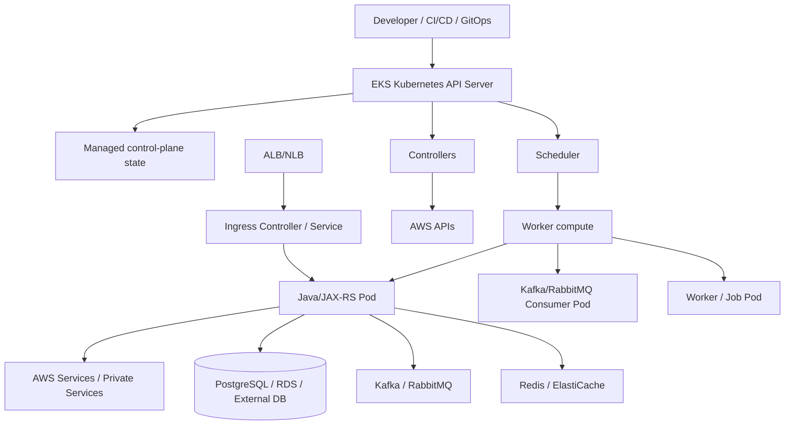

# Part 043 — EKS Foundation

Amazon EKS is not “just Kubernetes on AWS”.

It is Kubernetes plus AWS-managed control-plane responsibility, AWS networking, AWS identity, AWS registry, AWS load balancing, AWS logging/monitoring options, AWS storage integrations, and AWS operational boundaries.

For a senior Java/JAX-RS engineer, the goal is not to become an AWS platform administrator overnight. The goal is to understand enough of EKS to reason about how a service is scheduled, exposed, secured, scaled, observed, and debugged in production.

In enterprise Quote & Order / CPQ / telco BSS-style systems, EKS details matter because service failure is rarely isolated to application code. A failed rollout may involve image pull access, IAM identity, VPC routing, subnet capacity, pod IP exhaustion, load balancer health checks, ingress annotations, CoreDNS, security groups, or node pressure.

> CSG/internal note: this part does not assume CSG uses EKS, EKS Auto Mode, managed node groups, self-managed nodes, Fargate, specific VPC layout, specific namespaces, Route 53, ALB/NLB, ECR, IRSA, Pod Identity, or any particular GitOps repository. Treat every CSG-specific detail as something to verify with platform/SRE/DevOps/security/backend teams.

---

## 1. Core Mental Model

EKS should be understood as three overlapping systems:

```text
EKS = Kubernetes API + AWS infrastructure integration + enterprise platform policy
```

Kubernetes gives you:

- API server,
- declarative objects,
- scheduler,
- controllers,
- pods,
- services,
- deployments,
- config/secrets,
- RBAC,
- reconciliation.

AWS gives you:

- managed control plane,
- EC2/Fargate compute,
- VPC networking,
- subnets,
- route tables,
- NAT gateways,
- security groups,
- IAM,
- ECR,
- Elastic Load Balancing,
- Route 53,
- ACM,
- CloudWatch,
- EBS/EFS,
- Secrets Manager,
- Systems Manager,
- PrivateLink/VPC endpoints.

The enterprise platform layer usually adds:

- cluster standards,
- namespace standards,
- GitOps conventions,
- Helm/Kustomize conventions,
- admission policies,
- image scanning,
- network policies,
- RBAC conventions,
- secret management rules,
- observability standards,
- runbooks,
- incident escalation.

As a backend engineer, your service lives at the intersection of all three.

---

## 2. What EKS Manages vs What You Still Own

A common misunderstanding is assuming “managed Kubernetes” means “AWS owns everything”.

That is wrong.

EKS reduces the operational burden of the Kubernetes control plane, but workload correctness remains your responsibility.

### Usually AWS-managed

Depending on the EKS mode and configuration:

- Kubernetes control plane availability,
- API server infrastructure,
- managed control plane scaling and patching boundaries,
- managed add-on lifecycle if enabled,
- managed node group lifecycle if used,
- Fargate compute lifecycle if used,
- integrations exposed through AWS APIs.

### Usually platform/SRE-owned

In many enterprises:

- cluster design,
- VPC/subnet model,
- node group or node pool design,
- ingress controller design,
- IAM role design,
- registry policy,
- GitOps tooling,
- add-on versioning,
- observability platform,
- namespace and policy standards,
- upgrade strategy,
- incident response process.

### Usually application/backend-team-owned

For your Java/JAX-RS service:

- Dockerfile quality,
- image security hygiene,
- resource requests and limits,
- JVM sizing,
- probes,
- graceful shutdown,
- application config,
- secret usage,
- service account selection,
- dependency client behavior,
- timeout/retry/circuit-breaker behavior,
- structured logs,
- metrics/traces,
- rollback safety,
- data compatibility,
- production readiness evidence.

A senior engineer should not blur these boundaries.

When something fails, ask:

```text
Is this an application bug?
Is this a workload manifest bug?
Is this an image/pipeline bug?
Is this a Kubernetes object/configuration bug?
Is this an AWS infrastructure integration bug?
Is this a platform policy or permission bug?
```

---

## 3. EKS Architecture at a High Level

A simplified EKS architecture looks like this:



Important distinction:

```text
Control plane decides and reconciles.
Data plane runs your containers.
AWS infrastructure moves traffic, stores artifacts, gives identity, and provides external dependencies.
```

---

## 4. Managed Control Plane

In EKS, the Kubernetes control plane is managed by AWS.

This means you do not usually operate your own etcd nodes or API server machines. However, you still interact with the control plane through Kubernetes APIs, AWS APIs, IAM, cluster endpoint configuration, and platform tooling.

### Why the control plane matters to backend engineers

Even though you may not manage it directly, it affects your service because every deployment depends on it:

- `kubectl apply` requires API server availability.
- GitOps reconciliation requires API server access.
- scheduler decisions depend on control-plane state.
- controller actions depend on reconciliation.
- HPA/VPA/autoscaling depends on metrics and control loops.
- load balancer provisioning depends on controller-to-AWS API integration.
- RBAC decisions happen through the API server.

### Failure symptoms

Control-plane or API-access issues can appear as:

```text
kubectl timeout
kubectl forbidden
GitOps sync failing
Deployment not progressing
HPA not updating
controllers stuck
new pods not scheduled
load balancer not provisioned
```

Do not immediately blame the application when no new pods appear. First determine whether the desired state is actually accepted by the API server and reconciled by controllers.

---

## 5. Cluster Endpoint

The EKS cluster endpoint is how clients and nodes talk to the Kubernetes API server.

Common endpoint patterns:

- public endpoint,
- private endpoint,
- public endpoint restricted by CIDR,
- both public and private endpoint enabled.

### Backend engineer concern

You usually do not decide endpoint exposure alone, but it affects:

- CI/CD connectivity,
- GitOps controller access,
- developer `kubectl` access,
- node-to-control-plane communication,
- private network requirements,
- incident response access.

### Failure symptoms

```text
kubectl cannot connect
CI/CD cannot deploy
GitOps cannot sync
nodes cannot join cluster
node status becomes NotReady
```

### Review questions

Ask:

```text
Who can access the cluster API endpoint?
Is access public, private, or restricted?
How does CI/CD reach it?
How does GitOps reach it?
How do nodes reach it?
How is emergency access handled?
```

---

## 6. Worker Compute Options

Your pods need worker capacity. In EKS, compute may be provided through several patterns.

### Managed node groups

Managed node groups are EC2-based worker nodes whose lifecycle is partially managed by EKS.

Useful when you need:

- normal EC2 node behavior,
- DaemonSets,
- node-level observability agents,
- broad Kubernetes workload compatibility,
- predictable networking behavior,
- control over instance types and scaling.

### Self-managed nodes

Self-managed nodes give more control but more responsibility.

You may encounter them when:

- a cluster has legacy node management,
- custom AMIs are required,
- specialized networking or bootstrap is used,
- platform team needs full node lifecycle control.

The trade-off is higher operational burden.

### Fargate profiles

Fargate can run pods without directly managing EC2 worker nodes.

Useful for certain serverless container workloads, but not a universal replacement for nodes.

You must verify compatibility with:

- DaemonSets,
- CSI drivers,
- observability agents,
- networking needs,
- performance requirements,
- workload startup latency,
- cost model,
- debugging constraints.

### EKS Auto Mode awareness

Some environments may use EKS Auto Mode or similar managed infrastructure automation. Treat it as a different operational model where more data-plane components may be automated.

Do not assume Auto Mode exists internally unless verified.

### Hybrid nodes awareness

EKS can be used in hybrid/on-prem patterns in some architectures. That changes responsibility boundaries significantly because nodes may run outside AWS-managed cloud regions.

Do not assume hybrid nodes exist unless verified.

---

## 7. Node Group Design

Node groups are not just compute buckets. They encode workload placement, isolation, cost, scaling, and blast-radius decisions.

Common node group dimensions:

```text
system vs application
critical vs non-critical
stateless vs stateful
general-purpose vs compute-heavy vs memory-heavy
on-demand vs spot
public-subnet vs private-subnet
zone A/B/C
x86 vs ARM
GPU/specialized hardware
```

### Java/JAX-RS relevance

Java services often need careful node and resource planning because:

- JVM memory overhead is not just heap,
- GC behavior reacts to CPU throttling,
- thread pools can amplify CPU pressure,
- startup warmup can be expensive,
- high-throughput REST services need stable CPU,
- Kafka/RabbitMQ consumers may scale differently from API pods,
- large pods can reduce bin-packing efficiency.

### Bad pattern

```text
Every service goes to one generic node group with no placement policy.
```

This creates noisy-neighbor risk and makes incidents harder to isolate.

### Better pattern

```text
Workloads are scheduled based on criticality, resource profile, security boundary, and availability requirement.
```

---

## 8. EKS Add-ons

EKS add-ons are cluster components that integrate Kubernetes with AWS and cluster networking/runtime behavior.

Common add-ons include:

- Amazon VPC CNI,
- CoreDNS,
- kube-proxy,
- EBS CSI driver,
- observability agents depending on setup,
- storage/identity/networking add-ons depending on platform design.

### Why add-ons matter

Your application may look broken when the real issue is an add-on.

Examples:

```text
Pods cannot get IPs        -> VPC CNI / subnet IP exhaustion / ENI issue
Service routing broken     -> kube-proxy / EndpointSlice / Service config issue
DNS failing                -> CoreDNS / DNS forwarding / network policy issue
PVC cannot bind/mount      -> CSI driver / IAM / StorageClass issue
Cloud identity failing     -> IRSA / Pod Identity / webhook / IAM trust issue
Load balancer not created  -> AWS Load Balancer Controller / IAM / subnet tags issue
```

### Review questions

Ask:

```text
Which add-ons are AWS-managed?
Which add-ons are self-managed?
Who owns add-on upgrades?
Are add-on versions compatible with the cluster version?
Are add-on metrics and logs visible?
What happens if an add-on rollout fails?
```

---

## 9. Amazon VPC CNI

The Amazon VPC CNI is central to EKS networking.

In common EKS setups, pods receive IP addresses from the VPC address space. This differs from many Kubernetes clusters where pod IPs come from an overlay network.

### Why this matters

Pod networking is directly tied to AWS VPC capacity and design.

Implications:

- subnet IP exhaustion can prevent pod scheduling,
- instance type affects pod density,
- security-group and routing design matter,
- pod-to-AWS-service traffic behaves like VPC traffic,
- private endpoint and DNS behavior become critical,
- network troubleshooting spans Kubernetes and AWS.

### Failure symptoms

```text
Pod stuck in ContainerCreating
failed to assign an IP address to container
CNI plugin not initialized
Insufficient pods capacity on node
Pods pending despite apparent CPU/memory capacity
```

### Debug direction

Investigate:

```bash
kubectl describe pod <pod> -n <namespace>
kubectl get pods -n kube-system
kubectl logs -n kube-system daemonset/aws-node
kubectl describe node <node>
```

Then correlate with AWS-side subnet capacity, ENI limits, node instance type, and CNI configuration.

---

## 10. CoreDNS

CoreDNS provides DNS resolution inside the cluster.

Your Java service may rely on DNS for:

- Kubernetes Service discovery,
- PostgreSQL/RDS hostnames,
- Kafka/RabbitMQ brokers,
- Redis endpoints,
- AWS service endpoints,
- private endpoint hostnames,
- external API calls,
- internal enterprise domains.

### Failure symptoms

```text
UnknownHostException
intermittent connection failure
slow startup
readiness probe failing
Kafka broker resolution failure
RDS hostname resolution failure
private endpoint not resolving
```

### Debug direction

```bash
kubectl get pods -n kube-system -l k8s-app=kube-dns
kubectl logs -n kube-system deploy/coredns
kubectl exec -n <namespace> <pod> -- nslookup <service-name>
kubectl exec -n <namespace> <pod> -- cat /etc/resolv.conf
```

Do not treat DNS as a minor concern. In Kubernetes, DNS is often in the request path of every dependency call.

---

## 11. kube-proxy

kube-proxy maintains node-level networking rules that allow Service virtual IPs to route to pod endpoints.

Depending on mode and configuration, this may involve iptables, IPVS, or other mechanisms.

### Why backend engineers should care

When a Service exists but traffic fails, kube-proxy and service endpoint state become part of the investigation.

Symptoms may include:

```text
Service IP not reachable
intermittent Service routing
traffic only reaches some pods
connection refused from Service
readiness changed but routing still behaves unexpectedly
```

### Debug direction

Start from Kubernetes objects:

```bash
kubectl get svc -n <namespace>
kubectl get endpointslice -n <namespace>
kubectl describe svc <service> -n <namespace>
kubectl get pods -n <namespace> --show-labels
```

Then involve platform/SRE if node-level proxying or dataplane rules are suspected.

---

## 12. IAM and Kubernetes RBAC Are Different Systems

EKS involves both AWS IAM and Kubernetes RBAC.

They are not the same.

```text
AWS IAM controls access to AWS APIs.
Kubernetes RBAC controls access to Kubernetes APIs.
```

A user or CI pipeline may be allowed by IAM but denied by Kubernetes RBAC, or vice versa depending on cluster access configuration.

A pod may have Kubernetes permission through a ServiceAccount but lack AWS permission to call S3, Secrets Manager, SQS, SNS, DynamoDB, or other AWS services.

### Senior-level rule

Always ask which API is being denied:

```text
Is this a Kubernetes API permission failure?
Is this an AWS API permission failure?
Is this a cloud SDK credential resolution failure?
Is this a trust-policy / identity-binding failure?
```

---

## 13. IRSA and Pod Identity Awareness

Workloads often need to call AWS APIs.

Bad historical pattern:

```text
Store AWS access keys in Kubernetes Secrets or environment variables.
```

Better pattern:

```text
Bind workload identity to an IAM role using IRSA or EKS Pod Identity, depending on platform standard.
```

### IRSA mental model

IRSA uses:

- Kubernetes ServiceAccount,
- cluster OIDC provider,
- projected service account token,
- IAM role trust policy,
- AWS STS web identity flow,
- AWS SDK credential provider chain.

### EKS Pod Identity awareness

Some clusters may use EKS Pod Identity instead of or alongside IRSA. Verify internal platform standard.

### Java/JAX-RS relevance

Your application may fail AWS calls even though the pod is healthy.

Failure appears as:

```text
AccessDeniedException
Unable to load credentials
The security token included in the request is invalid
not authorized to perform action
role cannot be assumed
```

Do not fix this by injecting static keys unless explicitly approved by security/platform policy.

---

## 14. ECR and Image Pull

ECR is commonly used as the container registry for EKS workloads, though some enterprises use private registries or third-party registries.

Image pull depends on:

- image repository existence,
- image tag or digest,
- node or pod permission,
- registry authentication,
- network path to registry,
- image pull policy,
- vulnerability/admission policy,
- regional replication if used.

### Failure symptoms

```text
ImagePullBackOff
ErrImagePull
manifest unknown
no basic auth credentials
repository not found
image digest not found
TLS or network timeout
```

### Debug direction

```bash
kubectl describe pod <pod> -n <namespace>
kubectl get events -n <namespace> --sort-by=.lastTimestamp
```

Then verify:

```text
Does the image exist?
Is tag immutable or mutable?
Is digest correct?
Can the node pull from the registry?
Is there an imagePullSecret?
Is ECR access configured?
Is a registry policy or admission controller blocking it?
```

---

## 15. Security Groups and Subnets

EKS workload behavior is deeply affected by AWS networking primitives.

At minimum, understand:

- VPC,
- subnet,
- route table,
- security group,
- NACL,
- NAT gateway,
- VPC endpoint,
- private hosted zone,
- load balancer subnet placement.

### Backend relevance

Your service may be correct but unreachable because:

- pod/node cannot reach database subnet,
- security group blocks egress,
- NACL blocks ephemeral return traffic,
- NAT route is missing,
- private endpoint DNS resolves incorrectly,
- load balancer is attached to wrong subnets,
- subnet tags are missing for load balancer discovery,
- private subnet lacks required endpoint access.

This is why EKS debugging often requires both `kubectl` and AWS-side investigation.

---

## 16. EKS Cluster Endpoint and Private Cluster Concerns

In private or restricted clusters, access paths become part of operations.

Questions to ask:

```text
Can CI/CD reach the cluster API?
Can GitOps reach the cluster API?
Can developers access via VPN/bastion/SSO?
Can nodes reach the API endpoint privately?
Can emergency responders access during network incidents?
Are cluster endpoint CIDRs documented?
```

Bad pattern:

```text
A private cluster exists, but incident responders cannot access it during an outage.
```

Good pattern:

```text
Access paths are documented, least-privileged, tested, and included in incident runbooks.
```

---

## 17. EKS and Java/JAX-RS Runtime Concerns

EKS does not change the fact that your service is a Java process. It changes the environment around that process.

### Resource sizing

Your pod resource limits influence:

- JVM heap sizing,
- GC behavior,
- CPU throttling,
- request latency,
- startup time,
- thread scheduling,
- OOMKilled risk.

### Load balancer and probe behavior

Your service must align:

- Kubernetes readiness probe,
- Kubernetes liveness probe,
- startup probe,
- ALB/NLB target health check,
- ingress controller behavior,
- graceful shutdown,
- connection draining.

### Identity and AWS SDK

Your Java AWS SDK config must align with:

- IRSA/Pod Identity,
- region configuration,
- endpoint configuration,
- retry policy,
- timeout policy,
- proxy configuration if used,
- private endpoint DNS.

### Logging and tracing

Your service logs must be consumable by the EKS logging pipeline:

- stdout/stderr,
- structured JSON if standard,
- correlation ID,
- trace ID,
- request ID,
- user/tenant/order context without leaking sensitive data.

---

## 18. Impact on PostgreSQL, Kafka, RabbitMQ, Redis, Camunda, and NGINX

EKS changes dependency interaction through scheduling, networking, identity, and observability.

### PostgreSQL

Potential concerns:

- RDS/private database endpoint reachability,
- security group rules,
- DNS resolution,
- connection pool sizing,
- failover DNS behavior,
- transaction behavior during pod shutdown,
- secrets rotation.

### Kafka

Potential concerns:

- broker DNS and advertised listeners,
- private connectivity,
- consumer group rebalancing during rollout,
- lag-based scaling,
- graceful consumer shutdown,
- TLS/SASL secret management.

### RabbitMQ

Potential concerns:

- connection/channel lifecycle,
- consumer prefetch,
- graceful drain,
- DLQ behavior,
- TLS/cert secrets,
- cluster endpoint reachability.

### Redis

Potential concerns:

- endpoint discovery,
- connection timeout,
- failover behavior,
- cache stampede during rollout,
- TLS/auth secret rotation,
- memory pressure on clients.

### Camunda / workflow workers

Potential concerns:

- worker polling behavior,
- job lock duration,
- retry semantics,
- graceful worker shutdown,
- duplicate work risk,
- database dependency.

### NGINX / ingress

Potential concerns:

- header forwarding,
- timeout chain,
- max body size,
- TLS termination,
- connection draining,
- 502/503/504 mapping,
- upstream health.

---

## 19. EKS Failure Modes

### Failure Mode 1 — Pod cannot be scheduled

Possible causes:

- insufficient CPU/memory,
- node selector mismatch,
- affinity/anti-affinity conflict,
- taint not tolerated,
- topology spread impossible,
- quota exceeded,
- PDB constraints during rollout,
- insufficient pod IP capacity.

Debug:

```bash
kubectl describe pod <pod> -n <namespace>
kubectl get events -n <namespace> --sort-by=.lastTimestamp
kubectl describe node <node>
```

### Failure Mode 2 — Pod cannot get IP

Possible causes:

- VPC CNI issue,
- subnet IP exhaustion,
- ENI limit,
- node IAM permission issue,
- CNI daemon issue.

Debug:

```bash
kubectl get pods -n kube-system
kubectl logs -n kube-system daemonset/aws-node
kubectl describe node <node>
```

### Failure Mode 3 — Image cannot be pulled

Possible causes:

- wrong ECR repository,
- wrong tag/digest,
- missing registry permission,
- no network path to ECR,
- image policy block,
- region mismatch.

Debug:

```bash
kubectl describe pod <pod> -n <namespace>
kubectl get events -n <namespace> --sort-by=.lastTimestamp
```

### Failure Mode 4 — AWS API call denied from pod

Possible causes:

- wrong ServiceAccount,
- IRSA/Pod Identity misbinding,
- IAM role missing permission,
- trust policy wrong,
- SDK not using expected credential provider,
- region/endpoint mismatch.

Debug from application logs first, then inspect ServiceAccount and identity binding.

```bash
kubectl get sa <service-account> -n <namespace> -o yaml
kubectl describe pod <pod> -n <namespace>
```

### Failure Mode 5 — Load balancer not created

Possible causes:

- AWS Load Balancer Controller not installed,
- controller lacks IAM permission,
- subnet tags missing,
- ingress/service annotation wrong,
- security group conflict,
- quota exceeded.

Debug:

```bash
kubectl describe ingress <ingress> -n <namespace>
kubectl describe svc <service> -n <namespace>
kubectl logs -n kube-system deploy/aws-load-balancer-controller
```

### Failure Mode 6 — DNS fails

Possible causes:

- CoreDNS unavailable,
- DNS policy wrong,
- network policy blocks DNS,
- private hosted zone not associated,
- split-horizon DNS mismatch,
- wrong resolver configuration.

Debug:

```bash
kubectl logs -n kube-system deploy/coredns
kubectl exec -n <namespace> <pod> -- nslookup <hostname>
kubectl exec -n <namespace> <pod> -- cat /etc/resolv.conf
```

---

## 20. Production Debugging Workflow

Use a layered approach.

```text
Symptom
  ↓
Application logs
  ↓
Pod status/events
  ↓
Deployment/ReplicaSet state
  ↓
Service/EndpointSlice state
  ↓
Ingress/LB state
  ↓
Node/CNI/CoreDNS/add-on state
  ↓
AWS IAM/network/storage/logging state
```

Do not jump straight to AWS console if the pod is crashing due to application config.

Do not stare only at pod logs if the target group is unhealthy due to load balancer health check mismatch.

---

## 21. Production-Safe Commands

Typical safe read-only commands:

```bash
kubectl get pods -n <namespace> -o wide
kubectl describe pod <pod> -n <namespace>
kubectl logs <pod> -n <namespace> --previous
kubectl get events -n <namespace> --sort-by=.lastTimestamp
kubectl get deploy,rs,svc,ingress,endpointslice -n <namespace>
kubectl describe deploy <deployment> -n <namespace>
kubectl describe svc <service> -n <namespace>
kubectl describe ingress <ingress> -n <namespace>
kubectl top pod -n <namespace>
kubectl top node
```

Potentially risky commands unless approved:

```bash
kubectl delete pod <pod>
kubectl rollout restart deploy/<deployment>
kubectl scale deploy/<deployment> --replicas=<n>
kubectl edit <resource>
kubectl patch <resource>
helm upgrade ...
argocd app sync ...
```

In GitOps environments, manual changes may be overwritten or create drift.

---

## 22. EKS Security Concerns

EKS security has several layers:

```text
AWS account security
IAM security
cluster access security
Kubernetes RBAC
pod security
node security
network security
image security
secret security
runtime security
observability/audit evidence
```

Backend engineers should pay particular attention to:

- overprivileged ServiceAccounts,
- AWS IAM roles with broad permissions,
- static AWS credentials in secrets,
- containers running as root,
- writable root filesystem without reason,
- excessive Linux capabilities,
- missing resource limits,
- public load balancer exposure,
- missing TLS termination policy,
- sensitive data in logs,
- secret values in Helm values files,
- image tags that are mutable and unscanned.

---

## 23. EKS Cost Concerns

EKS cost is not only cluster cost.

Cost drivers include:

- EC2 nodes,
- Fargate pod runtime,
- NAT gateways,
- load balancers,
- cross-AZ traffic,
- EBS/EFS storage,
- CloudWatch logs and metrics,
- data transfer,
- overprovisioned resource requests,
- inefficient autoscaling,
- unused namespaces/workloads,
- duplicate environments,
- excessive log volume.

For Java services, watch:

- excessive memory requests due to oversized heap,
- CPU limits causing throttling while requests appear cheap,
- too many replicas because startup/readiness is slow,
- consumer autoscaling that creates downstream load spikes,
- high-cardinality metrics/logs.

---

## 24. EKS Observability Concerns

You need observability across layers:

### Application layer

- request rate,
- error rate,
- latency,
- dependency latency,
- JVM memory,
- GC pause,
- thread pool saturation,
- DB pool usage,
- Kafka/RabbitMQ lag,
- retry rate,
- circuit breaker state.

### Kubernetes layer

- pod restarts,
- readiness failures,
- OOMKilled,
- CPU throttling,
- pending pods,
- node pressure,
- HPA events,
- rollout status,
- Kubernetes events.

### AWS layer

- load balancer target health,
- ALB/NLB errors,
- VPC flow logs if enabled,
- NAT gateway metrics,
- ECR pull failures,
- IAM access denied events,
- CloudWatch logs/metrics,
- RDS/MSK/ElastiCache/MQ service metrics if used.

A production incident often requires correlating all three.

---

## 25. EKS PR Review Checklist

When reviewing a change that touches EKS deployment behavior, ask:

### Workload

- Does the Deployment/StatefulSet/Job type match the workload?
- Are requests and limits realistic for JVM behavior?
- Are probes correct and not dependency-fragile?
- Is graceful shutdown configured?
- Is rollout strategy safe?

### Image

- Is image tag/digest traceable?
- Is image scanned?
- Is the base image approved?
- Is the runtime non-root?

### Identity

- Which ServiceAccount is used?
- Does it need AWS access?
- Is IRSA/Pod Identity configured through platform standard?
- Are IAM permissions least-privileged?

### Networking

- Is the service internal or external?
- Does ingress/LB exposure match the intended audience?
- Are TLS and headers correct?
- Are DNS names documented?
- Are dependency endpoints private/public as expected?

### Operations

- Are logs, metrics, traces available?
- Are alerts defined?
- Is rollback safe?
- Are runbooks updated?
- Is there a migration job or data compatibility concern?

### Governance

- Does the manifest follow namespace, label, resource, security, and GitOps standards?
- Does this require platform/security review?
- Does the change increase cost or blast radius?

---

## 26. Internal Verification Checklist

Verify these internally before making assumptions:

### Cluster and platform

- Does the team use EKS, AKS, on-prem Kubernetes, or multiple platforms?
- Which EKS clusters exist for dev/test/stage/prod?
- Who owns cluster administration?
- What is the cluster upgrade policy?
- What Kubernetes versions are supported?
- Is EKS Auto Mode used?
- Are hybrid nodes used?

### Compute

- Are workloads on managed node groups, self-managed nodes, Fargate, or mixed?
- What node groups exist?
- Are there dedicated node groups for critical workloads?
- Are spot instances used?
- What instance families are standard?
- Are ARM nodes used?

### Add-ons

- Is Amazon VPC CNI used?
- Are CoreDNS and kube-proxy managed add-ons or self-managed?
- What CNI custom settings are enabled?
- Who owns add-on upgrades?
- Are add-on logs and metrics visible?

### Networking

- Which VPC/subnets host worker nodes?
- Are pods assigned VPC IPs?
- Are subnets private or public?
- Is NAT used?
- Are VPC endpoints used?
- Are security groups for pods used?
- Are NetworkPolicies enforced?

### Identity and access

- Is IRSA used?
- Is EKS Pod Identity used?
- How are Kubernetes users mapped/accessed?
- How does CI/CD access the cluster?
- How does GitOps access the cluster?
- What is the emergency access model?

### Registry and artifacts

- Is ECR used?
- Are image tags immutable?
- Are digests pinned?
- Are images scanned?
- Is SBOM generated?
- Is image promotion controlled?

### Observability

- Are logs in CloudWatch, Grafana/Loki, Splunk, Datadog, or another system?
- Are metrics in Prometheus, CloudWatch, Azure Monitor, or another system?
- Are traces enabled?
- Are Kubernetes events collected?
- Are load balancer target-health metrics visible?

### Operations

- Where are runbooks?
- Who is on-call?
- What is the escalation path?
- How are rollbacks performed?
- Are production hotfixes allowed outside GitOps?
- What incidents have happened before?

---

## 27. Senior Engineer Summary

EKS is a managed Kubernetes service, but your service is still responsible for behaving correctly in the platform.

The production mental model is:

```text
Java process
  inside OCI container
  inside Kubernetes pod
  scheduled onto EKS compute
  connected through VPC networking
  exposed through AWS/Kubernetes routing
  authenticated through Kubernetes and AWS identity
  configured through GitOps/IaC
  observed through app, cluster, and cloud telemetry
  operated through runbooks and incident response
```

A senior backend engineer should be able to discuss EKS with platform teams using precise questions:

```text
Where does traffic enter?
Where does identity come from?
Where does DNS resolve?
Where does the image come from?
Where does the pod get an IP?
Where does config come from?
Where does the secret come from?
Where does the service emit telemetry?
Where does rollback happen?
Where can this fail?
Who owns each layer?
```

That is the foundation needed before going deeper into EKS networking and traffic flow.
