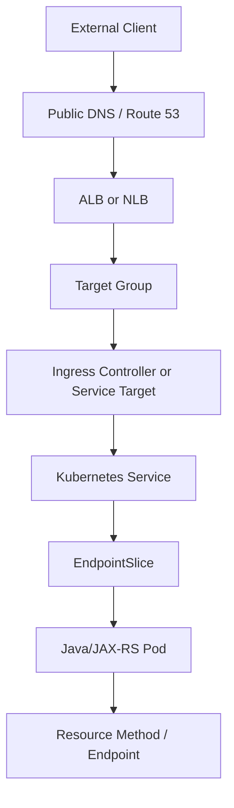
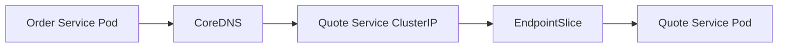
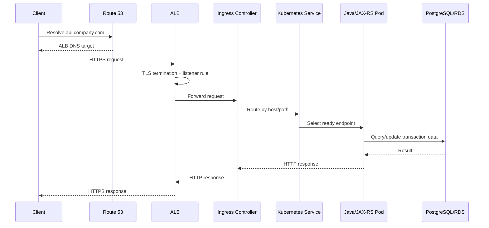
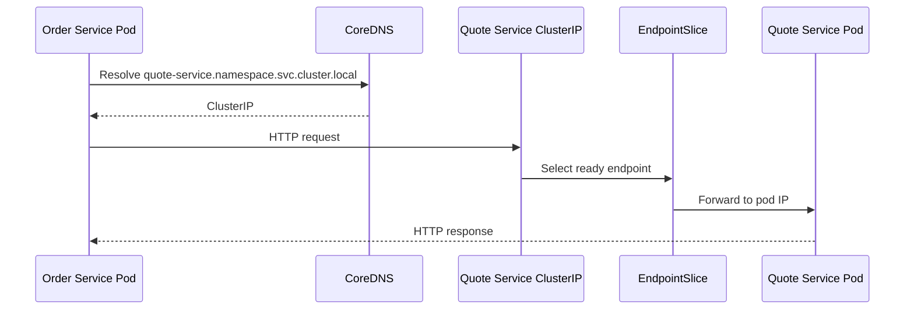
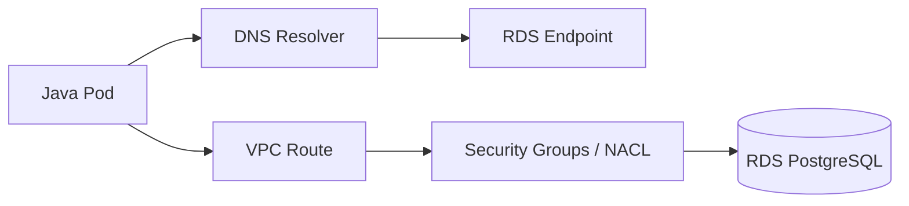

# Part 044 — EKS Networking and Traffic Flow

EKS networking is where Kubernetes abstractions meet AWS networking reality.

A Kubernetes `Service` does not magically make traffic work. An `Ingress` does not magically create a safe public API. A pod IP does not exist outside network design. DNS, security groups, subnets, route tables, load balancers, target groups, TLS certificates, ingress controllers, and application timeouts all participate in the same request path.

For enterprise Java/JAX-RS systems, EKS networking must be understood as a production traffic system, not just YAML.

> CSG/internal note: this part does not assume CSG uses EKS, ALB, NLB, AWS Load Balancer Controller, NGINX Ingress, Route 53, ACM, specific subnet tags, security group model, VPC endpoints, NAT gateways, or any specific traffic topology. Treat every internal topology and configuration detail as something to verify with platform/SRE/DevOps/security/network teams.

---

## 1. Core Mental Model

EKS networking is the composition of two networks:

```text
Kubernetes network model
+ AWS VPC network model
= actual production traffic behavior
```

Kubernetes gives you:

- pod IP,
- Service,
- EndpointSlice,
- Ingress,
- Gateway API if used,
- kube-proxy or equivalent dataplane,
- DNS through CoreDNS,
- NetworkPolicy if enforced by the CNI/plugin.

AWS gives you:

- VPC,
- subnet,
- route table,
- internet gateway,
- NAT gateway,
- security group,
- NACL,
- elastic network interface,
- ALB,
- NLB,
- target group,
- Route 53,
- ACM,
- VPC endpoint,
- PrivateLink,
- private hosted zone.

Your Java/JAX-RS endpoint sees only an HTTP request, but that request may have crossed many layers before reaching the resource method.

---

## 2. Why EKS Networking Is Different from Generic Kubernetes

In many Kubernetes environments, pod networking uses an overlay network.

In common EKS configurations using Amazon VPC CNI, pods receive IP addresses from the VPC address space.

This has major implications:

```text
Pod IP capacity depends on subnet capacity.
Pod density depends on EC2 instance ENI/IP limits.
Pod traffic participates directly in VPC routing.
AWS security and network design matter to pod reachability.
Private endpoint and private DNS behavior directly affect application calls.
```

This is why a pod can fail to start because of subnet IP exhaustion even though CPU and memory appear available.

---

## 3. Main EKS Traffic Patterns

There are several common traffic patterns.

### Pattern A — External client to Java REST API

```text
Client
  -> DNS
  -> ALB/NLB
  -> Ingress Controller or Service
  -> Kubernetes Service
  -> EndpointSlice
  -> Pod IP
  -> containerPort
  -> Java/JAX-RS endpoint
```

### Pattern B — Internal service to Java REST API

```text
Internal client pod
  -> Kubernetes DNS
  -> ClusterIP Service
  -> EndpointSlice
  -> Pod IP
  -> Java/JAX-RS endpoint
```

### Pattern C — Java service to PostgreSQL/RDS

```text
Java pod
  -> DNS resolution
  -> VPC route
  -> security group / NACL
  -> RDS or PostgreSQL endpoint
```

### Pattern D — Java service to AWS service through private endpoint

```text
Java pod
  -> AWS SDK
  -> endpoint DNS
  -> VPC endpoint / PrivateLink
  -> AWS service API
```

### Pattern E — Java service to internet/external API

```text
Java pod
  -> VPC route
  -> NAT Gateway or egress proxy
  -> internet/external service
```

Each pattern has different failure modes.

---

## 4. High-Level North-South Flow

North-south traffic is traffic entering or leaving the cluster.

A typical external inbound request might look like this:



Important questions:

```text
Where is TLS terminated?
Which headers preserve original client context?
Which component performs health checks?
Which timeout fires first?
Does the load balancer target nodes or pod IPs?
Is the load balancer public or internal?
Which security groups allow traffic?
```

---

## 5. High-Level East-West Flow

East-west traffic is service-to-service traffic inside the platform.

Example:



East-west flow may stay inside Kubernetes abstractions, but in EKS the underlying packets still run through VPC networking.

Concerns:

- Service selector correctness,
- EndpointSlice population,
- pod readiness,
- DNS resolution,
- NetworkPolicy,
- security groups for pods if used,
- sidecar/service mesh if used,
- timeout/retry behavior,
- mTLS if used.

---

## 6. VPC

The VPC is the network boundary where EKS worker nodes and often pod IPs live.

Questions to ask:

```text
Which VPC hosts the cluster?
Is the VPC shared across teams?
Is it dedicated to Kubernetes?
Is CIDR capacity sufficient for pod growth?
Are private endpoints used?
Is there connectivity to on-prem/corporate networks?
```

### Failure mode: CIDR pressure

If the VPC/subnet address plan is too small, EKS workloads may fail as the cluster grows.

Symptoms:

```text
pods stuck pending/container creating
CNI cannot assign IP
new nodes cannot host expected pod count
scale-out fails under traffic spike
```

This is a capacity planning issue, not an application bug.

---

## 7. Subnets

Subnets determine where nodes, load balancers, and sometimes pod IPs live.

Common patterns:

- public subnets for internet-facing load balancers,
- private subnets for worker nodes,
- private subnets for internal load balancers,
- subnets across multiple Availability Zones,
- dedicated subnets for clusters or shared subnets with tagging.

### Why subnet tagging matters

AWS controllers often discover eligible subnets using tags or configuration. If subnets are not tagged/configured as expected, load balancer provisioning can fail or choose the wrong subnets.

### Failure symptoms

```text
Ingress has no address
LoadBalancer service stays pending
controller logs mention no suitable subnets
ALB/NLB created in unexpected subnet
public endpoint unintentionally exposed
internal endpoint unreachable
```

---

## 8. Route Tables

Route tables decide where packets go.

Examples:

```text
0.0.0.0/0 -> Internet Gateway      # public subnet route
0.0.0.0/0 -> NAT Gateway           # private subnet outbound internet
prefix-list -> VPC Endpoint        # private AWS service access
on-prem CIDR -> Transit Gateway/VPN/Direct Connect
```

### Backend relevance

Your Java service may fail to call external APIs or cloud services because the route table does not provide a path.

Symptoms:

```text
connection timeout
SDK endpoint timeout
TLS handshake timeout
no route to host
private endpoint unreachable
```

Distinguish timeout from permission denied:

```text
timeout usually points to network path
AccessDenied usually points to IAM/authorization
UnknownHost usually points to DNS
connection refused usually points to endpoint/listener/service mismatch
```

---

## 9. NAT Gateway

NAT Gateway is commonly used for outbound internet from private subnets.

A private-node EKS cluster may need NAT for:

- pulling public images if no private registry mirror,
- calling external APIs,
- accessing public AWS service endpoints if VPC endpoints are not used,
- package downloads during unsafe runtime patterns,
- telemetry export to public endpoints.

### Production concerns

NAT is not free and not invisible.

Concerns:

- cost,
- throughput,
- port exhaustion,
- AZ-local routing,
- single-AZ dependency if misdesigned,
- security/compliance requirements,
- dependency on public internet path.

### Better pattern for AWS services

For AWS services, prefer private connectivity where appropriate:

```text
VPC endpoint / PrivateLink + private DNS + IAM least privilege
```

But verify platform standards before assuming.

---

## 10. Internet Gateway

Internet Gateway enables inbound/outbound internet connectivity for public subnets.

Worker nodes for production workloads are commonly placed in private subnets, while internet-facing ALBs live in public subnets.

Bad pattern:

```text
Application nodes directly exposed in public subnets without strong justification.
```

Better pattern:

```text
Public entry through controlled load balancer / edge layer, workloads in private subnets.
```

Verify actual internal design.

---

## 11. Security Groups

Security groups are stateful virtual firewalls.

They affect:

- node-to-node traffic,
- load-balancer-to-node/pod traffic,
- pod-to-database traffic,
- pod-to-cache traffic,
- pod-to-message-broker traffic,
- pod-to-private-endpoint traffic,
- control-plane-to-node traffic,
- health checks.

### Common failure

```text
Kubernetes objects look correct, but AWS security groups block the packet.
```

Symptoms:

```text
ALB target unhealthy
NLB timeout
pod cannot connect to RDS
pod cannot connect to MSK/RabbitMQ/Redis
health check timeout
intermittent cross-AZ connection failures
```

### Review questions

```text
Which security group is attached to nodes?
Which security group is attached to load balancer?
Are security groups for pods enabled?
Which SG allows DB access?
Are ephemeral return ports allowed by NACLs?
Are health-check source ranges allowed?
```

---

## 12. NACL

Network ACLs are stateless subnet-level filters.

They are usually less frequently changed than security groups, but when wrong they cause confusing failures.

Because NACLs are stateless, both inbound and outbound rules matter, including ephemeral ports.

Symptoms:

```text
traffic works in one direction but response fails
some subnets/AZs fail while others work
load balancer health checks fail only for some targets
long timeouts instead of explicit denial
```

Backend engineers usually do not modify NACLs, but should know when to involve network/platform teams.

---

## 13. VPC CNI and Pod IPs

With Amazon VPC CNI, pods commonly receive VPC-routable IPs.

### Consequences

- Pod networking depends on subnet capacity.
- Pod density depends on EC2 instance type and CNI configuration.
- Pods may appear as VPC IPs in logs/flow logs.
- Security-group and route-table design may directly affect pods.
- IP target mode for load balancers can target pod IPs.

### Failure mode: pod IP exhaustion

Symptoms:

```text
failed to assign IP address
pods stuck ContainerCreating
scale-out fails during traffic spike
new nodes appear but pods still cannot start
```

Debug:

```bash
kubectl describe pod <pod> -n <namespace>
kubectl logs -n kube-system daemonset/aws-node
kubectl describe node <node>
```

Then verify subnet free IPs and CNI configuration with platform/SRE.

---

## 14. AWS Load Balancer Controller

The AWS Load Balancer Controller manages AWS load balancers from Kubernetes resources.

Depending on the resource and annotations/configuration, it may provision ALBs or NLBs for Kubernetes `Ingress` and `Service` patterns.

### Why it matters

If the controller is broken, your Kubernetes manifest may be accepted but no usable AWS load balancer appears.

Symptoms:

```text
Ingress address empty
LoadBalancer service pending
target group not created
target group unhealthy
controller logs show IAM AccessDenied
controller logs show subnet discovery failure
controller logs show security group conflict
```

Debug:

```bash
kubectl describe ingress <ingress> -n <namespace>
kubectl describe svc <service> -n <namespace>
kubectl logs -n kube-system deploy/aws-load-balancer-controller
```

Do not assume application failure when the load balancer was never created or targets are unhealthy.

---

## 15. ALB

Application Load Balancer operates at Layer 7.

It is commonly used for HTTP/HTTPS routing.

Useful features:

- host-based routing,
- path-based routing,
- TLS termination,
- HTTP health checks,
- header awareness,
- redirects,
- weighted target groups depending on setup,
- integration with ACM.

### Java/JAX-RS impact

ALB affects application behavior through:

- `Host` header,
- `X-Forwarded-For`,
- `X-Forwarded-Proto`,
- `X-Forwarded-Port`,
- idle timeout,
- request size constraints,
- HTTP/1.1 or HTTP/2 behavior depending on setup,
- target health-check path,
- TLS termination.

Your application must generate correct absolute URLs, redirects, links, and security decisions based on forwarded headers only when trusted and correctly configured.

### Common ALB failure modes

```text
404 from ALB rule mismatch
502 from target connection failure
503 no healthy targets
504 target timeout
redirect loop due to wrong forwarded proto
health check path mismatch
target port mismatch
certificate mismatch
host rule mismatch
```

---

## 16. NLB

Network Load Balancer operates at Layer 4.

It is commonly used for TCP/TLS workloads or high-performance pass-through patterns.

Potential uses:

- TCP services,
- TLS pass-through,
- internal service exposure,
- source IP preservation scenarios,
- protocols not suited to ALB.

### Java/JAX-RS relevance

For normal HTTP APIs, ALB or an ingress controller is often more feature-rich. But NLB may appear in enterprise architectures behind NGINX, API gateways, or internal traffic patterns.

### Common NLB failure modes

```text
target port mismatch
security group path blocked
health check protocol mismatch
TCP connection timeout
TLS termination expectation mismatch
source IP behavior unexpected
```

---

## 17. Target Groups

A target group is where AWS load balancers send traffic.

Targets can be different depending on mode:

- instance targets,
- IP targets.

### Instance target mode

Traffic goes to worker nodes, then Kubernetes routes it to pods.

Concerns:

- NodePort usage,
- node security group rules,
- kube-proxy behavior,
- cross-node routing,
- source IP behavior,
- health check path/port.

### IP target mode

Traffic goes directly to pod IPs.

Concerns:

- pod IP routability,
- VPC CNI behavior,
- pod readiness and target registration,
- security group behavior,
- target churn during rollout,
- deregistration delay.

### Review question

```text
Does the load balancer target nodes or pods?
```

This single question changes the debugging path.

---

## 18. Route 53

Route 53 may provide public or private DNS records for EKS-exposed services.

Typical patterns:

```text
api.example.com -> ALB DNS name
internal-api.example.internal -> internal ALB/NLB
service.private.company -> private hosted zone record
```

### Failure modes

```text
wrong DNS target
stale DNS record
public/private hosted zone confusion
split-horizon DNS mismatch
TTL causing delayed cutover
certificate name mismatch
client resolves public endpoint instead of private endpoint
```

Debug from the same network context as the caller:

```bash
nslookup <hostname>
dig <hostname>
curl -v https://<hostname>/health
```

Inside cluster:

```bash
kubectl exec -n <namespace> <pod> -- nslookup <hostname>
```

---

## 19. ACM Certificates

AWS Certificate Manager is commonly used for TLS certificates on ALB or other AWS-managed endpoints.

### TLS termination options

```text
Client -> ALB TLS termination -> HTTP to backend
Client -> ALB TLS termination -> HTTPS to backend
Client -> NLB TLS termination -> TCP/HTTP backend
Client -> NLB pass-through TLS -> pod/ingress terminates TLS
Client -> external gateway -> internal Kubernetes service
```

### Java/JAX-RS impact

Your application must know whether the original request was HTTPS.

Potential issues:

- generated links use `http://` instead of `https://`,
- authentication callback URL mismatch,
- redirect loop,
- secure cookie not set correctly,
- wrong scheme in OpenAPI/Swagger endpoint,
- client IP lost if headers not configured.

Verify trusted proxy/header handling in the application/server framework.

---

## 20. Source IP Preservation

Source IP behavior depends on:

- ALB vs NLB,
- instance vs IP targets,
- proxy protocol,
- externalTrafficPolicy,
- ingress controller,
- X-Forwarded headers,
- service mesh or API gateway,
- NAT path.

### Why it matters

Source IP may be used for:

- audit logs,
- fraud detection,
- rate limiting,
- allow/deny lists,
- customer support investigation,
- security incident tracing.

### Senior-level caution

Do not blindly trust `X-Forwarded-For` unless the trusted proxy chain is defined and enforced.

Correct handling requires knowing:

```text
Who can set the header?
Which proxy appends the header?
Which proxy overwrites the header?
Which source IP is authoritative?
How many hops are trusted?
```

---

## 21. Timeout Chain

A production request has multiple timeout points.

Example:

```text
Client timeout
  > CDN/front-door timeout if used
  > ALB idle timeout
  > ingress/proxy timeout
  > Java server timeout
  > outbound HTTP client timeout
  > database query timeout
  > Kafka/RabbitMQ client timeout
```

Bad pattern:

```text
Every layer has a random timeout.
```

Better pattern:

```text
Timeouts are intentionally ordered from caller to callee, with clear retry and cancellation behavior.
```

### Common failure

An upstream times out and retries while the backend continues processing, causing duplicate work or load amplification.

This is dangerous for quote/order workflows.

---

## 22. Health Checks Across Layers

There may be multiple health checks:

- Kubernetes readiness probe,
- Kubernetes liveness probe,
- startup probe,
- ingress controller upstream health,
- ALB/NLB target group health check,
- external monitoring health check,
- synthetic test.

These checks are not equivalent.

### Bad pattern

```text
Kubernetes readiness is green, but ALB target health is red.
```

Possible causes:

- different path,
- different port,
- different protocol,
- host header expectation,
- TLS mismatch,
- security group blocked,
- target registration delay,
- application binding only localhost,
- management port not exposed to target group.

### Review question

```text
Which component decides whether production traffic reaches this pod?
```

---

## 23. Example External API Flow with ALB and Ingress

One possible pattern:



Potential failure points:

```text
DNS wrong
certificate invalid
ALB listener rule wrong
target group unhealthy
ingress rule mismatch
service selector wrong
pod not ready
application timeout
DB connection blocked
transaction timeout
response timeout
```

---

## 24. Example Internal Service Flow



Potential failure points:

```text
DNS resolution failure
wrong namespace/service name
service selector mismatch
no ready endpoints
NetworkPolicy blocks traffic
pod listens on wrong port
application returns 503
client timeout too short
```

---

## 25. Example Pod-to-RDS Flow



Potential failure points:

```text
RDS DNS not resolving
security group denies pod/node source
NACL blocks ephemeral ports
route missing
RDS failover DNS behavior misunderstood
connection pool exhaustion
TLS certificate/trust failure
secret rotation mismatch
```

Debug direction:

```bash
kubectl exec -n <namespace> <pod> -- nslookup <rds-hostname>
kubectl exec -n <namespace> <pod> -- nc -vz <rds-hostname> 5432
```

Use production-safe debug pods only if approved.

---

## 26. EKS Networking Impact on Java/JAX-RS

### Forwarded headers

Your application may need to understand:

- original scheme,
- original host,
- original client IP,
- original port,
- request ID/correlation ID.

But only trust forwarded headers from trusted proxy layers.

### Timeout behavior

Java HTTP server and client timeouts must align with:

- ALB/NLB timeout,
- ingress timeout,
- upstream service timeout,
- database timeout,
- message broker timeout,
- client retry policy.

### Connection pooling

Network failures can show up as:

- stale DB connections,
- connection pool exhaustion,
- Kafka/RabbitMQ reconnect storms,
- Redis timeout bursts,
- HTTP client connection leak,
- retry amplification.

### Graceful shutdown

During rollout, load balancer deregistration and pod termination must align with:

- readiness removal,
- preStop hook if used,
- termination grace period,
- Java server shutdown,
- in-flight request completion,
- consumer drain behavior.

---

## 27. EKS Networking Impact on PostgreSQL, Kafka, RabbitMQ, Redis, Camunda, and NGINX

### PostgreSQL / RDS

Concerns:

- private endpoint reachability,
- security group source rules,
- DNS during failover,
- TLS trust,
- connection pool sizing,
- query timeout vs request timeout.

### Kafka / MSK or external Kafka

Concerns:

- advertised listeners,
- broker DNS resolution,
- security group rules,
- TLS/SASL config,
- consumer group rebalancing during network disruption,
- lag-based autoscaling signal.

### RabbitMQ / Amazon MQ or external broker

Concerns:

- AMQP port access,
- TLS secret handling,
- connection/channel recovery,
- prefetch and redelivery behavior,
- graceful consumer shutdown.

### Redis / ElastiCache or external Redis

Concerns:

- endpoint discovery,
- cluster mode redirections,
- TLS/auth,
- failover behavior,
- timeout and retry storm.

### Camunda/workflow engine

Concerns:

- worker-to-engine connectivity,
- database connectivity,
- job lock timeout,
- duplicate execution risk under network partitions,
- retry semantics.

### NGINX/Ingress

Concerns:

- upstream keepalive,
- buffer size,
- timeout configuration,
- header forwarding,
- body size limit,
- response compression,
- 502/503/504 mapping.

---

## 28. EKS Networking Failure Modes

### Failure Mode 1 — Ingress has no address

Possible causes:

- AWS Load Balancer Controller missing,
- controller IAM permission denied,
- subnet discovery failure,
- invalid ingress annotation,
- ingress class mismatch,
- AWS quota exceeded.

Debug:

```bash
kubectl describe ingress <ingress> -n <namespace>
kubectl logs -n kube-system deploy/aws-load-balancer-controller
```

### Failure Mode 2 — ALB returns 404

Possible causes:

- host rule mismatch,
- path rule mismatch,
- wrong ingress group,
- request reaches different ALB,
- DNS points to old ALB,
- default backend response.

Debug:

```bash
curl -v -H 'Host: <expected-host>' https://<alb-or-dns>/<path>
kubectl describe ingress <ingress> -n <namespace>
```

### Failure Mode 3 — ALB returns 502

Possible causes:

- target port wrong,
- pod not listening,
- backend protocol mismatch,
- TLS expectation mismatch,
- connection reset by pod,
- ingress controller upstream failure.

Debug:

```bash
kubectl get svc,endpointslice,pods -n <namespace>
kubectl describe svc <service> -n <namespace>
kubectl logs <pod> -n <namespace>
```

### Failure Mode 4 — ALB returns 503

Possible causes:

- no healthy targets,
- readiness failure,
- target group health check mismatch,
- service has no endpoints,
- all pods terminating,
- security group blocks health checks.

Debug:

```bash
kubectl get pods -n <namespace>
kubectl get endpointslice -n <namespace>
kubectl describe ingress <ingress> -n <namespace>
```

Then check target health in AWS.

### Failure Mode 5 — ALB/NLB returns 504 or client timeout

Possible causes:

- backend too slow,
- timeout chain mismatch,
- network path blocked,
- database dependency slow,
- thread pool saturated,
- connection pool exhausted,
- CPU throttling,
- downstream retry storm.

Debug both application and infrastructure metrics.

### Failure Mode 6 — Pod cannot reach database or broker

Possible causes:

- DNS failure,
- wrong endpoint,
- security group block,
- NACL block,
- route missing,
- private endpoint misconfigured,
- TLS trust failure,
- secret invalid,
- NetworkPolicy block.

Debug:

```bash
kubectl exec -n <namespace> <pod> -- nslookup <dependency-host>
kubectl exec -n <namespace> <pod> -- nc -vz <dependency-host> <port>
```

Use approved tooling only.

### Failure Mode 7 — Pod cannot access AWS service

Possible causes:

- IAM permission denied,
- credential resolution failure,
- VPC endpoint missing,
- route/NAT missing,
- private DNS wrong,
- endpoint policy denies access,
- TLS/proxy issue.

Distinguish:

```text
AccessDenied       -> identity/authorization
UnknownHost        -> DNS
Connect timeout    -> route/firewall/endpoint
TLS failure        -> trust/certificate/proxy
Throttling         -> rate limit/quota/retry behavior
```

---

## 29. Debugging Workflow for EKS Traffic

Use a direction-aware workflow.

### Step 1 — Identify flow direction

```text
external -> cluster?
internal pod -> service?
pod -> AWS service?
pod -> database/broker/cache?
pod -> internet?
on-prem -> cluster?
cluster -> on-prem?
```

### Step 2 — Identify the first failing boundary

```text
DNS?
load balancer?
target group?
ingress?
service?
endpoint?
pod?
application?
dependency?
network ACL/security group?
IAM?
```

### Step 3 — Validate Kubernetes state

```bash
kubectl get ingress,svc,endpointslice,pods -n <namespace>
kubectl describe ingress <ingress> -n <namespace>
kubectl describe svc <service> -n <namespace>
kubectl describe pod <pod> -n <namespace>
```

### Step 4 — Validate pod behavior

```bash
kubectl logs <pod> -n <namespace>
kubectl top pod <pod> -n <namespace>
kubectl exec -n <namespace> <pod> -- ss -lntp
```

Only run `exec` commands where production policy allows it.

### Step 5 — Validate AWS-side objects

Coordinate with platform/SRE for:

```text
ALB/NLB status
target group health
listener rules
security groups
subnet selection
route tables
NACLs
VPC endpoints
Route 53 records
ACM certificate
CloudWatch metrics/logs
```

### Step 6 — Correlate with application telemetry

Check:

```text
request rate
error rate
latency percentiles
JVM CPU/memory/GC
thread pool saturation
DB pool usage
Kafka/RabbitMQ lag
Redis timeout rate
HTTP client retry rate
trace spans
```

---

## 30. Production-Safe EKS Networking Commands

Read-only Kubernetes commands:

```bash
kubectl get ingress -n <namespace>
kubectl describe ingress <ingress> -n <namespace>
kubectl get svc -n <namespace>
kubectl describe svc <service> -n <namespace>
kubectl get endpointslice -n <namespace>
kubectl get pods -n <namespace> -o wide
kubectl describe pod <pod> -n <namespace>
kubectl get events -n <namespace> --sort-by=.lastTimestamp
```

DNS from inside pod:

```bash
kubectl exec -n <namespace> <pod> -- nslookup <hostname>
kubectl exec -n <namespace> <pod> -- cat /etc/resolv.conf
```

Connectivity from inside pod:

```bash
kubectl exec -n <namespace> <pod> -- nc -vz <host> <port>
kubectl exec -n <namespace> <pod> -- curl -v <url>
```

Be careful: debug traffic from production pods can itself affect production behavior. Prefer approved debug pods or runbooks when available.

---

## 31. Security Review for EKS Networking

Ask:

```text
Is the load balancer public or internal?
Is public exposure intentional?
Is TLS required end-to-end or terminated at edge?
Are weak protocols/ciphers blocked by policy?
Are security groups least-privileged?
Are NetworkPolicies enforced?
Are private dependencies reachable only from approved workloads?
Are source IPs logged reliably?
Are forwarded headers trusted safely?
Is admin/debug access restricted?
Are sensitive endpoints exposed accidentally?
```

Common sensitive endpoints:

- `/metrics`,
- `/health/details`,
- `/actuator/env`,
- `/actuator/configprops`,
- `/debug`,
- Swagger/OpenAPI UI in production,
- internal admin APIs.

Do not expose internal management endpoints through public ingress.

---

## 32. Performance Review for EKS Networking

Networking performance depends on more than application code.

Review:

- ALB/NLB latency,
- ingress controller latency,
- pod CPU throttling,
- JVM GC pauses,
- connection pool saturation,
- DNS latency,
- retry amplification,
- cross-AZ traffic,
- NAT gateway bottlenecks,
- TLS handshake overhead,
- keepalive settings,
- HTTP client connection reuse,
- large payload body size,
- compression cost,
- downstream dependency latency.

A 504 may be caused by database latency, not ingress.

A 502 may be caused by a pod closing connections during rollout, not ALB itself.

A latency spike may be caused by CPU throttling, not network.

---

## 33. Cost Review for EKS Networking

AWS networking can become expensive.

Cost drivers include:

- public ALBs/NLBs,
- internal ALBs/NLBs,
- NAT gateways,
- cross-AZ traffic,
- VPC endpoints,
- data processing charges,
- CloudWatch logs,
- high-volume access logs,
- duplicate load balancers per environment,
- unnecessary public/private endpoint duplication.

Questions:

```text
Does every service need its own load balancer?
Can services share ingress safely?
Is NAT traffic avoidable with VPC endpoints?
Is cross-AZ traffic expected?
Are logs sampled/retained appropriately?
Are environments cleaned up?
```

Cost optimization must not weaken security or availability.

---

## 34. Observability Review for EKS Networking

You need visibility at several layers.

### Load balancer

- request count,
- target response time,
- 4xx/5xx count,
- target health,
- rejected connections,
- TLS errors,
- access logs if enabled.

### Kubernetes

- ingress events,
- service endpoints,
- pod readiness,
- restart count,
- CPU throttling,
- network-related events,
- CoreDNS metrics/logs.

### Application

- route-level latency,
- downstream dependency latency,
- timeout count,
- retry count,
- connection pool usage,
- request correlation ID,
- trace spans.

### AWS network

- VPC flow logs if enabled,
- NAT gateway metrics,
- VPC endpoint metrics/logs where available,
- security group change audit,
- Route 53 query logs if enabled.

---

## 35. EKS Traffic Flow PR Review Checklist

### Exposure

- Is this service meant to be public, private, or cluster-internal?
- Is the load balancer scheme correct?
- Is the DNS record correct?
- Is TLS configured correctly?
- Are internal-only endpoints protected?

### Routing

- Is IngressClass correct?
- Are host/path rules correct?
- Are rewrite rules intentional?
- Is backend protocol correct?
- Is service port/targetPort correct?
- Are EndpointSlices populated?

### Health checks

- Does ALB/NLB health check match the application path/port/protocol?
- Does Kubernetes readiness match traffic safety?
- Are startup times handled?
- Is target deregistration aligned with graceful shutdown?

### AWS networking

- Are subnets correct and tagged/configured?
- Are security groups least-privileged?
- Are NACLs known to allow the traffic?
- Is NAT or VPC endpoint required?
- Is cross-AZ behavior acceptable?

### Java/JAX-RS

- Are forwarded headers handled correctly?
- Are generated URLs correct behind TLS termination?
- Are server/client timeouts aligned?
- Are connection pools sized correctly?
- Is graceful shutdown implemented?

### Operations

- Are dashboards updated?
- Are alerts defined?
- Are logs/traces correlated?
- Is rollback safe?
- Is there a runbook for 404/502/503/504?

---

## 36. Internal Verification Checklist

Verify these internally before assuming anything.

### EKS networking model

- Is Amazon VPC CNI used?
- Are pods assigned VPC IPs?
- Are security groups for pods enabled?
- Are NetworkPolicies enforced?
- Are custom CNI settings used?
- What are the subnet CIDR sizes?
- Is IP exhaustion monitored?

### Load balancing

- Is AWS Load Balancer Controller used?
- Is EKS Auto Mode load balancing used?
- Are ALBs, NLBs, or both used?
- Are target groups instance mode or IP mode?
- Are load balancers shared or per service?
- Are ingress groups used?
- Are target health metrics visible?

### DNS and certificates

- Is Route 53 used?
- Are private hosted zones used?
- Who owns DNS records?
- Is ACM used?
- Who owns certificate renewal?
- Where is TLS terminated?
- Is end-to-end TLS required?

### Ingress and edge

- Is NGINX Ingress used?
- Is ALB used directly as ingress?
- Is there an API gateway before EKS?
- Is there CDN/front door/WAF before ALB?
- Are request size and timeout standards documented?
- Are forwarded header standards documented?

### Dependency connectivity

- How do pods reach PostgreSQL/RDS?
- How do pods reach Kafka/MSK?
- How do pods reach RabbitMQ/Amazon MQ?
- How do pods reach Redis/ElastiCache?
- How do pods reach Camunda/workflow engine?
- Are dependencies public, private, or hybrid?
- Are VPC endpoints/PrivateLink used?

### Security

- Which security groups allow pod/node egress?
- Which security groups allow load balancer ingress?
- Are public endpoints intentionally public?
- Are management endpoints blocked from public access?
- Are WAF/security controls used?
- Are source IP and forwarded headers trusted safely?

### Observability and incident response

- Are ALB/NLB access logs enabled?
- Are load balancer metrics in dashboards?
- Are CoreDNS metrics/logs available?
- Are VPC flow logs enabled?
- Are NAT gateway metrics monitored?
- Are ingress 404/502/503/504 runbooks available?
- Are dependency connectivity runbooks available?

---

## 37. Senior Engineer Summary

EKS traffic flow is not one system. It is a chain.

```text
DNS
  -> AWS load balancer
  -> listener/rule
  -> target group
  -> ingress/service
  -> EndpointSlice
  -> pod IP
  -> container port
  -> Java/JAX-RS runtime
  -> downstream dependency
```

A senior backend engineer should be able to inspect this chain without guessing.

When traffic fails, ask:

```text
Did the client resolve the right DNS?
Did the request reach the right load balancer?
Did the listener match?
Is the target group healthy?
Is the service selecting ready pods?
Is the pod listening on the expected port?
Is the application accepting the request?
Is a downstream dependency causing the timeout?
Are security groups, NACLs, routes, or DNS blocking the path?
Are timeouts and retries aligned?
```

Production EKS networking is not just connectivity. It is correctness, security, latency, cost, observability, and incident survivability.
