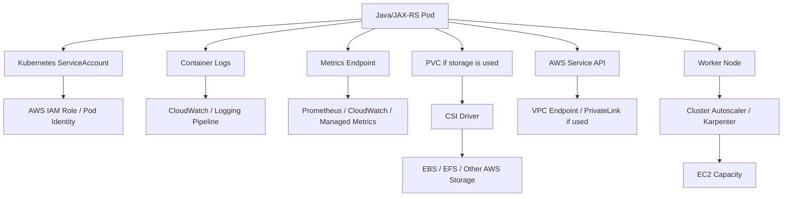
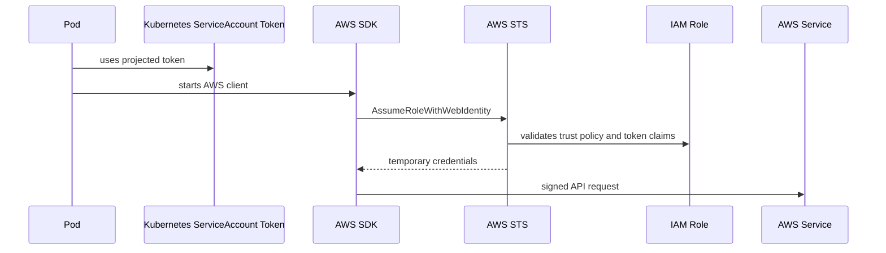

# Part 045 — EKS Storage, Identity, and Observability

EKS is not only a place where pods run.

For production Java/JAX-RS systems, EKS also becomes the point where application workloads meet AWS storage, AWS identity, AWS secrets, AWS logs, AWS metrics, node lifecycle, autoscaling, and cluster add-on governance.

A backend engineer does not need to own the whole EKS platform, but must understand enough to reason about these questions:

- Why is my pod unable to mount a volume?
- Why does my pod fail to call AWS Secrets Manager, S3, SQS, SNS, DynamoDB, EventBridge, or another AWS service?
- Why are logs missing in CloudWatch or the central logging platform?
- Why are metrics incomplete?
- Why did a node replacement disrupt my service?
- Why did Karpenter or Cluster Autoscaler not create capacity?
- Why did an EKS add-on upgrade break workload behavior?
- Why is an incident classified as application, platform, AWS integration, or capacity failure?

> CSG/internal note: this part does not assume CSG uses EKS, EBS CSI, EFS CSI, Secrets Manager CSI, External Secrets, IRSA, EKS Pod Identity, CloudWatch Container Insights, Prometheus, Karpenter, Cluster Autoscaler, managed node groups, self-managed nodes, or any specific add-on lifecycle model. Treat all CSG-specific cluster details as internal verification items.

---

## 1. Core Mental Model

EKS production operations can be understood as four cooperating planes:

```text
Workload plane       = pods, deployments, services, jobs, consumers
Storage plane        = CSI drivers, StorageClass, PVC, AWS storage services
Identity plane       = ServiceAccount, IAM, IRSA / Pod Identity, AWS SDK resolution
Observability plane  = logs, metrics, traces, events, dashboards, alerts
Capacity plane       = node groups, autoscalers, Karpenter, scheduling, disruption
```

Your Java/JAX-RS service may look simple:

```text
HTTP request -> JAX-RS resource -> service layer -> database / cache / queue
```

But in EKS production, the hidden dependency graph may look like this:



A failure in any of these edges can look like an application outage.

---

## 2. What Backend Engineers Must Own vs Verify

In many enterprises, backend engineers do not own EKS itself.

But backend engineers usually still own whether their workload is compatible with the platform.

### Usually backend-owned

- application container image,
- JVM memory sizing,
- resource request/limit,
- probe endpoint behavior,
- graceful shutdown,
- dependency timeout/retry behavior,
- AWS SDK configuration,
- service account selection,
- application logs,
- metrics/traces instrumentation,
- runbook for service-specific failure,
- readiness evidence for production.

### Usually platform/SRE-owned

- cluster add-ons,
- node group strategy,
- Karpenter/Cluster Autoscaler,
- CSI driver installation,
- CloudWatch agent / logging agent,
- Prometheus deployment,
- IAM role boundaries,
- namespace policy,
- admission policy,
- cluster upgrade strategy,
- cross-account networking,
- cluster-level incident response.

### Shared responsibility

- StorageClass selection,
- volume durability expectation,
- IAM least privilege,
- AWS service egress,
- logging retention,
- metrics naming,
- alert threshold,
- autoscaling signal,
- disruption budget,
- node placement,
- production rollback.

Senior engineers should ask:

```text
Which layer owns this decision?
Which layer can break it?
Which layer emits the most useful signal when it breaks?
```

---

## 3. EKS Storage Overview

Kubernetes storage is abstracted through:

- `Volume`,
- `PersistentVolume`,
- `PersistentVolumeClaim`,
- `StorageClass`,
- CSI driver.

In EKS, common AWS-backed storage choices include:

- Amazon EBS through EBS CSI driver,
- Amazon EFS through EFS CSI driver,
- ephemeral node storage,
- `emptyDir`,
- occasionally instance store through a CSI driver,
- object storage such as S3 accessed through SDK, not as a normal POSIX filesystem unless special tooling is used.

Do not treat all storage as equivalent.

```text
EBS = block storage, usually single-node attach, zone-bound
EFS = network file storage, multi-node access possible, different latency profile
emptyDir = pod/node-local ephemeral storage, deleted with pod/node lifecycle
S3 = object storage, not POSIX disk
```

For Java/JAX-RS stateless services, persistent storage inside the pod should be rare.

Most backend services should externalize durable state to:

- PostgreSQL / RDS / managed database,
- Kafka / MSK / external Kafka,
- RabbitMQ / managed broker,
- Redis / ElastiCache,
- S3 or object store,
- Camunda persistence layer,
- dedicated stateful platform component.

A pod-local disk is not a database.

---

## 4. EBS CSI Driver

EBS is block storage.

In Kubernetes, EBS is commonly used through a `StorageClass` backed by the EBS CSI driver.

Typical use cases:

- single-writer persistent volume,
- database-like local disk dependency where self-managed stateful workload is approved,
- queue/broker data directory in controlled stateful setups,
- application-specific durable file data when architectural review accepts the risk.

### Important EBS properties

EBS is usually:

- attached to EC2 instances,
- tied to an Availability Zone,
- suitable for block storage,
- not a shared filesystem by default,
- sensitive to attach/detach lifecycle,
- affected by node placement and volume zone.

### Why this matters

A pod using an EBS-backed PVC cannot be freely scheduled to any node in any zone.

If the PVC is bound to a volume in zone A, the pod must run on a compatible node in zone A.

Failure pattern:

```text
Pod Pending
-> PVC bound to zone A
-> scheduler cannot find suitable node in zone A
-> autoscaler cannot or does not create compatible capacity
-> workload unavailable
```

### EBS anti-patterns

Avoid:

- assuming EBS is multi-node shared storage,
- using EBS for stateless Java service temp files,
- ignoring zone binding,
- ignoring backup/restore,
- mixing StatefulSet storage with weak PDB/disruption planning,
- treating PVC deletion as harmless,
- allowing accidental `Delete` reclaim policy for critical state without governance.

### EBS review questions

Ask:

- Which `StorageClass` is used?
- Is volume binding immediate or wait-for-first-consumer?
- What is the reclaim policy?
- What is the access mode?
- Which AZ is the volume in?
- Is there backup?
- Is restore tested?
- What happens during node drain?
- What happens during zone failure?
- Is the workload allowed to run stateful on Kubernetes?

---

## 5. EFS CSI Driver

EFS is network file storage.

In EKS, EFS is commonly consumed through the EFS CSI driver.

Potential use cases:

- shared read/write filesystem,
- multi-pod file sharing,
- legacy workloads requiring shared files,
- reports/export/import directories,
- shared static assets where appropriate.

### EFS trade-offs

EFS can solve multi-writer requirements, but it introduces different concerns:

- network latency,
- throughput mode,
- burst credit behavior,
- mount target availability,
- security group rules,
- access point permissions,
- NFS semantics,
- application compatibility with network filesystem behavior.

For Java/JAX-RS systems, EFS should not become an ungoverned shared mutable state bucket.

If multiple services read/write shared files, ask whether the system is silently building a distributed state machine without clear ownership.

### EFS failure symptoms

- pod stuck during volume mount,
- long startup time,
- application latency spike during file I/O,
- intermittent file access error,
- permission denied,
- stale file handle,
- unexpected cross-service coupling,
- throughput bottleneck.

### EFS review questions

Ask:

- Why is shared filesystem required?
- Who owns file lifecycle?
- Is file access part of a transaction boundary?
- What happens if EFS latency increases?
- Are NFS permissions correct?
- Are mount targets present in required subnets/AZs?
- Are security groups correct?
- Is the workload tolerant of network filesystem failure?

---

## 6. StorageClass Selection

`StorageClass` is not a neutral default.

It encodes operational behavior:

- provisioner,
- volume type,
- encryption setting,
- reclaim policy,
- volume binding mode,
- expansion support,
- topology constraints,
- performance class,
- filesystem type,
- mount options.

For production review, never accept:

```yaml
storageClassName: default
```

without knowing what `default` means.

### Review checklist for StorageClass

Verify:

- which StorageClass is default,
- whether it is EBS/EFS/other,
- whether encryption is enabled,
- whether volume expansion is allowed,
- whether reclaim policy is `Delete` or `Retain`,
- whether binding is `Immediate` or `WaitForFirstConsumer`,
- whether topology-aware scheduling is expected,
- whether backup tooling supports it,
- whether snapshot tooling supports it,
- whether production workloads are allowed to use it.

### Correctness concern

Changing StorageClass is not like changing an env var.

It may require:

- new PVC,
- migration,
- backup/restore,
- downtime or controlled cutover,
- revalidation of performance,
- data ownership review.

---

## 7. EKS Identity Overview

In EKS, workloads often need AWS permissions.

Examples:

- read secret from AWS Secrets Manager,
- read parameter from SSM Parameter Store,
- call S3,
- publish to SNS,
- send message to SQS,
- read DynamoDB,
- call EventBridge,
- fetch from ECR indirectly through node/kubelet identity,
- write logs/metrics through agents.

The unsafe shortcut is embedding AWS access keys in Kubernetes Secrets.

Production systems should prefer workload identity patterns.

Common patterns:

- IAM Roles for Service Accounts, commonly called IRSA,
- EKS Pod Identity where adopted,
- node instance role for node-level agents,
- separate IAM roles for platform controllers,
- carefully scoped CI/CD IAM roles.

---

## 8. IRSA Mental Model

IRSA connects a Kubernetes ServiceAccount to an AWS IAM role through OIDC federation.

The simplified flow:



Key point:

```text
The Java application should not know static AWS keys.
It should rely on AWS SDK credential provider chain.
```

### What must align

For IRSA to work:

- cluster OIDC provider must exist,
- ServiceAccount must be annotated with correct IAM role,
- IAM trust policy must trust the cluster OIDC provider,
- trust policy must match ServiceAccount subject and namespace,
- pod must use the intended ServiceAccount,
- projected token must be available,
- AWS SDK must support web identity credentials,
- IAM policy must allow the target action,
- network path to AWS STS and target service must work.

If any link fails, application sees AWS auth failure.

### Common IRSA failure modes

| Symptom | Likely cause |
|---|---|
| `AccessDenied` | IAM role lacks permission |
| `InvalidIdentityToken` | OIDC/trust/token mismatch |
| SDK falls back to node role | ServiceAccount annotation missing or SDK chain issue |
| Timeout calling STS | no egress/VPC endpoint/DNS/proxy issue |
| Works in one namespace, fails in another | trust policy subject mismatch |
| Works locally, fails in pod | local credentials hide missing pod identity config |

---

## 9. EKS Pod Identity Awareness

Some EKS environments may use EKS Pod Identity instead of, or alongside, IRSA.

The operational goal is similar:

```text
assign AWS permissions to Kubernetes workloads without static credentials
```

But the mechanism and cluster add-ons differ.

As a backend engineer, avoid assuming the exact identity mechanism.

Ask:

- Is the service using IRSA or EKS Pod Identity?
- Which ServiceAccount is bound to which IAM role?
- Is there a pod identity association?
- Is the EKS Pod Identity agent installed if required?
- Does the namespace/service account match the association?
- Which AWS SDK version is used?
- Are temporary credentials visible through SDK diagnostics?

### Identity review invariant

The invariant is:

```text
One workload should receive only the AWS permissions required for its job.
```

Not:

```text
All workloads share a powerful node role.
```

Not:

```text
All workloads use a broad application role.
```

Not:

```text
Secrets contain long-lived AWS keys.
```

---

## 10. AWS SDK Credential Resolution in Java

Java/JAX-RS services often call AWS through AWS SDK.

Inside EKS, credential resolution should usually be environment-driven.

A simplified provider chain may consider:

- environment variables,
- system properties,
- web identity token file,
- profile config,
- container/metadata providers,
- instance metadata.

In production, this can produce surprising behavior.

### Dangerous scenario

```text
Developer tests locally with admin AWS profile.
Service works locally.
Pod runs in EKS.
IRSA role is missing permission.
Production call fails with AccessDenied.
```

Local success does not prove pod identity correctness.

### Debugging questions

Ask:

- Which AWS SDK major version is used?
- Is web identity provider supported?
- Are AWS region and endpoint configured correctly?
- Is the app accidentally using static env credentials?
- Is `AWS_ROLE_ARN` injected?
- Is `AWS_WEB_IDENTITY_TOKEN_FILE` injected?
- Does the role trust the expected service account?
- Does the IAM policy allow the exact action/resource?
- Does network egress to STS exist?

---

## 11. Secrets Manager and Secret Delivery

EKS workloads may consume secrets through several patterns:

- Kubernetes Secret created by CI/CD or GitOps,
- External Secrets Operator pulling from AWS Secrets Manager,
- Secrets Store CSI Driver with AWS provider,
- application calling AWS Secrets Manager directly through SDK,
- SSM Parameter Store integration,
- sidecar/init-container secret fetch pattern.

There is no universally correct pattern.

Each has trade-offs.

| Pattern | Strength | Risk |
|---|---|---|
| Kubernetes Secret | simple app integration | secret exists in Kubernetes API |
| External Secrets | source of truth externalized | controller/RBAC/config complexity |
| Secrets Store CSI | avoids normal Secret in some modes | mount lifecycle and rotation complexity |
| SDK direct call | app controls caching/retry | app owns secret retrieval failure behavior |
| SSM Parameter Store | good for config-like values | may be misused for high-rotation secrets |

### Secret delivery invariant

A production secret strategy must define:

- source of truth,
- permission boundary,
- delivery mechanism,
- rotation behavior,
- reload behavior,
- audit trail,
- rollback behavior,
- leakage prevention,
- incident response.

### Java/JAX-RS impact

A secret failure can appear as:

- startup failure,
- readiness never true,
- database connection failure,
- Kafka/RabbitMQ auth failure,
- Redis auth failure,
- TLS handshake failure,
- AWS SDK AccessDenied,
- 500 responses after rotation,
- stale credential usage.

---

## 12. CloudWatch Logs and Container Logs

Container logs usually start as stdout/stderr.

A logging pipeline then collects them through:

- node agent,
- Fluent Bit / Fluentd / CloudWatch agent,
- container runtime log files,
- Kubernetes metadata enrichment,
- CloudWatch Logs or another log backend.

Your Java application should not write only to local files inside the container.

Preferred baseline:

```text
structured application logs -> stdout/stderr -> node log agent -> central log backend
```

### Logging failure modes

| Symptom | Possible cause |
|---|---|
| app logs visible in `kubectl logs` but not CloudWatch | agent issue, permissions, filter, log group error |
| logs missing Kubernetes metadata | enrichment misconfigured |
| logs delayed | agent backpressure or backend throttling |
| multiline stack traces broken | parser config issue |
| sensitive data in logs | app logging defect, missing redaction |
| high logging cost | noisy logs, debug level enabled, excessive payload logging |

### Backend logging contract

For Java/JAX-RS production services:

- log JSON if platform expects structured logs,
- include correlation ID / request ID,
- include service name and version,
- avoid secrets and PII,
- avoid dumping env vars,
- avoid logging full tokens,
- log dependency call failure with safe metadata,
- keep error logs actionable,
- avoid high-cardinality explosion in log labels.

---

## 13. CloudWatch Container Insights

CloudWatch Container Insights can provide cluster, node, pod, and container-level visibility depending on configuration.

Useful signals include:

- CPU usage,
- memory usage,
- pod restart count,
- node utilization,
- network metrics,
- container filesystem usage,
- cluster capacity,
- workload health.

Backend engineers should not treat CloudWatch as “platform-only”.

You need to know where to look when Kubernetes says:

```text
pod restarted
pod evicted
node under pressure
OOMKilled
CPU throttling suspected
```

### Metric interpretation caution

Container-level metrics are necessary but not sufficient.

For Java/JAX-RS systems, correlate:

- container CPU,
- container memory,
- JVM heap,
- JVM non-heap,
- GC pause,
- request latency,
- thread pool saturation,
- DB pool utilization,
- Kafka/RabbitMQ consumer lag,
- Redis timeout rate,
- pod restart count,
- node pressure.

A pod may look normal at Kubernetes level while JVM is unhealthy internally.

---

## 14. Prometheus on EKS

Prometheus may be self-managed, platform-managed, or replaced/augmented by managed services.

Regardless of the implementation, the application must expose useful metrics.

For Java/JAX-RS services, useful metrics include:

- HTTP request count,
- HTTP latency histogram,
- HTTP error count,
- request size/response size if relevant,
- JVM heap and non-heap memory,
- GC pause,
- thread pool metrics,
- datasource pool metrics,
- Kafka/RabbitMQ consumer lag and processing errors,
- Redis command latency/errors,
- external API latency/error rate,
- business workflow counters,
- readiness state if safe,
- build/version metadata.

### Prometheus review questions

Ask:

- Is the metrics endpoint exposed only internally?
- Is it scraped by ServiceMonitor/PodMonitor or another mechanism?
- Are metric labels bounded?
- Are histograms configured sensibly?
- Are RED/USE metrics covered?
- Are dashboards linked to runbooks?
- Are alerts actionable?
- Are alert thresholds based on customer impact?

---

## 15. EKS Add-On Management

EKS clusters depend on operational add-ons.

Examples:

- VPC CNI,
- CoreDNS,
- kube-proxy,
- EBS CSI driver,
- EFS CSI driver,
- EKS Pod Identity Agent,
- metrics server,
- load balancer controller,
- observability agents,
- security agents,
- policy agents.

Some may be EKS managed add-ons.

Some may be Helm-installed.

Some may be GitOps-managed.

Some may be vendor-managed.

### Why add-on ownership matters

An add-on upgrade can change production behavior.

Examples:

- CNI upgrade changes pod networking behavior,
- CoreDNS upgrade changes DNS behavior,
- kube-proxy change affects service routing,
- CSI driver change affects volume mount,
- observability agent change affects log/metric delivery,
- identity agent change affects AWS credential delivery,
- load balancer controller change affects ALB/NLB provisioning.

### Add-on review questions

Ask:

- Which add-ons are EKS-managed?
- Which add-ons are self-managed?
- Which add-ons are GitOps-managed?
- Who owns version upgrades?
- How are add-ons tested before production?
- Are add-on versions pinned?
- Are add-on changes included in change management?
- Are add-on incidents tracked?
- What is the rollback path?

---

## 16. Cluster Autoscaler vs Karpenter

EKS environments may use Cluster Autoscaler, Karpenter, managed node groups, EKS Auto Mode, or another capacity strategy.

The core capacity problem is simple:

```text
Pods need schedulable capacity.
Capacity systems create, remove, or adjust nodes.
```

But production behavior is complex.

### Cluster Autoscaler mental model

Cluster Autoscaler typically works by increasing or decreasing node group capacity when pods cannot be scheduled or nodes are underutilized.

It is node group oriented.

### Karpenter mental model

Karpenter provisions nodes more dynamically based on pending pod requirements and configured provisioner/node pool constraints.

It is scheduling-demand oriented.

### Backend engineer concern

You do not need to tune the whole autoscaler.

But your workload must provide good scheduling signals:

- accurate CPU request,
- accurate memory request,
- tolerations if needed,
- node affinity only when required,
- topology spread constraints that are feasible,
- PDB that allows safe disruption,
- no impossible storage topology,
- no unnecessary dedicated node requirement.

Bad workload constraints can make autoscaling look broken.

### Autoscaling failure examples

| Symptom | Possible cause |
|---|---|
| pod Pending, no new node | autoscaler not seeing pod, quota, subnet/IP shortage, incompatible constraints |
| node created but pod still Pending | taint/toleration mismatch, volume zone mismatch, resource shape mismatch |
| frequent node churn | aggressive consolidation, unstable workload demand, bad PDB |
| service latency during scale-out | JVM warmup, image pull latency, readiness too early |
| cost spike | requests too high, HPA runaway, node type mismatch, log/metric explosion |

---

## 17. Node Management

Nodes are not invisible.

Your pod runs on a node with:

- OS image,
- kernel,
- container runtime,
- kubelet,
- CNI plugin,
- daemonsets,
- IAM role,
- ephemeral storage,
- instance type,
- zone,
- security group,
- labels,
- taints,
- capacity limits.

A Java service incident may be node-related.

### Node-related failure modes

- node not ready,
- node memory pressure,
- node disk pressure,
- node PID pressure,
- image filesystem full,
- CNI failure,
- kubelet unhealthy,
- daemonset consuming too much resource,
- spot interruption,
- node drain,
- node group rolling upgrade,
- AZ capacity issue,
- pod density/IP exhaustion.

### Backend review questions

Ask:

- Is the workload sensitive to node interruption?
- Is there a PDB?
- Is readiness delayed enough for warmup?
- Is startup image pull large?
- Are requests accurate enough for scheduling?
- Are logs filling node disk?
- Does pod require a specific node type?
- Is topology spread compatible with node capacity?

---

## 18. EKS Operations for Java/JAX-RS Services

For a Java/JAX-RS service on EKS, production readiness should include EKS-specific evidence.

### Minimum evidence

- pod can start from clean node,
- pod can pull image from registry,
- ServiceAccount resolves expected AWS identity,
- AWS SDK call succeeds with pod identity,
- logs arrive in central logging,
- metrics are scraped,
- traces are emitted if required,
- HPA/custom scaling signal exists if needed,
- pod tolerates node drain,
- rollout succeeds without 5xx spike,
- rollback succeeds,
- secret rotation path is known,
- storage mount path is tested if used,
- alert path is known.

### Java-specific concerns

EKS does not know that your service needs:

- warmup before traffic,
- JIT stabilization,
- DB pool initialization,
- Kafka consumer rebalance safety,
- RabbitMQ consumer acknowledgement safety,
- Redis reconnection behavior,
- Camunda worker shutdown behavior,
- graceful HTTP shutdown,
- dependency timeout budget,
- GC pause visibility.

You must encode these through app behavior, probes, lifecycle hooks, resources, and observability.

---

## 19. Impact on PostgreSQL, Kafka, RabbitMQ, Redis, Camunda, and NGINX

### PostgreSQL

EKS identity/storage/observability affects PostgreSQL clients through:

- secret delivery for credentials,
- network path to RDS/on-prem DB,
- DNS/private endpoint resolution,
- connection pool sizing,
- TLS trust store,
- logs/metrics for DB errors,
- pod restart behavior during transactions.

### Kafka

Kafka consumers/producers are affected by:

- DNS/bootstrap server resolution,
- egress policies,
- TLS/SASL secret delivery,
- consumer lag metrics,
- rebalance behavior during pod drain,
- autoscaling based on lag,
- node disruption and graceful shutdown.

### RabbitMQ

RabbitMQ clients are affected by:

- credential rotation,
- channel/connection lifecycle,
- network timeouts,
- ack/nack behavior during termination,
- queue depth metrics,
- consumer autoscaling.

### Redis

Redis clients are affected by:

- DNS/private endpoint,
- TLS/auth secret,
- connection timeout,
- retry storm risk,
- cache stampede during restart,
- latency observability.

### Camunda

Camunda workers/process-related workloads are affected by:

- worker lock duration,
- shutdown behavior,
- retry semantics,
- database connectivity,
- job acquisition metrics,
- incident correlation.

### NGINX / Ingress

NGINX/ingress is affected by:

- add-on/controller lifecycle,
- log routing,
- ALB/NLB integration,
- certificate/TLS configuration,
- timeout chain,
- health check behavior,
- source IP/header preservation.

---

## 20. Failure Mode Matrix

| Area | Symptom | First places to inspect |
|---|---|---|
| EBS CSI | PVC pending or mount failure | PVC events, StorageClass, CSI pods, node zone |
| EFS CSI | mount timeout or permission denied | mount target, SG, access point, CSI logs |
| IRSA | AccessDenied or invalid token | ServiceAccount, IAM trust, pod env, STS call |
| Pod Identity | AWS auth failure | association, agent, ServiceAccount, IAM role |
| Secrets | app startup failure | secret provider, IAM, mounted file, env var, rotation |
| Logs | logs missing | `kubectl logs`, logging agent, CloudWatch permissions |
| Metrics | dashboard blank | metrics endpoint, scrape config, ServiceMonitor, agent |
| Autoscaler | pods Pending | events, constraints, quota, subnet/IP capacity |
| Node | pod evicted | node pressure, events, daemonset usage, disk pressure |
| Add-on | cluster-wide regression | add-on version, recent upgrade, controller logs |

---

## 21. Debugging Workflow

Use layered debugging.

### Step 1: classify the failure

```text
Is it startup?
Is it identity?
Is it storage?
Is it networking?
Is it observability?
Is it capacity?
Is it node disruption?
Is it cloud API permission?
```

### Step 2: inspect Kubernetes state

```bash
kubectl get pod -n <namespace> <pod>
kubectl describe pod -n <namespace> <pod>
kubectl get events -n <namespace> --sort-by=.lastTimestamp
kubectl get pvc -n <namespace>
kubectl describe pvc -n <namespace> <pvc>
kubectl get sa -n <namespace> <service-account> -o yaml
```

### Step 3: inspect workload logs

```bash
kubectl logs -n <namespace> <pod> --previous
kubectl logs -n <namespace> <pod>
```

### Step 4: inspect platform components if allowed

```bash
kubectl get pods -n kube-system
kubectl logs -n kube-system <csi-or-agent-pod>
kubectl logs -n kube-system <coredns-pod>
```

### Step 5: inspect AWS side with platform team

Potential AWS-side checks:

- IAM role and trust policy,
- CloudTrail event for denied action,
- CloudWatch log group ingestion,
- EBS/EFS resource state,
- VPC endpoint connectivity,
- subnet IP capacity,
- EC2 node lifecycle,
- Karpenter/Cluster Autoscaler events,
- add-on version.

---

## 22. Production-Safe Debugging Rules

Do not debug production EKS by mutation first.

Avoid:

- editing live Deployment directly without GitOps awareness,
- deleting PVCs to “unstick” a pod,
- broadening IAM role to admin temporarily,
- adding static AWS keys to a Kubernetes Secret,
- disabling NetworkPolicy without blast-radius review,
- draining nodes during active incident without coordination,
- restarting all pods without understanding readiness and downstream impact,
- scaling consumers aggressively without checking downstream capacity.

Prefer:

- read-only inspection first,
- compare with known-good revision,
- inspect events and recent changes,
- verify identity and network separately,
- test in lower environment,
- use rollback when failure correlates with deployment,
- involve platform/SRE when failure crosses cluster boundary.

---

## 23. EKS Operations Checklist

### Storage

- [ ] Identify all PVCs used by the service.
- [ ] Confirm StorageClass behavior.
- [ ] Confirm reclaim policy.
- [ ] Confirm volume binding mode.
- [ ] Confirm backup/restore expectation.
- [ ] Confirm zone/topology constraints.
- [ ] Confirm CSI driver ownership.
- [ ] Confirm mount failure runbook.

### Identity

- [ ] Identify ServiceAccount used by pod.
- [ ] Confirm IRSA or Pod Identity mechanism.
- [ ] Confirm IAM role ARN.
- [ ] Confirm trust policy.
- [ ] Confirm least privilege policy.
- [ ] Confirm AWS SDK credential resolution.
- [ ] Confirm STS/network path.
- [ ] Confirm CloudTrail/audit path.

### Secrets

- [ ] Identify source of truth.
- [ ] Confirm delivery mechanism.
- [ ] Confirm rotation process.
- [ ] Confirm reload behavior.
- [ ] Confirm leakage prevention.
- [ ] Confirm RBAC access.
- [ ] Confirm incident process for compromised secret.

### Observability

- [ ] Logs visible through `kubectl logs`.
- [ ] Logs visible in central logging.
- [ ] Logs include correlation ID.
- [ ] Metrics scraped.
- [ ] JVM metrics available.
- [ ] Dependency metrics available.
- [ ] Alerts mapped to customer impact.
- [ ] Dashboards linked to runbook.

### Capacity and nodes

- [ ] Requests/limits are realistic.
- [ ] HPA/custom metrics are correct.
- [ ] Node constraints are feasible.
- [ ] PDB exists where needed.
- [ ] Workload tolerates node drain.
- [ ] Autoscaler behavior is understood.
- [ ] Spot/interruption handling is known if used.

---

## 24. PR Review Checklist

When reviewing a PR that touches EKS operations, ask:

- Does this introduce persistent storage?
- Does this change StorageClass/PVC behavior?
- Does this require new AWS permissions?
- Does the ServiceAccount/IAM binding already exist?
- Does this add or change secret delivery?
- Does this change log format or log volume?
- Does this expose metrics correctly?
- Does this change resource shape enough to affect scheduling?
- Does this affect HPA/KEDA/Karpenter/Cluster Autoscaler behavior?
- Does this require platform add-on support?
- Does this change node placement or topology requirement?
- Does this have rollback instructions?
- Does this need a platform/SRE review?
- Does this need security review?
- Does this need cost review?

---

## 25. Internal Verification Checklist

For CSG/team verification, check:

- whether EKS is used for the target environment,
- cluster version and mode,
- managed node group/self-managed node/Fargate/EKS Auto Mode usage,
- EBS CSI driver installation and ownership,
- EFS CSI driver installation and ownership,
- default StorageClass,
- approved StorageClasses for production,
- PVC backup/restore policy,
- IRSA usage,
- EKS Pod Identity usage,
- ServiceAccount naming convention,
- IAM role creation process,
- IAM permission review process,
- Secrets Manager/SSM/External Secrets/CSI usage,
- CloudWatch logging integration,
- Prometheus/Grafana integration,
- OpenTelemetry integration,
- CloudWatch Container Insights usage,
- Cluster Autoscaler/Karpenter/EKS Auto Mode usage,
- node group strategy,
- node upgrade runbook,
- add-on upgrade runbook,
- platform escalation path,
- security team requirements,
- incident examples related to EKS storage/identity/observability.

---

## 26. Senior Engineer Summary

EKS storage, identity, and observability are not platform trivia.

They are production dependencies.

For Java/JAX-RS services, the practical model is:

```text
Storage decides whether state survives and where the pod can run.
Identity decides what AWS services the pod can access.
Observability decides whether failure can be detected and explained.
Capacity management decides whether the workload can be scheduled and sustained.
Add-on management decides whether core cluster behavior remains stable.
```

A senior backend engineer should be able to review these concerns without pretending to own every AWS detail.

The right posture is:

```text
Own the application contract.
Understand the platform contract.
Verify the integration boundary.
Refuse unsafe ambiguity before production.
```
