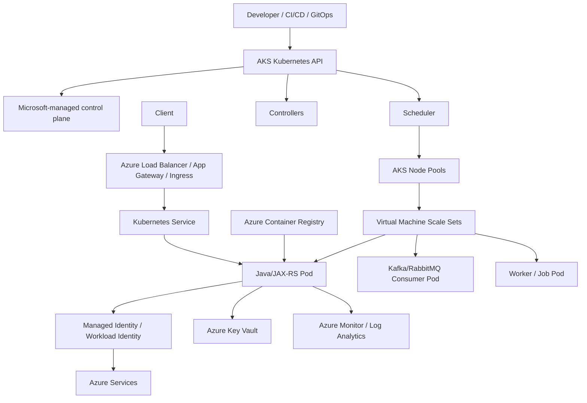
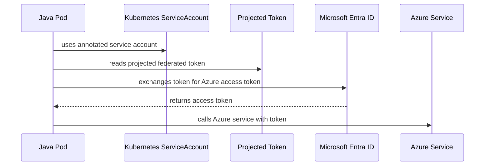

# Part 046 — AKS Foundation

Azure Kubernetes Service is not “generic Kubernetes with an Azure logo”.

AKS is Kubernetes integrated with Azure networking, Azure identity, Azure Container Registry, Azure Load Balancer, Azure Monitor, Azure DNS, managed control-plane operations, node pools, VM Scale Sets, private endpoints, Azure RBAC, Microsoft Entra ID, and enterprise Azure governance.

For a senior Java/JAX-RS engineer, the goal is not to become an Azure infrastructure specialist overnight.

The goal is to understand how AKS affects:

- workload scheduling,
- container image pulls,
- service exposure,
- pod-to-Azure service access,
- identity and secret access,
- node lifecycle,
- deployment reliability,
- observability,
- production debugging,
- security and compliance review.

> CSG/internal note: this part does not assume CSG uses AKS, AKS Automatic, AKS Standard, Azure CNI, Azure CNI Overlay, Azure CNI Powered by Cilium, kubenet, ACR, Application Gateway, AGIC, Azure Monitor, Managed Identity, Workload Identity, Azure Key Vault CSI, private cluster, or any specific Azure subscription/network topology. Treat all internal topology and implementation details as items to verify with platform/SRE/DevOps/security/network teams.

---

## 1. Core Mental Model

AKS can be understood as:

```text
AKS = Kubernetes control plane managed by Microsoft
    + worker nodes in your Azure environment
    + Azure networking
    + Azure identity
    + Azure registry
    + Azure observability
    + enterprise governance
```

Kubernetes gives you:

- pods,
- deployments,
- services,
- ingress/gateway,
- configmaps,
- secrets,
- service accounts,
- RBAC,
- scheduling,
- reconciliation,
- controllers.

Azure gives you:

- managed control plane,
- node pools backed by VM Scale Sets,
- virtual networks and subnets,
- network security groups,
- route tables,
- Azure CNI / kubenet / overlay options,
- Azure Load Balancer,
- Application Gateway and ingress integration where used,
- Azure Container Registry,
- Managed Identity,
- Microsoft Entra Workload ID,
- Azure Key Vault,
- Azure Monitor and Log Analytics,
- Azure Disk and Azure Files CSI drivers,
- Azure DNS and Private DNS Zones,
- Private Link / Private Endpoint,
- Azure Policy.

Your Java/JAX-RS service sits on top of all of this.

---

## 2. Simplified AKS Architecture

A simplified AKS environment looks like this:



The key distinction:

```text
AKS control plane manages Kubernetes state.
Node pools run your containers.
Azure services provide network, identity, registry, storage, monitoring, and external dependencies.
```

---

## 3. Managed Control Plane

In AKS, the Kubernetes control plane is hosted and managed by Microsoft.

This usually means application teams do not operate their own API server or etcd nodes.

However, managed control plane does not mean managed application correctness.

You still own:

- Dockerfile correctness,
- image quality,
- Deployment manifest correctness,
- resource requests/limits,
- probe behavior,
- service exposure assumptions,
- application config,
- secret usage,
- client timeouts/retries,
- logging/metrics/tracing,
- graceful shutdown,
- rollback safety.

### Control-plane relevance to backend engineers

Even if Microsoft manages the control plane, your delivery flow depends on it:

- GitOps sync calls the Kubernetes API,
- CI/CD deployment calls the Kubernetes API,
- scheduler places pods,
- controllers reconcile Deployment/Service/Ingress,
- admission policies validate manifests,
- HPA requires metrics,
- RBAC controls access,
- API deprecations affect manifests,
- cluster upgrade affects workload compatibility.

A platform-managed control plane reduces infrastructure toil.

It does not eliminate the need for Kubernetes reasoning.

---

## 4. Responsibility Boundaries

### Microsoft/Azure usually manages

Depending on AKS mode and configuration:

- Kubernetes control-plane hosting,
- control-plane availability boundaries,
- managed cluster API endpoint behavior,
- managed add-ons when enabled,
- integration with Azure Resource Manager,
- managed identity plumbing for cluster operations,
- supported node image lifecycle boundaries,
- managed components depending on AKS configuration.

### Platform/SRE usually manages

In enterprise environments:

- Azure subscription/resource group structure,
- VNet/subnet design,
- node pool strategy,
- private cluster design,
- ACR integration,
- ingress strategy,
- Azure Monitor/Log Analytics configuration,
- Azure Policy/admission controls,
- Managed Identity/Workload Identity standards,
- Key Vault integration,
- network security group rules,
- upgrade strategy,
- namespace standards,
- runbooks.

### Backend/application team usually owns

For Java/JAX-RS workloads:

- service container image,
- JVM runtime configuration,
- resource sizing,
- readiness/liveness/startup probes,
- REST endpoint behavior,
- graceful shutdown,
- config and secret consumption,
- database/messaging/cache clients,
- application logs,
- metrics/traces,
- failure handling,
- rollout safety,
- production readiness evidence.

### Shared ownership

- identity permissions,
- secret access,
- ingress route behavior,
- private endpoint connectivity,
- network policies,
- autoscaling metrics,
- cost attribution,
- incident response.

---

## 5. AKS Cluster Modes Awareness

AKS capabilities and defaults evolve.

You may encounter:

- AKS Standard,
- AKS Automatic,
- private AKS clusters,
- public endpoint clusters with restricted access,
- Azure CNI configurations,
- Azure CNI Overlay,
- Azure CNI powered by Cilium,
- kubenet legacy configurations,
- system/user node pools,
- cluster autoscaler,
- managed add-ons,
- Azure Policy integration.

As a backend engineer, do not assume the mode.

Ask:

```text
Which AKS mode is this environment using?
Which networking model is enabled?
Which identity model is enabled?
Which add-ons are managed by Azure?
Which parts are managed by the platform team?
```

This matters because the debugging path changes.

---

## 6. Node Pools

AKS uses node pools to organize worker nodes.

A node pool is a group of nodes with similar characteristics.

Common distinctions:

- system node pool,
- user node pool,
- Linux node pool,
- Windows node pool if used,
- spot node pool,
- GPU node pool,
- memory-optimized node pool,
- dedicated workload node pool,
- isolated/security-sensitive node pool.

### System node pool

The system node pool is intended for critical system components.

Examples may include:

- CoreDNS,
- metrics components,
- tunneling/agent components,
- add-on pods,
- system DaemonSets.

Application workloads should usually run on user node pools unless platform policy says otherwise.

### User node pool

User node pools are usually where application workloads run.

They may be separated by:

- environment,
- workload type,
- cost profile,
- availability requirement,
- tenant/team,
- compute shape,
- security boundary.

### Why node pools matter

Your pod scheduling depends on node pool properties:

- CPU/memory capacity,
- VM size,
- zone placement,
- labels,
- taints,
- OS image,
- ephemeral disk capacity,
- max pods per node,
- subnet/IP capacity,
- upgrade state.

A pod pending issue may be caused by node pool constraints, not application code.

---

## 7. VM Scale Sets

AKS node pools are commonly backed by Azure Virtual Machine Scale Sets.

You usually do not treat every VM as a hand-managed server.

But you must understand that a node is still a VM with:

- CPU,
- memory,
- disk,
- OS image,
- network interface,
- subnet,
- NSG rules,
- route table behavior,
- kubelet,
- container runtime,
- daemonsets,
- identity.

### Node failure can look like application failure

Examples:

- node not ready,
- node image issue,
- disk pressure,
- memory pressure,
- VMSS upgrade/reimage,
- spot eviction,
- subnet IP exhaustion,
- CNI issue,
- kubelet issue,
- daemonset resource pressure.

Backend engineers should know how to separate:

```text
Pod problem vs node problem vs node pool problem vs cluster problem
```

---

## 8. Azure CNI and Kubernetes Networking Awareness

AKS networking is one of the most important areas to verify.

Networking mode affects:

- pod IP allocation,
- subnet sizing,
- routability,
- NetworkPolicy behavior,
- private endpoint access,
- ingress design,
- service exposure,
- DNS behavior,
- firewall rules,
- IP exhaustion risk.

Common concepts you may encounter:

- Azure CNI,
- Azure CNI Overlay,
- Azure CNI powered by Cilium,
- kubenet awareness,
- NetworkPolicy provider,
- VNet,
- subnet,
- NSG,
- UDR,
- Azure Load Balancer,
- Application Gateway,
- private DNS zone,
- private endpoint.

This part only establishes the foundation.

Part 047 covers AKS networking and traffic flow in depth.

### Why backend engineers should care

A Java/JAX-RS timeout may be caused by:

- DNS failure,
- NSG blocking traffic,
- route table issue,
- private endpoint DNS mismatch,
- NetworkPolicy blocking egress,
- Azure Firewall/proxy rule,
- SNAT exhaustion,
- pod IP exhaustion,
- ingress misconfiguration,
- TLS trust issue.

Networking is not someone else's problem when your service is the symptom owner.

---

## 9. Kubenet Awareness

Some older or specific AKS clusters may use kubenet.

You do not need to prefer or reject it blindly.

You need to verify it because it changes operational assumptions.

Questions:

- Are pod IPs directly allocated from VNet or from an overlay range?
- Are routes managed automatically or manually?
- Are UDRs involved?
- Is NetworkPolicy supported in the expected way?
- Does private endpoint access require special routing/DNS?
- Are IP ranges overlapping with on-prem or other VNets?

If a runbook assumes Azure CNI but the cluster uses kubenet, debugging steps may be wrong.

---

## 10. Azure Container Registry

AKS commonly pulls images from Azure Container Registry.

ACR is not just a storage bucket for images.

It is part of the supply chain.

It affects:

- image pull authentication,
- image promotion,
- vulnerability scanning if configured,
- retention policy,
- replication,
- private endpoint access,
- cross-subscription access,
- outage behavior,
- deployment traceability.

### Image pull failure symptoms

- `ImagePullBackOff`,
- `ErrImagePull`,
- unauthorized pull,
- tag not found,
- digest not found,
- TLS/certificate issue,
- private endpoint DNS issue,
- slow image pull,
- registry throttling or outage.

### ACR review questions

Ask:

- Which ACR stores production images?
- Is AKS attached to ACR?
- Is pull access through kubelet identity or image pull secret?
- Are images referenced by immutable tag or digest?
- Are images promoted between environments or rebuilt?
- Is scanning enabled?
- Is retention policy safe?
- Is ACR reachable through private endpoint?
- What is the registry outage runbook?

---

## 11. Managed Identity in AKS

Managed Identity lets Azure resources authenticate to Azure services without manually managing credentials.

In AKS, there are several identity contexts.

Do not collapse them into one mental bucket.

Common identity concepts:

- cluster managed identity,
- kubelet identity,
- user-assigned managed identity,
- system-assigned managed identity,
- workload identity for pods,
- Azure RBAC,
- Kubernetes RBAC,
- Microsoft Entra ID integration.

### Cluster identity vs workload identity

Cluster identity is about AKS itself acting on Azure.

Examples:

- managing load balancer resources,
- managing network resources,
- interacting with Azure infrastructure,
- pulling images depending on setup,
- operating add-ons.

Workload identity is about your application pod accessing Azure services.

Examples:

- Java service reads from Key Vault,
- service writes to Storage Account,
- service calls Service Bus,
- service accesses App Configuration,
- service emits telemetry to Azure service.

Confusing these leads to bad permission design.

---

## 12. Workload Identity

Microsoft Entra Workload ID allows Kubernetes workloads to access Azure resources using federated identity rather than static secrets.

The high-level pattern:



The goal is similar to IRSA on AWS:

```text
pod gets cloud permissions without long-lived static secrets
```

### What must align

For workload identity to work:

- OIDC issuer must be enabled,
- workload identity feature must be enabled,
- Kubernetes ServiceAccount must be configured correctly,
- federated credential must match issuer/subject/audience,
- Azure identity must have correct Azure RBAC permissions,
- application must use SDK credential chain that supports workload identity,
- network path to Microsoft Entra and target service must work.

### Common failure modes

| Symptom | Likely cause |
|---|---|
| unauthorized to Key Vault | Azure RBAC/access policy missing |
| token exchange failure | federated credential mismatch |
| SDK uses wrong credential | credential chain/config issue |
| works locally but not in pod | local developer credential hides pod setup issue |
| timeout to Azure API | egress/proxy/private endpoint/DNS problem |
| works in one namespace only | subject/ServiceAccount mismatch |

---

## 13. Azure DNS and Private DNS Awareness

AKS workloads rely heavily on DNS.

There are multiple DNS layers:

- Kubernetes DNS for service discovery,
- Azure DNS for public/private records,
- Private DNS Zones for private endpoints,
- custom DNS servers in enterprise networks,
- split-horizon DNS,
- corporate DNS forwarding,
- on-prem DNS if hybrid.

A Java service usually sees only:

```text
UnknownHostException
connection timeout
TLS hostname mismatch
```

But the root cause may be private DNS configuration.

### Foundation questions

Ask:

- Does the cluster use default Azure DNS or custom DNS?
- Are private DNS zones linked to the VNet?
- Are private endpoint records resolving inside pods?
- Is CoreDNS forwarding to the right upstream?
- Are search domains/ndots causing unexpected lookup behavior?
- Does hybrid DNS resolve cloud and on-prem names correctly?

Part 047 and Part 052 go deeper into traffic flow and hybrid networking.

---

## 14. AKS Cluster Endpoint

AKS cluster endpoint configuration affects operational access.

Common variants:

- public cluster endpoint,
- private cluster endpoint,
- authorized IP ranges,
- private DNS integration,
- jump host or VPN-required access,
- CI/CD or GitOps access path.

This matters because deployment and incident response need API access.

### Failure symptoms

- CI/CD cannot deploy,
- GitOps controller cannot sync,
- engineer cannot run `kubectl`,
- incident debugging delayed,
- private DNS resolution for API server fails,
- network path from runner to cluster blocked.

### Backend concern

You do not need to own API endpoint design.

But you need to know:

- how to access the cluster during incident,
- which environment requires VPN/bastion,
- whether production debugging is read-only,
- whether GitOps is the only supported mutation path,
- who can approve emergency access.

---

## 15. AKS Add-Ons

AKS can integrate with several add-ons and managed features.

Examples:

- Azure Key Vault provider for Secrets Store CSI Driver,
- Azure Monitor / Container Insights,
- application routing add-on,
- ingress controllers,
- Azure Policy,
- cluster autoscaler,
- CSI drivers,
- network observability features,
- service mesh if enabled,
- Open Service Mesh or other mesh where used.

Add-ons are not harmless toggles.

They affect production behavior.

### Add-on review questions

Ask:

- Which add-ons are enabled?
- Who owns their versions?
- Are they Azure-managed, Helm-managed, or GitOps-managed?
- Are they required for app startup?
- Are they required for secret delivery?
- Are they required for logs/metrics?
- Are they required for ingress?
- What happens if the add-on fails?
- Is there an add-on upgrade test plan?
- Is there rollback?

---

## 16. Azure Key Vault Foundation

Azure Key Vault often acts as source of truth for secrets, certificates, and keys.

AKS workloads may access Key Vault through:

- Secrets Store CSI Driver with Azure provider,
- External Secrets-style controllers,
- direct SDK call from application,
- synced Kubernetes Secret if configured,
- platform-specific secret injection.

### Secret delivery concerns

- Does the secret appear as file, env var, or Kubernetes Secret?
- Does rotation update the pod automatically?
- Does the app reload the secret?
- What identity reads the secret?
- Is access audited?
- Are Key Vault firewall/private endpoint settings compatible with AKS?
- Is secret name/version pinned?
- What happens during Key Vault outage?

### Java/JAX-RS impact

A Key Vault issue may surface as:

- app startup failure,
- database auth failure,
- TLS certificate load failure,
- outbound API auth failure,
- readiness failure,
- intermittent 500 after rotation,
- stale connection pool using old credentials.

---

## 17. Azure Monitor and Log Analytics Foundation

AKS observability often uses Azure Monitor and Log Analytics.

The application should still provide good telemetry.

Platform tooling can collect logs and metrics, but it cannot invent application semantics.

For Java/JAX-RS systems, required signals usually include:

- HTTP request count,
- HTTP latency,
- HTTP error rate,
- JVM heap/non-heap,
- GC pause,
- thread pool saturation,
- database pool utilization,
- Kafka/RabbitMQ consumer lag,
- Redis latency/errors,
- external API dependency latency,
- trace/correlation ID,
- pod restart count,
- readiness/liveness failures.

### Logging rules

Prefer:

- stdout/stderr,
- structured logs,
- correlation ID,
- safe error metadata,
- stable service name/version fields,
- bounded labels.

Avoid:

- writing only to local files,
- logging secrets,
- logging full request bodies with PII,
- enabling verbose debug logs in production,
- high-cardinality labels,
- unbounded exception spam.

---

## 18. AKS Foundation Failure Modes

| Area | Symptom | Possible cause |
|---|---|---|
| Node pool | pod Pending | insufficient capacity, taints, quota, subnet/IP exhaustion |
| ACR | ImagePullBackOff | missing pull permission, bad tag, private endpoint/DNS issue |
| Managed Identity | Azure API unauthorized | wrong identity, missing Azure role, scope mismatch |
| Workload Identity | token exchange failure | OIDC/federated credential/ServiceAccount mismatch |
| Key Vault | startup secret failure | identity permission, firewall, private endpoint, CSI issue |
| DNS | UnknownHostException | CoreDNS/custom DNS/private zone issue |
| Cluster endpoint | deployment failure | runner lacks network access or auth |
| Azure Monitor | missing logs | agent issue, workspace config, log filter, permission |
| Node upgrade | disruption | weak PDB, slow shutdown, readiness too early |
| Networking | timeout | NSG, UDR, Azure Firewall, NetworkPolicy, private endpoint issue |

---

## 19. Debugging Foundation Workflow

### Step 1: inspect workload state

```bash
kubectl get pod -n <namespace> <pod>
kubectl describe pod -n <namespace> <pod>
kubectl get events -n <namespace> --sort-by=.lastTimestamp
kubectl logs -n <namespace> <pod>
```

### Step 2: inspect image pull issues

```bash
kubectl describe pod -n <namespace> <pod>
kubectl get secret -n <namespace>
kubectl get sa -n <namespace> <service-account> -o yaml
```

Check:

- image name,
- image tag/digest,
- ACR registry,
- pull secret or managed identity integration,
- private endpoint/DNS,
- recent image promotion.

### Step 3: inspect identity issues

```bash
kubectl get sa -n <namespace> <service-account> -o yaml
kubectl describe pod -n <namespace> <pod>
```

Then verify with platform/security:

- Workload Identity enabled,
- OIDC issuer enabled,
- federated credential,
- Azure role assignment,
- Key Vault/Storage/Service Bus permissions,
- SDK credential chain.

### Step 4: inspect network/DNS issues

```bash
kubectl exec -n <namespace> <pod> -- nslookup <host>
kubectl exec -n <namespace> <pod> -- curl -v <endpoint>
```

Use production-safe commands only.

Do not run destructive tests from production pods.

### Step 5: inspect node/pool issues

```bash
kubectl get nodes -o wide
kubectl describe node <node>
kubectl top node
kubectl top pod -n <namespace>
```

Look for:

- memory pressure,
- disk pressure,
- taints,
- unschedulable node,
- node upgrade/drain,
- daemonset pressure,
- CNI issues.

---

## 20. Java/JAX-RS Design Implications on AKS

AKS does not change Java fundamentals, but it changes runtime assumptions.

### Startup

Your app must tolerate:

- cold image pull,
- JVM warmup,
- dependency initialization,
- Key Vault/secret availability,
- database pool creation,
- DNS resolution delay,
- readiness gate behavior.

### Runtime

Your app must expose:

- useful logs,
- metrics,
- traces,
- bounded memory behavior,
- clear error mapping,
- dependency timeout control,
- retry budgets.

### Shutdown

Your app must support:

- SIGTERM,
- readiness removal,
- connection draining,
- in-flight request completion,
- Kafka/RabbitMQ consumer stop,
- transaction boundary safety,
- thread pool shutdown.

### Azure integration

Your app must avoid:

- static Azure credentials in config,
- assuming local developer identity equals pod identity,
- hardcoding public endpoints when private endpoints are required,
- ignoring SDK timeout defaults,
- treating Key Vault as infinitely available,
- logging tokens or secret values.

---

## 21. Impact on PostgreSQL, Kafka, RabbitMQ, Redis, Camunda, and NGINX

### PostgreSQL

On AKS, PostgreSQL connectivity may depend on:

- private endpoint DNS,
- VNet peering,
- NSG/firewall rules,
- secret delivery from Key Vault,
- TLS certificate trust,
- connection pool configuration,
- pod identity if using Azure Database authentication patterns.

### Kafka

Kafka clients may depend on:

- bootstrap DNS,
- private network routing,
- SASL/TLS secret delivery,
- consumer lag metrics,
- graceful rebalance during pod termination,
- autoscaling signal.

### RabbitMQ

RabbitMQ clients may depend on:

- broker DNS,
- TLS/auth secret,
- queue depth metrics,
- ack behavior during shutdown,
- retry/backoff behavior during broker maintenance.

### Redis

Redis clients may depend on:

- private endpoint DNS,
- auth/TLS secret,
- timeout/retry settings,
- latency observability,
- cache stampede protection during restart.

### Camunda

Camunda workers/process services may depend on:

- job lock duration,
- database connectivity,
- worker identity/config,
- graceful shutdown,
- retry/incident behavior,
- correlation ID propagation.

### NGINX / Ingress

Ingress may depend on:

- Azure Load Balancer,
- Application Gateway,
- NGINX ingress controller,
- application routing add-on,
- TLS certificate,
- DNS record,
- source IP/header preservation,
- timeout chain.

---

## 22. AKS Foundation Review Checklist

### Cluster and environment

- [ ] Identify AKS cluster mode: Standard, Automatic, private/public endpoint.
- [ ] Identify Kubernetes version.
- [ ] Identify node pools.
- [ ] Identify system vs user node pools.
- [ ] Identify VM sizes and zones.
- [ ] Identify cluster upgrade policy.
- [ ] Identify maintenance windows.

### Networking

- [ ] Identify networking model: Azure CNI, overlay, Cilium, kubenet, or other.
- [ ] Identify VNet/subnet.
- [ ] Identify NSGs.
- [ ] Identify UDRs.
- [ ] Identify DNS model.
- [ ] Identify private DNS zones.
- [ ] Identify private endpoint usage.
- [ ] Identify ingress architecture.

### Registry

- [ ] Identify ACR registry.
- [ ] Confirm AKS-to-ACR pull permission.
- [ ] Confirm image tag/digest policy.
- [ ] Confirm scan and promotion process.
- [ ] Confirm private endpoint if used.
- [ ] Confirm registry outage runbook.

### Identity

- [ ] Identify cluster managed identity.
- [ ] Identify kubelet identity.
- [ ] Identify workload identity usage.
- [ ] Confirm OIDC issuer state.
- [ ] Confirm federated credentials.
- [ ] Confirm Azure role assignments.
- [ ] Confirm SDK credential behavior.

### Secrets

- [ ] Identify Key Vault usage.
- [ ] Identify secret delivery method.
- [ ] Confirm secret rotation behavior.
- [ ] Confirm app reload behavior.
- [ ] Confirm Key Vault network access.
- [ ] Confirm audit trail.

### Observability

- [ ] Identify Azure Monitor/Log Analytics workspace.
- [ ] Confirm logs are collected.
- [ ] Confirm metrics are collected.
- [ ] Confirm traces are collected if required.
- [ ] Confirm dashboards.
- [ ] Confirm alerts.
- [ ] Confirm runbook links.

---

## 23. PR Review Checklist

When reviewing AKS-related changes, ask:

- Does this change image registry, tag, or digest?
- Does this require new ACR permissions?
- Does this require a new managed identity or federated credential?
- Does this require Key Vault access?
- Does this require a new private endpoint or DNS record?
- Does this change ingress exposure?
- Does this change resource requests enough to affect node pool scheduling?
- Does this require a specific node pool?
- Does this add taints/tolerations or affinity?
- Does this affect PDB or node upgrade safety?
- Does this add high-volume logs or metrics?
- Does this affect Azure cost?
- Does this need platform/security/network review?
- Is rollback documented?

---

## 24. Internal Verification Checklist

For CSG/team verification, check:

- whether AKS is used in any environment,
- AKS cluster mode and version,
- subscription/resource group ownership,
- cluster endpoint access model,
- node pool structure,
- system/user node pool separation,
- VMSS and VM size standards,
- Azure CNI/kubenet/overlay/Cilium configuration,
- ACR registry and pull mechanism,
- image promotion process,
- Managed Identity model,
- Workload Identity model,
- Azure RBAC and Kubernetes RBAC boundary,
- Key Vault integration,
- Azure Monitor/Log Analytics integration,
- ingress architecture,
- private endpoint and private DNS usage,
- NetworkPolicy support,
- Azure Policy/admission controls,
- cluster upgrade procedure,
- node image upgrade procedure,
- platform escalation path,
- security review process,
- production runbooks,
- known AKS incidents and postmortems.

---

## 25. Senior Engineer Summary

AKS foundation is about understanding where Kubernetes ends and Azure begins.

For enterprise Java/JAX-RS systems, the critical model is:

```text
AKS control plane manages Kubernetes state.
Node pools provide runtime capacity.
Azure networking decides reachability.
ACR controls image supply.
Managed Identity / Workload Identity controls Azure access.
Key Vault controls secret access.
Azure Monitor / Log Analytics controls operational visibility.
Platform governance controls what is allowed.
```

A senior backend engineer should not treat AKS as an opaque hosting platform.

You should be able to ask precise questions, read the relevant Kubernetes objects, understand the Azure integration boundary, and know when to escalate to platform, network, security, or SRE.

The production posture is:

```text
Do not assume cloud integration works.
Verify identity.
Verify network path.
Verify registry access.
Verify observability.
Verify rollback.
Verify ownership.
```
