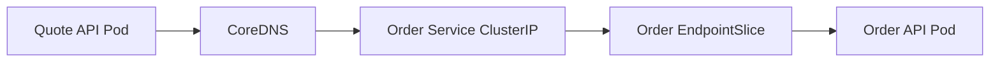
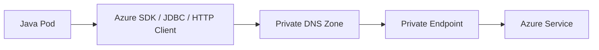
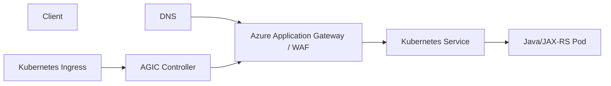
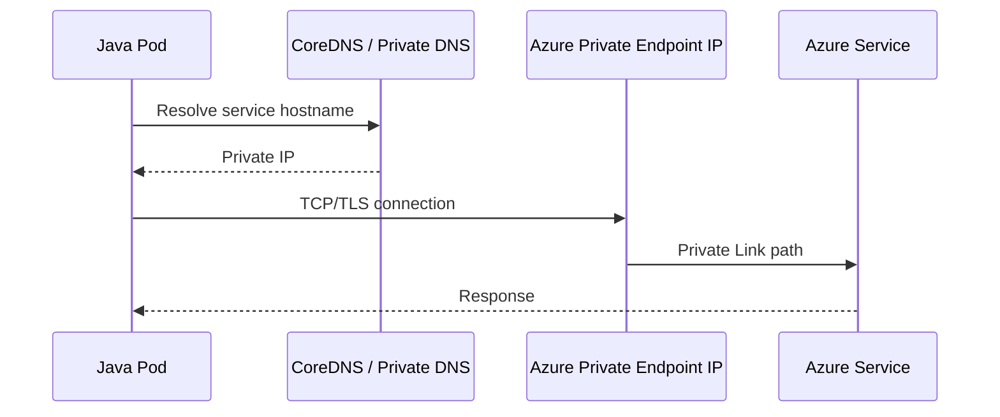

# Part 047 — AKS Networking and Traffic Flow

AKS networking is where Kubernetes abstractions meet Azure networking reality.

A Java/JAX-RS service may look simple from inside the codebase:

```java
@GET
@Path("/quotes/{id}")
public QuoteResponse getQuote(@PathParam("id") String id) { ... }
```

But in production, one request can cross:

- public DNS or private DNS,
- Azure Front Door or another edge layer,
- Azure Load Balancer or Application Gateway,
- ingress controller,
- Kubernetes Service,
- EndpointSlice,
- pod IP,
- container port,
- servlet/JAX-RS runtime,
- downstream PostgreSQL, Kafka, RabbitMQ, Redis, Camunda, or cloud service calls.

If you do not understand this path, you will misdiagnose 404, 502, 503, 504, timeout, TLS, DNS, source-IP, and private connectivity failures.

> CSG/internal note: this part does not assume CSG uses AKS, Azure CNI, Azure CNI Overlay, kubenet, Application Gateway, AGIC, NGINX ingress, Azure Front Door, private AKS, public AKS, private endpoints, Azure Firewall, UDR, NAT Gateway, or any specific DNS topology. Treat all topology-specific statements as an **Internal verification checklist** item.

---

## 1. Core Mental Model

AKS networking has two overlapping planes:

```text
Kubernetes networking plane:
  Pod IP
  Service IP
  EndpointSlice
  kube-proxy / dataplane implementation
  DNS / CoreDNS
  Ingress / Gateway
  NetworkPolicy

Azure networking plane:
  VNet
  Subnet
  NSG
  Route table / UDR
  Load Balancer
  Application Gateway
  Private Endpoint
  Private DNS Zone
  NAT Gateway / Firewall / egress path
  Azure DNS
```

Kubernetes decides how pods, services, and endpoints relate.

Azure decides how traffic enters, exits, routes, resolves, and gets filtered at infrastructure level.

A production incident often lives at the seam between these two planes.

---

## 2. AKS Network Flow at a Glance

A simplified north-south request flow:

```mermaid
flowchart LR
    Client[Client / Partner / Browser / API Consumer]
    DNS[Public or Private DNS]
    Edge[Azure Front Door / WAF / Corporate Edge if used]
    LB[Azure Load Balancer or Application Gateway]
    Ingress[Ingress Controller / AGIC / NGINX]
    SVC[Kubernetes Service]
    EPS[EndpointSlice]
    Pod[Java/JAX-RS Pod]
    App[JAX-RS Resource Method]

    Client --> DNS --> Edge --> LB --> Ingress --> SVC --> EPS --> Pod --> App
```



A simplified east-west call:



A simplified pod-to-private-Azure-service call:



For senior backend work, the question is always:

```text
Which hop failed?
Which layer owns that hop?
What signal proves it?
What is the safest mitigation?
```

---

## 3. VNet

A Virtual Network is the Azure network boundary where AKS nodes, subnets, load balancers, private endpoints, and routing rules live.

The VNet matters because it controls:

- reachable IP ranges,
- subnet segmentation,
- private endpoint placement,
- routing to on-prem networks,
- DNS integration,
- firewall/NAT path,
- NSG enforcement,
- peering boundaries,
- hybrid connectivity.

For Java/JAX-RS services, VNet design affects:

- whether the service can call internal APIs,
- whether the service can reach PostgreSQL/Kafka/RabbitMQ/Redis/Camunda,
- whether Azure SDK calls resolve to public or private endpoints,
- whether egress goes through NAT, firewall, proxy, or direct internet,
- whether partner/corporate clients can reach ingress endpoints.

### Common failure modes

- Pod cannot reach private database because VNet peering or route is missing.
- DNS resolves a public endpoint when private endpoint was expected.
- Traffic exits through unexpected NAT/firewall path.
- IP range overlaps with on-prem network.
- Firewall allows node subnet but not pod CIDR.
- Service works from one cluster but not another because VNet/subnet/route setup differs.

### Debugging questions

- What VNet is the AKS cluster attached to?
- What subnet contains nodes?
- Are pod IPs routable inside the VNet?
- Is the cluster private or public?
- Is there VNet peering?
- Is there VPN/ExpressRoute to on-prem?
- Are private endpoints in the same VNet or peered VNet?
- Does DNS resolve to private IP or public IP?

---

## 4. Subnet

Subnets divide a VNet into address ranges and policy zones.

In AKS, subnets may be used for:

- AKS nodes,
- pod IP allocation depending on networking mode,
- internal load balancer frontend IPs,
- Application Gateway,
- private endpoints,
- API server integration in private configurations,
- firewall/NAT components.

### Why backend engineers should care

If a subnet is too small, AKS can fail to scale nodes or pods.

If a subnet has restrictive NSG or UDR rules, pods may fail to reach dependencies.

If a private endpoint is attached to a different subnet/VNet without DNS/route alignment, application calls may fail even though credentials are correct.

### Failure signals

- Pods stuck Pending due to insufficient IP capacity.
- Node pool cannot scale out.
- New deployment works in dev but not prod because prod subnet has stricter egress.
- Private endpoint resolves but connection times out.
- Application Gateway or internal Load Balancer cannot attach expected IP.

### Internal verification checklist

- AKS node subnet.
- Pod IP allocation model.
- Subnet size and remaining capacity.
- NSG attached to subnet.
- UDR attached to subnet.
- Private endpoint subnet.
- App Gateway subnet if used.
- Internal Load Balancer frontend subnet.
- Firewall/NAT egress subnet.

---

## 5. NSG

Network Security Groups filter traffic at subnet or NIC level.

They are not Kubernetes NetworkPolicy.

```text
NetworkPolicy = Kubernetes-level pod traffic policy
NSG           = Azure network-level filtering
```

A pod traffic problem may be caused by either.

### NSG impact on Java/JAX-RS services

NSG rules can block:

- ingress traffic from Application Gateway or Load Balancer to nodes/pods,
- egress from pods to PostgreSQL/Kafka/RabbitMQ/Redis/Camunda,
- egress to Azure services,
- DNS traffic,
- telemetry export,
- calls to on-prem APIs,
- health probe traffic.

### Common failure modes

- Ingress 502 because Application Gateway cannot reach backend pods/nodes.
- Readiness probe succeeds internally but public endpoint fails due to NSG.
- Pod cannot connect to database private endpoint.
- Azure Monitor or OpenTelemetry exporter cannot send data.
- Kafka/RabbitMQ connection timeout due to port blocked.
- Health probes from Azure Load Balancer are blocked.

### Debugging model

When a connection fails:

```text
1. Did DNS resolve?
2. Is destination IP expected?
3. Is route correct?
4. Is Kubernetes NetworkPolicy allowing it?
5. Is NSG allowing it?
6. Is firewall allowing it?
7. Is target service listening?
8. Is TLS/auth failing after network connect?
```

Do not jump directly from “connection timeout” to “application bug”.

---

## 6. UDR and Route Tables

User Defined Routes control where packets go.

In enterprise AKS environments, UDRs may force traffic through:

- Azure Firewall,
- network virtual appliance,
- proxy path,
- corporate inspection layer,
- on-prem route via VPN or ExpressRoute.

### Why UDR matters

Your application code only sees:

```text
java.net.SocketTimeoutException
```

The cause may be:

- route sends traffic to firewall,
- firewall drops it,
- return path is asymmetric,
- destination route is missing,
- private endpoint route is not effective,
- outbound internet route is blocked.

### Failure modes

- Pod can resolve DNS but cannot connect.
- Connection works from one namespace/node pool but not another.
- Egress to internet package repository fails.
- Azure SDK call times out.
- On-prem API call intermittently fails after route change.
- MTU/path issue appears as long-request timeout.

### Review questions

- Is forced tunneling enabled?
- Is egress routed through Azure Firewall?
- Is NAT Gateway used?
- Are private endpoints routed locally?
- Are on-prem routes advertised correctly?
- Is return routing symmetric?
- Are route table changes governed by platform/network team?

---

## 7. Azure CNI, kubenet, and Overlay Awareness

AKS clusters can use different networking models.

Do not assume every AKS cluster assigns pod IPs the same way.

At a high level:

- **Azure CNI** integrates pod networking with Azure VNet semantics.
- **Azure CNI Overlay** uses an overlay pod CIDR while nodes remain connected to the VNet.
- **kubenet** is an older/simple model where routes and NAT behavior differ.
- **Azure CNI powered by Cilium** may introduce eBPF-based behavior depending on cluster configuration.

The exact mode affects:

- pod IP routability,
- subnet IP consumption,
- firewall rules,
- NSG assumptions,
- NetworkPolicy implementation,
- pod-to-private-endpoint flow,
- source IP visibility,
- debugging expectations.

### Senior engineer principle

Before debugging a network incident, identify the networking mode.

```bash
az aks show \
  --resource-group <rg> \
  --name <cluster> \
  --query "networkProfile"
```

Use this only where permitted.

### Failure mode examples

- Firewall allows node IP range but not pod CIDR.
- Subnet IP exhaustion under classic Azure CNI.
- NetworkPolicy behavior differs from expectation.
- Source IP appears different after NAT/overlay.
- Peered VNet cannot reach pod IPs depending on mode.

---

## 8. Azure Load Balancer

A Kubernetes `Service` of type `LoadBalancer` in AKS commonly creates or configures an Azure Load Balancer path.

Typical usage:

```yaml
apiVersion: v1
kind: Service
metadata:
  name: quote-api
spec:
  type: LoadBalancer
  ports:
    - port: 80
      targetPort: http
  selector:
    app: quote-api
```

This is infrastructure exposure, not application routing logic.

For multiple HTTP services, many enterprise setups use an ingress controller or Application Gateway rather than exposing every service directly.

### Internal vs public load balancer

An AKS LoadBalancer service may be public or internal depending on annotations and platform setup.

Internal load balancer is common for private enterprise APIs.

Public load balancer may be used for internet-facing services, often with WAF/edge layers in front.

### Failure modes

- External IP never assigned.
- Load balancer health probe fails.
- Service has no endpoints because selector is wrong.
- NSG blocks load balancer traffic.
- Source IP is not preserved as expected.
- Port mismatch between Service port and targetPort.
- Internal load balancer is created in wrong subnet.

### Debugging commands

```bash
kubectl get svc quote-api -n <namespace>
kubectl describe svc quote-api -n <namespace>
kubectl get endpointslice -n <namespace> -l kubernetes.io/service-name=quote-api
kubectl get pods -n <namespace> -l app=quote-api -o wide
```

Then verify the Azure side with platform/SRE or approved Azure tooling.

---

## 9. Application Gateway and AGIC

Application Gateway is an Azure L7 load balancer with HTTP routing and optional WAF capabilities.

Application Gateway Ingress Controller, commonly called AGIC, watches Kubernetes Ingress resources and configures Application Gateway accordingly.

Conceptually:



AGIC is a controller bridge:

```text
Kubernetes Ingress desired state -> Application Gateway configuration
```

### Why this matters

If a route fails, the issue may be in:

- DNS,
- Application Gateway listener,
- certificate,
- WAF rule,
- backend pool,
- health probe,
- AGIC reconciliation,
- Kubernetes Ingress,
- Service,
- EndpointSlice,
- pod readiness,
- Java endpoint.

### Common failure modes

- Application Gateway returns 502 because backend health probe fails.
- Ingress resource exists but AGIC did not reconcile it.
- TLS certificate mismatch.
- Path rewrite breaks JAX-RS route.
- Backend protocol mismatch: HTTP vs HTTPS.
- WAF blocks legitimate request body/header.
- Service targetPort mismatch causes unhealthy backend.
- Pod readiness false removes endpoint.

### JAX-RS-specific concern

Path routing and rewrite can break REST endpoints.

Example:

```text
External route: /api/quote/v1/quotes/123
Backend expects: /quotes/123
```

If rewrite behavior is not explicit, the Java application may return 404 even though ingress and service are healthy.

Review:

- context path,
- JAX-RS `@ApplicationPath`,
- reverse proxy path rewrite,
- forwarded headers,
- base URL generation,
- OpenAPI server URL,
- auth callback URL.

---

## 10. Azure Front Door Awareness

Azure Front Door may sit in front of Application Gateway, Load Balancer, API Management, or another ingress path.

It can provide:

- global edge routing,
- TLS termination,
- WAF,
- caching depending on configuration,
- custom domains,
- path-based routing,
- origin health probes.

For backend engineers, Front Door matters because it can change:

- source IP visibility,
- forwarded headers,
- timeout behavior,
- TLS termination points,
- WAF behavior,
- path routing,
- request size limits,
- origin health status.

### Failure modes

- Front Door origin is unhealthy while AKS service is healthy internally.
- WAF blocks request before it reaches AKS.
- Timeout occurs at edge before Java service completes.
- Redirect URL or absolute URL generation is wrong due to forwarded headers.
- Client IP is lost unless forwarded header chain is trusted correctly.

### Review questions

- Is Azure Front Door in the path?
- Where is TLS terminated first?
- What are origin timeout settings?
- Are health probes hitting the right path?
- Are `X-Forwarded-For`, `X-Forwarded-Proto`, and host headers preserved?
- Is WAF in detection or prevention mode?

---

## 11. Azure DNS and Private DNS Zone

DNS tells clients and pods where to send traffic.

AKS environments may use:

- public Azure DNS zones,
- private Azure DNS zones,
- CoreDNS inside the cluster,
- corporate DNS forwarders,
- split-horizon DNS,
- private endpoint DNS records,
- custom DNS servers.

### Public DNS flow

```text
client -> public DNS -> public edge/load balancer/application gateway -> ingress -> service -> pod
```

### Private DNS flow

```text
pod -> CoreDNS -> upstream/private DNS -> private endpoint IP -> Azure service
```

### Failure modes

- Hostname resolves publicly when private IP expected.
- Private DNS zone not linked to VNet.
- Corporate DNS returns different answer than pod DNS.
- DNS cache keeps stale record.
- CoreDNS forwarding misconfigured.
- Private endpoint exists but DNS still points to public endpoint.
- `ndots`/search behavior causes unexpected lookup latency.

### Debugging from pod

Use approved debug images and policy-compliant commands:

```bash
kubectl run dns-debug \
  -n <namespace> \
  --rm -it \
  --image=<approved-debug-image> \
  --restart=Never \
  -- sh
```

Inside the pod:

```bash
nslookup <host>
dig <host>
getent hosts <host>
```

If debug pod creation is restricted, use ephemeral container or platform-approved troubleshooting workflow.

---

## 12. Private Endpoint

Private Endpoint gives an Azure service a private IP in a VNet.

This is commonly used for services such as:

- Azure SQL,
- Storage Account,
- Key Vault,
- Event Hubs,
- Service Bus,
- Container Registry,
- PostgreSQL Flexible Server,
- Redis Enterprise/Cache patterns where supported,
- internal platform services.

A private endpoint is not just “private DNS”.

It requires:

- private endpoint resource,
- network interface/private IP,
- private DNS zone or equivalent DNS mapping,
- VNet link,
- route reachability,
- NSG/firewall compatibility,
- service-side permission/firewall configuration,
- TLS hostname compatibility.

### Pod-to-private-endpoint flow



### Common failure modes

- DNS points to public endpoint.
- Private DNS zone not linked to AKS VNet.
- NSG/firewall blocks private endpoint traffic.
- Service firewall blocks caller.
- TLS validation fails due to custom hostname misuse.
- Route table sends private endpoint traffic through wrong appliance.
- Java SDK uses regional/public endpoint override incorrectly.

### Java impact

A cloud SDK credential problem often returns explicit authorization errors.

A private endpoint network problem often appears as:

- timeout,
- connection refused,
- unknown host,
- TLS handshake failure,
- intermittent connection reset.

Do not treat all cloud SDK failures as IAM/Managed Identity problems.

---

## 13. Source IP Preservation

Source IP preservation is subtle.

Depending on the traffic path, the backend may see:

- original client IP,
- Azure Front Door IP,
- Application Gateway IP,
- Load Balancer IP,
- node IP,
- pod IP,
- NAT Gateway IP,
- proxy IP.

Application logic should rarely depend directly on socket remote address.

For audit/rate-limiting/security decisions, verify trusted header chain.

### Headers to review

- `X-Forwarded-For`
- `X-Forwarded-Proto`
- `X-Forwarded-Host`
- `Forwarded`
- proxy protocol if used

### Security concern

Never blindly trust forwarded headers from untrusted clients.

Only trust headers inserted by known ingress/edge proxies after boundary validation.

### JAX-RS impact

Wrong forwarded header handling can break:

- generated absolute URLs,
- redirects,
- auth callbacks,
- OpenAPI server URLs,
- audit logs,
- rate limiting,
- tenant routing if host-based.

---

## 14. Ingress Flow for Java/JAX-RS APIs

A practical ingress flow:

```text
1. Client resolves api.example.com.
2. DNS returns edge/load balancer/application gateway IP.
3. Edge receives TLS request.
4. WAF/routing rules evaluate host/path/header.
5. Ingress controller routes to Kubernetes Service.
6. Service resolves to EndpointSlice.
7. EndpointSlice points to ready pod IPs.
8. Pod receives traffic on container port.
9. Java HTTP server dispatches to JAX-RS endpoint.
10. Application calls downstream systems.
11. Response returns through the same proxy chain.
```

### Timeout chain

Every layer may have a timeout:

```text
Client timeout
Front Door timeout
Application Gateway timeout
Ingress controller timeout
Service/pod TCP behavior
Java server request timeout
JAX-RS application processing timeout
HTTP client timeout to downstream
Database timeout
Kafka/RabbitMQ/Redis timeout
```

The shortest relevant timeout often wins.

### Failure examples

- Java endpoint takes 90 seconds, edge timeout is 60 seconds: client gets 504.
- Ingress timeout is increased, but HTTP client downstream timeout is still 10 seconds: application returns 500.
- Readiness says ready before cache/database initialization: first requests fail.
- Path rewrite removes prefix incorrectly: 404 from Java route.
- TLS terminates at edge but application thinks request is HTTP: redirect loop.

---

## 15. Pod-to-Private-Service Flow

Many enterprise Java services are not only inbound APIs.

They also call:

- PostgreSQL,
- Kafka,
- RabbitMQ,
- Redis,
- Camunda engine/workers,
- Azure Key Vault,
- Azure Storage,
- Azure Service Bus/Event Hubs,
- internal REST APIs,
- CSG/platform services,
- on-prem systems.

A pod-to-private-service flow should be reviewed as:

```text
Application client config
  -> hostname
  -> DNS resolution
  -> route table
  -> NSG / firewall / NetworkPolicy
  -> private endpoint / internal load balancer / service endpoint
  -> TLS trust
  -> authentication / authorization
  -> timeout / retry / circuit breaker
  -> observability signal
```

### Do not collapse layers

`Connection timed out` is not the same as `401`.

`UnknownHostException` is not the same as `403`.

`SSLHandshakeException` is not the same as `network blocked`.

`No route to host` is not the same as `database overloaded`.

Correct classification matters during incident response.

---

## 16. AKS NetworkPolicy Interaction

NetworkPolicy may be enforced by the selected networking plugin/policy provider.

In enterprise clusters, default deny plus explicit allow rules may be required.

For Java/JAX-RS services, a useful baseline is:

- allow ingress only from ingress namespace/controller where needed,
- allow egress to DNS,
- allow egress to required internal services,
- allow egress to PostgreSQL/Kafka/RabbitMQ/Redis/Camunda only as needed,
- allow egress to Azure services/private endpoints only as needed,
- deny broad internet egress unless justified.

### Failure mode

A service may be healthy by liveness probe but unable to serve real traffic because NetworkPolicy blocks downstream dependencies.

This creates misleading dashboards:

```text
Pod Running = true
Readiness = true
Real business path = failing
```

Design readiness and synthetic checks carefully.

---

## 17. NGINX in AKS Context

NGINX may appear in multiple roles:

- NGINX Ingress Controller,
- sidecar reverse proxy,
- standalone edge proxy,
- local development proxy,
- upstream reverse proxy before AKS,
- internal API gateway pattern.

Do not assume all “NGINX errors” are the same.

A 502 from NGINX may mean:

- backend pod not reachable,
- service has no endpoint,
- backend closed connection,
- wrong protocol,
- upstream timeout,
- TLS mismatch,
- request body too large,
- proxy buffer issue,
- pod restarted mid-request.

A Java service owner should be able to map NGINX error to Kubernetes and application signals.

---

## 18. Observability for AKS Traffic Flow

You need signals at multiple layers.

### Kubernetes layer

- pod logs,
- ingress controller logs,
- service endpoints,
- Kubernetes events,
- pod readiness transitions,
- restart count,
- HPA scale events.

### Azure layer

- Application Gateway access logs,
- Application Gateway performance metrics,
- WAF logs,
- Load Balancer metrics,
- NSG flow logs if enabled,
- Azure Firewall logs if used,
- Private Endpoint metrics/logs where available,
- DNS query logs depending on setup,
- Azure Monitor / Log Analytics.

### Application layer

- request count,
- latency histogram,
- status code by route,
- downstream dependency latency,
- timeout count,
- retry count,
- circuit breaker open count,
- correlation ID propagation,
- business operation failure count.

### Minimum traceability goal

For one failed request, you should be able to answer:

```text
Did it reach edge?
Did it pass WAF?
Did it reach ingress?
Did ingress route it to service?
Did service have ready endpoints?
Did the pod receive it?
Did JAX-RS dispatch it?
Which downstream call failed?
What was the response status and latency at each layer?
```

---

## 19. Production Debugging Workflow

### Case: Client gets 404

Check:

1. DNS host correct?
2. Edge route matches host/path?
3. Ingress rule exists?
4. Rewrite rule changed path?
5. Service target correct?
6. Java context path / JAX-RS `@Path` correct?
7. Versioned API route deployed?

Likely layers:

- ingress route,
- path rewrite,
- application route,
- API version mismatch.

### Case: Client gets 502

Check:

1. Backend pool healthy?
2. Service endpoints exist?
3. Pods ready?
4. targetPort correct?
5. Protocol HTTP/HTTPS correct?
6. Pod restarted?
7. Java server accepting connections?

Likely layers:

- ingress/controller,
- service/pod readiness,
- protocol/port mismatch,
- backend crash.

### Case: Client gets 503

Check:

1. Are there ready endpoints?
2. Is rollout in progress?
3. Did PDB/HPA/rolling update reduce capacity?
4. Did readiness probe fail?
5. Did NetworkPolicy block ingress to pods?

Likely layers:

- readiness,
- capacity,
- rollout,
- selector mismatch.

### Case: Client gets 504

Check:

1. Which layer timed out?
2. Application latency increased?
3. Downstream dependency slow?
4. Ingress/Application Gateway timeout too short?
5. Thread pool exhausted?
6. DB/Kafka/RabbitMQ/Redis blocked?

Likely layers:

- timeout chain,
- app processing,
- downstream dependency,
- resource saturation.

---

## 20. Performance Concerns

AKS networking can affect performance through:

- extra proxy hops,
- WAF inspection,
- TLS termination/re-encryption,
- DNS latency,
- SNAT exhaustion,
- firewall bottleneck,
- cross-zone traffic,
- cross-region calls,
- private endpoint latency,
- packet fragmentation/MTU issues,
- overloaded ingress controller,
- undersized Application Gateway,
- noisy node.

For Java/JAX-RS services, performance analysis should include:

- request latency by route,
- ingress latency,
- application processing latency,
- downstream latency,
- connection pool wait time,
- DNS lookup latency,
- TLS handshake rate,
- HTTP client retry behavior,
- GC pause,
- CPU throttling.

---

## 21. Security and Privacy Concerns

Network design affects security posture.

Review:

- public vs private exposure,
- WAF usage,
- TLS termination points,
- internal mTLS if required,
- source IP trust model,
- forwarded header trust boundary,
- private endpoint use,
- NetworkPolicy default deny,
- NSG/firewall rules,
- egress allowlist,
- PII in URLs/query strings/logs,
- audit logging,
- admin/debug endpoint exposure,
- management port exposure.

### Dangerous anti-patterns

- Exposing management port through public ingress.
- Allowing all egress from production namespaces.
- Trusting client-supplied `X-Forwarded-For`.
- Using public endpoint when private endpoint is required.
- Disabling TLS validation to “fix” connectivity.
- Opening NSG/firewall broadly during incident and never closing it.

---

## 22. Cost Concerns

AKS traffic architecture can create hidden cost:

- Application Gateway cost,
- Azure Front Door cost,
- Load Balancer cost,
- NAT Gateway cost,
- Azure Firewall data processing cost,
- cross-zone data transfer,
- cross-region traffic,
- verbose WAF/access logs,
- high-cardinality telemetry,
- overprovisioned ingress controllers,
- unnecessary public/private endpoints per service.

Cost-aware review does not mean avoiding security.

It means knowing which network components exist, why they exist, and whether they are right-sized.

---

## 23. Example Review: Java API Behind Application Gateway

Suppose a Quote API is exposed through Application Gateway and AGIC.

Review path:

```text
api.company.internal
  -> Private DNS Zone
  -> Application Gateway private frontend IP
  -> listener + certificate
  -> rule: /quote/*
  -> backend pool generated by AGIC
  -> Kubernetes Service quote-api
  -> EndpointSlice ready pods
  -> container port 8080
  -> JAX-RS /quotes endpoint
```

Questions:

- Is this public or private?
- Is DNS private-only?
- Where is TLS terminated?
- Is backend HTTP or HTTPS?
- Is path rewrite required?
- Are forwarded headers trusted correctly?
- Does readiness endpoint reflect actual ability to serve traffic?
- Does Application Gateway health probe hit the correct endpoint?
- Does Service targetPort match container port?
- Are pods distributed across zones/nodes?
- What dashboard shows 4xx/5xx/latency per hop?

---

## 24. Example Review: Pod Calling Private PostgreSQL

Flow:

```text
Java JDBC client
  -> jdbc hostname
  -> CoreDNS
  -> Private DNS Zone
  -> Private Endpoint IP
  -> PostgreSQL service
  -> TLS/auth
```

Questions:

- Does hostname resolve to private IP from inside pod?
- Is private DNS zone linked to AKS VNet?
- Does NetworkPolicy allow egress to DB?
- Does NSG/firewall allow DB port?
- Is route table correct?
- Is PostgreSQL firewall/private access configured?
- Is TLS mode configured correctly?
- Are connection pool limits aligned with DB capacity?
- Are connection timeout and socket timeout explicit?
- Are retries safe for transactions?

---

## 25. Internal Verification Checklist

Use this checklist when joining a real AKS-based project.

### Cluster/network baseline

- Is the cluster public, private, or API-server-integrated with VNet?
- Which AKS networking mode is used?
- Which pod CIDR/service CIDR is used?
- Which VNet and subnet host the nodes?
- Is subnet capacity sufficient?
- Are route tables/UDRs attached?
- Is egress forced through Azure Firewall/NAT/proxy?
- Is VNet peering used?
- Is ExpressRoute/VPN used?

### Ingress and edge

- Is Azure Front Door used?
- Is Application Gateway used?
- Is AGIC used?
- Is NGINX ingress used?
- Is Gateway API used?
- Is Azure Load Balancer used directly?
- Which layer terminates TLS?
- Is WAF enabled?
- Are certificates managed centrally?
- Are host/path rewrites used?
- Are source IP and forwarded headers preserved safely?

### DNS and private connectivity

- Which DNS zones are public?
- Which DNS zones are private?
- Are Private DNS Zones linked to AKS VNet?
- Are corporate DNS forwarders involved?
- Is split-horizon DNS used?
- Which services use Private Endpoint?
- Are private endpoint records validated from inside pods?

### Security filtering

- Which NSGs apply to node, App Gateway, private endpoint, and firewall subnets?
- Are NetworkPolicies enabled?
- Is default deny used?
- Are egress rules explicit?
- Are database/messaging/cache ports restricted?
- Are management endpoints exposed?

### Observability

- Are Application Gateway access/WAF logs available?
- Are ingress controller logs available?
- Are NSG flow logs available if needed?
- Are Azure Firewall logs available if used?
- Are pod logs correlated with edge request IDs?
- Is there a dashboard for ingress 4xx/5xx/latency?
- Is there a dashboard for downstream dependency failures?

### Java/JAX-RS application

- Does app understand forwarded headers safely?
- Are context path and ingress path rewrite aligned?
- Are timeout values explicit?
- Are HTTP client retries bounded?
- Are dependency calls instrumented?
- Are readiness endpoints compatible with ingress health probes?
- Is management port protected?

---

## 26. PR Review Checklist

When reviewing AKS networking changes, ask:

- What traffic path changes?
- Is this public or private exposure?
- What DNS record changes?
- What TLS certificate changes?
- Which ingress/controller owns the route?
- Does the Service selector still match pods?
- Does targetPort match the container port?
- Are path rewrites explicit?
- Are forwarded headers handled safely?
- Does this require NSG/firewall/UDR change?
- Does this require NetworkPolicy change?
- Does this affect private endpoint DNS?
- What is the rollback path?
- What dashboard proves success?
- What alert catches failure?
- What is the expected blast radius?

---

## 27. Senior Engineer Summary

AKS networking is not just YAML.

It is a chain of responsibility across:

```text
DNS
Azure edge
Azure load balancing
Ingress/controller reconciliation
Kubernetes service discovery
Pod readiness
Java runtime behavior
Downstream dependency connectivity
Azure/private/hybrid networking
```

A senior backend engineer should be able to reason from client symptom to pod behavior and from pod behavior to Azure network dependency.

The most important habit is to classify the failure correctly:

```text
DNS failure
routing failure
filtering failure
TLS failure
auth failure
service discovery failure
readiness failure
application route failure
dependency timeout
capacity failure
```

Without that classification, debugging becomes guesswork.
