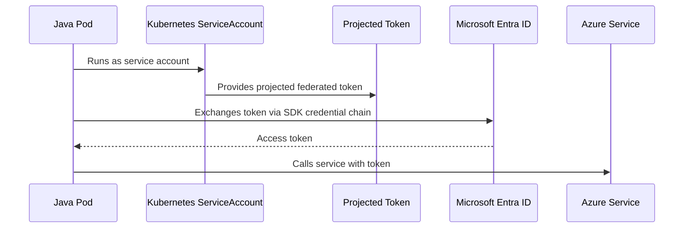

# Part 048 — AKS Storage, Identity, and Observability

AKS production readiness is not only about pods starting successfully.

A real enterprise Java/JAX-RS service needs reliable integration with:

- persistent storage when needed,
- Azure identity without hardcoded credentials,
- Key Vault or external secret flows,
- Azure Container Registry image pulls,
- metrics, logs, traces, and events,
- autoscaling and node lifecycle,
- upgrade and maintenance windows,
- platform runbooks.

This part connects AKS cloud integration to backend engineering decisions.

> CSG/internal note: this part does not assume CSG uses Azure Disk, Azure Files, Key Vault CSI, Workload Identity, Managed Identity, Azure Monitor, Log Analytics, ACR, Cluster Autoscaler, specific node pool upgrade policies, or any Azure subscription topology. All environment-specific details must be validated through internal codebase, IaC, Helm/Kustomize/GitOps repo, Azure configuration, and platform/SRE/DevOps/security teams.

---

## 1. Core Mental Model

AKS integrates Kubernetes with Azure primitives:

```text
Kubernetes abstraction       Azure implementation / integration
---------------------------------------------------------------
PersistentVolumeClaim        Azure Disk / Azure Files CSI
StorageClass                 Azure storage class + CSI parameters
ServiceAccount identity      Managed Identity / Workload Identity
Secret source                Key Vault / External Secrets / CSI driver
Image pull                   Azure Container Registry integration
Logs and metrics             Azure Monitor / Container Insights / Log Analytics
Node scaling                 Cluster Autoscaler / node pool scaling
Node lifecycle               VMSS / node image / upgrade settings
```

For a Java/JAX-RS service, these integrations affect:

- startup reliability,
- secret access,
- database credential rotation,
- image pull reliability,
- persistent cache/file behavior,
- auditability,
- incident debugging,
- cost,
- upgrade safety.

---

## 2. AKS Storage Model

Kubernetes storage abstractions remain the same:

- `Volume`,
- `PersistentVolume`,
- `PersistentVolumeClaim`,
- `StorageClass`,
- CSI driver,
- access mode,
- reclaim policy,
- dynamic provisioning.

AKS commonly integrates with Azure storage through CSI drivers such as:

- Azure Disk CSI,
- Azure Files CSI,
- Secrets Store CSI Driver with Azure Key Vault provider for secret material projection.

Do not treat all storage as equivalent.

Storage choice changes:

- latency,
- throughput,
- access mode,
- mount semantics,
- failover behavior,
- zone constraints,
- backup model,
- cost,
- operational ownership.

---

## 3. Azure Disk CSI

Azure Disk is commonly used for block storage attached to a node.

In Kubernetes terms, it is usually used through a `PersistentVolumeClaim` backed by a `StorageClass` using the Azure Disk CSI driver.

Typical use cases:

- single-writer stateful workload,
- database-like storage where managed service is not used,
- durable disk for workloads requiring block semantics,
- application data that must survive pod restart.

### Important characteristics

Azure Disk is usually better aligned with `ReadWriteOnce` style usage.

That means one pod/node attachment pattern is often expected, depending on disk type and configuration.

For many enterprise Java services, Azure Disk should not be casually introduced just because the application writes files.

Ask first:

```text
Should this data be in object storage, database, message broker, cache, or managed service instead?
```

### Java/JAX-RS impact

Using a disk-backed PVC affects:

- startup if mount is slow or blocked,
- scheduling due to zone/node attachment constraints,
- failover if disk detach/attach is slow,
- rolling update strategy,
- backup/restore responsibility,
- file locking behavior,
- data corruption risk if multiple writers are assumed.

### Failure modes

- Pod stuck Pending due to PVC not bound.
- Pod stuck ContainerCreating due to mount failure.
- Disk attach fails because it is attached elsewhere.
- Zone mismatch prevents scheduling.
- Application fails because expected directory is read-only or missing.
- Storage latency causes API latency spike.
- Backup/restore procedure does not exist.

### Debugging commands

```bash
kubectl get pvc -n <namespace>
kubectl describe pvc <pvc> -n <namespace>
kubectl get pv
kubectl describe pod <pod> -n <namespace>
kubectl get events -n <namespace> --sort-by=.lastTimestamp
```

Then verify Azure disk state with platform-approved Azure access.

---

## 4. Azure Files CSI

Azure Files provides file share semantics.

It may support multi-pod access patterns depending on configuration and access mode.

Typical use cases:

- shared files,
- imported/exported documents,
- batch file exchange,
- legacy file-based integrations,
- shared config/data where object storage is not appropriate.

### Senior engineer caution

File shares are often used to preserve legacy assumptions.

Before accepting Azure Files in a microservice design, ask:

- Why is shared filesystem required?
- Can this be object storage instead?
- Is there concurrent write risk?
- What is the locking model?
- What is the consistency expectation?
- What is the throughput/IOPS requirement?
- What happens during network interruption?
- Is this part of a business transaction?

### Java/JAX-RS impact

File-share-backed code often creates hidden coupling:

- request thread blocks on file IO,
- multiple pods write same path,
- file watcher behaves inconsistently,
- latency spike appears as API latency,
- file permission differs by runtime user,
- retry may duplicate file writes.

### Failure modes

- Mount failure due to secret/identity issue.
- Permission denied due to UID/GID mismatch.
- Slow file IO causes request timeout.
- Concurrent writes corrupt output.
- Share unavailable causes startup failure.
- File locking assumptions break under multi-pod scaling.

---

## 5. StorageClass Review

A `StorageClass` defines how dynamic storage is provisioned.

Review fields and operational assumptions:

- provisioner / CSI driver,
- SKU/performance tier,
- reclaim policy,
- volume binding mode,
- allowed topologies/zones,
- mount options,
- expansion support,
- encryption settings,
- backup integration,
- default class status.

### Example review questions

- Is this default StorageClass safe for production?
- Does reclaim policy delete data when PVC is deleted?
- Is `WaitForFirstConsumer` used where zone-aware scheduling matters?
- Is the storage type appropriate for workload latency?
- Is volume expansion allowed?
- Is backup configured externally?
- Is this storage encrypted according to policy?

### Dangerous anti-patterns

- Using default StorageClass without knowing what it provisions.
- Running critical stateful services without backup/restore tests.
- Assuming PVC deletion is safe.
- Scaling replicas against `ReadWriteOnce` storage.
- Using file storage for transactional coordination.

---

## 6. Managed Identity in AKS

Managed Identity lets Azure resources authenticate to other Azure resources without embedding static credentials.

AKS uses managed identities for cluster/resource operations depending on configuration.

Workloads may also need identity to access Azure services.

However, cluster identity and workload identity are not the same thing.

```text
Cluster identity  -> AKS infrastructure operations
Workload identity -> Pod/application access to Azure services
```

Do not let application pods inherit broad cluster-level permissions.

### Why backend engineers should care

A Java service may call:

- Key Vault,
- Storage Account,
- Service Bus,
- Event Hubs,
- Azure SQL,
- Azure App Configuration,
- Container Registry indirectly through image pull,
- internal platform APIs protected by Microsoft Entra ID.

Credential handling must be explicit, least-privilege, auditable, and rotatable.

---

## 7. Workload Identity

Microsoft Entra Workload ID allows Kubernetes workloads to access Azure AD-protected resources using federated identity.

The basic concept:

```text
Kubernetes ServiceAccount
  -> projected token
  -> federated credential trust
  -> Azure identity
  -> Azure RBAC permission
  -> Azure service access
```

A Java application using Azure SDK should rely on the proper credential provider chain rather than hardcoded secrets.

### Flow



### Failure modes

- ServiceAccount missing required annotation/label.
- Federated credential subject does not match namespace/service account.
- Token audience mismatch.
- Azure identity lacks RBAC permission.
- SDK version does not support expected credential flow.
- Pod has wrong ServiceAccount.
- Environment variables override expected credential chain.
- Network/DNS blocks token or service endpoint.

### Debugging checklist

- Which ServiceAccount does the pod use?
- Is token projection enabled?
- Which Azure identity is mapped?
- Does federated credential match namespace and service account?
- Does identity have required role at correct scope?
- Does SDK use `DefaultAzureCredential` or explicit credential?
- Are there conflicting env vars?
- Does the pod resolve and reach Azure identity/service endpoints?

---

## 8. Azure Key Vault CSI Driver

The Secrets Store CSI Driver with Azure Key Vault provider can mount secrets, keys, or certificates from Key Vault into pods as volumes.

This can reduce static Kubernetes Secret sprawl, but it introduces runtime dependency on identity, Key Vault access, CSI components, and mount lifecycle.

### Mental model

```text
Pod starts
  -> CSI driver handles mount request
  -> workload identity / managed identity authenticates
  -> Key Vault returns secret material
  -> material appears as mounted file
  -> application reads file or synced Secret depending on setup
```

### Benefits

- central secret source,
- Azure RBAC/audit integration,
- easier rotation strategy when designed correctly,
- reduced long-lived Kubernetes Secret duplication,
- certificate material integration.

### Risks

- pod startup fails if Key Vault access fails,
- rotation behavior misunderstood,
- application does not reload mounted secret,
- identity permission too broad,
- secret file permissions wrong,
- secret accidentally logged,
- fallback to stale Kubernetes Secret creates drift.

### Java impact

A Java service may read secrets from:

- environment variables,
- mounted files,
- framework config,
- Azure SDK direct Key Vault call,
- synced Kubernetes Secret,
- external configuration layer.

Be explicit about source of truth and reload behavior.

---

## 9. Secret Rotation Design

Secret rotation is not complete when Key Vault value changes.

You must understand:

- how secret reaches pod,
- whether pod reloads automatically,
- whether app re-reads mounted file,
- whether connection pool refreshes credential,
- whether old and new credentials overlap,
- whether rollout is required,
- whether rollback reuses old secret,
- whether audit proves rotation.

### Example: database password rotation

Bad design:

```text
Change Key Vault secret
Pods keep old env var
Database disables old password
All pods fail on reconnect
```

Safer design:

```text
Create overlapping credential
Update secret source
Roll pods gradually
Verify new connections
Retire old credential
Record evidence
```

### Internal verification checklist

- Source of truth: Key Vault, Kubernetes Secret, external operator, or config repo?
- Rotation owner.
- Rotation cadence.
- Application reload support.
- Rollout trigger.
- Credential overlap period.
- Audit evidence.
- Incident rollback path.

---

## 10. ACR Integration

Azure Container Registry stores container images.

AKS must be able to pull images from ACR or another registry.

Image pull depends on:

- registry DNS,
- registry network exposure/private endpoint if used,
- AKS/ACR integration or image pull secret,
- identity permission,
- image tag/digest existence,
- image architecture compatibility,
- registry availability,
- node egress path.

### Failure modes

- `ImagePullBackOff` due to missing image tag.
- `ErrImagePull` due to authentication failure.
- Pull timeout due to private endpoint/DNS/egress issue.
- Wrong architecture image for node architecture.
- Mutable tag points to unexpected image.
- Registry retention policy deleted required image.
- ACR firewall blocks AKS.

### Debugging commands

```bash
kubectl describe pod <pod> -n <namespace>
kubectl get events -n <namespace> --sort-by=.lastTimestamp
```

Look for event messages related to image pull, authorization, manifest not found, or timeout.

### Review rules

- Prefer immutable image references or digest-aware promotion where feasible.
- Avoid relying on mutable `latest`.
- Ensure image scan and promotion policy exists.
- Ensure ACR access is least privilege.
- Validate private endpoint/DNS if registry is private.

---

## 11. Azure Monitor and Container Insights

Azure Monitor and Container Insights can collect cluster, node, pod, container, and workload telemetry into Log Analytics or related Azure monitoring surfaces.

For backend engineers, the value is incident diagnosis:

- CPU/memory usage,
- restart count,
- pod lifecycle,
- node pressure,
- container logs,
- cluster events,
- HPA behavior,
- ingress/application signals when integrated,
- queryable incident evidence.

### What to monitor for Java/JAX-RS

At minimum:

- HTTP request count,
- HTTP latency histogram,
- HTTP status code by route,
- JVM heap/non-heap usage,
- GC pause,
- thread pool usage,
- connection pool usage,
- downstream latency and errors,
- retry/circuit breaker metrics,
- Kafka/RabbitMQ consumer lag where applicable,
- Redis latency/error rate,
- PostgreSQL query/connection metrics,
- pod restarts,
- OOMKilled events,
- readiness flapping,
- CPU throttling.

Kubernetes telemetry alone is not enough.

Application telemetry alone is also not enough.

You need both.

---

## 12. Log Analytics

Log Analytics provides queryable log storage for Azure Monitor data depending on configuration.

Useful investigation dimensions:

- namespace,
- pod,
- container,
- node,
- image version,
- deployment version,
- correlation ID,
- HTTP route,
- status code,
- exception type,
- dependency target,
- Azure resource ID,
- timestamp around rollout or incident.

### Logging concerns

Avoid:

- logging secrets,
- logging authorization headers,
- logging full PII payloads,
- logging high-cardinality unbounded fields,
- logging stack traces for expected validation errors at error level,
- relying only on plain text logs without parseable fields.

Prefer structured logs with:

- service name,
- version,
- environment,
- namespace,
- pod name,
- correlation ID,
- tenant/customer boundary where policy allows,
- operation name,
- outcome,
- latency,
- failure classification.

---

## 13. OpenTelemetry with AKS

AKS does not remove the need for application instrumentation.

OpenTelemetry can provide traces, metrics, and logs across services.

For Java/JAX-RS workloads, tracing should show:

- inbound HTTP request,
- JAX-RS route/resource,
- downstream HTTP calls,
- JDBC calls,
- Kafka/RabbitMQ publish/consume spans where applicable,
- Redis calls,
- Camunda/workflow worker operations,
- retries,
- timeout boundaries,
- error attributes.

### Why traces matter

A Kubernetes dashboard may show pod healthy.

A trace can show:

```text
95 ms ingress
20 ms application validation
12,000 ms PostgreSQL query
3 retries to internal pricing service
504 at edge after timeout
```

Without tracing, teams often blame Kubernetes for application dependency latency.

---

## 14. Cluster Autoscaler

Cluster Autoscaler adjusts node capacity when pods cannot be scheduled due to insufficient resources and when nodes are underutilized enough to remove.

It is different from HPA.

```text
HPA scales pods.
Cluster Autoscaler scales nodes.
```

### Java service implication

If HPA increases replicas but cluster lacks capacity, pods remain Pending until nodes scale out.

This causes scaling latency.

For bursty Java APIs or consumers, review:

- pod resource request accuracy,
- node pool size limits,
- scale-out time,
- image pull time,
- JVM warmup time,
- readiness delay,
- connection pool ramp-up,
- downstream capacity.

### Failure modes

- HPA scales replicas but Pending pods cannot schedule.
- Node pool max size reached.
- Quota prevents new VM allocation.
- Pod affinity prevents placement.
- PVC zone binding prevents placement.
- Image pull delays make scale-out too slow.
- Downstream service cannot handle new replicas.

---

## 15. Node Pool Upgrade

AKS node pools need lifecycle management.

Node upgrades may involve:

- Kubernetes version changes,
- node image updates,
- OS security patches,
- VMSS instance replacement,
- CNI/add-on compatibility,
- workload eviction,
- pod rescheduling,
- PDB enforcement,
- capacity surge.

A backend engineer should care because node upgrades can restart pods.

### Workload readiness for node upgrades

Your service should have:

- multiple replicas where needed,
- PodDisruptionBudget,
- correct readiness probe,
- graceful shutdown,
- sufficient termination grace period,
- anti-affinity or topology spread,
- idempotent consumers/workers,
- safe retry behavior,
- no single-replica critical API unless accepted by design,
- tested startup time.

### Failure modes

- PDB blocks upgrade because minAvailable too strict.
- No PDB allows too many pods disrupted.
- Single replica causes outage.
- Long shutdown exceeds grace period.
- Consumer duplicates work after forced kill.
- Stateful pod cannot move due to storage constraint.
- New node image changes kernel/runtime behavior.

---

## 16. Maintenance Window

A maintenance window defines when disruptive platform changes may happen.

For enterprise systems, this should align with:

- customer usage patterns,
- support coverage,
- rollback staffing,
- downstream dependency availability,
- change management policy,
- release freeze periods,
- batch processing schedules,
- compliance constraints.

### Backend team responsibilities

Even if platform owns the AKS upgrade, backend teams should know:

- when node upgrades happen,
- whether workloads may be evicted,
- which services are critical,
- what PDBs exist,
- what rollout/rollback steps exist,
- what dashboards prove health,
- who is on-call,
- how incidents are escalated.

---

## 17. Storage Decision Matrix

Use this as a decision aid:

| Need | Prefer | Be careful with |
|---|---|---|
| Stateless REST API | No PVC | Writing business data to container filesystem |
| Temporary scratch | `emptyDir` | Data loss on pod restart |
| Durable single-writer block storage | Azure Disk CSI | Zone/attach/scheduling constraints |
| Shared file access | Azure Files CSI | Concurrent writes, latency, locking |
| Secrets/certificates | Key Vault / CSI / external secret pattern | Env var leakage, reload assumptions |
| Database | Managed DB where possible | Self-managed DB without backup/runbook |
| Message broker | Managed/platform service where possible | Stateful broker without operator/runbook |
| Large object/blob | Object storage | Shared filesystem as object store substitute |

For PostgreSQL, Kafka, RabbitMQ, Redis, and Camunda dependencies, storage is usually part of a larger operational decision, not just a YAML field.

---

## 18. Identity Decision Matrix

| Use case | Preferred pattern | Watch for |
|---|---|---|
| Pod calls Azure service | Workload Identity | Federated credential mismatch |
| AKS manages Azure infrastructure | Cluster managed identity | Over-broad permissions |
| Pod reads Key Vault secret | Workload Identity + Key Vault access | Reload and rotation behavior |
| Image pull from ACR | AKS/ACR integration or pull identity | ACR firewall/private endpoint |
| CI/CD deploys manifests | CI/CD identity with scoped permission | Cluster admin anti-pattern |
| GitOps reconciles cluster | GitOps controller identity/RBAC | Excessive cluster-wide permission |

Correct identity design avoids static secrets and reduces blast radius.

---

## 19. Observability Decision Matrix

| Question | Signal needed |
|---|---|
| Did pod crash? | Restart count, events, logs |
| Did pod run out of memory? | OOMKilled, memory usage, JVM metrics |
| Did node pressure affect pod? | Node condition, eviction events |
| Did ingress fail? | Ingress/App Gateway logs, status code, backend health |
| Did downstream fail? | Dependency metrics, traces, timeout/error logs |
| Did identity fail? | Azure auth errors, SDK logs, audit logs |
| Did secret mount fail? | Pod events, CSI driver logs, Key Vault access logs |
| Did image pull fail? | Pod events, ACR logs, network/DNS checks |
| Did autoscaling fail? | HPA events, Pending pods, Cluster Autoscaler logs |
| Did upgrade disrupt service? | Node drain events, PDB, rollout status, SLO impact |

---

## 20. Java/JAX-RS Runtime Implications

AKS cloud integrations affect Java runtime behavior in non-obvious ways.

### Storage

- file mount latency can delay startup,
- read/write latency can inflate request latency,
- file permission mismatch can break runtime user,
- shared file concurrency can corrupt business output,
- missing PVC can keep pod Pending.

### Identity

- credential resolution can delay startup or first request,
- token acquisition failure may appear as dependency failure,
- wrong identity scope may return authorization errors,
- environment variables can override expected SDK credential behavior.

### Secrets

- env var secrets require pod restart to change,
- mounted secrets may update but app may not reload,
- connection pools may retain old credentials,
- secret mount failure can block pod startup.

### Observability

- logs must include correlation ID,
- metrics must distinguish app failure from platform failure,
- traces must include dependency calls,
- dashboards must include rollout/image version.

---

## 21. PostgreSQL, Kafka, RabbitMQ, Redis, Camunda Impact

### PostgreSQL

Review:

- managed vs self-managed,
- private endpoint/DNS,
- credential rotation,
- connection pool sizing,
- TLS mode,
- retry safety,
- migration jobs,
- query latency metrics.

### Kafka

Review:

- broker discovery DNS,
- network path,
- TLS/SASL secrets,
- consumer group behavior,
- lag metrics,
- graceful shutdown,
- KEDA/HPA strategy if used.

### RabbitMQ

Review:

- connection URI secret source,
- TLS/cert rotation,
- channel/connection pooling,
- ack/nack behavior,
- queue depth metrics,
- consumer shutdown.

### Redis

Review:

- private endpoint,
- TLS/auth,
- connection timeout,
- cache stampede behavior,
- latency metrics,
- fallback behavior.

### Camunda / workflow engine

Review:

- worker identity,
- external task polling,
- job lock duration,
- retry policy,
- database dependency,
- graceful shutdown,
- observability per workflow step.

---

## 22. Failure Mode Catalogue

### PVC pending

Likely causes:

- StorageClass missing,
- provisioner failure,
- quota issue,
- topology/zone constraint,
- invalid access mode.

### Mount failure

Likely causes:

- CSI driver issue,
- identity/permission failure,
- secret missing,
- storage account/key vault unreachable,
- file permission mismatch.

### ImagePullBackOff from ACR

Likely causes:

- image tag missing,
- auth failure,
- private endpoint/DNS issue,
- ACR firewall,
- registry outage,
- wrong image path.

### Azure SDK auth failure

Likely causes:

- wrong ServiceAccount,
- Workload Identity annotation missing,
- federated credential mismatch,
- missing Azure RBAC role,
- SDK credential chain conflict,
- network path to identity endpoint blocked.

### No logs during incident

Likely causes:

- logging agent failure,
- namespace not collected,
- log format not parsed,
- Log Analytics ingestion delay,
- sampling/drop rules,
- app logs only to file instead of stdout/stderr.

### Autoscaling ineffective

Likely causes:

- HPA metric unavailable,
- resource requests inaccurate,
- node pool max reached,
- quota exhausted,
- image pull/startup too slow,
- dependency saturation.

---

## 23. Debugging Workflow: Secret Mount Failure

Symptom:

```text
Pod stuck ContainerCreating
or application fails at startup because secret file missing
```

Check:

```bash
kubectl describe pod <pod> -n <namespace>
kubectl get events -n <namespace> --sort-by=.lastTimestamp
kubectl get serviceaccount <sa> -n <namespace> -o yaml
```

Then verify:

- CSI driver installed and healthy,
- Key Vault provider configured,
- ServiceAccount identity mapping,
- Key Vault access policy/RBAC,
- federated credential,
- secret object name/path,
- network/DNS path to Key Vault,
- file mount path expected by application.

Avoid:

- copying secret manually into the pod,
- changing application to hardcode secret,
- disabling auth to prove connectivity,
- broadening identity permissions without rollback.

---

## 24. Debugging Workflow: Java Pod Cannot Access Azure Service

Classify first:

| Symptom | Likely class |
|---|---|
| `UnknownHostException` | DNS |
| `ConnectTimeoutException` | network/routing/firewall/private endpoint |
| `SSLHandshakeException` | TLS/certificate/hostname |
| `401` | authentication/token |
| `403` | authorization/RBAC/permission scope |
| `429` | throttling/rate limit |
| slow response | service latency/network/SDK retries |

Then check:

1. hostname and endpoint config,
2. DNS result from pod,
3. route/private endpoint,
4. NSG/firewall/NetworkPolicy,
5. ServiceAccount identity,
6. federated credential,
7. Azure RBAC role scope,
8. SDK credential chain,
9. retry/timeout config,
10. Azure service diagnostics.

---

## 25. Operational Checklist for AKS Storage

- Are any Java services using PVCs?
- Why is persistent storage needed?
- Which StorageClass is used?
- What is the reclaim policy?
- What is the access mode?
- Is storage zone-aware?
- Is backup configured?
- Has restore been tested?
- What happens during node drain?
- What happens during pod reschedule?
- Does application tolerate mount latency?
- Are file permissions compatible with non-root container?
- Is storage cost visible?
- Is storage encrypted according to policy?

---

## 26. Operational Checklist for AKS Identity

- Which identity does each workload use?
- Does each workload have its own ServiceAccount?
- Is Workload Identity enabled where required?
- Are federated credentials namespace/service-account-specific?
- Are Azure RBAC roles least privilege?
- Is permission scoped to resource, resource group, or subscription?
- Are cluster identities separated from workload identities?
- Are CI/CD identities separated from runtime identities?
- Are GitOps permissions constrained?
- Are audit logs available?
- Is credential fallback disabled or understood?

---

## 27. Operational Checklist for Key Vault / Secrets

- What is the secret source of truth?
- Is Key Vault integrated through CSI, external operator, SDK call, or synced Secret?
- Does the application read secret from env var or mounted file?
- Does secret rotation require pod restart?
- Does application reload secret?
- Are connection pools refreshed?
- Is old credential overlap supported?
- Are secret values excluded from logs?
- Who can read secrets in Kubernetes?
- Who can read secrets in Azure?
- Is Key Vault access audited?

---

## 28. Operational Checklist for Observability

- Are stdout/stderr logs collected?
- Are structured logs used?
- Is correlation ID propagated?
- Are pod, namespace, version, and image fields queryable?
- Are JVM metrics exposed?
- Are HTTP route metrics exposed?
- Are dependency metrics exposed?
- Are traces collected?
- Are Kubernetes events available?
- Are Azure platform logs available?
- Are dashboards aligned to SLOs?
- Are alerts actionable?
- Is telemetry cost monitored?
- Are PII/secrets excluded from logs?

---

## 29. Operational Checklist for Node Lifecycle

- What node pools exist?
- Which workloads run on which node pool?
- Are system and user node pools separated?
- Are critical workloads spread across nodes/zones?
- Are PDBs configured?
- Are maintenance windows defined?
- Is node image upgrade automated or manual?
- Is Kubernetes version upgrade plan documented?
- Are surge settings configured?
- Are workloads tested against node drain?
- Are single-replica workloads accepted by design?
- Is rollback possible if node upgrade causes issue?

---

## 30. PR Review Checklist

When reviewing changes affecting AKS storage, identity, observability, or node behavior, ask:

### Storage

- Why does this service need persistent storage?
- Which StorageClass is used?
- What is the backup/restore story?
- What happens on pod reschedule?
- Is access mode compatible with replica count?
- Is this better served by managed DB/object storage?

### Identity

- Which ServiceAccount is used?
- Which Azure identity is mapped?
- What Azure role is granted?
- What is the scope of permission?
- Does the SDK use expected credential chain?
- Is there any static secret fallback?

### Secrets

- Where does the secret originate?
- How is it mounted or injected?
- How is it rotated?
- Does app reload it?
- Could it leak in logs/env/debug dumps?

### Observability

- Can we detect failure after deploy?
- Can we correlate logs with traces?
- Are dashboard and alert changes included?
- Are high-cardinality metrics avoided?
- Are PII fields protected?

### Operations

- Does this affect node upgrades?
- Does this affect autoscaling?
- Does this require maintenance window?
- Does this require runbook update?
- What is rollback path?

---

## 31. Internal Verification Checklist

For CSG/team verification, collect answers to these:

### AKS storage

- Which CSI drivers are installed?
- Which StorageClasses exist?
- Which StorageClass is default?
- Are Azure Disk and Azure Files both available?
- Are PVCs used by Java services?
- Are stateful dependencies self-managed or managed services?
- Are backup and restore tested?
- Are storage costs attributed?

### AKS identity

- Is Workload Identity enabled?
- Is legacy pod identity used anywhere?
- Are Managed Identities standardized?
- How are federated credentials created?
- Are permissions managed by Terraform/IaC?
- How are Azure RBAC scopes reviewed?
- Are ServiceAccounts per workload?

### Key Vault/secrets

- Is Key Vault CSI driver enabled?
- Is External Secrets Operator used instead?
- Are Kubernetes Secrets encrypted at rest?
- How are secrets rotated?
- Are applications expected to reload secrets?
- Are secrets synced into Kubernetes Secrets?
- Who can read secret material?

### ACR/images

- Which registry stores production images?
- Is ACR private endpoint used?
- How does AKS authenticate to ACR?
- Are image tags immutable?
- Is digest pinning used?
- Is vulnerability scanning enforced?
- What happens during registry outage?

### Observability

- Is Azure Monitor enabled?
- Is Container Insights enabled?
- Is Log Analytics workspace shared or per environment?
- Are Prometheus/Grafana also used?
- Are OpenTelemetry traces collected?
- Are application metrics scraped?
- Are Kubernetes events retained?
- Are Application Gateway/WAF logs integrated?

### Node lifecycle

- What node pools exist?
- Which node pool hosts application workloads?
- Is Cluster Autoscaler enabled?
- What are min/max node counts?
- Are maintenance windows configured?
- How are node image upgrades handled?
- How are Kubernetes upgrades tested?
- What is the disruption policy for critical services?

---

## 32. Senior Engineer Summary

AKS storage, identity, and observability are not platform-only topics.

They directly affect whether Java/JAX-RS services can:

- start reliably,
- read configuration and secrets safely,
- authenticate without static credentials,
- pull the correct image,
- persist data only when appropriate,
- survive node upgrades,
- scale under load,
- emit useful incident evidence,
- pass security/privacy/compliance review.

The senior backend habit is to ask:

```text
What dependency does this workload have on AKS/Azure?
How does it fail?
How do we detect it?
How do we debug it?
How do we recover safely?
How do we prove it is production-ready?
```

If those answers are missing, the service is not truly production-ready, even if all pods are Running.
