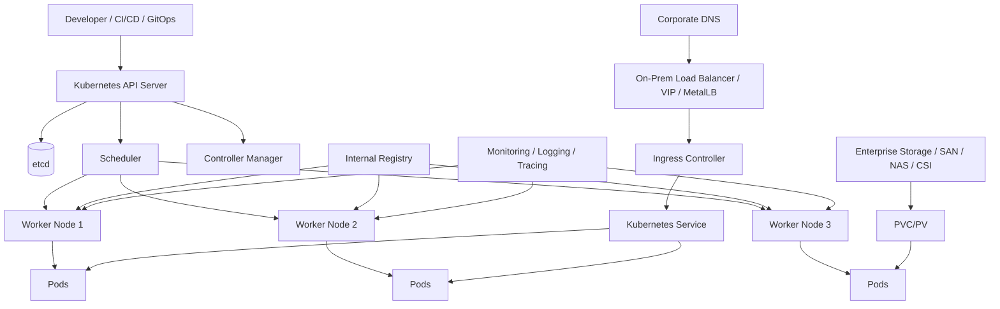

# Part 051 — On-Prem Kubernetes

On-prem Kubernetes is not just “Kubernetes, but not in the cloud.”

It changes the responsibility model.

In EKS or AKS, many dangerous operational details are hidden behind the managed control plane, cloud load balancer integration, managed identity, managed disks, managed observability integrations, cloud-native certificate integration, and cloud support model.

In on-prem Kubernetes, those responsibilities usually move closer to the platform team, infrastructure team, SRE team, network team, storage team, security team, and sometimes even the application team.

For a senior Java/JAX-RS engineer, the point is not to become a full-time Kubernetes platform operator. The point is to understand which guarantees are no longer implicit, which assumptions from managed Kubernetes may no longer hold, and which production failures become more likely when the cluster is self-managed.

> CSG/internal note: this part does not assume CSG uses on-prem Kubernetes, a specific distribution, a specific load balancer, MetalLB, VMware, OpenShift, Rancher, Tanzu, bare metal, private cloud, internal registry, air-gapped process, storage backend, DNS system, certificate authority, ingress controller, or monitoring stack. Treat every environment-specific item as something to verify with platform/SRE/DevOps/security/network/storage teams.

---

## 1. Core Mental Model

Managed Kubernetes gives you a Kubernetes API with many platform concerns delegated to a cloud provider.

On-prem Kubernetes gives you a Kubernetes API where many platform concerns must be explicitly designed, operated, patched, monitored, and recovered by your organization.

```text
Managed Kubernetes
  cloud provider owns much of the platform substrate
  application/platform team owns workload design and cluster integration

On-prem Kubernetes
  organization owns the platform substrate
  platform/network/storage/security teams own more failure modes
  application team must understand the operational boundaries
```

The same Kubernetes manifest may look portable, but the production behavior can be very different.

```yaml
apiVersion: v1
kind: Service
metadata:
  name: quote-api
spec:
  type: LoadBalancer
  selector:
    app: quote-api
  ports:
    - port: 443
      targetPort: http
```

In EKS or AKS, `type: LoadBalancer` usually maps to a cloud load balancer integration.

In on-prem, it may depend on:

- MetalLB,
- F5 integration,
- HAProxy appliance,
- NGINX edge tier,
- BGP advertisement,
- static VIP allocation,
- firewall rule creation,
- manual network team process,
- custom controller,
- or no automatic integration at all.

So the manifest is not the whole system.

The platform contract matters.

---

## 2. Managed Kubernetes vs On-Prem Responsibility

A useful way to reason about on-prem Kubernetes is by asking: who owns the failure when this component breaks?

| Area | Managed EKS/AKS tendency | On-prem tendency |
|---|---|---|
| Control plane | Cloud provider manages most of it | Internal platform team owns it |
| etcd backup/restore | Provider-managed or constrained | Internal ownership |
| API server availability | Provider-managed | Internal HA design |
| Node OS patching | Shared responsibility | Internal ownership |
| Load balancer integration | Cloud-controller integration | Internal LB/VIP/BGP/appliance integration |
| Storage provisioning | Cloud CSI integration | Internal SAN/NAS/vSphere/Ceph/Portworx/other backend |
| DNS | Cloud DNS + cluster DNS | Corporate DNS + cluster DNS integration |
| Certificates | Cloud-managed or integrated | Internal CA/cert lifecycle |
| Registry | ECR/ACR integration | Internal registry/mirror/cache |
| Identity | IAM/Managed Identity integration | LDAP/OIDC/SAML/internal IAM integration |
| Network policy | CNI-dependent | CNI-dependent plus local network team constraints |
| Monitoring | Cloud-native integrations available | Internal stack required |
| Upgrades | Cloud-supported process | Internal compatibility and rollout responsibility |

For application engineers, the danger is assuming the cloud behavior exists on-prem.

Examples:

- assuming `LoadBalancer` automatically provisions an external endpoint,
- assuming dynamic PVC provisioning exists,
- assuming registry pulls are always reachable,
- assuming DNS works the same across corporate and cluster domains,
- assuming certificate renewal is automatic,
- assuming cluster autoscaling is available,
- assuming private network routing is already configured,
- assuming support boundaries are obvious during incidents.

---

## 3. On-Prem Cluster Anatomy

A simplified on-prem Kubernetes environment often looks like this:



The Kubernetes API is only one part of the platform.

For production, you must also understand:

- how traffic enters,
- how DNS resolves,
- how certificates are issued,
- how nodes reach the registry,
- how pods reach databases and message brokers,
- how storage is provisioned,
- how logs and metrics leave the cluster,
- how cluster upgrades happen,
- how disaster recovery works.

---

## 4. Control Plane Responsibility

The Kubernetes control plane includes API server, etcd, scheduler, controller manager, and often distribution-specific components.

In managed Kubernetes, the control plane is largely provider-operated.

In on-prem Kubernetes, the organization must answer:

- Where does the API server run?
- How many control plane nodes exist?
- Is the API server highly available?
- Where is etcd stored?
- How is etcd backed up?
- How is etcd restored?
- Who rotates control plane certificates?
- Who patches control plane nodes?
- Who upgrades Kubernetes versions?
- Who monitors API server latency and etcd health?
- What happens if quorum is lost?

For backend engineers, this matters because a control plane problem can block operational actions.

During an incident, you may need to:

- scale a deployment,
- restart a rollout,
- inspect events,
- delete a stuck pod,
- read logs,
- patch a config,
- rollback a deployment.

If the API server or etcd is unhealthy, those actions may fail or become slow.

```text
Application outage
  + unhealthy Kubernetes API
  = reduced ability to recover using normal kubectl/GitOps workflow
```

Production readiness must therefore include platform recovery paths, not only application recovery paths.

---

## 5. Worker Node Responsibility

Worker nodes are where Java/JAX-RS containers actually run.

In on-prem, node responsibility includes:

- OS installation,
- kernel version,
- container runtime installation,
- kubelet configuration,
- CNI plugin installation,
- CSI plugin integration,
- node certificate rotation,
- OS patching,
- vulnerability management,
- disk cleanup,
- container image garbage collection,
- time synchronization,
- host firewall rules,
- node-level logging agents,
- node-level metrics agents,
- hardware failure replacement,
- capacity expansion.

A pod may fail because the Java application is broken.

But it may also fail because the node is broken.

Common node-level issues:

- disk pressure,
- memory pressure,
- PID pressure,
- network plugin failure,
- DNS resolver issue,
- container runtime failure,
- image filesystem full,
- kubelet certificate expired,
- node clock drift,
- host firewall blocking required traffic,
- corrupted CNI state,
- failed storage mount.

When debugging on-prem, always separate application failure from node/platform failure.

```bash
kubectl get nodes
kubectl describe node <node-name>
kubectl get pods -A --field-selector spec.nodeName=<node-name>
kubectl top node
kubectl top pod -A --sort-by=memory
```

If many unrelated workloads fail on the same node, suspect node/platform first.

---

## 6. Load Balancer Integration

On-prem Kubernetes does not automatically have the same load balancer behavior as cloud Kubernetes.

The `LoadBalancer` service type is only useful if the cluster has a controller or integration that can allocate and route an external IP.

Possible on-prem patterns:

| Pattern | Description | Risk |
|---|---|---|
| MetalLB L2 | Announces VIP using ARP/NDP | Layer 2 constraints, failover behavior |
| MetalLB BGP | Advertises routes through BGP | Requires network team routing integration |
| F5 / appliance integration | External LB routes to node/ingress | Controller or manual process complexity |
| Static VIP | Preallocated VIP points to ingress nodes | Manual drift risk |
| NodePort behind LB | External LB routes to node ports | Port management and source IP complexity |
| NGINX edge tier | Corporate NGINX routes to cluster ingress | Double proxy and timeout chain |

For Java/JAX-RS services, the most important questions are:

- Where does TLS terminate?
- Are `X-Forwarded-*` headers preserved?
- Is source IP preserved?
- What timeout does the external LB enforce?
- What timeout does ingress enforce?
- What timeout does the Java server enforce?
- How is connection draining handled?
- How does the load balancer detect unhealthy ingress nodes?
- How are VIPs allocated and protected from conflict?

A typical on-prem flow may look like this:

```text
Client
  → Corporate DNS
  → VIP / external load balancer
  → ingress node or ingress service
  → ingress controller
  → Kubernetes Service
  → EndpointSlice
  → Pod IP
  → Java/JAX-RS container port
```

Do not review only the Kubernetes Ingress.

Review the whole path.

---

## 7. MetalLB Awareness

MetalLB is often used when bare-metal or on-prem Kubernetes needs `LoadBalancer` behavior.

The mental model:

```text
Kubernetes Service type LoadBalancer
  ↓
MetalLB assigns an IP from configured pool
  ↓
MetalLB advertises that IP through L2 or BGP
  ↓
External clients reach the service through that IP
```

MetalLB solves one gap: external IP allocation and advertisement.

It does not magically solve:

- firewall approval,
- DNS records,
- TLS certificate issuance,
- ingress routing policy,
- source IP preservation,
- corporate network segmentation,
- capacity planning,
- DDoS protection,
- WAF integration,
- audit requirements.

Failure modes:

- IP pool exhausted,
- duplicate IP conflict,
- BGP session down,
- L2 advertisement not visible across VLAN,
- firewall blocks VIP,
- service has no endpoints,
- wrong externalTrafficPolicy,
- DNS points to old VIP.

Debugging pattern:

```bash
kubectl get svc -A
kubectl describe svc <service-name> -n <namespace>
kubectl get endpointslice -n <namespace>
kubectl get pods -n metallb-system
kubectl logs -n metallb-system deploy/controller
kubectl logs -n metallb-system daemonset/speaker
```

Internal verification checklist:

- Is MetalLB used?
- Is it L2 or BGP mode?
- Who owns IP pools?
- Who owns BGP peering?
- Who approves VIP exposure?
- How are DNS records created?
- How are certs bound to exposed endpoints?

---

## 8. Ingress in On-Prem Kubernetes

Ingress on-prem is often more manually integrated than cloud ingress.

An ingress controller may run inside the cluster, but the outside world still needs a route to it.

Common models:

```text
External LB → ingress controller NodePort
External LB → ingress controller LoadBalancer VIP
Corporate NGINX/F5 → ingress controller
Internal DNS → ingress VIP
```

For NGINX-based setups, review the chain carefully:

```text
Client timeout
  → corporate proxy timeout
  → external load balancer timeout
  → NGINX ingress timeout
  → service routing
  → Java server timeout
  → downstream DB/Kafka/RabbitMQ/Redis timeout
```

Mismatch causes production symptoms such as:

- 499 client closed request,
- 502 bad gateway,
- 503 no healthy upstream,
- 504 gateway timeout,
- duplicate request due to retry,
- long-running request cut off,
- upload/download failure,
- graceful shutdown not respected.

Ingress review for Java/JAX-RS:

- host routing correct,
- path routing correct,
- rewrite behavior correct,
- backend protocol correct,
- TLS termination point known,
- forwarded headers trusted and parsed,
- request body size configured,
- idle timeout aligned,
- readiness gates prevent traffic to cold pods,
- connection draining aligned with pod termination.

---

## 9. Storage Integration

On-prem storage is one of the largest differences from managed Kubernetes.

Cloud Kubernetes often uses cloud disks and cloud file shares through CSI drivers.

On-prem Kubernetes may use:

- SAN-backed volumes,
- NAS/NFS,
- vSphere CSI,
- Ceph/Rook,
- Portworx,
- Longhorn,
- OpenEBS,
- local persistent volumes,
- custom enterprise storage integrations.

The Kubernetes abstraction is still:

```text
StorageClass → PVC → PV → mounted volume in pod
```

But the real guarantees depend on the backend.

Questions that matter:

- Is dynamic provisioning supported?
- Is ReadWriteOnce enough?
- Is ReadWriteMany required?
- Is the volume zone/rack/node constrained?
- What is the IOPS/throughput guarantee?
- What happens when a node dies?
- Can the volume be reattached quickly?
- Are snapshots supported?
- Are backups application-consistent?
- Who restores data?
- What is the RPO/RTO?

For stateful systems like PostgreSQL, RabbitMQ, Redis, Kafka, and Camunda dependencies, storage is not just “a volume.”

It is part of the data safety model.

A PVC that mounts successfully does not prove:

- data is replicated,
- fsync behavior is acceptable,
- latency is stable,
- backup is valid,
- restore is tested,
- split-brain is impossible,
- disaster recovery is acceptable.

---

## 10. DNS Integration

On-prem Kubernetes usually has at least two DNS layers:

```text
Cluster DNS: CoreDNS resolves service names inside Kubernetes
Corporate DNS: enterprise DNS resolves application names and infrastructure names
```

Traffic may require both.

Example:

```text
Internal user
  → quote-api.internal.company.com       # corporate DNS
  → ingress VIP
  → Kubernetes service
  → quote-api.default.svc.cluster.local  # cluster DNS if internal service call
```

Failure modes:

- corporate DNS record points to wrong VIP,
- split-horizon DNS returns different answers depending on source network,
- CoreDNS unhealthy,
- upstream DNS unreachable from cluster,
- recursive resolver blocked by firewall,
- stale DNS cache,
- low TTL causing high query load,
- high TTL slowing failover,
- wrong search domain/ndots behavior,
- DNS policy mismatch for pods using host networking.

Debugging:

```bash
kubectl run dns-debug --rm -it --image=busybox:1.36 -- nslookup kubernetes.default.svc.cluster.local
kubectl run dns-debug --rm -it --image=busybox:1.36 -- nslookup quote-api.internal.company.com
kubectl get pods -n kube-system -l k8s-app=kube-dns
kubectl logs -n kube-system -l k8s-app=kube-dns
```

For Java services, DNS behavior interacts with:

- HTTP client connection pool,
- DNS cache TTL inside JVM,
- service discovery strategy,
- failover time,
- private endpoint resolution,
- database host resolution,
- Kafka bootstrap server resolution.

---

## 11. Certificate Management

In cloud environments, certificate management may be integrated with ACM, Azure Key Vault, Application Gateway, or managed ingress tooling.

On-prem, certificate lifecycle is often more manual or enterprise-CA-based.

You must know:

- who issues certificates,
- which CA is trusted,
- where TLS terminates,
- how certificates are renewed,
- how expiry is monitored,
- how certs are delivered to ingress,
- whether cert-manager is used,
- whether internal CA bundles are mounted into pods,
- whether Java truststores are customized,
- how mTLS is handled if used.

Certificate failures often appear as application failures.

Symptoms:

- TLS handshake failure,
- `PKIX path building failed` in Java,
- ingress returns certificate mismatch,
- clients reject internal CA,
- expired certificate outage,
- downstream service call fails after cert rotation,
- Kafka/RabbitMQ TLS connection failure,
- PostgreSQL TLS verification failure.

Senior review question:

```text
Can this service continue operating safely across certificate rotation?
```

If the answer depends on manual restart, undocumented truststore updates, or tribal knowledge, the deployment is fragile.

---

## 12. Internal Registry and Image Pulling

On-prem clusters often rely on internal registries or registry mirrors.

Reasons:

- security control,
- air-gapped deployment,
- bandwidth reduction,
- vulnerability scanning,
- image promotion governance,
- dependency on approved base images,
- preventing direct pulls from public Docker Hub.

Image pull path:

```text
Kubelet on worker node
  → internal registry DNS
  → registry auth
  → image manifest
  → image layers
  → container runtime cache
  → pod start
```

Failure modes:

- registry DNS failure,
- expired registry certificate,
- node cannot reach registry,
- imagePullSecret missing,
- wrong registry credential,
- image tag not promoted,
- digest not found,
- registry storage full,
- registry rate limit if proxying public images,
- vulnerability gate blocks image,
- air-gapped sync incomplete.

Debugging:

```bash
kubectl describe pod <pod-name> -n <namespace>
kubectl get events -n <namespace> --sort-by=.lastTimestamp
kubectl get secret <pull-secret> -n <namespace>
```

From node-level access, platform teams may inspect container runtime pulls directly, but application engineers should usually avoid node-level mutation unless approved.

---

## 13. Air-Gapped Deployment

Air-gapped or restricted-network Kubernetes changes deployment assumptions.

You cannot assume the cluster can reach:

- Docker Hub,
- Maven Central,
- GitHub Container Registry,
- public Helm repositories,
- public OS package repositories,
- public vulnerability DB feeds,
- public license DB feeds,
- public cloud APIs,
- external telemetry endpoints.

Everything must be mirrored, vendored, pre-approved, or proxied.

Air-gapped deployment requires governance for:

- base images,
- application images,
- Helm charts,
- CRDs,
- operators,
- scanner databases,
- package repositories,
- certificates,
- license data,
- SBOMs,
- signatures,
- promotion artifacts.

For Java/JAX-RS services:

- Maven dependencies must be available in internal artifact repositories,
- container base images must be mirrored,
- runtime images must not download dependencies at startup,
- telemetry exporters must target internal collectors,
- cloud SDK calls may not be allowed or may need private endpoints/proxies,
- timezone/CA packages must exist in the image if needed.

Anti-pattern:

```text
Image starts successfully only when it can download runtime dependency from internet.
```

That is not production-grade for restricted enterprise environments.

---

## 14. Patch Management

On-prem Kubernetes requires active patch management across multiple layers:

```text
Hardware / hypervisor
  → host OS
  → kernel
  → container runtime
  → kubelet
  → Kubernetes control plane
  → CNI
  → CSI
  → ingress controller
  → observability agents
  → admission controllers
  → workload base images
```

Each layer can introduce compatibility issues.

Examples:

- CNI upgrade changes network behavior,
- CSI upgrade affects mount behavior,
- ingress controller upgrade changes annotation semantics,
- Kubernetes API version removed,
- container runtime upgrade changes image handling,
- node kernel patch affects network/storage driver,
- CA bundle update breaks outbound TLS unexpectedly.

Application teams should ask:

- Is there a platform patch calendar?
- Are maintenance windows communicated?
- Are workloads tested against new cluster versions?
- Are deprecated APIs detected before upgrade?
- Are PDBs respected?
- Are canary nodes used?
- Is rollback possible?
- What is the blast radius of node pool patching?

---

## 15. Upgrade Strategy

On-prem upgrade strategy must cover more than Kubernetes version.

Upgrade domains:

- Kubernetes control plane,
- etcd,
- worker nodes,
- OS/kernel,
- container runtime,
- CNI plugin,
- CSI driver,
- ingress controller,
- cert-manager,
- External Secrets/Sealed Secrets,
- GitOps controller,
- observability agents,
- policy controllers,
- CRDs/operators.

Upgrade risk for Java/JAX-RS workloads:

- pods restarted unexpectedly,
- PDB blocks or fails to block disruption,
- old API versions rejected,
- webhook failure blocks deployment,
- ingress behavior changes,
- network policy semantics change,
- DNS behavior changes,
- storage mount delays increase startup time,
- metrics pipeline changes break HPA,
- certificate rotation breaks Java truststore.

A mature upgrade plan includes:

- compatibility scan,
- staging cluster test,
- canary workload,
- workload owner notification,
- disruption budget review,
- rollback limitations,
- monitoring during upgrade,
- post-upgrade validation,
- incident owner assignment.

---

## 16. Monitoring and Observability

On-prem Kubernetes must provide its own observability path.

You need visibility into:

- control plane health,
- etcd health,
- API server latency,
- node health,
- kubelet health,
- container runtime health,
- CNI health,
- CSI health,
- ingress controller metrics,
- CoreDNS metrics,
- pod restart count,
- OOMKilled events,
- CPU throttling,
- disk pressure,
- image pull failures,
- certificate expiry,
- load balancer health,
- storage latency,
- registry availability.

Application observability is not enough.

A Java service can be healthy while the platform is approaching failure.

Examples:

- registry unavailable but current pods still run,
- certificate expires tomorrow,
- node image filesystem nearly full,
- CoreDNS has high error rate,
- CSI mount latency rising,
- ingress controller memory leak,
- API server p99 latency degraded.

Production dashboards should separate:

```text
Application health
Platform health
Network health
Storage health
Deployment health
Security/compliance signals
```

---

## 17. Security and Governance in On-Prem Kubernetes

On-prem does not reduce Kubernetes security risk.

It often increases governance complexity because integrations are custom.

Review areas:

- cluster authentication,
- RBAC mapping to enterprise identity,
- namespace isolation,
- network segmentation,
- ingress exposure approval,
- image provenance,
- registry access control,
- admission policies,
- secret encryption,
- secret manager integration,
- audit logging,
- node hardening,
- OS patching,
- privileged workload exception process,
- break-glass access,
- production debugging access.

Risky patterns:

- broad cluster-admin access,
- shared namespaces for unrelated services,
- no default deny NetworkPolicy,
- privileged containers allowed by default,
- HostPath accepted casually,
- manual secret copy into namespace,
- image pulls from unapproved public registries,
- no audit trail for production changes,
- kubectl hotfixes outside GitOps.

For regulated or mission-critical systems, the question is not only “is it secure?”

The better question:

```text
Can we prove what was deployed, who changed it, what it could access, and how it behaved during an incident?
```

---

## 18. Java/JAX-RS Impact

On-prem Kubernetes affects Java/JAX-RS services in practical ways.

### Startup behavior

Startup may be slower due to:

- image pull latency from internal registry,
- storage mount latency,
- DNS dependency,
- certificate/truststore initialization,
- internal dependency checks,
- limited node capacity.

Startup probes should account for real environment behavior.

### Runtime connectivity

Java services may call:

- PostgreSQL,
- Kafka,
- RabbitMQ,
- Redis,
- Camunda engine/workers,
- internal REST APIs,
- cloud APIs through private connectivity,
- on-prem enterprise systems.

Each dependency may require:

- corporate DNS,
- firewall rules,
- proxy settings,
- TLS truststore,
- service account/credential,
- NetworkPolicy egress,
- route availability.

### Shutdown behavior

Node draining or maintenance is common in on-prem operations.

Java services must handle:

- SIGTERM,
- readiness removal,
- request draining,
- consumer pause/stop,
- transaction completion,
- connection pool close,
- graceful timeout.

If the application ignores SIGTERM, every node maintenance becomes a potential data consistency issue.

---

## 19. Impact on PostgreSQL, Kafka, RabbitMQ, Redis, Camunda, and NGINX

On-prem Kubernetes often runs close to existing enterprise infrastructure.

That can be good for latency and data locality, but it increases integration complexity.

### PostgreSQL

Check:

- is PostgreSQL inside cluster or external?
- DNS name and failover endpoint,
- TLS mode,
- connection pool sizing,
- firewall rule,
- backup/restore ownership,
- maintenance window behavior.

Failure example:

```text
Node drain restarts many Java pods
  → all pods reconnect to PostgreSQL simultaneously
  → connection storm
  → database max_connections exhausted
```

### Kafka

Check:

- broker DNS advertised listeners,
- TLS/SASL config,
- firewall between pod network and brokers,
- consumer group rebalance behavior,
- partition count vs replica count,
- offset commit behavior during shutdown.

### RabbitMQ

Check:

- connection heartbeat,
- channel recovery,
- queue durability,
- consumer prefetch,
- graceful consumer cancellation,
- TLS/cert trust.

### Redis

Check:

- connection timeout,
- failover behavior,
- DNS caching,
- TLS if enabled,
- max clients,
- cache stampede on rollout.

### Camunda-like workflow dependencies

Check:

- worker polling behavior,
- lock duration,
- retry semantics,
- idempotency,
- graceful worker shutdown,
- database dependency.

### NGINX / ingress

Check:

- timeout chain,
- request body size,
- header forwarding,
- TLS termination,
- upstream health checks,
- reload behavior,
- connection draining.

---

## 20. Common Failure Modes

### Control plane unavailable

Symptoms:

- kubectl slow or failing,
- GitOps sync fails,
- deployment changes blocked,
- events unavailable,
- controllers lagging.

Likely causes:

- API server issue,
- etcd issue,
- certificate issue,
- network partition,
- resource exhaustion.

### Node pressure

Symptoms:

- pod eviction,
- slow pod start,
- image GC,
- disk pressure warnings,
- OOMKilled.

Likely causes:

- insufficient capacity,
- log volume,
- image accumulation,
- memory leak,
- noisy neighbor.

### Registry unreachable

Symptoms:

- ImagePullBackOff,
- ErrImagePull,
- rollout stuck,
- new pods fail but old pods run.

Likely causes:

- registry down,
- DNS failure,
- certificate expiry,
- auth issue,
- network/firewall block.

### Load balancer/VIP failure

Symptoms:

- service unreachable from outside,
- internal pod-to-pod works,
- ingress healthy but external clients fail.

Likely causes:

- VIP not advertised,
- BGP failure,
- firewall block,
- DNS wrong,
- LB health check failing.

### Storage mount failure

Symptoms:

- pod stuck ContainerCreating,
- PVC pending,
- mount timeout,
- application starts without expected data.

Likely causes:

- CSI failure,
- storage backend unavailable,
- permission issue,
- node attachment conflict,
- access mode mismatch.

### Certificate expiry

Symptoms:

- TLS failures,
- Java PKIX errors,
- ingress certificate warnings,
- downstream connection failures.

Likely causes:

- no expiry alert,
- manual renewal missed,
- cert-manager failure,
- wrong CA bundle.

---

## 21. Detection Signals

For on-prem Kubernetes, watch signals across multiple layers.

### Cluster signals

- API server latency,
- etcd health,
- controller reconcile delay,
- node ready status,
- kubelet errors,
- CNI errors,
- CSI errors,
- CoreDNS error rate.

### Workload signals

- restart count,
- readiness failures,
- liveness failures,
- OOMKilled,
- CPU throttling,
- pending pods,
- rollout stuck,
- consumer lag,
- request latency.

### Infrastructure signals

- load balancer health,
- VIP availability,
- firewall drops,
- DNS query failures,
- registry availability,
- storage latency,
- certificate expiry,
- node disk usage.

### Application signals

- Java exception rate,
- HTTP 5xx,
- DB connection pool exhaustion,
- Kafka rebalance frequency,
- RabbitMQ reconnects,
- Redis timeout,
- Camunda worker failures,
- downstream call timeout.

---

## 22. Debugging Workflow

Use a layered approach.

```text
1. Is the symptom external only or internal too?
2. Is the Kubernetes service healthy?
3. Are endpoints present?
4. Are pods ready?
5. Are pods scheduled on healthy nodes?
6. Are DNS and certificates valid?
7. Is the ingress/load balancer path healthy?
8. Are downstream dependencies reachable?
9. Is this application-specific or platform-wide?
```

Useful commands:

```bash
kubectl get nodes -o wide
kubectl get pods -A -o wide
kubectl get events -A --sort-by=.lastTimestamp
kubectl describe pod <pod> -n <namespace>
kubectl logs <pod> -n <namespace> --previous
kubectl get svc,ingress,endpointslice -n <namespace>
kubectl describe pvc <pvc> -n <namespace>
kubectl auth can-i <verb> <resource> -n <namespace>
```

Production-safe principle:

```text
Observe before mutate.
```

Avoid during incidents unless approved:

- deleting random pods,
- manually editing production resources,
- bypassing GitOps without audit,
- restarting ingress/controller components blindly,
- changing NetworkPolicy without understanding blast radius,
- scaling stateful workloads without checking quorum/replication,
- node-level commands without platform approval.

---

## 23. Trade-Offs

On-prem Kubernetes can be valuable when an organization needs:

- data locality,
- regulatory isolation,
- existing data center integration,
- private network control,
- hardware control,
- offline/air-gapped deployment,
- predictable infrastructure ownership,
- latency to legacy systems.

But it increases responsibility for:

- operational complexity,
- patching,
- upgrades,
- DR,
- storage reliability,
- load balancer integration,
- registry availability,
- certificate lifecycle,
- observability stack,
- security governance,
- platform expertise.

The wrong conclusion is:

```text
On-prem is worse than cloud.
```

The better conclusion is:

```text
On-prem requires explicit platform engineering maturity.
```

---

## 24. Correctness Concerns

Correctness in on-prem Kubernetes includes more than application logic.

Ask:

- Can deployments complete when registry is under load?
- Can pods restart on another node and retain required storage?
- Can Java services handle DNS failover correctly?
- Can consumers shut down without duplicate unsafe processing?
- Can ingress drain connections before pod termination?
- Can certificates rotate without downtime?
- Can config changes be audited and rolled back?
- Can stateful dependencies recover after node failure?
- Can platform upgrades happen without violating application SLOs?

A deployment is not correct just because it applied successfully.

A deployment is correct when it behaves safely across failure, maintenance, and recovery scenarios.

---

## 25. Security and Privacy Concerns

On-prem clusters often live close to sensitive enterprise systems.

Security concerns:

- excessive RBAC,
- weak namespace isolation,
- missing NetworkPolicy,
- broad egress to internal network,
- direct access to databases,
- secrets copied manually,
- internal registry bypass,
- unscanned images,
- privileged workloads,
- hostPath access,
- insufficient audit logs.

Privacy concerns:

- PII in logs,
- sensitive payload in traces,
- debug dumps written to shared storage,
- environment variables exposed in support bundles,
- packet capture without approval,
- production data used in lower environments.

On-prem does not automatically mean safe.

It can be more dangerous because internal networks are often trusted too broadly.

---

## 26. Performance Concerns

Performance bottlenecks may come from platform substrate:

- storage latency,
- CNI overhead,
- DNS latency,
- ingress proxy chain,
- load balancer health check behavior,
- node CPU contention,
- NUMA/hardware differences,
- noisy neighbors,
- slow image pulls,
- log agent overhead,
- security agent overhead.

For Java/JAX-RS services, validate:

- JVM CPU throttling,
- GC pause time,
- connection pool saturation,
- thread pool sizing,
- direct memory usage,
- TLS handshake overhead,
- DNS cache behavior,
- downstream latency distribution.

Do not tune the JVM before checking the platform path.

---

## 27. Cost Concerns

On-prem cost is less visible than cloud billing, but not free.

Cost drivers:

- hardware capacity,
- idle nodes,
- storage allocation,
- backup storage,
- network appliances,
- load balancer licenses,
- monitoring/logging retention,
- platform staffing,
- patching effort,
- incident recovery effort,
- DR environment,
- compliance evidence generation.

Application teams influence cost through:

- resource requests,
- replica count,
- log volume,
- storage requests,
- inefficient polling,
- unnecessary sidecars,
- excessive environments,
- poor rollout causing capacity spikes.

Cost awareness still applies even without cloud invoices.

---

## 28. Observability Concerns

On-prem observability must include platform dependencies that cloud providers often expose for you.

Minimum useful dashboard groups:

- cluster health,
- node health,
- ingress/load balancer health,
- DNS health,
- registry health,
- storage health,
- certificate expiry,
- workload health,
- application SLO,
- dependency health.

For Java/JAX-RS services, correlate:

```text
HTTP latency spike
  with pod restart count
  with node CPU pressure
  with ingress 5xx
  with DNS error rate
  with downstream DB/Kafka/RabbitMQ/Redis latency
```

Without cross-layer correlation, teams blame each other during incidents.

---

## 29. PR Review Checklist

When reviewing an application or platform PR for on-prem Kubernetes, ask:

- Does the manifest assume cloud load balancer behavior?
- Does the service type work in on-prem cluster?
- Are ingress host/path/TLS settings aligned with enterprise edge routing?
- Are image references available in internal registry?
- Are tags immutable or digest-pinned where required?
- Are resource requests realistic for available node capacity?
- Are probes tuned for on-prem startup and dependency behavior?
- Are PVCs using approved StorageClass?
- Is the workload safe during node drain?
- Are NetworkPolicies compatible with required internal dependencies?
- Are certificates and CA bundles handled safely?
- Are logs/metrics/traces routed to internal observability stack?
- Does the deployment work in restricted/air-gapped mode if required?
- Is rollback possible without manual platform intervention?
- Are runbooks updated?

---

## 30. Internal Verification Checklist

Verify with CSG/team/platform/SRE/security/network/storage owners:

- Is Kubernetes deployed on-prem, cloud, or hybrid?
- Which Kubernetes distribution is used?
- Who owns the control plane?
- Who owns etcd backup and restore?
- Who owns node OS patching?
- Which container runtime is used?
- Which CNI is used?
- Is NetworkPolicy enforced?
- How does `Service type: LoadBalancer` work?
- Is MetalLB used?
- Is BGP used?
- Which ingress controller is used?
- Where does TLS terminate?
- How are certificates issued and renewed?
- Which DNS zones are used?
- How does CoreDNS forward to enterprise DNS?
- Which registry stores production images?
- Are public image pulls blocked?
- Is the environment air-gapped or restricted?
- Which CSI/storage backend is used?
- What are backup/restore guarantees?
- What monitoring/logging/tracing stack is used?
- What is the production debugging policy?
- What is the upgrade process?
- What is the emergency rollback process?
- Which runbooks exist?
- Which incident notes reveal recurring platform issues?

---

## 31. Summary

On-prem Kubernetes requires a different discipline than managed Kubernetes.

The Kubernetes API may look the same, but the hidden platform contract is different.

For senior backend engineers, the key skill is knowing when a production issue is not only an application issue:

- load balancer integration,
- DNS,
- certificate lifecycle,
- storage backend,
- registry availability,
- node health,
- CNI behavior,
- CSI behavior,
- platform upgrade,
- firewall and network segmentation.

The production mindset is simple:

```text
Do not treat Kubernetes portability as operational equivalence.
```

A Java/JAX-RS service running in on-prem Kubernetes must be reviewed not only as application code, but as a participant in an enterprise platform with explicit networking, storage, identity, security, observability, and operational contracts.
