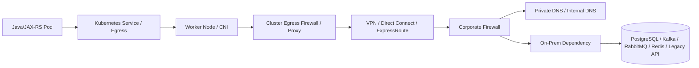

# Part 052 — Hybrid Kubernetes and Enterprise Networking

Hybrid Kubernetes is where application architecture, platform engineering, cloud networking, corporate networking, security, and operations collide.

A Java/JAX-RS service may run in Kubernetes, but its real request path may cross:

- client networks,
- corporate DNS,
- cloud DNS,
- private DNS zones,
- ingress controllers,
- firewalls,
- proxies,
- VPN tunnels,
- AWS Direct Connect,
- Azure ExpressRoute,
- NAT gateways,
- private endpoints,
- service meshes,
- legacy systems,
- databases,
- Kafka/RabbitMQ clusters,
- Redis instances,
- Camunda workers,
- and external APIs.

The failure is rarely “Kubernetes is down.”

The real failure is usually hidden in a boundary.

> CSG/internal note: this part does not assume CSG uses a specific hybrid topology, AWS Direct Connect, Azure ExpressRoute, VPN, firewall vendor, proxy, DNS design, service mesh, private endpoint pattern, cloud account, VPC/VNet CIDR, on-prem network segment, ingress topology, or identity model. Every environment-specific network path must be verified internally with platform/SRE/DevOps/network/security/backend teams and actual diagrams/runbooks.

---

## 1. Core Mental Model

Hybrid systems fail at boundaries.

```text
Kubernetes boundary
Cloud boundary
On-prem boundary
DNS boundary
Firewall boundary
TLS trust boundary
Identity boundary
Routing boundary
Operational ownership boundary
```

A service call is not just:

```text
Java service → dependency
```

It is often:

```text
Java pod
  → pod network
  → node network
  → CNI routing
  → cluster egress
  → firewall / proxy / NAT
  → cloud or corporate network
  → private endpoint / load balancer
  → dependency network segment
  → dependency listener
  → TLS / auth / app protocol
```

When debugging hybrid systems, think in paths, not components.

---

## 2. Common Hybrid Topologies

Hybrid Kubernetes can mean several different things.

### 2.1 Cloud Kubernetes calling on-prem systems

Example:

```text
EKS/AKS Java service → on-prem PostgreSQL / Kafka / legacy API
```

Typical concerns:

- private connectivity,
- routing from cloud to on-prem,
- firewall allowlist,
- DNS resolution,
- TLS trust,
- latency,
- retry behavior,
- on-prem maintenance windows.

### 2.2 On-prem Kubernetes calling cloud services

Example:

```text
On-prem Java service → AWS Secrets Manager / Azure Key Vault / cloud storage / cloud API
```

Typical concerns:

- outbound proxy,
- NAT/firewall,
- private endpoint if available,
- cloud identity federation,
- SDK credential resolution,
- DNS and CA trust,
- egress audit.

### 2.3 Cloud and on-prem Kubernetes both run workloads

Example:

```text
Quote API in AKS
Order worker in on-prem Kubernetes
Kafka in data center
Redis in cloud
```

Typical concerns:

- cross-cluster service discovery,
- API version compatibility,
- async messaging boundaries,
- failure isolation,
- observability correlation,
- deployment coordination.

### 2.4 Multi-cloud plus on-prem

Example:

```text
EKS service ↔ AKS service ↔ on-prem dependency
```

Typical concerns:

- duplicated identity models,
- private DNS conflicts,
- overlapping CIDRs,
- inconsistent network policies,
- different load balancer semantics,
- cloud-specific observability gaps.

---

## 3. Hybrid Traffic Flow

A simplified hybrid request path:



Every arrow can fail.

Questions:

- Is traffic routed correctly?
- Is the destination resolvable from inside the pod?
- Is the firewall allowing the pod/node/source CIDR?
- Is there NAT hiding the real source IP?
- Does the dependency allow that source?
- Is TLS certificate trusted by the JVM?
- Is the protocol using the expected port?
- Is the timeout budget realistic for cross-network latency?
- Are retries safe?
- Is observability present at both ends?

---

## 4. VPN, Direct Connect, and ExpressRoute

Hybrid connectivity usually uses one or more of:

- site-to-site VPN,
- AWS Direct Connect,
- Azure ExpressRoute,
- SD-WAN,
- private interconnect,
- transit gateway / virtual WAN,
- firewall appliance,
- proxy gateway.

The application does not usually configure these directly, but application behavior depends on them.

| Connectivity type | Typical strength | Typical risk |
|---|---|---|
| Site-to-site VPN | Easier setup, encrypted tunnel | Bandwidth, latency, tunnel instability |
| Direct Connect | Dedicated AWS connectivity | Routing complexity, cost, redundancy design |
| ExpressRoute | Dedicated Azure connectivity | Routing complexity, private peering design |
| SD-WAN | Enterprise routing flexibility | Policy complexity and troubleshooting difficulty |
| Proxy-based egress | Centralized control/audit | App compatibility, TLS inspection, timeout limits |

Application engineers should know:

- whether traffic is private or internet-routed,
- whether traffic is encrypted at network layer, application layer, or both,
- whether there are redundant links,
- who owns routing changes,
- who owns firewall approvals,
- how outages are detected,
- how failover affects source IP and latency.

---

## 5. CIDR and Routing Design

Hybrid Kubernetes requires non-overlapping address spaces.

Overlapping CIDRs cause painful failures.

Examples:

```text
Cloud VPC CIDR overlaps on-prem subnet
Pod CIDR overlaps corporate network
Service CIDR overlaps VPN route
Private endpoint DNS resolves to IP unreachable from cluster
```

Symptoms:

- traffic goes to wrong destination,
- only some pods cannot connect,
- asymmetric routing,
- firewall logs show unexpected source,
- connection timeout instead of connection refused,
- DNS answer is correct but route is wrong.

For Kubernetes, distinguish:

- node CIDR,
- pod CIDR,
- service CIDR,
- VPC/VNet CIDR,
- on-prem CIDR,
- private endpoint subnet,
- load balancer subnet,
- NAT source range.

Senior review question:

```text
What source IP does the dependency actually see?
```

This determines firewall rules, audit logs, rate limits, and allowlists.

---

## 6. Private DNS and Split-Horizon DNS

Hybrid systems often use split-horizon DNS.

The same hostname can resolve differently depending on where the query originates.

Example:

```text
orders.internal.company.com
  from corporate laptop → on-prem VIP
  from cloud VPC        → private endpoint IP
  from public internet  → no answer or public edge
```

This is powerful and dangerous.

Failure modes:

- pod resolves public IP instead of private IP,
- pod resolves private IP but route missing,
- CoreDNS forwards to wrong upstream,
- private DNS zone not linked to VPC/VNet,
- DNS conditional forwarder missing,
- stale DNS cache after failover,
- Java DNS cache keeps old IP,
- Kubernetes search domain causes unexpected query expansion,
- `ndots` causes excessive DNS lookups.

Debug from inside the cluster, not from your laptop.

```bash
kubectl run dns-debug --rm -it --image=busybox:1.36 -- nslookup orders.internal.company.com
kubectl run dns-debug --rm -it --image=busybox:1.36 -- nslookup kubernetes.default.svc.cluster.local
```

For Java services, also consider JVM DNS caching.

A DNS failover may be correct at the network level but invisible to long-running JVMs if DNS results are cached too long.

---

## 7. Firewall and Egress Control

Enterprise networks usually control traffic with firewalls, proxy rules, security groups, NSGs, NACLs, route tables, and sometimes service mesh policy.

A pod-to-dependency call may require several approvals:

```text
NetworkPolicy egress
  + node/subnet route
  + cloud SG/NSG
  + firewall allowlist
  + proxy allowlist
  + dependency-side allowlist
  + TLS trust
  + application credential
```

A single missing rule can look like an application timeout.

Common symptoms:

- connect timeout,
- TLS timeout,
- intermittent reset,
- connection refused,
- only one environment fails,
- only one node pool fails,
- only one namespace fails,
- only pod traffic fails while laptop test succeeds.

Debugging principle:

```text
A successful curl from your laptop proves almost nothing about pod-to-service reachability.
```

Test from:

- same namespace,
- same service account if relevant,
- same node pool if placement matters,
- same NetworkPolicy context,
- same proxy environment variables,
- same TLS trust bundle.

---

## 8. Proxy Requirements

On-prem and enterprise cloud environments often require outbound traffic through a proxy.

For Java services, proxy behavior can be tricky.

Relevant settings:

- `HTTP_PROXY`,
- `HTTPS_PROXY`,
- `NO_PROXY`,
- JVM `http.proxyHost`,
- JVM `http.proxyPort`,
- JVM `https.proxyHost`,
- JVM `https.proxyPort`,
- JVM `http.nonProxyHosts`,
- SDK-specific proxy configuration,
- truststore for TLS inspection.

Common proxy failure modes:

- `NO_PROXY` missing Kubernetes service domains,
- internal service calls accidentally sent to proxy,
- cloud metadata/identity endpoint proxied incorrectly,
- proxy blocks cloud API endpoint,
- TLS inspection CA not trusted by JVM,
- proxy timeout shorter than application timeout,
- proxy does not support required protocol,
- Kafka/RabbitMQ/PostgreSQL traffic incorrectly assumed to work through HTTP proxy.

`NO_PROXY` must be reviewed carefully.

Typical entries may include, depending on environment:

```text
localhost,127.0.0.1,.svc,.svc.cluster.local,<cluster-cidr>,<service-cidr>,<internal-domain>,<metadata-endpoint>
```

Do not copy this blindly.

Verify the actual internal domains, CIDRs, and identity endpoints.

---

## 9. Ingress from Corporate Network

Hybrid ingress may be internal-only.

Example:

```text
Corporate user / internal system
  → corporate DNS
  → internal load balancer / firewall / WAF
  → cloud private link or on-prem VIP
  → ingress controller
  → Kubernetes service
  → Java/JAX-RS pod
```

Important questions:

- Is the service internet-facing or internal-only?
- Does the path cross WAF or API gateway?
- Where is TLS terminated?
- Are client certificates required?
- Are headers sanitized?
- Is source IP preserved?
- Does the Java application trust forwarded headers safely?
- Are internal clients allowed by firewall?
- Is DNS split by environment?
- Are timeouts consistent across proxies?

For REST APIs, header correctness matters.

Check:

- `X-Forwarded-For`,
- `X-Forwarded-Proto`,
- `X-Forwarded-Host`,
- `Forwarded`,
- correlation ID headers,
- auth headers,
- request size headers,
- proxy protocol if used.

Incorrect forwarded headers can break:

- redirect URLs,
- generated links,
- audit source IP,
- rate limiting,
- security checks,
- absolute URL generation.

---

## 10. Cloud-to-On-Prem API Calls

Cloud-hosted pods calling on-prem APIs are common in enterprise systems.

Example:

```text
AKS quote-api pod → on-prem customer management API
EKS order-worker pod → on-prem billing API
```

Checklist:

- DNS resolves to private on-prem address,
- route exists from VPC/VNet to on-prem,
- firewall allows source CIDR,
- dependency allows source identity/IP,
- TLS cert chain is trusted by container/JVM,
- timeout budget accounts for network latency,
- retries are bounded and safe,
- circuit breaker prevents thread exhaustion,
- observability includes dependency latency and error rate,
- on-prem maintenance windows are known.

Failure pattern:

```text
On-prem dependency slows down
  → Java HTTP client threads block
  → JAX-RS server thread pool saturates
  → readiness still passes
  → Kubernetes keeps routing traffic
  → upstream sees 504/503
```

Defensive design:

- set connect timeout,
- set read timeout,
- use bounded connection pool,
- use circuit breaker/bulkhead where appropriate,
- expose dependency health as metric,
- do not put hard dependency checks in liveness,
- degrade gracefully if business-safe.

---

## 11. On-Prem-to-Cloud API Calls

On-prem pods calling cloud services require identity, network path, and DNS design.

Examples:

```text
On-prem worker → AWS S3-compatible endpoint / AWS Secrets Manager
On-prem service → Azure Key Vault / Azure Storage / Azure App Configuration
```

Questions:

- Is traffic allowed to public cloud endpoint?
- Is private connectivity available?
- Is there an outbound proxy?
- How does the pod obtain cloud credentials?
- Are long-lived secrets used?
- Is workload identity federation available?
- Is the cloud API endpoint resolvable?
- Is TLS trust valid?
- Are cloud API rate limits monitored?
- Is egress audited?

Anti-pattern:

```text
Hardcode cloud access keys in Kubernetes Secret because workload identity is difficult.
```

That may work technically, but it creates rotation, leakage, audit, and blast-radius problems.

---

## 12. Latency and Timeout Budget

Hybrid latency is rarely constant.

It can vary due to:

- distance,
- VPN encryption overhead,
- firewall inspection,
- proxy hops,
- congestion,
- packet loss,
- DNS lookup latency,
- TLS handshake overhead,
- cross-region routing,
- dependency load.

A production service needs an explicit timeout budget.

Example:

```text
Client timeout:             30s
Ingress timeout:            25s
Java request timeout:       20s
Downstream API timeout:      2s connect + 5s read
DB timeout:                  3s
Retry budget:                max 1 retry for safe operations
Circuit breaker open:        after sustained failures
```

Timeout anti-pattern:

```text
Every layer has a 60s timeout.
```

That causes thread exhaustion and late failure.

Another anti-pattern:

```text
Client timeout is shorter than ingress/backend timeout, but application keeps processing after client gave up.
```

This causes wasted work and possible duplicate operations.

---

## 13. MTU and Fragmentation

MTU problems are hard to diagnose because they often look like intermittent application timeouts.

Hybrid networks may include:

- overlay networks,
- VPN encapsulation,
- cloud networking,
- firewall appliances,
- service mesh sidecars,
- IPsec tunnels.

Each can reduce effective MTU.

Symptoms:

- small requests work, large requests hang,
- TLS handshake occasionally fails,
- gRPC/HTTP2 stream issues,
- Kafka fetch/produce issues with larger payloads,
- PostgreSQL large query result stalls,
- file upload/download failure,
- packet loss visible in network tools.

Application teams may not fix MTU directly, but they should recognize the pattern.

Debug with platform/network teams using approved tools.

Do not run aggressive packet tests in production without approval.

---

## 14. TLS Trust Across Boundaries

Hybrid systems often involve multiple certificate authorities:

- public CA,
- corporate internal CA,
- cloud-managed CA,
- service mesh CA,
- database CA,
- Kafka/RabbitMQ CA,
- appliance-generated certificates,
- TLS inspection CA.

Java applications use truststores.

A container image may not trust internal enterprise CAs by default.

Symptoms:

```text
javax.net.ssl.SSLHandshakeException
PKIX path building failed
unable to find valid certification path to requested target
certificate_unknown
hostname verification failed
```

Checklist:

- Which CA signs the dependency certificate?
- Is that CA installed in the container OS trust store?
- Is that CA installed in the Java truststore?
- Does the app use custom truststore?
- Does the hostname match certificate SAN?
- Are intermediate certificates served correctly?
- How is truststore updated during CA rotation?
- Are Kafka/RabbitMQ/PostgreSQL TLS configs separate from HTTP client configs?

Never “fix” TLS by disabling certificate validation in production.

That converts a connectivity issue into a security incident.

---

## 15. Stateful Dependencies Across Hybrid Boundaries

Hybrid boundaries are especially sensitive for stateful protocols.

### PostgreSQL across hybrid boundary

Concerns:

- latency affects transaction duration,
- connection pool waits increase,
- failover DNS caching,
- TLS trust,
- firewall idle timeout,
- max connections,
- cross-boundary data transfer cost and performance.

### Kafka across hybrid boundary

Concerns:

- advertised listeners must be reachable from pods,
- broker DNS must resolve correctly,
- consumer lag increases with latency,
- large messages amplify MTU issues,
- rebalance storms during network instability,
- SASL/TLS trust and credentials.

### RabbitMQ across hybrid boundary

Concerns:

- heartbeat timeout,
- automatic recovery behavior,
- prefetch and unacked messages,
- network partition handling,
- TLS trust,
- firewall idle timeout.

### Redis across hybrid boundary

Concerns:

- latency impacts every cache lookup,
- failover behavior,
- DNS caching,
- connection pool exhaustion,
- timeout configuration,
- cache stampede during partial outage.

### Camunda-like workflow systems

Concerns:

- worker polling latency,
- lock duration,
- retries,
- idempotency,
- duplicate execution after timeout,
- transaction boundary across network.

Senior principle:

```text
Do not casually place chatty stateful dependencies across hybrid boundaries.
```

Use async boundaries, caching, replication, or locality-aware design when appropriate.

---

## 16. Identity Across Hybrid Boundaries

Hybrid identity can involve:

- Kubernetes ServiceAccount,
- cloud IAM role,
- Azure Managed Identity / Workload Identity,
- OIDC federation,
- corporate identity provider,
- LDAP/Active Directory,
- API keys,
- mTLS client certificate,
- database credentials,
- Kafka/RabbitMQ credentials,
- service mesh identity.

Problems occur when network reachability succeeds but authorization fails.

Symptoms:

- HTTP 401/403,
- cloud SDK AccessDenied,
- database authentication failed,
- Kafka SASL authentication failed,
- RabbitMQ access refused,
- mTLS client certificate rejected,
- token audience mismatch,
- expired projected token,
- wrong environment secret.

Debugging requires separating:

```text
Can I reach the endpoint?
Can I establish TLS?
Can I authenticate?
Can I authorize the requested action?
Can the application handle the response correctly?
```

Do not treat all failures as “network issue.”

---

## 17. NetworkPolicy in Hybrid Systems

NetworkPolicy controls pod traffic inside the cluster, but hybrid traffic also crosses external controls.

A successful policy design must include:

- DNS egress,
- ingress controller to pod traffic,
- pod-to-database egress,
- pod-to-Kafka egress,
- pod-to-RabbitMQ egress,
- pod-to-Redis egress,
- pod-to-cloud-service egress,
- pod-to-on-prem API egress,
- observability agent egress,
- service mesh sidecar traffic if used.

A common failure:

```text
Network team opens firewall
but Kubernetes NetworkPolicy blocks egress.
```

Another common failure:

```text
NetworkPolicy allows dependency IP
but DNS resolves to different private endpoint IP after failover.
```

Prefer policy based on stable selectors where possible inside the cluster. For external dependencies, document IP/CIDR ownership and DNS behavior.

---

## 18. EKS, AKS, On-Prem, and Hybrid Differences

Hybrid behavior differs depending on where the pod runs.

### EKS-specific concerns

- VPC CNI pod IP from VPC,
- security groups and route tables,
- NAT Gateway or private subnet egress,
- VPC Endpoint/PrivateLink,
- Route 53 private hosted zones,
- Direct Connect/transit gateway,
- IRSA and AWS SDK resolution,
- AWS Load Balancer Controller behavior.

### AKS-specific concerns

- Azure CNI or kubenet behavior,
- VNet/subnet/NSG/UDR,
- Azure Private Endpoint,
- Private DNS Zone link,
- ExpressRoute,
- Managed Identity / Workload Identity,
- Application Gateway/AGIC or Azure Load Balancer behavior.

### On-prem concerns

- corporate DNS,
- firewall appliances,
- internal load balancers,
- proxy requirements,
- internal CA,
- internal registry,
- self-managed routing,
- storage/network ownership.

Do not assume a fix in one environment applies to another.

---

## 19. Observability Across Boundaries

Hybrid incidents are hard because each team sees only part of the path.

Minimum cross-boundary observability:

- application logs,
- structured error category,
- dependency latency metrics,
- dependency error rate,
- DNS error rate,
- connection timeout metrics,
- TLS handshake failure count,
- proxy metrics,
- firewall deny logs,
- VPN/Direct Connect/ExpressRoute health,
- ingress metrics,
- load balancer metrics,
- database/broker metrics,
- correlation IDs across systems.

For Java services, categorize outbound failures:

```text
DNS failure
Connect timeout
Connection refused
TLS handshake failure
HTTP 401/403
HTTP 429
HTTP 5xx
Read timeout
Circuit breaker open
Connection pool exhausted
```

Without categorization, every dependency failure becomes a vague “timeout.”

---

## 20. Failure Mode: DNS Works Locally but Fails in Pod

Symptom:

```text
Developer can resolve dependency from laptop
pod cannot resolve dependency
```

Possible causes:

- laptop uses corporate DNS,
- pod uses CoreDNS,
- CoreDNS lacks conditional forwarder,
- private DNS zone not linked,
- NetworkPolicy blocks DNS,
- upstream DNS blocked by firewall,
- different split-horizon answer,
- DNS cache stale.

Debug:

```bash
kubectl run dns-debug --rm -it --image=busybox:1.36 -- nslookup <hostname>
kubectl get pods -n kube-system -l k8s-app=kube-dns
kubectl logs -n kube-system -l k8s-app=kube-dns
kubectl describe networkpolicy -n <namespace>
```

Ask network/platform:

- Which DNS server should pods use?
- Are conditional forwarders configured?
- Are private zones linked to cluster network?
- Are DNS queries allowed by firewall and NetworkPolicy?

---

## 21. Failure Mode: Route Exists but Firewall Blocks

Symptom:

```text
DNS resolves correctly
traceroute/path may look plausible
application connect timeout
firewall logs show deny or no logs visible to app team
```

Possible causes:

- firewall missing source CIDR,
- NAT changes source IP,
- dependency expects node IP but sees pod IP,
- dependency expects cloud subnet but sees NAT gateway IP,
- wrong port,
- environment-specific firewall rule missing,
- asymmetric routing.

Debug:

- identify actual source IP,
- identify destination IP/port,
- test from pod,
- check NetworkPolicy,
- check SG/NSG/firewall,
- check dependency logs,
- check NAT behavior.

Senior question:

```text
What exact five-tuple is being allowed?
source IP, source port range, destination IP, destination port, protocol
```

---

## 22. Failure Mode: TLS Trust Broken

Symptom:

```text
Connection reaches server
TLS handshake fails
Java throws PKIX or hostname verification error
```

Possible causes:

- internal CA missing from image,
- Java truststore not updated,
- intermediate CA missing,
- certificate SAN mismatch,
- TLS inspection CA not trusted,
- wrong certificate served by load balancer,
- expired certificate,
- mTLS client cert missing/expired.

Debug:

```bash
# From a debug container with openssl available, if permitted
openssl s_client -connect <host>:<port> -servername <host> -showcerts
```

In Java, capture:

- target host,
- exception type,
- certificate subject/SAN,
- truststore used,
- deployment image version,
- last certificate rotation date.

Do not disable hostname verification or trust all certificates.

---

## 23. Failure Mode: Proxy Misconfiguration

Symptom:

```text
External calls fail
internal calls unexpectedly go through proxy
cloud SDK credential lookup fails
```

Possible causes:

- `NO_PROXY` incomplete,
- metadata/identity endpoint proxied,
- `.svc` missing,
- internal domain missing,
- CIDR not supported by client NO_PROXY parser,
- proxy blocks method/host,
- proxy TLS inspection CA missing,
- application library ignores env proxy variables.

Debug:

- print sanitized proxy env vars,
- test internal service call,
- test external service call,
- inspect SDK proxy config,
- verify JVM proxy properties,
- verify NO_PROXY parser behavior for the HTTP client used.

Internal verification:

- corporate proxy host/port,
- approved no-proxy list,
- TLS inspection policy,
- service account exceptions,
- cloud metadata endpoint handling.

---

## 24. Failure Mode: Latency Causes Cascading Failure

Symptom:

```text
Hybrid dependency slows down
application threads saturate
readiness still green
HPA scales late or not at all
client sees 503/504
```

Possible causes:

- missing timeout,
- too many retries,
- unbounded connection pool,
- synchronous dependency in request path,
- no circuit breaker,
- readiness does not reflect saturation,
- downstream maintenance or network degradation.

Mitigation patterns:

- bounded timeouts,
- bounded retries,
- circuit breaker,
- bulkhead,
- async queue where appropriate,
- backpressure,
- degraded response,
- dependency-specific metrics,
- synthetic probes across boundary,
- alert on latency before total failure.

---

## 25. Hybrid Debugging Workflow

Use this order during triage:

```text
1. Define exact source workload and namespace.
2. Define exact destination hostname, IP, port, and protocol.
3. Test DNS from inside a pod.
4. Test TCP connectivity from inside a pod.
5. Test TLS handshake if applicable.
6. Test authentication separately.
7. Check NetworkPolicy.
8. Check route table / UDR / subnet / gateway path.
9. Check firewall / SG / NSG / NACL.
10. Check proxy configuration.
11. Check dependency-side logs.
12. Check latency, packet loss, MTU, and timeout chain.
13. Check recent changes: DNS, cert, firewall, route, deployment, secret, proxy.
```

Do not start by changing code.

Start by proving where the path breaks.

---

## 26. Production-Safe Debugging Commands

Basic pod-level checks:

```bash
kubectl get pod <pod> -n <namespace> -o wide
kubectl describe pod <pod> -n <namespace>
kubectl logs <pod> -n <namespace>
kubectl exec -n <namespace> <pod> -- env | sort
```

DNS debug:

```bash
kubectl run dns-debug --rm -it --image=busybox:1.36 -- nslookup <hostname>
```

Service and policy checks:

```bash
kubectl get svc,endpointslice,ingress -n <namespace>
kubectl get networkpolicy -n <namespace>
kubectl describe networkpolicy <policy> -n <namespace>
```

Rollout/change context:

```bash
kubectl rollout history deployment/<deployment> -n <namespace>
kubectl get events -n <namespace> --sort-by=.lastTimestamp
```

Be careful with debug images in restricted environments. They may be blocked by policy, unavailable in internal registry, or disallowed in production.

---

## 27. Java/JAX-RS Design Implications

Hybrid networking should influence Java service design.

### HTTP clients

Use:

- explicit connect timeout,
- explicit read timeout,
- bounded connection pool,
- circuit breaker where appropriate,
- safe retry policy,
- correlation ID propagation,
- structured error categorization,
- dependency metrics.

Avoid:

- infinite timeout,
- retrying non-idempotent operations blindly,
- unbounded thread pools,
- hard dependency checks in liveness,
- logging full sensitive payloads during dependency errors.

### JAX-RS endpoints

Consider:

- client timeout may expire before backend completes,
- long-running synchronous calls are fragile across hybrid boundaries,
- async request handling may need backpressure,
- readiness should reflect local ability to serve, not every dependency being perfect,
- dependency degradation should be visible in metrics.

### Consumers and workers

For Kafka/RabbitMQ/Camunda workers:

- tune heartbeat/session timeout for network conditions,
- handle rebalance gracefully,
- commit offsets safely,
- ensure idempotency,
- prevent duplicate side effects,
- stop consuming during shutdown,
- expose lag and processing latency.

---

## 28. Correctness Concerns

Hybrid correctness is about preserving business semantics across unreliable boundaries.

Ask:

- What happens if the dependency times out after processing the request?
- Are retries idempotent?
- Can duplicate messages be processed safely?
- Can partial failure create inconsistent quote/order state?
- Can workflow locks expire while worker is still processing?
- Can DB transaction timeouts conflict with HTTP timeouts?
- Can DNS failover point to a stale or incompatible endpoint?
- Can cross-boundary latency violate SLA?
- Can one dependency outage consume all application threads?

A hybrid system must assume partial failure is normal.

---

## 29. Security and Privacy Concerns

Hybrid networking often crosses trust zones.

Security review must cover:

- source and destination trust zones,
- firewall rule scope,
- least-privilege egress,
- mTLS if required,
- certificate authority trust,
- API authentication,
- secret storage,
- cloud IAM/RBAC,
- audit trail,
- proxy inspection,
- data classification,
- PII movement across boundary,
- logging/tracing redaction.

Dangerous assumptions:

```text
It is internal, so it is trusted.
```

Internal systems are still attack surfaces.

Use explicit identity, encryption, authorization, and audit where required.

---

## 30. Performance Concerns

Hybrid performance is affected by:

- network distance,
- bandwidth,
- packet loss,
- TLS handshake,
- proxy latency,
- firewall inspection,
- DNS latency,
- connection reuse,
- payload size,
- protocol chattiness,
- retry storms.

For Java services, measure:

- connect latency,
- TLS handshake latency,
- time to first byte,
- total dependency latency,
- connection pool wait time,
- request queue time,
- thread pool saturation,
- GC pause correlation,
- consumer lag.

Do not rely only on average latency.

Hybrid problems often appear in p95/p99.

---

## 31. Cost Concerns

Hybrid traffic can create hidden cost.

Cost drivers:

- cloud egress,
- NAT gateway processing,
- firewall appliance throughput,
- Direct Connect/ExpressRoute bandwidth,
- cross-zone or cross-region traffic,
- log/trace volume across boundaries,
- duplicate data movement,
- overprovisioning for latency compensation,
- always-on private connectivity.

Cost-aware questions:

- Is this dependency call chatty?
- Can data be cached safely?
- Can calls be batched?
- Can async processing reduce synchronous latency and cost?
- Is cross-boundary transfer necessary?
- Are logs/traces sampling appropriately?

---

## 32. Observability Concerns

Hybrid observability must be end-to-end.

For every critical dependency, define:

- dependency owner,
- hostname,
- port,
- protocol,
- source workload,
- network path,
- timeout budget,
- dashboard,
- alert,
- runbook,
- escalation contact.

Application metrics should include labels such as:

- dependency name,
- operation,
- result category,
- status code,
- timeout type,
- retry count,
- circuit breaker state.

Trace spans should show boundary crossings.

Logs should include correlation IDs but not sensitive payloads.

---

## 33. PR Review Checklist

When reviewing code or deployment changes touching hybrid networking, ask:

- What exact dependency is called?
- Is it in-cluster, cloud, on-prem, or external?
- What hostname is used?
- How is DNS resolved from the pod?
- What port and protocol are used?
- Is TLS enabled and verified?
- Which CA is trusted?
- Is there mTLS?
- Is there a proxy?
- Is `NO_PROXY` correct?
- Is NetworkPolicy updated?
- Are firewall/SG/NSG rules required?
- Is source IP known?
- Is timeout explicit?
- Are retries bounded and safe?
- Is the operation idempotent?
- Is there a circuit breaker/bulkhead?
- Are dependency metrics emitted?
- Are errors categorized?
- Is PII logged or traced?
- Is there a runbook?
- Is there a rollback path?

---

## 34. Internal Verification Checklist

Verify with CSG/team/platform/SRE/security/network/backend owners:

- Which workloads run in cloud Kubernetes, on-prem Kubernetes, or both?
- Which cloud providers are involved?
- Is AWS Direct Connect used?
- Is Azure ExpressRoute used?
- Are site-to-site VPNs used?
- Are routes redundant?
- Are CIDRs overlapping?
- What are pod CIDRs and service CIDRs?
- What source IP does each dependency see?
- Which DNS zones are private?
- How is split-horizon DNS configured?
- Does CoreDNS forward to corporate DNS?
- Are private hosted zones/private DNS zones linked correctly?
- Which firewalls inspect traffic?
- Is outbound proxy required?
- What is the approved `NO_PROXY` baseline?
- Is TLS inspection used?
- Which internal CAs must Java trust?
- How are truststores distributed?
- Which dependencies are across hybrid boundaries?
- Are PostgreSQL/Kafka/RabbitMQ/Redis/Camunda dependencies local or remote?
- What are timeout standards?
- What retry standards exist?
- What observability exists across boundaries?
- Who owns firewall changes?
- Who owns DNS changes?
- Who owns certificate rotation?
- What incident history exists for hybrid connectivity?

---

## 35. Summary

Hybrid Kubernetes is not primarily a Kubernetes problem.

It is a path problem.

A Java/JAX-RS service may be healthy, the pod may be ready, and the Kubernetes Service may have endpoints, while the real failure sits in:

- DNS,
- routing,
- firewall,
- proxy,
- TLS trust,
- source IP translation,
- identity,
- timeout mismatch,
- MTU,
- dependency-side allowlist,
- or ownership handoff between teams.

The senior engineering posture is:

```text
Model the full path.
Prove where it breaks.
Design for partial failure.
Make boundaries observable.
Keep security explicit.
```

Hybrid systems are manageable when their boundaries are known, documented, monitored, and tested.

They are dangerous when everyone assumes “the network works.”
