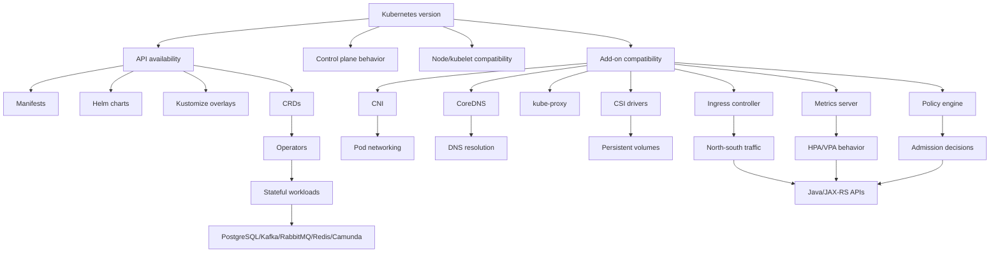

# Part 053 — Kubernetes Upgrade and Lifecycle Management

## 1. Core thesis

Kubernetes upgrade is not a single technical action.

It is a coordinated platform lifecycle change that can affect:

- API compatibility
- controller behavior
- admission policy
- node runtime behavior
- CNI networking
- CSI storage
- ingress routing
- CRDs and operators
- Helm/Kustomize rendering
- GitOps reconciliation
- Java/JAX-RS startup, shutdown, probes, and resource behavior
- PostgreSQL, Kafka, RabbitMQ, Redis, and Camunda-like dependencies
- observability, autoscaling, and incident response

A Kubernetes upgrade becomes dangerous when teams treat it as:

```text
upgrade cluster version
```

Instead of:

```text
validate platform dependency graph
migrate deprecated APIs
verify controller compatibility
protect workload disruption budget
test critical traffic paths
roll forward with observability
prepare rollback/mitigation where possible
```

For a senior backend engineer, the goal is not to become the cluster admin. The goal is to understand how a platform upgrade can break application behavior and what evidence must exist before production rollout.

---

## 2. Why Kubernetes upgrades are uniquely risky

A Kubernetes cluster is a distributed control system.

An upgrade can affect multiple layers at once:

```text
kubectl / CI / GitOps
        |
        v
Kubernetes API server
        |
        v
Admission controllers / policy engines
        |
        v
Controllers / operators
        |
        v
Scheduler
        |
        v
Nodes / kubelet / runtime
        |
        v
CNI / DNS / CSI / ingress / metrics
        |
        v
Pods / Java services / consumers / workers
```

The risk is not just that the cluster fails.

The risk is that the cluster still looks healthy while one of these contracts changes:

- a manifest is no longer accepted
- an API version is no longer served
- a controller reconciles differently
- a CRD schema becomes incompatible
- an ingress annotation changes semantics
- a CNI version changes packet path behavior
- a CSI driver changes mount/attach behavior
- a node runtime changes cgroup or image-pull behavior
- a Pod Security policy becomes stricter
- a metric adapter changes HPA behavior
- a Java service restarts more slowly than the rollout budget allows

---

## 3. Mental model: Kubernetes lifecycle is a dependency graph

Think of Kubernetes upgrade planning as dependency graph management.



A safe upgrade plan starts by asking:

> What can this version change affect, directly or indirectly?

Not:

> Does the control plane upgrade button succeed?

---

## 4. The minimum upgrade inventory

Before any serious upgrade discussion, inventory the platform surface.

### 4.1 Cluster inventory

Capture:

- current Kubernetes version
- target Kubernetes version
- managed service or self-managed cluster
- EKS, AKS, on-prem, or hybrid
- public/private cluster endpoint
- node OS image
- node runtime
- node group / node pool layout
- system node pool vs application node pool
- zone distribution
- cluster autoscaler or Karpenter equivalent
- maintenance window
- production freeze windows
- regulatory or customer change-control requirements

### 4.2 Add-on inventory

Capture:

- CNI plugin and version
- CoreDNS version
- kube-proxy version
- ingress controller version
- Gateway API controller if used
- metrics server
- Prometheus adapter / custom metrics adapter
- CSI drivers
- certificate manager
- external secrets controller
- policy engine
- service mesh if used
- logging agent
- tracing collector
- autoscaling controllers
- operators for stateful systems

### 4.3 Application inventory

Capture:

- namespaces
- Deployments
- StatefulSets
- DaemonSets
- Jobs/CronJobs
- Services
- Ingress/Gateway resources
- NetworkPolicies
- ServiceAccounts
- RBAC
- ConfigMaps
- Secrets
- PVCs
- CRDs
- Helm releases
- GitOps applications
- environment overlays
- critical business services
- customer-facing ingress paths
- background consumers
- scheduled jobs
- stateful dependencies

### 4.4 Critical workload inventory

For Java/JAX-RS systems, identify:

- public REST APIs
- internal REST APIs
- Kafka consumers
- RabbitMQ consumers
- Camunda workers
- scheduled reconciliation jobs
- migration jobs
- webhook endpoints
- high-throughput services
- services with long startup time
- services with large JVM heaps
- services with strict latency SLO
- services with stateful dependency coupling

---

## 5. Kubernetes API deprecation

Kubernetes APIs evolve.

An object that is valid today can become deprecated and later removed from the API server. This matters because a removed API can break:

- `kubectl apply`
- Helm upgrades
- GitOps sync
- CI validation
- rollback to an old manifest
- disaster recovery restore
- CRD/operator reconciliation
- namespace bootstrap
- environment promotion

The dangerous pattern:

```yaml
apiVersion: extensions/v1beta1
kind: Ingress
```

The conceptual issue is not this specific API only. The issue is relying on an API version that the target cluster no longer serves.

### 5.1 Deprecated API failure mode

Typical symptoms:

```text
error: resource mapping not found
no matches for kind "Ingress" in version "extensions/v1beta1"
the server could not find the requested resource
unable to recognize manifest
```

In GitOps:

```text
SyncFailed
ComparisonError
Resource not found
unable to build kubernetes objects from release manifest
```

In Helm:

```text
UPGRADE FAILED
unable to recognize
no matches for kind
```

### 5.2 Deprecated API migration workflow

Use this workflow before upgrade:

```text
1. Inventory all manifests rendered for the environment.
2. Detect deprecated API versions.
3. Migrate manifests to supported API versions.
4. Run server-side dry-run against a test cluster.
5. Validate Helm/Kustomize rendered output.
6. Validate GitOps sync behavior.
7. Validate rollback manifests.
8. Validate CRD and operator compatibility.
9. Promote only after all environments pass.
```

### 5.3 Rendered manifests matter more than source templates

Do not only inspect template source.

For Helm:

```bash
helm template ./chart -f values-prod.yaml > rendered.yaml
```

For Kustomize:

```bash
kubectl kustomize overlays/prod > rendered.yaml
```

For GitOps:

```text
inspect the exact rendered manifests that the controller applies
```

The cluster only sees rendered manifests.

---

## 6. Version skew awareness

A Kubernetes cluster is made of components that may not all be upgraded simultaneously.

Important compatibility surfaces:

- API server vs kubelet
- API server vs controller manager
- API server vs scheduler
- kubelet vs kube-proxy
- kubectl vs API server
- managed add-ons vs cluster version
- node image vs kubelet version
- CNI version vs node/kernel behavior

The practical rule:

> Never assume any component version combination is valid just because each version exists.

Always check the managed platform support matrix.

For EKS, validate AWS-supported Kubernetes versions, managed add-on compatibility, node AMI compatibility, and upgrade sequence.

For AKS, validate supported Kubernetes versions, node image compatibility, add-on compatibility, and maintenance policy.

For on-prem, validate the Kubernetes distribution, kubeadm/RKE/OpenShift/Tanzu/other distribution support, OS/kernel dependencies, and operational rollback limitations.

---

## 7. Upgrade order

A safe upgrade usually follows dependency order.

Generic conceptual order:

```text
1. Prepare inventory and compatibility matrix.
2. Remove deprecated APIs from manifests.
3. Upgrade or validate CRDs/operators.
4. Validate add-ons in non-production.
5. Upgrade control plane.
6. Upgrade system add-ons.
7. Upgrade node pools gradually.
8. Validate critical workloads.
9. Run synthetic traffic and smoke tests.
10. Monitor for delayed failures.
```

Do not blindly apply this order. Managed services may require a specific sequence.

### 7.1 Control plane upgrade

Control plane upgrade can affect:

- API availability
- admission behavior
- schema validation
- controller behavior
- audit log format
- authentication/authorization edge cases
- CRD conversion behavior
- webhook compatibility

For application teams, the key question is:

> Can our manifests still be admitted and reconciled?

### 7.2 Add-on upgrade

Add-ons can be more application-impacting than the control plane itself.

Examples:

- CNI affects pod connectivity.
- CoreDNS affects service discovery.
- kube-proxy affects service routing.
- ingress controller affects external traffic.
- CSI driver affects volume attach/mount.
- metrics server affects HPA.
- external secrets affects secret refresh.
- cert-manager affects certificates.
- policy engine affects admission.
- logging agent affects observability.

### 7.3 Node upgrade

Node upgrade can affect:

- pod restart
- image pull
- cgroup behavior
- runtime behavior
- kernel networking
- DNS resolution path
- ephemeral storage behavior
- device/plugin availability
- local daemonset compatibility
- Java CPU/memory perception

For Java services, node upgrade often exposes hidden problems:

- slow startup
- weak readiness probes
- missing PDB
- insufficient replica count
- poor graceful shutdown
- bad resource sizing
- dependency cold-start pressure
- image pull from slow registry
- DNS spike during mass restart

---

## 8. Workload disruption planning

Upgrade safety depends heavily on workload disruption tolerance.

### 8.1 Replica count

A single-replica Deployment is not highly available.

During node drain, it can become unavailable unless special handling exists.

Review:

```yaml
spec:
  replicas: 1
```

Ask:

- Is this intentionally single-replica?
- Is it customer-facing?
- Is downtime acceptable?
- Is there leader election?
- Is this a singleton worker?
- Does it need special drain sequencing?

### 8.2 PodDisruptionBudget

A PDB protects voluntary disruptions such as node drain.

Example:

```yaml
apiVersion: policy/v1
kind: PodDisruptionBudget
metadata:
  name: quote-api-pdb
spec:
  minAvailable: 2
  selector:
    matchLabels:
      app: quote-api
```

A bad PDB can also block upgrades.

Common mistakes:

```text
replicas=1, minAvailable=1
```

This prevents voluntary eviction.

Senior review question:

> Does the PDB protect availability while still allowing node maintenance?

### 8.3 Readiness is the availability gate

During upgrade, Kubernetes may reschedule pods.

Traffic safety depends on readiness.

Bad readiness:

```text
process is alive
```

Better readiness:

```text
HTTP server is accepting traffic
critical local initialization is complete
routing dependencies are ready enough for this pod to serve
```

Do not put every downstream dependency into readiness. That can cause cascading outage.

---

## 9. Java/JAX-RS impact

Cluster upgrades affect Java services through operational side effects.

### 9.1 Startup

During node rolling replacement:

- many pods may start at once
- image pulls can compete
- JVM warmup can spike CPU
- JIT warmup affects latency
- connection pools initialize
- caches warm
- service discovery spikes
- downstream dependencies receive reconnect storms

Mitigation:

- startupProbe for slow startup
- realistic resource requests
- maxUnavailable tuned carefully
- staggered rollout
- pre-pulled images where supported
- connection pool limits
- retry jitter
- cache warmup design
- synthetic smoke tests

### 9.2 Shutdown

During node drain, pods receive termination.

Risk areas:

- in-flight HTTP requests
- Kafka offsets
- RabbitMQ acknowledgements
- database transactions
- Camunda worker locks
- scheduled job interruption
- async executor shutdown
- HTTP client retries

Review:

```yaml
terminationGracePeriodSeconds: 60
```

And application behavior:

```text
SIGTERM received
readiness removed
server stops accepting new traffic
in-flight requests complete
consumers stop polling
transactions finish/rollback safely
process exits before SIGKILL
```

### 9.3 Resource perception

Node/runtime changes can expose:

- CPU throttling
- memory pressure
- cgroup behavior changes
- Java heap mismatch
- direct memory pressure
- metaspace growth
- thread stack overhead

During upgrade validation, watch:

- container CPU throttling
- JVM heap usage
- non-heap memory
- GC pause time
- pod restarts
- OOMKilled
- request latency
- consumer lag

---

## 10. Stateful workload impact

Stateful workloads require stricter planning.

### 10.1 PostgreSQL

Risk surfaces:

- PVC attach/mount delay
- CSI driver compatibility
- node drain interruption
- backup agent compatibility
- storage class behavior
- failover behavior
- DNS identity
- operator compatibility

Senior question:

> Is PostgreSQL self-managed in Kubernetes or provided as managed database service?

If self-managed, upgrade planning must include database ownership, backup/restore proof, and failover testing.

### 10.2 Kafka

Risk surfaces:

- broker identity
- persistent volume availability
- rack/zone awareness
- controller quorum
- partition leadership
- client reconnect storms
- operator compatibility

Do not treat Kafka as ordinary pods.

### 10.3 RabbitMQ

Risk surfaces:

- cluster membership
- quorum queue behavior
- PVC availability
- node identity
- graceful shutdown
- operator version compatibility

### 10.4 Redis

Risk surfaces:

- persistence mode
- master/replica failover
- Sentinel/operator compatibility
- memory pressure
- eviction policy
- client reconnect behavior

### 10.5 Camunda-like workflow systems

Risk surfaces:

- job lock behavior
- worker shutdown
- database availability
- retry storm
- process state consistency
- external task lock expiration
- worker idempotency

---

## 11. CRD and operator lifecycle

CRDs and operators are a common upgrade trap.

A CRD is an API extension. Operators are controllers that reconcile custom resources.

Examples may include:

- External Secrets
- cert-manager
- Kafka operators
- RabbitMQ operators
- Redis operators
- PostgreSQL operators
- monitoring operators
- service mesh operators
- ingress/gateway operators
- policy engines

Upgrade risks:

- CRD schema changes
- conversion webhook failure
- operator watches deprecated APIs
- custom resource fields removed
- Helm chart upgrades CRD unsafely
- GitOps sync order wrong
- finalizers block deletion
- operator cannot reconcile after control plane upgrade

Checklist:

```text
- Which CRDs exist?
- Who owns each CRD?
- Which workloads depend on each CRD?
- Are CRDs upgraded before or after controller?
- Are conversion webhooks healthy?
- Does backup include custom resources?
- Does GitOps manage CRDs or are they manually installed?
- Are CRDs shared across teams?
```

---

## 12. Ingress controller lifecycle

Ingress controller upgrade can break customer traffic while workloads remain healthy.

Risk surfaces:

- annotation behavior
- path matching behavior
- regex interpretation
- timeout defaults
- body size defaults
- TLS config
- backend protocol
- forwarded headers
- source IP behavior
- canary/sticky session annotations
- metrics format
- admission webhook behavior

Before upgrade:

```text
1. Inventory all Ingress/Gateway resources.
2. Identify controller-specific annotations.
3. Validate TLS termination.
4. Validate path and host routing.
5. Validate 404/502/503/504 behavior.
6. Test timeout chain.
7. Test large request body if relevant.
8. Test WebSocket/gRPC if relevant.
9. Compare access logs before/after.
```

For Java/JAX-RS:

- verify base path
- verify forwarded headers
- verify scheme reconstruction
- verify generated absolute URLs if any
- verify auth redirect behavior
- verify client IP extraction
- verify timeout longer than app max processing time

---

## 13. CNI lifecycle

CNI upgrade affects pod networking.

Risk surfaces:

- pod IP allocation
- route programming
- NetworkPolicy enforcement
- node ENI/IP exhaustion in EKS-like environments
- Azure CNI IP allocation in AKS-like environments
- MTU
- DNS reachability
- egress NAT
- service routing
- packet drop under load
- observability gaps

Validation:

```text
- pod-to-pod same namespace
- pod-to-pod cross namespace
- pod-to-service
- pod-to-DNS
- pod-to-database
- pod-to-Kafka/RabbitMQ/Redis
- pod-to-cloud private endpoint
- pod-to-internet if allowed
- ingress-to-pod
- NetworkPolicy allowed traffic
- NetworkPolicy denied traffic
```

---

## 14. CSI lifecycle

CSI driver upgrade affects persistent storage.

Risk surfaces:

- PVC provisioning
- volume attach
- volume mount
- resize
- snapshot
- reclaim policy
- zone topology
- node plugin daemonset
- permission/identity
- backup tool integration

Validation:

```text
- create PVC
- attach to pod
- write data
- restart pod
- reschedule pod
- detach/attach across nodes
- expand volume if used
- snapshot/restore if used
- verify metrics/logs
```

For stateful systems, test with representative workload behavior, not only a toy PVC.

---

## 15. Metrics and autoscaling lifecycle

HPA behavior depends on metrics availability.

Upgrade can affect:

- metrics server
- custom metrics adapter
- external metrics adapter
- Prometheus adapter
- KEDA scaler
- metric labels
- metric names
- scrape configuration
- APIService availability

Failure symptoms:

```text
HPA shows unknown metrics
HPA does not scale
HPA scales too late
HPA scales too aggressively
KEDA scaler authentication fails
consumer lag grows
```

Validate:

```bash
kubectl get hpa -A
kubectl describe hpa <name> -n <namespace>
kubectl get apiservice | grep metrics
```

Also validate business metrics:

- request rate
- latency
- error rate
- consumer lag
- queue depth
- job backlog

---

## 16. GitOps lifecycle during upgrade

GitOps can either protect or amplify upgrade risk.

Risk surfaces:

- sync storm after control plane upgrade
- old APIs still in Git
- CRD ordering problem
- application health checks outdated
- manual hotfix overwritten
- rollback applies removed API
- drift detection noisy
- environment overlay mismatch

Safe GitOps practices:

```text
- render manifests before upgrade
- validate against target cluster
- freeze unrelated changes
- upgrade platform components separately from app changes
- use sync waves or phases for CRDs/controllers/apps
- document manual intervention policy
- verify rollback manifests remain valid
- monitor reconciliation errors
```

Senior question:

> Is rollback still possible after the target cluster stops serving old APIs?

If not, rollback means roll forward with fixed manifests, not reapply old manifests.

---

## 17. Rollback limitation

Kubernetes upgrade rollback is not always simple.

Possible rollback categories:

### 17.1 Application rollback

Usually possible if:

- previous image still exists
- previous manifests are valid
- config/secret compatible
- database migration backward compatible
- API version still served

### 17.2 Add-on rollback

May be possible but risky.

Depends on:

- CRD compatibility
- config compatibility
- data-plane behavior
- managed service support
- version skew support

### 17.3 Control plane rollback

Often restricted or unsupported in managed services.

Do not assume it exists.

### 17.4 Node rollback

Possible by rolling back node group/pool version or image in some environments, but depends on provider and process.

Senior rule:

> An upgrade plan without rollback limitations documented is not a production upgrade plan.

---

## 18. Upgrade testing strategy

### 18.1 Static validation

Perform before runtime testing:

```text
- deprecated API scan
- Helm template validation
- Kustomize build validation
- schema validation
- policy validation
- server-side dry-run
- CRD compatibility check
- image availability check
- RBAC validation
```

Useful commands:

```bash
kubectl apply --server-side --dry-run=server -f rendered.yaml
kubectl diff -f rendered.yaml
kubectl api-resources
kubectl explain deployment.spec
```

### 18.2 Runtime validation

Validate:

```text
- pod scheduling
- readiness
- liveness
- startup
- service routing
- ingress routing
- DNS
- TLS
- cloud SDK access
- database connectivity
- Kafka/RabbitMQ connectivity
- Redis connectivity
- Camunda worker behavior
- metrics/logs/traces
- autoscaling
- graceful shutdown
```

### 18.3 Synthetic traffic

Use synthetic traffic to verify:

- public APIs
- internal APIs
- auth path
- callback/webhook path
- high-latency endpoint
- large request body
- common customer journey
- retry behavior
- timeout behavior
- error response shape

### 18.4 Failure injection

Where safe, test:

- pod deletion
- node drain
- DNS failure simulation
- dependency timeout
- image pull delay
- service no endpoint
- NetworkPolicy deny
- secret missing in test
- HPA metric unavailable

---

## 19. Upgrade runbook structure

A serious upgrade runbook should include:

```text
1. Scope
2. Reason for upgrade
3. Current version
4. Target version
5. Affected clusters/environments
6. Affected namespaces/workloads
7. Compatibility matrix
8. Deprecated API findings
9. CRD/operator findings
10. Add-on upgrade plan
11. Node upgrade plan
12. Application validation plan
13. Traffic validation plan
14. Observability dashboard links
15. Alert suppression rules if any
16. Rollback/mitigation options
17. Known non-rollbackable steps
18. Change window
19. Communication plan
20. Owner and escalation path
21. Go/no-go criteria
22. Post-upgrade monitoring window
23. Post-upgrade review checklist
```

---

## 20. Go/no-go criteria

Example go criteria:

```text
- no unsupported deprecated APIs in rendered manifests
- all critical CRDs compatible
- all required add-ons compatible
- non-prod upgrade completed
- smoke tests passed
- synthetic traffic passed
- PDB review completed
- critical workloads have enough replicas or documented exception
- dashboards ready
- rollback/mitigation documented
- platform/SRE/backend/security owners aligned
```

Example no-go criteria:

```text
- deprecated API still used in production manifests
- critical operator unsupported
- ingress controller compatibility unknown
- CNI upgrade untested
- CSI validation failed
- HPA metrics unavailable
- stateful workload backup/restore unverified
- no owner for incident response
- rollback limitation undocumented
```

---

## 21. Failure modes

### 21.1 Deprecated API blocks sync

Symptom:

```text
GitOps sync failed
no matches for kind
resource mapping not found
```

Likely cause:

```text
manifest uses removed API version
```

Debug:

```bash
kubectl api-resources
kubectl apply --dry-run=server -f rendered.yaml
```

Mitigation:

```text
migrate apiVersion and fields
rerender chart/overlay
sync fixed manifest
```

### 21.2 Pods stuck Pending after node upgrade

Possible causes:

- insufficient capacity
- taint not tolerated
- node selector mismatch
- affinity too strict
- topology spread impossible
- PVC zone mismatch
- quota exceeded

Debug:

```bash
kubectl describe pod <pod> -n <namespace>
kubectl get nodes --show-labels
kubectl get events -n <namespace> --sort-by=.lastTimestamp
```

### 21.3 Service traffic fails after CNI or kube-proxy upgrade

Possible causes:

- service endpoint missing
- kube-proxy issue
- CNI route issue
- NetworkPolicy enforcement changed
- DNS issue
- pod not ready

Debug:

```bash
kubectl get svc,endpointslices -n <namespace>
kubectl get pods -o wide -n <namespace>
kubectl exec -n <namespace> <pod> -- nslookup <service>
kubectl exec -n <namespace> <pod> -- curl -v http://<service>:<port>
```

### 21.4 Ingress returns 502/503/504

Possible causes:

- backend service has no endpoints
- readiness failure
- ingress timeout changed
- backend protocol mismatch
- TLS config issue
- path rewrite behavior changed
- controller annotation incompatibility

Debug:

```bash
kubectl describe ingress <name> -n <namespace>
kubectl get svc,endpointslices -n <namespace>
kubectl logs -n <ingress-namespace> deploy/<ingress-controller>
```

### 21.5 HPA stops scaling

Possible causes:

- metrics server unavailable
- custom metrics adapter broken
- labels changed
- metric name changed
- RBAC denied
- APIService unhealthy

Debug:

```bash
kubectl describe hpa <name> -n <namespace>
kubectl get apiservice | grep metrics
kubectl top pods -n <namespace>
```

### 21.6 PVC mount failure

Possible causes:

- CSI driver incompatible
- volume zone mismatch
- node plugin not running
- permission issue
- storage backend issue

Debug:

```bash
kubectl describe pvc <pvc> -n <namespace>
kubectl describe pod <pod> -n <namespace>
kubectl get csidrivers
kubectl get pods -n kube-system | grep csi
```

---

## 22. Production-safe debugging during upgrade

Do:

```text
- observe before changing
- inspect events
- compare before/after versions
- test one namespace or canary workload first
- preserve logs/events
- communicate findings
- prefer rollback/mitigation playbook over ad-hoc edits
```

Avoid:

```text
- deleting many pods blindly
- manually editing GitOps-managed resources without coordination
- disabling policy globally
- changing NetworkPolicy broadly during incident
- scaling stateful workloads without understanding quorum
- restarting operators before checking logs
- draining nodes without checking PDBs
```

---

## 23. EKS-specific verification checklist

Internal verification checklist:

- Confirm whether the environment uses EKS.
- Confirm current and target Kubernetes versions.
- Confirm EKS supported version window.
- Confirm managed add-on versions:
  - VPC CNI
  - CoreDNS
  - kube-proxy
  - EBS CSI
  - EFS CSI if used
- Confirm node group strategy:
  - managed node group
  - self-managed nodes
  - Fargate profiles
  - Karpenter
  - Cluster Autoscaler
- Confirm node AMI upgrade strategy.
- Confirm IRSA / Pod Identity behavior.
- Confirm AWS Load Balancer Controller compatibility.
- Confirm ingress annotations and ALB/NLB behavior.
- Confirm ECR image pull behavior.
- Confirm CloudWatch/Container Insights behavior.
- Confirm VPC endpoint/private connectivity behavior.
- Confirm security group rules and pod security group behavior if used.
- Confirm rollback limitations with platform/SRE.

---

## 24. AKS-specific verification checklist

Internal verification checklist:

- Confirm whether the environment uses AKS.
- Confirm current and target Kubernetes versions.
- Confirm AKS supported version window.
- Confirm node pool strategy:
  - system node pool
  - user node pool
  - VMSS
  - upgrade surge settings
- Confirm Azure CNI/kubenet or newer networking mode.
- Confirm Azure Load Balancer behavior.
- Confirm Application Gateway/AGIC or ingress controller compatibility.
- Confirm Azure DNS and Private DNS Zone behavior.
- Confirm ACR integration and image pull identity.
- Confirm Managed Identity / Workload Identity behavior.
- Confirm Azure Disk CSI and Azure Files CSI behavior.
- Confirm Key Vault CSI provider behavior.
- Confirm Azure Monitor / Container Insights / Log Analytics behavior.
- Confirm Private Endpoint connectivity.
- Confirm NSG/UDR/firewall behavior.
- Confirm rollback limitations with platform/SRE.

---

## 25. On-prem/hybrid verification checklist

Internal verification checklist:

- Confirm Kubernetes distribution.
- Confirm upgrade tooling.
- Confirm control plane ownership.
- Confirm etcd backup/restore procedure.
- Confirm load balancer integration.
- Confirm ingress controller upgrade strategy.
- Confirm DNS ownership.
- Confirm certificate lifecycle.
- Confirm internal registry availability.
- Confirm air-gapped constraints.
- Confirm CNI upgrade plan.
- Confirm CSI/storage upgrade plan.
- Confirm firewall/proxy changes.
- Confirm hybrid DNS.
- Confirm VPN/Direct Connect/ExpressRoute dependencies.
- Confirm monitoring and logging during upgrade.
- Confirm rollback limitations.

---

## 26. PR review checklist for upgrade-related changes

When reviewing upgrade-related PRs, ask:

### API and manifest

- Are all rendered manifests valid against the target cluster?
- Are deprecated APIs removed?
- Are CRDs compatible?
- Are Helm/Kustomize overlays updated consistently?
- Does rollback manifest still work?

### Workload availability

- Are critical workloads replicated?
- Are PDBs correct?
- Are readiness probes realistic?
- Are startup probes configured for slow Java startup?
- Is graceful shutdown configured?

### Networking

- Are ingress rules compatible?
- Are controller annotations still valid?
- Are NetworkPolicies compatible?
- Is DNS behavior validated?
- Are private endpoints validated?

### Storage

- Are CSI drivers compatible?
- Are PVCs safe during node replacement?
- Are stateful workloads tested?
- Is backup/restore proven?

### Security and identity

- Are admission policies compatible?
- Are Pod Security labels/policies compatible?
- Are ServiceAccounts and cloud identities still valid?
- Are secrets/external secrets controllers compatible?

### Observability

- Are dashboards ready?
- Are alerts ready?
- Are logs/traces still flowing?
- Are HPA metrics still available?

### Operations

- Is there a runbook?
- Are go/no-go criteria explicit?
- Are rollback limitations documented?
- Are owners identified?
- Is the change window approved?

---

## 27. Senior engineer heuristics

Use these heuristics:

```text
If it changes the API server, validate manifests.
If it changes nodes, validate scheduling and disruption.
If it changes CNI, validate traffic paths.
If it changes CoreDNS, validate service discovery.
If it changes CSI, validate storage and stateful workloads.
If it changes ingress, validate customer traffic.
If it changes metrics, validate autoscaling.
If it changes policy, validate admission.
If it changes identity, validate cloud calls.
If it changes operators, validate CRDs and reconciliation.
```

The upgrade is safe only when the contracts your applications depend on remain valid.

---

## 28. Anti-patterns

Avoid:

```text
- upgrading production first
- relying only on provider upgrade success status
- not rendering Helm/Kustomize output
- ignoring deprecated APIs
- not checking rollback compatibility
- upgrading control plane and apps in the same change
- upgrading multiple add-ons without isolation
- skipping PDB review
- ignoring single-replica critical services
- testing only happy-path REST APIs
- ignoring consumers/workers/jobs
- ignoring private endpoint and DNS behavior
- ignoring stateful workloads
- ignoring observability changes
- disabling admission policy permanently to make upgrade pass
```

---

## 29. Production readiness checkpoint

Before saying an upgrade is production-ready, you should be able to answer:

```text
What version are we on?
What version are we moving to?
Which APIs are removed or deprecated?
Which manifests were scanned?
Which rendered manifests were validated?
Which add-ons are affected?
Which CRDs/operators are affected?
Which workloads are most critical?
Which workloads are single-replica?
Which workloads have PDBs?
Which traffic paths were tested?
Which stateful dependencies were tested?
Which autoscaling paths were tested?
Which dashboards prove health?
What is the rollback or mitigation plan?
What cannot be rolled back?
Who owns the incident if this fails?
```

---

## 30. Final mental model

A Kubernetes upgrade is not primarily a version bump.

It is a compatibility exercise across:

```text
API
controllers
nodes
network
storage
identity
policy
traffic
observability
workloads
runbooks
```

For enterprise Java/JAX-RS systems, the most important application-side responsibilities are:

- remove deprecated APIs from manifests
- make readiness/liveness/startup probes correct
- configure graceful shutdown
- set realistic resource requests/limits
- protect availability with replicas and PDBs
- validate traffic flow
- validate dependency connectivity
- validate consumer/job behavior
- validate observability
- document rollback and mitigation
- verify platform-specific details internally

---

## 31. Internal verification checklist

Use this checklist inside CSG/team context. Do not assume any answer.

### Cluster and platform

- Which clusters exist?
- Which are EKS, AKS, on-prem, or hybrid?
- What Kubernetes versions are currently used?
- What target versions are planned?
- Who owns cluster upgrade?
- What maintenance windows exist?
- What change approval process applies?

### APIs and manifests

- Which deprecated APIs exist in rendered manifests?
- Which Helm charts need update?
- Which Kustomize overlays need update?
- Which CRDs are installed?
- Which operators depend on specific Kubernetes versions?
- Are rollback manifests still valid?

### Workloads

- Which services are customer-facing?
- Which services are single-replica?
- Which services have PDB?
- Which services have slow startup?
- Which services are Kafka/RabbitMQ consumers?
- Which services run Camunda workers?
- Which jobs are business-critical?
- Which stateful workloads exist?

### Add-ons

- Which CNI is used?
- Which ingress controller is used?
- Which CSI drivers are used?
- Which external secret controller is used?
- Which policy engine is used?
- Which metrics adapter is used?
- Which logging/tracing agents are used?

### Cloud/on-prem

- Which EKS/AKS add-ons are managed?
- Which node group/node pool upgrade strategy is used?
- Which private endpoints/VPC endpoints are critical?
- Which DNS zones are involved?
- Which firewalls/proxies may affect traffic?
- Which certificates may be affected?

### Operations

- Where is the upgrade runbook?
- Where are dashboards?
- What alerts should be watched?
- What is the rollback limitation?
- Who approves go/no-go?
- Who communicates customer impact?
- Where are incident notes stored?

---

## 32. Key takeaway

A senior engineer does not ask only:

```text
Can Kubernetes be upgraded?
```

A senior engineer asks:

```text
Can our workload contracts survive the upgrade?
Can our traffic paths survive the upgrade?
Can our stateful dependencies survive the upgrade?
Can our observability prove safety?
Can our rollback or mitigation plan handle failure?
```

That is the difference between platform version management and production engineering.
