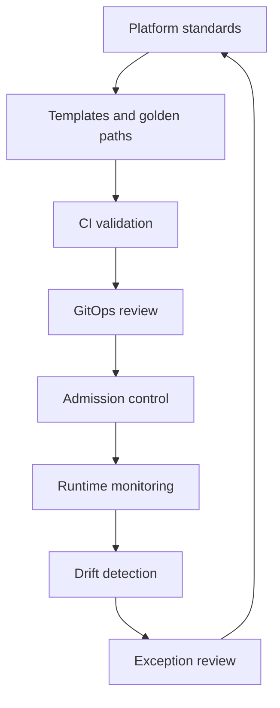

# Part 054 — Platform Policy and Governance

## 1. Core thesis

Kubernetes without platform governance becomes a cluster full of locally reasonable but globally dangerous decisions.

Every team can create:

- slightly different labels
- inconsistent probes
- missing resource requests
- over-permissive ServiceAccounts
- unmanaged secrets
- public ingresses without clear ownership
- pods running as root
- missing NetworkPolicies
- unbounded logging
- fragile Helm values
- undocumented exceptions

At small scale, this looks like flexibility.

At enterprise scale, it becomes:

```text
incident risk
security risk
cost leak
operational ambiguity
audit weakness
platform drift
```

Platform governance is the discipline of turning production expectations into consistent, reviewable, enforceable standards.

The goal is not bureaucracy.

The goal is to make the safe path the default path.

---

## 2. Governance is a control system

A mature platform uses multiple layers of control:



Good governance does not rely only on humans remembering checklists.

It combines:

- documentation
- templates
- PR review
- static validation
- admission policy
- runtime detection
- dashboards
- exception handling
- periodic audit

---

## 3. What platform governance must standardize

At minimum, standardize these areas:

```text
namespace
labels
annotations
resource requests/limits
probes
security context
RBAC
ServiceAccount
secrets
ConfigMaps
NetworkPolicy
Ingress/Gateway
TLS
storage
autoscaling
observability
cost attribution
GitOps ownership
runbooks
exceptions
```

The most important standard is not the YAML shape. It is the operational contract.

Example:

```text
Every customer-facing service must expose a readiness endpoint
that only becomes ready after local startup is complete
and must support graceful shutdown within the configured termination grace period.
```

That contract can then be implemented in Helm templates, Kustomize bases, CI checks, and admission policies.

---

## 4. Namespace standards

Namespaces are not just folders.

They define boundaries for:

- access control
- quota
- NetworkPolicy
- Pod Security admission
- secret visibility
- deployment ownership
- cost attribution
- environment separation
- incident blast radius

### 4.1 Namespace naming

A useful naming convention encodes ownership and environment.

Examples:

```text
quote-order-dev
quote-order-test
quote-order-staging
quote-order-prod
platform-observability
platform-ingress
platform-secrets
```

Avoid names that hide ownership:

```text
app
backend
default
prod
misc
test2
```

### 4.2 Namespace required metadata

Example:

```yaml
apiVersion: v1
kind: Namespace
metadata:
  name: quote-order-prod
  labels:
    app.kubernetes.io/part-of: quote-order
    environment: prod
    owner-team: quote-order
    cost-center: example-cost-center
    data-classification: confidential
    pod-security.kubernetes.io/enforce: restricted
    pod-security.kubernetes.io/audit: restricted
    pod-security.kubernetes.io/warn: restricted
  annotations:
    runbook.example.com/url: "internal-verification-required"
    escalation.example.com/team: "internal-verification-required"
```

Do not copy this as-is for CSG. Use it as a shape to compare against internal standards.

### 4.3 Namespace governance checklist

Internal verification checklist:

- What is the namespace naming standard?
- Is namespace per team, product, environment, tenant, or application?
- Are `default` namespace workloads forbidden?
- Are namespace owners visible?
- Are cost labels required?
- Are Pod Security labels enforced?
- Are quotas applied?
- Are LimitRanges applied?
- Are default-deny NetworkPolicies required?
- Are runbooks linked?
- Who can create namespaces?

---

## 5. Label standards

Labels are queryable identity.

They power:

- selectors
- Services
- Deployments
- NetworkPolicies
- dashboards
- alerts
- cost allocation
- ownership
- GitOps grouping
- inventory
- incident search

A poor label strategy breaks automation.

### 5.1 Recommended label categories

Use labels for stable machine-readable identity:

```yaml
metadata:
  labels:
    app.kubernetes.io/name: quote-api
    app.kubernetes.io/instance: quote-api-prod
    app.kubernetes.io/version: "1.42.0"
    app.kubernetes.io/component: api
    app.kubernetes.io/part-of: quote-order
    app.kubernetes.io/managed-by: Helm
    environment: prod
    owner-team: quote-order
    workload-type: jaxrs-api
    data-classification: confidential
```

### 5.2 Selector labels must be stable

A Service selector should not use frequently changing labels.

Bad:

```yaml
selector:
  app.kubernetes.io/version: "1.42.0"
```

This can disconnect Service from pods during rollout.

Better:

```yaml
selector:
  app.kubernetes.io/name: quote-api
  app.kubernetes.io/instance: quote-api-prod
```

### 5.3 Label governance checklist

Internal verification checklist:

- Are standard Kubernetes recommended labels used?
- Which labels are mandatory?
- Which labels are allowed in selectors?
- Which labels drive cost allocation?
- Which labels drive dashboards?
- Which labels drive NetworkPolicy?
- Which labels identify owner team?
- Are mutable labels kept out of selectors?
- Are labels consistent across Helm/Kustomize/GitOps?
- Are labels validated in CI/admission?

---

## 6. Annotation standards

Annotations are metadata for tools and humans.

They often configure:

- ingress controllers
- service meshes
- secret reloaders
- observability agents
- deployment tools
- policy exceptions
- runbook links
- ownership links

Annotations can be dangerous because they may alter controller behavior.

Example ingress annotations may change:

- timeout
- body size
- rewrite
- TLS behavior
- backend protocol
- canary routing
- sticky session

### 6.1 Annotation governance rule

Treat controller-specific annotations as privileged configuration.

They should be:

- documented
- reviewed
- validated
- owned
- tested
- monitored

### 6.2 Annotation governance checklist

Internal verification checklist:

- Which annotations are allowed?
- Which annotations are forbidden?
- Which annotations require platform approval?
- Are ingress annotations reviewed?
- Are policy exception annotations time-bound?
- Are runbook annotations required?
- Are annotation values validated?
- Are annotation changes tested in non-prod?
- Are annotations documented per controller?

---

## 7. Resource standards

Resource governance protects:

- application stability
- node capacity
- autoscaling behavior
- cost
- noisy-neighbor isolation
- JVM correctness

Every production workload should define:

```yaml
resources:
  requests:
    cpu: "500m"
    memory: "1Gi"
  limits:
    memory: "2Gi"
```

CPU limit policy is more nuanced for Java services because CPU throttling can harm latency. Some organizations use memory limits but avoid CPU limits for latency-sensitive services, relying on CPU requests and quota instead. This must be an internal platform decision.

### 7.1 Resource standard by workload type

Different workload types need different defaults.

```text
REST API:
  prioritize latency, startup, readiness, CPU headroom

Kafka/RabbitMQ consumer:
  prioritize throughput, lag recovery, graceful shutdown

Batch job:
  prioritize bounded runtime, retry safety, resource isolation

Camunda worker:
  prioritize lock duration, idempotency, external task behavior

Stateful dependency:
  prioritize memory, disk, IO, anti-affinity, disruption safety
```

### 7.2 Resource governance checklist

Internal verification checklist:

- Are CPU requests mandatory?
- Are memory requests mandatory?
- Are memory limits mandatory?
- Are CPU limits required, optional, or discouraged?
- Are defaults workload-type aware?
- Are JVM heap rules standardized?
- Are QoS classes understood?
- Are ResourceQuotas applied?
- Are LimitRanges applied?
- Are cost dashboards using resource labels?
- Are resource changes reviewed against metrics?

---

## 8. Probe standards

Probe governance prevents accidental outages.

Required distinctions:

```text
startupProbe:
  protects slow-starting containers from premature liveness failure

readinessProbe:
  controls whether pod receives traffic

livenessProbe:
  detects unrecoverable local process failure
```

### 8.1 Probe anti-patterns to forbid

Avoid:

```text
- liveness checks all downstream dependencies
- readiness always returns 200 after process starts
- same endpoint used for all probes with same semantics
- very short timeout for Java cold start
- aggressive failureThreshold causing restart storm
- no startupProbe for slow JVM startup
- readiness depends on optional dependency
- probe endpoint performs expensive DB query
```

### 8.2 Probe governance checklist

Internal verification checklist:

- Are readiness/liveness/startup required for APIs?
- Are probe endpoints standardized?
- Are dependency checks allowed in readiness?
- Are downstream checks forbidden in liveness?
- Are timeouts standardized?
- Are slow-start Java services required to use startupProbe?
- Are probe failures dashboarded?
- Are probe-induced incidents reviewed?
- Are Helm chart defaults safe?

---

## 9. Security standards

Security governance defines the baseline runtime posture.

Common standards:

```yaml
securityContext:
  runAsNonRoot: true
  readOnlyRootFilesystem: true
  allowPrivilegeEscalation: false
  capabilities:
    drop:
      - ALL
  seccompProfile:
    type: RuntimeDefault
```

This may need exceptions for specific workloads, but exceptions should be explicit and reviewed.

### 9.1 Security settings to control

Control:

- privileged containers
- hostNetwork
- hostPID
- hostIPC
- HostPath
- added Linux capabilities
- root user
- writable root filesystem
- privilege escalation
- unsafe sysctls
- service account token automount
- image registry source
- latest tag
- unsigned images
- unscanned images

### 9.2 Pod Security Standards

Pod Security Standards define broad profiles such as privileged, baseline, and restricted. Platform teams commonly map namespace enforcement to environment and workload needs.

Example:

```yaml
metadata:
  labels:
    pod-security.kubernetes.io/enforce: restricted
    pod-security.kubernetes.io/audit: restricted
    pod-security.kubernetes.io/warn: restricted
```

Internal policy may differ. Verify.

### 9.3 Security governance checklist

Internal verification checklist:

- Is restricted Pod Security enforced?
- Are exceptions allowed?
- Who approves privileged containers?
- Is HostPath forbidden?
- Is hostNetwork forbidden?
- Is root forbidden?
- Is read-only root filesystem required?
- Are capabilities dropped by default?
- Is seccomp RuntimeDefault required?
- Are images restricted to trusted registries?
- Is image scanning required before deploy?
- Are security exceptions time-bound?

---

## 10. RBAC and ServiceAccount standards

RBAC governance prevents workload and automation privilege sprawl.

### 10.1 ServiceAccount standard

Every workload should have an explicit ServiceAccount.

Avoid relying on `default`.

Example:

```yaml
apiVersion: v1
kind: ServiceAccount
metadata:
  name: quote-api
automountServiceAccountToken: false
```

If the pod needs Kubernetes API access or cloud workload identity, enable only what is needed.

### 10.2 RBAC principles

Use:

```text
least privilege
namespace scope when possible
separate deployer permission from runtime permission
separate GitOps controller permission from application permission
avoid cluster-admin
avoid wildcard verbs/resources unless justified
```

### 10.3 RBAC governance checklist

Internal verification checklist:

- Are default ServiceAccounts forbidden?
- Is automount disabled by default?
- Which workloads need Kubernetes API access?
- Which workloads need cloud identity?
- Are Roles preferred over ClusterRoles?
- Are wildcard permissions forbidden?
- Are CI/CD permissions separated from runtime permissions?
- Are GitOps permissions reviewed?
- Are RBAC denies monitored?
- Is cluster-admin usage audited?

---

## 11. Secret standards

Secret governance prevents credential leakage.

Important rules:

```text
Kubernetes Secret is not a full secret management strategy by itself.
Base64 is not encryption.
Secret source of truth must be clear.
Rotation must be designed.
Runtime exposure must be minimized.
```

### 11.1 Standard questions

For each secret:

- Where does it originate?
- Who can read it?
- How is it synced into Kubernetes?
- Is it stored in Git?
- Is it encrypted at rest?
- Is it mounted as env var or volume?
- How is it rotated?
- Does the app reload it?
- Is leakage monitored?
- Is access audited?

### 11.2 Secret governance checklist

Internal verification checklist:

- Are plain Kubernetes Secret manifests allowed in Git?
- Is External Secrets used?
- Is Sealed Secrets used?
- Is AWS Secrets Manager used?
- Is Azure Key Vault used?
- Is SSM Parameter Store used?
- Is Azure App Configuration used?
- Are secrets mounted as files where possible?
- Are sensitive env vars restricted?
- Are secret names standardized?
- Are secret rotations tested?
- Are logs scanned for secret leakage?

---

## 12. Config standards

Config governance protects environment consistency.

Standardize:

- config naming
- environment overlays
- default values
- required values
- validation
- config reload behavior
- config drift detection
- restart-on-config-change behavior
- config ownership

### 12.1 Dangerous config patterns

Avoid:

```text
- environment-specific magic hidden in application code
- config changes outside GitOps
- no validation at startup
- defaulting to production endpoints
- feature flags without owner
- config copied across overlays with silent drift
- secret values mixed into ConfigMap
```

### 12.2 Config governance checklist

Internal verification checklist:

- Are ConfigMaps GitOps-managed?
- Are config schemas validated?
- Are required config values checked at startup?
- Are environment overlays reviewed?
- Are secret and non-secret config separated?
- Are config changes traceable to PRs?
- Are runtime config changes allowed?
- Are config reloads supported or do pods restart?

---

## 13. NetworkPolicy standards

NetworkPolicy governance turns network access into explicit intent.

Recommended model:

```text
default deny ingress
default deny egress where operationally feasible
allow DNS
allow required dependency traffic
allow ingress from approved gateways
allow observability agents if needed
deny everything else
```

### 13.1 Standard egress categories

For enterprise Java services:

- DNS
- PostgreSQL
- Kafka
- RabbitMQ
- Redis
- Camunda/database/workflow dependencies
- internal REST APIs
- cloud APIs
- secret manager
- telemetry backend
- package/image registry if needed at runtime
- proxy if used

### 13.2 NetworkPolicy governance checklist

Internal verification checklist:

- Does the CNI enforce NetworkPolicy?
- Is default deny required?
- Is DNS egress standardized?
- Are database and messaging egress rules explicit?
- Are cloud service egress rules explicit?
- Are namespace labels standardized for policy selectors?
- Are ingress rules limited to gateway/service mesh/approved callers?
- Is policy tested before production?
- Are blocked-traffic signals observable?

---

## 14. Ingress and Gateway standards

Ingress/Gateway governance protects customer-facing traffic.

Standardize:

- allowed ingress controllers
- IngressClass/GatewayClass
- DNS ownership
- TLS certificate ownership
- host naming
- path routing
- rewrite rules
- timeout defaults
- body size defaults
- source IP handling
- forwarded header handling
- authentication integration
- canary rules
- WAF/front door integration
- public vs private exposure

### 14.1 Required ingress metadata

Every public ingress should answer:

```text
Who owns this route?
What service receives traffic?
Is it public, private, or partner-facing?
Where is TLS terminated?
Which certificate is used?
What is the timeout chain?
What auth layer protects it?
What runbook covers outage?
What dashboard shows traffic?
```

### 14.2 Ingress governance checklist

Internal verification checklist:

- Which ingress controller is used?
- Is Gateway API used?
- Who owns DNS?
- Who owns certificates?
- Are public ingresses reviewed by security/platform?
- Are wildcard hosts restricted?
- Are controller annotations restricted?
- Are timeout/body-size defaults documented?
- Are forwarded headers standardized?
- Are runbooks linked?
- Are 4xx/5xx dashboards available?

---

## 15. Storage standards

Storage governance protects data durability.

Standardize:

- allowed StorageClasses
- reclaim policy
- access modes
- backup requirements
- snapshot requirements
- encryption requirements
- zone topology
- expansion policy
- StatefulSet patterns
- managed service preference
- HostPath restrictions

### 15.1 Storage questions

For every PVC:

```text
What data is stored?
Can it be recreated?
Is it customer data?
Is it encrypted?
Is it backed up?
What is RPO?
What is RTO?
Can the pod move zones?
What happens on node loss?
Who owns restore testing?
```

### 15.2 Storage governance checklist

Internal verification checklist:

- Which StorageClasses are allowed?
- Is HostPath forbidden?
- Are PVCs labeled with owner/data classification?
- Are backups required?
- Are snapshots tested?
- Are reclaim policies reviewed?
- Are stateful workloads approved by platform/SRE?
- Are managed services preferred for PostgreSQL/Kafka/RabbitMQ/Redis?
- Are CSI drivers monitored?

---

## 16. Autoscaling standards

Autoscaling governance prevents unstable scaling.

Standardize:

- HPA default metrics
- min/max replicas
- CPU target ranges
- memory scaling policy
- custom metric naming
- KEDA scaler patterns
- queue lag scaling
- scale-to-zero rules
- stabilization windows
- max surge interaction
- PDB interaction
- node autoscaler assumptions

### 16.1 Autoscaling anti-patterns

Avoid:

```text
- HPA with minReplicas=1 for critical APIs without justification
- scaling consumers only on CPU while lag grows
- scaling Java apps with too-low memory request
- aggressive scale-down causing cold-start latency
- HPA depending on broken metrics adapter
- no alert when HPA cannot fetch metrics
- node autoscaler unable to add required node type
```

### 16.2 Autoscaling governance checklist

Internal verification checklist:

- Are HPAs required for customer-facing services?
- Are min/max replicas standardized?
- Are queue consumers scaled by lag/depth?
- Is KEDA used?
- Are HPA events monitored?
- Are metrics adapters reliable?
- Are node autoscaler limits documented?
- Are scale-down windows safe for Java cold start?
- Are autoscaling changes load-tested?

---

## 17. Observability standards

Observability governance ensures every workload can be operated.

Minimum standard:

```text
logs
metrics
traces where appropriate
Kubernetes events
dashboards
alerts
runbook
owner
SLO/SLA where applicable
```

### 17.1 Java/JAX-RS observability baseline

Each service should expose:

- structured logs
- correlation ID
- request count
- latency histogram
- error rate
- JVM heap/non-heap metrics
- GC metrics
- thread metrics
- connection pool metrics
- HTTP client metrics
- Kafka/RabbitMQ consumer metrics if applicable
- database pool metrics
- readiness/liveness status
- build/version info

### 17.2 Observability governance checklist

Internal verification checklist:

- Are logs structured?
- Is correlation ID required?
- Are metrics scraped?
- Are traces required for critical services?
- Are dashboards generated from standard labels?
- Are alerts tied to customer impact?
- Are runbooks linked from alerts?
- Are noisy alerts reviewed?
- Is logging cost monitored?
- Is PII in logs prohibited and scanned?

---

## 18. Cost governance

Kubernetes cost governance requires attribution.

Standardize:

- owner labels
- cost-center labels
- environment labels
- resource request review
- storage class review
- load balancer review
- NAT/egress review
- logging volume review
- metrics cardinality review
- idle resource review
- autoscaling limits

### 18.1 Cost anti-patterns

Avoid:

```text
- services with huge requests but low utilization
- no owner label
- per-service public load balancer without justification
- high-cardinality metrics explosion
- verbose debug logs in production
- oversized persistent volumes
- NAT-heavy egress path
- multi-AZ cost ignored
- stale namespaces left running
```

### 18.2 Cost governance checklist

Internal verification checklist:

- Are cost labels mandatory?
- Are resource requests reviewed periodically?
- Are idle workloads detected?
- Are LB costs attributed?
- Are NAT/egress costs visible?
- Are log volumes measured?
- Are high-cardinality metrics controlled?
- Are ephemeral environments cleaned up?
- Are storage costs reviewed?

---

## 19. Admission control

Admission control is where policy can be enforced before objects enter the cluster.

Admission can:

- validate
- mutate
- reject
- default
- audit

Examples:

```text
reject pods running as root
require resource requests
require owner labels
forbid latest image tag
require trusted registry
deny privileged containers
require NetworkPolicy
require read-only root filesystem
require Pod Security labels
enforce allowed ingress classes
```

### 19.1 Admission policy design principles

Good policies are:

- clear
- testable
- explainable
- actionable
- environment-aware
- exception-aware
- version-controlled
- monitored

Bad policies are:

- surprising
- undocumented
- too broad
- impossible to satisfy
- different between CI and cluster
- missing exception workflow
- enforced before teams have migration path

### 19.2 Admission control checklist

Internal verification checklist:

- Which admission controllers are enabled?
- Is Pod Security Admission used?
- Is OPA Gatekeeper used?
- Is Kyverno used?
- Are policies enforced, audited, or warned?
- Are policy failures visible in CI?
- Are exceptions time-bound?
- Are policies version-controlled?
- Are policies tested?
- Is there a break-glass process?

---

## 20. OPA Gatekeeper awareness

OPA Gatekeeper uses policy constraints to validate Kubernetes resources.

Conceptually:

```text
ConstraintTemplate defines reusable policy logic.
Constraint applies that logic to selected resources.
Admission webhook enforces or audits the result.
```

Use cases:

- require labels
- restrict repositories
- forbid privileged pods
- require resource requests
- enforce allowed hostnames
- restrict Service types
- validate ingress annotations

Strengths:

- powerful policy language
- strong validation model
- good for centralized platform policy
- mature Kubernetes admission pattern

Trade-offs:

- policy language requires skill
- debugging can be non-trivial
- overly abstract policies can be hard for app teams
- exception process must be clear

---

## 21. Kyverno awareness

Kyverno is a Kubernetes-native policy engine that can validate, mutate, generate, and verify resources using Kubernetes-style YAML policies.

Use cases:

- add default labels
- require resource limits
- restrict image registries
- verify image signatures
- generate default NetworkPolicies
- mutate securityContext
- enforce Pod Security controls

Strengths:

- YAML-native policy style
- accessible for Kubernetes teams
- supports validation and mutation patterns
- useful for generating standard resources

Trade-offs:

- mutation can hide complexity
- generated resources need ownership clarity
- policy ordering must be understood
- exceptions must be governed

---

## 22. Policy-as-code lifecycle

Policy-as-code must follow software engineering discipline.

Lifecycle:

```text
1. Define standard.
2. Write policy.
3. Test against known good manifests.
4. Test against known bad manifests.
5. Run in audit mode.
6. Review violations.
7. Fix templates and workloads.
8. Communicate enforcement date.
9. Enforce in lower environments.
10. Enforce in production.
11. Monitor violations.
12. Review exceptions.
13. Iterate.
```

### 22.1 Policy promotion

Treat policy like code:

```text
dev -> test -> staging -> production
```

Never introduce high-blast-radius policy directly into production enforcement.

### 22.2 Policy exception

Every exception should include:

```text
what policy is violated
why exception is needed
who owns it
when it expires
what compensating control exists
how it will be remediated
who approved it
```

---

## 23. CI validation vs admission control

CI validation and admission control are complementary.

### CI validation

Pros:

- fast feedback before merge
- developer-friendly
- can run richer checks
- can include chart rendering
- can comment on PR

Cons:

- can be bypassed if cluster changes outside CI
- may not exactly match cluster admission
- may lack live cluster context

### Admission control

Pros:

- protects cluster boundary
- cannot be bypassed by ordinary deploy path
- sees final object
- enforces runtime platform rules

Cons:

- later feedback
- can block urgent changes
- requires clear messages
- needs exception/break-glass design

Best practice:

```text
same policy intent in CI and admission
CI catches early
admission protects final boundary
```

---

## 24. Governance for Helm and Kustomize

### 24.1 Helm governance

Standardize:

- chart structure
- values schema
- helper templates
- default labels
- resource defaults
- probe defaults
- securityContext defaults
- ServiceAccount creation
- ingress templates
- NetworkPolicy templates
- HPA templates
- PDB templates
- NOTES usage if applicable
- secret handling

Checklist:

```text
- Does chart render valid manifests?
- Does values schema reject bad input?
- Are environment values minimal?
- Are secrets kept out of values files?
- Are labels consistent?
- Are selectors stable?
- Are security defaults safe?
- Are resources required?
```

### 24.2 Kustomize governance

Standardize:

- base ownership
- overlay naming
- patch style
- image update strategy
- generator behavior
- namespace handling
- common labels
- environment-specific divergence limits

Checklist:

```text
- Is overlay drift controlled?
- Are patches minimal?
- Are generated ConfigMaps/Secrets intentional?
- Are image tags updated by automation?
- Are environment differences documented?
- Is rendered output validated?
```

---

## 25. Governance for GitOps

GitOps governance defines how desired state changes.

Standardize:

- repository structure
- environment promotion
- sync policy
- sync waves
- CRD ownership
- app ownership
- manual hotfix policy
- drift detection
- rollback procedure
- approval gates
- secrets strategy
- cluster bootstrap

### 25.1 GitOps anti-patterns

Avoid:

```text
- manual kubectl edits in production without Git follow-up
- unclear source of truth
- multiple repos owning same resource
- CRDs and CRs synced in wrong order
- production auto-sync without guardrails
- no rollback strategy
- no diff review
- no ownership metadata
```

### 25.2 GitOps governance checklist

Internal verification checklist:

- Is Git the source of truth?
- Which repo owns each namespace/app?
- Are manual changes allowed?
- Is drift alerted?
- Are sync waves used?
- Are CRDs managed separately?
- Are environment promotions explicit?
- Are production changes approved?
- Are rollback procedures tested?

---

## 26. Governance for Java/JAX-RS service templates

A platform should provide a golden path for Java/JAX-RS services.

The template should include:

- Dockerfile baseline
- non-root runtime
- JVM options pattern
- health endpoint contract
- graceful shutdown config
- structured logging
- correlation ID propagation
- metrics endpoint
- OpenTelemetry hooks if used
- Deployment template
- Service template
- Ingress/Gateway template
- ConfigMap/Secret pattern
- ServiceAccount
- RBAC if needed
- NetworkPolicy
- HPA
- PDB
- dashboard
- alert rules
- runbook skeleton

### 26.1 Golden path principle

The default template should be production-safe.

Teams should not need to discover production standards from incident history.

---

## 27. Governance failure modes

### 27.1 Missing resource requests

Symptoms:

- unpredictable scheduling
- BestEffort QoS
- node pressure eviction
- HPA mismatch
- noisy-neighbor issues
- cost attribution gaps

Prevention:

```text
CI/admission require resource requests
template provides workload-aware defaults
periodic review against actual usage
```

### 27.2 Inconsistent labels

Symptoms:

- dashboards miss workloads
- alerts cannot route
- cost reports incomplete
- Service selector mistakes
- NetworkPolicy mismatch

Prevention:

```text
mandatory label policy
template-generated labels
selector label review
```

### 27.3 Over-permissive RBAC

Symptoms:

- workload can read secrets
- CI has cluster-admin
- GitOps controller can mutate too much
- audit findings

Prevention:

```text
least privilege standard
RBAC review
wildcard deny policy where possible
cluster-admin audit
```

### 27.4 Unsafe ingress annotations

Symptoms:

- exposed internal service
- timeout mismatch
- broken auth redirect
- source IP wrong
- canary misrouting
- 502/504 spike

Prevention:

```text
allowed annotation list
platform review for edge routing
ingress tests
dashboard and logs
```

### 27.5 Secret leakage

Symptoms:

- secrets in Git
- secrets in logs
- env dump exposes credentials
- developers copy production values
- stale secrets never rotated

Prevention:

```text
external secret strategy
Git secret scanning
log scanning
RBAC restriction
rotation runbook
```

### 27.6 Policy too strict without migration

Symptoms:

- deployment freeze
- emergency bypass
- teams distrust platform
- manual cluster edits
- shadow processes

Prevention:

```text
audit mode first
clear remediation docs
golden templates
exception process
enforcement schedule
```

---

## 28. Internal verification checklist

Use this as a CSG/team discovery checklist.

### Namespace

- What is namespace naming standard?
- Who can create namespace?
- Are quotas required?
- Are LimitRanges required?
- Are Pod Security labels required?
- Are default namespaces blocked?

### Labels and annotations

- What labels are mandatory?
- Which labels drive ownership?
- Which labels drive cost?
- Which labels drive dashboards?
- Which labels drive NetworkPolicy?
- Which annotations are allowed?
- Which annotations require approval?

### Resource and probes

- Are resource requests mandatory?
- Are memory limits mandatory?
- What is the CPU limit policy?
- Are Java heap rules standardized?
- Are startup/readiness/liveness probes required?
- Are probe endpoints standardized?

### Security

- Is Pod Security Admission enforced?
- Are OPA Gatekeeper or Kyverno used?
- Are privileged pods allowed?
- Is root forbidden?
- Is read-only root filesystem required?
- Are trusted registries enforced?
- Is image signature verification used?

### RBAC and identity

- Are default ServiceAccounts forbidden?
- Is automount disabled by default?
- Who approves ClusterRole?
- Are CI/CD permissions scoped?
- Are GitOps permissions scoped?
- Are IRSA/Azure Workload Identity standards documented?

### Secrets and config

- What is the secret source of truth?
- Are secrets allowed in Git?
- Is External Secrets used?
- Is Sealed Secrets used?
- Is AWS Secrets Manager used?
- Is Azure Key Vault used?
- How is rotation tested?
- Are ConfigMaps validated?

### Networking

- Is default deny required?
- Is NetworkPolicy enforced by CNI?
- Are DNS egress rules standardized?
- Are database/messaging egress policies standardized?
- Are private endpoint policies documented?
- Are public ingresses reviewed?

### GitOps/IaC

- Which repo owns desired state?
- Are Helm and Kustomize both used?
- Are environment overlays standardized?
- Is drift detection enabled?
- Are manual hotfixes allowed?
- How are policy exceptions represented?

### Observability and operations

- Are dashboards required before production?
- Are alerts required?
- Are runbooks required?
- Are owner/escalation annotations required?
- Are incident notes linked?
- Are governance violations reported?

---

## 29. PR review checklist

When reviewing a Kubernetes platform PR, ask:

### Ownership

- Is owner team clear?
- Is environment clear?
- Is runbook linked?
- Is escalation path visible?

### Correctness

- Are selectors stable?
- Are labels consistent?
- Are resources valid?
- Are probes semantically correct?
- Are config and secret separated?

### Security

- Is pod running non-root?
- Are capabilities dropped?
- Is root filesystem read-only where possible?
- Is ServiceAccount least privilege?
- Are secrets protected?
- Is ingress exposure intentional?

### Networking

- Is Service targetPort correct?
- Is ingress host/path correct?
- Are NetworkPolicies explicit?
- Is DNS dependency understood?
- Is private endpoint access documented?

### Operations

- Are resources sized?
- Is HPA/PDB configured where needed?
- Is graceful shutdown supported?
- Are logs/metrics/traces available?
- Are alerts and dashboards ready?
- Is rollback possible?

### Governance

- Does it follow namespace/label/resource/probe/security standards?
- Does it require policy exception?
- Is exception documented and time-bound?
- Does CI/admission validate it?

---

## 30. Senior engineer heuristics

Use these heuristics:

```text
If ownership is unclear, incident response will be slow.
If labels are inconsistent, automation will lie.
If probes are weak, rollout safety is fake.
If resources are missing, capacity planning is guesswork.
If ServiceAccount is default, privilege is ambiguous.
If secrets are in Git, rotation is already compromised.
If ingress annotations are uncontrolled, edge behavior is fragile.
If NetworkPolicy is absent, segmentation is assumed, not enforced.
If policy exceptions never expire, standards decay.
If Git is not source of truth, drift is guaranteed.
```

---

## 31. Governance anti-patterns

Avoid:

```text
- standards documented but not enforced
- admission policies enforced without CI feedback
- one-off exceptions with no expiry
- using production incident as the only governance mechanism
- every team writing unique Helm charts from scratch
- platform team owning everything manually
- app teams having no self-service path
- security rules that block delivery without remediation guidance
- cost labels that nobody uses
- dashboards that depend on optional labels
- NetworkPolicy written after incident only
- manual kubectl as normal production workflow
```

---

## 32. What good governance feels like

Good governance feels like:

```text
I know where to put my service.
I know which template to use.
I know which labels are required.
I know how traffic reaches my pod.
I know how secrets are delivered.
I know what policy will reject.
I know how to test before merge.
I know what dashboard proves health.
I know who approves exceptions.
I know how to rollback safely.
```

Bad governance feels like:

```text
Copy YAML from another service and hope it works.
Ask three people which annotation is correct.
Disable the policy because deployment is blocked.
Patch production manually because GitOps is confusing.
Find out during incident that no dashboard exists.
```

---

## 33. Final mental model

Platform governance is not about making Kubernetes rigid.

It is about making production behavior predictable.

For enterprise Java/JAX-RS systems, governance should protect:

- availability
- security
- privacy
- observability
- cost
- upgradeability
- debuggability
- auditability
- team autonomy

The best governance model is:

```text
documented standard
encoded template
validated in CI
enforced at admission
observed at runtime
reviewed through exceptions
improved after incidents
```

A senior backend engineer should be able to review Kubernetes changes not only for whether they deploy, but whether they fit the platform operating model.

---

## 34. Key takeaway

Kubernetes gives teams enormous power.

Platform governance decides whether that power produces:

```text
reliable production systems
```

or:

```text
unbounded YAML entropy
```

For senior engineers, the practical skill is to connect every governance rule to a real failure mode:

- missing labels break ownership
- missing requests break scheduling
- bad probes break rollout
- weak RBAC breaks security
- unmanaged secrets break privacy
- uncontrolled ingress breaks traffic
- missing NetworkPolicy breaks segmentation
- missing dashboards break incident response
- missing standards break scale

Governance is production engineering expressed as reusable constraints.
