# Part 055 — Java Microservices on Kubernetes

## 1. Core thesis

A Java microservice is not deployed to Kubernetes as "just a container".

It is deployed as a workload with a runtime contract:

```text
image
JVM
container entrypoint
resource request/limit
probes
configuration
secret delivery
identity
network path
dependency calls
shutdown behavior
autoscaling behavior
observability
rollback strategy
```

For enterprise Java/JAX-RS systems, Kubernetes design must be workload-type aware.

A REST API, Kafka consumer, RabbitMQ consumer, Camunda worker, batch job, and scheduled reconciliation job may all be written in Java, but they do not have the same operational contract.

The senior-engineer question is not:

```text
Can this Java app run in Kubernetes?
```

The better question is:

```text
Which Kubernetes workload pattern matches this Java app's correctness, traffic, state, shutdown, dependency, and scaling behavior?
```

---

## 2. Workload taxonomy for Java services

A Java service in an enterprise backend platform commonly falls into one or more categories:

```text
1. Synchronous REST API
2. Internal service-to-service API
3. Kafka consumer
4. RabbitMQ consumer
5. Redis-backed cache client
6. PostgreSQL-backed transactional service
7. Camunda worker / workflow participant
8. Background worker
9. Scheduled job
10. Migration job
11. Reconciliation job
12. Adapter/integration service
13. Edge-facing API behind ingress/API gateway
14. Platform-side utility or daemon-like service
```

Each type has different concerns.

```mermaid
flowchart TD
    A[Java/JAX-RS Microservice] --> B[REST API]
    A --> C[Kafka Consumer]
    A --> D[RabbitMQ Consumer]
    A --> E[Camunda Worker]
    A --> F[Batch / Job]
    A --> G[Integration Adapter]

    B --> B1[HTTP latency]
    B --> B2[Readiness]
    B --> B3[Ingress timeouts]
    B --> B4[Connection draining]

    C --> C1[Consumer lag]
    C --> C2[Offset commit]
    C --> C3[Rebalance]
    C --> C4[Idempotency]

    D --> D1[Ack/Nack]
    D --> D2[Prefetch]
    D --> D3[DLQ]
    D --> D4[Backpressure]

    E --> E1[Lock duration]
    E --> E2[Retry]
    E --> E3[Idempotency]
    E --> E4[Workflow state]

    F --> F1[Completion]
    F --> F2[Retry]
    F --> F3[Concurrency]
    F --> F4[Observability]
```



---

## 3. Baseline deployment contract for all Java services

Every production Java workload should have a baseline contract.

### 3.1 Image contract

The image should define:

- immutable application artifact
- non-root runtime user
- minimal runtime base
- deterministic entrypoint
- explicit JVM options
- no build tools in runtime image unless justified
- no secrets baked into image
- no environment-specific image content
- vulnerability scanning
- SBOM if required
- image digest available for audit

### 3.2 Runtime contract

The runtime should define:

- application port
- management/health port if separate
- JVM heap policy
- GC policy where needed
- timezone behavior
- file descriptor expectations
- graceful shutdown behavior
- structured logging to stdout/stderr
- correlation ID propagation
- metrics endpoint
- signal handling
- environment variable validation at startup

### 3.3 Kubernetes contract

The Kubernetes manifest or chart should define:

- Deployment/StatefulSet/Job/CronJob as appropriate
- replica count
- resource request/limit
- startup/readiness/liveness probes
- ConfigMap and Secret references
- ServiceAccount
- RBAC only if needed
- NetworkPolicy
- Service
- Ingress/Gateway if externally reachable
- HPA/KEDA if scalable
- PDB for availability-sensitive workloads
- topology spread/anti-affinity if needed
- observability labels
- owner and runbook metadata

---

## 4. Pattern 1: JAX-RS REST API service

A JAX-RS REST API is usually a stateless Deployment.

Typical shape:

```text
Deployment
  -> ReplicaSet
    -> Pods
      -> Java container
Service
Ingress/Gateway/API Gateway
HPA
PDB
NetworkPolicy
ConfigMap/Secret
ServiceAccount
```

### 4.1 REST API priorities

REST APIs prioritize:

- low latency
- predictable startup
- safe readiness
- connection draining
- horizontal scaling
- dependency timeout discipline
- ingress timeout alignment
- request correlation
- clear error handling
- rollback safety

### 4.2 Deployment baseline

Example conceptual shape:

```yaml
apiVersion: apps/v1
kind: Deployment
metadata:
  name: quote-api
  labels:
    app.kubernetes.io/name: quote-api
    app.kubernetes.io/component: api
    workload-type: jaxrs-api
spec:
  replicas: 3
  strategy:
    type: RollingUpdate
    rollingUpdate:
      maxUnavailable: 0
      maxSurge: 1
  selector:
    matchLabels:
      app.kubernetes.io/name: quote-api
  template:
    metadata:
      labels:
        app.kubernetes.io/name: quote-api
        app.kubernetes.io/component: api
        workload-type: jaxrs-api
    spec:
      terminationGracePeriodSeconds: 60
      containers:
        - name: quote-api
          image: internal-registry.example.com/quote-api:1.42.0
          ports:
            - name: http
              containerPort: 8080
            - name: management
              containerPort: 8081
          env:
            - name: JAVA_TOOL_OPTIONS
              value: "-XX:MaxRAMPercentage=70 -XX:InitialRAMPercentage=40"
          readinessProbe:
            httpGet:
              path: /health/ready
              port: management
            periodSeconds: 10
            timeoutSeconds: 2
            failureThreshold: 3
          livenessProbe:
            httpGet:
              path: /health/live
              port: management
            periodSeconds: 20
            timeoutSeconds: 2
            failureThreshold: 3
          startupProbe:
            httpGet:
              path: /health/startup
              port: management
            periodSeconds: 5
            failureThreshold: 24
          resources:
            requests:
              cpu: "500m"
              memory: "1Gi"
            limits:
              memory: "2Gi"
```

Do not copy this blindly. Use it as a review shape.

### 4.3 Readiness semantics

For REST API:

```text
ready = able to receive traffic safely
```

Readiness should usually require:

- HTTP server started
- route registration complete
- local initialization complete
- required config loaded
- required secret loaded
- critical local resources initialized

Be careful with downstream dependency checks.

If readiness depends on every downstream system, then a database or Kafka issue can make every pod unready and remove all endpoints, causing a larger outage.

Better approach:

```text
- liveness: local process health
- readiness: local ability to serve
- dependency health: separate diagnostic endpoint and dashboard
```

### 4.4 Liveness semantics

For REST API:

```text
live = process is not stuck in an unrecoverable state
```

Liveness should not fail because:

- PostgreSQL is temporarily unavailable
- Kafka is unavailable
- Redis is down
- downstream service returns 500
- external cloud API is rate-limited

Those are dependency failures, not necessarily process failures.

### 4.5 REST API shutdown

A safe shutdown sequence:

```text
1. Pod deletion starts.
2. Readiness becomes false.
3. EndpointSlice removes pod from service routing.
4. Ingress/load balancer drains connections.
5. HTTP server stops accepting new requests.
6. In-flight requests finish or timeout.
7. Background executors stop accepting work.
8. Application exits before terminationGracePeriodSeconds.
```

If the process ignores SIGTERM, Kubernetes eventually sends SIGKILL.

That can break:

- in-flight HTTP request
- database transaction
- audit event write
- outbox publishing
- distributed lock release
- workflow callback

---

## 5. Pattern 2: Internal service-to-service API

Internal APIs look similar to public REST APIs, but traffic path differs.

```text
caller pod
  -> Kubernetes Service DNS
  -> ClusterIP
  -> EndpointSlice
  -> target pod
```

### 5.1 Internal API concerns

Key concerns:

- service DNS name stability
- NetworkPolicy allow rules
- client timeout
- retry budget
- circuit breaker
- connection pool sizing
- service discovery caching
- mTLS/service mesh if used
- backward compatibility
- rollout ordering

### 5.2 Retry danger

Internal Java clients often combine:

```text
HTTP client retry
service mesh retry
ingress retry
queue retry
application retry
```

This can multiply load during partial outage.

Senior review question:

> What is the total retry budget across all layers?

### 5.3 Timeout chain

The timeout chain should be ordered.

Example:

```text
client timeout < ingress timeout < upstream business SLA
```

If the client timeout is longer than upstream infrastructure timeout, users see gateway errors while the app keeps working uselessly.

---

## 6. Pattern 3: Kafka consumer deployment

A Kafka consumer is usually a Deployment, not a Job.

It is long-running and horizontally scalable, but scaling behavior is constrained by partitions and consumer group behavior.

### 6.1 Kafka consumer priorities

Kafka consumers prioritize:

- idempotency
- offset commit correctness
- rebalance behavior
- graceful shutdown
- lag monitoring
- partition count awareness
- retry and DLQ strategy
- poison message handling
- backpressure
- downstream dependency protection

### 6.2 Consumer replicas

More replicas do not always mean more throughput.

Upper bound:

```text
effective parallelism <= number of partitions assigned to the consumer group
```

If a topic has 6 partitions, scaling to 20 replicas can leave 14 consumers idle.

### 6.3 Offset commit correctness

A dangerous pattern:

```text
consume message
commit offset
process message
```

If processing fails after commit, the message may be lost.

Safer pattern:

```text
consume message
process message idempotently
write durable side effect
commit offset after success
```

But exact design depends on framework and transaction model.

### 6.4 Kubernetes shutdown for Kafka consumer

Shutdown must coordinate with consumer lifecycle:

```text
SIGTERM received
readiness false if applicable
stop polling new records
finish in-flight batch
commit offsets for completed records
do not commit incomplete records
close consumer
exit before grace period
```

Review:

- max poll interval
- batch size
- processing time
- terminationGracePeriodSeconds
- preStop hook if used
- framework shutdown behavior
- idempotency guarantee

### 6.5 Autoscaling Kafka consumers

Common scaling signals:

- consumer lag
- lag growth rate
- processing latency
- partition count
- CPU
- downstream saturation
- error rate
- DLQ rate

CPU-only HPA can be misleading.

A consumer may have low CPU but high lag because it is blocked on downstream database calls.

### 6.6 Kafka consumer checklist

Internal verification checklist:

- Which topic and consumer group does the service use?
- How many partitions exist?
- What is max replica count relative to partitions?
- Is processing idempotent?
- When are offsets committed?
- What happens on SIGTERM?
- Is there DLQ?
- Is poison message handling defined?
- Is consumer lag dashboarded?
- Is KEDA or custom-metric HPA used?
- Are downstream dependencies protected from retry storms?

---

## 7. Pattern 4: RabbitMQ consumer deployment

RabbitMQ consumers are long-running workers.

They are usually Deployments, sometimes with HPA/KEDA based on queue depth.

### 7.1 RabbitMQ consumer priorities

RabbitMQ consumers prioritize:

- ack/nack correctness
- prefetch tuning
- redelivery handling
- DLQ routing
- poison message strategy
- graceful shutdown
- connection recovery
- queue depth monitoring
- consumer concurrency
- downstream backpressure

### 7.2 Ack correctness

Dangerous:

```text
ack before processing completes
```

This can lose messages.

Dangerous:

```text
nack/requeue forever
```

This can create poison-message loops.

Better:

```text
process idempotently
ack only after durable success
nack with controlled retry policy
route poison messages to DLQ
monitor retry and DLQ rates
```

### 7.3 Prefetch and resource sizing

Prefetch controls how many unacked messages can be in-flight per consumer.

High prefetch can improve throughput, but it can also:

- increase memory usage
- increase duplicate work on crash
- delay redelivery
- overload downstream dependencies
- increase shutdown time

### 7.4 RabbitMQ shutdown

Safe shutdown:

```text
SIGTERM received
stop consuming new deliveries
finish in-flight messages
ack successful messages
nack or allow redelivery for incomplete messages
close channel/connection
exit
```

### 7.5 RabbitMQ consumer checklist

Internal verification checklist:

- Which queues are consumed?
- What is prefetch count?
- What is concurrency setting?
- When is ack sent?
- What is retry policy?
- Is DLQ configured?
- Is poison message strategy defined?
- Is queue depth monitored?
- Is consumer count monitored?
- Does shutdown finish in-flight messages safely?
- Is KEDA queue-depth scaling used?

---

## 8. Pattern 5: Redis client workload

Most Java services use Redis as:

- cache
- session store
- distributed lock backend
- rate-limit store
- idempotency key store
- ephemeral coordination store

### 8.1 Redis usage categories

The correctness concern depends on usage.

```text
cache:
  stale/missing data may be acceptable

session store:
  outage may affect user/session continuity

distributed lock:
  incorrect timeout can cause concurrency bugs

rate limit:
  outage may over-allow or over-block

idempotency store:
  outage can cause duplicate side effects
```

### 8.2 Kubernetes impact

Kubernetes affects Redis clients through:

- DNS resolution
- network policy
- connection pool size
- pod restart storms
- retry behavior
- timeout behavior
- private endpoint routing
- Redis failover behavior
- TLS and auth config
- secret rotation

### 8.3 Redis client checklist

Internal verification checklist:

- What is Redis used for?
- Is Redis managed or self-hosted?
- Is Redis dependency required for readiness?
- What happens if Redis is unavailable?
- Are timeouts short and bounded?
- Are retries limited?
- Is connection pool size safe under pod scale-out?
- Is TLS enabled?
- How are credentials rotated?
- Is Redis latency dashboarded?
- Is lock/idempotency logic tested under failure?

---

## 9. Pattern 6: PostgreSQL client workload

Most Java/JAX-RS services rely on PostgreSQL for durable business state.

### 9.1 PostgreSQL client priorities

Prioritize:

- connection pool sizing
- transaction boundary
- migration safety
- retry correctness
- timeout discipline
- deadlock handling
- failover behavior
- DNS/endpoint behavior
- credential rotation
- slow query visibility
- backpressure

### 9.2 Connection pool scaling trap

If each pod has a pool of 50 connections and HPA scales to 20 pods:

```text
50 * 20 = 1000 database connections
```

This can overload PostgreSQL.

Senior review question:

> Is database connection capacity part of HPA max replica design?

### 9.3 Retry correctness

Retrying database writes can duplicate side effects unless operations are idempotent or transactionally protected.

Dangerous:

```text
HTTP request creates order
DB timeout occurs
client retries
second request creates duplicate order
```

Mitigation options:

- idempotency key
- unique constraints
- outbox pattern
- transaction boundary clarity
- retry only safe operations
- classify transient vs permanent errors

### 9.4 PostgreSQL client checklist

Internal verification checklist:

- What database endpoint is used?
- Is PostgreSQL managed or in-cluster?
- What is pool size per pod?
- What is max HPA replica count?
- What is database max connection budget?
- Are migrations run separately?
- Are migrations backward compatible?
- Are slow queries dashboarded?
- Are timeouts configured?
- Are retries safe?
- Is failover behavior tested?
- Are credentials rotated safely?

---

## 10. Pattern 7: Camunda worker / workflow participant

Camunda-like workflow systems introduce process-state correctness.

A Java worker may:

- poll external tasks
- process jobs
- complete tasks
- fail tasks
- extend locks
- call downstream services
- update business state
- publish messages

### 10.1 Camunda worker priorities

Prioritize:

- idempotency
- lock duration
- retry behavior
- task completion correctness
- partial failure handling
- graceful shutdown
- worker concurrency
- backpressure
- process version compatibility
- auditability

### 10.2 Worker shutdown

Unsafe shutdown can leave:

- task locks held until timeout
- duplicate processing after retry
- partial side effects
- inconsistent workflow state
- unclear incident trace

Safe shutdown:

```text
SIGTERM received
stop fetching new work
finish or safely fail/extend in-flight work
commit durable side effects
complete/fail task intentionally
exit before grace period
```

### 10.3 Camunda worker checklist

Internal verification checklist:

- Is this service a workflow worker?
- What tasks/jobs does it process?
- What is lock duration?
- What is max processing time?
- Is processing idempotent?
- What happens on worker restart?
- How are retries configured?
- How is poison workflow data handled?
- Is task backlog monitored?
- Are task failures dashboarded?
- Is process version compatibility reviewed?

---

## 11. Pattern 8: Background worker

Background workers may process:

- async commands
- outbox events
- reconciliation tasks
- file processing
- notification dispatch
- cleanup
- integration sync

### 11.1 Background worker deployment

Usually:

```text
Deployment
HPA/KEDA if queue-driven
no public Service
NetworkPolicy egress to dependencies
metrics and logs
PDB if critical
```

### 11.2 Common mistake

A worker often does not need an Ingress or public Service.

If it has one, ask why.

### 11.3 Worker checklist

Internal verification checklist:

- What triggers work?
- Is work queue-backed, DB-backed, or scheduled?
- Is work idempotent?
- What is retry behavior?
- Is DLQ or failure table used?
- Is backlog monitored?
- Does the worker need a Service?
- Does it need ingress?
- How does it shut down?
- How is throughput scaled?

---

## 12. Pattern 9: Kubernetes Job

Use Job for finite work.

Examples:

- data migration
- one-time backfill
- reconciliation task
- report generation
- cleanup task
- index rebuild
- test/smoke job

### 12.1 Job correctness

A Job must answer:

```text
Can it run twice safely?
Can it resume after failure?
Can it be cancelled safely?
How is progress recorded?
How is completion detected?
How are partial side effects handled?
```

### 12.2 Migration job risk

Migration jobs are high risk because they modify durable state.

Review:

- backward compatibility
- forward compatibility
- lock behavior
- duration
- rollback
- retry behavior
- data volume
- index creation strategy
- app version compatibility
- deployment ordering

### 12.3 Job checklist

Internal verification checklist:

- Is this truly finite work?
- Is it idempotent?
- What is backoffLimit?
- What is activeDeadlineSeconds?
- Is TTLAfterFinished set?
- How are logs retained?
- How is success/failure alerted?
- Does it use production credentials?
- Does it need resource isolation?
- Is rollback possible?

---

## 13. Pattern 10: CronJob

Use CronJob for recurring work.

Examples:

- scheduled reconciliation
- report generation
- cleanup
- retry sweep
- periodic sync
- certificate or metadata refresh if not platform-managed

### 13.1 CronJob correctness

Critical fields:

```yaml
concurrencyPolicy: Forbid
startingDeadlineSeconds: 300
successfulJobsHistoryLimit: 3
failedJobsHistoryLimit: 3
```

Concurrency matters.

If the job is not safe to overlap, use:

```yaml
concurrencyPolicy: Forbid
```

If late execution is dangerous, define the deadline.

### 13.2 CronJob checklist

Internal verification checklist:

- What schedule is used?
- Which timezone assumption exists?
- Can two runs overlap safely?
- What happens if one run is missed?
- What happens if cluster is down during schedule?
- Is concurrencyPolicy set?
- Is startingDeadlineSeconds set?
- Is job duration monitored?
- Are failures alerted?
- Is output auditable?

---

## 14. Resource sizing by workload type

### 14.1 REST API

Sizing signals:

- request rate
- p95/p99 latency
- CPU per request
- heap occupancy
- GC pause
- thread pool usage
- connection pool usage
- startup CPU spike

Avoid:

- too-low CPU request causing slow startup
- CPU limit causing latency from throttling
- heap too close to memory limit
- too many DB connections per replica

### 14.2 Kafka/RabbitMQ consumer

Sizing signals:

- processing rate
- lag/depth
- batch size
- prefetch
- downstream latency
- heap per message
- retry rate
- DLQ rate

Avoid:

- scaling beyond partition/concurrency usefulness
- ignoring downstream capacity
- memory limit below batch footprint
- shutdown grace shorter than processing time

### 14.3 Batch/Job

Sizing signals:

- input size
- memory per unit
- runtime
- parallelism
- retry cost
- DB load
- IO load

Avoid:

- no active deadline
- no resource limit
- unbounded parallelism
- uncontrolled retry

### 14.4 Camunda worker

Sizing signals:

- task processing time
- lock duration
- worker concurrency
- retry count
- external dependency latency
- task backlog

Avoid:

- lock duration shorter than p99 processing time
- high concurrency without downstream capacity
- no idempotency
- no shutdown hook

---

## 15. Graceful shutdown by workload type

| Workload type | Shutdown priority | Main failure if wrong |
|---|---|---|
| REST API | finish in-flight HTTP requests | dropped request, partial transaction |
| Kafka consumer | commit only completed offsets | duplicate or lost message |
| RabbitMQ consumer | ack/nack correctly | lost message or poison loop |
| Camunda worker | complete/fail/extend tasks correctly | stuck or duplicate workflow task |
| Batch Job | preserve progress | partial side effects |
| CronJob | prevent overlap corruption | duplicate scheduled work |
| PostgreSQL client | close transactions safely | lock leak or rollback surprise |
| Redis lock user | release/expire locks safely | concurrency bug |

---

## 16. Observability by workload type

### 16.1 REST API

Required signals:

- request count
- request latency histogram
- error rate by status/class
- dependency latency
- DB pool usage
- JVM memory
- GC pause
- thread pool
- ingress 4xx/5xx
- correlation ID
- trace spans

### 16.2 Kafka consumer

Required signals:

- consumer lag
- processing rate
- processing latency
- rebalance count
- commit failures
- error rate
- retry count
- DLQ count
- downstream latency
- JVM memory/GC

### 16.3 RabbitMQ consumer

Required signals:

- queue depth
- consumer count
- ack/nack rate
- redelivery rate
- DLQ rate
- processing latency
- connection/channel failures
- prefetch/in-flight count

### 16.4 Camunda worker

Required signals:

- task backlog
- task completion rate
- task failure rate
- lock expiration
- retry count
- worker processing latency
- incident count
- business process error count

### 16.5 Job/CronJob

Required signals:

- start time
- duration
- success/failure
- retry count
- last successful run
- records processed
- partial failure count
- output artifact if relevant

---

## 17. Autoscaling by workload type

### 17.1 REST API

Common:

```text
HPA by CPU
HPA by request rate
HPA by latency or custom metric
```

Be careful:

- latency-based scaling can lag
- CPU scaling fails if bottleneck is DB
- scale-down can cause cold starts
- max replicas must respect database connection budget

### 17.2 Kafka consumer

Better metrics:

```text
consumer lag
lag growth rate
processing latency
```

Hard constraints:

```text
max useful replicas <= partitions
downstream capacity must support scale-out
```

### 17.3 RabbitMQ consumer

Better metrics:

```text
queue depth
message age
processing latency
```

Be careful:

- high scale can overwhelm downstream DB/API
- prefetch * replicas determines in-flight messages
- DLQ rate can indicate poison workload, not capacity shortage

### 17.4 Camunda worker

Possible metrics:

```text
task backlog
task age
processing rate
failure rate
```

Be careful:

- more workers can increase lock contention
- more workers can amplify downstream failures
- idempotency is mandatory before aggressive scale-out

### 17.5 Job/CronJob

Use parallelism deliberately.

Do not use HPA for a finite Job in the same way as a long-running service.

---

## 18. Network design per workload type

### 18.1 REST API

Ingress:

```text
client -> DNS -> LB/API gateway/Ingress -> Service -> Pod
```

NetworkPolicy:

```text
allow ingress from ingress namespace/controller
allow egress to dependencies
deny unrelated traffic
```

### 18.2 Internal API

NetworkPolicy:

```text
allow ingress from known caller namespaces/pods
allow egress to required dependencies
```

### 18.3 Consumer/worker

Usually:

```text
no ingress from users
egress to broker
egress to database/cache/downstream APIs
egress to telemetry
```

If a consumer has public ingress, it needs strong justification.

### 18.4 Job/CronJob

Usually:

```text
no Service
no Ingress
egress only to required systems
```

---

## 19. Secret and identity design per workload type

### 19.1 Prefer workload identity where possible

For AWS/Azure cloud services, prefer:

```text
Kubernetes ServiceAccount -> cloud workload identity -> cloud API
```

Instead of static long-lived credentials in Kubernetes Secrets.

### 19.2 Static credentials still appear

Examples:

- database password
- RabbitMQ password
- Redis password
- third-party API key
- legacy integration secret

Governance requirements:

- source of truth
- rotation
- RBAC
- mount strategy
- leakage prevention
- audit

### 19.3 ServiceAccount per workload

Avoid sharing one ServiceAccount across unrelated workloads.

Bad:

```text
default ServiceAccount for all services
```

Better:

```text
quote-api ServiceAccount
quote-consumer ServiceAccount
quote-worker ServiceAccount
migration-job ServiceAccount
```

---

## 20. Configuration design per workload type

Configuration should be explicit and validated.

Examples:

### REST API

- HTTP port
- management port
- allowed origins
- downstream URLs
- client timeout
- thread pool
- rate limits

### Consumer

- topic/queue name
- consumer group
- batch size
- poll interval
- retry policy
- DLQ destination
- concurrency

### Worker

- task type
- lock duration
- worker ID pattern
- max tasks
- retry policy
- timeout

### Job

- mode
- batch size
- start/end range
- dry-run flag
- idempotency key
- deadline

At startup, fail fast if required config is missing.

---

## 21. Deployment strategy by workload type

### 21.1 REST API

Preferred:

```text
RollingUpdate
maxUnavailable=0 for critical APIs
maxSurge=1 or controlled surge
readiness gates traffic
```

Canary/blue-green may be needed for high-risk API changes.

### 21.2 Kafka/RabbitMQ consumer

Rolling update risk:

- rebalances
- duplicate processing
- lag spike
- downstream surge
- offset/ack behavior

Use slower rollout when needed.

### 21.3 Camunda worker

Rolling update risk:

- task version compatibility
- process version compatibility
- lock expiration
- duplicate task execution
- worker behavior mismatch

Feature flags or process-version-aware rollout may be needed.

### 21.4 Job/CronJob

Deployment strategy is about schedule control and idempotency, not rolling update.

For migration/backfill:

```text
manual promotion
explicit approval
dry-run if possible
observability before execution
```

---

## 22. Failure modes by workload type

### 22.1 REST API

Common failures:

- readiness too early
- liveness kills pod during dependency outage
- ingress timeout shorter than app processing time
- DB pool exhaustion after HPA scale-out
- CPU throttling causes latency spike
- SIGTERM ignored
- missing forwarded header handling
- config drift between environments

### 22.2 Kafka consumer

Common failures:

- consumer lag grows
- rebalance storm
- duplicate processing
- lost message from premature commit
- poison message blocks partition
- DLQ not monitored
- shutdown commits incomplete work
- scaling beyond partition count

### 22.3 RabbitMQ consumer

Common failures:

- unacked message buildup
- poison requeue loop
- prefetch too high
- DLQ ignored
- connection recovery storm
- consumer scale overwhelms database
- ack before durable success

### 22.4 Redis client

Common failures:

- Redis outage blocks readiness
- retry storm
- lock TTL too long or too short
- connection pool exhaustion
- stale cache correctness bug
- credential rotation not picked up

### 22.5 PostgreSQL client

Common failures:

- DB max connections exhausted
- migration blocks application
- deadlocks
- retry duplicates writes
- failover causes connection storm
- slow query causes cascading latency
- pool timeout hidden as API 500

### 22.6 Camunda worker

Common failures:

- lock expires before work finishes
- duplicate task execution
- task retries hide data bug
- worker shutdown leaves tasks in ambiguous state
- process version incompatible with worker version
- external dependency outage creates incident backlog

### 22.7 Job/CronJob

Common failures:

- duplicate execution
- overlapping CronJobs
- no deadline
- repeated retries amplify damage
- partial backfill with no checkpoint
- failure not alerted
- logs deleted before investigation

---

## 23. Production-safe debugging

### 23.1 REST API debug sequence

```bash
kubectl get deploy,pod,svc,ingress -n <namespace>
kubectl describe pod <pod> -n <namespace>
kubectl logs <pod> -n <namespace>
kubectl get endpointslices -n <namespace>
kubectl describe ingress <name> -n <namespace>
```

Then check:

- ingress logs
- application logs
- request ID
- readiness events
- HPA events
- DB pool metrics
- latency dashboard

### 23.2 Consumer debug sequence

Check:

- pod logs
- broker lag/depth
- consumer group status
- DLQ
- retry metrics
- rebalance logs
- downstream dependency errors
- pod restarts
- CPU/memory pressure

### 23.3 Job debug sequence

Check:

```bash
kubectl get job,cronjob -n <namespace>
kubectl describe job <job> -n <namespace>
kubectl logs job/<job> -n <namespace>
kubectl get events -n <namespace> --sort-by=.lastTimestamp
```

Then check:

- exit code
- retry count
- duration
- processed count
- partial state
- idempotency evidence

---

## 24. PR review checklist

Use this checklist when reviewing Java service deployment changes.

### Workload identity

- What type of workload is this?
- REST API, consumer, worker, job, scheduler, adapter, or mixed?
- Is the Kubernetes resource type appropriate?
- Does it need Service?
- Does it need Ingress?
- Does it need HPA/KEDA?
- Does it need PDB?

### Java runtime

- Are JVM memory settings aligned with memory limit?
- Is CPU request realistic?
- Is CPU limit policy intentional?
- Is GC behavior observable?
- Are logs structured?
- Is SIGTERM handled?
- Does app exit before termination grace expires?

### Probes

- Is startupProbe needed?
- Does readiness mean safe to receive traffic/work?
- Does liveness avoid dependency checks?
- Are timeouts realistic for Java startup?
- Are probe endpoints cheap?

### Dependencies

- Which PostgreSQL/Kafka/RabbitMQ/Redis/Camunda/cloud services are used?
- Are timeouts configured?
- Are retries bounded?
- Is backpressure handled?
- Is connection pool sizing safe under HPA?
- Is dependency failure behavior documented?

### Messaging/workflow correctness

- Is processing idempotent?
- Are offsets/acks safe?
- Is DLQ configured?
- Is poison message behavior defined?
- Does shutdown finish or safely abandon in-flight work?
- Is backlog monitored?

### Security

- Does it run non-root?
- Is root filesystem read-only where possible?
- Are capabilities dropped?
- Is ServiceAccount least privilege?
- Are secrets mounted safely?
- Is cloud identity secretless where possible?
- Is NetworkPolicy explicit?

### Observability

- Are logs, metrics, and traces available?
- Is correlation ID propagated?
- Are workload-specific metrics present?
- Are dashboards and alerts ready?
- Is runbook linked?

### Rollout and operations

- Is rollout strategy appropriate?
- Is rollback possible?
- Are migrations backward compatible?
- Are feature flags needed?
- Is blast radius controlled?
- Are runbooks updated?

---

## 25. Internal verification checklist

Use this inside CSG/team context.

### Workload inventory

- Which services are JAX-RS REST APIs?
- Which are internal APIs?
- Which consume Kafka?
- Which consume RabbitMQ?
- Which use Redis?
- Which use PostgreSQL?
- Which participate in Camunda workflows?
- Which are Jobs/CronJobs?
- Which are customer-facing?
- Which are business-critical?

### Deployment manifests

- Where are Deployment/Job/CronJob manifests stored?
- Are Helm or Kustomize used?
- Are workload-type labels present?
- Are Service and Ingress resources justified?
- Are PDBs present for critical APIs?
- Are HPAs/KEDA scalers configured?

### Runtime

- What Java version is used?
- What JVM options are standardized?
- What server runtime is used?
- How is graceful shutdown configured?
- How are thread pools configured?
- How are connection pools configured?
- How is correlation ID handled?

### Dependencies

- What are DB connection pool defaults?
- What is database max connection budget?
- What topics/queues are consumed?
- What are retry and DLQ policies?
- What Redis usage category exists?
- What Camunda worker lock/retry behavior exists?
- What cloud services are called?

### Observability

- Which dashboards exist per workload type?
- Are logs structured?
- Are traces available?
- Are consumer lag/queue depth/task backlog metrics visible?
- Are DB pool metrics visible?
- Are JVM metrics visible?
- Are alerts tied to customer impact?

### Operations

- Are runbooks workload-specific?
- Are shutdown behaviors tested?
- Are rollout failures documented?
- Are incident notes available?
- Are production-safe debugging commands documented?
- Are rollback procedures tested?

---

## 26. Senior engineer heuristics

Use these heuristics:

```text
If it receives user traffic, readiness and draining are first-class.
If it consumes messages, idempotency and offset/ack correctness are first-class.
If it uses a database, connection budget is part of scaling design.
If it uses Redis for locks/idempotency, Redis failure is a correctness concern.
If it runs workflow tasks, lock duration and retry behavior are correctness concerns.
If it is a Job, idempotency and completion evidence are first-class.
If it has no observability, it is not production-ready.
If it cannot shut down safely, it cannot roll out safely.
```

---

## 27. Anti-patterns

Avoid:

```text
- treating all Java services as identical Deployments
- exposing consumers with unnecessary Services/Ingress
- CPU-only HPA for queue consumers
- database pool size independent of replica count
- liveness probe checking PostgreSQL/Kafka/Redis
- readiness that returns true before startup completes
- no startupProbe for slow JVM services
- committing Kafka offsets before durable processing
- acking RabbitMQ messages before durable success
- Camunda workers without idempotency
- CronJobs without concurrencyPolicy
- Jobs without activeDeadlineSeconds
- retries without jitter/backoff
- no DLQ monitoring
- no correlation ID
- no runbook
```

---

## 28. Final mental model

A Java microservice on Kubernetes is a contract between:

```text
application semantics
JVM runtime
container packaging
Kubernetes workload model
network routing
dependency behavior
security boundary
scaling signal
observability signal
operational runbook
```

The right Kubernetes design depends on what the service does.

Senior engineers do not ask only:

```text
Does the pod run?
```

They ask:

```text
Does this workload behave correctly during startup, traffic, dependency failure, scaling, shutdown, rollout, rollback, and incident response?
```

That is the production lens.
