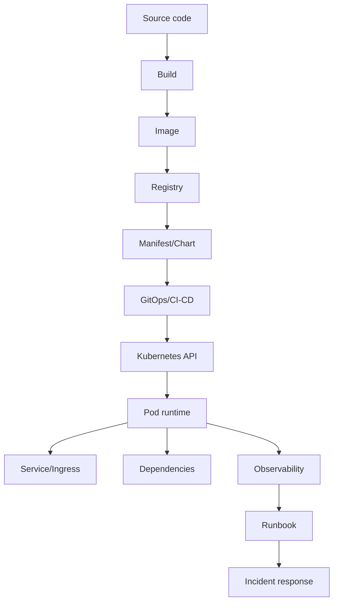

# Part 056 — Production Readiness Review

## 1. Core thesis

Production readiness is not a final checkbox before release.

It is the evidence that a service can survive real production conditions:

```text
traffic
scale
dependency failure
node disruption
rollout
rollback
secret rotation
network policy
cloud identity failure
database pressure
message backlog
observability gaps
operator mistakes
incident response
```

For Docker and Kubernetes, production readiness means the service has a complete operating contract from image to runbook.

The question is not:

```text
Can we deploy it?
```

The better question is:

```text
Can we operate it safely when something goes wrong?
```

---

## 2. Production readiness review scope

A production readiness review should cover:

```text
1. Application runtime
2. Dockerfile
3. Container image
4. Kubernetes workload
5. Probes
6. Resource management
7. Configuration
8. Secrets
9. RBAC and identity
10. NetworkPolicy
11. Service and ingress
12. Storage
13. Autoscaling
14. Observability
15. Deployment strategy
16. Rollback
17. Data migration
18. Dependency behavior
19. Security/privacy/compliance
20. Cost/capacity
21. Runbook
22. Internal ownership
```

Do not review these as isolated topics. Review them as a chain.



A weakness anywhere in the chain can become a production incident.

---

## 3. Readiness evidence, not opinions

A strong review is evidence-based.

Weak statement:

```text
The service should be fine.
```

Strong statement:

```text
The service has 3 replicas, maxUnavailable=0, readiness waits for local startup,
terminationGracePeriodSeconds=60, shutdown test completed, dashboard shows p95 latency,
rollback image exists, and runbook covers ingress 502 and DB pool exhaustion.
```

Production readiness should be supported by:

- manifests
- pipeline output
- scan reports
- rendered Helm/Kustomize output
- dry-run validation
- smoke tests
- load tests where needed
- dashboards
- alert rules
- runbooks
- rollback test
- dependency capacity review
- security review
- incident simulation where appropriate

---

## 4. Application runtime readiness

For Java/JAX-RS services, review the application before Kubernetes details.

### 4.1 Runtime checklist

- Does the service start deterministically?
- Does it fail fast when required config is missing?
- Does it expose health endpoints?
- Does it support graceful shutdown?
- Does it stop accepting traffic/work during shutdown?
- Does it close database pools?
- Does it stop Kafka/RabbitMQ consumers safely?
- Does it handle SIGTERM?
- Does it exit before Kubernetes sends SIGKILL?
- Does it log structured events?
- Does it propagate correlation IDs?
- Does it expose metrics?
- Does it avoid writing to local persistent filesystem unless explicitly designed?

### 4.2 Java-specific checklist

- Is Java 17+ runtime behavior understood?
- Are JVM container memory settings explicit?
- Is heap smaller than container memory limit?
- Is non-heap memory considered?
- Are GC metrics exposed?
- Are thread pools bounded?
- Are HTTP client pools bounded?
- Are DB connection pools bounded?
- Are file descriptor needs understood?
- Is timezone behavior defined?
- Are TLS trust stores managed correctly?
- Are secrets not logged at startup?

---

## 5. Dockerfile readiness

A production Dockerfile should be boring, deterministic, and defensible.

### 5.1 Dockerfile checklist

- Uses a trusted base image.
- Uses a pinned version or digest where required.
- Separates build stage and runtime stage.
- Does not include Maven/Gradle/build tooling in runtime image unless justified.
- Uses dependency cache efficiently.
- Copies only required runtime artifacts.
- Runs as non-root.
- Uses a stable working directory.
- Defines clear entrypoint.
- Does not bake environment-specific config into the image.
- Does not bake secrets into the image.
- Avoids unnecessary packages.
- Exposes only expected ports.
- Supports signal forwarding.
- Uses JVM options through controlled env vars or entrypoint.
- Has image labels if required by governance.

### 5.2 Dockerfile anti-patterns

Avoid:

```dockerfile
FROM openjdk:latest
COPY . .
RUN mvn package
CMD java -jar app.jar
```

Problems:

- unpinned base
- build context too broad
- runtime image includes build artifacts
- cache inefficient
- no non-root user
- no explicit JVM policy
- unknown image size/security posture

---

## 6. Image readiness

### 6.1 Image governance checklist

- Image is built by CI, not manually.
- Image tag is traceable to commit.
- Image digest is captured.
- Image is pushed to approved registry.
- Image vulnerability scan completed.
- Critical/high CVEs triaged according to policy.
- SBOM generated if required.
- License scanning completed if required.
- Image signing/provenance exists if required.
- Image promotion path is documented.
- Image retention policy preserves rollback candidates.
- Image does not contain secrets.
- Image does not contain test data.
- Image does not run as root by default.

### 6.2 Image promotion readiness

A production image should be promoted, not rebuilt differently per environment.

Preferred model:

```text
build once
scan once
sign once
promote same digest across environments
change only config, not artifact
```

If each environment rebuilds the image, reproducibility becomes weaker.

---

## 7. Kubernetes manifest readiness

### 7.1 Workload checklist

- Correct workload type:
  - Deployment for stateless long-running service
  - Job for finite work
  - CronJob for scheduled work
  - StatefulSet only when stable identity/storage is required
- Replicas defined.
- Selector labels stable.
- Pod labels consistent.
- ServiceAccount explicit.
- Resources defined.
- Probes defined.
- Graceful termination configured.
- Config and secrets referenced safely.
- SecurityContext configured.
- NetworkPolicy exists if required.
- PDB exists for availability-sensitive workloads.
- HPA/KEDA exists if scalable.
- Node placement constraints are intentional.
- Rollout strategy is explicit.

### 7.2 Rendered manifest validation

Review the rendered output, not only templates.

For Helm:

```bash
helm template ./chart -f values-prod.yaml > rendered.yaml
```

For Kustomize:

```bash
kubectl kustomize overlays/prod > rendered.yaml
```

Validate:

```bash
kubectl apply --dry-run=server -f rendered.yaml
kubectl diff -f rendered.yaml
```

If GitOps is used, validate what GitOps will apply.

---

## 8. Probe readiness

### 8.1 Probe checklist

- startupProbe exists for slow-starting Java services.
- readinessProbe controls traffic eligibility.
- livenessProbe detects unrecoverable process failure.
- liveness does not check downstream dependencies.
- readiness does not create cascading outage.
- probe endpoints are cheap.
- timeoutSeconds is realistic.
- failureThreshold avoids restart storm.
- periodSeconds is reasonable.
- management port is protected appropriately.
- probe behavior is tested during startup and dependency failure.

### 8.2 Production readiness question

Ask:

```text
If PostgreSQL/Kafka/Redis is down for 2 minutes,
does this probe design keep the system safer or make the outage worse?
```

---

## 9. Graceful shutdown readiness

### 9.1 Shutdown checklist

- Application handles SIGTERM.
- Readiness becomes false before process exits.
- HTTP server stops accepting new requests.
- In-flight requests can complete.
- Background workers stop accepting new tasks.
- Kafka consumers stop polling and commit only completed work.
- RabbitMQ consumers ack/nack correctly.
- Camunda workers finish/fail/extend tasks intentionally.
- DB transactions complete or rollback safely.
- terminationGracePeriodSeconds is longer than p99 shutdown time.
- preStop hook is used only if justified.
- Shutdown tested through actual pod deletion.

### 9.2 Test command

In non-production:

```bash
kubectl delete pod <pod> -n <namespace>
```

Observe:

```text
readiness removal
endpoint removal
ingress behavior
in-flight request behavior
logs
exit time
replacement pod readiness
error rate
```

---

## 10. Resource readiness

### 10.1 Resource checklist

- CPU request set.
- Memory request set.
- Memory limit set if platform requires.
- CPU limit policy intentional.
- JVM heap settings aligned with memory limit.
- Non-heap memory considered.
- Direct memory considered.
- Thread stack memory considered.
- Ephemeral storage considered.
- QoS class understood.
- ResourceQuota and LimitRange compatible.
- Request values based on observed data or load test, not guesswork.
- HPA target compatible with requests.
- DB connection pool compatible with max replicas.

### 10.2 JVM memory review

Container memory is not equal to Java heap.

Memory includes:

```text
heap
metaspace
thread stacks
direct buffers
JIT/code cache
GC structures
native libraries
TLS buffers
application native allocations
```

If memory limit is `2Gi`, do not set heap to `2Gi`.

---

## 11. Configuration readiness

### 11.1 Config checklist

- Required config documented.
- Config source of truth known.
- Environment-specific config isolated.
- ConfigMap values reviewed.
- Helm/Kustomize values reviewed.
- Config validation happens at startup.
- Defaults are safe.
- Production defaults do not point to test systems.
- Config drift is detectable.
- Restart-on-config-change pattern exists if config requires pod restart.
- Runtime config reload behavior is understood.
- Config does not contain secrets.

### 11.2 Dangerous config examples

Avoid:

```text
default database URL points to production
feature flag has no owner
timeout unset and defaults to infinite
retry count defaults to unlimited
consumer group name differs silently by environment
queue name hardcoded
```

---

## 12. Secret readiness

### 12.1 Secret checklist

- Secret source of truth known.
- Secret not stored in plain Git.
- Kubernetes Secret usage approved.
- External Secrets/Sealed Secrets/CSI provider usage understood.
- Secret encrypted at rest where required.
- RBAC limits who can read secrets.
- Secret not exposed through logs.
- Secret not exposed through metrics.
- Secret not printed in env dump.
- Secret rotation process documented.
- Application behavior on rotation understood.
- Secret expiry monitored.
- Cloud workload identity preferred where possible.

### 12.2 Rotation readiness

Ask:

```text
If this password/key rotates today, does the service recover without manual rebuild?
```

If answer is unknown, the service is not fully production-ready.

---

## 13. RBAC and identity readiness

### 13.1 Kubernetes RBAC checklist

- ServiceAccount explicit.
- Default ServiceAccount not used.
- automountServiceAccountToken disabled unless needed.
- Role/RoleBinding scope is minimal.
- ClusterRole avoided unless justified.
- No wildcard permissions unless justified.
- Runtime permissions separated from deploy permissions.
- CI/CD permissions separated from app runtime permissions.
- GitOps controller permissions understood.
- RBAC denied errors observable.

### 13.2 Cloud identity checklist

For AWS/Azure integrations:

- Workload identity mechanism documented.
- ServiceAccount-to-cloud-role mapping reviewed.
- Trust policy/federated credential reviewed.
- Cloud permission least-privilege.
- SDK credential provider chain understood.
- Token audience and issuer correct.
- Audit logs available.
- Credential failure runbook exists.

---

## 14. Network readiness

### 14.1 Service checklist

- Service type correct.
- Selector matches pod labels.
- targetPort correct.
- Named ports used consistently.
- EndpointSlice populated.
- Service DNS name documented.
- Session affinity intentional if used.
- Headless service used only when needed.

### 14.2 Ingress/Gateway checklist

- Public/private exposure intentional.
- Host/path rule correct.
- TLS termination point known.
- Certificate owner known.
- Timeout chain reviewed.
- Body size limit reviewed.
- Rewrite rules tested.
- Forwarded headers handled.
- Source IP behavior understood.
- API Gateway vs Ingress boundary clear.
- 404/502/503/504 debugging path documented.

### 14.3 NetworkPolicy checklist

- Default deny policy exists if platform requires.
- Ingress allowed only from expected callers/gateways.
- Egress allowed only to required dependencies.
- DNS egress allowed.
- PostgreSQL/Kafka/RabbitMQ/Redis egress explicit.
- Cloud service/private endpoint egress explicit.
- Observability egress explicit.
- NetworkPolicy tested in non-prod.

---

## 15. Storage readiness

For stateless Java API, persistent storage is usually not needed.

If storage exists, review carefully.

### 15.1 Storage checklist

- Is persistent storage truly required?
- PVC exists and is owned.
- StorageClass approved.
- Access mode correct.
- Reclaim policy understood.
- Backup requirement defined.
- Restore tested if data is important.
- Volume encryption considered.
- Zone topology understood.
- CSI driver dependency understood.
- HostPath avoided.
- Pod rescheduling behavior tested.
- StatefulSet used only when stable identity/storage is required.

---

## 16. Autoscaling readiness

### 16.1 HPA/KEDA checklist

- Scaling signal matches workload type.
- REST APIs use CPU/request/latency metrics appropriately.
- Kafka consumers consider lag and partitions.
- RabbitMQ consumers consider queue depth/message age.
- Camunda workers consider task backlog and lock behavior.
- minReplicas protects availability.
- maxReplicas respects downstream capacity.
- Scale-down behavior safe for Java cold starts.
- Metrics source reliable.
- HPA/KEDA failures alerted.
- Load or backlog test performed.

### 16.2 Database connection budget

Always calculate:

```text
max DB connections from service = maxReplicas * poolSizePerPod
```

Compare with:

```text
database max connections
other services' connection usage
reserved admin/maintenance connections
connection proxy behavior if used
```

---

## 17. Observability readiness

### 17.1 Minimum observability checklist

- Structured logs.
- Correlation/request ID.
- Metrics endpoint.
- JVM metrics.
- HTTP request metrics.
- Dependency metrics.
- Error rate.
- Latency histogram.
- Kubernetes pod/deployment metrics.
- Kubernetes events visible.
- Traces for critical flows where required.
- Dashboard exists.
- Alerts exist.
- Runbook linked from alert.
- Log volume/cost understood.
- PII/sensitive data not logged.

### 17.2 Workload-specific signals

REST API:

```text
RPS, p95/p99 latency, 4xx/5xx, ingress errors, dependency latency
```

Kafka:

```text
consumer lag, rebalance, commit error, DLQ, processing latency
```

RabbitMQ:

```text
queue depth, message age, ack/nack, redelivery, DLQ
```

Camunda:

```text
task backlog, incident count, lock expiration, task failure
```

Job/CronJob:

```text
last success, duration, failure count, records processed
```

---

## 18. Deployment strategy readiness

### 18.1 Strategy checklist

- Deployment strategy chosen intentionally.
- Rolling update parameters safe.
- maxUnavailable appropriate.
- maxSurge appropriate.
- Readiness protects rollout.
- PDB compatible with rollout and node drain.
- Canary/blue-green used for high-risk changes if available.
- Feature flag/kill switch exists where needed.
- Backward compatibility reviewed.
- Database migration compatibility reviewed.
- Rollback signal defined.
- Blast radius controlled.

### 18.2 Rollout risk questions

Ask:

```text
Can old and new versions run together?
Can old app version read new data?
Can new app version read old data?
Can clients tolerate response shape changes?
Can consumers process old and new message formats?
Can workflow workers handle existing process instances?
```

---

## 19. Rollback readiness

Rollback readiness means more than "kubectl rollout undo".

### 19.1 Rollback checklist

- Previous image still exists in registry.
- Previous image digest known.
- Previous manifest still valid.
- Previous config still available.
- Previous secret version available if needed.
- Database migration is backward compatible or rollback plan exists.
- Message schema compatibility preserved.
- API compatibility preserved.
- Feature flags can disable risky path.
- Rollback command documented.
- Rollback tested in non-prod.
- Rollback owner identified.
- Rollback decision criteria defined.

### 19.2 Rollback blockers

Rollback may fail if:

- old Kubernetes API version removed
- DB schema migration is irreversible
- old image deleted by retention policy
- config changed incompatibly
- secret rotated and old version removed
- external dependency changed
- message format no longer compatible
- CRD/operator version changed

---

## 20. Migration readiness

For services with database changes:

### 20.1 Migration checklist

- Migration separated from app startup unless intentionally designed.
- Migration idempotent.
- Migration backward compatible.
- Migration tested on production-like data volume.
- Locking behavior understood.
- Long-running migration monitored.
- Index creation strategy safe.
- Rollback or forward-fix plan exists.
- App version compatibility reviewed.
- Migration job has resource limits.
- Migration job has activeDeadlineSeconds.
- Migration logs retained.
- Failure alert exists.

### 20.2 Expand-contract pattern

Prefer:

```text
expand schema
deploy compatible app
backfill safely
switch reads/writes
contract old schema later
```

Avoid:

```text
breaking schema migration and app deployment in one irreversible step
```

---

## 21. Dependency readiness

### 21.1 Dependency checklist

For every dependency:

- Is it required for startup?
- Is it required for readiness?
- What timeout is used?
- What retry policy is used?
- Is retry bounded?
- Is jitter used?
- Is circuit breaker used?
- Is fallback available?
- Is failure visible?
- Is downstream capacity known?
- Is dependency private endpoint/DNS path understood?
- Is TLS trust configured?
- Is credential rotation understood?

Dependencies include:

- PostgreSQL
- Kafka
- RabbitMQ
- Redis
- Camunda
- NGINX/ingress/API gateway
- AWS services
- Azure services
- internal REST APIs
- external partner APIs
- secret manager
- observability backends

---

## 22. Security readiness

### 22.1 Container runtime security

- Runs non-root.
- No privileged mode.
- No hostNetwork unless justified.
- No hostPID/hostIPC unless justified.
- No HostPath unless justified.
- Capabilities dropped.
- readOnlyRootFilesystem where possible.
- seccomp RuntimeDefault where possible.
- allowPrivilegeEscalation false.
- trusted registry only.
- no `latest` tag in production.
- image scanned.

### 22.2 Application security

- Secrets not logged.
- PII not logged.
- AuthN/AuthZ boundaries clear.
- TLS requirements met.
- Input validation implemented.
- Dependency CVEs triaged.
- Audit events emitted where required.
- Sensitive config protected.
- Error messages do not leak internals.

---

## 23. Privacy and compliance readiness

### 23.1 Privacy checklist

- Does service process PII?
- Is data classification labeled?
- Are logs free of PII/secrets?
- Are traces free of sensitive payloads?
- Are metrics labels free of high-cardinality sensitive data?
- Are data retention requirements known?
- Are audit logs available?
- Is access to logs restricted?
- Is incident traceability sufficient?
- Are compliance evidence artifacts retained?

### 23.2 Compliance evidence

Useful evidence:

- image scan report
- SBOM
- deployment approval
- change ticket if applicable
- test result
- security review
- access review
- audit log
- runbook
- rollback plan
- monitoring dashboard
- incident response owner

---

## 24. Cost and capacity readiness

### 24.1 Cost checklist

- Resource requests based on data.
- HPA maxReplicas justified.
- Node capacity impact understood.
- Storage size justified.
- Load balancer count justified.
- NAT/egress path understood.
- Logging volume estimated.
- Metrics cardinality reviewed.
- Tracing sampling configured.
- Multi-AZ cost understood.
- Owner/cost-center labels present.
- Ephemeral environments cleaned up.

### 24.2 Capacity checklist

- Peak traffic estimate known.
- Dependency capacity known.
- DB connection budget known.
- Kafka/RabbitMQ partition/queue capacity known.
- Redis memory/connection capacity known.
- Node pool capacity known.
- Autoscaler limits known.
- Regional/zone constraints known.
- Load test performed if risk warrants.

---

## 25. Runbook readiness

A service is not production-ready if nobody knows what to do when it fails.

### 25.1 Required runbook sections

```text
1. Service purpose
2. Owner team
3. Escalation path
4. Architecture diagram
5. Traffic flow
6. Dependencies
7. Dashboards
8. Alerts
9. Common failure modes
10. Debug commands
11. Rollback procedure
12. Config/secret rotation notes
13. Scaling notes
14. Known limitations
15. Customer impact mapping
```

### 25.2 Common runbook entries

Include:

- pod crash
- OOMKilled
- readiness failure
- ingress 502/503/504
- DNS failure
- DB connection exhaustion
- Kafka lag
- RabbitMQ queue buildup
- Redis timeout
- Camunda task backlog
- cloud credential failure
- private endpoint unreachable
- secret rotation failure
- rollout stuck
- rollback procedure

---

## 26. Production readiness scoring model

A simple model:

```text
Green:
  evidence exists, tested, owner known

Yellow:
  partially ready, risk accepted with mitigation

Red:
  missing, unknown, untested, or no owner
```

Example review matrix:

| Area | Status | Evidence | Owner | Risk |
|---|---|---|---|---|
| Image scan | Green | CI scan report | Platform/App | Low |
| Readiness probe | Green | Non-prod test | App | Low |
| Graceful shutdown | Yellow | Code exists, pod-delete test missing | App | Medium |
| DB migration rollback | Red | No rollback plan | Backend | High |
| NetworkPolicy | Yellow | Draft exists, not tested | Platform/App | Medium |
| Runbook | Red | Missing | App | High |

Red items should either block production or require explicit risk acceptance.

---

## 27. Go/no-go criteria

### 27.1 Example go criteria

```text
- image built by CI and scanned
- manifests validated against target cluster
- resources/probes configured
- readiness and shutdown tested
- config/secrets reviewed
- RBAC least privilege reviewed
- ingress/service path tested
- dependency connectivity tested
- observability dashboard exists
- alerts configured
- rollback path documented
- runbook complete
- owner and escalation path known
```

### 27.2 Example no-go criteria

```text
- no owner
- no rollback plan
- no readiness probe for traffic-serving service
- liveness checks downstream dependencies
- no resource requests
- app runs as root without exception
- secrets stored in Git
- DB migration irreversible and untested
- no dashboard or alert for customer-facing path
- service has public ingress without security review
- consumer processing not idempotent
- unknown behavior on SIGTERM
```

---

## 28. Production readiness review meeting structure

A productive review should be structured.

```text
1. Service overview
2. Workload type
3. Traffic and dependency map
4. Deployment artifact
5. Runtime and probes
6. Resource and scaling model
7. Security and identity
8. Network and ingress
9. Observability and alerts
10. Rollout and rollback
11. Runbook
12. Open risks
13. Go/no-go decision
```

Avoid turning the review into a line-by-line YAML reading. Use YAML as evidence, not as the agenda.

---

## 29. Internal verification checklist

Use this inside CSG/team context.

### Ownership

- Who owns the service?
- Who owns deployment?
- Who owns runtime incidents?
- Who owns dependency incidents?
- Who approves production release?
- Where is escalation documented?

### Artifact

- Where is Dockerfile?
- Where is CI pipeline?
- Where is image registry?
- What is tag/digest strategy?
- Are scan reports available?
- Is SBOM required?
- Is image signing required?

### Kubernetes

- Where are manifests/Helm charts/Kustomize overlays?
- Which namespace is used?
- Which cluster/environment is target?
- Is GitOps used?
- Which controller applies changes?
- Are rendered manifests reviewed?

### Runtime

- What Java version?
- What JVM options?
- What framework/server runtime?
- What ports?
- What health endpoints?
- How is graceful shutdown implemented?
- What is termination grace?

### Dependencies

- Which PostgreSQL database?
- Which Kafka topics/consumer groups?
- Which RabbitMQ queues?
- Which Redis instance?
- Which Camunda/process dependencies?
- Which NGINX/ingress/API gateway path?
- Which AWS/Azure services?
- Which private endpoints?

### Security

- What ServiceAccount?
- What RBAC?
- What cloud identity?
- Where are secrets sourced?
- What NetworkPolicies?
- What Pod Security standard?
- Are logs free of PII/secrets?
- Is TLS configured?

### Observability

- Where are logs?
- Where are metrics?
- Where are traces?
- Which dashboard?
- Which alerts?
- What SLO/SLA exists?
- Are Kubernetes events monitored?

### Operations

- Where is runbook?
- What is rollback command?
- What is deployment strategy?
- What is incident severity mapping?
- What is customer impact checklist?
- What post-release monitoring window exists?

---

## 30. PR review checklist

When reviewing production-readiness changes, ask:

### Image

- Is image immutable and traceable?
- Is base image trusted?
- Is scan clean or triaged?
- Is runtime image minimal?
- Does image run non-root?

### Workload

- Is workload type correct?
- Are labels/selectors stable?
- Are resources set?
- Are probes correct?
- Is shutdown safe?
- Is rollout strategy safe?

### Network

- Is Service correct?
- Is Ingress/Gateway correct?
- Is DNS understood?
- Are timeouts aligned?
- Are NetworkPolicies present?
- Are private endpoints reachable?

### Security

- Are secrets safe?
- Is RBAC least privilege?
- Is cloud identity correct?
- Is pod security hardened?
- Is public exposure reviewed?
- Is audit evidence available?

### Operations

- Is observability complete?
- Are alerts useful?
- Is runbook complete?
- Is rollback possible?
- Are migrations safe?
- Are capacity/cost impacts understood?

---

## 31. Failure-oriented readiness questions

Ask these before production:

```text
What happens if the pod is killed mid-request?
What happens if Kafka rebalance occurs during processing?
What happens if RabbitMQ redelivers the same message?
What happens if PostgreSQL fails over?
What happens if Redis times out?
What happens if the secret rotates?
What happens if DNS resolution fails?
What happens if ingress returns 503?
What happens if HPA scales to max replicas?
What happens if DB connections are exhausted?
What happens if node drain happens during peak traffic?
What happens if rollback is needed after a DB migration?
What happens if logs are needed for an audit?
```

If the answer is "unknown", production readiness is incomplete.

---

## 32. Anti-patterns

Avoid:

```text
- production readiness as a meeting without evidence
- relying on "it worked in dev"
- no rendered manifest review
- no shutdown test
- no rollback test
- no resource data
- no dependency capacity review
- no owner labels
- no runbook
- no alert for customer-facing service
- treating consumers like REST APIs
- treating Jobs like Deployments
- baking config into image
- storing secrets in Git
- liveness probe checks database
- readiness always returns true
- HPA max replicas ignores DB capacity
- production image different from tested image
```

---

## 33. Senior engineer heuristics

Use these heuristics:

```text
If it cannot be observed, it cannot be operated.
If it cannot be rolled back, it must be released more carefully.
If it cannot shut down gracefully, it cannot roll out safely.
If dependency failure behavior is unknown, the service is not resilient.
If DB connection math is missing, autoscaling is unsafe.
If secrets cannot rotate, credentials are operational debt.
If the runbook is missing, incident response depends on memory.
If ownership is unclear, recovery will be slow.
```

---

## 34. Final production readiness map

A production-ready Java/JAX-RS service on Kubernetes has:

```text
trusted image
secure runtime
explicit JVM sizing
safe probes
safe shutdown
bounded resources
validated config
protected secrets
least-privilege identity
explicit network policy
correct ingress/service routing
dependency timeouts and retries
safe migration strategy
workload-aware autoscaling
complete observability
tested rollback
usable runbook
clear ownership
```

Production readiness is not perfection.

It is the disciplined reduction of unknowns before customers discover them.

---

## 35. Key takeaway

Production readiness is the point where application engineering, platform engineering, security, and operations meet.

For a senior backend engineer, the job is to connect code-level behavior to platform-level failure modes:

```text
JAX-RS endpoint -> ingress timeout
JVM heap -> Kubernetes memory limit
consumer ack -> pod termination
DB pool -> HPA max replicas
secret rotation -> runtime reload
Service selector -> EndpointSlice
NetworkPolicy -> dependency reachability
dashboard -> incident recovery
runbook -> production confidence
```

A service is ready for production when the team can explain, prove, monitor, and operate these connections.
