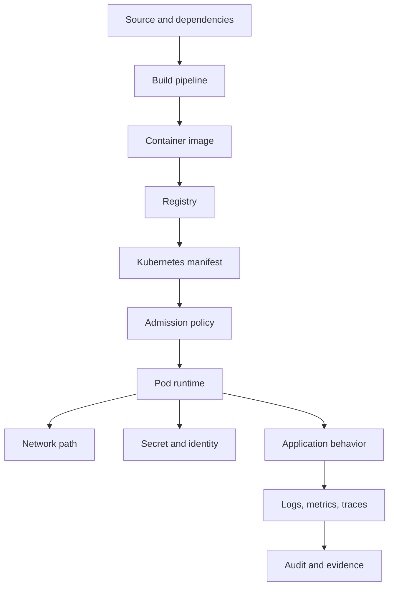

# Part 057 — Security, Privacy, and Compliance Review

## 1. Core thesis

Security review for Docker and Kubernetes is not only about scanning images.

It is about proving that a workload is safe across the full production path:

```text
source code
build pipeline
container image
registry
deployment manifest
Kubernetes admission
pod runtime
network path
secret access
cloud identity
application logs
audit trail
incident evidence
```

For enterprise Java/JAX-RS systems, the security review must connect platform configuration to application behavior.

A secure manifest is not enough if the app logs secrets.

A clean image scan is not enough if the pod runs as root with broad RBAC.

A private endpoint is not enough if DNS, TLS trust, and IAM are misconfigured.

A compliance report is not enough if the team cannot reconstruct who deployed what, when, with which artifact, and what data it touched.

---

## 2. Security review mental model

Think in layers:



Each layer asks a different question.

| Layer | Main question |
|---|---|
| Source | Are dependencies and code safe? |
| Build | Can build secrets or artifacts be tampered with? |
| Image | Is the runtime artifact trusted and scanned? |
| Registry | Can only approved artifacts be pulled? |
| Manifest | Does the workload request safe privileges? |
| Admission | Are unsafe objects blocked before runtime? |
| Runtime | Can the container escape or overreach? |
| Network | Can the pod talk only to what it needs? |
| Identity | Does the pod have least-privilege access? |
| Logs | Is sensitive data protected? |
| Audit | Can we prove what happened? |

---

## 3. Security categories

A complete review covers at least:

```text
image security
dependency security
build security
registry security
runtime security
pod security
RBAC security
secret security
network security
ingress security
TLS security
cloud IAM security
application security
privacy
auditability
incident traceability
compliance evidence
```

Do not collapse these into a single "security approved" checkbox.

---

## 4. Image security review

### 4.1 Image checklist

Review:

- base image source
- base image version
- image digest
- runtime packages
- unnecessary tools
- known CVEs
- vulnerability severity
- exploitability
- patch plan
- SBOM
- license scanning
- image signature
- provenance
- build timestamp
- commit traceability
- secret leakage
- root user
- file permissions

### 4.2 Base image risk

Base image choice affects:

- attack surface
- patch cadence
- glibc/musl compatibility
- CA certificates
- timezone behavior
- shell availability
- debugging capability
- vulnerability count
- operational familiarity

Common options:

```text
Debian/Ubuntu slim:
  more familiar, more packages, larger attack surface

Distroless:
  smaller runtime, less shell/debug tooling, stronger minimalism

Alpine:
  small, musl-based, can surprise Java/native dependencies

Enterprise base image:
  may align with internal security patching and support model
```

### 4.3 Image scan triage

A scan result is not a decision by itself.

Ask:

- Is the vulnerable package present in the runtime layer?
- Is the vulnerable code reachable?
- Is a fixed version available?
- Is the vulnerable component inherited from base image?
- Is this a false positive?
- Is there a compensating control?
- What is the remediation SLA?
- Is production blocked by policy?

### 4.4 Image anti-patterns

Avoid:

```text
- latest tag in production
- untrusted public base image without review
- build tools in runtime image
- package managers left in runtime image without need
- shell/curl/wget included without reason
- root user
- secrets copied during build
- environment-specific image rebuilds
- no scan evidence
- no digest traceability
```

---

## 5. Dependency and SCA review

Java services depend on:

- direct Maven/Gradle dependencies
- transitive dependencies
- application server/runtime libraries
- JAX-RS implementation libraries
- database drivers
- Kafka/RabbitMQ clients
- Redis clients
- cloud SDKs
- logging libraries
- serialization libraries
- security libraries
- test dependencies that may accidentally enter runtime

### 5.1 SCA checklist

- Are dependencies locked or controlled?
- Are transitive dependencies reviewed?
- Are known vulnerable libraries triaged?
- Are critical libraries updated promptly?
- Are dependency conflicts visible?
- Are unused dependencies removed?
- Are test-only dependencies excluded from runtime?
- Are licenses compliant with policy?
- Is dependency update ownership clear?

### 5.2 Java-specific risk examples

High-risk categories:

```text
serialization libraries
expression language engines
template engines
logging frameworks
XML parsers
HTTP clients
cloud SDKs
database drivers
security/auth libraries
```

These categories frequently sit near untrusted input, credentials, or network boundaries.

---

## 6. Build pipeline security

The build pipeline can leak or tamper with production artifacts.

### 6.1 Build security checklist

- CI runner is trusted.
- Build environment is isolated.
- Docker socket exposure is controlled.
- Build secrets are not written to layers.
- Build logs do not expose secrets.
- Dependency download sources are approved.
- Artifact is built from reviewed source.
- Build is reproducible enough for audit.
- Image digest is captured.
- SBOM is generated if required.
- Image signing/provenance is applied if required.
- CI credentials are least privilege.
- Pipeline cannot push arbitrary production tags from untrusted branches.

### 6.2 Docker socket risk

Mounting Docker socket into CI jobs can grant host-level control.

Risk:

```text
container with docker.sock access
  -> starts privileged sibling container
  -> mounts host filesystem
  -> steals credentials
  -> tampers with build artifacts
```

Senior review question:

> Does the CI build method expose the container runtime control socket to untrusted build steps?

---

## 7. Registry security

The registry is the artifact trust boundary.

### 7.1 Registry checklist

- Approved registry used.
- Authentication required.
- Push permission restricted.
- Pull permission scoped.
- Immutable tags enabled where possible.
- Digest pinning supported.
- Vulnerability scanning enabled.
- Retention policy preserves rollback images.
- Cross-region replication if required.
- Audit logs available.
- Public exposure controlled.
- Image deletion protected for production releases.
- Pull secret or cloud identity configured safely.

### 7.2 Registry failure as security issue

If teams bypass approved registry during outage, they may pull untrusted images.

A registry outage runbook should avoid:

```text
temporarily pulling from random public image
rebuilding unscanned image manually
using developer laptop image
pushing directly to production repo without CI
```

---

## 8. Runtime and pod security review

### 8.1 Pod Security checklist

Review the pod spec for:

- `runAsNonRoot`
- `runAsUser`
- `runAsGroup`
- `fsGroup`
- `readOnlyRootFilesystem`
- `allowPrivilegeEscalation`
- dropped capabilities
- added capabilities
- seccomp profile
- AppArmor/SELinux where applicable
- privileged mode
- hostNetwork
- hostPID
- hostIPC
- HostPath volumes
- unsafe sysctls
- writable root filesystem
- service account token automount
- image pull policy
- trusted registry

Example security context shape:

```yaml
securityContext:
  runAsNonRoot: true
  allowPrivilegeEscalation: false
  readOnlyRootFilesystem: true
  capabilities:
    drop:
      - ALL
  seccompProfile:
    type: RuntimeDefault
```

This is a shape, not a universal prescription. Some workloads need controlled exceptions.

### 8.2 Runtime write paths

If using `readOnlyRootFilesystem`, Java apps still need write paths for:

- temporary files
- embedded server temp files
- file uploads if supported
- heap dumps if enabled
- GC logs if written to file
- application temp directories

Use explicit writable volumes:

```yaml
volumes:
  - name: tmp
    emptyDir: {}
```

Mount:

```yaml
volumeMounts:
  - name: tmp
    mountPath: /tmp
```

Review whether `/tmp` contents can contain sensitive data.

---

## 9. RBAC security review

RBAC controls Kubernetes API access.

Most application pods do not need Kubernetes API access.

### 9.1 RBAC checklist

- Does the workload need Kubernetes API access?
- Is ServiceAccount explicit?
- Is default ServiceAccount avoided?
- Is token automount disabled unless needed?
- Are Roles namespace-scoped where possible?
- Are ClusterRoles justified?
- Are wildcard verbs/resources avoided?
- Can the pod read Secrets?
- Can the pod list pods/services/endpoints?
- Can the pod create/modify workloads?
- Are CI/CD permissions separated?
- Are GitOps permissions separated?
- Are admin permissions audited?

### 9.2 Dangerous permissions

High-risk permissions include:

```text
secrets get/list/watch
pods exec
pods portforward
deployments update
roles create/update
rolebindings create/update
clusterroles create/update
clusterrolebindings create/update
serviceaccounts/token create
```

These can enable privilege escalation or data exposure.

### 9.3 ServiceAccount token review

If a pod does not call Kubernetes API, consider:

```yaml
automountServiceAccountToken: false
```

If it does call the API, review:

- token audience
- token expiration
- API permissions
- logs exposing token paths
- library behavior
- projected token usage

---

## 10. Secret security review

Secrets are one of the highest-risk areas.

### 10.1 Secret checklist

- Secret source of truth identified.
- Secret not stored in plain Git.
- Secret not baked into image.
- Secret not printed in logs.
- Secret not exposed in metrics/traces.
- Secret not included in crash dumps.
- Secret access is least privilege.
- Secret encrypted at rest where required.
- Secret synced through approved controller/tool.
- Secret rotation process exists.
- Rotation tested.
- Application can reload or restart safely after rotation.
- Secret expiry monitored.
- Break-glass access audited.

### 10.2 Kubernetes Secret misconception

A Kubernetes Secret value is commonly base64-encoded in manifest representation.

Base64 is not encryption.

If secret manifests are stored in Git without encryption, they are exposed.

### 10.3 Env var vs volume

Secret as environment variable:

Pros:

- simple
- widely supported

Cons:

- visible in process environment
- may appear in debug dumps
- requires restart to change
- often accidentally logged

Secret as mounted file:

Pros:

- easier rotation in some patterns
- less likely to appear in env dumps
- can be read on demand

Cons:

- application must support file-based config
- file permissions must be reviewed
- reload behavior must be designed

### 10.4 Secret leakage review

Search for:

```text
password
passwd
secret
token
apikey
api_key
authorization
bearer
client_secret
connection string
jdbc
```

Review:

- application startup logs
- exception logs
- debug endpoints
- config dump endpoints
- metrics labels
- trace attributes
- support bundles
- heap dumps
- crash dumps

---

## 11. Cloud IAM and workload identity review

Cloud identity controls access to AWS/Azure services from pods.

### 11.1 AWS-style review

For AWS/EKS-like environments, verify:

- ServiceAccount annotation or pod identity binding
- OIDC provider/trust relationship
- IAM role permissions
- resource ARNs scoped
- STS AssumeRoleWithWebIdentity behavior
- AWS SDK credential chain
- token audience
- CloudTrail auditability
- permission boundary
- VPC endpoint policy if used
- Secrets Manager/KMS/S3/SQS/SNS/DynamoDB/RDS/etc access scope

### 11.2 Azure-style review

For Azure/AKS-like environments, verify:

- Workload Identity setup
- federated credential
- Managed Identity if used
- Azure RBAC role assignments
- Azure SDK credential chain
- token audience/issuer
- Key Vault access policy/RBAC
- Storage/Service Bus/Event Hubs/etc scope
- Private Endpoint and Private DNS
- Azure activity logs

### 11.3 Cloud IAM anti-patterns

Avoid:

```text
- static cloud access keys in Kubernetes Secrets
- broad wildcard cloud permissions
- shared role across unrelated workloads
- production and non-production using same role
- no audit trail for cloud API calls
- role can access all secrets/buckets/resources
- SDK silently falling back to unexpected credential source
```

---

## 12. Network security review

Network security covers east-west and north-south traffic.

### 12.1 NetworkPolicy checklist

- Is NetworkPolicy enforced by the CNI?
- Is default deny used?
- Is DNS egress allowed explicitly?
- Are database egress rules explicit?
- Are Kafka/RabbitMQ/Redis egress rules explicit?
- Are cloud service egress rules explicit?
- Are private endpoint CIDRs or DNS paths understood?
- Are ingress callers explicit?
- Are namespace selectors stable?
- Are pod selectors stable?
- Are observability egress rules explicit?
- Are policy exceptions documented?

### 12.2 Egress risk

Uncontrolled egress can allow:

- data exfiltration
- accidental calls to public endpoints
- bypass of private endpoints
- dependency on internet access
- leakage to unapproved third-party APIs

Senior review question:

> Can this pod send data anywhere on the internet?

If yes, is that intentional and monitored?

---

## 13. Ingress and edge security review

Ingress is a public or semi-public boundary.

### 13.1 Ingress checklist

- Is exposure public, private, partner-facing, or internal?
- Is IngressClass/GatewayClass approved?
- Is DNS ownership clear?
- Is TLS termination point clear?
- Is certificate source approved?
- Is minimum TLS policy defined?
- Are host/path rules correct?
- Are wildcard hosts avoided or justified?
- Are rewrite rules safe?
- Are forwarded headers trusted correctly?
- Is client IP handling correct?
- Is authn/authz handled at correct layer?
- Is WAF/API gateway/front door involved?
- Are rate limits needed?
- Are request body limits defined?
- Are timeouts safe?
- Are ingress annotations approved?

### 13.2 Forwarded header risk

Java services behind proxies often use:

```text
X-Forwarded-For
X-Forwarded-Proto
X-Forwarded-Host
Forwarded
```

Risk:

- trusting spoofed headers from untrusted clients
- generating wrong redirect URLs
- logging wrong client IP
- bypassing scheme/host checks
- auth redirect issues

Only trusted proxy layers should set/forward these headers.

---

## 14. TLS and certificate review

### 14.1 TLS checklist

- Where is TLS terminated?
- Is there TLS from client to load balancer?
- Is there TLS from ingress to service?
- Is mTLS used internally?
- Who owns certificate issuance?
- Who owns renewal?
- Is certificate expiry monitored?
- Are private CAs used?
- Is Java trust store configured?
- Are weak protocols/ciphers disabled according to policy?
- Are external partner certificates tracked?
- Are certificate rotations tested?

### 14.2 Java trust store risk

Java may use:

- JVM default trust store
- custom trust store
- container OS CA bundle
- application-configured trust store

Misalignment can break:

- cloud API calls
- private endpoint calls
- internal service calls
- database TLS
- Kafka TLS
- RabbitMQ TLS
- Redis TLS
- partner integrations

---

## 15. Application security review

Container/platform security does not replace application security.

For JAX-RS APIs, review:

- authentication
- authorization
- input validation
- output encoding
- request size limits
- path traversal
- unsafe deserialization
- SSRF risk
- SQL injection
- command injection
- insecure error messages
- dependency CVEs
- insecure debug endpoints
- admin endpoints exposure
- CORS policy
- rate limiting
- audit logging

### 15.1 SSRF in Kubernetes context

SSRF can be more dangerous from a pod because the pod may reach:

- Kubernetes service DNS
- internal services
- cloud metadata endpoints
- private endpoints
- secret managers
- internal admin endpoints

Mitigations:

- strict outbound allowlist
- NetworkPolicy
- cloud metadata protections
- URL validation
- no arbitrary server-side fetch
- egress proxy policy
- deny link-local metadata access where appropriate

---

## 16. Privacy review

Privacy review asks what sensitive data can appear where.

### 16.1 Sensitive data surfaces

Sensitive data may appear in:

- request body
- response body
- logs
- error messages
- traces
- metrics labels
- event payloads
- message broker payloads
- database rows
- cache entries
- object storage
- dead-letter queues
- debug dumps
- heap dumps
- support bundles
- audit logs

### 16.2 PII in logs

Logs should avoid:

```text
customer name
email address
phone number
address
national ID
payment details
raw tokens
authorization headers
session IDs
order payloads if sensitive
quote payloads if sensitive
full request/response bodies
```

Use:

- correlation ID
- stable non-sensitive identifiers where approved
- hashed identifiers if policy allows
- structured error codes
- business event IDs
- redaction

### 16.3 Metrics cardinality and privacy

Never put sensitive or high-cardinality values in metric labels.

Bad:

```text
http_requests_total{customerEmail="alice@example.com"}
```

Better:

```text
http_requests_total{route="/quotes/{id}", status="200"}
```

High-cardinality labels can also create observability cost explosions.

---

## 17. Auditability review

Auditability is the ability to reconstruct what happened.

### 17.1 Deployment audit

Can you answer:

- Which commit produced this pod?
- Which image digest is running?
- Who approved the deployment?
- Which pipeline ran?
- Which environment received it?
- Which manifest version was applied?
- Which config version was used?
- Which secret version was active?
- Was rollback performed?
- Who performed manual changes?

### 17.2 Runtime audit

Can you answer:

- Which user/service called this API?
- Which request ID maps to logs/traces?
- Which pod handled the request?
- Which downstream services were called?
- Which database changes occurred?
- Which message was consumed/published?
- Which cloud API was called?
- Which identity was used?

### 17.3 Kubernetes audit

If required, verify:

- API server audit logs
- cloud control plane audit logs
- IAM activity logs
- GitOps controller logs
- CI/CD audit logs
- registry audit logs
- secret manager audit logs

---

## 18. Compliance evidence

Compliance evidence should be durable and retrievable.

Examples:

```text
image scan reports
SBOM
license scan report
dependency scan report
approval record
change ticket
PR review
security exception approval
policy violation report
deployment history
GitOps sync history
audit logs
access reviews
runbooks
incident reports
postmortems
backup/restore test evidence
secret rotation evidence
certificate renewal evidence
```

Evidence should be attached to the release or discoverable by service/version.

---

## 19. Incident traceability

Security incidents require traceability.

Review whether the team can trace:

```text
external request
  -> load balancer/ingress log
  -> service log
  -> trace ID
  -> pod name
  -> image digest
  -> Kubernetes deployment revision
  -> application version
  -> downstream calls
  -> database transaction/event
  -> message broker event
  -> cloud API call
```

If traceability breaks halfway, incident investigation slows.

---

## 20. Security review for PostgreSQL/Kafka/RabbitMQ/Redis/Camunda

### 20.1 PostgreSQL

Review:

- TLS
- credential rotation
- least-privilege DB user
- connection string secrecy
- migration permission separation
- audit logging
- PII handling
- backup encryption
- restore access
- network path
- query logging sensitivity

### 20.2 Kafka

Review:

- TLS/SASL
- topic ACLs
- consumer group ACLs
- payload sensitivity
- DLQ retention
- schema compatibility
- auditability of producers/consumers
- broker endpoint exposure
- secret rotation

### 20.3 RabbitMQ

Review:

- TLS
- vhost permissions
- queue/exchange permissions
- management UI exposure
- DLQ payload sensitivity
- credential rotation
- network restriction
- message retention

### 20.4 Redis

Review:

- TLS
- auth/ACL
- network restriction
- key naming
- PII in cache
- persistence mode
- eviction policy
- lock correctness
- credential rotation

### 20.5 Camunda-like workflow systems

Review:

- workflow data sensitivity
- task payload redaction
- worker identity
- retry/incident visibility
- audit trail
- process history retention
- access control
- database encryption
- operator/admin UI exposure

---

## 21. EKS-specific security review

Internal verification checklist:

- Is IRSA or Pod Identity used instead of static AWS keys?
- Are IAM roles least privilege?
- Is the OIDC trust policy scoped to namespace and ServiceAccount?
- Are ECR repositories access-controlled?
- Are ECR scans enabled if used?
- Are Security Groups scoped?
- Are security groups for pods used, if applicable?
- Are VPC endpoints used for private AWS service access?
- Are endpoint policies restricted?
- Are CloudTrail logs available?
- Are CloudWatch logs protected?
- Is Secrets Manager/KMS access scoped?
- Are ALB/NLB security groups reviewed?
- Are public subnets and private subnets used intentionally?
- Are node roles over-permissive?
- Are add-ons managed and patched?

---

## 22. AKS-specific security review

Internal verification checklist:

- Is Azure Workload Identity used instead of static secrets where possible?
- Are Managed Identity assignments scoped?
- Are Azure RBAC roles least privilege?
- Is ACR access restricted?
- Is Key Vault access scoped?
- Is Key Vault CSI driver configured safely if used?
- Are Private Endpoints used where required?
- Are Private DNS Zones correct?
- Are NSGs and UDRs reviewed?
- Are Azure Monitor/Log Analytics access controls reviewed?
- Are Application Gateway/AGIC permissions scoped?
- Is Azure Policy used?
- Are public endpoints intentional?
- Are node pool identities over-permissive?
- Are add-ons patched?

---

## 23. On-prem/hybrid security review

Internal verification checklist:

- Who owns cluster control plane security?
- Is etcd encrypted and backed up?
- Who has cluster-admin?
- How are certificates issued and renewed?
- How is internal registry secured?
- Are images scanned in air-gapped flow?
- How are secrets managed without cloud secret manager?
- Are firewall rules documented?
- Is egress restricted?
- Is proxy behavior audited?
- Is hybrid DNS secure?
- Is private CA trusted by Java workloads?
- Are VPN/Direct Connect/ExpressRoute paths monitored?
- Are logs centralized?
- Are audit logs retained?

---

## 24. Security exception management

Sometimes exceptions are necessary.

Examples:

- temporary root filesystem write
- extra capability for a specific agent
- broader egress for legacy integration
- old base image until vendor patch
- HostPath for node-level DaemonSet
- privileged mode for infrastructure component

Every exception should include:

```text
policy violated
reason
scope
owner
expiration date
risk
compensating control
remediation plan
approval
```

An exception without expiry becomes a new standard by accident.

---

## 25. Security and privacy PR review checklist

### Image and supply chain

- Is image from trusted registry?
- Is tag immutable or digest captured?
- Is image scanned?
- Are CVEs triaged?
- Is SBOM available if required?
- Is image signed if required?
- Are build secrets protected?

### Runtime

- Does pod run non-root?
- Are capabilities dropped?
- Is privilege escalation disabled?
- Is privileged mode avoided?
- Is host access avoided?
- Is root filesystem read-only where possible?
- Is ServiceAccount token automount disabled if unused?

### RBAC and identity

- Is ServiceAccount explicit?
- Is Kubernetes RBAC least privilege?
- Is cloud IAM least privilege?
- Are static credentials avoided?
- Are audit logs available?

### Secrets

- Are secrets sourced from approved system?
- Are secrets encrypted at rest?
- Are secrets not in Git?
- Are secrets not logged?
- Is rotation documented?

### Network

- Is ingress exposure intentional?
- Is TLS configured?
- Are NetworkPolicies explicit?
- Is egress restricted?
- Are private endpoints used where required?
- Are DNS and trust paths reviewed?

### Privacy

- Is PII processed?
- Is PII excluded from logs/metrics/traces?
- Are DLQs and caches reviewed for sensitive payloads?
- Is data retention understood?

### Compliance

- Is evidence captured?
- Is audit trail complete?
- Are exceptions approved?
- Is runbook available?
- Is incident traceability sufficient?

---

## 26. Failure modes

### 26.1 Secret leaked in logs

Symptoms:

- credential appears in startup log
- config dump includes token
- exception includes connection string
- trace attribute includes authorization header

Mitigation:

- rotate secret immediately
- remove log exposure
- purge/redact logs if policy supports
- audit access
- add tests/redaction rules
- update runbook

### 26.2 Over-permissive ServiceAccount

Symptoms:

- workload can read secrets unexpectedly
- attacker with pod access escalates
- audit finding
- policy violation

Mitigation:

- remove unused token
- scope Role
- avoid ClusterRole
- audit usage
- rotate affected secrets if needed

### 26.3 Public ingress accidentally exposed

Symptoms:

- internal route reachable publicly
- unexpected DNS/LB exposure
- security scan alert

Mitigation:

- remove ingress or change class
- restrict source
- add auth/WAF if needed
- review DNS/LB
- audit access logs
- add policy to prevent recurrence

### 26.4 PII in metrics labels

Symptoms:

- observability cost spike
- sensitive values in metric backend
- compliance issue

Mitigation:

- remove label
- drop metric series
- apply relabeling/filtering
- review retention
- update instrumentation standard

### 26.5 Cloud IAM too broad

Symptoms:

- pod can access unrelated secrets/buckets/resources
- audit finding
- blast radius too large

Mitigation:

- scope permissions
- separate roles per workload
- update trust policy
- audit cloud API calls
- rotate credentials if static keys used

---

## 27. Production-safe security debugging

Do:

```text
preserve evidence
avoid deleting pods before logs/events collected
capture image digest
capture ServiceAccount and RBAC
capture NetworkPolicy state
capture ingress/LB logs
capture cloud audit logs
coordinate with security team
rotate secrets through approved process
document timeline
```

Avoid:

```text
printing secrets to debug
execing into production pod and dumping env broadly
disabling NetworkPolicy globally
granting cluster-admin temporarily without audit
editing GitOps-managed resources manually without record
deleting evidence before incident review
```

---

## 28. Internal verification checklist

Use this inside CSG/team context.

### Security ownership

- Who approves security exceptions?
- Who owns container image policy?
- Who owns Kubernetes policy?
- Who owns cloud IAM review?
- Who owns privacy review?
- Who owns compliance evidence?

### Image and pipeline

- Which scanners are used?
- Is SBOM required?
- Is image signing required?
- Are trusted registries enforced?
- Are build secrets protected?
- Are CI runners isolated?
- Is Docker socket exposure allowed?

### Runtime and pod

- Are Pod Security Standards enforced?
- Is OPA Gatekeeper or Kyverno used?
- Are root containers blocked?
- Are privileged pods blocked?
- Are HostPath volumes blocked?
- Are capabilities restricted?
- Are runtime security tools used?

### RBAC and identity

- Are ServiceAccounts standardized?
- Is automount disabled by default?
- Are ClusterRoles reviewed?
- Is IRSA/Azure Workload Identity used?
- Are static cloud keys forbidden?
- Are cloud roles scoped per workload?

### Secrets

- What is the approved secret manager?
- Are Kubernetes Secrets encrypted at rest?
- Are secrets allowed in Git?
- How is rotation performed?
- Is secret access audited?
- Are logs scanned for leaks?

### Network and ingress

- Is default-deny NetworkPolicy required?
- Is egress restricted?
- Are public ingresses reviewed?
- Is TLS policy standardized?
- Are private endpoints required?
- Are firewall/proxy rules reviewed?

### Privacy and compliance

- What data classification labels are required?
- Are PII logging rules documented?
- Are traces scrubbed?
- Are DLQs reviewed for sensitive data?
- What evidence is required for audit?
- Where is evidence stored?
- What is incident traceability standard?

---

## 29. Senior engineer heuristics

Use these heuristics:

```text
If a pod can read secrets, assume compromise impact is high.
If a workload uses default ServiceAccount, its permissions are unclear.
If egress is unrestricted, data exfiltration risk exists.
If public ingress has unclear owner, exposure risk exists.
If secrets rotate only by manual tribal knowledge, recovery risk exists.
If logs contain payloads, privacy risk exists.
If image provenance is unclear, supply-chain trust is weak.
If audit trail cannot link commit to pod, compliance evidence is weak.
```

---

## 30. Anti-patterns

Avoid:

```text
- treating image scan as the entire security review
- storing secrets in Helm values in plain Git
- using cluster-admin for CI/CD
- sharing one cloud role across all services
- allowing public ingress by default
- trusting forwarded headers from untrusted clients
- logging full request/response bodies in production
- putting customer identifiers in metric labels
- using static AWS/Azure keys in pods
- running Java services as root without justification
- broad egress to internet without monitoring
- security exceptions without expiry
- compliance evidence collected manually after the fact
```

---

## 31. Final mental model

Security, privacy, and compliance review is the discipline of reducing blast radius and proving control.

For Docker/Kubernetes Java systems, the review must connect:

```text
artifact trust
runtime confinement
least privilege
network segmentation
secret protection
identity boundaries
TLS trust
privacy-safe observability
audit evidence
incident traceability
```

A production service is not secure because it has a Kubernetes manifest.

It is secure enough for production only when its risks are known, minimized, monitored, and evidenced.

---

## 32. Key takeaway

A senior engineer should ask:

```text
What can this workload access?
What can access this workload?
What sensitive data can it expose?
What identity does it run as?
What artifact is actually running?
What evidence proves this?
What is the blast radius if compromised?
How do we detect and respond?
```

That is the practical security lens for Docker and Kubernetes in enterprise systems.
