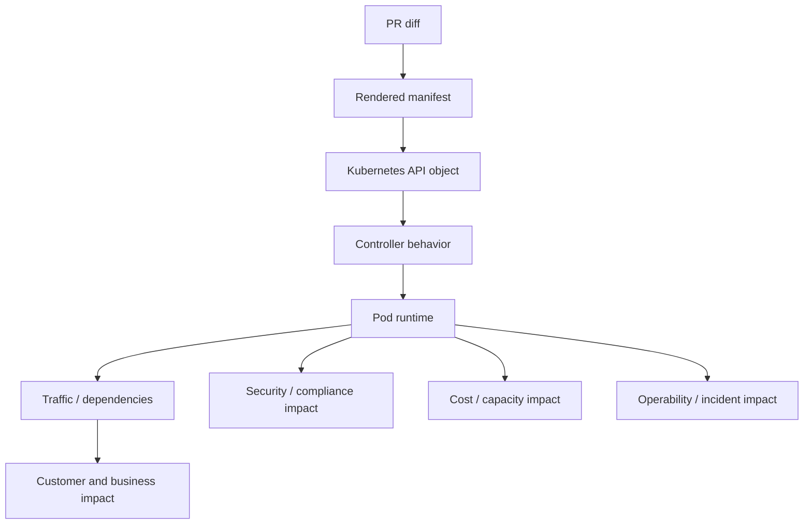

# Part 058 — PR Review and Architecture Decision Checklist

## 1. Core thesis

A Docker/Kubernetes PR is rarely "just YAML".

It may change:

- runtime behavior
- traffic routing
- rollout safety
- shutdown correctness
- resource consumption
- cloud permissions
- secret exposure
- network reachability
- autoscaling behavior
- observability quality
- cost
- security posture
- incident response

Senior review means asking:

```text
What contract is this change modifying?
What failure mode does it introduce or remove?
What evidence proves it is safe?
What should be documented as an architecture decision?
```

The goal is not to block changes.

The goal is to prevent platform changes from becoming production incidents.

---

## 2. Review model: diff to production consequence

Do not review only syntax.

Review the consequence chain:



A small YAML change can have large consequences.

Example:

```yaml
readinessProbe:
  failureThreshold: 1
```

Potential consequence:

```text
temporary dependency latency
  -> readiness fails
  -> endpoint removed
  -> traffic shifts
  -> remaining pods overloaded
  -> cascading 503
```

---

## 3. Review categories

Every PR touching Docker/Kubernetes should be reviewed across relevant categories:

```text
1. Intent
2. Workload type
3. Dockerfile
4. Image
5. Manifest correctness
6. Helm/Kustomize rendering
7. Runtime behavior
8. Probes
9. Resources
10. Configuration
11. Secrets
12. RBAC and identity
13. NetworkPolicy
14. Service and ingress
15. Storage
16. Autoscaling
17. Observability
18. Deployment strategy
19. Rollback
20. Security/privacy/compliance
21. Cost and capacity
22. Operations/runbook
23. ADR requirement
```

Not every PR needs deep review in every category, but every category should be consciously considered.

---

## 4. First question: what type of change is this?

Classify the PR.

```text
A. Dockerfile/image change
B. Kubernetes manifest change
C. Helm chart change
D. Kustomize overlay change
E. resource/probe tuning
F. config/secret change
G. RBAC/identity change
H. NetworkPolicy change
I. ingress/traffic change
J. storage change
K. autoscaling change
L. observability change
M. deployment strategy change
N. GitOps/IaC change
O. cloud integration change
P. platform policy change
```

A PR can belong to multiple categories.

The review depth should match blast radius.

---

## 5. Intent review

Ask:

```text
What problem does this change solve?
Is this operational, functional, security, cost, or platform work?
What production symptom or requirement motivated it?
What alternatives were considered?
What is the expected runtime effect?
What could go wrong?
```

Red flags:

```text
"just cleanup"
"copy from another service"
"temporary fix"
"needed to make deploy pass"
"we can tune later"
"not sure why this was required"
```

These phrases often hide risk.

---

## 6. Workload type review

Before reviewing YAML, identify workload type.

Ask:

- Is this a REST API?
- Internal API?
- Kafka consumer?
- RabbitMQ consumer?
- Camunda worker?
- Batch Job?
- CronJob?
- Stateful workload?
- Daemon-like platform workload?
- Hybrid integration adapter?

Then ask:

```text
Does the Kubernetes resource match the workload behavior?
```

Examples:

| Workload | Usually appropriate |
|---|---|
| Stateless REST API | Deployment |
| Kafka/RabbitMQ consumer | Deployment |
| Scheduled task | CronJob |
| One-time migration | Job |
| Stable identity/storage | StatefulSet |
| Node agent | DaemonSet |

Red flags:

```text
public Ingress for a consumer
StatefulSet without stable identity need
Job used for long-running service
Deployment used for one-time migration
CronJob without concurrency policy
```

---

## 7. Dockerfile review checklist

Ask:

### Base image

- Is the base image trusted?
- Is the version pinned?
- Is digest pinning required?
- Is base image appropriate for Java runtime?
- Is Alpine used knowingly with its caveats?
- Is distroless used with debugging trade-offs understood?

### Build structure

- Is multi-stage build used?
- Are dependencies cached efficiently?
- Is build context minimal?
- Is `.dockerignore` correct?
- Are test/build artifacts excluded?
- Is runtime image free from build tooling?

### Runtime

- Does it run non-root?
- Is working directory explicit?
- Is entrypoint deterministic?
- Is signal handling correct?
- Are JVM options configurable?
- Are ports documented?
- Are writable paths explicit?
- Are secrets excluded?

### Security

- Are unnecessary packages removed?
- Is package manager needed at runtime?
- Is root avoided?
- Are file permissions safe?
- Is image scanning clean or triaged?

Red flags:

```text
FROM latest
COPY . .
RUN mvn package in runtime image
USER root
secrets passed as build args
curl/bash/package manager included without reason
environment-specific config baked into image
```

---

## 8. Image review checklist

Ask:

- What exact image tag is deployed?
- What exact digest is deployed?
- Can this image be traced to a commit?
- Was it built by CI?
- Was it scanned?
- Was SBOM generated if required?
- Is the image signed if required?
- Is it promoted across environments or rebuilt?
- Is rollback image retained?
- Is registry access controlled?
- Is tag mutable?
- Is vulnerability exception documented?

Red flags:

```text
manual image build
developer-pushed image
latest tag
no digest
no scan
production image differs from tested image
old rollback image deleted
```

---

## 9. Kubernetes manifest review checklist

### Metadata

- Are names clear?
- Are labels standard?
- Are selectors stable?
- Are annotations approved?
- Is owner visible?
- Is environment visible?
- Is runbook linked?

### Spec

- Is workload type correct?
- Are replicas appropriate?
- Are resources set?
- Are probes set?
- Is ServiceAccount explicit?
- Is securityContext safe?
- Are volumes justified?
- Are config/secret refs valid?
- Is terminationGracePeriodSeconds set?
- Are node placement rules intentional?

### Status and lifecycle

Ask:

```text
How will this object be reconciled?
Who owns it?
What controller manages it?
What happens during rollout?
What happens during deletion?
```

Red flags:

```text
selector change on existing Deployment
missing labels
default namespace
default ServiceAccount
no resources
no probes
unreviewed annotations
privileged pod
hostPath
```

---

## 10. Helm review checklist

Review rendered output and templates.

### Chart structure

- Is Chart.yaml correct?
- Are dependencies pinned?
- Are templates readable?
- Are helpers consistent?
- Is values schema used if available?
- Are defaults safe?
- Are labels centralized?

### Values

- Are environment values minimal?
- Are secrets absent from plain values?
- Are resource/probe/security defaults safe?
- Are overrides documented?
- Are values names stable and clear?

### Rendering

Run or inspect:

```bash
helm template ./chart -f values-prod.yaml
helm lint ./chart
helm diff upgrade ...
```

Ask:

```text
What will actually be applied?
```

Red flags:

```text
complex template logic hiding behavior
secrets in values.yaml
selector labels templated from version
environment overlays with unexplained drift
chart upgrade changes many unrelated resources
```

---

## 11. Kustomize review checklist

Ask:

- Is base clean and reusable?
- Are overlays minimal?
- Are patches targeted?
- Are JSON6902 patches understandable?
- Are generated ConfigMaps/Secrets intentional?
- Are image overrides clear?
- Are commonLabels safe?
- Are namespace overrides correct?
- Is rendered output validated?

Render:

```bash
kubectl kustomize overlays/prod
```

Red flags:

```text
overlay patch changes selector accidentally
environment overlays diverge heavily
generated names break references
commonLabels applied to selectors unintentionally
patches too broad
```

---

## 12. Runtime behavior review

Ask:

- What command runs in the container?
- Does PID 1 handle signals?
- Does Java receive SIGTERM?
- Does app stop accepting traffic/work?
- Does app exit before grace period?
- Where does it write temp files?
- Are file descriptors sufficient?
- Are timezone and locale assumptions correct?
- Are TLS trust stores available?
- Is startup deterministic?

Red flags:

```text
shell wrapper that does not exec java
no shutdown hook
long startup with no startupProbe
writes to read-only filesystem
heap equals memory limit
unknown timezone behavior
```

---

## 13. Probe review checklist

Ask:

### Startup

- Is startupProbe needed for Java cold start?
- Is failureThreshold long enough?
- Does it prevent premature liveness restarts?

### Readiness

- Does readiness mean safe to receive traffic/work?
- Does it avoid cascading outage?
- Does it fail when local startup is incomplete?
- Is it cheap?

### Liveness

- Does liveness detect unrecoverable local process failure?
- Does it avoid checking downstream dependencies?
- Could it cause restart storm?

Red flags:

```text
same endpoint for all probes with same semantics
liveness checks database
readiness always true
timeout too short
failureThreshold too aggressive
probe endpoint performs expensive work
```

---

## 14. Resource review checklist

Ask:

- Are CPU requests set?
- Are memory requests set?
- Are memory limits set?
- Is CPU limit policy intentional?
- Is JVM heap aligned with memory limit?
- Is non-heap memory considered?
- Is direct memory considered?
- Are thread stacks considered?
- Is ephemeral storage considered?
- Are requests based on data?
- Is HPA target compatible with request?
- Is namespace quota compatible?

For Java:

```text
container memory > heap + metaspace + direct memory + thread stacks + native overhead
```

Red flags:

```text
no requests
heap equal to container limit
CPU request tiny for slow-starting Java app
CPU limit causing throttling-sensitive service
HPA target with unrealistic CPU request
```

---

## 15. Configuration review checklist

Ask:

- What config changed?
- Which environment is affected?
- Is config source of truth Git?
- Is config validated at startup?
- Is default safe?
- Is config secret or non-secret?
- Does change require restart?
- Is drift introduced?
- Is backward compatibility preserved?
- Is feature flag owner clear?

Red flags:

```text
production endpoint in default config
timeout removed
retry count increased without reason
feature flag no owner
secret value in ConfigMap
environment-specific behavior hidden in code
```

---

## 16. Secret review checklist

Ask:

- Is the secret source approved?
- Is secret stored in Git?
- Is it encrypted/sealed/externalized?
- Who can read it?
- How is it mounted?
- Does app log it?
- How is it rotated?
- Does app need restart on rotation?
- Is expiry monitored?
- Is least privilege applied?

Red flags:

```text
secret in values.yaml
secret in ConfigMap
secret passed as build arg
secret printed in logs
shared credential across environments
manual rotation only
```

---

## 17. RBAC and identity review checklist

### Kubernetes RBAC

- Does workload need Kubernetes API?
- Is ServiceAccount explicit?
- Is default ServiceAccount avoided?
- Is automount disabled when unused?
- Are Role permissions minimal?
- Is ClusterRole justified?
- Are wildcard permissions avoided?
- Can it read Secrets?

### Cloud identity

- Does it use workload identity?
- Is cloud role scoped?
- Is trust policy scoped to namespace/service account?
- Are static credentials avoided?
- Are audit logs available?
- Does SDK resolve expected credentials?

Red flags:

```text
cluster-admin
wildcard verbs/resources
shared cloud role across many services
static AWS/Azure keys
unexpected fallback credential source
```

---

## 18. NetworkPolicy review checklist

Ask:

- Is NetworkPolicy enforced by CNI?
- Is default deny in place?
- Is ingress allowed only from expected callers?
- Is egress limited to required dependencies?
- Is DNS egress allowed?
- Are DB/Kafka/RabbitMQ/Redis egress rules explicit?
- Are cloud/private endpoint rules explicit?
- Are observability egress rules allowed?
- Are selectors stable?
- Has policy been tested?

Red flags:

```text
allow all egress
namespaceSelector too broad
podSelector matches unexpected pods
DNS blocked accidentally
database access opened to entire namespace
policy added without test
```

---

## 19. Service and ingress review checklist

### Service

- Is Service type correct?
- Is selector correct?
- Is targetPort correct?
- Are named ports consistent?
- Are EndpointSlices expected?
- Is session affinity intentional?

### Ingress/Gateway

- Is exposure public/private/internal?
- Is host correct?
- Is path correct?
- Is TLS configured?
- Is certificate owner known?
- Are rewrite rules safe?
- Are timeouts aligned?
- Are forwarded headers trusted correctly?
- Is source IP behavior understood?
- Are annotations approved?
- Is WAF/API gateway involved if required?

Red flags:

```text
public exposure by accident
wildcard host
wrong targetPort
selector mismatch
TLS termination unclear
timeout shorter than app processing
unsafe rewrite
```

---

## 20. Storage review checklist

Ask:

- Is persistent storage required?
- Is StatefulSet justified?
- Is PVC size appropriate?
- Is StorageClass approved?
- Is access mode correct?
- Is reclaim policy understood?
- Is backup required?
- Is restore tested?
- Is encryption required?
- Is zone topology understood?
- Is HostPath avoided?
- Is CSI driver dependency understood?

Red flags:

```text
HostPath in application workload
PVC with no backup plan
StatefulSet used for stateless app
reclaim policy unknown
single-zone storage for multi-zone app expectation
```

---

## 21. Autoscaling review checklist

Ask:

- Is scaling signal appropriate?
- Is minReplicas safe?
- Is maxReplicas safe?
- Is HPA based on CPU, memory, custom, or external metric?
- For Kafka, is partition count considered?
- For RabbitMQ, is queue depth/message age considered?
- For Camunda, is task backlog considered?
- Is DB connection budget respected?
- Is downstream capacity respected?
- Is scale-down safe?
- Are HPA/KEDA failures alerted?

Red flags:

```text
maxReplicas ignores DB pool math
CPU-only scaling for blocked consumers
minReplicas=1 for critical API
scale-to-zero for latency-sensitive API
no metrics adapter health monitoring
```

---

## 22. Observability review checklist

Ask:

- Are logs structured?
- Is correlation ID propagated?
- Are request metrics exposed?
- Are JVM metrics exposed?
- Are dependency metrics exposed?
- Are consumer lag/queue depth/task backlog metrics exposed?
- Are traces available if required?
- Is dashboard updated?
- Are alerts updated?
- Are alert thresholds tied to impact?
- Is runbook linked?
- Is PII excluded from logs/traces/metrics?

Red flags:

```text
new service without dashboard
new ingress without 5xx alert
consumer without lag alert
job without failure alert
logs contain full payload
metrics use customer IDs as labels
```

---

## 23. Deployment strategy review checklist

Ask:

- Is RollingUpdate safe?
- Are maxUnavailable/maxSurge appropriate?
- Is Recreate justified?
- Is canary/blue-green needed?
- Is feature flag needed?
- Is kill switch available?
- Is rollback signal defined?
- Is blast radius controlled?
- Can old and new versions coexist?
- Are message/API schemas compatible?
- Are DB migrations backward compatible?

Red flags:

```text
maxUnavailable too high for low replica service
breaking API and deployment in same change
irreversible DB migration with app rollout
consumer behavior change without canary
no rollback signal
```

---

## 24. Rollback review checklist

Ask:

- What is rollback procedure?
- Is previous image available?
- Is previous manifest valid?
- Is config backward compatible?
- Are secrets backward compatible?
- Is DB schema backward compatible?
- Are message schemas backward compatible?
- Can old and new pods run together?
- Is rollback tested?
- Who decides rollback?

Red flags:

```text
rollback means "redeploy old version" but DB migration is irreversible
old image deleted
old manifest uses removed API
feature flag missing
rollback owner unclear
```

---

## 25. Security/privacy/compliance review checklist

Ask:

- Does pod run non-root?
- Are capabilities dropped?
- Is privileged mode avoided?
- Is host access avoided?
- Is image scanned?
- Are secrets protected?
- Is RBAC least privilege?
- Is cloud IAM least privilege?
- Is ingress exposure reviewed?
- Is TLS configured?
- Is egress restricted?
- Is PII excluded from logs/traces/metrics?
- Is audit evidence generated?
- Are exceptions documented?

Red flags:

```text
root pod
cluster-admin
public ingress no review
secret in Git
PII in log
broad cloud role
no audit trail
security exception no expiry
```

---

## 26. Cost and capacity review checklist

Ask:

- Does this increase replicas?
- Does this increase requests?
- Does this create new load balancer?
- Does this increase NAT/egress traffic?
- Does this add persistent storage?
- Does this increase logging volume?
- Does this add high-cardinality metrics?
- Does this affect node pool size?
- Does this require multi-AZ resources?
- Is cost attribution label present?

Red flags:

```text
huge resource request with no data
new public LoadBalancer per service
debug logs enabled in production
metric label cardinality explosion
oversized PVC
no owner/cost labels
```

---

## 27. Operations and runbook review checklist

Ask:

- Is runbook updated?
- Are new failure modes documented?
- Are dashboards linked?
- Are alerts linked?
- Are debug commands documented?
- Is escalation path known?
- Is customer impact known?
- Is rollback documented?
- Is secret rotation documented?
- Is dependency outage behavior documented?

Red flags:

```text
new production service no runbook
new dependency no alert
new ingress no 5xx dashboard
new consumer no lag runbook
manual recovery steps only known by author
```

---

## 28. ADR decision boundary

Not every PR needs an ADR.

But an ADR is appropriate when the change affects architecture, platform policy, or long-term operational contract.

Create or update an ADR for:

```text
new ingress architecture
new deployment strategy
new workload identity model
new secret management approach
new stateful workload in Kubernetes
new autoscaling strategy
new GitOps repository structure
new Helm/Kustomize standard
new NetworkPolicy baseline
new cloud private endpoint pattern
new observability standard
new platform policy/admission rule
new database migration strategy
new message processing semantics
```

A PR comment is not enough for decisions that future teams must understand.

---

## 29. ADR template for Docker/Kubernetes decisions

Use a compact ADR shape:

```md
# ADR: <decision title>

## Status

Proposed | Accepted | Superseded | Deprecated

## Context

What problem are we solving?
What constraints exist?
What systems are affected?

## Decision

What did we decide?

## Consequences

What improves?
What gets harder?
What risks remain?

## Alternatives considered

What options were rejected and why?

## Operational impact

How does this affect deployment, rollback, observability, security, cost, and incident response?

## Verification

How will we know this decision works?

## Internal verification checklist

What must be checked in CSG/team environment?
```

---

## 30. Review comment style

Good review comments are specific, risk-based, and actionable.

Weak:

```text
This looks wrong.
```

Better:

```text
This liveness probe calls the database. If PostgreSQL has a transient outage,
Kubernetes may restart all pods and amplify the incident. Can we move dependency
status to a diagnostic endpoint and keep liveness local-process-only?
```

Weak:

```text
Need more resources.
```

Better:

```text
The container memory limit is 1Gi and MaxRAMPercentage is 90%.
That leaves too little room for metaspace, direct buffers, thread stacks, and native overhead.
Can we either lower heap percentage or increase the memory limit based on observed usage?
```

Weak:

```text
Security issue.
```

Better:

```text
This pod uses the default ServiceAccount with token automount enabled.
The app does not appear to call the Kubernetes API. Can we create an explicit
ServiceAccount and set automountServiceAccountToken=false?
```

---

## 31. High-signal questions senior engineers ask

### Runtime

```text
What happens on SIGTERM?
What happens during node drain?
What happens if startup takes 90 seconds?
What happens if filesystem is read-only?
```

### Traffic

```text
What path does a request take from DNS to pod?
Where is TLS terminated?
Which timeout fires first?
What happens if this pod is removed from endpoints?
```

### Dependencies

```text
What happens if PostgreSQL fails over?
What happens if Kafka lag spikes?
What happens if RabbitMQ redelivers?
What happens if Redis is unavailable?
What happens if cloud SDK credential resolution fails?
```

### Scaling

```text
What metric drives scaling?
What is the downstream capacity limit?
What is max DB connection count at max replicas?
What happens during scale-down?
```

### Security

```text
What can this pod access?
Can it read Kubernetes Secrets?
Can it call cloud APIs?
Can it egress anywhere?
What sensitive data can it log?
```

### Operations

```text
How do we detect failure?
Who gets paged?
What dashboard proves health?
How do we rollback?
What is the customer impact?
```

---

## 32. Internal verification checklist

Use this checklist inside CSG/team context.

### Repository and ownership

- Which repo owns Dockerfile?
- Which repo owns Helm chart/Kustomize overlay?
- Which repo owns GitOps desired state?
- Who approves platform changes?
- Who approves security exceptions?
- Who owns production support?

### CI/CD and artifact

- What pipeline builds the image?
- Where is image pushed?
- How is digest captured?
- Are scans required?
- How is manifest updated?
- How is promotion done?
- How is rollback done?

### Kubernetes environment

- Which cluster is targeted?
- Which namespace?
- Which ingress controller?
- Which CNI?
- Which CSI?
- Which secret mechanism?
- Which policy engine?
- Which observability stack?
- Which autoscaler?

### Service-specific

- What workload type?
- What dependencies?
- What traffic path?
- What resource profile?
- What scaling signal?
- What shutdown behavior?
- What runbook?

### Decision-specific

- Is ADR required?
- Is there an existing ADR?
- Does this PR violate an existing decision?
- Does this introduce new platform pattern?
- Does this require platform/SRE/security review?

---

## 33. Final review checklist

Before approving, confirm:

```text
intent clear
workload type correct
artifact trusted
rendered manifest valid
runtime behavior understood
probes safe
resources realistic
config validated
secrets protected
RBAC least privilege
network access intentional
ingress exposure reviewed
storage justified
autoscaling bounded
observability complete
rollback possible
runbook updated
security/privacy reviewed
cost impact understood
ADR created if needed
internal verification items identified
```

Approval should mean:

```text
I understand what this changes, why it is safe enough, how it fails, how we detect it, and how we recover.
```

---

## 34. Anti-patterns

Avoid:

```text
- approving YAML because it "looks standard"
- reviewing templates but not rendered output
- ignoring workload type
- ignoring shutdown behavior
- ignoring DB connection math
- ignoring secret rotation
- ignoring NetworkPolicy impact
- ignoring ingress timeout chain
- ignoring HPA metric source
- ignoring rollback blockers
- requiring changes without explaining failure mode
- making architecture decisions only in PR comments
- accepting "temporary" risky config with no expiry
- approving production exposure without runbook
```

---

## 35. Final mental model

A senior Docker/Kubernetes PR review is a production-risk review.

The diff is only the starting point.

You review:

```text
what changes
what contract it touches
what failure mode it creates
what evidence supports it
what operational burden it adds
what decision must be recorded
```

That is how backend engineers become effective in platform, deployment, and traffic-flow design discussions.

---

## 36. Key takeaway

For enterprise Java/JAX-RS systems, the highest-value review skill is connecting small configuration changes to real operational outcomes:

```text
probe config -> rollout safety
resource config -> JVM behavior
Service selector -> traffic routing
NetworkPolicy -> dependency reachability
ServiceAccount -> privilege boundary
Ingress annotation -> customer-facing behavior
HPA max replicas -> database capacity
secret source -> rotation and leakage risk
image digest -> audit and rollback
runbook -> incident recovery
```

If a PR changes any of these, it deserves senior engineering attention.
