# Part 059 — Troubleshooting Playbook

## 1. Core thesis

Troubleshooting Docker and Kubernetes is not about memorizing commands.

It is about moving from symptom to root cause through the correct layer model:

```text
source code
build
image
registry
manifest
Kubernetes API
scheduler
node
container runtime
pod lifecycle
service discovery
network path
ingress path
identity
configuration
secret
storage
autoscaling
observability
application behavior
dependency behavior
```

A senior engineer troubleshoots by narrowing the failure domain.

The dangerous pattern is random command execution:

```text
delete pod
restart deployment
scale to zero
edit live manifest
disable policy
remove NetworkPolicy
increase timeout blindly
```

The safer pattern is:

```text
observe
classify symptom
identify failing layer
collect evidence
test hypothesis
apply smallest safe mitigation
confirm recovery
document root cause
```

---

## 2. Production-safe troubleshooting rules

Before touching anything in production:

### 2.1 Observe before changing

Collect:

- current deployment state
- pod state
- events
- recent rollout
- logs
- metrics
- alerts
- dependency health
- GitOps sync state
- recent config/secret changes
- recent infrastructure changes

### 2.2 Preserve evidence

Before deleting/restarting:

```bash
kubectl get pod <pod> -n <namespace> -o yaml > pod-before.yaml
kubectl describe pod <pod> -n <namespace> > pod-describe-before.txt
kubectl logs <pod> -n <namespace> --previous > pod-previous.log
kubectl get events -n <namespace> --sort-by=.lastTimestamp > events-before.txt
```

### 2.3 Avoid global changes

Avoid:

```text
- deleting all pods
- disabling admission policy globally
- removing NetworkPolicy broadly
- scaling every service
- editing GitOps-managed resources manually without coordination
- restarting stateful clusters blindly
- changing ingress timeout globally
- changing DNS/CoreDNS without platform owner
```

### 2.4 Know the blast radius

Ask:

```text
Is this customer-facing?
Is this one pod, one service, one namespace, one node, one cluster, one region?
Is stateful data involved?
Is traffic still flowing?
Is rollback possible?
Who owns the dependency?
```

---

## 3. Fast triage map

Use this map to classify the symptom.

```mermaid
flowchart TD
    A[Production symptom] --> B[Pod not running]
    A --> C[Pod running but not ready]
    A --> D[Service unreachable]
    A --> E[Ingress failure]
    A --> F[High latency/errors]
    A --> G[Consumer backlog]
    A --> H[Storage issue]
    A --> I[Cloud API failure]
    A --> J[Autoscaling failure]

    B --> B1[Image pull]
    B --> B2[Scheduling]
    B --> B3[CrashLoop]
    B --> B4[OOMKilled]

    C --> C1[Readiness probe]
    C --> C2[Config/secret]
    C --> C3[Dependency startup]
    C --> C4[Resource starvation]

    D --> D1[Service selector]
    D --> D2[EndpointSlice]
    D --> D3[DNS]
    D --> D4[NetworkPolicy]

    E --> E1[DNS/LB]
    E --> E2[Ingress rule]
    E --> E3[TLS]
    E --> E4[Backend protocol]
    E --> E5[Timeout]

    F --> F1[App]
    F --> F2[JVM]
    F --> F3[DB]
    F --> F4[Network]
    F --> F5[Dependency]

    G --> G1[Kafka/RabbitMQ]
    G --> G2[Consumer replicas]
    G --> G3[Downstream bottleneck]
    G --> G4[Poison message]

    H --> H1[PVC Pending]
    H --> H2[Attach/mount]
    H --> H3[CSI]
    H --> H4[Zone mismatch]

    I --> I1[Identity]
    I --> I2[DNS]
    I --> I3[Private endpoint]
    I --> I4[Permission]

    J --> J1[Metrics unavailable]
    J --> J2[HPA config]
    J --> J3[Cluster capacity]
    J --> J4[Scaling signal wrong]
```



---

## 4. Baseline command set

### 4.1 Cluster and namespace view

```bash
kubectl get ns
kubectl get all -n <namespace>
kubectl get events -n <namespace> --sort-by=.lastTimestamp
```

### 4.2 Workload view

```bash
kubectl get deploy,statefulset,daemonset,job,cronjob -n <namespace>
kubectl describe deploy <deployment> -n <namespace>
kubectl rollout status deploy/<deployment> -n <namespace>
kubectl rollout history deploy/<deployment> -n <namespace>
```

### 4.3 Pod view

```bash
kubectl get pods -n <namespace> -o wide
kubectl describe pod <pod> -n <namespace>
kubectl logs <pod> -n <namespace>
kubectl logs <pod> -n <namespace> --previous
```

### 4.4 Service and routing view

```bash
kubectl get svc,endpoints,endpointslices -n <namespace>
kubectl describe svc <service> -n <namespace>
kubectl get ingress -n <namespace>
kubectl describe ingress <ingress> -n <namespace>
```

### 4.5 Runtime inspection

```bash
kubectl exec -it <pod> -n <namespace> -- sh
kubectl port-forward pod/<pod> 8080:8080 -n <namespace>
kubectl top pod -n <namespace>
kubectl top node
```

Use `exec` carefully in production. Do not mutate state unless the runbook explicitly allows it.

---

## 5. Playbook: local container fails

### 5.1 Symptoms

```text
container exits immediately
application cannot bind port
config missing
Java cannot find main class
permission denied
file not found
works on host but not in container
```

### 5.2 First checks

```bash
docker build -t app-debug .
docker run --rm app-debug
docker run --rm -it app-debug sh
docker inspect app-debug
```

Check:

- entrypoint
- command
- working directory
- copied artifact path
- Java version
- file permissions
- non-root user access
- environment variables
- exposed/listening port
- dependency availability

### 5.3 Java-specific causes

Common causes:

```text
- jar path wrong
- main class missing
- shaded jar not built
- WAR copied but runtime expects JAR
- Maven build artifact name changed
- non-root user cannot read file
- app writes to read-only path
- port config differs from Dockerfile
- missing trust store
- missing timezone/locale data
```

### 5.4 Debug questions

Ask:

```text
What process is PID 1?
Does it receive signals?
Does Java see the expected env vars?
Does the artifact exist at runtime?
Can the runtime user read it?
What port is actually listening?
Does the process write to a writable path?
```

---

## 6. Playbook: image build fails

### 6.1 Symptoms

```text
docker build fails
Maven dependency download fails
BuildKit cache not used
permission denied
file not found in build context
COPY fails
tests fail in image build
```

### 6.2 Checks

```bash
docker build --no-cache -t app-test .
docker build --progress=plain -t app-test .
```

Check:

- `.dockerignore`
- build context size
- Dockerfile path
- Maven settings
- dependency repository credentials
- proxy
- CA certificates
- platform architecture
- base image availability
- file path case sensitivity
- multi-stage build stage names

### 6.3 Common root causes

```text
- required file excluded by .dockerignore
- copying from wrong build stage
- Maven repository unavailable
- private dependency credentials missing
- base image tag changed
- no network from CI runner
- corporate proxy not configured
- architecture mismatch amd64/arm64
- dependency cache invalidated by COPY order
```

---

## 7. Playbook: image push/pull fails

### 7.1 Push failure symptoms

```text
denied: requested access to the resource is denied
unauthorized
repository does not exist
tag invalid
TLS certificate error
```

Check:

- registry URL
- repository exists
- credentials
- push permission
- tag format
- CI identity
- network/proxy
- registry availability

### 7.2 Pull failure symptoms in Kubernetes

Pod status:

```text
ImagePullBackOff
ErrImagePull
```

Describe pod:

```bash
kubectl describe pod <pod> -n <namespace>
```

Look for:

```text
Failed to pull image
pull access denied
manifest unknown
not found
unauthorized
x509 certificate signed by unknown authority
toomanyrequests
```

### 7.3 Common root causes

```text
- image tag does not exist
- image pushed to different registry/repo
- imagePullSecret missing
- node cannot reach registry
- registry auth expired
- private registry certificate issue
- wrong architecture image
- tag overwritten unexpectedly
- registry outage
- pull rate limit
```

### 7.4 Debug workflow

```bash
kubectl get secret -n <namespace>
kubectl describe pod <pod> -n <namespace>
kubectl get pod <pod> -n <namespace> -o jsonpath='{.spec.imagePullSecrets}'
```

Verify:

- exact image name
- exact tag/digest
- registry auth
- node network path to registry
- ECR/ACR integration if used
- image exists for target architecture

---

## 8. Playbook: Pod Pending

### 8.1 Symptoms

```text
pod remains Pending
0/10 nodes are available
insufficient cpu
insufficient memory
node affinity mismatch
untolerated taint
pod has unbound immediate PersistentVolumeClaims
```

### 8.2 Commands

```bash
kubectl describe pod <pod> -n <namespace>
kubectl get nodes --show-labels
kubectl describe node <node>
kubectl get events -n <namespace> --sort-by=.lastTimestamp
kubectl get quota,limitrange -n <namespace>
kubectl get pvc -n <namespace>
```

### 8.3 Root cause categories

#### Capacity

```text
insufficient cpu
insufficient memory
insufficient ephemeral-storage
```

Mitigation:

- reduce request if overestimated
- scale node pool
- trigger cluster autoscaler
- move workload to appropriate node pool
- check quota

#### Placement

```text
nodeSelector mismatch
node affinity too strict
pod anti-affinity impossible
topology spread impossible
untolerated taint
```

Mitigation:

- correct labels/selectors
- adjust affinity/anti-affinity
- add toleration if justified
- fix topology spread constraints

#### Storage

```text
PVC pending
volume zone mismatch
StorageClass unavailable
```

Mitigation:

- inspect PVC and StorageClass
- verify CSI driver
- verify zone topology
- avoid scheduling pod to zone where volume cannot attach

---

## 9. Playbook: CrashLoopBackOff

### 9.1 Symptoms

```text
pod starts then exits repeatedly
restart count increases
CrashLoopBackOff
```

### 9.2 Commands

```bash
kubectl describe pod <pod> -n <namespace>
kubectl logs <pod> -n <namespace>
kubectl logs <pod> -n <namespace> --previous
kubectl get pod <pod> -n <namespace> -o jsonpath='{.status.containerStatuses}'
```

### 9.3 Root cause categories

#### Application exits on startup

Common causes:

```text
missing config
missing secret
invalid DB URL
migration failure
port conflict
Java main class error
unhandled exception
license/config validation failure
```

#### Probe kills container

Look for:

```text
Liveness probe failed
Startup probe failed
```

Causes:

```text
startupProbe missing
liveness too aggressive
endpoint path wrong
management port wrong
timeout too short
Java startup too slow
```

#### Permission issue

```text
permission denied
read-only file system
cannot write temp file
non-root user cannot access path
```

#### Dependency hard requirement

The app may fail startup if:

```text
PostgreSQL unavailable
Kafka unavailable
Redis unavailable
secret manager unavailable
cloud identity unavailable
```

Review whether this should be startup-fatal or handled with retry/backoff.

### 9.4 Mitigation principle

Do not simply increase restart delay or delete pods.

Fix the startup contract:

- required config
- probe timing
- dependency handling
- file permissions
- JVM memory
- secret mount
- cloud identity

---

## 10. Playbook: OOMKilled

### 10.1 Symptoms

```text
Last State: Terminated
Reason: OOMKilled
Exit Code: 137
```

Commands:

```bash
kubectl describe pod <pod> -n <namespace>
kubectl top pod <pod> -n <namespace>
kubectl logs <pod> -n <namespace> --previous
```

### 10.2 Java-specific causes

Java memory is more than heap:

```text
heap
metaspace
thread stacks
direct memory
JIT/code cache
GC structures
native memory
TLS buffers
libraries
```

Common causes:

```text
heap too large relative to container limit
MaxRAMPercentage too high
too many threads
large batch/message processing
large JSON payload
unbounded cache
direct buffer growth
connection pool leak
memory leak
large file loaded into memory
```

### 10.3 Debug workflow

Check:

- memory limit
- JVM heap settings
- GC metrics
- heap usage
- non-heap usage
- thread count
- recent traffic spike
- recent batch/consumer change
- message size
- cache size
- container restart time

### 10.4 Mitigation options

Possible mitigations:

```text
reduce heap percentage
increase memory limit after evidence
reduce batch size
reduce prefetch
limit payload size
fix leak
cap caches
reduce thread count
separate heavy workload
add memory dashboards
```

Avoid blindly increasing memory without root cause.

---

## 11. Playbook: CPU throttling and latency spike

### 11.1 Symptoms

```text
high latency
low average CPU
high throttling
GC pauses increase
startup slow
readiness delay
consumer lag grows
```

### 11.2 Causes

```text
CPU limit too low
CPU request too low for scheduling
JVM warmup needs more CPU
GC threads throttled
JSON serialization CPU spike
TLS overhead
compression overhead
too many concurrent requests
```

### 11.3 Checks

Use metrics dashboard if available:

- container CPU usage
- CPU throttling
- request latency
- GC pause
- thread pool queue
- HPA events
- node CPU pressure

Kubernetes quick view:

```bash
kubectl top pod -n <namespace>
kubectl top node
```

### 11.4 Mitigation

- review CPU limit policy
- increase CPU request
- remove/raise CPU limit if platform allows
- tune thread pools
- reduce concurrency
- add replicas
- optimize expensive code path
- review HPA target
- test under realistic load

---

## 12. Playbook: Pod not Ready

### 12.1 Symptoms

```text
READY 0/1
Readiness probe failed
service has no endpoints
rollout stuck
```

### 12.2 Commands

```bash
kubectl describe pod <pod> -n <namespace>
kubectl logs <pod> -n <namespace>
kubectl get endpointslices -n <namespace>
kubectl describe deploy <deployment> -n <namespace>
```

### 12.3 Root causes

```text
readiness path wrong
readiness port wrong
management port not exposed
app startup incomplete
DB dependency check failing
Kafka dependency check failing
secret missing
config invalid
slow JVM startup
CPU throttling delays startup
thread pool exhausted
```

### 12.4 Important distinction

If pod is running but not ready:

```text
Kubernetes may be protecting traffic from a bad pod.
```

Do not bypass readiness until you understand why it fails.

---

## 13. Playbook: Service unreachable

### 13.1 Symptoms

```text
curl service DNS fails
connection refused
connection timeout
service has no endpoints
one service cannot call another
```

### 13.2 Commands

```bash
kubectl get svc <service> -n <namespace> -o yaml
kubectl get endpointslices -n <namespace>
kubectl get pods -n <namespace> --show-labels
kubectl describe svc <service> -n <namespace>
```

From a debug pod or caller pod:

```bash
nslookup <service>.<namespace>.svc.cluster.local
curl -v http://<service>.<namespace>.svc.cluster.local:<port>
```

### 13.3 Root causes

```text
Service selector does not match pod labels
pods not ready, so no endpoints
targetPort wrong
named port mismatch
container not listening on expected port
NetworkPolicy blocks traffic
DNS failure
wrong namespace
service name typo
```

### 13.4 Selector check

Compare:

```yaml
Service selector:
  app: quote-api
```

With pod labels:

```yaml
metadata:
  labels:
    app.kubernetes.io/name: quote-api
```

If selector labels do not match, Service has no endpoints.

---

## 14. Playbook: DNS failing

### 14.1 Symptoms

```text
UnknownHostException
Temporary failure in name resolution
nslookup fails
service discovery intermittent
cloud private endpoint resolves wrong IP
```

### 14.2 Commands

From pod:

```bash
cat /etc/resolv.conf
nslookup kubernetes.default.svc.cluster.local
nslookup <service>.<namespace>.svc.cluster.local
nslookup <private-endpoint-domain>
```

Cluster:

```bash
kubectl get pods -n kube-system | grep coredns
kubectl logs -n kube-system deploy/coredns
kubectl get svc -n kube-system kube-dns
```

### 14.3 Root causes

```text
CoreDNS unavailable
NetworkPolicy blocks DNS egress
wrong service namespace
ndots/search behavior surprises app
ExternalName target wrong
private DNS zone not linked
split-horizon DNS issue
node DNS issue
DNS cache stale
```

### 14.4 Java-specific note

Java DNS caching can hide changes.

Check JVM DNS cache settings if service discovery changes are not observed promptly.

---

## 15. Playbook: Ingress failing

### 15.1 Symptoms

```text
404
502
503
504
TLS error
host not found
wrong backend
timeout
```

### 15.2 Commands

```bash
kubectl get ingress -n <namespace>
kubectl describe ingress <ingress> -n <namespace>
kubectl get svc,endpointslices -n <namespace>
kubectl logs -n <ingress-namespace> deploy/<ingress-controller>
```

External:

```bash
curl -vk https://<host>/<path>
```

### 15.3 Status interpretation

#### 404

Possible:

```text
host/path rule mismatch
rewrite mismatch
request reaches ingress but no route matches
wrong ingress class
```

#### 502

Possible:

```text
backend connection refused
backend protocol mismatch
pod not listening
service targetPort wrong
TLS to backend misconfigured
```

#### 503

Possible:

```text
service has no endpoints
pods not ready
backend unavailable
```

#### 504

Possible:

```text
backend timeout
app slow
DB slow
ingress timeout shorter than app processing
connection draining issue
```

### 15.4 Review timeout chain

Check:

```text
client timeout
CDN/front door timeout
cloud load balancer timeout
ingress timeout
service mesh timeout
app server timeout
HTTP client timeout
database timeout
```

---

## 16. Playbook: TLS failing

### 16.1 Symptoms

```text
certificate expired
certificate name mismatch
unknown authority
TLS handshake failure
backend TLS error
```

### 16.2 Checks

```bash
kubectl describe ingress <ingress> -n <namespace>
kubectl get secret <tls-secret> -n <namespace> -o yaml
curl -vk https://<host>
openssl s_client -connect <host>:443 -servername <host>
```

### 16.3 Root causes

```text
certificate expired
wrong certificate secret
secret not synced
DNS points to wrong load balancer
SNI mismatch
private CA not trusted by Java
backend protocol mismatch
mTLS config mismatch
certificate chain incomplete
```

### 16.4 Java-specific TLS issues

Java may fail with:

```text
PKIX path building failed
unable to find valid certification path
handshake_failure
```

Check:

- trust store
- CA bundle
- certificate chain
- TLS version/cipher policy
- private CA distribution
- mTLS client certificate config

---

## 17. Playbook: ConfigMap or Secret missing

### 17.1 Symptoms

```text
CreateContainerConfigError
secret not found
configmap not found
environment variable missing
volume mount failed
```

### 17.2 Commands

```bash
kubectl describe pod <pod> -n <namespace>
kubectl get configmap,secret -n <namespace>
kubectl get deploy <deployment> -n <namespace> -o yaml
```

### 17.3 Root causes

```text
wrong namespace
wrong name
GitOps sync order
External Secret not reconciled
Sealed Secret not decrypted
secret key missing
config key missing
Helm value typo
Kustomize overlay omitted resource
RBAC prevents controller from creating secret
cloud secret manager permission denied
```

### 17.4 Debug path

If using External Secrets:

```bash
kubectl get externalsecret -n <namespace>
kubectl describe externalsecret <name> -n <namespace>
```

If using CSI secret provider:

```bash
kubectl describe pod <pod> -n <namespace>
kubectl logs <secret-provider-pod> -n <provider-namespace>
```

---

## 18. Playbook: RBAC denied

### 18.1 Symptoms

```text
Forbidden
User cannot get resource
serviceaccount cannot list secrets
cannot patch deployments
```

### 18.2 Commands

```bash
kubectl auth can-i get pods -n <namespace> --as=system:serviceaccount:<namespace>:<serviceaccount>
kubectl get role,rolebinding -n <namespace>
kubectl get clusterrole,clusterrolebinding
kubectl describe rolebinding <name> -n <namespace>
```

### 18.3 Root causes

```text
wrong ServiceAccount
default ServiceAccount used accidentally
RoleBinding references wrong subject
namespace mismatch
ClusterRole required but Role used
GitOps controller lacks permission
CI/CD identity lacks permission
automount token disabled but app expects Kubernetes API
```

### 18.4 Mitigation principle

Do not grant `cluster-admin` to make the error disappear.

Grant the narrow permission required.

---

## 19. Playbook: NetworkPolicy blocked

### 19.1 Symptoms

```text
connection timeout
DNS timeout
service reachable from one pod but not another
works before policy, fails after policy
cloud private endpoint unreachable
```

### 19.2 Commands

```bash
kubectl get networkpolicy -n <namespace>
kubectl describe networkpolicy <policy> -n <namespace>
kubectl get pod <pod> -n <namespace> --show-labels
kubectl get ns --show-labels
```

From pod:

```bash
nslookup <target>
curl -v http://<target>:<port>
nc -vz <target> <port>
```

### 19.3 Root causes

```text
default deny without allow rule
DNS egress not allowed
namespaceSelector label mismatch
podSelector label mismatch
wrong port/protocol
egress to DB/Kafka/RabbitMQ/Redis not allowed
egress to cloud private endpoint not allowed
ingress from ingress controller not allowed
CNI does not enforce NetworkPolicy as expected
```

### 19.4 Debug principle

NetworkPolicy is label-driven.

Always compare:

```text
source pod labels
source namespace labels
target pod labels
target namespace labels
policy selectors
ports
direction
```

---

## 20. Playbook: PVC Pending or volume mount failure

### 20.1 Symptoms

```text
PVC Pending
pod stuck ContainerCreating
Multi-Attach error
MountVolume.SetUp failed
volume node affinity conflict
```

### 20.2 Commands

```bash
kubectl get pvc,pv -n <namespace>
kubectl describe pvc <pvc> -n <namespace>
kubectl describe pod <pod> -n <namespace>
kubectl get storageclass
kubectl get csidrivers
kubectl get pods -n kube-system | grep csi
```

### 20.3 Root causes

```text
StorageClass missing
dynamic provisioning failed
CSI driver unavailable
volume zone mismatch
access mode incompatible
volume already attached to another node
quota exceeded
cloud IAM/identity issue for CSI
reclaim policy surprise
```

### 20.4 Stateful warning

For PostgreSQL/Kafka/RabbitMQ/Redis-like workloads, storage troubleshooting can affect data integrity.

Do not delete PVC/PV unless the runbook explicitly says so.

---

## 21. Playbook: HPA not scaling

### 21.1 Symptoms

```text
HPA shows unknown
current metrics unavailable
replicas do not increase
consumer lag grows but pods do not scale
```

### 21.2 Commands

```bash
kubectl get hpa -n <namespace>
kubectl describe hpa <hpa> -n <namespace>
kubectl top pod -n <namespace>
kubectl get apiservice | grep metrics
```

For KEDA:

```bash
kubectl get scaledobject -n <namespace>
kubectl describe scaledobject <name> -n <namespace>
```

### 21.3 Root causes

```text
metrics server unavailable
custom metrics adapter unavailable
wrong metric name
missing resource requests
HPA target wrong
maxReplicas too low
scaleDown stabilization too slow
KEDA trigger auth failed
consumer lag metric missing
cluster autoscaler cannot add nodes
pods Pending after scaling
```

### 21.4 Autoscaling correctness question

Ask:

```text
Is the scaling signal actually correlated with the bottleneck?
```

CPU scaling does not fix a database bottleneck.

---

## 22. Playbook: Cloud SDK credential failing

### 22.1 Symptoms

AWS-like:

```text
AccessDenied
Unable to locate credentials
InvalidIdentityToken
ExpiredToken
AssumeRoleWithWebIdentity failed
```

Azure-like:

```text
CredentialUnavailableException
ManagedIdentityCredential authentication unavailable
ClientAuthenticationException
AuthorizationFailed
```

### 22.2 Checks

Kubernetes:

```bash
kubectl get sa <serviceaccount> -n <namespace> -o yaml
kubectl describe pod <pod> -n <namespace>
kubectl exec <pod> -n <namespace> -- env | sort
```

Cloud side:

- role/identity exists
- trust/federated credential exists
- token audience correct
- namespace and ServiceAccount match
- permission policy grants required action
- SDK version supports workload identity mechanism
- private endpoint/DNS path works if API is private

### 22.3 Common root causes

```text
wrong ServiceAccount used
annotation missing
OIDC/federated credential mismatch
namespace mismatch
audience mismatch
cloud role lacks permission
SDK uses env/static credential before workload identity
token file not mounted
network cannot reach cloud API
private DNS resolves incorrectly
```

### 22.4 Mitigation principle

Separate authentication from authorization:

```text
authentication = who is the pod?
authorization = what can it do?
network = can it reach the API endpoint?
```

All three must work.

---

## 23. Playbook: Private endpoint unreachable

### 23.1 Symptoms

```text
connection timeout
connection refused
DNS resolves public IP instead of private IP
TLS name mismatch
works from node but not pod
works from one namespace but not another
```

### 23.2 Debug layers

```text
1. DNS resolution
2. Routing
3. Firewall / SG / NSG / NACL
4. NetworkPolicy
5. Proxy
6. TLS trust
7. Service authorization
8. Application timeout
```

### 23.3 Commands from pod

```bash
nslookup <private-domain>
curl -vk https://<private-domain>
nc -vz <private-domain> <port>
```

### 23.4 Cloud/on-prem checks

Verify:

- private endpoint exists
- private DNS zone linked
- route table correct
- security group / NSG allows traffic
- firewall allows traffic
- proxy bypass configured if needed
- hybrid DNS forwarding works
- TLS certificate matches hostname
- Kubernetes egress policy allows traffic
- pod subnet can reach endpoint

---

## 24. Playbook: Kafka consumer lag

### 24.1 Symptoms

```text
consumer lag increasing
processing latency high
rebalance storm
DLQ increasing
consumer pods healthy but backlog grows
```

### 24.2 Root causes

```text
not enough partitions
not enough replicas
consumer stuck on poison message
downstream DB/API slow
retry storm
CPU throttling
memory pressure
large messages
rebalance due to rolling restarts
max poll interval exceeded
```

### 24.3 Debug checklist

- consumer group status
- topic partitions
- pod replicas
- processing rate
- error rate
- retry rate
- DLQ rate
- downstream latency
- CPU throttling
- pod restarts
- recent rollout
- offset commit errors

### 24.4 Mitigation options

- pause rollout
- fix poison message
- increase replicas up to partition usefulness
- reduce batch size
- increase processing capacity
- protect downstream dependency
- tune max poll interval
- use KEDA/custom metric scaling
- add partitions only after design review

---

## 25. Playbook: RabbitMQ queue buildup

### 25.1 Symptoms

```text
queue depth grows
message age grows
unacked messages high
redeliveries high
DLQ grows
```

### 25.2 Root causes

```text
consumers down
prefetch too high
consumer processing slow
downstream dependency slow
poison messages requeued forever
ack not sent
connection/channel instability
consumer concurrency too low
```

### 25.3 Debug checklist

- queue depth
- message age
- consumer count
- unacked count
- redelivery rate
- DLQ count
- pod logs
- processing latency
- downstream errors
- recent deployment
- NetworkPolicy/secret changes

### 25.4 Mitigation options

- stop poison requeue loop
- route bad messages to DLQ
- scale consumers if downstream can handle it
- reduce prefetch if memory/unacked is high
- fix downstream bottleneck
- rollback bad consumer version
- pause unsafe processing if data corruption risk exists

---

## 26. Playbook: PostgreSQL connection exhaustion

### 26.1 Symptoms

```text
too many connections
connection timeout
pool exhausted
API latency spike
consumer processing slows
database CPU high
```

### 26.2 Root causes

```text
HPA scaled pods
pool size too high per pod
connection leak
slow queries
long transactions
database failover/reconnect storm
migration lock
background jobs competing with API traffic
```

### 26.3 Debug checklist

- number of pods
- pool size per pod
- HPA max replicas
- DB max connections
- active vs idle connections
- slow queries
- lock waits
- recent rollout/job
- retry storm
- database failover event

### 26.4 Mitigation options

- reduce HPA max replicas
- reduce pool size
- rollback connection leak
- pause heavy jobs
- tune slow query
- add connection proxy if platform supports
- separate API and batch workload pools
- add backpressure

---

## 27. Playbook: Redis timeout or lock issue

### 27.1 Symptoms

```text
Redis timeout
cache miss spike
distributed lock stuck
duplicate processing
rate limit failure
idempotency failure
```

### 27.2 Root causes

```text
Redis unavailable
network policy blocks Redis
connection pool exhausted
retry storm
slow Redis command
large keys/values
lock TTL too long
lock TTL too short
credential rotation failed
TLS trust issue
```

### 27.3 Debug checklist

- Redis role in system
- cache vs lock vs idempotency
- connection pool metrics
- timeout settings
- retry settings
- command latency
- key size/cardinality
- lock TTL
- pod scale-out
- NetworkPolicy
- secret rotation

### 27.4 Correctness warning

If Redis is used for locks or idempotency, failure is not just performance. It can affect correctness.

---

## 28. Playbook: Camunda worker backlog or failures

### 28.1 Symptoms

```text
task backlog grows
incidents increase
task lock expires
duplicate task processing
worker completes fail
workflow stuck
```

### 28.2 Root causes

```text
worker pods down
worker version incompatible
lock duration too short
processing time increased
downstream dependency slow
retry storm
bad process data
task type mismatch
worker shutdown unsafe
database latency
```

### 28.3 Debug checklist

- task type
- worker pod health
- task backlog
- lock duration
- p95/p99 processing time
- retries
- incidents
- process version
- recent deployment
- downstream latency
- idempotency behavior

### 28.4 Mitigation options

- rollback worker
- increase worker replicas if safe
- reduce concurrency if downstream overloaded
- handle poison task data
- adjust lock duration after evidence
- pause risky worker
- apply process-specific remediation

---

## 29. Playbook: rollout stuck

### 29.1 Symptoms

```text
deployment rollout stuck
new ReplicaSet not progressing
old pods not terminating
new pods not ready
progressDeadlineExceeded
```

### 29.2 Commands

```bash
kubectl rollout status deploy/<deployment> -n <namespace>
kubectl describe deploy <deployment> -n <namespace>
kubectl get rs -n <namespace>
kubectl get pods -n <namespace>
kubectl describe pod <new-pod> -n <namespace>
```

### 29.3 Root causes

```text
new image cannot pull
new pod cannot schedule
new pod crashloops
readiness fails
PDB blocks old pod eviction
maxUnavailable/maxSurge impossible
quota exceeded
NetworkPolicy blocks startup dependency
secret/config missing
```

### 29.4 Mitigation

Options:

```bash
kubectl rollout undo deploy/<deployment> -n <namespace>
```

But in GitOps environments, rollback should usually be done through GitOps source of truth.

Coordinate before manual rollback.

---

## 30. Playbook: GitOps sync failed

### 30.1 Symptoms

```text
Argo CD/Flux sync failed
drift detected
resource out of sync
admission webhook denied
no matches for kind
forbidden
helm render error
kustomize build error
```

### 30.2 Root causes

```text
invalid manifest
deprecated API
missing CRD
CRD sync order wrong
RBAC denied
policy violation
Helm values error
Kustomize patch error
manual drift
resource managed by another controller
```

### 30.3 Debug checklist

- rendered manifest
- Git commit
- GitOps application status
- controller logs
- admission denial message
- CRD existence
- RBAC permission
- policy violation
- live object owner references
- manual changes

### 30.4 Mitigation principle

Fix source of truth, not only live state.

Manual live fixes may be reverted by GitOps.

---

## 31. Incident troubleshooting template

Use this structure during incident notes:

```text
1. Time detected
2. Alert or symptom
3. Customer impact
4. Affected service/namespace/cluster
5. Recent changes
6. Current state
7. Evidence collected
8. Hypotheses
9. Actions taken
10. Result of each action
11. Current mitigation
12. Root cause if known
13. Follow-up items
```

---

## 32. Internal verification checklist

Use this inside CSG/team context.

### Access and tooling

- Which clusters can backend engineers access?
- Is access read-only or write?
- Which namespaces are allowed?
- Is kubectl access audited?
- Are ephemeral debug containers allowed?
- Are port-forward and exec allowed in production?
- What is the break-glass process?

### Runbooks

- Where are service runbooks stored?
- Are debugging commands standardized?
- Are production-safe commands documented?
- Are destructive commands restricted?
- Are rollback steps documented?
- Are incident notes linked?

### Observability

- Where are Kubernetes events visible?
- Where are pod logs?
- Where are ingress logs?
- Where are application metrics?
- Where are JVM metrics?
- Where are traces?
- Where are Kafka/RabbitMQ/Redis/PostgreSQL/Camunda dashboards?

### Platform dependencies

- Which ingress controller is used?
- Which CNI is used?
- Which DNS/private DNS setup exists?
- Which secret manager pattern exists?
- Which GitOps tool is used?
- Which registry is used?
- Which cloud identity mechanism is used?
- Which storage classes are approved?

### Escalation

- Who owns cluster/node issues?
- Who owns ingress/LB issues?
- Who owns DNS issues?
- Who owns cloud IAM issues?
- Who owns registry issues?
- Who owns database/messaging/cache dependencies?
- Who owns application rollback?

---

## 33. PR review checklist for troubleshooting readiness

Before a service goes production, ask:

- Can we identify the running image digest?
- Can we map pod to commit?
- Can we see logs by correlation ID?
- Can we see request latency and error rate?
- Can we see JVM memory and GC?
- Can we see readiness/liveness failures?
- Can we see ingress 4xx/5xx?
- Can we see consumer lag or queue depth?
- Can we see DB pool usage?
- Can we see cloud SDK failures?
- Can we see NetworkPolicy denies if available?
- Is there a runbook for top failure modes?
- Is rollback documented?
- Are production-safe debug steps documented?

---

## 34. Senior troubleshooting heuristics

Use these heuristics:

```text
If pod is Pending, start with scheduler events.
If pod is CrashLooping, start with previous logs and exit reason.
If pod is OOMKilled, think JVM memory beyond heap.
If pod is Running but not Ready, inspect readiness semantics.
If Service fails, check selector and EndpointSlice before DNS.
If DNS fails, verify CoreDNS and NetworkPolicy DNS egress.
If Ingress returns 503, check backend endpoints.
If Ingress returns 504, check timeout chain and app/dependency latency.
If RBAC says forbidden, do not grant cluster-admin.
If NetworkPolicy changed, compare labels before changing ports.
If HPA does not scale, inspect metric availability first.
If cloud SDK fails, separate identity, permission, and network.
If private endpoint fails, debug DNS before firewall.
If consumer lag grows, check downstream bottleneck before scaling.
If rollback is needed, check GitOps source of truth.
```

---

## 35. Anti-patterns

Avoid:

```text
- deleting pods before reading previous logs
- restarting everything without classifying failure
- bypassing readiness
- disabling liveness permanently
- removing NetworkPolicy globally
- granting cluster-admin during incident
- scaling consumers without checking downstream capacity
- increasing DB pool size during DB exhaustion
- increasing timeouts without checking latency source
- deleting PVCs to fix mount issues
- applying kubectl edits to GitOps-managed resources without follow-up
- ignoring customer impact while debugging technical details
```

---

## 36. Final mental model

Troubleshooting is graph traversal.

Start from the symptom and walk the dependency graph:

```text
user symptom
traffic path
Kubernetes routing
pod lifecycle
container runtime
application runtime
dependency path
cloud/on-prem network
identity/secret/config
observability evidence
```

The best debugger is not the one who knows the most commands.

It is the one who knows which layer can produce the symptom and how to prove or eliminate it safely.

---

## 37. Key takeaway

A production-safe troubleshooting playbook turns panic into a controlled investigation.

For senior backend engineers, Docker/Kubernetes troubleshooting skill means:

- understanding the layer model
- preserving evidence
- narrowing failure domains
- avoiding destructive guesses
- applying minimal mitigations
- validating recovery
- documenting root cause
- improving readiness after the incident

The goal is not only to fix the current outage.

The goal is to make the next outage easier to detect, understand, and prevent.
