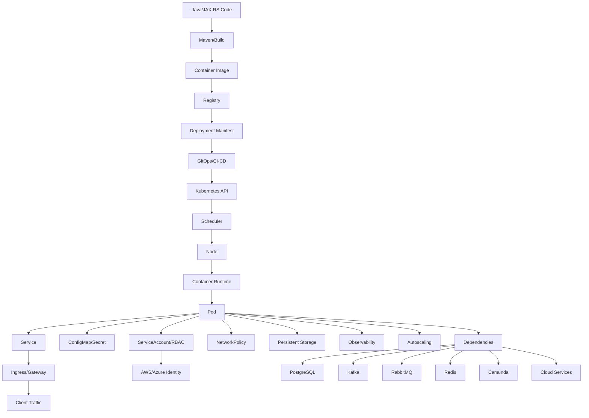

# Part 060 — Final Part: Docker and Kubernetes Mastery Map for Senior Backend Engineer

## 1. This is the final part

This is the final part of the series:

```text
Cheatsheet Docker and Kubernetes for Enterprise Java/JAX-RS Systems
```

The series started from:

```text
container mental model
```

And ends with:

```text
production engineering judgment
```

The real goal was never to memorize Docker and Kubernetes commands.

The goal was to build the ability to reason about:

- process isolation
- image construction
- JVM behavior in containers
- Kubernetes desired state
- pod lifecycle
- workload selection
- traffic flow
- service discovery
- storage
- identity
- security
- autoscaling
- GitOps
- EKS
- AKS
- on-prem/hybrid deployment
- observability
- incident response
- production readiness
- PR/architecture review

A senior backend engineer does not need to own every platform component.

But they must understand enough to avoid building services that are impossible to operate.

---

## 2. The complete mental model

At the highest level:



Every production incident is usually a failure somewhere in this graph.

Every good architecture review should inspect the risky edges in this graph.

---

## 3. Container mastery map

You understand containers when you can explain:

```text
container = isolated process + isolated filesystem + isolated network view + resource controls + packaged root filesystem
```

Not:

```text
container = lightweight VM
```

### 3.1 Concepts to master

- process isolation
- PID namespace
- network namespace
- mount namespace
- user namespace
- cgroups
- seccomp
- Linux capabilities
- container runtime
- OCI image
- OCI runtime
- Docker vs containerd
- image layer
- writable container layer
- container lifecycle
- signal handling
- stdout/stderr logging
- ephemeral filesystem

### 3.2 Senior-level questions

Ask:

```text
What is the main process?
Does it run as root?
Does it handle SIGTERM?
Where does it write files?
What resource limits apply?
What filesystem is immutable?
What network namespace is it in?
What capabilities does it have?
What happens if the process exits?
```

### 3.3 Failure modes to recognize

- permission denied from non-root runtime
- read-only filesystem failure
- SIGTERM ignored
- PID 1 signal handling issue
- cgroup memory limit causing OOM
- container exits because main process exits
- missing file due to build context mistake
- local state lost after restart

---

## 4. Dockerfile mastery map

A production Dockerfile is not just a build recipe.

It defines the runtime shape of the service.

### 4.1 Master checklist

- trusted base image
- explicit base version/digest where required
- multi-stage build
- Maven dependency cache efficiency
- minimal runtime image
- non-root user
- predictable workdir
- clean artifact copy
- no secrets in image
- no environment-specific artifact
- explicit entrypoint
- signal forwarding
- JVM options strategy
- small attack surface
- reproducible build
- compatible architecture
- scan-ready artifact

### 4.2 Senior-level questions

Ask:

```text
Can this image be rebuilt reproducibly?
Can this image be promoted unchanged across environments?
Can this image run without root?
Does this image contain build-only tools?
Does this image leak secrets?
Does this image support graceful shutdown?
Can we map this image to a commit?
Can we roll back to the previous digest?
```

---

## 5. Image engineering mastery map

Images are supply-chain artifacts.

### 5.1 Concepts to master

- tag vs digest
- immutable digest
- registry
- image promotion
- base image update
- vulnerability scanning
- SBOM
- SCA
- license scanning
- artifact signing
- provenance
- trusted registry
- pull secret
- ECR/ACR/private registry
- retention policy
- rollback image preservation

### 5.2 Senior-level questions

Ask:

```text
Is the image immutable?
Is the running pod using the expected digest?
Was this image scanned?
Which CVEs are accepted and why?
Is the SBOM available?
Was the image signed?
Who can push to the registry?
Can production pull the image during registry degradation?
Is rollback image retained?
```

---

## 6. JVM-in-container mastery map

Java in Kubernetes must be sized against container limits, not host assumptions.

### 6.1 Concepts to master

- JVM container awareness
- heap vs non-heap
- MaxRAMPercentage
- InitialRAMPercentage
- direct memory
- metaspace
- thread stacks
- GC behavior
- CPU quota
- CPU throttling
- file descriptors
- entropy
- timezone
- trust store
- graceful shutdown
- server thread pools
- DB connection pools
- HTTP client pools

### 6.2 Senior-level questions

Ask:

```text
What is the container memory limit?
What heap size will JVM choose?
How much memory remains for non-heap?
How many threads can the service create?
Is CPU throttling visible?
What happens during GC under CPU limit?
Does the service shut down before SIGKILL?
Are connection pools aligned with replica count?
```

### 6.3 Failure modes to recognize

- OOMKilled despite heap looking safe
- CPU throttling causing p99 latency spike
- DB connection storm after HPA scale-out
- slow JVM startup causing readiness failure
- liveness killing app during cold start
- SIGKILL during in-flight request/consumer processing
- trust store missing private CA

---

## 7. Kubernetes control-plane mastery map

Kubernetes is a desired-state control system.

### 7.1 Concepts to master

- API server
- etcd
- scheduler
- controller manager
- kubelet
- kube-proxy
- container runtime
- manifest
- spec vs status
- reconciliation loop
- owner reference
- finalizer
- CRD
- operator
- admission control
- namespace
- label/selector
- annotation

### 7.2 Senior-level questions

Ask:

```text
What object owns this pod?
What controller reconciles it?
What desired state is declared?
What observed state differs?
What admission policy applies?
What selector connects Service to pod?
What finalizer can block deletion?
What CRD/operator owns this custom resource?
```

---

## 8. Workload design mastery map

### 8.1 Workload selection

Use:

```text
Deployment:
  stateless long-running services

StatefulSet:
  stable identity and stable storage

DaemonSet:
  one pod per node or selected nodes

Job:
  finite task

CronJob:
  scheduled finite task
```

### 8.2 Java workload mapping

```text
JAX-RS REST API:
  Deployment + Service + Ingress/Gateway + HPA + PDB

Kafka consumer:
  Deployment + lag metrics/KEDA + graceful shutdown + DLQ observability

RabbitMQ consumer:
  Deployment + queue-depth scaling + ack/nack correctness

Camunda worker:
  Deployment + task metrics + lock/retry/idempotency design

Migration:
  Job + explicit approval + rollback/forward-fix plan

Scheduled reconciliation:
  CronJob + concurrency policy + alerting
```

### 8.3 Senior-level questions

Ask:

```text
Is this workload actually stateless?
Does it need stable identity?
Does it need a Service?
Does it need public ingress?
Can it scale horizontally?
What limits scaling usefulness?
What happens on pod termination?
What happens on duplicate execution?
```

---

## 9. Pod lifecycle mastery map

### 9.1 Lifecycle sequence

```text
manifest applied
pod created
scheduler assigns node
image pulled
volumes mounted
init containers run
main containers start
startup probe passes
readiness probe passes
Service endpoints update
traffic/work begins
pod receives SIGTERM
readiness removed
connections/work drain
container exits
pod deleted
```

### 9.2 Senior-level questions

Ask:

```text
Where can this pod fail before startup?
How long does startup really take?
When does it become ready?
What removes it from traffic?
How does it handle SIGTERM?
What happens if shutdown exceeds grace period?
What logs/events prove each lifecycle step?
```

---

## 10. Probe mastery map

### 10.1 Probe semantics

```text
startupProbe:
  protects slow startup

readinessProbe:
  controls traffic/work eligibility

livenessProbe:
  detects unrecoverable local process failure
```

### 10.2 Senior-level questions

Ask:

```text
Does readiness mean safe to receive traffic?
Does liveness avoid checking downstream dependencies?
Does startupProbe cover Java cold start?
Can probe failure cause outage amplification?
Are probe endpoints cheap?
Are timeouts realistic?
```

### 10.3 Probe anti-patterns

Avoid:

```text
liveness checks database
readiness always returns true
no startupProbe for slow JVM
same endpoint with unclear semantics
probe timeout shorter than normal GC pause/startup
readiness depends on optional dependency
```

---

## 11. Graceful shutdown mastery map

### 11.1 HTTP service shutdown

```text
SIGTERM
readiness false
endpoint removed
ingress/LB drains
server stops accepting new requests
in-flight requests finish
process exits
```

### 11.2 Consumer shutdown

```text
SIGTERM
stop polling/consuming
finish in-flight messages
commit/ack only completed work
close client
exit
```

### 11.3 Senior-level questions

Ask:

```text
Does this service stop receiving traffic before exit?
Can in-flight requests complete?
Can message processing finish safely?
Are Kafka offsets committed correctly?
Are RabbitMQ messages acked/nacked correctly?
Are Camunda tasks completed/failed/extended intentionally?
Is terminationGracePeriodSeconds long enough?
```

---

## 12. Networking mastery map

### 12.1 Core concepts

- pod IP
- Service IP
- ClusterIP
- NodePort
- LoadBalancer
- EndpointSlice
- kube-proxy
- iptables/IPVS/eBPF awareness
- CNI
- DNS
- CoreDNS
- NetworkPolicy
- ingress
- gateway
- east-west traffic
- north-south traffic
- egress
- private endpoint
- proxy
- TLS

### 12.2 Service routing path

```text
caller pod
  -> service DNS
  -> ClusterIP
  -> kube-proxy/data plane
  -> EndpointSlice
  -> target pod IP
  -> container port
```

### 12.3 North-south traffic path

```text
client
  -> DNS
  -> cloud load balancer/front door
  -> ingress controller/API gateway
  -> Kubernetes Service
  -> EndpointSlice
  -> Pod IP
  -> Java/JAX-RS endpoint
```

### 12.4 Senior-level questions

Ask:

```text
Where does TLS terminate?
Where is source IP preserved or lost?
Which timeout fires first?
Which component returns 404/502/503/504?
Does Service selector match pod labels?
Does NetworkPolicy allow this path?
Does DNS resolve inside the pod?
Is private DNS linked correctly?
```

---

## 13. DNS and service discovery mastery map

### 13.1 Concepts

- CoreDNS
- service DNS
- pod DNS
- search domain
- ndots
- headless service
- StatefulSet DNS
- ExternalName
- DNS TTL
- DNS caching
- Java DNS cache
- split-horizon DNS
- private DNS
- hybrid DNS

### 13.2 Senior-level questions

Ask:

```text
What name is the app resolving?
From which namespace?
Does it resolve to service IP, pod IP, public IP, or private IP?
Is DNS blocked by NetworkPolicy?
Does Java cache stale DNS?
Is private endpoint DNS overriding public DNS?
Does on-prem DNS forward correctly?
```

---

## 14. Storage mastery map

### 14.1 Concepts

- Volume
- PersistentVolume
- PersistentVolumeClaim
- StorageClass
- access mode
- reclaim policy
- dynamic provisioning
- CSI driver
- EmptyDir
- projected volume
- HostPath risk
- StatefulSet volumeClaimTemplates
- snapshot
- backup/restore

### 14.2 Senior-level questions

Ask:

```text
Is this service supposed to be stateless?
Why does it need persistent storage?
Can the data be recreated?
What is RPO/RTO?
What happens when the pod moves nodes?
Is the volume zone-bound?
Is backup tested?
Is HostPath avoided?
```

---

## 15. Stateful workload mastery map

### 15.1 Statefulness questions

For PostgreSQL/Kafka/RabbitMQ/Redis/Camunda-like dependencies:

```text
Is this managed service or self-managed in Kubernetes?
Who owns backup and restore?
Who owns upgrade?
Who owns failover?
What is the data durability model?
What is quorum/replication behavior?
What is the operator responsibility?
What happens on node drain?
What happens on zone failure?
```

### 15.2 Senior-level position

Do not automatically reject stateful workloads in Kubernetes.

But do not accept them casually.

Stateful workloads require:

- operational ownership
- backup/restore proof
- storage design
- disruption budget
- upgrade runbook
- monitoring
- failover testing
- capacity planning
- incident drills

---

## 16. Configuration and secret mastery map

### 16.1 Config

Config must be:

- explicit
- validated
- environment-scoped
- separated from secrets
- traceable
- drift-controlled
- safely defaulted
- observable when wrong

### 16.2 Secret

Secrets must have:

- source of truth
- secure delivery
- RBAC boundary
- encryption where required
- rotation path
- leakage prevention
- audit trail
- runtime behavior on change

### 16.3 Senior-level questions

Ask:

```text
Where does this value come from?
Is it secret or non-secret?
Is it stored in Git?
Who can read it?
How does it rotate?
Does the app reload or restart?
What happens if it is missing?
What happens if it is wrong?
```

---

## 17. RBAC and identity mastery map

### 17.1 Kubernetes identity

- ServiceAccount
- Role
- ClusterRole
- RoleBinding
- ClusterRoleBinding
- token projection
- automountServiceAccountToken
- namespace-scoped permission
- least privilege

### 17.2 Cloud identity

- AWS IRSA / Pod Identity awareness
- OIDC provider
- AssumeRoleWithWebIdentity
- Azure Workload Identity
- Managed Identity
- federated credential
- SDK credential provider chain
- cloud IAM/RBAC
- audit logs

### 17.3 Senior-level questions

Ask:

```text
Which identity does the pod run as?
Can it read Kubernetes Secrets?
Can it call cloud APIs?
Is permission namespace-scoped?
Is CI/CD permission separated from runtime permission?
Is GitOps permission separated from app permission?
Can we audit access?
```

---

## 18. Security mastery map

### 18.1 Runtime security

- non-root
- read-only root filesystem
- drop capabilities
- no privileged container
- no hostNetwork unless justified
- no hostPID/hostIPC unless justified
- no HostPath unless justified
- seccomp RuntimeDefault
- allowPrivilegeEscalation false
- trusted registries
- no `latest` in production

### 18.2 Supply-chain security

- image scanning
- dependency scanning
- SBOM
- signing
- provenance
- CI runner security
- Docker socket risk
- build secret handling
- registry access control
- admission policy

### 18.3 Senior-level questions

Ask:

```text
Can this container escape its intended boundary?
Can this image be trusted?
Can this workload read secrets it should not?
Can this ingress expose sensitive APIs?
Can logs leak PII/secrets?
Can we produce compliance evidence?
```

---

## 19. GitOps and IaC mastery map

### 19.1 Concepts

- desired state in Git
- pull-based reconciliation
- drift detection
- Argo CD
- Flux
- Terraform
- Helm
- Kustomize
- environment overlays
- promotion
- sync waves
- CRD ordering
- rollback
- manual hotfix risk

### 19.2 Senior-level questions

Ask:

```text
What is the source of truth?
What controller applies changes?
Can manual changes be overwritten?
How are environments promoted?
How are CRDs handled?
How is rollback done?
Is drift visible?
Are secrets handled safely?
```

---

## 20. EKS mastery map

### 20.1 Concepts

- managed control plane
- managed node group
- self-managed node
- Fargate profile
- EKS add-ons
- VPC CNI
- CoreDNS
- kube-proxy
- ECR
- IAM
- IRSA / Pod Identity awareness
- Security Groups
- VPC endpoint
- AWS Load Balancer Controller
- ALB/NLB
- Route 53
- ACM
- EBS CSI
- EFS CSI
- CloudWatch
- Cluster Autoscaler
- Karpenter

### 20.2 Senior-level questions

Ask:

```text
Do pods get VPC IPs?
Which subnets host nodes/pods?
How are ALB/NLB resources created?
Are targets instance mode or IP mode?
How does pod access AWS services?
Are VPC endpoints/private DNS used?
How are images pulled from ECR?
How are nodes scaled?
Which add-ons are managed?
```

---

## 21. AKS mastery map

### 21.1 Concepts

- managed control plane
- node pool
- system node pool
- user node pool
- VMSS
- Azure CNI
- kubenet awareness
- ACR
- Managed Identity
- Workload Identity
- Azure Load Balancer
- Application Gateway
- AGIC
- Azure Front Door awareness
- Azure DNS
- Private DNS Zone
- Private Endpoint
- Azure Disk CSI
- Azure Files CSI
- Key Vault CSI provider
- Azure Monitor
- Container Insights
- Log Analytics
- Cluster Autoscaler

### 21.2 Senior-level questions

Ask:

```text
Which CNI mode is used?
Which node pool runs this workload?
How does the pod pull from ACR?
How does the pod access Azure services?
Is Workload Identity configured?
Where is TLS terminated?
How does ingress reach the pod?
Are Private DNS Zones linked?
How are logs and metrics collected?
```

---

## 22. On-prem and hybrid mastery map

### 22.1 On-prem concerns

- control plane ownership
- etcd backup
- node patching
- load balancer integration
- ingress
- DNS
- certificate lifecycle
- internal registry
- air-gapped deployment
- storage integration
- CSI driver
- monitoring
- upgrade strategy

### 22.2 Hybrid concerns

- VPN
- Direct Connect
- ExpressRoute
- firewall
- proxy
- private DNS
- split-horizon DNS
- MTU
- TLS trust
- egress control
- cloud-to-on-prem calls
- on-prem-to-cloud calls
- latency
- ownership boundaries

### 22.3 Senior-level questions

Ask:

```text
Which team owns the network path?
Which DNS resolves this name?
Which firewall allows this traffic?
Which proxy is required?
Which CA signs this certificate?
What is the latency budget?
What happens if the private link fails?
```

---

## 23. Observability mastery map

### 23.1 Required signals

- logs
- metrics
- traces
- Kubernetes events
- deployment events
- ingress logs
- application logs
- JVM metrics
- dependency metrics
- business metrics
- alerts
- dashboards
- runbooks

### 23.2 Java/JAX-RS baseline

- request count
- request latency histogram
- error rate
- correlation ID
- trace ID
- JVM heap/non-heap
- GC
- thread pool
- DB pool
- HTTP client
- Kafka/RabbitMQ metrics
- Redis metrics
- Camunda worker metrics
- readiness/liveness failures
- version/build info

### 23.3 Senior-level questions

Ask:

```text
Can we tell if customers are impacted?
Can we trace a request through services?
Can we see JVM pressure?
Can we see dependency latency?
Can we see queue lag/backlog?
Can we see rollout health?
Can we debug without exec access?
Can an on-call engineer use the dashboard at 3 AM?
```

---

## 24. Production readiness mastery map

A production-ready Kubernetes service has:

```text
trusted image
known digest
secure runtime
explicit JVM sizing
safe probes
safe shutdown
bounded resources
validated config
protected secrets
least-privilege identity
explicit network access
correct service/ingress
dependency timeouts
bounded retries
workload-aware autoscaling
complete observability
tested rollback
usable runbook
clear ownership
```

### 24.1 Senior-level go/no-go

Go when:

```text
risks are known
evidence exists
owners are clear
rollback/mitigation is ready
observability proves health
```

No-go when:

```text
critical behavior is unknown
rollback is undefined
security boundary is unclear
observability is missing
ownership is ambiguous
data correctness risk is unreviewed
```

---

## 25. PR review mastery map

When reviewing Docker/Kubernetes PRs, inspect:

```text
Dockerfile
image tag/digest
resource requests/limits
JVM settings
probes
shutdown behavior
ConfigMap/Secret
ServiceAccount/RBAC
NetworkPolicy
Service/Ingress/Gateway
HPA/KEDA
PDB
storage
Helm/Kustomize diff
GitOps sync behavior
observability
runbook
rollback
security
cost
```

### 25.1 Senior review questions

Ask:

```text
What failure mode does this change introduce?
What customer path does this affect?
What dependency does this increase pressure on?
Can this roll out safely?
Can this roll back safely?
Can we observe success/failure?
Does this violate platform policy?
Does this change cost or capacity?
Does this require security review?
```

---

## 26. Architecture decision mastery map

Use ADRs for platform decisions that affect long-term operations.

ADR candidates:

- choosing EKS vs AKS vs on-prem
- choosing Ingress vs Gateway API vs API Gateway
- choosing Helm vs Kustomize
- choosing Argo CD vs Flux
- choosing self-managed Kafka vs managed Kafka
- choosing External Secrets pattern
- choosing IRSA/Azure Workload Identity
- choosing default NetworkPolicy model
- choosing HPA/KEDA scaling signal
- choosing PDB standards
- choosing image signing/admission policy
- choosing storage class for stateful workloads

ADR should include:

```text
context
decision
options considered
trade-offs
failure modes
security implications
cost implications
operational implications
migration path
rollback/exit strategy
internal verification needs
```

---

## 27. Failure-mode mastery map

A senior engineer recognizes these patterns quickly.

### 27.1 Pod state

```text
Pending:
  scheduling/capacity/storage/affinity/taint

CrashLoopBackOff:
  app startup/probe/config/secret/permission

ImagePullBackOff:
  registry/tag/auth/network/architecture

OOMKilled:
  memory limit/JVM/non-heap/batch/leak

NotReady:
  readiness semantics/startup/dependency/config
```

### 27.2 Traffic state

```text
Service no endpoints:
  selector mismatch or pods not ready

DNS failure:
  CoreDNS, namespace, NetworkPolicy, private DNS

Ingress 404:
  host/path/rule mismatch

Ingress 502:
  backend connection/protocol/port

Ingress 503:
  no backend endpoints

Ingress 504:
  timeout/app/dependency latency
```

### 27.3 Runtime state

```text
High latency:
  CPU throttling, GC, DB, network, dependency

Consumer lag:
  throughput, downstream, poison message, rebalance

DB exhaustion:
  pool size * replicas, leak, slow query, failover

Cloud API failure:
  identity, permission, DNS, private endpoint, TLS
```

---

## 28. Internal verification master checklist

Use this when joining or reviewing a real team environment.

### 28.1 Platform

- Which Kubernetes platforms are used?
- EKS, AKS, on-prem, hybrid?
- Which clusters and environments exist?
- Who owns each cluster?
- What is the upgrade policy?
- What is the access model?
- What is the emergency process?

### 28.2 Delivery

- Where are Dockerfiles?
- Where are Helm charts?
- Where are Kustomize overlays?
- Where is GitOps source of truth?
- Which CI/CD pipeline builds images?
- Which registry stores images?
- How are images promoted?
- How is rollback performed?

### 28.3 Workloads

- Which services are REST APIs?
- Which are consumers?
- Which are workers?
- Which are Jobs/CronJobs?
- Which are stateful?
- Which are customer-facing?
- Which are business-critical?
- Which have PDB/HPA/KEDA?

### 28.4 Networking

- Which ingress controller is used?
- Is Gateway API used?
- Is API gateway used?
- Where is TLS terminated?
- How is DNS managed?
- How is private DNS managed?
- Are NetworkPolicies enforced?
- What is the egress model?
- Are private endpoints used?
- Are proxies required?

### 28.5 Security

- What Pod Security standard is enforced?
- Are OPA Gatekeeper/Kyverno used?
- What is the trusted registry policy?
- Is image scanning required?
- Is image signing required?
- What is the secret management pattern?
- What cloud identity mechanism is used?
- How are RBAC permissions reviewed?
- Are audit logs available?

### 28.6 Data and dependencies

- Which PostgreSQL instances are used?
- Which Kafka clusters/topics are used?
- Which RabbitMQ queues are used?
- Which Redis instances are used?
- Which Camunda/workflow dependencies exist?
- Which cloud services are called?
- Which dependencies are managed vs self-managed?
- What are capacity limits?

### 28.7 Observability and operations

- Where are logs?
- Where are metrics?
- Where are traces?
- Where are dashboards?
- Where are alerts?
- Where are runbooks?
- Where are incident notes?
- What are severity definitions?
- How is customer impact assessed?

---

## 29. How to keep learning in real production systems

The best learning loop is:

```text
read manifest
trace traffic
inspect dashboard
review incident
read runbook
ask platform owner
review PR
simulate failure in non-prod
document finding
improve template/checklist
```

### 29.1 Weekly learning routine

Pick one service per week and map:

```text
source repo
Dockerfile
image registry
Helm/Kustomize
Deployment
Service
Ingress
ConfigMap/Secret
ServiceAccount/RBAC
NetworkPolicy
HPA/PDB
dashboard
alerts
runbook
dependencies
traffic path
failure modes
```

### 29.2 Incident-driven learning

After every incident, ask:

```text
Which layer failed?
Was detection fast?
Was root cause obvious?
Was mitigation safe?
Was rollback possible?
Did the runbook help?
Did observability show customer impact?
What guardrail would prevent recurrence?
```

### 29.3 PR-driven learning

For every platform/deployment PR, ask:

```text
What changed in runtime behavior?
What changed in traffic behavior?
What changed in security boundary?
What changed in scaling behavior?
What changed in failure behavior?
What changed in operational burden?
```

---

## 30. How to participate in platform discussions

A senior backend engineer should contribute from the application-operability angle.

Good contributions:

```text
This HPA max replica count exceeds database connection capacity.
This liveness probe can restart healthy pods during DB outage.
This ingress timeout is shorter than our p99 business operation.
This NetworkPolicy blocks DNS egress.
This Dockerfile runs as root without justification.
This rollout can kill Kafka consumers before offsets are committed.
This Job can run twice and duplicate side effects.
This migration is not backward compatible.
This secret rotation requires pod restart, but no runbook says that.
This dashboard cannot distinguish ingress 503 from app 500.
```

These comments are valuable because they connect platform configuration to production correctness.

---

## 31. How to prevent platform changes from becoming incidents

Use this prevention loop:

```text
1. Understand the contract.
2. Render the manifest.
3. Validate policy.
4. Test lifecycle.
5. Test traffic path.
6. Test dependency behavior.
7. Test rollback.
8. Verify observability.
9. Document runbook.
10. Review after release.
```

### 31.1 Change-risk classification

Higher-risk changes:

- ingress routing
- TLS/certificate
- Service selector
- NetworkPolicy
- RBAC
- ServiceAccount/cloud identity
- resource limit
- probe change
- HPA/KEDA change
- DB migration
- consumer retry/ack behavior
- secret source change
- CNI/CSI/ingress controller upgrade
- CRD/operator upgrade
- GitOps sync behavior
- node pool upgrade

These deserve stronger validation.

---

## 32. Final checklist: Dockerfile

- Trusted base image.
- Multi-stage build.
- Runtime image minimal.
- Non-root user.
- No secret in image.
- No environment-specific artifact.
- JVM options explicit.
- Entrypoint signal-safe.
- Writable paths intentional.
- Image labels present if required.
- Build reproducible.
- Scan clean/triaged.
- Digest traceable.

---

## 33. Final checklist: Image engineering

- Tag strategy defined.
- Digest captured.
- Registry approved.
- Image promotion controlled.
- SBOM generated if required.
- Vulnerability scan triaged.
- License scan if required.
- Signing/provenance if required.
- Pull auth configured.
- Retention supports rollback.
- Registry outage runbook exists.

---

## 34. Final checklist: JVM in container

- Heap sized below memory limit.
- Non-heap considered.
- CPU request realistic.
- CPU limit policy intentional.
- GC metrics available.
- Thread pools bounded.
- DB/HTTP client pools bounded.
- File descriptor needs known.
- SIGTERM handled.
- Shutdown tested.
- Trust store/timezone configured.

---

## 35. Final checklist: Kubernetes workload

- Correct resource type.
- Replicas appropriate.
- Labels/selectors stable.
- ServiceAccount explicit.
- Resources configured.
- Probes correct.
- SecurityContext hardened.
- Config/secret references valid.
- PDB where needed.
- HPA/KEDA where needed.
- Topology/affinity intentional.
- Rollout strategy safe.

---

## 36. Final checklist: Networking and traffic flow

- Service selector matches pods.
- targetPort correct.
- EndpointSlice populated.
- DNS name known.
- NetworkPolicy allows required paths.
- Ingress/Gateway configured correctly.
- TLS termination known.
- Timeout chain aligned.
- Forwarded headers handled.
- Source IP behavior understood.
- Private endpoint DNS validated.
- Egress path documented.

---

## 37. Final checklist: Storage

- Stateless unless storage is justified.
- PVC ownership clear.
- StorageClass approved.
- Access mode correct.
- Reclaim policy understood.
- Backup/restore defined.
- Zone behavior understood.
- CSI dependency monitored.
- HostPath avoided.
- Stateful workload runbook exists.

---

## 38. Final checklist: Config and secrets

- Config validated at startup.
- Config source of truth known.
- Environment overlays reviewed.
- Secrets not in plain Git.
- Secret source of truth known.
- Secret RBAC restricted.
- Rotation process defined.
- App behavior on rotation known.
- Sensitive values not logged.
- Drift detectable.

---

## 39. Final checklist: RBAC and identity

- ServiceAccount explicit.
- Default ServiceAccount avoided.
- Token automount disabled unless needed.
- Roles least privilege.
- ClusterRole justified.
- CI/CD permission separated.
- GitOps permission understood.
- Cloud identity configured.
- Cloud permission least privilege.
- Audit logs available.

---

## 40. Final checklist: Security

- Non-root.
- No privileged container.
- No host access unless justified.
- Capabilities dropped.
- Seccomp RuntimeDefault.
- Read-only root filesystem where possible.
- Trusted registry.
- No latest tag.
- Image scan.
- Secret protection.
- TLS reviewed.
- PII logging avoided.
- Compliance evidence retained.

---

## 41. Final checklist: GitOps and IaC

- Git source of truth known.
- Rendered manifests validated.
- Drift detected.
- Manual hotfix policy documented.
- Helm/Kustomize structure clean.
- Environment promotion controlled.
- CRD sync order handled.
- Rollback through source of truth.
- Terraform boundaries clear.
- Secrets not leaked through values.

---

## 42. Final checklist: EKS

- Cluster version known.
- Node group strategy known.
- VPC CNI behavior understood.
- Pod IP/subnet model known.
- ALB/NLB controller understood.
- ECR pull configured.
- IRSA/Pod Identity configured.
- VPC endpoints/private DNS validated.
- EBS/EFS CSI configured if used.
- CloudWatch/Prometheus visibility available.
- Autoscaler/Karpenter behavior known.

---

## 43. Final checklist: AKS

- Cluster version known.
- Node pool strategy known.
- Azure CNI/kubenet mode known.
- ACR pull configured.
- Managed Identity/Workload Identity configured.
- Azure Load Balancer/Application Gateway/AGIC understood.
- Private DNS/Private Endpoint validated.
- Azure Disk/Files CSI configured if used.
- Key Vault CSI configured if used.
- Azure Monitor/Log Analytics available.
- Autoscaler behavior known.

---

## 44. Final checklist: On-prem/hybrid

- Cluster ownership clear.
- Load balancer integration known.
- DNS ownership known.
- Certificate lifecycle known.
- Internal registry available.
- Storage/CSI ownership known.
- Patch/upgrade process known.
- Air-gapped constraints known.
- VPN/Direct Connect/ExpressRoute path known.
- Firewall/proxy rules known.
- TLS trust path known.
- Hybrid latency/MTU considered.

---

## 45. Final checklist: Observability

- Structured logs.
- Correlation IDs.
- Metrics.
- Traces where required.
- Kubernetes events visible.
- Ingress logs visible.
- JVM metrics.
- Dependency metrics.
- Queue/backlog metrics.
- Dashboard.
- Alerts.
- Runbook links.
- Customer-impact signals.
- PII/secret-safe telemetry.

---

## 46. Final checklist: Production readiness

- Owner clear.
- Service purpose clear.
- Architecture/traffic path documented.
- Dockerfile reviewed.
- Image reviewed.
- Manifest reviewed.
- Probes tested.
- Shutdown tested.
- Resources reviewed.
- Config/secret reviewed.
- RBAC/security reviewed.
- Network reviewed.
- Autoscaling reviewed.
- Observability ready.
- Rollback tested or documented.
- Runbook ready.
- Open risks accepted explicitly.

---

## 47. The senior engineer operating model

Use this operating model in real work:

```text
Before coding:
  understand workload type and runtime contract

Before containerizing:
  design image/runtime/shutdown behavior

Before deploying:
  design manifest/probes/resources/network/security

Before scaling:
  verify dependency capacity and scaling signal

Before exposing traffic:
  trace DNS -> LB -> ingress -> service -> pod -> app

Before production:
  prove observability, rollback, and runbook

During incident:
  classify layer, collect evidence, mitigate safely

After incident:
  improve checklist, template, dashboard, and policy
```

---

## 48. What “top-tier” looks like

A strong senior backend engineer can:

- read a Dockerfile and predict runtime risks
- read a Deployment and predict rollout risks
- read an Ingress and predict traffic behavior
- read a Service and detect selector/port issues
- read NetworkPolicy and reason about reachability
- read HPA and detect wrong scaling signals
- read resource limits and predict JVM issues
- read RBAC and detect over-permission
- read Helm/Kustomize and detect environment drift
- trace production traffic end-to-end
- explain how pod shutdown affects HTTP and consumers
- connect database capacity to HPA max replicas
- connect secret rotation to runtime behavior
- connect cloud identity to SDK credential resolution
- connect observability gaps to incident duration
- challenge unsafe platform changes with concrete failure modes

---

## 49. Final anti-pattern list

Avoid becoming the engineer who says:

```text
It works on my machine.
Just restart the pod.
Just increase memory.
Just increase timeout.
Just remove NetworkPolicy.
Just give cluster-admin.
Just make liveness check the database.
Just put the password in env var.
Just use latest.
Just scale consumers to 100.
Just run migration on startup.
Just patch production manually.
Just ignore the dashboard; logs are enough.
```

Replace those with:

```text
What layer is failing?
What evidence proves it?
What is the safest mitigation?
What is the blast radius?
What is the rollback path?
What guardrail prevents recurrence?
```

---

## 50. Closing synthesis

Docker gives you the artifact.

Kubernetes gives you the control system.

Cloud providers give you managed infrastructure.

GitOps gives you desired-state delivery.

Observability gives you feedback.

Security policy gives you guardrails.

Runbooks give you operational memory.

But production reliability comes from how well these pieces are connected.

For enterprise Java/JAX-RS systems, the most important connections are:

```text
JVM memory <-> container memory limit
HTTP readiness <-> Service endpoints
SIGTERM <-> graceful shutdown
HPA replicas <-> DB connection budget
Kafka/RabbitMQ processing <-> pod termination
Ingress timeout <-> application/dependency latency
NetworkPolicy <-> service dependency graph
ServiceAccount <-> cloud IAM/RBAC
Secret rotation <-> runtime reload/restart
GitOps source <-> live cluster state
Dashboard <-> incident decision
Runbook <-> recovery speed
```

Mastery is the ability to see these connections before they fail.

---

## 51. Final internal verification checklist

For CSG/team-specific learning, verify these directly. Do not assume.

- Which container runtime and registry are used?
- What Dockerfile standards exist?
- What Java base images are approved?
- What JVM options are standardized?
- Which Kubernetes platforms are used: EKS, AKS, on-prem, hybrid?
- Which namespaces contain Quote & Order services?
- Which Helm charts/Kustomize overlays define deployments?
- Which GitOps/IaC repos are source of truth?
- Which ingress/API gateway/NGINX path handles traffic?
- Where does TLS terminate?
- Which NetworkPolicies exist?
- Which ServiceAccounts and RBAC rules are used?
- Which cloud identity mechanism is used?
- Which secret manager pattern is used?
- Which PostgreSQL/Kafka/RabbitMQ/Redis/Camunda dependencies are managed vs self-managed?
- Which dashboards and alerts exist?
- Which runbooks exist?
- Which incident notes reveal recurring failure patterns?
- Which deployment/rollback process is standard?
- Which platform policies are enforced?
- Which PR review checklist is expected?
- Who owns platform, SRE, security, backend, and dependency escalation?

---

## 52. End of series

This series is complete at Part 060.

The expected final capability is not theoretical Kubernetes knowledge.

The expected capability is this:

```text
You can review, design, deploy, debug, secure, scale, and operate
containerized Java/JAX-RS services on Kubernetes
with enough platform awareness to prevent avoidable production incidents.
```

That is the senior backend engineer standard.
